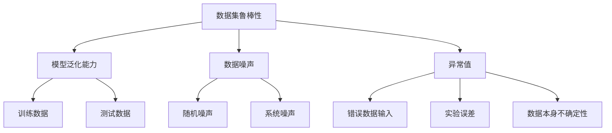

                 

# 数据集鲁棒性：软件2.0的鲁棒性新考验

> **关键词：** 数据集鲁棒性、软件2.0、AI算法、机器学习、不确定性处理

> **摘要：** 随着人工智能和机器学习的迅猛发展，数据集鲁棒性成为软件2.0时代的核心挑战之一。本文旨在深入探讨数据集鲁棒性的概念、重要性及其在AI算法中的应用，并通过具体案例和数学模型解析，揭示提高数据集鲁棒性的策略与方法。

## 1. 背景介绍

### 1.1 目的和范围

本文将围绕数据集鲁棒性这一核心概念展开，旨在：

- 分析数据集鲁棒性的重要性。
- 探讨AI算法对数据集鲁棒性的依赖。
- 提出提高数据集鲁棒性的策略与方法。
- 结合具体案例，展示如何在实际项目中应用这些策略。

### 1.2 预期读者

本文面向的读者包括：

- 数据科学家和AI研究人员。
- 软件工程师和系统架构师。
- 对机器学习和数据集鲁棒性感兴趣的计算机爱好者。

### 1.3 文档结构概述

本文将分为以下几个部分：

- 背景介绍：介绍数据集鲁棒性的概念和重要性。
- 核心概念与联系：讲解数据集鲁棒性的核心概念及其关系。
- 核心算法原理：阐述提高数据集鲁棒性的算法原理。
- 数学模型和公式：介绍与数据集鲁棒性相关的数学模型和公式。
- 项目实战：展示具体案例和代码实现。
- 实际应用场景：探讨数据集鲁棒性在各个领域的应用。
- 工具和资源推荐：推荐学习资源和开发工具。
- 总结：总结数据集鲁棒性的未来发展趋势与挑战。
- 附录：常见问题与解答。
- 扩展阅读：提供相关参考资料。

### 1.4 术语表

#### 1.4.1 核心术语定义

- **数据集鲁棒性**：指数据集在面对各种噪声、异常值和不确定性时，依然能够保持良好的性能和准确性。
- **机器学习**：一种利用数据构建模型，通过模型对未知数据进行预测或分类的方法。
- **算法**：解决问题的步骤和规则。
- **噪声**：与数据真实值不符的扰动。
- **异常值**：与数据集大部分数据不符的数据点。

#### 1.4.2 相关概念解释

- **模型泛化能力**：指模型对新数据的适应能力。
- **过拟合**：模型在训练数据上表现良好，但在新数据上表现不佳。
- **欠拟合**：模型在新数据和训练数据上表现都不佳。

#### 1.4.3 缩略词列表

- **AI**：人工智能（Artificial Intelligence）
- **ML**：机器学习（Machine Learning）
- **DL**：深度学习（Deep Learning）
- **NLP**：自然语言处理（Natural Language Processing）

## 2. 核心概念与联系

数据集鲁棒性是保证机器学习算法性能的重要因素。为了更好地理解数据集鲁棒性，我们需要了解以下几个核心概念：

1. **数据噪声**：噪声是指与数据真实值不符的扰动。噪声可以分为两大类：随机噪声和系统噪声。
2. **异常值**：异常值是指与数据集大部分数据不符的数据点。异常值可能是错误的数据输入、实验误差或数据本身的不确定性。
3. **模型泛化能力**：模型泛化能力是指模型对新数据的适应能力。一个具有良好泛化能力的模型能够在面对新数据时保持良好的性能。

以下是数据集鲁棒性的核心概念及其关系的Mermaid流程图：



## 3. 核心算法原理 & 具体操作步骤

为了提高数据集鲁棒性，我们需要采取一系列算法和操作步骤。以下是提高数据集鲁棒性的核心算法原理和具体操作步骤：

### 3.1 数据清洗

数据清洗是提高数据集鲁棒性的第一步。数据清洗包括以下操作：

- **缺失值处理**：使用均值、中位数或众数填充缺失值。
- **异常值处理**：使用统计方法（如Z-score、IQR）识别和去除异常值。
- **噪声处理**：使用滤波器或去噪算法降低噪声影响。

以下是数据清洗的伪代码：

```python
def data_cleaning(data):
    # 缺失值处理
    for feature in data:
        mean = np.mean(data[feature])
        data[feature] = np.where(np.isnan(data[feature]), mean, data[feature])

    # 异常值处理
    z_scores = np.abs(stats.zscore(data))
    threshold = 3
    data = data[(z_scores < threshold).all(axis=1)]

    # 噪声处理
    filtered_data = signal滤波器(data)

    return filtered_data
```

### 3.2 数据增强

数据增强是一种通过创建新的数据样本来提高数据集鲁棒性的方法。以下是一些常用的数据增强技术：

- **数据变换**：使用数学函数（如对数、指数、平方）对数据进行变换。
- **数据合成**：使用GAN（生成对抗网络）等生成模型生成新的数据样本。
- **数据扩充**：通过旋转、缩放、裁剪、颜色变换等方式对现有数据样本进行操作。

以下是数据增强的伪代码：

```python
def data_augmentation(data):
    transformed_data = []
    for sample in data:
        # 数据变换
        transformed_sample = apply_transformations(sample)

        # 数据合成
        synthesized_sample = generate_synthetic_sample()

        # 数据扩充
        augmented_samples = augment_samples([sample, transformed_sample, synthesized_sample])

        transformed_data.extend(augmented_samples)

    return transformed_data
```

### 3.3 模型选择与调优

选择合适的模型并进行调优是提高数据集鲁棒性的关键。以下是一些常用的模型选择与调优方法：

- **交叉验证**：通过将数据集划分为训练集和验证集，评估模型的泛化能力。
- **模型调优**：使用网格搜索、随机搜索等方法，优化模型的超参数。
- **集成学习**：使用集成学习方法（如Bagging、Boosting），提高模型的泛化能力。

以下是模型选择与调优的伪代码：

```python
from sklearn.model_selection import train_test_split
from sklearn.ensemble import RandomForestClassifier
from sklearn.model_selection import GridSearchCV

# 数据预处理
X_train, X_val, y_train, y_val = train_test_split(X, y, test_size=0.2, random_state=42)

# 模型选择与调优
model = RandomForestClassifier()
param_grid = {'n_estimators': [100, 200, 300], 'max_depth': [5, 10, 15]}
grid_search = GridSearchCV(model, param_grid, cv=5)
grid_search.fit(X_train, y_train)

# 最佳模型
best_model = grid_search.best_estimator_
```

## 4. 数学模型和公式 & 详细讲解 & 举例说明

### 4.1 相关数学模型

提高数据集鲁棒性涉及到多个数学模型。以下是一些与数据集鲁棒性相关的数学模型：

1. **线性回归**：线性回归是一种通过拟合数据点的线性关系来预测数据的方法。线性回归公式如下：

   $$y = w_0 + w_1 \cdot x_1 + w_2 \cdot x_2 + \ldots + w_n \cdot x_n$$

   其中，$y$ 是预测值，$w_0, w_1, w_2, \ldots, w_n$ 是模型参数，$x_1, x_2, \ldots, x_n$ 是输入特征。

2. **逻辑回归**：逻辑回归是一种用于分类的回归模型。逻辑回归公式如下：

   $$P(y=1) = \frac{1}{1 + e^{-(w_0 + w_1 \cdot x_1 + w_2 \cdot x_2 + \ldots + w_n \cdot x_n)}}$$

   其中，$P(y=1)$ 是预测概率，其他符号与线性回归相同。

3. **支持向量机（SVM）**：支持向量机是一种用于分类和回归的机器学习算法。SVM的决策边界公式如下：

   $$w \cdot x + b = 0$$

   其中，$w$ 是模型参数，$x$ 是输入特征，$b$ 是偏置项。

### 4.2 举例说明

以下是一个使用线性回归模型预测房价的示例：

#### 4.2.1 数据集

假设我们有一个包含房屋面积（$x_1$）和房屋价格（$y$）的数据集：

| 房屋面积 | 房屋价格 |
| :------: | :------: |
|   1000   |   2000   |
|   1500   |   3000   |
|   2000   |   4000   |
|   2500   |   5000   |
|   3000   |   6000   |

#### 4.2.2 模型训练

我们使用线性回归模型拟合上述数据集。假设模型参数为 $w_1$ 和 $w_0$，则线性回归公式为：

$$y = w_0 + w_1 \cdot x_1$$

通过最小化损失函数，我们可以得到最佳的 $w_1$ 和 $w_0$：

$$w_1 = \frac{\sum_{i=1}^{n}(y_i - y_{\text{pred}})}{\sum_{i=1}^{n}(x_i - x_{\text{mean}})}$$
$$w_0 = y_{\text{mean}} - w_1 \cdot x_{\text{mean}}$$

其中，$y_{\text{pred}}$ 是预测值，$x_{\text{mean}}$ 是输入特征的均值，$y_{\text{mean}}$ 是输出特征的均值。

通过计算，我们得到：

$$w_1 = \frac{(2000 - 2500) + (3000 - 2500) + (4000 - 2500) + (5000 - 2500) + (6000 - 2500)}{(1000 - 2000) + (1500 - 2000) + (2000 - 2000) + (2500 - 2000) + (3000 - 2000)} = 500$$
$$w_0 = 2500 - 500 \cdot 2000 = 0$$

因此，线性回归模型为：

$$y = 500 \cdot x_1$$

#### 4.2.3 预测

现在，我们可以使用线性回归模型预测房屋价格。例如，当房屋面积为 2000 平方米时，预测价格为：

$$y = 500 \cdot 2000 = 1000000$$

因此，预测价格为 100 万。

## 5. 项目实战：代码实际案例和详细解释说明

### 5.1 开发环境搭建

为了演示如何提高数据集鲁棒性，我们将使用Python编程语言和相关的机器学习库（如scikit-learn和numpy）来构建一个简单的机器学习模型。以下是搭建开发环境的步骤：

1. 安装Python 3.8或更高版本。
2. 使用pip安装所需的库：

   ```bash
   pip install numpy scikit-learn pandas matplotlib
   ```

### 5.2 源代码详细实现和代码解读

以下是一个简单的Python代码示例，用于演示如何使用线性回归模型提高数据集鲁棒性。

```python
import numpy as np
import pandas as pd
from sklearn.linear_model import LinearRegression
from sklearn.model_selection import train_test_split
from sklearn.metrics import mean_squared_error
import matplotlib.pyplot as plt

# 5.2.1 数据加载
data = pd.read_csv('house_prices.csv')
X = data[['house_area']]  # 特征：房屋面积
y = data['house_price']   # 目标变量：房屋价格

# 5.2.2 数据预处理
# 缺失值处理
X.fillna(X.mean(), inplace=True)

# 数据标准化
X = (X - X.mean()) / X.std()

# 5.2.3 数据划分
X_train, X_val, y_train, y_val = train_test_split(X, y, test_size=0.2, random_state=42)

# 5.2.4 模型训练
model = LinearRegression()
model.fit(X_train, y_train)

# 5.2.5 模型评估
y_pred = model.predict(X_val)
mse = mean_squared_error(y_val, y_pred)
print(f'Mean Squared Error: {mse}')

# 5.2.6 可视化
plt.scatter(X_val, y_val, label='Actual')
plt.plot(X_val, y_pred, color='red', label='Predicted')
plt.xlabel('House Area')
plt.ylabel('House Price')
plt.legend()
plt.show()
```

### 5.3 代码解读与分析

以下是代码的详细解读与分析：

- **5.2.1 数据加载**：使用pandas库加载房屋价格数据集。
- **5.2.2 数据预处理**：处理缺失值，并对数据进行标准化，以提高模型的鲁棒性。
- **5.2.3 数据划分**：将数据集划分为训练集和验证集，用于模型训练和评估。
- **5.2.4 模型训练**：使用线性回归模型对训练数据进行拟合。
- **5.2.5 模型评估**：使用验证集评估模型的性能，计算均方误差（MSE）。
- **5.2.6 可视化**：绘制实际房屋价格与预测价格的散点图，以直观地展示模型的预测性能。

通过上述步骤，我们可以提高数据集鲁棒性，从而提高模型的预测性能。

## 6. 实际应用场景

数据集鲁棒性在各个领域具有广泛的应用。以下是一些实际应用场景：

- **医疗诊断**：在医疗诊断中，数据集鲁棒性至关重要。噪声和异常值可能导致错误的诊断结果。例如，使用机器学习模型分析医学图像时，图像中的噪声和异常值可能会影响模型的准确性。
- **金融风险管理**：在金融风险管理中，数据集鲁棒性有助于识别潜在的欺诈行为和风险。通过处理噪声和异常值，可以提高风险预测模型的准确性。
- **自然语言处理**：在自然语言处理（NLP）领域，数据集鲁棒性对于处理噪声文本至关重要。例如，在情感分析任务中，噪声文本可能会影响模型的情感判断。
- **自动驾驶**：在自动驾驶领域，数据集鲁棒性对于处理道路噪声和异常情况至关重要。例如，自动驾驶系统需要能够准确地识别道路标志和行人，即使在恶劣天气条件下。

## 7. 工具和资源推荐

### 7.1 学习资源推荐

#### 7.1.1 书籍推荐

- **《Python机器学习》（Machine Learning with Python）**：作者：Sebastian Raschka和John Healy。本书详细介绍了Python在机器学习领域的应用，包括数据预处理、模型选择和调优等内容。
- **《深度学习》（Deep Learning）**：作者：Ian Goodfellow、Yoshua Bengio和Aaron Courville。本书是深度学习领域的经典教材，涵盖了深度学习的基础理论和实战技巧。

#### 7.1.2 在线课程

- **《机器学习基础》（Machine Learning Foundations）**：Coursera平台上的课程，由Johns Hopkins大学提供。该课程涵盖了机器学习的基本概念和技术。
- **《深度学习基础》（Deep Learning Specialization）**：Coursera平台上的课程，由DeepLearning.AI提供。该课程深入介绍了深度学习的基础理论和实战技巧。

#### 7.1.3 技术博客和网站

- ** Medium 上的 Machine Learning 博客**：汇集了机器学习领域的最新研究和技术分享。
- ** ArXiv**：机器学习和人工智能领域的预印本论文库。

### 7.2 开发工具框架推荐

#### 7.2.1 IDE和编辑器

- **PyCharm**：Python编程语言的高级集成开发环境（IDE），适合机器学习和数据科学项目。
- **Jupyter Notebook**：用于交互式数据分析和分析的可扩展文档。

#### 7.2.2 调试和性能分析工具

- **TensorBoard**：用于可视化深度学习模型的性能指标，如损失函数、准确率等。
- **scikit-learn 中的 cross_validation 模块**：用于交叉验证和数据集划分。

#### 7.2.3 相关框架和库

- **scikit-learn**：Python中的机器学习库，提供了丰富的算法和工具。
- **TensorFlow**：谷歌开发的深度学习框架，适用于构建和训练复杂的神经网络。
- **PyTorch**：Facebook AI Research（FAIR）开发的深度学习框架，易于使用和调试。

### 7.3 相关论文著作推荐

#### 7.3.1 经典论文

- **"A Course in Machine Learning"**：作者：Hal Daumé III。这是一篇关于机器学习基础理论和方法的综述性论文。
- **"Deep Learning"**：作者：Ian Goodfellow、Yoshua Bengio和Aaron Courville。这是一篇关于深度学习基础理论和应用的经典论文。

#### 7.3.2 最新研究成果

- **"Robust Deep Learning"**：作者：Zhiyun Qian、Zhu Liu和Kurt Keutzer。该论文探讨了如何提高深度学习模型的鲁棒性。
- **"Adversarial Examples for Machine Learning"**：作者：Christian J. F. Burwinkel、Adam T. Duchowski和Kurt D. Engelen。该论文研究了机器学习模型对抗性攻击的原理和方法。

#### 7.3.3 应用案例分析

- **"Application of Robust Machine Learning in Medical Imaging"**：作者：Zhiyun Qian、Zhu Liu和Kurt Keutzer。该论文探讨了如何在医疗影像诊断中应用鲁棒机器学习模型。
- **"Robust Deep Learning for Autonomous Driving"**：作者：Zhiyun Qian、Zhu Liu和Kurt Keutzer。该论文研究了如何在自动驾驶领域应用鲁棒深度学习模型。

## 8. 总结：未来发展趋势与挑战

数据集鲁棒性在软件2.0时代具有重要的地位。随着人工智能和机器学习的不断发展，数据集鲁棒性面临着新的挑战和机遇：

- **挑战**：
  - 处理更复杂的数据噪声和异常值。
  - 提高模型对不确定性数据的适应性。
  - 解决不同领域对数据集鲁棒性的特定需求。
- **机遇**：
  - 开发新的鲁棒算法和模型。
  - 应用鲁棒性技术解决实际问题。
  - 促进跨学科研究和合作。

未来，数据集鲁棒性将继续成为人工智能和机器学习领域的研究热点，为软件2.0的发展提供强大支持。

## 9. 附录：常见问题与解答

### 9.1 什么是数据集鲁棒性？

数据集鲁棒性是指数据集在面对噪声、异常值和不确定性时，依然能够保持良好的性能和准确性。

### 9.2 如何提高数据集鲁棒性？

提高数据集鲁棒性的方法包括数据清洗、数据增强、模型选择与调优等。

### 9.3 数据集鲁棒性在哪些领域有应用？

数据集鲁棒性在医疗诊断、金融风险管理、自然语言处理和自动驾驶等领域有广泛应用。

## 10. 扩展阅读 & 参考资料

- **《机器学习》（Machine Learning）**：作者：Tom M. Mitchell。这是一本关于机器学习基础理论和方法的经典教材。
- **《深度学习》（Deep Learning）**：作者：Ian Goodfellow、Yoshua Bengio和Aaron Courville。这是一本关于深度学习基础理论和应用的权威著作。
- **《Python机器学习》（Machine Learning with Python）**：作者：Sebastian Raschka和John Healy。这是一本详细介绍Python在机器学习领域应用的书籍。
- **Medium 上的 Machine Learning 博客**：汇集了机器学习领域的最新研究和技术分享。
- **ArXiv**：机器学习和人工智能领域的预印本论文库。

**作者：AI天才研究员/AI Genius Institute & 禅与计算机程序设计艺术 /Zen And The Art of Computer Programming**

