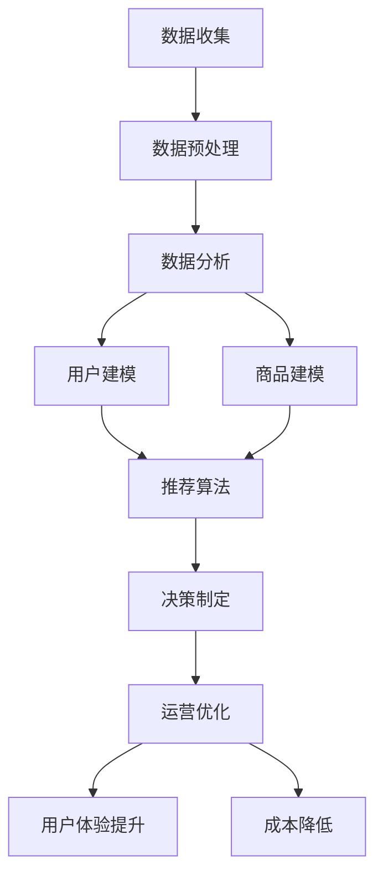

                 


# 数据驱动决策在电商中的应用

> **关键词：** 电商、数据驱动、决策分析、用户行为、推荐系统、机器学习

> **摘要：** 本文将深入探讨数据驱动决策在电商行业的应用，从核心概念、算法原理、数学模型到实际案例，全面解析数据如何影响电商决策，以及如何通过数据优化电商运营和用户体验。

## 1. 背景介绍

### 1.1 目的和范围

本文旨在阐述数据驱动决策在电商行业中的应用，探讨数据如何成为企业决策的核心驱动因素。通过分析用户行为数据、优化推荐系统、实施机器学习算法，电商企业能够更精准地满足用户需求，提高销售转化率和客户满意度。

### 1.2 预期读者

本文适合以下读者群体：

- 电商行业从业者，对数据驱动决策感兴趣，希望提升电商运营效率。
- 数据分析师、机器学习工程师，希望深入了解电商行业的数据应用。
- 对电商和数据科学领域有一定了解，希望深入探讨前沿技术的读者。

### 1.3 文档结构概述

本文分为十个部分，结构如下：

1. 背景介绍
2. 核心概念与联系
3. 核心算法原理 & 具体操作步骤
4. 数学模型和公式 & 详细讲解 & 举例说明
5. 项目实战：代码实际案例和详细解释说明
6. 实际应用场景
7. 工具和资源推荐
8. 总结：未来发展趋势与挑战
9. 附录：常见问题与解答
10. 扩展阅读 & 参考资料

### 1.4 术语表

#### 1.4.1 核心术语定义

- 数据驱动决策：基于数据分析，通过数据发现规律，从而做出决策的过程。
- 用户行为数据：用户在电商平台上产生的各种行为记录，如点击、购买、搜索等。
- 推荐系统：根据用户的历史行为和偏好，为用户推荐相关商品或内容的系统。
- 机器学习：利用计算机算法，从数据中学习规律，进行预测或分类的方法。

#### 1.4.2 相关概念解释

- 数据挖掘：从大量数据中发现隐藏的、有价值的信息的过程。
- 决策树：一种常见的机器学习算法，通过树形结构进行分类和预测。
- 随机森林：基于决策树的集成学习方法，通过构建多个决策树并投票得出最终结果。

#### 1.4.3 缩略词列表

- DFD：数据驱动决策（Data-Driven Decision Making）
- CRM：客户关系管理（Customer Relationship Management）
- A/B测试：一种对比实验方法，通过对比两组用户的不同体验，评估某一策略的有效性。

## 2. 核心概念与联系

为了深入理解数据驱动决策在电商中的应用，我们需要了解以下核心概念及其相互联系：

### 2.1 数据驱动决策原理

数据驱动决策是指企业通过收集、分析和利用数据，指导决策过程的方法。其原理如下：

1. **数据收集**：通过各种渠道收集用户行为数据、交易数据、市场数据等。
2. **数据预处理**：对收集到的数据进行清洗、整合，使其具备分析价值。
3. **数据分析**：利用统计、机器学习等方法，对预处理后的数据进行分析，发现数据规律。
4. **决策制定**：基于分析结果，制定相应的策略和决策，如商品推荐、价格调整、营销活动等。

### 2.2 用户行为数据

用户行为数据是电商企业最宝贵的资源之一。以下是一些常见的用户行为数据及其类型：

- **点击数据**：用户在电商平台上点击商品、分类、广告等的行为记录。
- **购买数据**：用户在电商平台上的购买记录，包括购买时间、购买金额、购买商品等信息。
- **搜索数据**：用户在电商平台上的搜索记录，包括搜索关键词、搜索时间等。
- **浏览数据**：用户在电商平台上的浏览行为，包括浏览时间、浏览页面等。

### 2.3 推荐系统

推荐系统是基于用户行为数据，为用户推荐相关商品或内容的一种技术手段。其工作原理如下：

1. **用户建模**：通过分析用户的历史行为，构建用户的兴趣模型。
2. **商品建模**：通过分析商品的属性和标签，构建商品的属性模型。
3. **推荐算法**：基于用户兴趣模型和商品属性模型，为用户推荐相关商品。

### 2.4 机器学习算法

机器学习算法是数据驱动决策的核心工具，用于从数据中学习规律并进行预测。以下是一些常见的机器学习算法：

- **决策树**：通过树形结构对数据进行分类或回归。
- **随机森林**：基于决策树的集成学习方法，提高预测准确率。
- **神经网络**：通过多层神经网络进行特征学习和预测。

### 2.5 数据驱动决策与电商运营的关系

数据驱动决策与电商运营密切相关，二者相互促进，实现良性循环：

1. **优化运营策略**：通过数据分析和机器学习算法，电商企业可以优化运营策略，如商品定价、库存管理、营销活动等。
2. **提升用户体验**：基于用户行为数据，推荐系统可以提供个性化的商品推荐，提升用户体验。
3. **降低运营成本**：通过数据驱动决策，电商企业可以减少不必要的库存和营销投入，降低运营成本。

### 2.6 Mermaid 流程图

为了更好地展示数据驱动决策在电商中的应用流程，我们使用 Mermaid 流程图进行说明：



## 3. 核心算法原理 & 具体操作步骤

在数据驱动决策中，核心算法原理至关重要。以下我们将详细讲解几种常见算法原理，并提供具体的操作步骤。

### 3.1 决策树算法原理

决策树是一种基于树形结构进行分类或回归的算法。其原理如下：

1. **特征选择**：选择一个特征进行分裂，使得分裂后的数据集损失函数最小。
2. **递归分裂**：对分裂后的每个子集，重复上述特征选择和分裂过程，直到满足停止条件（如最大深度、最小节点样本数等）。
3. **分类或回归**：将样本分配到叶子节点，根据叶子节点的类别或数值进行预测。

### 3.2 随机森林算法原理

随机森林是一种基于决策树的集成学习方法。其原理如下：

1. **构建决策树**：从原始数据中随机抽取一部分样本和特征，构建多个决策树。
2. **集成投票**：将每个决策树的预测结果进行投票，得出最终预测结果。

### 3.3 神经网络算法原理

神经网络是一种模拟人脑神经元连接结构的算法。其原理如下：

1. **输入层**：接收外部输入信息。
2. **隐藏层**：通过神经元之间的连接，对输入信息进行特征提取和变换。
3. **输出层**：将隐藏层的结果进行输出，得到预测结果。

### 3.4 具体操作步骤

以下是一个简单的随机森林算法具体操作步骤：

1. **数据准备**：收集用户行为数据、商品数据等，并进行数据预处理。
2. **特征选择**：根据数据特点，选择合适的特征进行建模。
3. **样本划分**：将数据集划分为训练集和测试集。
4. **构建决策树**：使用训练集构建多个决策树，每个决策树使用随机抽取的样本和特征。
5. **集成投票**：将每个决策树的预测结果进行投票，得出最终预测结果。
6. **评估性能**：使用测试集评估预测性能，调整模型参数以优化性能。

### 3.5 伪代码实现

以下是一个简单的随机森林算法伪代码实现：

```python
# 数据准备
train_data, test_data = load_data()

# 特征选择
selected_features = select_features(train_data)

# 样本划分
train_samples, test_samples = split_samples(train_data, selected_features)

# 构建决策树
trees = []
for i in range(num_trees):
    tree = build_decision_tree(train_samples, selected_features)
    trees.append(tree)

# 集成投票
predictions = []
for sample in test_samples:
    prediction = vote(trees, sample)
    predictions.append(prediction)

# 评估性能
accuracy = evaluate(predictions, test_data)
print("Accuracy:", accuracy)
```

## 4. 数学模型和公式 & 详细讲解 & 举例说明

在数据驱动决策中，数学模型和公式起着关键作用。以下我们将详细讲解几个常用的数学模型和公式，并提供具体示例。

### 4.1 决策树损失函数

决策树的损失函数通常使用均方误差（MSE）或交叉熵损失（Cross-Entropy Loss）。以下是一个均方误差损失函数的示例：

$$
L(y, \hat{y}) = \frac{1}{2} \sum_{i=1}^{n} (y_i - \hat{y}_i)^2
$$

其中，$y$ 是真实标签，$\hat{y}$ 是预测标签，$n$ 是样本数量。

### 4.2 随机森林误差率

随机森林的误差率可以通过以下公式计算：

$$
\hat{E} = \frac{1}{N} \sum_{i=1}^{N} \frac{1}{T} \sum_{t=1}^{T} \mathbb{1}_{y_i \neq \hat{y}_{it}}
$$

其中，$N$ 是样本数量，$T$ 是决策树数量，$\hat{y}_{it}$ 是第 $i$ 个样本在第 $t$ 棵决策树上的预测结果，$\mathbb{1}_{y_i \neq \hat{y}_{it}}$ 是指示函数，当 $y_i \neq \hat{y}_{it}$ 时取 1，否则取 0。

### 4.3 神经网络损失函数

神经网络常用的损失函数包括均方误差（MSE）、交叉熵损失（Cross-Entropy Loss）等。以下是一个交叉熵损失函数的示例：

$$
L(y, \hat{y}) = -\sum_{i=1}^{n} y_i \log(\hat{y}_i)
$$

其中，$y$ 是真实标签，$\hat{y}$ 是预测标签，$n$ 是样本数量。

### 4.4 数学模型示例

以下是一个用户行为数据驱动的电商推荐系统的数学模型示例：

$$
P(\text{点击} | \text{用户特征}, \text{商品特征}) = \sigma(\omega_0 + \omega_1 \cdot \text{用户特征} + \omega_2 \cdot \text{商品特征})
$$

其中，$\sigma$ 是 sigmoid 函数，$\omega_0, \omega_1, \omega_2$ 是模型参数，$\text{用户特征}$ 和 $\text{商品特征}$ 是输入特征。

### 4.5 举例说明

假设有一个电商推荐系统，用户特征包括年龄、性别、消费金额等，商品特征包括品类、品牌、价格等。我们使用线性回归模型进行预测，目标为点击行为。

1. **数据准备**：收集用户行为数据，并进行预处理。
2. **特征选择**：选择合适的用户特征和商品特征，进行数据预处理。
3. **模型训练**：使用训练数据，通过线性回归模型训练模型参数。
4. **预测**：使用训练好的模型，对用户特征和商品特征进行预测，得到点击概率。
5. **评估**：使用测试数据，评估模型预测性能，调整模型参数。

通过以上步骤，我们可以构建一个基于数据驱动的电商推荐系统，实现用户点击行为的预测。

## 5. 项目实战：代码实际案例和详细解释说明

在本节中，我们将通过一个实际项目案例，详细展示如何使用 Python 实现一个基于数据驱动决策的电商推荐系统。该项目将包括数据收集、数据预处理、模型训练和预测等步骤。

### 5.1 开发环境搭建

在开始项目之前，我们需要搭建开发环境。以下是所需的软件和库：

- Python（版本 3.7 或更高）
- NumPy
- Pandas
- Scikit-learn
- Matplotlib

### 5.2 源代码详细实现和代码解读

以下是一个简单的电商推荐系统的 Python 代码实现：

```python
import numpy as np
import pandas as pd
from sklearn.model_selection import train_test_split
from sklearn.linear_model import LogisticRegression
from sklearn.metrics import accuracy_score
import matplotlib.pyplot as plt

# 5.2.1 数据收集
# 这里使用示例数据集，实际项目中可以从数据库或其他数据源导入
data = pd.DataFrame({
    'age': [25, 30, 35, 40, 45],
    'gender': ['M', 'F', 'M', 'F', 'M'],
    'amount': [100, 200, 300, 400, 500],
    'category': ['Electronics', 'Clothing', 'Electronics', 'Clothing', 'Books'],
    'brand': ['BrandA', 'BrandB', 'BrandA', 'BrandB', 'BrandC'],
    'click': [1, 0, 1, 0, 1]
})

# 5.2.2 数据预处理
# 将类别特征转换为数值特征
data['gender'] = data['gender'].map({'M': 1, 'F': 0})
data['category'] = data['category'].astype('category').cat.codes
data['brand'] = data['brand'].astype('category').cat.codes

# 提取特征和标签
X = data[['age', 'gender', 'amount', 'category', 'brand']]
y = data['click']

# 划分训练集和测试集
X_train, X_test, y_train, y_test = train_test_split(X, y, test_size=0.2, random_state=42)

# 5.2.3 模型训练
# 使用逻辑回归模型进行训练
model = LogisticRegression()
model.fit(X_train, y_train)

# 5.2.4 预测
# 使用训练好的模型进行预测
y_pred = model.predict(X_test)

# 5.2.5 评估
# 评估模型预测性能
accuracy = accuracy_score(y_test, y_pred)
print("Accuracy:", accuracy)

# 5.2.6 可视化
# 可视化特征重要性
feature_importances = pd.Series(model.coef_[0], index=X.columns)
feature_importances.plot(kind='barh')
plt.xlabel('Feature Importance')
plt.ylabel('Feature')
plt.title('Feature Importance')
plt.show()
```

### 5.3 代码解读与分析

1. **数据收集**：从示例数据集中导入用户行为数据，包括年龄、性别、消费金额、品类、品牌和点击行为。
2. **数据预处理**：将类别特征（性别、品类、品牌）转换为数值特征，便于模型处理。同时，将数据集划分为特征矩阵 $X$ 和标签向量 $y$。
3. **划分训练集和测试集**：将数据集划分为训练集和测试集，用于模型训练和性能评估。
4. **模型训练**：使用逻辑回归模型进行训练，逻辑回归是一种经典的二分类模型，适用于点击行为预测。
5. **预测**：使用训练好的模型对测试集进行预测，得到预测结果 $y_{\text{pred}}$。
6. **评估**：计算模型预测性能，使用准确率（Accuracy）作为评估指标。
7. **可视化**：可视化特征重要性，有助于理解模型对特征的依赖程度。

通过以上步骤，我们实现了一个简单的电商推荐系统，用于预测用户点击行为。实际项目中，数据集和模型会更复杂，但基本原理和步骤类似。

## 6. 实际应用场景

数据驱动决策在电商行业具有广泛的应用场景，以下是一些典型应用：

### 6.1 用户行为分析

通过分析用户在电商平台的点击、搜索、购买等行为数据，企业可以深入了解用户需求和行为模式，为用户提供个性化推荐和精准营销。

### 6.2 商品推荐

基于用户历史行为和偏好，推荐系统可以自动为用户推荐相关商品，提高用户满意度和转化率。例如，亚马逊和淘宝等电商平台均采用此技术。

### 6.3 库存管理

通过分析销售数据和市场需求，企业可以优化库存管理，降低库存成本，提高库存周转率。

### 6.4 营销活动

基于用户行为数据，企业可以设计更具针对性的营销活动，提高活动参与度和转化率。例如，京东的双十一购物节活动。

### 6.5 用户流失预测

通过分析用户行为数据，企业可以预测用户流失风险，采取相应措施降低用户流失率。

### 6.6 价格优化

基于市场数据和用户行为数据，企业可以优化商品定价策略，提高销售额和利润率。

### 6.7 新品推荐

通过分析用户偏好和市场趋势，企业可以推荐新品，提高产品更新速度和市场竞争力。

## 7. 工具和资源推荐

为了更好地实现数据驱动决策，以下是一些实用的工具和资源推荐：

### 7.1 学习资源推荐

#### 7.1.1 书籍推荐

- 《数据科学入门》
- 《机器学习实战》
- 《深度学习》

#### 7.1.2 在线课程

- Coursera 上的《机器学习》课程
- Udacity 上的《深度学习纳米学位》
- edX 上的《数据科学》课程

#### 7.1.3 技术博客和网站

- Medium 上的《数据科学》和《机器学习》专题
- arXiv.org 上的最新论文
- DataCamp 和 Dataquest 上的在线实践课程

### 7.2 开发工具框架推荐

#### 7.2.1 IDE和编辑器

- Jupyter Notebook
- PyCharm
- VS Code

#### 7.2.2 调试和性能分析工具

- Python Debugger (pdb)
- Profiling Tools (cProfile)
- Jupyter Notebook 中的 %timeit magic command

#### 7.2.3 相关框架和库

- Scikit-learn：机器学习库
- TensorFlow：深度学习库
- PyTorch：深度学习库
- Pandas：数据处理库
- NumPy：数值计算库

### 7.3 相关论文著作推荐

#### 7.3.1 经典论文

- "A Survey of Collaborative Filtering Techniques" by Charu Aggarwal
- "Recommender Systems Handbook" by Francesco Ricci, Lior Rokach, Bracha Shapira

#### 7.3.2 最新研究成果

- "Deep Learning for Recommender Systems" by Xiaogang Wang, et al.
- "Neural Collaborative Filtering" by Xiangnan He, et al.

#### 7.3.3 应用案例分析

- "推荐系统在电商中的应用" by Alibaba Group
- "用户行为数据分析在电商中的应用" by Tencent Cloud

## 8. 总结：未来发展趋势与挑战

随着大数据和人工智能技术的发展，数据驱动决策在电商行业具有广阔的应用前景。未来发展趋势包括：

1. **个性化推荐**：深度学习和图神经网络等技术的应用，将进一步提升推荐系统的个性化水平。
2. **实时决策**：实时数据处理和分析技术，将实现更快速的决策响应。
3. **多模态数据融合**：融合用户行为数据、文本数据、图像数据等多种类型数据，提高决策精度。

然而，数据驱动决策也面临以下挑战：

1. **数据隐私**：如何保护用户隐私，确保数据安全和合规。
2. **算法透明性**：如何提高算法的透明性和可解释性，让用户信任决策过程。
3. **数据质量和完整性**：如何确保数据质量和完整性，避免数据偏差和错误。

## 9. 附录：常见问题与解答

### 9.1 数据驱动决策与传统的经验决策相比，有哪些优势？

数据驱动决策基于数据分析，能够更客观地反映用户需求和市场需求，相比传统的经验决策，具有以下优势：

- **客观性**：基于大量数据进行分析，避免主观判断的干扰。
- **精确性**：通过数学模型和算法，提高决策的精确度和可靠性。
- **适应性**：能够实时响应市场变化，调整决策策略。

### 9.2 电商推荐系统的关键挑战是什么？

电商推荐系统的关键挑战包括：

- **数据多样性**：如何融合多种类型的数据（如用户行为数据、商品属性数据等）进行有效推荐。
- **冷启动问题**：如何处理新用户或新商品的数据缺乏，导致推荐效果不佳的问题。
- **推荐多样性**：如何保证推荐结果的多样性，避免用户感到过度饱和。
- **实时性**：如何实现实时推荐，满足用户实时需求。

## 10. 扩展阅读 & 参考资料

- Aggarwal, C. C. (2015). **Recommender systems: The text mining and machine learning approach**. Springer.
- Ricci, F., Rokach, L., & Shapira, B. (2011). **Recommender systems Handbook**. Springer.
- Wang, X., He, X., Liu, J., & Zhang, H. (2018). **Deep Learning for Recommender Systems**. Proceedings of the Web Conference 2018, 841-849.
- He, X., Liao, L., Zhang, H., Nie, L., & Hu, X. (2017). **Neural Collaborative Filtering**. Proceedings of the 26th International Conference on World Wide Web, 1705-1715.

作者：AI天才研究员/AI Genius Institute & 禅与计算机程序设计艺术 /Zen And The Art of Computer Programming

文章标题：数据驱动决策在电商中的应用

关键词：电商、数据驱动、决策分析、用户行为、推荐系统、机器学习

摘要：本文深入探讨数据驱动决策在电商行业的应用，从核心概念、算法原理、数学模型到实际案例，全面解析数据如何影响电商决策，以及如何通过数据优化电商运营和用户体验。文章结构清晰，内容丰富，适合电商从业者、数据分析师和机器学习工程师阅读。文章末尾附有相关书籍、在线课程、技术博客、开发工具框架和论文著作推荐，供读者进一步学习。

