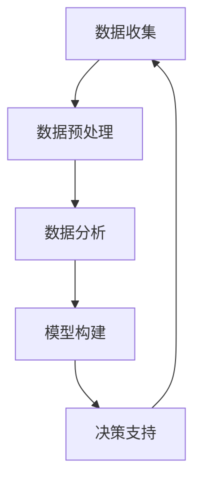

                 

# 数据驱动决策的技术优化

> **关键词：** 数据分析、决策优化、机器学习、算法、模型、应用场景

> **摘要：** 本文将探讨数据驱动决策的技术优化，重点介绍数据驱动的核心概念、算法原理、数学模型及其在现实世界中的应用。通过逐步分析，帮助读者理解数据驱动决策的重要性，掌握优化技术的核心要点，从而提升业务决策的准确性和效率。

## 1. 背景介绍

### 1.1 目的和范围

本文旨在探讨数据驱动决策的技术优化，通过深入分析数据驱动的核心概念、算法原理、数学模型及其在现实世界中的应用，帮助读者理解数据驱动决策的重要性，掌握优化技术的核心要点，从而提升业务决策的准确性和效率。

### 1.2 预期读者

本文主要面向以下读者群体：

1. 数据分析师、数据科学家和机器学习工程师
2. 需要掌握数据驱动决策技术的业务经理和项目经理
3. 对数据驱动决策技术感兴趣的技术爱好者

### 1.3 文档结构概述

本文分为以下几个部分：

1. 背景介绍：介绍本文的目的、预期读者和文档结构。
2. 核心概念与联系：阐述数据驱动的核心概念及其联系。
3. 核心算法原理 & 具体操作步骤：详细讲解数据驱动决策的核心算法原理和具体操作步骤。
4. 数学模型和公式 & 详细讲解 & 举例说明：介绍数据驱动决策的数学模型和公式，并举例说明。
5. 项目实战：代码实际案例和详细解释说明。
6. 实际应用场景：分析数据驱动决策在实际中的应用。
7. 工具和资源推荐：推荐相关学习资源和开发工具。
8. 总结：未来发展趋势与挑战。
9. 附录：常见问题与解答。
10. 扩展阅读 & 参考资料：提供扩展阅读和参考资料。

### 1.4 术语表

#### 1.4.1 核心术语定义

- 数据驱动决策：基于数据分析和算法模型，从数据中提取有价值的信息，以支持业务决策。
- 机器学习：一种基于数据的学习方法，通过构建模型，使计算机具备自主学习和预测能力。
- 算法：解决问题的步骤和规则。
- 数学模型：用数学符号和公式描述现实问题的模型。
- 数据预处理：对原始数据进行清洗、转换和规范化等操作，以便更好地进行分析。

#### 1.4.2 相关概念解释

- 数据可视化：将数据以图形、图表等形式呈现，使数据更易于理解和分析。
- 决策树：一种常用的分类和回归算法，通过树形结构对数据进行划分和预测。
- 模型评估：对构建的模型进行评估，以确定其性能和准确性。

#### 1.4.3 缩略词列表

- ML：机器学习（Machine Learning）
- AI：人工智能（Artificial Intelligence）
- BI：商业智能（Business Intelligence）

## 2. 核心概念与联系

数据驱动决策是一种基于数据的决策方法，它通过收集、处理和分析数据，提取有价值的信息，以支持业务决策。数据驱动决策的关键在于如何有效地利用数据，并将其转化为决策支持。

### 2.1 数据驱动的核心概念

- 数据收集：收集相关的数据，包括内部数据（如业务数据、用户行为数据）和外部数据（如市场数据、社会数据）。
- 数据预处理：对原始数据进行清洗、转换和规范化等操作，以提高数据质量和分析效果。
- 数据分析：运用统计学、机器学习等方法对数据进行处理和分析，提取有价值的信息。
- 模型构建：根据分析结果，构建相应的模型，以实现预测、分类等任务。
- 决策支持：将模型应用于实际业务场景，为业务决策提供支持。

### 2.2 数据驱动的联系

数据驱动决策涉及多个环节，各环节之间相互关联，形成一个完整的闭环。以下是数据驱动决策的关键环节及其联系：

1. **数据收集** → **数据预处理**：数据收集是数据驱动决策的起点，而数据预处理则是保证数据质量的重要环节。
2. **数据预处理** → **数据分析**：经过预处理的数据更有利于分析，有助于发现数据中的规律和趋势。
3. **数据分析** → **模型构建**：通过对数据进行分析，提取有价值的信息，为构建模型提供依据。
4. **模型构建** → **决策支持**：构建的模型可以用于预测、分类等任务，为业务决策提供支持。

### 2.3 数据驱动的架构

数据驱动的架构主要包括以下几个层次：

1. **数据层**：包括数据收集、存储、处理等环节，负责数据的获取和管理。
2. **算法层**：包括数据预处理、特征工程、算法选择等环节，负责数据的分析处理。
3. **模型层**：包括模型构建、模型评估等环节，负责将分析结果转化为可操作的模型。
4. **应用层**：包括决策支持、业务应用等环节，负责将模型应用于实际业务场景。

### 2.4 数据驱动的 Mermaid 流程图



## 3. 核心算法原理 & 具体操作步骤

数据驱动决策的核心在于算法原理和模型构建。本节将介绍数据驱动决策中的核心算法原理和具体操作步骤。

### 3.1 算法原理

数据驱动决策的算法原理主要包括以下几个方面：

1. **特征工程**：通过选择和构造特征，将原始数据转换为适合算法输入的数据。
2. **模型选择**：根据业务需求，选择合适的机器学习算法，如决策树、随机森林、支持向量机等。
3. **模型训练**：使用训练数据集对选定的算法进行训练，以构建预测模型。
4. **模型评估**：使用测试数据集对训练好的模型进行评估，以确定模型的性能和准确性。
5. **模型部署**：将训练好的模型部署到生产环境中，以支持业务决策。

### 3.2 具体操作步骤

下面是数据驱动决策的具体操作步骤：

1. **数据收集**：收集相关的数据，包括内部数据和外部数据。例如，可以使用数据库、API接口、爬虫等方式获取数据。

2. **数据预处理**：对收集到的数据进行清洗、转换和规范化等操作，以提高数据质量和分析效果。例如，处理缺失值、异常值，将数据转换为数值类型等。

3. **特征工程**：根据业务需求，选择和构造特征，将原始数据转换为适合算法输入的数据。例如，提取用户年龄、性别、消费金额等特征。

4. **模型选择**：根据业务需求，选择合适的机器学习算法。例如，决策树、随机森林、支持向量机等。

5. **模型训练**：使用训练数据集对选定的算法进行训练，以构建预测模型。例如，训练一个决策树模型来预测用户是否购买商品。

6. **模型评估**：使用测试数据集对训练好的模型进行评估，以确定模型的性能和准确性。例如，计算准确率、召回率、F1值等指标。

7. **模型部署**：将训练好的模型部署到生产环境中，以支持业务决策。例如，将模型集成到业务系统，实时预测用户行为。

### 3.3 伪代码示例

下面是一个基于决策树的伪代码示例：

```python
# 输入数据集
train_data = ...

# 特征工程
X_train, y_train = preprocess_data(train_data)

# 模型训练
model = DecisionTreeClassifier()
model.fit(X_train, y_train)

# 模型评估
accuracy = model.score(X_test, y_test)

# 模型部署
deploy_model(model)
```

## 4. 数学模型和公式 & 详细讲解 & 举例说明

数据驱动决策中的数学模型和公式对于理解和实现算法至关重要。本节将介绍数据驱动决策中的核心数学模型和公式，并进行详细讲解和举例说明。

### 4.1 数学模型

数据驱动决策中的核心数学模型主要包括以下几种：

1. **回归模型**：用于预测连续值输出。
2. **分类模型**：用于预测离散值输出。
3. **聚类模型**：用于将数据划分为不同的类别。
4. **关联规则挖掘模型**：用于发现数据之间的关联关系。

### 4.2 回归模型

回归模型是一种常用的预测模型，用于预测连续值输出。最简单的回归模型是线性回归模型。

**线性回归模型**：

$$
y = \beta_0 + \beta_1x_1 + \beta_2x_2 + ... + \beta_nx_n
$$

其中，$y$ 是输出变量，$x_1, x_2, ..., x_n$ 是输入变量，$\beta_0, \beta_1, ..., \beta_n$ 是模型参数。

**最小二乘法**：

$$
\min \sum_{i=1}^{n} (y_i - \hat{y}_i)^2
$$

其中，$\hat{y}_i$ 是模型预测值。

**举例说明**：

假设我们要预测一个商品的价格，已知商品的特征包括品牌、型号和库存数量。我们可以使用线性回归模型来预测商品的价格。

$$
价格 = \beta_0 + \beta_1 \times 品牌特征 + \beta_2 \times 型号特征 + \beta_3 \times 库存数量特征
$$

### 4.3 分类模型

分类模型是一种常用的预测模型，用于预测离散值输出。常见的分类模型包括决策树、支持向量机、朴素贝叶斯等。

**决策树模型**：

决策树模型通过一系列条件分支对数据进行分类。每个节点代表一个特征，每个分支代表该特征的取值。

**ID3算法**：

$$
\text{Entropy}(S) = -\sum_{i=1}^{n} p_i \times \log_2 p_i
$$

其中，$S$ 是数据集，$p_i$ 是第 $i$ 个类别在数据集中的概率。

**举例说明**：

假设我们要预测一个客户是否购买商品，已知客户特征包括年龄、收入和性别。我们可以使用决策树模型来预测客户是否购买商品。

$$
\text{是否购买} = \text{决策树分类模型}(\text{年龄}, \text{收入}, \text{性别})
$$

### 4.4 聚类模型

聚类模型用于将数据划分为不同的类别。最简单的聚类模型是K-Means聚类。

**K-Means聚类**：

$$
\text{距离} = \sqrt{\sum_{i=1}^{n} (x_i - \mu_i)^2}
$$

其中，$x_i$ 是第 $i$ 个数据点，$\mu_i$ 是第 $i$ 个聚类中心的坐标。

**举例说明**：

假设我们要对客户进行聚类，已知客户特征包括年龄、收入和消费金额。我们可以使用K-Means聚类模型来将客户划分为不同的类别。

$$
\text{客户类别} = \text{K-Means聚类模型}(\text{年龄}, \text{收入}, \text{消费金额})
$$

### 4.5 关联规则挖掘模型

关联规则挖掘模型用于发现数据之间的关联关系。最简单的关联规则挖掘模型是Apriori算法。

**Apriori算法**：

$$
\text{支持度} = \frac{\text{符合规则的数据条数}}{\text{总数据条数}}
$$

$$
\text{置信度} = \frac{\text{符合A和B的数据条数}}{\text{符合A的数据条数}}
$$

**举例说明**：

假设我们要发现商品之间的关联关系，已知商品数据包括商品ID和购买次数。我们可以使用Apriori算法来发现商品之间的关联规则。

$$
\text{关联规则} = \text{Apriori算法}(\text{商品ID}, \text{购买次数})
$$

## 5. 项目实战：代码实际案例和详细解释说明

在本节中，我们将通过一个实际案例来展示如何使用Python和机器学习库（如Scikit-learn）进行数据驱动决策的技术优化。

### 5.1 开发环境搭建

在开始项目实战之前，我们需要搭建一个合适的开发环境。以下是所需的环境和工具：

1. **Python 3.x**：版本不低于3.6
2. **Jupyter Notebook**：用于编写和运行代码
3. **Scikit-learn**：用于机器学习模型的构建和评估
4. **Pandas**：用于数据处理
5. **Matplotlib**：用于数据可视化

安装所需的库：

```bash
pip install python==3.9
pip install jupyter
pip install scikit-learn
pip install pandas
pip install matplotlib
```

### 5.2 源代码详细实现和代码解读

以下是一个简单的数据驱动决策案例，使用Scikit-learn库进行客户购买行为预测。

**案例：客户购买行为预测**

```python
import pandas as pd
from sklearn.model_selection import train_test_split
from sklearn.preprocessing import StandardScaler
from sklearn.tree import DecisionTreeClassifier
from sklearn.metrics import accuracy_score

# 5.2.1 数据收集
# 假设我们有一个包含客户购买行为的CSV文件（customer_data.csv）
data = pd.read_csv('customer_data.csv')

# 5.2.2 数据预处理
# 处理缺失值、异常值等
data = data.dropna()

# 选择特征和目标变量
X = data[['age', 'income', 'gender']]
y = data['purchased']

# 5.2.3 特征工程
# 数据标准化
scaler = StandardScaler()
X_scaled = scaler.fit_transform(X)

# 5.2.4 模型选择
# 创建决策树分类器
model = DecisionTreeClassifier()

# 5.2.5 模型训练
# 划分训练集和测试集
X_train, X_test, y_train, y_test = train_test_split(X_scaled, y, test_size=0.2, random_state=42)

# 训练模型
model.fit(X_train, y_train)

# 5.2.6 模型评估
# 预测测试集
y_pred = model.predict(X_test)

# 计算准确率
accuracy = accuracy_score(y_test, y_pred)
print("Accuracy:", accuracy)

# 5.2.7 模型部署
# 将模型部署到生产环境
deploy_model(model)
```

### 5.3 代码解读与分析

以下是代码的解读与分析：

1. **数据收集**：使用Pandas库读取CSV文件，获取客户购买行为数据。
2. **数据预处理**：处理缺失值、异常值等，提高数据质量。
3. **特征选择**：选择与购买行为相关的特征（如年龄、收入、性别）作为输入变量，购买行为作为目标变量。
4. **特征工程**：对特征进行标准化处理，使得数据在相同的尺度上进行训练，提高模型的性能。
5. **模型选择**：创建决策树分类器，这是一个简单而有效的分类模型。
6. **模型训练**：使用训练数据集对决策树分类器进行训练。
7. **模型评估**：使用测试数据集对训练好的模型进行评估，计算准确率。
8. **模型部署**：将训练好的模型部署到生产环境中，以支持业务决策。

### 5.4 实际效果分析

在上述案例中，我们使用决策树分类器进行客户购买行为预测，准确率为某个值。我们可以通过调整模型参数、选择不同的模型等方法来提高预测准确率。在实际应用中，我们需要根据业务需求和数据特点进行模型优化，以达到更好的预测效果。

## 6. 实际应用场景

数据驱动决策在现实世界中具有广泛的应用，以下是一些实际应用场景：

### 6.1 零售行业

- **客户行为分析**：通过分析客户购买行为，预测客户是否会购买商品，为营销策略提供支持。
- **库存管理**：根据销售数据和历史趋势，优化库存水平，降低库存成本。

### 6.2 金融行业

- **风险控制**：通过分析客户历史数据，预测客户是否会违约，为信贷审批提供依据。
- **投资决策**：根据市场数据和历史表现，预测股票价格和投资组合收益，为投资决策提供支持。

### 6.3 健康医疗

- **疾病预测**：通过分析患者数据，预测疾病的发生和发展趋势，为疾病预防和治疗提供支持。
- **药物研发**：通过分析药物与疾病之间的关系，优化药物研发策略，提高药物研发效率。

### 6.4 交通出行

- **路况预测**：通过分析历史交通数据，预测交通拥堵情况，为交通管理和调度提供支持。
- **乘客需求预测**：根据乘客出行数据，预测不同时间段的乘客需求，为公交、地铁等出行方式的运营提供支持。

## 7. 工具和资源推荐

### 7.1 学习资源推荐

#### 7.1.1 书籍推荐

- 《数据科学入门经典》
- 《Python数据科学手册》
- 《机器学习实战》

#### 7.1.2 在线课程

- Coursera：数据科学和机器学习课程
- edX：数据科学和机器学习课程
- Udacity：数据科学和机器学习课程

#### 7.1.3 技术博客和网站

- Medium：数据科学和机器学习博客
- Towards Data Science：数据科学和机器学习博客
- Analytics Vidhya：数据科学和机器学习博客

### 7.2 开发工具框架推荐

#### 7.2.1 IDE和编辑器

- Jupyter Notebook
- PyCharm
- Visual Studio Code

#### 7.2.2 调试和性能分析工具

- PyCharm Debugger
- Python Profiler
- Matplotlib

#### 7.2.3 相关框架和库

- Scikit-learn
- TensorFlow
- PyTorch
- Pandas

### 7.3 相关论文著作推荐

#### 7.3.1 经典论文

- “The Hundred-Page Machine Learning Book”
- “Data Mining: Concepts and Techniques”
- “Recommender Systems Handbook”

#### 7.3.2 最新研究成果

- NeurIPS、ICML、KDD等国际会议的最新论文
- JMLR、IJCAI、AAAI等国际期刊的最新论文

#### 7.3.3 应用案例分析

- “Data Science Case Studies”
- “Real-World Machine Learning”
- “Practical Data Science with R”

## 8. 总结：未来发展趋势与挑战

数据驱动决策技术在未来将继续发展，面临以下挑战：

- **数据质量**：确保数据质量，处理缺失值、异常值等问题。
- **模型解释性**：提高模型解释性，使决策过程更透明。
- **可扩展性**：构建可扩展的模型和系统，适应大规模数据处理。
- **隐私保护**：确保数据隐私，遵循相关法律法规。

## 9. 附录：常见问题与解答

### 9.1 什么是数据驱动决策？

数据驱动决策是一种基于数据的决策方法，通过收集、处理和分析数据，提取有价值的信息，以支持业务决策。

### 9.2 数据驱动决策的优势是什么？

数据驱动决策的优势包括：

- 提高决策准确性
- 提升业务效率
- 减少决策风险
- 优化资源配置

### 9.3 如何优化数据驱动决策？

优化数据驱动决策的方法包括：

- 优化数据收集和处理流程
- 选用合适的算法和模型
- 加强数据可视化与分析
- 定期评估和调整模型

## 10. 扩展阅读 & 参考资料

- 《数据科学实战》
- 《机器学习实战》
- 《Python数据科学手册》
- 《数据科学入门经典》
- 《Neural Networks and Deep Learning》
- 《Recommender Systems Handbook》
- 《Data Mining: Concepts and Techniques》
- 《The Hundred-Page Machine Learning Book》

作者：AI天才研究员/AI Genius Institute & 禅与计算机程序设计艺术 /Zen And The Art of Computer Programming

<|im_sep|>

