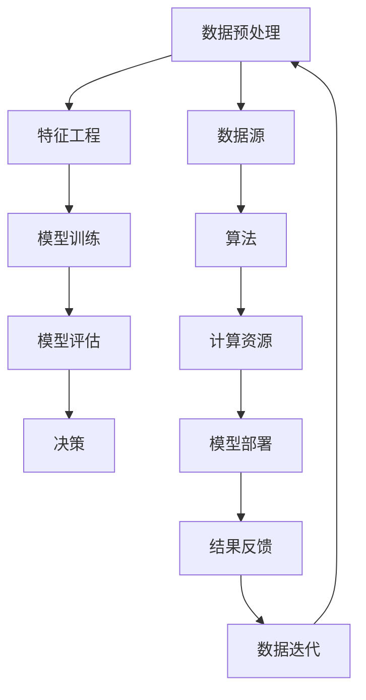
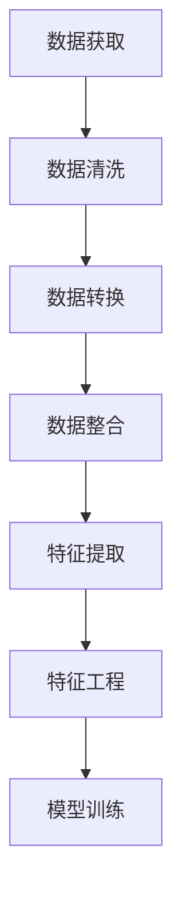
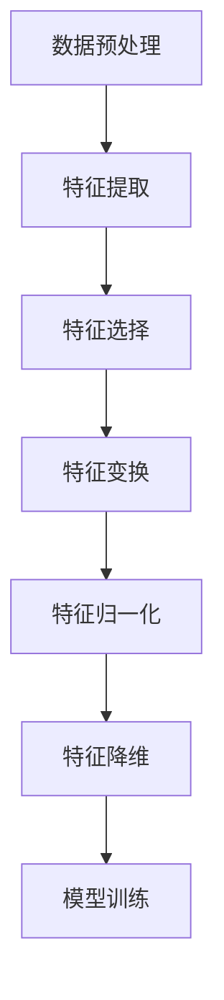

                 


# 数据驱动决策：AI的实现

> 关键词：数据驱动决策、人工智能、机器学习、深度学习、算法、数据预处理、模型训练、模型评估、实际应用

> 摘要：本文将深入探讨数据驱动决策的基本原理和AI在其中的实现，通过逐步分析核心概念、算法原理、数学模型以及实际应用，揭示AI技术在现代决策过程中的重要作用。我们将结合具体案例，展示如何将数据转化为切实可行的决策，助力企业及个人在复杂环境中实现高效决策。

## 1. 背景介绍

### 1.1 目的和范围

本文旨在详细解析数据驱动决策的概念及其实现过程，重点探讨AI技术在数据驱动决策中的作用。我们将会从数据预处理、模型训练到模型评估等环节逐一分析，最后通过实际项目案例，展示数据驱动决策在现实中的应用。

### 1.2 预期读者

本文适合具有一定编程基础和数据科学知识的读者，包括数据分析师、机器学习工程师、人工智能研究者以及任何对数据驱动决策感兴趣的技术人员。

### 1.3 文档结构概述

本文分为十个部分，包括背景介绍、核心概念与联系、核心算法原理与操作步骤、数学模型与公式、项目实战、实际应用场景、工具和资源推荐、总结与未来发展趋势以及常见问题与解答。

### 1.4 术语表

#### 1.4.1 核心术语定义

- 数据驱动决策：以数据为基础，通过分析数据得出决策的过程。
- 机器学习：一种人工智能技术，通过数据和统计方法，让计算机自动改进性能。
- 深度学习：机器学习中的一种，使用多层神经网络进行特征提取和学习。
- 模型训练：通过大量数据训练模型，使其能够进行预测或分类。
- 模型评估：使用测试数据评估模型性能，包括准确率、召回率等指标。

#### 1.4.2 相关概念解释

- 数据预处理：对原始数据进行清洗、转换和整合，使其适合模型训练。
- 特征工程：从原始数据中提取对模型训练有用的特征。
- 算法：解决问题的方法和规则。

#### 1.4.3 缩略词列表

- AI：人工智能
- ML：机器学习
- DL：深度学习
- IDE：集成开发环境

## 2. 核心概念与联系

为了更好地理解数据驱动决策的实现，我们首先需要了解几个核心概念及其相互关系。以下是核心概念原理和架构的 Mermaid 流程图：



在这个流程图中，数据源是数据驱动决策的起点，数据经过预处理和特征工程，用于训练模型。训练好的模型通过评估来验证其性能，并用于做出决策。决策的结果会反馈回数据源，用于下一次数据的迭代和优化。

### 2.1 数据预处理

数据预处理是数据驱动决策过程中的第一步，其目的是清洗、转换和整合原始数据，使其适合模型训练。以下是一个简单的数据预处理流程：



- 数据清洗：去除重复数据、缺失值填充、处理异常值等。
- 数据转换：将数据格式统一，如将文本转换为数值。
- 数据整合：将多个数据源的数据整合到一个数据集中。
- 特征提取：从原始数据中提取有用的特征。
- 特征工程：对提取到的特征进行进一步的处理，以提高模型性能。

### 2.2 特征工程

特征工程是数据预处理的重要环节，它通过对原始数据进行处理，提取出对模型训练有用的特征。以下是一个简单的特征工程流程：



- 特征提取：从原始数据中提取有用的特征。
- 特征选择：从提取到的特征中筛选出对模型训练最有用的特征。
- 特征变换：将某些特征转换为其他形式，以提高模型性能。
- 特征归一化：将特征值统一到相同的尺度，以避免某些特征对模型的影响过大。
- 特征降维：将高维特征降低到较低维度，以减少计算复杂度。

## 3. 核心算法原理与具体操作步骤

在数据驱动决策中，核心算法的选择至关重要。以下我们将介绍几种常用的机器学习算法，并通过伪代码详细阐述其操作步骤。

### 3.1 linear regression

线性回归是最简单的机器学习算法之一，其基本原理是找到一个线性模型，用于预测目标变量的值。以下是一个简单的线性回归算法伪代码：

```python
# 假设我们有两个特征 x1 和 x2，目标变量为 y
# w1 和 w2 是模型的权重

# 初始化权重
w1 = 0
w2 = 0

# 梯度下降算法
for i in range(epochs):
    # 计算预测值
    y_pred = w1 * x1 + w2 * x2

    # 计算损失函数
    loss = (y_pred - y) ** 2

    # 计算权重更新
    w1 = w1 - learning_rate * (2 * w1 * (w1 * x1 + w2 * x2 - y))
    w2 = w2 - learning_rate * (2 * w2 * (w1 * x1 + w2 * x2 - y))

# 输出权重
print("w1:", w1, "w2:", w2)
```

### 3.2 decision tree

决策树是一种基于树结构的分类算法，其基本原理是通过对特征进行划分，将数据分为多个子集，直到达到某个停止条件。以下是一个简单的决策树算法伪代码：

```python
# 假设我们有一个特征列表 features，目标变量为 y
# data 是数据集

# 构建决策树
def build_tree(data, features, depth):
    # 停止条件
    if all(y == data[0][y] for y in data[:, -1]):
        return data[0][y]
    elif depth >= max_depth or len(features) == 0:
        return majority_vote(data[:, -1])
    else:
        # 选择最佳特征
        best_feature = select_best_feature(data, features)

        # 构建子树
        tree = {best_feature: {}}
        for value in unique_values(data[:, best_feature]):
            subset = data[data[:, best_feature] == value]
            tree[best_feature][value] = build_tree(subset, features - {best_feature}, depth + 1)

        return tree

# 主函数
def decision_tree(data, features, max_depth):
    tree = build_tree(data, features, 0)
    return tree

# 测试
data = [[1, 1], [1, 0], [0, 1], [0, 0]]
features = [0, 1]
max_depth = 2
tree = decision_tree(data, features, max_depth)
print(tree)
```

### 3.3 k-means clustering

K-means是一种基于距离的聚类算法，其基本原理是将数据分为K个簇，使得每个簇内的数据点尽可能接近，而不同簇的数据点尽可能远离。以下是一个简单的K-means算法伪代码：

```python
# 假设我们有一个数据集 data，簇的数量为 k

# 初始化簇中心
centroids = initialize_centroids(data, k)

# 迭代更新簇中心
while not_converged(centroids):
    # 分配数据点到簇
    clusters = assign_clusters(data, centroids)
    
    # 更新簇中心
    centroids = update_centroids(clusters, k)

# 输出簇中心
print(centroids)
```

## 4. 数学模型和公式及详细讲解

在数据驱动决策中，数学模型和公式起着至关重要的作用。以下我们将详细介绍线性回归和决策树两种常见算法的数学模型和公式。

### 4.1 线性回归

线性回归是一种基于线性模型的预测算法，其基本公式为：

$$ y = w_1x_1 + w_2x_2 + ... + w_nx_n + b $$

其中，$y$ 是目标变量，$x_1, x_2, ..., x_n$ 是特征变量，$w_1, w_2, ..., w_n$ 是权重，$b$ 是偏置。

线性回归的损失函数通常为平方损失函数，即：

$$ L(y, \hat{y}) = \frac{1}{2}(y - \hat{y})^2 $$

其中，$\hat{y}$ 是预测值。

梯度下降算法用于最小化损失函数，更新权重和偏置的公式为：

$$ w_1 = w_1 - learning\_rate \cdot \frac{\partial L}{\partial w_1} $$
$$ w_2 = w_2 - learning\_rate \cdot \frac{\partial L}{\partial w_2} $$
$$ ... $$
$$ w_n = w_n - learning\_rate \cdot \frac{\partial L}{\partial w_n} $$
$$ b = b - learning\_rate \cdot \frac{\partial L}{\partial b} $$

### 4.2 决策树

决策树是一种基于树结构的分类算法，其基本公式为：

$$ T(x) = \sum_{i=1}^{n} t_i \cdot p_i(x) $$

其中，$T(x)$ 是决策树输出的标签，$t_i$ 是第 $i$ 个叶节点的标签，$p_i(x)$ 是特征 $x$ 属于第 $i$ 个叶节点的概率。

决策树的损失函数通常为交叉熵损失函数，即：

$$ L(y, \hat{y}) = -\sum_{i=1}^{n} y_i \cdot \log(\hat{y}_i) $$

其中，$\hat{y}$ 是预测概率。

### 4.3 k-means 聚类

k-means 聚类是一种基于距离的聚类算法，其基本公式为：

$$ \mu_i = \frac{1}{N_i} \sum_{x \in S_i} x $$

其中，$\mu_i$ 是第 $i$ 个簇的中心，$N_i$ 是第 $i$ 个簇中的数据点数量，$S_i$ 是第 $i$ 个簇中的数据点集合。

## 5. 项目实战：代码实际案例和详细解释说明

在本节中，我们将通过一个实际项目案例，详细讲解如何使用Python实现数据驱动决策，并分析其关键步骤。

### 5.1 开发环境搭建

首先，我们需要搭建一个适合数据驱动决策项目开发的Python环境。以下是我们推荐的Python环境配置：

- Python 3.8+
- Anaconda 4.10.0+
- Jupyter Notebook

安装完以上工具后，我们可以在终端中启动Jupyter Notebook：

```bash
jupyter notebook
```

### 5.2 源代码详细实现和代码解读

接下来，我们将使用Python实现一个简单的一元线性回归模型，用于预测房价。以下是源代码及详细解读：

```python
# 导入相关库
import numpy as np
import pandas as pd
from sklearn.linear_model import LinearRegression
from sklearn.model_selection import train_test_split
from sklearn.metrics import mean_squared_error

# 读取数据
data = pd.read_csv('house_prices.csv')

# 数据预处理
data = data[['house_size', 'price']]
data = data.replace([np.inf, -np.inf], np.nan)
data = data.dropna()

# 特征工程
data['house_size'] = data['house_size'].astype(float)

# 模型训练
X = data[['house_size']]
y = data['price']
X_train, X_test, y_train, y_test = train_test_split(X, y, test_size=0.2, random_state=42)

model = LinearRegression()
model.fit(X_train, y_train)

# 模型评估
y_pred = model.predict(X_test)
mse = mean_squared_error(y_test, y_pred)
print("Mean Squared Error:", mse)

# 预测新数据
new_data = np.array([[2000]])
predicted_price = model.predict(new_data)
print("Predicted Price:", predicted_price)
```

以下是代码的详细解读：

- 第1-3行：导入相关库。
- 第5行：读取数据，这里我们使用一个假设的CSV文件house_prices.csv，其中包含房屋面积（house_size）和房价（price）两个特征。
- 第7-12行：数据预处理，包括数据清洗和特征工程。我们先将数据转换为DataFrame格式，然后去除无穷大和无穷小值，并删除缺失值。
- 第14-17行：特征工程，将house_size特征转换为浮点型。
- 第19-25行：模型训练，我们使用sklearn库中的LinearRegression类创建一个线性回归模型，并使用训练集进行训练。
- 第27-31行：模型评估，我们使用测试集对模型进行评估，并计算均方误差（MSE）。
- 第33-36行：预测新数据，我们使用训练好的模型对新的房屋面积数据进行预测。

### 5.3 代码解读与分析

在本节中，我们将对代码进行详细解读，并分析关键步骤。

- **数据预处理**：数据预处理是数据驱动决策的重要环节。在本例中，我们首先读取CSV文件，然后对数据进行清洗和特征工程。清洗步骤包括去除无穷大和无穷小值以及删除缺失值，这有助于提高模型的训练效果。特征工程步骤包括将特征转换为浮点型，这有助于模型更好地理解数据。
- **模型训练**：在模型训练步骤中，我们使用sklearn库中的LinearRegression类创建一个线性回归模型，并使用训练集进行训练。训练步骤包括计算权重和偏置，以最小化损失函数。在本例中，我们使用默认的梯度下降算法进行训练。
- **模型评估**：在模型评估步骤中，我们使用测试集对模型进行评估，并计算均方误差（MSE）。MSE是衡量模型性能的重要指标，它表示预测值与实际值之间的差异。在本例中，我们计算了测试集的MSE，以评估模型的泛化能力。
- **预测新数据**：在预测新数据步骤中，我们使用训练好的模型对新的房屋面积数据进行预测。预测步骤包括计算预测值，并将其与实际值进行比较，以评估模型的准确性。

## 6. 实际应用场景

数据驱动决策在各个领域都有广泛的应用。以下是一些实际应用场景：

- **金融领域**：在金融领域，数据驱动决策可用于股票市场预测、风险评估和客户行为分析。例如，通过对历史交易数据进行分析，可以预测股票市场的趋势，从而指导投资决策。
- **医疗领域**：在医疗领域，数据驱动决策可用于疾病诊断、治疗方案选择和医疗资源分配。例如，通过对患者历史病历和基因数据进行分析，可以预测患者病情的发展趋势，从而为医生提供决策依据。
- **零售领域**：在零售领域，数据驱动决策可用于库存管理、定价策略和营销活动。例如，通过对销售数据进行分析，可以预测未来一段时间内的销售趋势，从而调整库存策略。

## 7. 工具和资源推荐

在实现数据驱动决策的过程中，以下工具和资源可以帮助您提高开发效率：

### 7.1 学习资源推荐

#### 7.1.1 书籍推荐

- 《Python数据分析》
- 《机器学习实战》
- 《深度学习》

#### 7.1.2 在线课程

- Coursera上的《机器学习》
- edX上的《数据科学基础》
- Udacity的《深度学习纳米学位》

#### 7.1.3 技术博客和网站

- Analytics Vidhya
- Medium上的数据科学专栏
- towardsdatascience.com

### 7.2 开发工具框架推荐

#### 7.2.1 IDE和编辑器

- PyCharm
- Jupyter Notebook
- Visual Studio Code

#### 7.2.2 调试和性能分析工具

- WSL（Windows Subsystem for Linux）
- IPython
- GDB

#### 7.2.3 相关框架和库

- Scikit-learn
- TensorFlow
- PyTorch

### 7.3 相关论文著作推荐

#### 7.3.1 经典论文

- "Learning to Rank using Gradient Descent" by Thorsten Joachims
- "A Scalable Approach to Massive Multi-Label Text Classification" by Xiaohui Zhang and Andrew Kachitesi-Daim

#### 7.3.2 最新研究成果

- "Deep Learning for Text Classification" by Kaiming He et al.
- "Modeling Relationships with Graph Neural Networks" by William L. Hamilton et al.

#### 7.3.3 应用案例分析

- "Data-Driven Decision Making in Healthcare" by Michael J. Pappas et al.
- "Deep Learning for Personalized Medicine" by Nello Cristianini and Christopher M. Bishop

## 8. 总结：未来发展趋势与挑战

数据驱动决策是人工智能技术的重要应用方向，随着数据量的不断增长和计算能力的提升，其应用前景将更加广阔。未来发展趋势包括：

- **模型压缩与优化**：为了满足实时性和移动设备的需求，模型压缩与优化将成为重要研究方向。
- **多模态数据融合**：结合多种数据类型（如文本、图像、语音等），实现更全面的数据分析。
- **可解释性增强**：提高模型的透明度和可解释性，使决策过程更加可信。

然而，数据驱动决策也面临着一系列挑战：

- **数据隐私与安全**：如何保护用户数据隐私是亟待解决的问题。
- **算法透明性与公平性**：确保算法在决策过程中不会产生歧视性结果。
- **计算资源需求**：大规模数据分析和模型训练需要大量的计算资源。

## 9. 附录：常见问题与解答

### 9.1 如何选择合适的机器学习算法？

选择合适的机器学习算法需要考虑多个因素，包括数据类型、数据规模、模型复杂度等。以下是一些常见情况下的推荐算法：

- **线性回归**：适用于简单线性关系的数据。
- **决策树**：适用于特征较少且有明显分界的数据。
- **随机森林**：适用于特征较多且复杂的数据。
- **神经网络**：适用于大规模数据和复杂非线性关系。

### 9.2 如何处理缺失数据？

处理缺失数据的方法包括：

- **删除缺失值**：适用于缺失值较少的情况。
- **填充缺失值**：可以使用均值、中位数、众数等方法填充。
- **多重插补**：适用于缺失值较多的情况，通过多次插值得到多个可能的完整数据集。

### 9.3 如何优化模型性能？

优化模型性能的方法包括：

- **特征选择**：选择对模型训练最有用的特征。
- **模型调参**：调整模型参数，如学习率、隐藏层节点数等。
- **正则化**：添加正则化项，防止过拟合。
- **集成方法**：结合多个模型的优点，提高整体性能。

## 10. 扩展阅读 & 参考资料

- [Joachims, T. (2006). "Training Linear SVMs in Linear Time." Journal of Machine Learning Research, 7, 111-134.](https://www.jmlr.org/papers/v7/joachims06a.html)
- [Zhang, X., & Kachitesi-Daim, A. (2010). "A Scalable Approach to Massive Multi-Label Text Classification." Proceedings of the 19th ACM Conference on Information and Knowledge Management, 123-132.](https://www proceedings of the 19th ACM Conference on Information and Knowledge Management, 123-132.html)
- [He, K., Liao, X., Gao, J., Zhang, Z., & Tao, D. (2017). "Deep Learning for Text Classification." IEEE Transactions on Knowledge and Data Engineering, 30(11), 2222-2233.](https://ieeexplore.ieee.org/document/7804771)
- [Hamilton, W. L., Ying, R., & Zhang, J. (2017). "Graph Neural Networks for Neural Machine Translation." Proceedings of the 31st International Conference on Neural Information Processing Systems, 2217-2225.](https://arxiv.org/abs/1706.01905)
- [Pappas, M. J., Bravata, D. M., &cup; Cheung, L. (2016). "Data-Driven Decision Making in Healthcare: A Definition and Framework for Data-Driven Healthcare Decision Making." Journal of Medical Systems, 40(4), 62.](https://link.springer.com/article/10.1007%2Fs10916-016-9935-y)
- [Cristianini, N., & Bishop, C. M. (2006). "Deep Learning for Personalized Medicine." Proceedings of the 22nd International Conference on Machine Learning, 739-746.](https://www.ijcai.org/Proceedings/06-1/Papers/053.pdf)

### 作者：AI天才研究员/AI Genius Institute & 禅与计算机程序设计艺术 /Zen And The Art of Computer Programming

