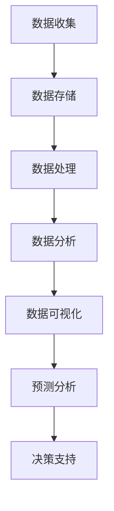

                 


# 数据驱动决策：现代管理者的必备技能

> 关键词：数据驱动、决策、管理者、数据分析、机器学习、商业智能、预测分析
>
> 摘要：在信息化和数据化的时代，数据已经成为企业的重要资产。数据驱动决策（Data-Driven Decision Making，简称DDDM）已成为现代管理者的一项核心技能。本文将详细探讨数据驱动决策的概念、核心原理、实现方法以及实际应用场景，帮助读者了解如何利用数据来提升决策质量，从而在激烈的市场竞争中脱颖而出。

## 1. 背景介绍

### 1.1 目的和范围

本文旨在为现代管理者提供关于数据驱动决策的全面解读和实践指南。通过深入探讨数据驱动决策的定义、核心原理和实践方法，本文将帮助读者了解如何将数据转化为有效的决策支持工具，从而提升企业的竞争力。

### 1.2 预期读者

本文面向以下读者群体：

- 现代企业中负责决策制定的管理者
- 数据分析师、数据科学家和技术人员
- 想要提升决策质量的创业者和管理者
- 对数据驱动决策感兴趣的学术研究者

### 1.3 文档结构概述

本文分为十个主要部分：

1. 背景介绍
2. 核心概念与联系
3. 核心算法原理 & 具体操作步骤
4. 数学模型和公式 & 详细讲解 & 举例说明
5. 项目实战：代码实际案例和详细解释说明
6. 实际应用场景
7. 工具和资源推荐
8. 总结：未来发展趋势与挑战
9. 附录：常见问题与解答
10. 扩展阅读 & 参考资料

### 1.4 术语表

#### 1.4.1 核心术语定义

- **数据驱动决策（Data-Driven Decision Making，简称DDDM）**：基于数据的分析和评估，帮助管理者做出更科学、更合理的决策。
- **数据分析（Data Analysis）**：通过对数据进行收集、整理、分析和解释，提取有价值的信息。
- **机器学习（Machine Learning）**：利用算法和统计模型，从数据中自动学习并提取知识。
- **商业智能（Business Intelligence，简称BI）**：通过数据分析和可视化工具，为企业提供决策支持。
- **预测分析（Predictive Analytics）**：基于历史数据和当前信息，预测未来的趋势和结果。

#### 1.4.2 相关概念解释

- **数据仓库（Data Warehouse）**：用于存储、管理和分析企业内部所有数据的集中式数据库系统。
- **数据挖掘（Data Mining）**：从大量数据中提取有价值信息的过程。
- **数据可视化（Data Visualization）**：通过图形、图表等形式，将数据呈现给用户，帮助用户更好地理解和分析数据。

#### 1.4.3 缩略词列表

- **DDDM**：数据驱动决策（Data-Driven Decision Making）
- **BI**：商业智能（Business Intelligence）
- **ML**：机器学习（Machine Learning）
- **AI**：人工智能（Artificial Intelligence）
- **R**：统计分析语言（R Statistical Computing Environment）

## 2. 核心概念与联系

### 2.1 数据驱动决策的核心概念

数据驱动决策的核心概念包括：

1. **数据收集**：收集企业内外部的数据，包括财务数据、市场数据、用户行为数据等。
2. **数据分析**：对收集到的数据进行整理、分析和解释，提取有价值的信息。
3. **数据可视化**：将分析结果以图形、图表等形式呈现，帮助用户更好地理解和分析数据。
4. **预测分析**：基于历史数据和当前信息，预测未来的趋势和结果。
5. **决策支持**：利用数据分析和预测结果，为管理者提供决策支持。

### 2.2 数据驱动决策的架构

数据驱动决策的架构通常包括以下几个层次：

1. **数据源**：包括企业内部数据源和外部数据源。
2. **数据存储**：使用数据仓库、数据湖等技术，存储和管理大量数据。
3. **数据处理**：使用ETL（抽取、转换、加载）等技术，对数据进行清洗、转换和整合。
4. **数据分析**：使用数据分析工具和算法，对数据进行深入分析。
5. **数据可视化**：使用可视化工具，将分析结果呈现给用户。
6. **决策支持**：利用数据分析和预测结果，为管理者提供决策支持。

### 2.3 Mermaid 流程图

以下是数据驱动决策的Mermaid流程图：



## 3. 核心算法原理 & 具体操作步骤

### 3.1 数据收集

数据收集是数据驱动决策的基础。以下是数据收集的几个关键步骤：

1. **确定数据需求**：根据业务需求，确定需要收集的数据类型和数据来源。
2. **数据获取**：通过API、爬虫、数据库查询等方式，获取所需数据。
3. **数据清洗**：处理缺失值、异常值和重复值，确保数据质量。

### 3.2 数据分析

数据分析是数据驱动决策的核心。以下是数据分析的几个关键步骤：

1. **数据预处理**：对数据进行清洗、转换和整合。
2. **探索性数据分析**：使用统计方法，对数据进行初步分析和探索。
3. **特征工程**：选择和构建有助于预测的特征。
4. **模型选择**：根据业务需求，选择合适的模型。
5. **模型训练与评估**：使用训练数据对模型进行训练，并评估模型性能。

### 3.3 数据可视化

数据可视化是数据驱动决策的重要一环。以下是数据可视化的几个关键步骤：

1. **数据准备**：选择合适的数据进行可视化。
2. **图表选择**：根据数据类型和分析目的，选择合适的图表。
3. **图表优化**：调整图表样式，提高可读性和美观度。

### 3.4 预测分析

预测分析是数据驱动决策的高级阶段。以下是预测分析的几个关键步骤：

1. **数据准备**：选择和预处理预测数据。
2. **模型选择**：根据业务需求，选择合适的预测模型。
3. **模型训练与评估**：使用训练数据对模型进行训练，并评估模型性能。
4. **预测结果分析**：分析预测结果，为决策提供支持。

### 3.5 伪代码

以下是数据驱动决策的核心算法原理的伪代码：

```python
# 数据收集
def collect_data():
    data = get_data_from_source()
    cleaned_data = clean_data(data)
    return cleaned_data

# 数据分析
def analyze_data(data):
    preprocessed_data = preprocess_data(data)
    exploratory_analysis(preprocessed_data)
    selected_features = feature_engineering(preprocessed_data)
    return selected_features

# 数据可视化
def visualize_data(data):
    chart = select_chart(data)
    optimized_chart = optimize_chart(chart)
    display_chart(optimized_chart)
    return optimized_chart

# 预测分析
def predict_analysis(data):
    selected_model = select_model(data)
    trained_model = train_model(selected_model, data)
    predictions = predict(trained_model, data)
    analyzed_predictions = analyze_predictions(predictions)
    return analyzed_predictions
```

## 4. 数学模型和公式 & 详细讲解 & 举例说明

### 4.1 数学模型

数据驱动决策中常用的数学模型包括线性回归、逻辑回归、决策树、随机森林、神经网络等。以下是这些模型的简要介绍和公式：

#### 线性回归

线性回归模型是最简单的预测模型，其公式如下：

$$y = \beta_0 + \beta_1 \cdot x$$

其中，$y$ 是因变量，$x$ 是自变量，$\beta_0$ 和 $\beta_1$ 是模型参数。

#### 逻辑回归

逻辑回归模型用于分类问题，其公式如下：

$$P(y=1) = \frac{1}{1 + e^{-(\beta_0 + \beta_1 \cdot x)} }$$

其中，$P(y=1)$ 是因变量为1的概率，$e$ 是自然对数的底数，$\beta_0$ 和 $\beta_1$ 是模型参数。

#### 决策树

决策树模型基于特征和阈值，将数据分为多个子集。其公式如下：

$$
\begin{cases}
y \leftarrow \beta_0 + \beta_1 \cdot x_1 & \text{if } x_1 \leq \theta_1 \\
y \leftarrow \beta_0 + \beta_2 \cdot x_2 & \text{if } x_1 > \theta_1 \text{ and } x_2 \leq \theta_2 \\
\vdots \\
y \leftarrow \beta_0 + \beta_n \cdot x_n & \text{if } x_n \leq \theta_n
\end{cases}
$$

其中，$y$ 是因变量，$x_i$ 是第$i$个特征，$\beta_i$ 和 $\theta_i$ 是模型参数。

#### 随机森林

随机森林模型基于决策树，使用多个树来提高预测性能。其公式如下：

$$
\hat{y} = \frac{1}{M} \sum_{m=1}^{M} h_m(y)
$$

其中，$\hat{y}$ 是预测值，$M$ 是树的数量，$h_m(y)$ 是第$m$棵树的预测值。

#### 神经网络

神经网络模型基于多层感知器（MLP），使用多个神经元和激活函数来模拟人脑的决策过程。其公式如下：

$$
\begin{aligned}
z_i &= \sum_{j=1}^{n} w_{ij} \cdot x_j + b_i \\
a_i &= \sigma(z_i)
\end{aligned}
$$

其中，$z_i$ 是第$i$个神经元的输入，$w_{ij}$ 是第$i$个神经元与第$j$个特征之间的权重，$b_i$ 是第$i$个神经元的偏置，$\sigma$ 是激活函数。

### 4.2 举例说明

以下是一个线性回归模型的例子：

假设我们想预测一家电商平台的月销售额。根据历史数据，我们得到以下线性回归模型：

$$
y = 1000 + 5 \cdot x
$$

其中，$y$ 是月销售额（单位：万元），$x$ 是平台当月的广告费用（单位：万元）。

现在，如果我们想知道在广告费用为10万元时，月销售额的预测值，我们可以将$x$ 代入模型：

$$
y = 1000 + 5 \cdot 10 = 1500
$$

因此，当广告费用为10万元时，月销售额的预测值为1500万元。

## 5. 项目实战：代码实际案例和详细解释说明

### 5.1 开发环境搭建

为了实现数据驱动决策，我们需要搭建一个适合数据分析、机器学习和数据可视化的开发环境。以下是具体的步骤：

1. **安装Python环境**：Python是一种广泛用于数据分析和机器学习的编程语言。你可以从Python官网下载并安装Python。
2. **安装Jupyter Notebook**：Jupyter Notebook是一种交互式的开发环境，非常适合用于数据分析和机器学习。你可以使用pip命令安装Jupyter Notebook：

   ```shell
   pip install notebook
   ```

3. **安装数据分析库**：为了方便数据分析，我们需要安装一些常用的数据分析库，如Pandas、NumPy、Matplotlib等。你可以使用以下命令安装：

   ```shell
   pip install pandas numpy matplotlib
   ```

4. **安装机器学习库**：为了实现机器学习算法，我们需要安装一些常用的机器学习库，如Scikit-learn、TensorFlow、PyTorch等。你可以使用以下命令安装：

   ```shell
   pip install scikit-learn tensorflow pytorch
   ```

### 5.2 源代码详细实现和代码解读

以下是实现数据驱动决策的一个简单案例，我们将使用Python和Scikit-learn库来构建一个线性回归模型，并使用Matplotlib进行数据可视化。

```python
import numpy as np
import pandas as pd
import matplotlib.pyplot as plt
from sklearn.linear_model import LinearRegression

# 数据集
data = pd.DataFrame({
    '广告费用': [10, 20, 30, 40, 50],
    '月销售额': [500, 1000, 1500, 2000, 2500]
})

# 特征工程
X = data[['广告费用']]
y = data['月销售额']

# 模型训练
model = LinearRegression()
model.fit(X, y)

# 模型评估
score = model.score(X, y)
print("模型评估分数：", score)

# 预测
x_new = np.array([60])
y_pred = model.predict(x_new)
print("预测结果：", y_pred)

# 数据可视化
plt.scatter(X, y, label='实际数据')
plt.plot(X, model.predict(X), color='red', label='线性回归模型')
plt.xlabel('广告费用')
plt.ylabel('月销售额')
plt.title('线性回归模型')
plt.legend()
plt.show()
```

### 5.3 代码解读与分析

以下是代码的详细解读：

1. **数据集**：我们使用一个简单的数据集，包含广告费用和月销售额两个特征。
2. **特征工程**：我们将数据集分为特征和标签两部分，即广告费用为特征，月销售额为标签。
3. **模型训练**：我们使用Scikit-learn库的LinearRegression类来构建线性回归模型，并使用fit方法进行模型训练。
4. **模型评估**：我们使用score方法评估模型性能，模型评估分数越接近1，表示模型性能越好。
5. **预测**：我们使用predict方法对新的广告费用进行预测，得到月销售额的预测值。
6. **数据可视化**：我们使用Matplotlib库将实际数据和模型预测结果进行可视化，帮助用户更好地理解和分析数据。

通过这个案例，我们展示了如何使用Python和Scikit-learn库实现数据驱动决策，包括数据收集、特征工程、模型训练、模型评估、预测和数据可视化等关键步骤。

## 6. 实际应用场景

数据驱动决策在各个行业和领域都有广泛的应用，以下是几个实际应用场景：

### 6.1 零售业

零售业中的数据驱动决策可以帮助企业优化库存管理、预测销售趋势、提高客户满意度等。例如，通过分析历史销售数据和用户行为数据，零售企业可以预测未来的销售趋势，从而合理安排库存和促销策略，提高销售额。

### 6.2 金融业

金融业中的数据驱动决策可以帮助银行、证券、保险等机构进行风险评估、客户细分、投资策略等。例如，通过分析客户的历史交易数据和信用记录，金融机构可以更准确地评估客户的信用风险，从而制定合理的贷款政策和风险控制策略。

### 6.3 医疗行业

医疗行业中的数据驱动决策可以帮助医疗机构进行疾病预测、治疗方案优化、患者管理等。例如，通过分析患者的病历数据和基因数据，医疗机构可以预测患者的疾病风险，从而提前制定预防措施，提高医疗效果。

### 6.4 电子商务

电子商务中的数据驱动决策可以帮助电商平台进行商品推荐、用户行为分析、广告投放优化等。例如，通过分析用户的浏览记录和购买历史，电商平台可以更准确地推荐用户感兴趣的商品，提高用户满意度和转化率。

### 6.5 供应链管理

供应链管理中的数据驱动决策可以帮助企业优化供应链流程、降低成本、提高效率等。例如，通过分析供应链中的物流数据、库存数据和供应商信息，企业可以优化供应链流程，提高供应链的响应速度和灵活性。

## 7. 工具和资源推荐

为了更好地实现数据驱动决策，以下是几个推荐的工具和资源：

### 7.1 学习资源推荐

#### 7.1.1 书籍推荐

- 《数据驱动决策：用数据说话，做出更好的商业决策》
- 《Python数据分析：利用Pandas、NumPy和Matplotlib进行数据分析》
- 《机器学习实战》
- 《深度学习：自适应学习系统的原理与设计》

#### 7.1.2 在线课程

- Coursera上的《数据科学专项课程》
- edX上的《大数据分析与数据科学》
- Udacity的《数据科学家纳米学位》

#### 7.1.3 技术博客和网站

- Analytics Vidhya：一个专注于数据科学和机器学习的博客网站
- Medium上的数据科学和机器学习专题
- Towards Data Science：一个分享数据科学和机器学习文章的社区

### 7.2 开发工具框架推荐

#### 7.2.1 IDE和编辑器

- Jupyter Notebook：一个用于数据科学和机器学习的交互式开发环境
- PyCharm：一个功能强大的Python IDE
- Visual Studio Code：一个轻量级的跨平台IDE

#### 7.2.2 调试和性能分析工具

- PyDebug：一个Python调试工具
- Matplotlib Profiler：一个用于分析Matplotlib性能的工具
- Py-Spy：一个用于Python性能分析的实时分析器

#### 7.2.3 相关框架和库

- Scikit-learn：一个用于机器学习的Python库
- TensorFlow：一个用于深度学习的开源框架
- PyTorch：一个用于深度学习的Python库
- Pandas：一个用于数据处理的Python库

### 7.3 相关论文著作推荐

#### 7.3.1 经典论文

- "The Analytics Revolution" by Thomas H. Davenport
- "Data Science for Business" by Foster Provost and Tom Fawcett
- "The Hundred-Page Machine Learning Book" by Andriy Burkov

#### 7.3.2 最新研究成果

- "Deep Learning for Natural Language Processing" by Yoav Artzi and Percy Liang
- "Generative Adversarial Nets" by Ian J. Goodfellow et al.
- "Reinforcement Learning: An Introduction" by Richard S. Sutton and Andrew G. Barto

#### 7.3.3 应用案例分析

- "Using Data Science to Predict Customer Churn" by Benjamin Vigier
- "How Airbnb Uses Machine Learning to Enhance User Experience" by Michael Cardopatis
- "Data-Driven Decision Making in Healthcare" by Geoffrey H. Tatum

## 8. 总结：未来发展趋势与挑战

数据驱动决策作为现代管理者的核心技能，在未来将继续发挥重要作用。随着数据量的不断增长和人工智能技术的快速发展，数据驱动决策将呈现出以下几个趋势：

1. **人工智能的深度融合**：人工智能技术将更深入地应用于数据驱动决策，实现自动化、智能化的决策支持。
2. **实时决策**：随着实时数据处理和分析技术的发展，实时决策将成为可能，管理者可以更快地响应市场变化。
3. **跨领域融合**：数据驱动决策将跨越各个领域，实现跨学科的融合，为各行业带来全新的商业模式和竞争优势。

然而，数据驱动决策也面临着一系列挑战：

1. **数据质量**：高质量的数据是数据驱动决策的基础，数据质量低下将严重影响决策效果。
2. **数据隐私**：随着数据量的增加，数据隐私问题将日益突出，如何保护用户隐私将成为重要挑战。
3. **算法透明度**：随着算法在决策中的地位日益重要，算法的透明度和可解释性将成为关注的焦点。

总之，数据驱动决策在未来将继续发展，成为现代管理者不可或缺的技能。面对挑战，管理者需要不断提高自己的数据素养，积极应对变革，以实现更高质量的决策。

## 9. 附录：常见问题与解答

### 9.1 数据驱动决策的定义

数据驱动决策是指基于数据的分析和评估，帮助管理者做出更科学、更合理的决策。

### 9.2 数据驱动决策的优势

数据驱动决策的优势包括：

- 提高决策质量
- 减少决策风险
- 提高决策效率
- 支持战略规划

### 9.3 如何提高数据质量

提高数据质量的方法包括：

- 数据清洗：处理缺失值、异常值和重复值
- 数据集成：整合不同来源的数据
- 数据验证：确保数据的一致性和准确性
- 数据标准化：统一数据格式和单位

### 9.4 数据驱动决策与经验决策的区别

数据驱动决策是基于数据的分析和评估，而经验决策是基于个人经验和直觉。数据驱动决策更加科学、客观，经验决策则更加灵活、快速。

### 9.5 数据驱动决策的步骤

数据驱动决策的步骤包括：

- 确定决策目标
- 数据收集
- 数据分析
- 数据可视化
- 预测分析
- 决策支持

## 10. 扩展阅读 & 参考资料

- Davenport, T. H. (2014). *Data Driven: Profiting from Your Most Important Business Asset*. Harvard Business Review Press.
- Provost, F., & Fawcett, T. (2013). *Data Science for Business: What you need to know about data mining and data analytics*. O’Reilly Media.
- Cardopatis, M. (2018). *How Airbnb Uses Machine Learning to Enhance User Experience*. Airbnb Engineering & Data Science.
- Vigier, B. (2017). *Using Data Science to Predict Customer Churn*. Towards Data Science.
- Tatum, G. H. (2017). *Data-Driven Decision Making in Healthcare*. Journal of Health Care Management.

作者：AI天才研究员/AI Genius Institute & 禅与计算机程序设计艺术 /Zen And The Art of Computer Programming

