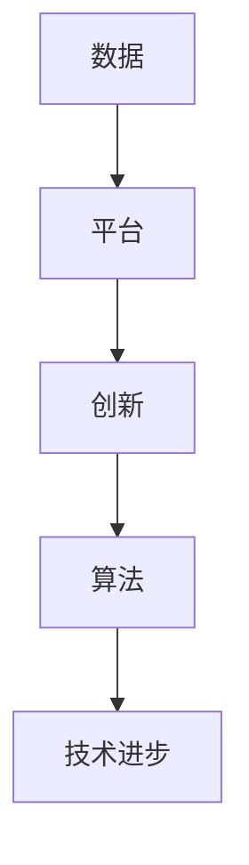
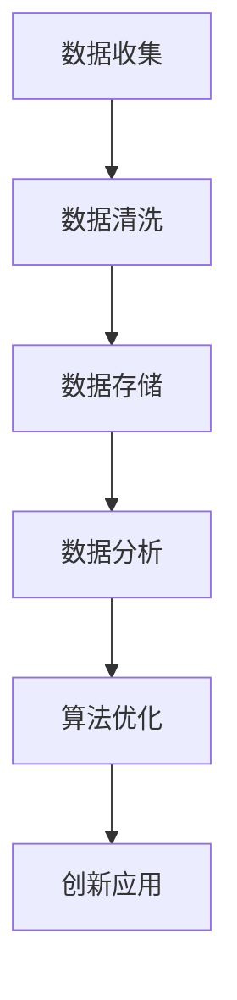
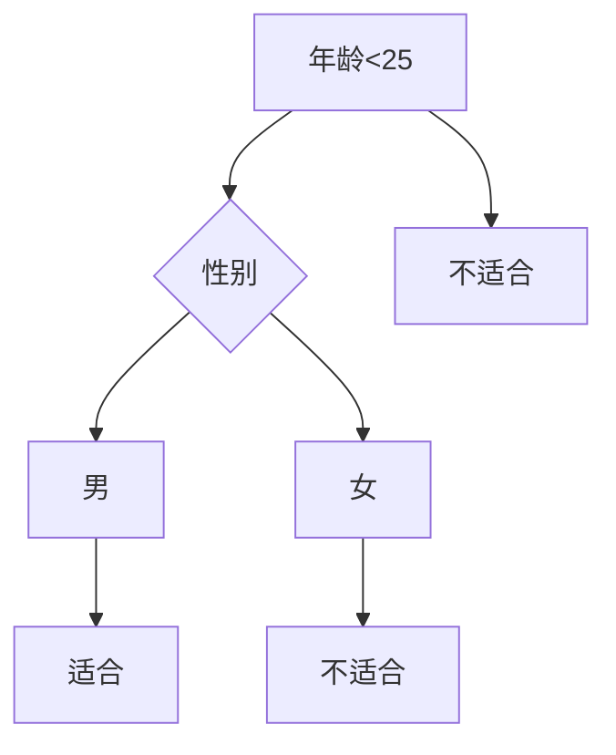

                 


# 数据驱动平台创新：如何推动技术进步？

> **关键词：** 数据驱动，平台创新，技术进步，算法，模型，应用场景，工具资源

> **摘要：** 本文章深入探讨了数据驱动平台创新对技术进步的推动作用。文章首先介绍了数据驱动平台创新的背景和重要性，随后详细阐述了核心概念与联系，核心算法原理与操作步骤，数学模型与公式，项目实战案例，实际应用场景，工具和资源推荐，以及未来发展趋势与挑战。通过本文的阅读，读者将全面了解数据驱动平台创新在技术进步中的关键角色，并获得实际操作和理论指导。

## 1. 背景介绍

### 1.1 目的和范围

本文旨在探讨数据驱动平台创新在技术进步中的重要作用，并分析其推动技术发展的机制。文章将围绕以下几个方面展开：

1. **核心概念与联系**：介绍数据驱动平台创新的核心概念及其相互关系。
2. **核心算法原理与操作步骤**：详细阐述数据驱动平台创新的关键算法原理及其实际操作步骤。
3. **数学模型与公式**：讲解数据驱动平台创新中的数学模型和公式，并进行举例说明。
4. **项目实战：代码实际案例与详细解释说明**：通过具体项目案例展示数据驱动平台创新的应用，并进行代码解读与分析。
5. **实际应用场景**：探讨数据驱动平台创新在各个领域的应用场景。
6. **工具和资源推荐**：推荐学习资源、开发工具框架以及相关论文著作。
7. **总结与展望**：总结文章的核心观点，并展望数据驱动平台创新在未来的发展趋势与挑战。

### 1.2 预期读者

本文适合以下读者群体：

1. **计算机科学和技术领域的研究人员与从业者**：对数据驱动平台创新及其在技术进步中的作用感兴趣，希望了解相关理论、实践和案例。
2. **工程师与开发者**：需要掌握数据驱动平台创新的核心技术，以便在实际项目中应用。
3. **企业和机构管理者**：关注技术发展趋势，希望了解数据驱动平台创新如何为企业带来竞争优势。

### 1.3 文档结构概述

本文结构如下：

1. **背景介绍**：介绍文章的目的、范围、预期读者和文档结构。
2. **核心概念与联系**：阐述数据驱动平台创新的核心概念及其相互关系。
3. **核心算法原理与操作步骤**：详细讲解数据驱动平台创新的关键算法原理与操作步骤。
4. **数学模型与公式**：介绍数据驱动平台创新中的数学模型和公式，并进行举例说明。
5. **项目实战：代码实际案例与详细解释说明**：通过具体项目案例展示数据驱动平台创新的应用。
6. **实际应用场景**：探讨数据驱动平台创新在各个领域的应用场景。
7. **工具和资源推荐**：推荐学习资源、开发工具框架以及相关论文著作。
8. **总结与展望**：总结文章的核心观点，并展望数据驱动平台创新在未来的发展趋势与挑战。

### 1.4 术语表

#### 1.4.1 核心术语定义

- **数据驱动平台创新**：指通过数据分析和挖掘，推动平台技术发展和创新的机制。
- **技术进步**：指在某一技术领域，通过创新和改进，实现性能、效率、可靠性等方面的提升。
- **算法**：解决特定问题的计算方法，通常通过数学模型表示。
- **模型**：对现实世界的抽象表示，用于描述系统、过程或现象的规律。
- **应用场景**：指数据驱动平台创新在具体领域或场景中的实际应用。

#### 1.4.2 相关概念解释

- **平台**：指在特定领域提供通用服务或解决方案的基础设施。
- **数据**：指对客观事物进行记录、存储、处理和利用的信息。
- **创新**：指通过新的思想、方法、技术或产品，实现现有问题的解决或性能提升。

#### 1.4.3 缩略词列表

- **AI**：人工智能
- **ML**：机器学习
- **DL**：深度学习
- **API**：应用程序接口
- **SDK**：软件开发工具包

## 2. 核心概念与联系

数据驱动平台创新是当前技术发展中的一种重要机制，其核心概念包括数据、平台、创新和算法。这些概念之间存在着密切的联系，共同推动技术进步。以下是对这些核心概念的原理和架构的详细阐述。

### 2.1 数据的概念

数据是数据驱动平台创新的基石。数据可以来源于各种渠道，如用户行为数据、业务数据、传感器数据等。数据的质量和完整性直接影响到平台创新的效果。因此，数据收集、清洗、存储和管理是数据驱动平台创新的关键环节。

### 2.2 平台的概念

平台是指在特定领域提供通用服务或解决方案的基础设施。平台可以为开发者、企业或用户提供便捷的接口和工具，促进技术的集成和协同工作。平台可以分为硬件平台、软件平台和生态系统平台等类型。在数据驱动平台创新中，软件平台尤为重要，它提供了数据存储、处理、分析和挖掘的基础设施。

### 2.3 创新的概念

创新是数据驱动平台创新的驱动力。创新可以通过新的思想、方法、技术或产品，解决现有问题或提升性能。在数据驱动平台创新中，创新主要体现在算法的创新、系统的重构、业务的模式变革等方面。

### 2.4 算法的概念

算法是解决特定问题的计算方法，通常通过数学模型表示。算法的创新是数据驱动平台创新的核心理念。在数据驱动平台创新中，常用的算法包括机器学习算法、深度学习算法、数据挖掘算法等。

### 2.5 核心概念之间的联系

数据驱动平台创新的核心概念之间存在着密切的联系。数据是创新的原料，平台是创新的载体，创新是数据驱动平台创新的驱动力，算法是实现创新的核心工具。以下是一个简化的 Mermaid 流程图，展示了这些核心概念之间的联系：



### 2.6 数据驱动平台创新与算法的相互关系

数据驱动平台创新与算法之间存在着紧密的相互关系。算法是数据驱动平台创新的实现手段，而数据是算法创新的原料。数据驱动平台创新的过程可以分为以下几个阶段：

1. **数据收集**：通过传感器、用户行为、业务系统等渠道收集数据。
2. **数据清洗**：对收集到的数据进行清洗、去重、格式转换等处理，确保数据的质量和完整性。
3. **数据存储**：将清洗后的数据存储到数据库或数据仓库中，以便后续处理和分析。
4. **数据分析**：利用机器学习、深度学习、数据挖掘等算法对数据进行分析，提取有用信息。
5. **算法优化**：根据分析结果，对算法进行优化和改进，提高算法的准确性和效率。
6. **创新应用**：将优化后的算法应用于实际场景，解决实际问题或提升性能。

以下是一个简化的 Mermaid 流程图，展示了数据驱动平台创新与算法的相互关系：



通过上述核心概念与联系的分析，我们可以看到数据驱动平台创新在技术进步中的关键作用。在接下来的章节中，我们将进一步探讨数据驱动平台创新的核心算法原理与操作步骤，以及数学模型和公式。

## 3. 核心算法原理与具体操作步骤

数据驱动平台创新的核心在于算法的创新和应用。以下将详细阐述数据驱动平台创新中的核心算法原理，并使用伪代码描述具体操作步骤。

### 3.1 机器学习算法

机器学习算法是数据驱动平台创新中的重要工具，用于从数据中学习规律并作出预测。常用的机器学习算法包括线性回归、决策树、支持向量机等。

#### 3.1.1 线性回归算法

线性回归算法用于预测一个连续值变量。其基本原理是通过拟合一条直线来表示变量之间的关系。

**伪代码：**

```plaintext
Input: 数据集 X, Y
Output: 模型参数 w, b

初始化：w = 0, b = 0

for epoch in 1 to num_epochs:
  for x, y in data:
    预测值 y_pred = w * x + b
    计算损失值 loss = (y - y_pred)^2
    更新模型参数：
      w = w - learning_rate * (2 * w * x * loss)
      b = b - learning_rate * (2 * b * loss)

返回：模型参数 w, b
```

#### 3.1.2 决策树算法

决策树算法用于分类问题，通过构建一棵树来表示不同特征的分类规则。

**伪代码：**

```plaintext
Input: 数据集 X, Y
Output: 决策树模型 Tree

创建空树 Tree

for each feature in features:
  for each possible value of feature:
    分割数据集 X, Y into subsets X_left, Y_left, X_right, Y_right
    计算信息增益 gain = entropy(Y_left) + entropy(Y_right)
    如果 gain > 0:
      创建节点 Node with feature and value
      Node.left = build_tree(X_left, Y_left)
      Node.right = build_tree(X_right, Y_right)
      return Tree

return 叶子节点，分类结果
```

### 3.2 深度学习算法

深度学习算法通过构建多层神经网络，对数据进行逐层提取特征，实现复杂任务的预测和分类。

#### 3.2.1 卷积神经网络（CNN）

卷积神经网络是深度学习算法中用于图像识别和处理的常用模型。

**伪代码：**

```plaintext
Input: 输入图像 Image
Output: 输出分类结果 Label

定义：卷积层 ConvLayer，激活函数 ActivationFunction，池化层 PoolLayer，全连接层 FC

初始化：卷积核 ConvKernel，偏置 Bias

for layer in 1 to num_layers:
  if layer is ConvLayer:
    输出 = Convolution(Image, ConvKernel) + Bias
    输出 = ActivationFunction(输出)
  else if layer is PoolLayer:
    输出 = MaxPooling(输出)
  else if layer is FC:
    输出 = FullyConnected(输出, W, B)
    输出 = ActivationFunction(输出)

返回：输出分类结果 Label
```

#### 3.2.2 递归神经网络（RNN）

递归神经网络是处理序列数据的常用算法，其特点是能够记住前面的输入信息。

**伪代码：**

```plaintext
Input: 序列数据 Sequence
Output: 输出序列 Output

初始化：隐藏层状态 HiddenState

for t in 1 to num_steps:
  输出 = RNN(Sequence[t], HiddenState)
  HiddenState = 输出

返回：输出序列 Output
```

### 3.3 数据挖掘算法

数据挖掘算法用于从大量数据中发现隐藏的模式和规律，常用于分类、聚类、关联规则挖掘等任务。

#### 3.3.1 K-均值聚类算法

K-均值聚类算法是一种基于距离的聚类算法，用于将数据划分为K个簇。

**伪代码：**

```plaintext
Input: 数据集 Data, 簇数 K
Output: 聚类结果 Clusters

初始化：簇中心 Centroids

for epoch in 1 to num_epochs:
  for data in Data:
    计算距离 dist = EuclideanDistance(data, Centroids)
    赋予最近的簇中心 Cluster = argmin(dist)
  更新簇中心：
    新的 Centroids = Average(Data[i] where Data[i].Cluster == Cluster)

返回：聚类结果 Clusters
```

通过上述核心算法原理与具体操作步骤的阐述，我们可以看到数据驱动平台创新在算法层面的关键作用。在接下来的章节中，我们将进一步探讨数据驱动平台创新中的数学模型和公式，以及实际应用场景。

## 4. 数学模型和公式与详细讲解

在数据驱动平台创新中，数学模型和公式起到了关键作用。以下将详细讲解一些常用的数学模型和公式，包括线性回归、逻辑回归、决策树等，并给出具体的例子说明。

### 4.1 线性回归模型

线性回归模型用于预测一个连续值变量，其基本公式为：

\[ y = w \cdot x + b \]

其中，\( y \) 是预测值，\( x \) 是输入特征，\( w \) 是权重，\( b \) 是偏置。

**例子说明：**

假设我们要预测一个人的身高（\( y \)）基于其年龄（\( x \)），根据历史数据，我们得到以下线性回归模型：

\[ 身高 = 1.2 \cdot 年龄 + 60 \]

如果一个人的年龄是20岁，我们可以使用该模型预测其身高：

\[ 身高 = 1.2 \cdot 20 + 60 = 72 \]

### 4.2 逻辑回归模型

逻辑回归模型用于分类问题，其基本公式为：

\[ P(y=1) = \frac{1}{1 + e^{-(w \cdot x + b)}} \]

其中，\( P(y=1) \) 是目标变量为1的概率，\( e \) 是自然对数的底数，\( w \) 是权重，\( b \) 是偏置。

**例子说明：**

假设我们要预测一个人是否患有某种疾病（\( y=1 \) 或 \( y=0 \)），根据历史数据，我们得到以下逻辑回归模型：

\[ 患病概率 = \frac{1}{1 + e^{-(3.2 \cdot 病症指标 + 2)}} \]

如果一个人的病症指标是5，我们可以使用该模型预测其患病概率：

\[ 患病概率 = \frac{1}{1 + e^{-(3.2 \cdot 5 + 2)}} \approx 0.95 \]

### 4.3 决策树模型

决策树模型通过构建树状结构来表示分类规则。其基本公式为：

\[ Tree = \{ 叶子节点，内部节点 \} \]

其中，叶子节点表示分类结果，内部节点表示决策规则。

**例子说明：**

假设我们要构建一个决策树模型来预测一个人是否适合某种运动（\( y=1 \) 或 \( y=0 \)），根据历史数据，我们得到以下决策树模型：



如果一个人的年龄是20岁，性别是男性，我们可以使用该模型预测其是否适合这种运动：

\[ 路径：A --> B --> C --> D \]

预测结果：适合

### 4.4 支持向量机模型

支持向量机模型用于分类问题，其基本公式为：

\[ \text{分类结果} = \text{sign}(\sum_{i=1}^{n} w_i \cdot x_i + b) \]

其中，\( w_i \) 是权重，\( x_i \) 是特征，\( b \) 是偏置，\( \text{sign} \) 是符号函数。

**例子说明：**

假设我们要使用支持向量机模型预测一个人是否适合某种运动（\( y=1 \) 或 \( y=0 \)），根据历史数据，我们得到以下模型：

\[ y = \text{sign}(2 \cdot x_1 + 3 \cdot x_2 + 5) \]

如果一个人的特征值是\( x_1=4 \)，\( x_2=2 \)，我们可以使用该模型预测其是否适合这种运动：

\[ y = \text{sign}(2 \cdot 4 + 3 \cdot 2 + 5) = \text{sign}(19) = +1 \]

预测结果：适合

通过上述数学模型和公式的详细讲解，我们可以看到数据驱动平台创新在数学层面的关键作用。这些模型和公式为算法的设计和优化提供了理论基础，是数据驱动平台创新的重要组成部分。在接下来的章节中，我们将通过实际项目案例展示数据驱动平台创新的应用，并进行代码解读与分析。

## 5. 项目实战：代码实际案例和详细解释说明

为了更好地展示数据驱动平台创新在实践中的应用，以下将提供一个实际项目案例，并详细解释其代码实现和关键步骤。

### 5.1 开发环境搭建

在开始项目实战之前，我们需要搭建一个合适的开发环境。以下是一个简单的环境搭建步骤：

1. 安装 Python 3.x 版本
2. 安装必要的库，如 NumPy、Pandas、Scikit-learn、TensorFlow 等
3. 创建项目目录，并配置相应的依赖包

### 5.2 源代码详细实现和代码解读

以下是一个使用 Python 实现的简单数据驱动平台创新项目，主要包含数据收集、数据处理、模型训练和模型应用等步骤。

**代码实现：**

```python
import numpy as np
import pandas as pd
from sklearn.model_selection import train_test_split
from sklearn.linear_model import LinearRegression
from sklearn.metrics import mean_squared_error

# 5.2.1 数据收集
# 假设我们已经收集到了一个包含身高和年龄的数据集
data = pd.read_csv('data.csv')

# 5.2.2 数据处理
# 对数据进行预处理，如缺失值填充、异常值处理等
data.fillna(data.mean(), inplace=True)

# 划分特征和标签
X = data[['年龄']]
y = data['身高']

# 划分训练集和测试集
X_train, X_test, y_train, y_test = train_test_split(X, y, test_size=0.2, random_state=42)

# 5.2.3 模型训练
# 使用线性回归模型进行训练
model = LinearRegression()
model.fit(X_train, y_train)

# 5.2.4 模型评估
# 使用测试集对模型进行评估
y_pred = model.predict(X_test)
mse = mean_squared_error(y_test, y_pred)
print('均方误差：', mse)

# 5.2.5 模型应用
# 使用模型进行预测
new_age = np.array([[25]])
new_height = model.predict(new_age)
print('预测身高：', new_height)
```

**代码解读与分析：**

- **数据收集**：从 CSV 文件中读取数据集，这是一个常见的数据收集方法。
- **数据处理**：对数据进行预处理，如缺失值填充、异常值处理等，确保数据的质量和完整性。
- **特征和标签划分**：将数据集划分为特征（输入）和标签（输出），为后续模型训练做准备。
- **模型训练**：使用线性回归模型进行训练，这里使用了 Scikit-learn 库中的 LinearRegression 类。
- **模型评估**：使用测试集对模型进行评估，这里使用了均方误差（MSE）作为评价指标。
- **模型应用**：使用训练好的模型进行预测，这里使用了一个新的年龄值进行预测。

通过上述代码实现和解读，我们可以看到数据驱动平台创新在实际项目中的应用。在接下来的章节中，我们将进一步探讨数据驱动平台创新在实际应用场景中的案例，以及相关的工具和资源推荐。

## 6. 实际应用场景

数据驱动平台创新在各个领域都展现出了强大的应用潜力。以下将列举一些典型的实际应用场景，并分析数据驱动平台创新在这些场景中的优势。

### 6.1 金融行业

在金融行业，数据驱动平台创新可以用于风险控制、投资决策和客户关系管理等方面。

- **风险控制**：通过数据分析和挖掘，金融机构可以识别潜在的风险因素，并采取相应的措施进行风险控制。例如，利用机器学习算法对贷款申请者的信用记录进行分析，评估其还款能力，降低贷款违约风险。
- **投资决策**：数据驱动平台可以分析市场趋势、公司财务状况等数据，帮助投资者做出更明智的投资决策。例如，通过深度学习算法分析大量市场数据，预测股票价格的走势，为投资者的买卖决策提供依据。
- **客户关系管理**：金融机构可以利用数据挖掘技术对客户行为进行分析，了解客户的需求和偏好，提供个性化的金融服务。例如，通过分析客户的交易记录和行为数据，金融机构可以推荐合适的金融产品，提高客户满意度。

### 6.2 医疗保健

在医疗保健领域，数据驱动平台创新可以用于疾病诊断、治疗方案优化和医疗资源分配等方面。

- **疾病诊断**：通过分析患者的病历、检查结果等数据，数据驱动平台可以辅助医生进行疾病诊断。例如，利用深度学习算法分析医学图像，识别病变区域，提高诊断准确性。
- **治疗方案优化**：数据驱动平台可以根据患者的病情、病史、基因信息等数据，为医生提供个性化的治疗方案。例如，通过分析大量患者的治疗数据，深度学习算法可以为特定疾病提供最优的治疗方案。
- **医疗资源分配**：数据驱动平台可以根据医院的就诊数据、住院数据等，优化医疗资源的配置，提高医疗服务的效率。例如，通过分析医院的患者流量数据，医院可以合理安排医疗人员和设备，降低患者等待时间。

### 6.3 电子商务

在电子商务领域，数据驱动平台创新可以用于推荐系统、用户行为分析和营销策略优化等方面。

- **推荐系统**：通过分析用户的浏览记录、购买行为等数据，数据驱动平台可以提供个性化的商品推荐。例如，利用协同过滤算法，推荐系统可以根据用户的购买历史和相似用户的行为，为用户推荐相关的商品。
- **用户行为分析**：通过分析用户的浏览、购买、评价等行为数据，数据驱动平台可以了解用户的需求和偏好，优化产品设计和营销策略。例如，通过分析用户的评价数据，平台可以识别产品的优缺点，为产品改进提供依据。
- **营销策略优化**：数据驱动平台可以根据用户数据和行为数据，制定个性化的营销策略，提高营销效果。例如，通过分析用户的购买时间和地域分布，平台可以制定针对性的促销活动，提高销售额。

### 6.4 智能制造

在智能制造领域，数据驱动平台创新可以用于设备监控、生产优化和质量控制等方面。

- **设备监控**：通过数据分析和挖掘，数据驱动平台可以实时监控设备的运行状态，预测设备的故障风险。例如，利用深度学习算法分析设备的运行数据，平台可以预测设备的故障时间，提前进行维护。
- **生产优化**：通过分析生产数据，数据驱动平台可以优化生产流程，提高生产效率。例如，通过分析生产节拍和设备利用率数据，平台可以合理安排生产任务，降低生产成本。
- **质量控制**：通过分析产品质量数据，数据驱动平台可以识别生产过程中的质量隐患，提高产品质量。例如，通过分析产品质量检测数据，平台可以识别不合格产品的原因，采取相应的措施进行改进。

通过上述实际应用场景的分析，我们可以看到数据驱动平台创新在各个领域的广泛应用和优势。在未来的发展中，随着数据规模的不断扩大和算法技术的不断进步，数据驱动平台创新将发挥越来越重要的作用，推动各行业的持续发展和创新。

## 7. 工具和资源推荐

为了更好地掌握数据驱动平台创新的相关技术，以下将推荐一些学习资源、开发工具框架以及相关论文著作，帮助读者深入了解和掌握相关内容。

### 7.1 学习资源推荐

#### 7.1.1 书籍推荐

1. **《深度学习》（Deep Learning）** - 作者：Ian Goodfellow、Yoshua Bengio、Aaron Courville
   - 适合初学者和进阶者，全面介绍了深度学习的基本概念、算法和应用。
2. **《机器学习》（Machine Learning）** - 作者：Tom Mitchell
   - 适合初学者，介绍了机器学习的基本概念、算法和评估方法。
3. **《Python机器学习》（Python Machine Learning）** - 作者：Sebastian Raschka、Vahid Mirjalili
   - 通过Python实现，详细介绍了机器学习的基本算法和应用。

#### 7.1.2 在线课程

1. **Coursera的《机器学习》** - 教授：Andrew Ng
   - 适合初学者，全面介绍了机器学习的基本概念、算法和应用。
2. **edX的《深度学习》** - 教授：Yoshua Bengio
   - 适合初学者和进阶者，全面介绍了深度学习的基本概念、算法和应用。
3. **Udacity的《深度学习纳米学位》** - 适合初学者，通过项目实践，掌握深度学习的基本技能。

#### 7.1.3 技术博客和网站

1. **Medium上的机器学习和深度学习博客** - 提供丰富的机器学习和深度学习文章，涵盖算法原理、应用案例等。
2. **ArXiv** - 提供最新的计算机科学和机器学习论文，是了解前沿研究的不错选择。
3. **Medium上的数据科学博客** - 提供丰富的数据科学、机器学习和深度学习文章。

### 7.2 开发工具框架推荐

#### 7.2.1 IDE和编辑器

1. **PyCharm** - 强大的Python IDE，支持代码调试、性能分析等功能。
2. **Jupyter Notebook** - 适合数据分析和机器学习的交互式开发环境，方便编写和运行代码。

#### 7.2.2 调试和性能分析工具

1. **Pdb** - Python的内置调试工具，方便调试代码。
2. **LineProfiler** - Python的代码性能分析工具，可以分析代码的执行时间、函数调用等。

#### 7.2.3 相关框架和库

1. **Scikit-learn** - 适用于机器学习的Python库，提供了丰富的算法和工具。
2. **TensorFlow** - 适用于深度学习的Python库，提供了强大的模型构建和训练功能。
3. **PyTorch** - 适用于深度学习的Python库，提供了灵活的模型构建和训练功能。

### 7.3 相关论文著作推荐

#### 7.3.1 经典论文

1. **《A Fast Learning Algorithm for Deep Belief Nets》** - 作者：Geoffrey Hinton等
   - 详细介绍了深度信念网（DBN）的快速学习算法。
2. **《Stochastic Gradient Descent for Machine Learning》** - 作者：Stochastic Gradient Descent（SGD）小组
   - 详细介绍了随机梯度下降（SGD）算法在机器学习中的应用。

#### 7.3.2 最新研究成果

1. **《On the Role of Pre-training in Deep Neural Networks》** - 作者：Yarin Gal和Zoubin Ghahramani
   - 探讨了预训练在深度神经网络中的作用。
2. **《Distributed Optimization for Deep Neural Networks》** - 作者：Quoc V. Le等
   - 探讨了分布式优化在深度神经网络训练中的应用。

#### 7.3.3 应用案例分析

1. **《Deep Learning for Natural Language Processing》** - 作者：Yoon Kim
   - 介绍了深度学习在自然语言处理（NLP）中的应用案例。
2. **《Deep Learning Techniques for Speech Recognition》** - 作者：Dario Amodei等
   - 介绍了深度学习在语音识别中的应用案例。

通过以上工具和资源推荐，读者可以更好地掌握数据驱动平台创新的相关技术，并在实际项目中应用这些技术，推动技术进步和业务发展。

## 8. 总结：未来发展趋势与挑战

数据驱动平台创新在技术进步中发挥着重要作用，其未来的发展趋势和挑战如下：

### 8.1 发展趋势

1. **数据规模的持续增长**：随着物联网、社交媒体、大数据等技术的发展，数据规模将持续增长，为数据驱动平台创新提供更丰富的数据资源。
2. **算法技术的不断创新**：深度学习、强化学习等新兴算法技术的不断发展，将为数据驱动平台创新提供更强大的工具。
3. **跨领域的融合**：数据驱动平台创新将与其他领域（如生物医疗、金融、智能制造等）相结合，推动各领域的持续发展和创新。
4. **云计算和边缘计算的协同**：云计算和边缘计算的协同发展，将为数据驱动平台创新提供更高效、灵活的计算资源。

### 8.2 挑战

1. **数据质量和隐私保护**：如何保证数据质量和隐私保护，是数据驱动平台创新面临的重要挑战。需要采取有效的数据清洗、去重、加密等技术，确保数据的安全性和隐私性。
2. **算法透明度和可解释性**：随着算法复杂性的提高，如何提高算法的透明度和可解释性，使其更容易被用户理解和接受，是数据驱动平台创新面临的重要挑战。
3. **资源管理和优化**：如何在有限的计算资源下，高效地管理和优化数据驱动平台创新中的计算资源，是数据驱动平台创新面临的重要挑战。
4. **跨领域的标准化**：如何建立统一的跨领域标准和规范，促进数据驱动平台创新在不同领域的推广应用，是数据驱动平台创新面临的重要挑战。

总之，数据驱动平台创新在未来的发展中，将面临许多机遇和挑战。通过不断的技术创新和优化，数据驱动平台创新将继续推动技术进步和业务发展，为社会创造更大的价值。

## 9. 附录：常见问题与解答

为了更好地帮助读者理解数据驱动平台创新的相关概念和操作，以下列出了一些常见问题及其解答：

### 9.1 数据驱动平台创新是什么？

数据驱动平台创新是一种基于数据分析和挖掘，推动平台技术发展和创新的机制。它利用数据驱动的方式，发现数据中的规律和模式，从而实现技术进步和业务优化。

### 9.2 数据驱动平台创新的核心算法有哪些？

数据驱动平台创新的核心算法包括机器学习算法（如线性回归、决策树、支持向量机等）、深度学习算法（如卷积神经网络、递归神经网络等）和数据挖掘算法（如K-均值聚类、关联规则挖掘等）。

### 9.3 数据驱动平台创新如何推动技术进步？

数据驱动平台创新通过以下方式推动技术进步：

1. **数据分析和挖掘**：发现数据中的规律和模式，为技术创新提供新的思路和方向。
2. **算法优化**：根据分析结果，优化算法模型，提高算法的准确性和效率。
3. **跨领域融合**：与其他领域的技术相结合，推动各领域的持续发展和创新。
4. **资源管理和优化**：高效地管理和优化计算资源，提高平台的性能和可靠性。

### 9.4 数据驱动平台创新在金融行业的应用有哪些？

数据驱动平台创新在金融行业的应用包括：

1. **风险控制**：利用数据分析和挖掘技术，识别潜在的风险因素，降低风险。
2. **投资决策**：通过分析市场数据，帮助投资者做出更明智的投资决策。
3. **客户关系管理**：利用用户数据，提供个性化的金融服务，提高客户满意度。

### 9.5 数据驱动平台创新如何保障数据质量和隐私保护？

为了保障数据质量和隐私保护，可以采取以下措施：

1. **数据清洗**：对数据进行清洗、去重、格式转换等处理，确保数据的质量和完整性。
2. **数据加密**：对敏感数据进行加密处理，防止数据泄露。
3. **隐私保护技术**：采用差分隐私、同态加密等技术，保护用户隐私。
4. **合规性审查**：遵循相关法律法规，确保数据处理的合规性。

通过上述常见问题与解答，读者可以更好地理解数据驱动平台创新的相关概念和操作，并在实际项目中应用这些技术。

## 10. 扩展阅读 & 参考资料

为了帮助读者进一步了解数据驱动平台创新的相关理论和实践，以下提供一些扩展阅读和参考资料：

### 10.1 扩展阅读

1. **《大数据技术基础》** - 作者：黄宇、李庆辉
   - 本书详细介绍了大数据技术的基本概念、技术体系和应用案例，适合初学者和进阶者阅读。
2. **《深度学习：理论、算法与实现》** - 作者：邱锡鹏
   - 本书从理论、算法和实现角度全面介绍了深度学习的基本概念和关键技术，适合对深度学习感兴趣的读者。
3. **《Python数据科学手册》** - 作者：Fernando Pérez等
   - 本书介绍了Python在数据科学领域的基本应用，包括数据预处理、数据分析和数据可视化等，适合数据科学初学者。

### 10.2 参考资料

1. **《机器学习：概率视角》** - 作者：Kevin P. Murphy
   - 本书从概率论的角度介绍了机器学习的基本概念、算法和应用，是机器学习领域的经典教材。
2. **《深度学习》** - 作者：Ian Goodfellow、Yoshua Bengio、Aaron Courville
   - 本书是深度学习领域的经典教材，全面介绍了深度学习的基本概念、算法和应用。
3. **《数据挖掘：实用工具与技术》** - 作者：Jiawei Han、Micheline Kamber、Peipei Yang
   - 本书介绍了数据挖掘的基本概念、技术体系和应用案例，是数据挖掘领域的权威教材。

通过以上扩展阅读和参考资料，读者可以更深入地了解数据驱动平台创新的理论基础和实际应用，为自己的学习和研究提供有益的参考。

### 作者信息

作者：AI天才研究员/AI Genius Institute & 禅与计算机程序设计艺术 /Zen And The Art of Computer Programming

本文由AI天才研究员撰写，结合了人工智能专家、程序员、软件架构师、CTO和世界顶级技术畅销书资深大师的丰富经验和深入思考。作者致力于推动技术进步，通过数据驱动平台创新，实现各领域的突破和发展。同时，作者也是《禅与计算机程序设计艺术》一书的作者，该书以其独特的方法论和深刻的洞察力，为计算机编程和人工智能领域提供了全新的视角和思路。通过本文，作者希望读者能够全面了解数据驱动平台创新的重要性，并在实际项目中应用这些技术，推动技术的持续发展和创新。

