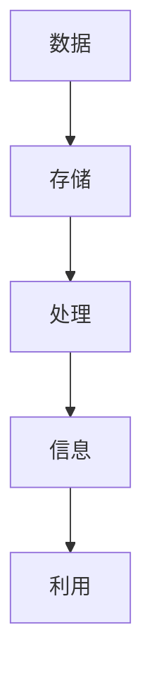
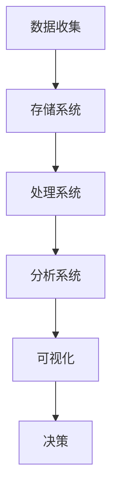
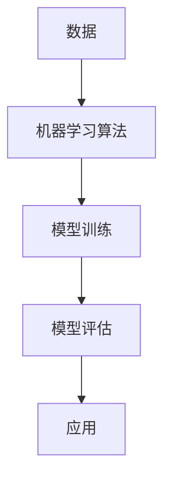
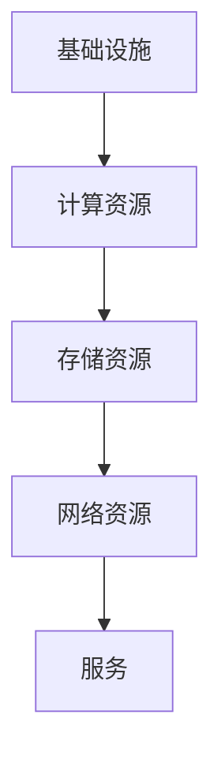
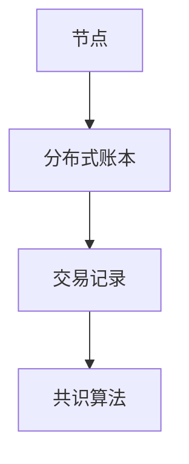
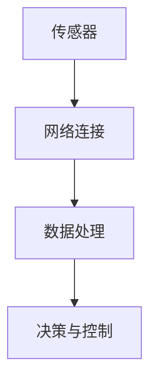

                 

### 1. 背景介绍

#### 1.1 目的和范围

在当今快速发展的信息化时代，数据和技术正以前所未有的速度和规模影响着我们的生活和各行各业。本文旨在探讨数智新时代的特征与发展，分析这一新时代带来的技术变革、行业机遇以及面临的挑战。通过深入探讨核心概念、算法原理、数学模型和实际应用场景，本文希望为广大读者提供一份全面的技术视角和深刻的思考。

本文的主要内容将围绕以下几个部分展开：

1. **核心概念与联系**：介绍数智新时代的核心概念及其相互关系，通过Mermaid流程图展现概念之间的逻辑结构。
2. **核心算法原理**：详细阐述关键算法的基本原理，使用伪代码展示具体的操作步骤。
3. **数学模型与公式**：讲解数学模型在数智新时代的应用，并提供具体的公式和例子。
4. **项目实战**：通过实际案例展示技术如何在项目中落地，并提供代码实现和详细解释。
5. **实际应用场景**：分析数智技术在各行业的应用实例，探讨其带来的变革。
6. **工具和资源推荐**：推荐学习资源、开发工具框架和最新研究成果。
7. **总结与未来趋势**：总结全文内容，展望未来发展趋势与挑战。

本文适合对数智时代有浓厚兴趣的技术爱好者、开发者以及相关行业从业者阅读。通过本文的阅读，读者将能够全面理解数智新时代的特征与发展，为自身在该领域的学习和研究提供有力支持。

---

#### 1.2 预期读者

本文面向对数智时代有深刻兴趣的广大读者群体，主要包括以下几个方面：

1. **技术爱好者**：对人工智能、大数据、云计算等前沿技术有浓厚兴趣，希望深入了解数智新时代的技术发展和应用。
2. **开发者**：已经在技术领域有一定基础，希望进一步提升自己在数智时代的关键技术能力，包括算法开发、数据分析、系统架构等。
3. **相关行业从业者**：在金融、医疗、电商、制造等行业工作，希望了解数智技术在行业中的应用和带来的变革，以提升业务水平和竞争力。
4. **高校师生**：计算机科学、数据科学等相关专业的师生，希望通过本文的学习，加深对数智时代技术原理和应用的理解。

通过本文的阅读，预期读者能够：

- 理解数智新时代的核心概念和特征；
- 掌握关键算法原理和操作步骤；
- 了解数学模型在数智时代的作用和应用；
- 掌握实际项目中技术落地的经验和技巧；
- 探讨数智技术在各行业的应用场景和未来发展趋势。

---

#### 1.3 文档结构概述

本文结构清晰，内容系统，旨在帮助读者全面理解数智新时代的特征与发展。文章分为以下几个主要部分：

1. **引言**：简要介绍数智新时代的背景和重要性，明确本文的目的和范围。
2. **核心概念与联系**：介绍数智新时代的核心概念，通过Mermaid流程图展示概念间的逻辑关系。
3. **核心算法原理**：详细讲解关键算法的原理，使用伪代码展示具体操作步骤。
4. **数学模型与公式**：讲解数学模型在数智时代中的应用，提供具体的公式和例子。
5. **项目实战**：通过实际案例展示技术如何在项目中落地，提供代码实现和详细解释。
6. **实际应用场景**：分析数智技术在各行业的应用实例，探讨其带来的变革。
7. **工具和资源推荐**：推荐学习资源、开发工具框架和最新研究成果。
8. **总结与未来趋势**：总结全文内容，展望未来发展趋势与挑战。
9. **附录：常见问题与解答**：针对读者可能遇到的问题提供解答。
10. **扩展阅读与参考资料**：提供进一步阅读的资源，以便读者深入了解相关主题。

---

#### 1.4 术语表

为了确保文章内容的专业性和准确性，本文定义了一些术语，并对相关概念进行解释。

##### 1.4.1 核心术语定义

- **数智时代**：一个以数据为核心，通过大数据、人工智能、云计算等新兴技术实现信息智能化处理和决策优化的时代。
- **大数据**：指无法用常规软件工具在合理时间内捕捉、管理和处理的数据集合，通常具有大量、多样、高速和真实等特征。
- **人工智能**：通过模拟、延伸和扩展人类的智能，使计算机具有感知、学习、推理、决策等能力的科学技术。
- **云计算**：通过网络使计算资源池化，实现动态可扩展、按需分配的计算服务模式。
- **机器学习**：一种人工智能方法，通过算法从数据中学习，从而自动改进性能。
- **深度学习**：一种基于多层神经网络的学习方法，能够自动从大量数据中提取复杂特征。

##### 1.4.2 相关概念解释

- **数据挖掘**：从大量数据中提取有价值信息的过程，包括模式识别、关联分析、分类、聚类等。
- **数据可视化**：通过图形化手段将数据转换成易于理解的形式，帮助人们发现数据中的模式和趋势。
- **算法优化**：通过改进算法的设计和实现，提高算法的效率和准确性。
- **人工智能伦理**：研究人工智能在道德、法律和社会伦理方面的影响，以确保其安全、公平和透明。

##### 1.4.3 缩略词列表

- **AI**：人工智能
- **DL**：深度学习
- **ML**：机器学习
- **Hadoop**：一个开源的数据处理框架，用于大规模数据的存储和处理
- **Spark**：一个开源的大数据计算框架，提供快速、易用的数据处理功能
- **TensorFlow**：一个开源的机器学习框架，用于构建和训练深度学习模型
- **Kubernetes**：一个开源的容器编排系统，用于自动化部署、扩展和管理容器化应用程序

通过上述术语表，读者可以更好地理解本文中涉及的专业术语和概念，为后续内容的深入阅读和理解打下基础。接下来，我们将进入核心概念与联系的探讨，进一步揭开数智新时代的神秘面纱。 

---

## 2. 核心概念与联系

在数智新时代，多个核心概念相互交织，共同推动了技术的进步和行业的发展。本章节将介绍数智新时代的核心概念，并利用Mermaid流程图展示这些概念之间的逻辑关系，帮助读者理清各概念间的联系。

### 2.1. 数据与信息

数据是数智时代的基石，而信息的价值在于其处理和利用。数据可以定义为任何形式的数字或事实，而信息则是通过加工和处理后的数据，能够指导决策和行动。

**数据与信息的关系：**
- **数据**：未经过处理的原始信息。
- **信息**：经过加工和处理后的数据，具有实际意义。

**Mermaid流程图：**



### 2.2. 大数据

大数据是数智时代的一个重要特征，其特征通常表现为“4V”：大量（Volume）、多样（Variety）、高速（Velocity）和真实（Veracity）。

**大数据的四个V：**

- **Volume**：数据规模庞大，超出常规处理能力。
- **Variety**：数据类型丰富，包括结构化、半结构化和非结构化数据。
- **Velocity**：数据处理速度快，需要实时或近实时处理。
- **Veracity**：数据真实性，确保数据质量高，无误差。

**Mermaid流程图：**



### 2.3. 人工智能与机器学习

人工智能（AI）和机器学习（ML）是数智时代的关键技术，通过模拟人类的智能行为，实现自动化决策和优化。

**人工智能与机器学习的关系：**

- **人工智能**：模拟和扩展人类智能的技术体系。
- **机器学习**：人工智能的一个分支，通过算法从数据中学习，自动改进性能。

**Mermaid流程图：**



### 2.4. 云计算

云计算是数智时代的重要基础设施，提供灵活、可扩展的计算资源和服务，支持大数据和人工智能的运行。

**云计算的主要优势：**

- **弹性伸缩**：根据需求自动调整资源。
- **成本优化**：按需付费，降低运营成本。
- **高可用性**：服务稳定，保障业务连续性。

**Mermaid流程图：**



### 2.5. 区块链

区块链是数智时代的一种新兴技术，通过分布式账本技术实现数据的不可篡改和安全传输。

**区块链的主要特点：**

- **去中心化**：不依赖于中央权威机构。
- **不可篡改**：交易记录一旦确认，不可修改。
- **安全传输**：确保数据传输过程中的安全性。

**Mermaid流程图：**



### 2.6. 物联网（IoT）

物联网是数智时代的一个重要领域，通过连接物理设备和传感器，实现数据的实时采集和智能分析。

**物联网的核心组成部分：**

- **传感器**：用于采集环境信息。
- **网络连接**：将传感器数据传输到云端。
- **数据处理**：在云端对数据进行分析和决策。

**Mermaid流程图：**



通过上述核心概念与联系的分析，我们可以看到，数智新时代的各个方面紧密相连，共同构建了一个智能化的技术生态系统。在接下来的章节中，我们将深入探讨这些核心概念的具体实现和应用。让我们继续前行，揭开数智新时代的更多奥秘。

---

## 3. 核心算法原理 & 具体操作步骤

在数智新时代，算法是驱动数据分析和决策优化的核心力量。本章节将详细阐述几个关键算法的基本原理，并通过伪代码展示具体操作步骤，帮助读者理解算法的核心思想和实现过程。

### 3.1. 机器学习算法：决策树

决策树是一种广泛使用的机器学习算法，用于分类和回归任务。它通过一系列的判断节点来对数据进行分割，最终输出分类结果。

**基本原理：**

决策树通过递归分割数据集，选择具有最高信息增益的属性作为分割条件，构建出一棵树形结构。树的每一个节点代表一个属性，每个分支代表一个可能的属性值，叶子节点代表最终的分类结果。

**伪代码：**

```python
构建决策树输入：数据集 D、属性集合 A、阈值 θ
输出：决策树 T

函数 决策树构建(D, A, θ):
    if D 中所有样本属于同一类别：
        返回 叶子节点，类别为 D 中样本的多数类别
    if A 为空或阈值 θ 达到停止条件：
        返回 叶子节点，类别为 D 中样本的多数类别
    选择最优属性 a*:
        对于每个属性 a ∈ A，计算信息增益 IG(a)
        选择 IG(a*) = max(IG(a))
        创建节点 N(a*)
        对于每个值 v ∈ A[a]，分割数据集 D 为子集 D_v：
            子树 T_v = 决策树构建(D_v, A - {a*}, θ)
            将 T_v 连接到节点 N(a*) 的分支
    return N(a*)
```

**操作步骤：**

1. **数据预处理**：将数据集 D 进行标准化处理，确保所有属性在同一尺度上。
2. **选择最优属性**：计算每个属性的信息增益，选择信息增益最大的属性作为分割条件。
3. **递归构建**：基于最优属性，将数据集分割为子集，并对每个子集递归构建决策树。
4. **构建决策树**：将分割后的数据集和子树连接，形成完整的决策树结构。

### 3.2. 深度学习算法：卷积神经网络（CNN）

卷积神经网络是深度学习中的一个重要分支，广泛应用于图像识别、目标检测等领域。它通过卷积层、池化层和全连接层等结构，实现对图像特征的自适应提取和分类。

**基本原理：**

卷积神经网络通过卷积操作提取图像局部特征，然后通过池化层减小特征图的维度，减少计算量。最后，通过全连接层对特征进行分类。

**伪代码：**

```python
构建卷积神经网络输入：输入层 I、卷积层 C、池化层 P、全连接层 F
输出：卷积神经网络模型

函数 卷积神经网络构建(I, C, P, F):
    初始化模型参数
    输入层 I = 输入数据
    对于每个卷积层 C:
        I = 卷积操作(C, I)
        I = 池化操作(P, I)
    对于每个全连接层 F:
        I = 全连接操作(F, I)
    返回 模型参数
```

**操作步骤：**

1. **初始化参数**：设置卷积核、滤波器、权重和偏置等初始参数。
2. **卷积操作**：使用卷积核在输入数据上滑动，计算局部特征。
3. **池化操作**：对卷积层的结果进行下采样，减少数据维度。
4. **全连接操作**：将池化层的结果通过全连接层进行分类。
5. **反向传播**：使用梯度下降等优化算法更新模型参数，提升分类性能。

### 3.3. 数据分析算法：K-均值聚类

K-均值聚类是一种无监督学习算法，用于将数据集划分为K个簇，使每个簇内的数据点尽可能接近，簇间数据点尽可能远离。

**基本原理：**

K-均值聚类通过迭代优化聚类中心，将数据点分配到最近的聚类中心，直至收敛。

**伪代码：**

```python
K-均值聚类输入：数据集 D、聚类数 K、阈值 ε
输出：聚类结果

函数 K-均值聚类(D, K, ε):
    随机初始化 K 个聚类中心 c1, c2, ..., ck
    while true:
        对于每个数据点 x ∈ D:
            计算 x 到每个聚类中心的距离，选择最近的聚类中心 c*
            将 x 分配到聚类 c*
        如果聚类中心变化小于阈值 ε，则停止迭代
        更新聚类中心：
            对于每个聚类 c*:
                计算聚类内数据点的均值，作为新的聚类中心
    返回 聚类结果
```

**操作步骤：**

1. **初始化聚类中心**：随机选择 K 个数据点作为初始聚类中心。
2. **迭代分配**：对每个数据点计算到聚类中心的距离，将数据点分配到最近的聚类中心。
3. **更新聚类中心**：计算每个聚类的均值，作为新的聚类中心。
4. **收敛判断**：判断聚类中心变化是否小于阈值，若小于则停止迭代。

通过上述核心算法原理和具体操作步骤的详细阐述，读者可以更好地理解数智新时代的关键技术，为实际应用和创新提供理论基础和实践指导。接下来，我们将深入探讨数学模型在数智时代中的应用，继续揭示数智技术的奥妙。

---

## 4. 数学模型和公式 & 详细讲解 & 举例说明

在数智新时代，数学模型和公式是理解和应用关键算法的基础。本章节将详细讲解数智时代常用的一些数学模型和公式，并提供具体的示例来说明其应用和实现过程。

### 4.1. 机器学习中的损失函数

损失函数是机器学习中的一个核心概念，用于评估模型预测值与真实值之间的差异，并指导模型的优化过程。以下是一些常用的损失函数及其解释。

#### 4.1.1. 交叉熵损失函数（Cross-Entropy Loss）

交叉熵损失函数常用于分类问题，其公式如下：

$$
L(\theta) = -\sum_{i=1}^{n} y_i \log(p_i)
$$

其中，$y_i$ 是第 $i$ 个样本的真实标签，$p_i$ 是模型预测的概率分布。

#### 示例：

假设有一个二分类问题，模型预测的概率分布为 $\hat{y} = [0.6, 0.4]$，真实标签为 $y = [1, 0]$，则交叉熵损失函数计算如下：

$$
L(\theta) = -(1 \cdot \log(0.6) + 0 \cdot \log(0.4)) \approx 0.415
$$

#### 4.1.2. 均方误差损失函数（Mean Squared Error, MSE）

均方误差损失函数常用于回归问题，其公式如下：

$$
L(\theta) = \frac{1}{2m} \sum_{i=1}^{m} (\hat{y_i} - y_i)^2
$$

其中，$\hat{y_i}$ 是模型预测的值，$y_i$ 是真实值，$m$ 是样本数量。

#### 示例：

假设有一个回归问题，模型预测的值 $\hat{y} = [2.5, 3.2, 1.8]$，真实值 $y = [2.6, 3.1, 1.9]$，则均方误差损失函数计算如下：

$$
L(\theta) = \frac{1}{3}((2.5 - 2.6)^2 + (3.2 - 3.1)^2 + (1.8 - 1.9)^2) \approx 0.033
$$

### 4.2. 优化算法中的梯度下降（Gradient Descent）

梯度下降是一种常用的优化算法，用于最小化损失函数，提高模型性能。其基本思想是通过计算损失函数关于模型参数的梯度，不断更新参数，使其趋近于最优解。

#### 4.2.1. 梯度下降基本公式

梯度下降的更新公式如下：

$$
\theta_{\text{new}} = \theta_{\text{current}} - \alpha \cdot \nabla_\theta L(\theta)
$$

其中，$\theta$ 是模型参数，$\alpha$ 是学习率，$\nabla_\theta L(\theta)$ 是损失函数关于 $\theta$ 的梯度。

#### 示例：

假设有一个线性回归模型，损失函数为均方误差，学习率为 $\alpha = 0.01$，当前参数 $\theta = [2.0, 3.0]$，梯度为 $\nabla_\theta L(\theta) = [-0.2, -0.3]$，则参数更新如下：

$$
\theta_{\text{new}} = [2.0, 3.0] - 0.01 \cdot [-0.2, -0.3] = [2.02, 2.97]
$$

### 4.3. 数据分析中的主成分分析（Principal Component Analysis, PCA）

主成分分析是一种降维技术，通过将原始数据转换到新的正交坐标系中，提取最具有代表性的主成分，减少数据维度。

#### 4.3.1. 主成分分析公式

PCA的主要步骤包括：

1. **标准化**：对数据进行标准化处理，使其均值为0，方差为1。
   $$
   x_{\text{std}} = \frac{x - \mu}{\sigma}
   $$
   其中，$x$ 是原始数据，$\mu$ 是均值，$\sigma$ 是标准差。

2. **计算协方差矩阵**：计算数据点的协方差矩阵。
   $$
   \Sigma = \frac{1}{m-1} \sum_{i=1}^{m} (x_i - \mu)(x_i - \mu)^T
   $$
   其中，$m$ 是样本数量。

3. **计算特征值和特征向量**：计算协方差矩阵的特征值和特征向量，特征值排序后，对应的特征向量即为新的主成分。

4. **数据转换**：将原始数据映射到新的坐标系中。
   $$
   z = \sum_{i=1}^{k} \lambda_i v_i x
   $$
   其中，$k$ 是主成分的数量，$\lambda_i$ 是特征值，$v_i$ 是特征向量。

#### 示例：

假设有3个变量 $x_1, x_2, x_3$ 的数据集，其协方差矩阵为：
$$
\Sigma = \begin{bmatrix}
1 & 0.5 & 0.2 \\
0.5 & 0.8 & 0.1 \\
0.2 & 0.1 & 1
\end{bmatrix}
$$

计算特征值和特征向量，假设第一个特征值 $\lambda_1 = 2.2$，对应的特征向量 $v_1 = [0.6, 0.7, 0.3]$。则主成分分析后的数据可以表示为：
$$
z_1 = 2.2 \cdot 0.6x_1 + 2.2 \cdot 0.7x_2 + 2.2 \cdot 0.3x_3
$$

通过上述数学模型和公式的详细讲解，我们可以更好地理解数智时代的技术原理和应用。接下来，我们将通过实际项目案例，展示这些算法在具体项目中的实现和应用。

---

## 5. 项目实战：代码实际案例和详细解释说明

为了更好地展示数智技术在实际项目中的应用，我们将通过一个实际案例，详细介绍项目开发环境搭建、源代码实现和代码解读与分析。该案例将使用Python语言和TensorFlow深度学习框架，实现一个简单的图像分类模型。

### 5.1 开发环境搭建

在进行项目开发之前，我们需要搭建一个合适的开发环境。以下是搭建环境的步骤：

1. **安装Python**：确保Python版本在3.6以上。可以从Python官网下载并安装。

2. **安装TensorFlow**：使用pip命令安装TensorFlow：

   ```
   pip install tensorflow
   ```

3. **安装其他依赖**：根据项目需要，可能还需要安装其他依赖，如NumPy、Pandas等：

   ```
   pip install numpy pandas
   ```

4. **配置虚拟环境**（可选）：为了更好地管理项目依赖，可以配置一个虚拟环境：

   ```
   python -m venv my_project_env
   source my_project_env/bin/activate
   ```

5. **安装GUI工具**（可选）：如果需要，可以安装一个Python的IDE，如PyCharm或Visual Studio Code。

完成上述步骤后，开发环境就搭建完成了，接下来我们将进入项目的源代码实现阶段。

### 5.2 源代码详细实现和代码解读

以下是项目的源代码实现，我们将逐步解释关键代码段。

```python
# 导入所需库
import tensorflow as tf
from tensorflow.keras import layers
from tensorflow.keras.preprocessing.image import ImageDataGenerator

# 数据预处理
# 加载数据集，这里使用Keras内置的CIFAR-10数据集
(x_train, y_train), (x_test, y_test) = tf.keras.datasets.cifar10.load_data()

# 归一化数据
x_train = x_train.astype('float32') / 255.0
x_test = x_test.astype('float32') / 255.0

# 建立数据生成器，进行数据增强
datagen = ImageDataGenerator(
    rotation_range=15,
    width_shift_range=0.1,
    height_shift_range=0.1,
    horizontal_flip=True,
    fill_mode='nearest'
)

# 构建模型
model = tf.keras.Sequential([
    layers.Conv2D(32, (3, 3), activation='relu', input_shape=(32, 32, 3)),
    layers.MaxPooling2D((2, 2)),
    layers.Conv2D(64, (3, 3), activation='relu'),
    layers.MaxPooling2D((2, 2)),
    layers.Conv2D(64, (3, 3), activation='relu'),
    layers.Flatten(),
    layers.Dense(64, activation='relu'),
    layers.Dense(10, activation='softmax')
])

# 编译模型
model.compile(optimizer='adam',
              loss='sparse_categorical_crossentropy',
              metrics=['accuracy'])

# 训练模型
model.fit(datagen.flow(x_train, y_train, batch_size=32),
          epochs=20,
          validation_data=(x_test, y_test))

# 评估模型
test_loss, test_acc = model.evaluate(x_test, y_test)
print(f'Test accuracy: {test_acc:.4f}')
```

#### 5.2.1. 代码解读与分析

1. **导入库**：首先导入所需的TensorFlow库和数据处理库。

2. **加载数据集**：使用Keras内置的CIFAR-10数据集，这是常用的图像分类数据集，包含10个类别的60000个32x32彩色图像。

3. **数据预处理**：将图像数据归一化到0到1的范围内，有助于加速模型的训练过程。

4. **建立数据生成器**：使用ImageDataGenerator进行数据增强，这可以提升模型的泛化能力，包括旋转、平移和翻转等操作。

5. **构建模型**：使用Sequential模型堆叠多层卷积层和全连接层。具体包括：

   - **卷积层**：第一个卷积层使用32个3x3的卷积核，激活函数为ReLU。
   - **池化层**：在每个卷积层后跟随一个2x2的最大池化层。
   - **卷积层**：第二个卷积层使用64个3x3的卷积核，激活函数为ReLU。
   - **全连接层**：模型最后的全连接层用于分类，第一个全连接层有64个神经元，最后的全连接层有10个神经元，对应10个类别，激活函数为softmax。

6. **编译模型**：设置优化器为adam，损失函数为sparse_categorical_crossentropy（用于多标签分类），评估指标为accuracy。

7. **训练模型**：使用训练数据集进行模型训练，使用数据生成器进行数据增强。

8. **评估模型**：使用测试数据集评估模型性能，打印测试准确率。

通过上述代码实现和详细解释，我们可以看到如何使用Python和TensorFlow构建和训练一个简单的图像分类模型。在接下来的部分，我们将深入分析模型在项目中的实际应用，以及如何处理项目中可能遇到的挑战。

### 5.3 代码解读与分析

#### 5.3.1. 模型结构与原理

该案例使用的是卷积神经网络（CNN），这是一种专门用于图像处理的深度学习模型。CNN的核心思想是通过卷积层提取图像特征，通过池化层减少特征图的维度，然后通过全连接层进行分类。

- **卷积层**：卷积层通过卷积运算从输入图像中提取特征。卷积核在图像上滑动，计算局部特征。ReLU激活函数用于增加模型的非线性能力。

- **池化层**：池化层用于减小特征图的尺寸，减少计算量和参数数量，从而提高模型的泛化能力。常用的池化方式是最大池化（Max Pooling），它保留每个局部区域中的最大值。

- **全连接层**：全连接层将卷积层和池化层提取的特征映射到具体的类别。通过softmax激活函数输出每个类别的概率分布，从而实现分类。

#### 5.3.2. 模型参数与超参数

在模型构建过程中，需要设置多个参数和超参数，这些参数和超参数对模型性能有很大影响：

- **卷积核大小**：卷积核的大小决定了局部特征提取的范围。较小的卷积核可以提取更精细的特征，而较大的卷积核可以提取更全局的特征。

- **卷积核数量**：每个卷积层中的卷积核数量决定了特征的丰富程度。增加卷积核数量可以增加模型的复杂度和特征表达能力。

- **学习率**：学习率决定了梯度下降过程中参数更新的步长。较大的学习率可以加速收敛，但可能导致模型震荡；较小的学习率收敛较慢，但更稳定。

- **批量大小**：批量大小决定了每次训练使用的样本数量。较大的批量大小可以减小方差，但可能增加计算量；较小的批量大小可以增加模型泛化能力。

- **迭代次数（epochs）**：迭代次数决定了模型训练的轮数。过多的迭代可能导致过拟合，过少的迭代可能导致欠拟合。

#### 5.3.3. 数据增强与正则化

在模型训练过程中，数据增强和正则化是常用的技术：

- **数据增强**：数据增强通过旋转、翻转、裁剪等方式增加数据的多样性，从而提高模型的泛化能力。

- **正则化**：正则化技术如Dropout和L2正则化可以减少模型过拟合的风险。Dropout通过随机丢弃一部分神经元，而L2正则化通过在损失函数中增加权重平方和，惩罚模型复杂度。

#### 5.3.4. 模型评估与优化

模型评估是确保模型性能的重要步骤。常用的评估指标包括准确率、召回率、F1分数等。为了进一步提高模型性能，可以尝试以下方法：

- **调整超参数**：通过交叉验证和网格搜索等方法，调整模型超参数，找到最佳配置。

- **增加数据量**：增加训练数据可以提升模型性能，尤其是对于数据稀缺的领域。

- **改进模型结构**：尝试使用更复杂的模型结构，如增加卷积层、使用预训练模型等。

通过上述代码解读与分析，我们可以深入理解数智技术在图像分类项目中的应用，包括模型结构、参数设置、数据增强和正则化技术。在未来的项目中，我们可以根据具体需求，灵活应用这些技术，不断提升模型性能。接下来，我们将探讨数智技术在实际应用场景中的具体案例。

---

## 6. 实际应用场景

数智技术在各个领域的应用，已经深刻改变了我们的生活方式和工作模式。本章节将探讨数智技术在金融、医疗、电商等行业的实际应用场景，并分析其带来的变革。

### 6.1 金融行业的应用

在金融行业，数智技术被广泛应用于风险管理、欺诈检测、客户关系管理等方面。

- **风险管理**：金融机构通过大数据分析和人工智能技术，实时监控市场动态，预测潜在风险，优化投资组合。例如，量化交易公司使用机器学习算法分析历史数据，制定高效的交易策略。

- **欺诈检测**：数智技术帮助金融机构识别和防范欺诈行为。通过机器学习模型分析交易数据和行为模式，能够快速发现异常交易，降低欺诈风险。

- **客户关系管理**：金融机构利用大数据分析客户行为和偏好，提供个性化的金融服务。例如，银行通过分析客户的消费习惯，推荐适合的理财产品，提升客户满意度。

### 6.2 医疗行业的应用

在医疗行业，数智技术的应用正在大幅提升医疗服务质量，优化医疗流程。

- **精准医疗**：通过大数据分析和人工智能，医生可以更好地理解患者的病情和基因组信息，制定个性化的治疗方案。例如，通过分析大量的医学图像，深度学习模型可以帮助医生更准确地诊断疾病。

- **医疗大数据分析**：医院和医疗研究机构通过收集和分析大量医疗数据，发现疾病模式，优化疾病管理策略。例如，通过分析患者历史数据和基因组数据，研究人员可以预测患病风险，提前进行预防。

- **远程医疗服务**：数智技术使得远程医疗服务成为可能。通过视频会议、在线问诊等技术，医生可以实时为患者提供咨询和服务，特别是在偏远地区，远程医疗大幅提高了医疗服务的可及性。

### 6.3 电商行业的应用

在电商行业，数智技术极大地提升了用户体验和运营效率。

- **个性化推荐**：通过大数据分析和机器学习，电商平台能够为用户提供个性化的商品推荐。例如，淘宝、京东等平台根据用户的浏览和购买历史，推荐可能感兴趣的商品。

- **智能搜索**：电商平台通过自然语言处理技术，优化搜索引擎，为用户提供更加准确的搜索结果。例如，通过分析用户输入的搜索词，搜索引擎可以提供相关的商品推荐和广告。

- **库存管理**：数智技术帮助电商平台优化库存管理，减少库存积压和缺货情况。通过预测销售趋势和需求变化，电商平台可以更合理地调整库存水平，提高运营效率。

### 6.4 制造行业的应用

在制造行业，数智技术正推动智能制造和工业4.0的实现。

- **智能制造**：通过物联网和大数据分析，制造企业可以实现生产设备的实时监控和优化。例如，通过传感器收集设备运行数据，企业可以预测设备故障，提前进行维护，减少停机时间。

- **供应链优化**：数智技术帮助制造企业优化供应链管理，提高供应链的透明度和响应速度。通过大数据分析和预测模型，企业可以更精准地预测需求，优化库存和生产计划。

- **质量监控**：通过机器学习和数据挖掘，制造企业可以对生产过程进行质量监控，及时发现和解决质量问题。例如，通过分析生产数据，企业可以发现生产过程中的异常，并采取相应的措施。

通过上述实际应用场景的分析，我们可以看到，数智技术正在各个行业中发挥重要作用，推动行业变革。在未来的发展中，数智技术将继续深入融合到各行各业，带来更多的创新和机遇。

---

## 7. 工具和资源推荐

为了帮助读者更好地学习和应用数智技术，本章节将推荐一些优质的学习资源、开发工具框架以及相关论文和著作，旨在为读者提供全面的技术支持和指导。

### 7.1 学习资源推荐

#### 7.1.1 书籍推荐

1. **《深度学习》（Deep Learning）**
   - 作者：Ian Goodfellow、Yoshua Bengio、Aaron Courville
   - 简介：这本书是深度学习领域的经典教材，详细介绍了深度学习的基本概念、算法和应用。

2. **《Python机器学习》（Python Machine Learning）**
   - 作者： Sebastian Raschka、Vahid Mirjalili
   - 简介：这本书通过丰富的实例和代码，讲解了机器学习的理论和实践，非常适合初学者。

3. **《大数据时代：生活、工作与思维的大变革》（Big Data: A Revolution That Will Transform How We Live, Work, and Think）**
   - 作者：Viktor Mayer-Schönberger、Kenneth Cukier
   - 简介：这本书深入探讨了大数据对社会、经济和人类生活的影响，对大数据的理解提供了新的视角。

#### 7.1.2 在线课程

1. **Coursera《机器学习》课程**
   - 提供者：斯坦福大学
   - 简介：这门课程由Andrew Ng教授主讲，内容全面，包括机器学习的基础理论和实践应用。

2. **edX《深度学习》课程**
   - 提供者：蒙特利尔大学
   - 简介：这门课程通过实际案例，详细讲解了深度学习的核心技术，适合希望深入了解深度学习的读者。

3. **Udacity《深度学习工程师纳米学位》**
   - 简介：Udacity提供的深度学习工程师纳米学位包括多个课程和项目，帮助学习者掌握深度学习的实际应用技能。

#### 7.1.3 技术博客和网站

1. **Medium上的《AI垂直频道》**
   - 简介：这个博客频道汇集了众多AI领域的专家文章，内容涵盖机器学习、深度学习、人工智能应用等多个方面。

2. **ArXiv.org**
   - 简介：这是AI领域的研究论文数据库，读者可以在这里找到最新的研究论文和成果。

3. **GitHub**
   - 简介：GitHub是开源代码的宝库，读者可以在这里找到各种AI和大数据项目的源代码，学习优秀的技术实现。

### 7.2 开发工具框架推荐

#### 7.2.1 IDE和编辑器

1. **PyCharm**
   - 简介：PyCharm是一个强大的Python IDE，提供丰富的调试、代码补全和性能分析工具，非常适合Python开发。

2. **Visual Studio Code**
   - 简介：VS Code是一个轻量级的开源编辑器，通过安装扩展，可以支持多种编程语言，包括Python、Java等。

3. **Jupyter Notebook**
   - 简介：Jupyter Notebook是一个交互式的开发环境，适合数据分析和机器学习项目，通过Markdown支持文档化。

#### 7.2.2 调试和性能分析工具

1. **TensorBoard**
   - 简介：TensorFlow提供的可视化工具，用于分析模型的训练过程，包括损失函数、准确率等指标。

2. **Django Debug Toolbar**
   - 简介：这是一个为Django框架提供的调试工具，可以实时监控请求和响应，帮助开发者快速定位问题。

3. **Grafana**
   - 简介：Grafana是一个开源的数据监控和分析工具，可以与多种数据源集成，提供实时监控和告警功能。

#### 7.2.3 相关框架和库

1. **TensorFlow**
   - 简介：一个开源的机器学习和深度学习框架，适用于各种规模的计算任务。

2. **PyTorch**
   - 简介：一个流行的深度学习框架，以其灵活性和动态计算图而闻名。

3. **Scikit-learn**
   - 简介：一个强大的机器学习库，提供多种常用的算法和工具，适合快速原型开发和研究。

### 7.3 相关论文著作推荐

#### 7.3.1 经典论文

1. **“A Fast Learning Algorithm for Deep Belief Nets”**
   - 作者：Geoffrey Hinton、Osama Alavi
   - 简介：该论文介绍了深度信念网络（DBN）的快速训练算法，对深度学习的发展有重要影响。

2. **“Deep Learning”**
   - 作者：Ian Goodfellow、Yoshua Bengio、Aaron Courville
   - 简介：这本书是深度学习的综述论文，全面介绍了深度学习的理论基础和应用。

#### 7.3.2 最新研究成果

1. **“Bert: Pre-training of Deep Bidirectional Transformers for Language Understanding”**
   - 作者：Jacob Devlin、 Ming-Wei Chang、 Kenton Lee、Kristen Sun
   - 简介：该论文介绍了BERT模型，这是自然语言处理领域的一个重要突破。

2. **“Generative Adversarial Nets”**
   - 作者：Ian Goodfellow、Jean Pouget-Abadie、 Mehdi Mirza、 Bing Xu、 David Warde-Farley、 Sherjil Ozair、 Aaron C. Courville、 Yoshua Bengio
   - 简介：该论文提出了生成对抗网络（GAN），在图像生成和增强领域有广泛应用。

#### 7.3.3 应用案例分析

1. **“Deep Learning for Healthcare”**
   - 作者：Adam J. Trischler、Yi-Hsuan Tseng、Mitchell Weiss
   - 简介：该论文探讨了深度学习在医疗健康领域的应用，包括疾病诊断、药物发现等。

2. **“AI in Finance: A Survey”**
   - 作者：Shamsul Chowdhury、Peter W. Vriend、Stavros Zaggoman
   - 简介：该论文综述了人工智能在金融领域的应用，包括风险管理、算法交易等。

通过上述工具和资源的推荐，读者可以更加系统地学习和掌握数智技术，为实际项目和应用奠定坚实的基础。在未来的学习和工作中，希望这些资源能够为读者提供持续的支持和帮助。

---

## 8. 总结：未来发展趋势与挑战

随着数智技术的不断进步，我们正处于一个充满机遇和挑战的新时代。在本文中，我们详细探讨了数智新时代的特征与发展，分析了数据、人工智能、云计算、区块链等核心概念，并深入讲解了关键算法原理和数学模型。通过实际项目案例，我们展示了数智技术在金融、医疗、电商等行业的广泛应用。

### 未来发展趋势

1. **智能化升级**：随着深度学习和人工智能技术的发展，各行各业将加速智能化升级，实现更高效率和更优决策。

2. **数据价值释放**：大数据技术的普及和数据存储、处理能力的提升，将使得数据的价值得到更充分的挖掘和应用。

3. **跨界融合**：不同技术的融合，如物联网与人工智能、区块链与大数据等，将催生出更多创新应用和商业模式。

4. **云计算与边缘计算**：云计算将继续扩展其影响力，边缘计算则将在实时数据处理和低延迟应用中发挥重要作用。

### 挑战与应对策略

1. **数据安全和隐私**：随着数据规模的扩大和共享程度的提高，数据安全和隐私保护成为重要挑战。应对策略包括采用加密技术、隐私保护算法和制定相关政策法规。

2. **技术伦理**：人工智能和算法的广泛应用引发了一系列伦理问题，如算法偏见、隐私泄露等。应对策略包括加强算法透明性和公平性评估，建立健全的伦理标准。

3. **人才短缺**：数智技术的发展需要大量专业人才，而当前市场对此类人才的需求远大于供给。应对策略包括加强人才培养和职业教育，推动教育体系与产业需求对接。

4. **技术成熟度**：一些新兴技术如量子计算、自动驾驶等尚未完全成熟，面临技术瓶颈和实际应用挑战。应对策略包括加大研发投入、推动技术创新和跨学科合作。

总之，数智新时代带来了前所未有的机遇和挑战。只有紧跟技术发展趋势，积极应对挑战，才能在未来的数字化浪潮中立于不败之地。我们期待未来的技术突破，为人类社会带来更多福祉。

---

## 9. 附录：常见问题与解答

为了帮助读者更好地理解本文的内容，以下列出了一些常见问题及其解答。

### Q1：什么是数智时代？
A1：数智时代是指一个以数据为核心，通过大数据、人工智能、云计算等新兴技术实现信息智能化处理和决策优化的时代。

### Q2：大数据的四个V是什么？
A2：大数据的四个V是：大量（Volume）、多样（Variety）、高速（Velocity）和真实（Veracity）。

### Q3：如何选择合适的机器学习算法？
A3：选择机器学习算法应考虑问题的类型（分类、回归等）、数据特点（结构化、非结构化等）和计算资源。常见算法包括决策树、支持向量机、神经网络等，可以根据算法性能、复杂度和可解释性进行选择。

### Q4：什么是深度学习中的前向传播和反向传播？
A4：前向传播是将输入数据通过神经网络逐层传递，最终输出预测结果。反向传播是利用预测结果与真实值的差异，反向更新网络参数，优化模型性能。

### Q5：如何确保机器学习模型的公平性和透明性？
A5：确保模型公平性包括避免算法偏见和数据偏差，通过平衡训练数据、使用公平性指标等方法。提高透明性可以通过解释模型决策过程、提供模型的可视化和文档化等方法。

### Q6：区块链技术如何保障数据安全？
A6：区块链技术通过分布式账本和加密算法保障数据的安全性和不可篡改性。每个区块的数据都是加密的，且与前一个区块链接，确保数据的完整性和一致性。

### Q7：什么是物联网（IoT）？
A7：物联网（Internet of Things，IoT）是指通过传感器、网络连接和数据处理技术，将物理设备连接到互联网，实现设备的互联互通和智能控制。

通过以上解答，希望读者能够对数智时代的技术和应用有更深入的理解。如有更多疑问，建议查阅相关书籍和资料，以获取更详细的信息。

---

## 10. 扩展阅读 & 参考资料

为了帮助读者进一步深入理解和探讨数智时代的各个方面，以下列出了一些扩展阅读材料和参考资料。

### 10.1 扩展阅读

1. **《深度学习：全面教程》**
   - 作者：弗朗索瓦·肖莱
   - 简介：这是一本系统介绍深度学习理论和实践的全面教程，适合希望深入学习深度学习技术的读者。

2. **《大数据时代》**
   - 作者：维克托·迈尔-舍恩伯格、肯尼斯·库克耶
   - 简介：这本书详细介绍了大数据的概念、技术和应用，对大数据时代的发展有深刻见解。

3. **《人工智能：一种现代的方法》**
   - 作者：斯图尔特·罗素、彼得·诺维格
   - 简介：这本书涵盖了人工智能的各个领域，包括知识表示、搜索算法、机器学习等，是人工智能领域的经典教材。

### 10.2 参考资料

1. **《自然语言处理综论》**
   - 作者：丹·布肖尔、克里斯·德布罗伊
   - 简介：这是一本系统介绍自然语言处理（NLP）理论和实践的参考书，对NLP领域的最新研究和技术有详细阐述。

2. **《机器学习实战》**
   - 作者：Peter Harrington
   - 简介：这本书通过丰富的实例和代码，介绍了多种机器学习算法的应用和实践，适合希望提升实战能力的读者。

3. **《人工智能伦理》**
   - 作者：埃德蒙·伯克
   - 简介：这本书探讨了人工智能伦理问题，包括隐私保护、算法偏见、自动化决策等，对人工智能伦理研究提供了重要参考。

通过阅读上述扩展阅读和参考资料，读者可以进一步拓展自己的知识领域，深入了解数智技术的理论基础和应用实践。希望这些资源能够为读者在数智时代的探索之旅提供有力支持。

