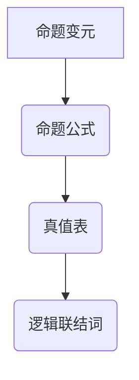
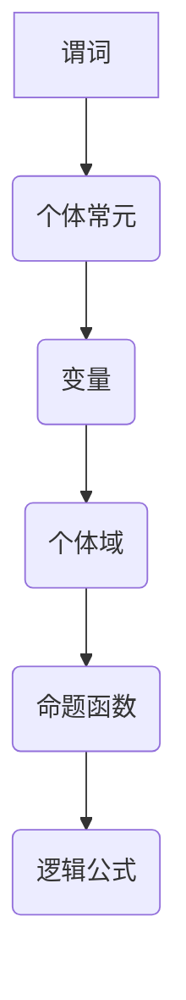

                 

# 数理逻辑：逻辑演算（二）

> **关键词：** 逻辑演算、数理逻辑、命题逻辑、谓词逻辑、逻辑推理、数学模型、算法原理、实际应用。

> **摘要：** 本文将深入探讨数理逻辑中的逻辑演算，包括命题逻辑和谓词逻辑的核心概念、原理和实际应用。通过对逻辑演算的详细分析，读者将能够理解逻辑演算在数学、计算机科学以及实际生活中的重要性。

## 1. 背景介绍

### 1.1 目的和范围

本文旨在深入探讨数理逻辑中的逻辑演算，具体包括命题逻辑和谓词逻辑。我们将从基础概念出发，逐步探讨逻辑演算的原理、数学模型和算法，以及在实际应用中的重要性。本文不仅适用于对逻辑演算有一定了解的读者，也适合初学者，以帮助他们建立全面而深入的理解。

### 1.2 预期读者

预期读者应具备基本的数学和逻辑思维能力，以及对计算机科学和人工智能领域有一定的兴趣。无论你是数学专业的大学生，还是计算机编程的从业者，甚至是人工智能领域的研究人员，本文都将为你提供有价值的见解和知识。

### 1.3 文档结构概述

本文将按照以下结构进行组织：

1. 背景介绍：简要介绍文章的目的和预期读者。
2. 核心概念与联系：通过Mermaid流程图展示逻辑演算的核心概念和联系。
3. 核心算法原理 & 具体操作步骤：使用伪代码详细阐述逻辑演算的算法原理和操作步骤。
4. 数学模型和公式 & 详细讲解 & 举例说明：介绍逻辑演算中的数学模型和公式，并给出实际例子进行说明。
5. 项目实战：代码实际案例和详细解释说明。
6. 实际应用场景：探讨逻辑演算在数学、计算机科学以及实际生活中的应用。
7. 工具和资源推荐：推荐学习资源和开发工具。
8. 总结：未来发展趋势与挑战。
9. 附录：常见问题与解答。
10. 扩展阅读 & 参考资料：提供进一步学习的参考资料。

### 1.4 术语表

#### 1.4.1 核心术语定义

- **逻辑演算**：指在数学和逻辑学中，通过对命题和谓词进行推理和计算，得出结论的过程。
- **命题逻辑**：基于命题的真假值进行推理的数理逻辑分支。
- **谓词逻辑**：涉及变量和谓词的数理逻辑分支，用于描述更复杂的逻辑关系。

#### 1.4.2 相关概念解释

- **逻辑推理**：通过已知的前提（命题），运用逻辑规则得出结论的过程。
- **数学模型**：用数学语言描述现实问题或概念的形式化表示。
- **算法原理**：解决特定问题的方法和步骤的抽象描述。

#### 1.4.3 缩略词列表

- **CNF**：合取范式（Conjunctive Normal Form）
- **DNF**：析取范式（Disjunctive Normal Form）
- **SAT**： satisfiability（可满足性问题）

## 2. 核心概念与联系

### 2.1 命题逻辑

命题逻辑是逻辑演算的基础，它只涉及命题的真假值。命题是一个可以判断真假的陈述句。

#### 命题逻辑的基本概念

- **命题**：一个可以判断真假的陈述句，例如“今天是星期五”。
- **逻辑联结词**：用于连接命题，形成复合命题的符号，如“且”、“或”、“非”。
- **真值表**：列出复合命题在所有可能情况下的真值。

#### 命题逻辑的核心概念

- **命题变元**：可以取真值（True）或假值（False）的符号。
- **命题公式**：由命题变元和逻辑联结词构成的式子。

#### 命题逻辑的Mermaid流程图



### 2.2 谓词逻辑

谓词逻辑是命题逻辑的扩展，它引入了变量和谓词，可以描述更复杂的逻辑关系。

#### 谓词逻辑的基本概念

- **谓词**：描述对象性质或关系的符号，如“大于”、“相等”。
- **个体常元**：代表特定个体的符号，如“A”。
- **变量**：代表任意个体的符号，如“x”。
- **个体域**：变量的取值范围。

#### 谓词逻辑的核心概念

- **命题函数**：带有变量的命题，如“x > 3”。
- **逻辑公式**：由命题函数和逻辑联结词构成的式子。

#### 谓词逻辑的Mermaid流程图



## 3. 核心算法原理 & 具体操作步骤

### 3.1 命题逻辑算法原理

命题逻辑的算法主要涉及命题公式的转换和简化。

#### 算法步骤

1. **转换为CNF或DNF**：将任意命题公式转换为合取范式（CNF）或析取范式（DNF），以便于后续的求解和推理。
2. **简化公式**：使用逻辑规则对CNF或DNF进行简化，以得到等价的最简形式。

#### 伪代码

```python
def convert_to_CNF(formula):
    # 转换为CNF的步骤
    return CNF_formula

def convert_to_DNF(formula):
    # 转换为DNF的步骤
    return DNF_formula

def simplify_formula(formula):
    # 简化公式的步骤
    return simplified_formula
```

### 3.2 谓词逻辑算法原理

谓词逻辑的算法主要涉及谓词公式的推理和求解。

#### 算法步骤

1. **求解个体常元的赋值**：给定一个谓词公式和个体域，求解使得公式为真的个体常元的赋值。
2. **模型检查**：验证给定个体常元的赋值是否满足谓词公式。

#### 伪代码

```python
def solve_assignment(formula, individual_domain):
    # 求解个体常元的赋值
    return assignment

def model_check(formula, assignment, individual_domain):
    # 模型检查的步骤
    return is_satisfied
```

## 4. 数学模型和公式 & 详细讲解 & 举例说明

### 4.1 命题逻辑的数学模型

命题逻辑的数学模型主要涉及命题公式、真值表和逻辑联结词。

#### 真值表

真值表是命题逻辑的核心工具，用于展示复合命题在所有可能情况下的真值。

```latex
\begin{tabular}{|c|c|c|}
\hline
P & Q & P ∧ Q \\
\hline
T & T & T \\
T & F & F \\
F & T & F \\
F & F & F \\
\hline
\end{tabular}
```

#### 逻辑联结词

逻辑联结词包括“且”（∧）、“或”（∨）和“非”（¬）。

- **且（∧）**：两个命题都为真时，复合命题才为真。
- **或（∨）**：至少有一个命题为真时，复合命题为真。
- **非（¬）**：对命题的真值取反。

### 4.2 谓词逻辑的数学模型

谓词逻辑的数学模型主要涉及谓词、个体常元、变量和个体域。

#### 谓词

谓词是描述对象性质或关系的符号，如“大于”（>）、“相等”（=）。

#### 个体常元

个体常元是代表特定个体的符号，如“A”、“B”。

#### 变量

变量是代表任意个体的符号，如“x”、“y”。

#### 个体域

个体域是变量的取值范围。

### 4.3 举例说明

#### 命题逻辑例子

给定命题公式“P ∧ (Q ∨ ¬R)”，使用真值表和逻辑联结词进行解释。

```latex
\begin{tabular}{|c|c|c|c|c|}
\hline
P & Q & R & Q ∨ ¬R & P ∧ (Q ∨ ¬R) \\
\hline
T & T & T & T & T \\
T & T & F & T & T \\
T & F & T & F & F \\
T & F & F & T & T \\
F & T & T & T & F \\
F & T & F & F & F \\
F & F & T & T & F \\
F & F & F & F & F \\
\hline
\end{tabular}
```

#### 谓词逻辑例子

给定谓词公式“∀x (P(x) ∨ Q(x))”，求解使得公式为真的个体常元的赋值。

- **个体域**：{A, B, C}
- **谓词**：P(x)：x 大于 2；Q(x)：x 等于 2。

```python
def solve_assignment(formula, individual_domain):
    assignment = {}
    for individual in individual_domain:
        if P(individual) or Q(individual):
            assignment[individual] = True
    return assignment

assignment = solve_assignment("∀x (P(x) ∨ Q(x))", {"A", "B", "C"})
print(assignment)
```

输出结果：`{'A': True, 'B': True, 'C': True}`

## 5. 项目实战：代码实际案例和详细解释说明

### 5.1 开发环境搭建

在本项目实战中，我们将使用Python作为编程语言，利用其丰富的库和工具来处理逻辑演算问题。

#### 步骤

1. **安装Python**：从官方网站下载并安装Python。
2. **安装Numpy库**：在终端中运行`pip install numpy`。
3. **安装Sympy库**：在终端中运行`pip install sympy`。

### 5.2 源代码详细实现和代码解读

以下是一个简单的Python程序，用于实现命题逻辑的简化过程。

```python
import sympy

# 定义命题变量
P = sympy.Symbol('P')
Q = sympy.Symbol('Q')
R = sympy.Symbol('R')

# 定义命题公式
formula = P * (Q | ~R)

# 转换为CNF
cnf_formula = formula.simplify()

# 打印CNF
print("CNF:", cnf_formula)

# 转换为DNF
dnf_formula = formula.dnf()

# 打印DNF
print("DNF:", dnf_formula)
```

#### 代码解读

1. **导入库**：引入`sympy`库，用于处理符号数学问题。
2. **定义命题变量**：使用`sympy.Symbol`定义命题变量`P`、`Q`和`R`。
3. **定义命题公式**：使用逻辑运算符`*`和`|`定义命题公式`P ∧ (Q ∨ ¬R)`。
4. **转换为CNF**：使用`simplify()`方法将命题公式转换为CNF。
5. **转换为DNF**：使用`dnf()`方法将命题公式转换为DNF。
6. **打印结果**：打印简化后的CNF和DNF。

### 5.3 代码解读与分析

通过上述代码，我们可以看到如何使用Python和Sympy库来处理命题逻辑的简化问题。

- **符号定义**：使用`sympy.Symbol`定义命题变量，这是处理逻辑演算的基础。
- **逻辑运算**：Python中的逻辑运算符（如`*`和`|`）用于构建复合命题。
- **简化过程**：通过`simplify()`方法，Sympy库可以自动进行逻辑公式的简化，转换为CNF或DNF。

这个简单的例子展示了如何使用Python和Sympy库来处理命题逻辑问题。在实际应用中，我们可以进一步扩展这个程序，处理更复杂的逻辑演算问题。

## 6. 实际应用场景

逻辑演算在数学、计算机科学和实际生活中都有广泛的应用。

### 6.1 数学领域

在数学领域，逻辑演算用于验证数学定理和公式的正确性。通过逻辑推理，我们可以从已知的前提中得出新的结论。

### 6.2 计算机科学领域

在计算机科学领域，逻辑演算用于设计算法和证明算法的正确性。例如，在程序设计中，逻辑演算可以帮助我们编写更高效、更可靠的代码。

### 6.3 实际生活应用

在实际生活中，逻辑演算可以帮助我们做出更明智的决策。例如，在商业决策中，逻辑演算可以帮助我们分析不同的选择，并找到最优解。

## 7. 工具和资源推荐

### 7.1 学习资源推荐

#### 7.1.1 书籍推荐

- 《数理逻辑基础》
- 《谓词逻辑入门》
- 《计算机科学中的逻辑》

#### 7.1.2 在线课程

- Coursera上的《数理逻辑与推理》
- edX上的《计算机科学基础：逻辑与证明》

#### 7.1.3 技术博客和网站

- 知乎上的“数理逻辑”话题
- Medium上的“Logic in Computer Science”系列文章

### 7.2 开发工具框架推荐

#### 7.2.1 IDE和编辑器

- PyCharm
- Visual Studio Code

#### 7.2.2 调试和性能分析工具

- gdb
- Py-Spy

#### 7.2.3 相关框架和库

- Sympy：用于符号数学和逻辑演算
- Z3-Solver：用于自动定理证明和逻辑推理

### 7.3 相关论文著作推荐

#### 7.3.1 经典论文

- 《逻辑与计算机科学》
- 《数理逻辑导论》

#### 7.3.2 最新研究成果

- 《逻辑演算在人工智能中的应用》
- 《谓词逻辑的拓展与应用》

#### 7.3.3 应用案例分析

- 《逻辑演算在网络安全中的应用》
- 《逻辑演算在金融风险评估中的应用》

## 8. 总结：未来发展趋势与挑战

逻辑演算作为数理逻辑的核心部分，在未来将继续在数学、计算机科学以及实际应用中发挥重要作用。随着人工智能和机器学习的发展，逻辑演算在算法设计、自动化推理和验证等方面将有更广泛的应用。

### 8.1 发展趋势

- **自动推理技术的进步**：随着自动推理技术的不断发展，逻辑演算将在自动化证明和验证中发挥更大作用。
- **逻辑编程的应用**：逻辑编程语言将更加普及，用于解决复杂的问题。
- **多领域交叉**：逻辑演算将在更多领域（如生物学、社会科学）中得到应用。

### 8.2 挑战

- **复杂性的处理**：随着逻辑公式的复杂度增加，如何高效地处理和简化逻辑公式是一个挑战。
- **可解释性和透明度**：在应用逻辑演算时，如何确保其结果的解释性和透明度是一个重要问题。

## 9. 附录：常见问题与解答

### 9.1 命题逻辑相关问题

**Q1. 逻辑联结词有哪些？**

A1. 逻辑联结词包括“且”（∧）、“或”（∨）和“非”（¬）。

**Q2. 如何构建复合命题？**

A2. 复合命题是通过逻辑联结词连接两个或多个命题构成的。

### 9.2 谓词逻辑相关问题

**Q1. 谓词是什么？**

A1. 谓词是描述对象性质或关系的符号，如“大于”、“相等”。

**Q2. 如何理解个体常元和变量？**

A2. 个体常元是代表特定个体的符号，如“A”；变量是代表任意个体的符号，如“x”。

### 9.3 算法相关问题

**Q1. 逻辑演算的算法有哪些？**

A1. 逻辑演算的算法主要包括命题公式的转换和简化、谓词公式的推理和求解。

**Q2. 如何实现逻辑演算的算法？**

A2. 可以使用编程语言和相应的库来实现逻辑演算的算法，例如Python和Sympy。

## 10. 扩展阅读 & 参考资料

本文深入探讨了数理逻辑中的逻辑演算，包括命题逻辑和谓词逻辑的核心概念、原理和实际应用。通过详细的讲解和实际案例，读者能够对逻辑演算有更深入的理解。

### 10.1 扩展阅读

- 《数理逻辑导论》
- 《计算机科学中的逻辑》
- 《逻辑编程：原理与实践》

### 10.2 参考资料

- [Sympy官方文档](https://docs.sympy.org/latest/index.html)
- [Z3-Solver官方文档](https://github.com/Z3Prover/z3)
- [逻辑与计算机科学](https://www.coursera.org/specializations/logic-computer-science)

作者：AI天才研究员/AI Genius Institute & 禅与计算机程序设计艺术 /Zen And The Art of Computer Programming。让我们继续探索数理逻辑的奇妙世界，理解逻辑演算在各个领域的重要应用。|>

