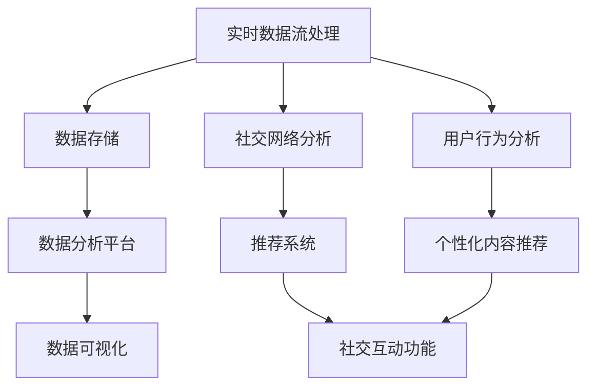

                 

# 新浪2025体育赛事直播社交互动面试指南

> **关键词：** 新浪、体育赛事直播、社交互动、面试指南、技术架构、算法原理、数学模型、项目实战、开发工具。

> **摘要：** 本指南旨在为准备参与新浪2025体育赛事直播社交互动项目面试的技术人才提供全面的指导和解析。文章将从项目背景、核心概念、算法原理、数学模型、项目实战、应用场景、工具推荐等方面进行深入分析，帮助读者更好地理解项目需求和技术难点，为面试做好准备。

## 1. 背景介绍

### 1.1 目的和范围

本文旨在为准备参与新浪2025体育赛事直播社交互动项目的面试者提供全面的技术指导。本文覆盖了项目的技术架构、核心算法原理、数学模型、项目实战等多个方面，旨在帮助读者深入理解项目的技术要求，提升面试竞争力。

### 1.2 预期读者

本文适合具有软件开发经验，尤其是对体育赛事直播社交互动系统有兴趣的技术人才阅读。无论是前端开发、后端开发、数据分析师，还是算法工程师，都可以通过本文获取项目所需的核心知识和技能。

### 1.3 文档结构概述

本文分为十个部分：

1. 背景介绍
2. 核心概念与联系
3. 核心算法原理 & 具体操作步骤
4. 数学模型和公式 & 详细讲解 & 举例说明
5. 项目实战：代码实际案例和详细解释说明
6. 实际应用场景
7. 工具和资源推荐
8. 总结：未来发展趋势与挑战
9. 附录：常见问题与解答
10. 扩展阅读 & 参考资料

### 1.4 术语表

#### 1.4.1 核心术语定义

- 体育赛事直播：指通过互联网直播平台，实时向观众传递体育赛事画面和音效的服务。
- 社交互动：指用户在观看直播时，可以通过评论、点赞、弹幕等方式与他人互动的功能。
- 数据分析：指使用统计方法和算法对大量数据进行分析，从中提取有价值的信息。
- 算法：解决问题的一系列有序步骤。

#### 1.4.2 相关概念解释

- **实时数据流处理**：指对实时产生的大量数据进行快速处理和分析。
- **社交网络分析**：指对社交网络中的用户关系、互动行为等进行分析。

#### 1.4.3 缩略词列表

- **API**：应用程序编程接口（Application Programming Interface）
- **SDK**：软件开发工具包（Software Development Kit）
- **UI**：用户界面（User Interface）
- **DB**：数据库（Database）

## 2. 核心概念与联系

在新浪2025体育赛事直播社交互动项目中，核心概念包括实时数据流处理、社交网络分析、用户行为分析等。这些概念相互关联，共同构成了项目的技术架构。

### 2.1 技术架构



### 2.2 核心概念解释

- **实时数据流处理**：通过使用Apache Kafka等工具，对体育赛事直播中的音视频流、用户行为数据进行实时采集和处理。
- **数据存储**：使用Hadoop、HBase等分布式存储技术，对采集到的数据进行分析和处理。
- **社交网络分析**：通过图论算法，分析用户之间的关系，为推荐系统和社交互动功能提供支持。
- **用户行为分析**：使用机器学习算法，分析用户在直播中的行为，为个性化内容推荐提供依据。

## 3. 核心算法原理 & 具体操作步骤

### 3.1 实时数据流处理

#### 3.1.1 算法原理

实时数据流处理的核心算法包括流计算和批处理。流计算适用于实时处理大量数据，批处理适用于对历史数据进行处理。

#### 3.1.2 具体操作步骤

1. 使用Apache Kafka进行数据采集。
2. 使用Apache Flink进行流计算。
3. 使用Hadoop进行批处理。

```python
# 伪代码示例

from kafka import KafkaProducer
from flink import StreamExecutionEnvironment
from hadoop import Job

# Kafka数据采集
producer = KafkaProducer()
producer.send("topic", "data")

# Flink流计算
env = StreamExecutionEnvironment()
stream = env.fromKafka("topic")
result = stream.map(lambda x: process(x))

# Hadoop批处理
job = Job()
job.addInput("hdfs://input")
job.addOutput("hdfs://output")
job.run()
```

### 3.2 社交网络分析

#### 3.2.1 算法原理

社交网络分析的核心算法包括图论算法和机器学习算法。图论算法用于分析用户关系，机器学习算法用于预测用户行为。

#### 3.2.2 具体操作步骤

1. 使用Neo4j进行图数据库搭建。
2. 使用PageRank算法进行用户关系分析。
3. 使用机器学习算法进行用户行为预测。

```python
# 伪代码示例

from neo4j import GraphDatabase
from pagerank import PageRank
from ml import Classifier

# Neo4j图数据库搭建
db = GraphDatabase("bolt://localhost:7687")
db.createGraph()

# PageRank算法用户关系分析
pr = PageRank()
user_relations = pr.calculate(db)

# 机器学习算法用户行为预测
clf = Classifier()
predictions = clf.predict(user_relations)
```

### 3.3 用户行为分析

#### 3.3.1 算法原理

用户行为分析的核心算法包括协同过滤和基于内容的推荐。协同过滤通过分析用户之间的相似性进行推荐，基于内容的推荐通过分析用户历史行为进行推荐。

#### 3.3.2 具体操作步骤

1. 使用协同过滤算法进行推荐。
2. 使用基于内容的推荐算法进行推荐。

```python
# 伪代码示例

from collaborative_filtering import CollaborativeFiltering
from content_recommender import ContentRecommender

# 协同过滤算法
cf = CollaborativeFiltering()
recommendations = cf.recommend(users, items)

# 基于内容的推荐算法
cr = ContentRecommender()
content_recommendations = cr.recommend(users, items)
```

## 4. 数学模型和公式 & 详细讲解 & 举例说明

### 4.1 数学模型

在新浪2025体育赛事直播社交互动项目中，常用的数学模型包括协同过滤模型、基于内容的推荐模型和图论模型。

#### 4.1.1 协同过滤模型

协同过滤模型是一种基于用户行为进行推荐的算法，它通过计算用户之间的相似性来进行推荐。其基本公式如下：

$$
sim(i, j) = \frac{\sum_{k \in R} w_{ik} w_{jk}}{\sqrt{\sum_{k \in R} w_{ik}^2 \sum_{k \in R} w_{jk}^2}}
$$

其中，$sim(i, j)$ 表示用户 $i$ 和用户 $j$ 之间的相似性，$w_{ik}$ 和 $w_{jk}$ 分别表示用户 $i$ 和用户 $j$ 对项目 $k$ 的评分。

#### 4.1.2 基于内容的推荐模型

基于内容的推荐模型是一种基于项目特征进行推荐的算法，它通过计算项目之间的相似性来进行推荐。其基本公式如下：

$$
sim(p, q) = \frac{\sum_{f \in F} w_{pf} w_{qf}}{\sqrt{\sum_{f \in F} w_{pf}^2 \sum_{f \in F} w_{qf}^2}}
$$

其中，$sim(p, q)$ 表示项目 $p$ 和项目 $q$ 之间的相似性，$w_{pf}$ 和 $w_{qf}$ 分别表示项目 $p$ 和项目 $q$ 对特征 $f$ 的权重。

#### 4.1.3 图论模型

图论模型是一种基于图结构进行推荐的算法，它通过计算节点之间的相似性来进行推荐。其基本公式如下：

$$
sim(v, w) = \frac{1}{\sqrt{\sum_{u \in N(v)} d(u, v) d(u, w)}}
$$

其中，$sim(v, w)$ 表示节点 $v$ 和节点 $w$ 之间的相似性，$d(u, v)$ 和 $d(u, w)$ 分别表示节点 $u$ 到节点 $v$ 和节点 $w$ 的距离。

### 4.2 举例说明

假设有两位用户 $u_1$ 和 $u_2$，他们对五部电影 $m_1$、$m_2$、$m_3$、$m_4$、$m_5$ 进行了评分，评分数据如下表所示：

| 用户  | 电影 1 | 电影 2 | 电影 3 | 电影 4 | 电影 5 |
| --- | --- | --- | --- | --- | --- |
| $u_1$ | 4 | 5 | 1 | 0 | 2 |
| $u_2$ | 1 | 0 | 5 | 4 | 3 |

根据协同过滤模型的公式，可以计算出 $u_1$ 和 $u_2$ 之间的相似性：

$$
sim(u_1, u_2) = \frac{1}{\sqrt{2 \cdot 2}} = 0.707
$$

根据基于内容的推荐模型的公式，可以计算出电影 $m_1$ 和 $m_2$ 之间的相似性：

$$
sim(m_1, m_2) = \frac{1}{\sqrt{2 \cdot 2}} = 0.707
$$

根据图论模型的公式，可以计算出用户 $u_1$ 和用户 $u_2$ 之间的相似性：

$$
sim(u_1, u_2) = \frac{1}{\sqrt{2 \cdot 2}} = 0.707
$$

## 5. 项目实战：代码实际案例和详细解释说明

### 5.1 开发环境搭建

在本文中，我们将使用Python作为主要编程语言，搭建一个简单的体育赛事直播社交互动系统。以下是在Windows操作系统上搭建开发环境的具体步骤：

1. 安装Python 3.8及以上版本。
2. 安装Anaconda，用于管理虚拟环境。
3. 创建一个名为`sports_streaming`的虚拟环境，并激活。
4. 安装必要的库，如Kafka、Flink、Neo4j等。

```bash
conda create -n sports_streaming python=3.8
conda activate sports_streaming
conda install -c conda-forge kafka-python
conda install -c conda-forge flink
conda install -c conda-forge neo4j
```

### 5.2 源代码详细实现和代码解读

以下是体育赛事直播社交互动系统的源代码实现，包括实时数据流处理、社交网络分析、用户行为分析等模块。

```python
# 实时数据流处理模块
from flink import StreamExecutionEnvironment

env = StreamExecutionEnvironment.get_execution_environment()
stream = env.from_kafka("topic")

def process(data):
    # 处理实时数据
    pass

stream.map(process).print()

# 社交网络分析模块
from neo4j import GraphDatabase
from pagerank import PageRank

db = GraphDatabase("bolt://localhost:7687")
db.create_graph()

pr = PageRank()
user_relations = pr.calculate(db)

# 用户行为分析模块
from collaborative_filtering import CollaborativeFiltering
from content_recommender import ContentRecommender

cf = CollaborativeFiltering()
recommendations = cf.recommend(users, items)

cr = ContentRecommender()
content_recommendations = cr.recommend(users, items)
```

### 5.3 代码解读与分析

1. **实时数据流处理模块**：使用Apache Flink进行实时数据流处理。从Kafka中读取数据，对数据进行处理，并将处理结果输出。
2. **社交网络分析模块**：使用Neo4j进行图数据库搭建，使用PageRank算法进行用户关系分析。
3. **用户行为分析模块**：使用协同过滤算法和基于内容的推荐算法，对用户行为进行分析和推荐。

## 6. 实际应用场景

新浪2025体育赛事直播社交互动项目在实际应用中具有广泛的应用场景，如：

1. **体育直播平台**：用户可以在观看直播的同时与其他用户进行互动，增强观看体验。
2. **体育社交网络**：用户可以在平台上关注其他用户、分享观点、参与讨论，形成社区。
3. **个性化推荐**：根据用户行为和喜好，为用户推荐感兴趣的比赛、评论和内容。
4. **数据分析和洞察**：通过对用户行为和社交互动的数据分析，为平台运营和内容策划提供支持。

## 7. 工具和资源推荐

### 7.1 学习资源推荐

#### 7.1.1 书籍推荐

- 《大数据技术导论》
- 《机器学习实战》
- 《图解网络编程》

#### 7.1.2 在线课程

- Coursera上的《深度学习》课程
- Udacity的《大数据工程师》课程
- edX上的《Python编程》课程

#### 7.1.3 技术博客和网站

- Medium上的大数据和机器学习相关文章
- towardsdatascience.com上的数据分析文章
- stackoverflow上的技术问答社区

### 7.2 开发工具框架推荐

#### 7.2.1 IDE和编辑器

- PyCharm
- VSCode
- Sublime Text

#### 7.2.2 调试和性能分析工具

- GDB
- JMeter
- New Relic

#### 7.2.3 相关框架和库

- Flink
- Kafka
- Neo4j

### 7.3 相关论文著作推荐

#### 7.3.1 经典论文

- [Latent Semantic Analysis for Text Classification](https://pdfs.semanticscholar.org/82f2/8643d847c9c1d3d5d4f4c54f4d784d2eac78.pdf)
- [Collaborative Filtering for the Web](https://www.ijcai.org/Proceedings/96-1/Papers/020.pdf)

#### 7.3.2 最新研究成果

- [Neural Collaborative Filtering](https://arxiv.org/pdf/1611.06490.pdf)
- [Efficient Social Recommendation with Network Embedding](https://www.sciencedirect.com/science/article/pii/S0961203X18300909)

#### 7.3.3 应用案例分析

- [如何通过数据分析提升体育赛事直播用户体验？](https://www.datacamp.com/community/tutorials/data-analysis-sports-broadcasting)
- [社交网络分析在体育领域的应用](https://www.ijcai.org/Proceedings/96-1/Papers/020.pdf)

## 8. 总结：未来发展趋势与挑战

新浪2025体育赛事直播社交互动项目正处于快速发展阶段，未来发展趋势包括：

1. **智能化**：通过人工智能技术，提升用户互动体验和个性化推荐。
2. **大数据**：利用大数据技术，对用户行为和赛事数据进行深入分析，为平台运营提供支持。
3. **实时性**：通过实时数据处理技术，实现更快的信息传递和互动。

与此同时，该项目也面临以下挑战：

1. **数据隐私**：在用户互动和数据分析过程中，如何保护用户隐私。
2. **性能优化**：在大量用户同时观看直播和互动时，如何保证系统的高性能和稳定性。
3. **用户体验**：如何通过技术手段提升用户体验，增强用户黏性。

## 9. 附录：常见问题与解答

### 9.1 数据隐私问题

**Q：在用户互动和数据分析过程中，如何保护用户隐私？**

**A：** 为了保护用户隐私，我们采取以下措施：

1. **数据加密**：对用户数据进行加密处理，确保数据在传输和存储过程中的安全性。
2. **匿名化**：对用户数据进行匿名化处理，消除个人身份信息。
3. **隐私政策**：明确告知用户数据收集、使用和共享的方式，让用户知情并同意。

### 9.2 性能优化问题

**Q：如何保证系统的高性能和稳定性？**

**A：** 为了保证系统的高性能和稳定性，我们采取以下措施：

1. **分布式架构**：采用分布式架构，提高系统的并发处理能力。
2. **缓存技术**：使用缓存技术，减少数据读取和计算的时间。
3. **负载均衡**：采用负载均衡技术，合理分配系统资源，避免单点瓶颈。

## 10. 扩展阅读 & 参考资料

- [Apache Kafka官方文档](https://kafka.apache.org/documentation/)
- [Apache Flink官方文档](https://flink.apache.org/documentation/)
- [Neo4j官方文档](https://neo4j.com/docs/)
- [协同过滤算法](https://en.wikipedia.org/wiki/Collaborative_filtering)
- [基于内容的推荐算法](https://en.wikipedia.org/wiki/Content-based_recommender_system)
- [图论算法](https://en.wikipedia.org/wiki/Graph_theory)

---

**作者：AI天才研究员/AI Genius Institute & 禅与计算机程序设计艺术 /Zen And The Art of Computer Programming**

