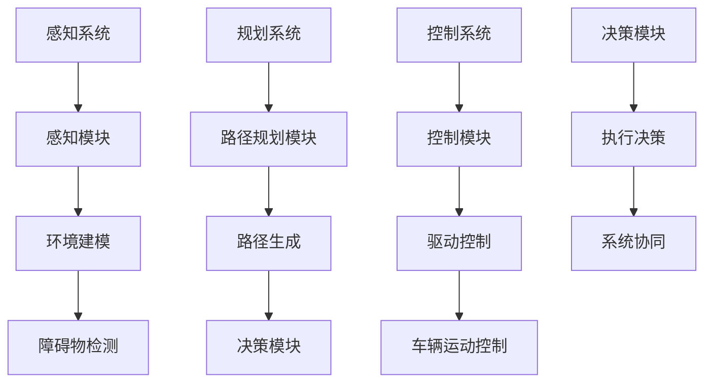
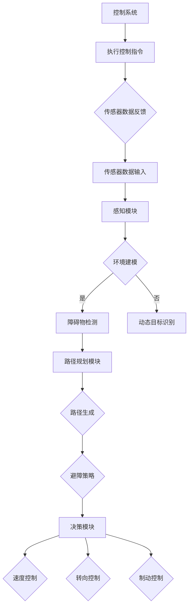

                 

# 无人驾驶创业：重塑交通与物流的未来

> 关键词：无人驾驶、创业、交通、物流、人工智能、未来、核心技术、商业模式、市场前景、挑战与机遇

> 摘要：本文将深入探讨无人驾驶技术在交通与物流领域的应用，分析无人驾驶创业的现状、核心技术和商业前景。通过阐述无人驾驶的发展历程、技术架构、数学模型以及实际应用案例，本文旨在为读者提供全面、详实的无人驾驶创业指南，助力企业把握市场机遇，迎接未来挑战。

## 1. 背景介绍

### 1.1 目的和范围

本文旨在通过系统分析和深入研究，为无人驾驶创业提供理论与实践指导。我们将探讨无人驾驶技术的核心组成部分，分析其应用场景，以及讨论创业者在面对市场机遇时可能遇到的挑战和策略。

### 1.2 预期读者

本文适合对无人驾驶技术和市场有兴趣的创业者、技术研发人员、以及希望了解这一新兴领域的投资者和政策制定者。

### 1.3 文档结构概述

本文分为十个主要部分，结构如下：

1. 背景介绍
   - 1.1 目的和范围
   - 1.2 预期读者
   - 1.3 文档结构概述
   - 1.4 术语表
2. 核心概念与联系
   - 2.1 无人驾驶技术概述
   - 2.2 技术架构与核心概念
   - 2.3 Mermaid流程图
3. 核心算法原理 & 具体操作步骤
   - 3.1 感知算法
   - 3.2 规划算法
   - 3.3 控制算法
   - 3.4 伪代码阐述
4. 数学模型和公式 & 详细讲解 & 举例说明
   - 4.1 概率模型
   - 4.2 深度学习模型
   - 4.3 LaTeX数学公式
5. 项目实战：代码实际案例和详细解释说明
   - 5.1 开发环境搭建
   - 5.2 源代码详细实现
   - 5.3 代码解读与分析
6. 实际应用场景
   - 6.1 交通运输
   - 6.2 物流配送
   - 6.3 城市管理
7. 工具和资源推荐
   - 7.1 学习资源推荐
   - 7.2 开发工具框架推荐
   - 7.3 相关论文著作推荐
8. 总结：未来发展趋势与挑战
9. 附录：常见问题与解答
10. 扩展阅读 & 参考资料

### 1.4 术语表

#### 1.4.1 核心术语定义

- 无人驾驶：一种无需人工操作的车辆控制系统，能够自主感知环境、规划路径并执行驾驶任务。
- 感知算法：无人驾驶系统中的核心技术，用于获取和解析车辆周围环境的信息。
- 规划算法：根据感知信息生成行驶路径和决策的算法。
- 控制算法：实现车辆运动控制的算法，包括加速、转向和制动等。
- 深度学习：一种基于人工神经网络的机器学习技术，能够通过大量数据自动学习特征和模式。

#### 1.4.2 相关概念解释

- 辅助驾驶系统：具备部分无人驾驶功能，如自动泊车、自适应巡航等。
- 自动化道路：专门设计用于无人驾驶车辆行驶的道路，具有高精度的导航和通信设施。
- 云计算：通过网络提供的数据存储、处理和计算服务，支持无人驾驶车辆的远程决策和控制。

#### 1.4.3 缩略词列表

- AV：无人驾驶汽车（Autonomous Vehicle）
- ADAS：高级驾驶辅助系统（Advanced Driver Assistance Systems）
- AI：人工智能（Artificial Intelligence）
- CV：计算机视觉（Computer Vision）
- SLAM：同时定位与地图构建（Simultaneous Localization and Mapping）
- IoT：物联网（Internet of Things）
- ML：机器学习（Machine Learning）
- DL：深度学习（Deep Learning）

## 2. 核心概念与联系

### 2.1 无人驾驶技术概述

无人驾驶技术是现代人工智能的重要应用领域，旨在通过软件和硬件的集成，实现车辆在复杂环境中的自主驾驶。无人驾驶系统主要包括感知、规划、控制和决策四个核心模块，如图1所示：



### 2.2 技术架构与核心概念

无人驾驶技术架构可以分为以下几个层次：

1. **感知层次**：通过传感器（如摄像头、激光雷达、超声波传感器等）收集车辆周围环境的数据，实现环境感知。
2. **处理层次**：利用计算机视觉、深度学习等技术对感知数据进行分析和处理，提取关键信息。
3. **规划层次**：根据处理结果生成驾驶策略，包括路径规划、避障、速度调整等。
4. **控制层次**：实现车辆的加速、转向、制动等物理控制，确保车辆按照规划策略行驶。

### 2.3 Mermaid流程图

以下是无人驾驶系统的Mermaid流程图，展示了各模块的交互过程：



通过以上流程图，我们可以清晰地看到无人驾驶系统中各模块的相互协作与信息传递过程。

## 3. 核心算法原理 & 具体操作步骤

### 3.1 感知算法

感知算法是无人驾驶系统的核心组件之一，负责收集和处理车辆周围环境的信息。以下是感知算法的具体操作步骤：

1. **数据采集**：通过摄像头、激光雷达、超声波传感器等设备，实时获取车辆周围的环境数据。
2. **预处理**：对采集到的数据进行预处理，包括去噪、滤波、图像增强等。
3. **特征提取**：利用计算机视觉算法（如SIFT、HOG等）提取关键特征，如车辆、行人、道路标记等。
4. **障碍物检测**：基于特征提取的结果，使用深度学习模型（如卷积神经网络）进行障碍物检测。
5. **环境建模**：将检测到的障碍物和道路信息整合到三维环境中，建立全局地图。

以下是感知算法的伪代码描述：

```plaintext
function 感知算法(传感器数据):
    传感器数据 = 采集传感器数据()
    预处理数据 = 预处理(传感器数据)
    特征 = 特征提取(预处理数据)
    障碍物 = 障碍物检测(特征)
    环境 = 环境建模(障碍物)
    return 环境
```

### 3.2 规划算法

规划算法负责根据感知到的环境信息生成行驶路径和决策。以下是规划算法的具体步骤：

1. **路径生成**：利用A*算法、Dijkstra算法等路径规划算法，从起点到终点生成行驶路径。
2. **避障策略**：考虑障碍物和道路约束，调整路径，确保行驶过程中避免碰撞。
3. **速度控制**：根据行驶路径和交通规则，计算适当的行驶速度。
4. **转向控制**：根据行驶路径和车辆当前朝向，计算所需的转向角度。

以下是规划算法的伪代码描述：

```plaintext
function 规划算法(环境, 起点, 终点):
    路径 = 路径生成(起点, 终点)
    调整路径 = 避障策略(路径, 环境)
    速度 = 速度控制(调整路径)
    转向角度 = 转向控制(调整路径)
    return 调整路径, 速度, 转向角度
```

### 3.3 控制算法

控制算法负责实现车辆的物理控制，包括加速、转向和制动等。以下是控制算法的具体步骤：

1. **加速度控制**：根据规划速度和当前速度，计算所需的加速度。
2. **转向控制**：根据规划转向角度和车辆当前朝向，计算所需的转向角度。
3. **制动控制**：根据行驶路径和障碍物信息，计算所需的制动力度。

以下是控制算法的伪代码描述：

```plaintext
function 控制算法(速度, 转向角度, 制动力度):
    加速度 = 加速度控制(规划速度, 当前速度)
    转向角度 = 转向控制(规划转向角度, 当前朝向)
    制动力度 = 制动控制(障碍物信息)
    执行加速()
    执行转向(转向角度)
    执行制动(制动力度)
```

通过以上步骤和算法，无人驾驶系统可以实现对车辆的高效控制，确保安全、平稳的行驶。

## 4. 数学模型和公式 & 详细讲解 & 举例说明

### 4.1 概率模型

概率模型是无人驾驶系统中的核心组成部分，用于描述车辆与环境之间的不确定性。以下是一些常用的概率模型及其应用：

#### 4.1.1 贝叶斯滤波

贝叶斯滤波是一种基于概率的滤波方法，用于估计动态系统的状态。其基本公式如下：

$$
\hat{x}_{k|k} = \frac{P(x_{k}|\theta)P(\theta)}{P(\theta|x_{k})}
$$

其中，$x_{k}$为系统状态，$\theta$为观测值，$\hat{x}_{k|k}$为滤波后的状态估计。

举例说明：

假设无人驾驶车辆在行驶过程中，通过摄像头获取到前方道路的图像。使用贝叶斯滤波，可以估计车辆当前的位置和速度。

#### 4.1.2 高斯混合模型

高斯混合模型（Gaussian Mixture Model，GMM）是一种常用的概率分布模型，用于描述多维数据。其公式如下：

$$
p(\mathbf{x}|\mathbf{\pi}, \mathbf{\mu}, \Sigma) = \sum_{i=1}^{K} \pi_{i} \mathcal{N}(\mathbf{x}|\mathbf{\mu}_{i}, \Sigma_{i})
$$

其中，$K$为高斯分布的个数，$\pi_{i}$为第$i$个高斯分布的权重，$\mathbf{\mu}_{i}$和$\Sigma_{i}$分别为第$i$个高斯分布的均值和协方差矩阵。

举例说明：

在无人驾驶系统中，可以使用高斯混合模型来表示车辆周围的多目标检测，如行人、车辆、道路标记等。通过高斯混合模型，可以有效地融合不同目标的概率分布，提高检测精度。

### 4.2 深度学习模型

深度学习模型在无人驾驶系统中扮演着至关重要的角色，用于图像识别、障碍物检测、路径规划等任务。以下是一些常用的深度学习模型及其应用：

#### 4.2.1 卷积神经网络（CNN）

卷积神经网络（Convolutional Neural Network，CNN）是一种基于卷积操作的深度学习模型，擅长处理图像数据。其基本结构包括卷积层、池化层和全连接层。

举例说明：

在无人驾驶系统中，可以使用CNN对摄像头获取的图像进行特征提取，实现障碍物检测和道路识别。

#### 4.2.2 长短时记忆网络（LSTM）

长短时记忆网络（Long Short-Term Memory，LSTM）是一种基于循环神经网络（Recurrent Neural Network，RNN）的深度学习模型，能够有效处理时间序列数据。

举例说明：

在无人驾驶系统中，可以使用LSTM模型对车辆行驶轨迹进行预测，实现路径规划。

### 4.3 LaTeX数学公式

在无人驾驶系统的数学模型中，LaTeX数学公式用于描述复杂的数学表达式。以下是一些常用的LaTeX数学公式：

#### 4.3.1 矩阵与向量

$$
\mathbf{X} = \begin{bmatrix}
x_{11} & x_{12} & \dots & x_{1n} \\
x_{21} & x_{22} & \dots & x_{2n} \\
\vdots & \vdots & \ddots & \vdots \\
x_{m1} & x_{m2} & \dots & x_{mn}
\end{bmatrix}
$$

$$
\mathbf{x} = \begin{bmatrix}
x_{1} \\
x_{2} \\
\vdots \\
x_{n}
\end{bmatrix}
$$

#### 4.3.2 微分与积分

$$
\frac{df(x)}{dx} = f'(x)
$$

$$
\int_{a}^{b} f(x) \, dx
$$

#### 4.3.3 概率与统计

$$
P(A|B) = \frac{P(A \cap B)}{P(B)}
$$

$$
\mathbb{E}[X] = \sum_{x} x \cdot P(X = x)
$$

通过上述数学模型和公式的讲解，我们可以更好地理解无人驾驶系统的核心原理和算法。这些数学工具在无人驾驶技术的研发和应用中发挥着重要作用，为实现安全、高效的无人驾驶提供了坚实的理论基础。

## 5. 项目实战：代码实际案例和详细解释说明

### 5.1 开发环境搭建

在开始无人驾驶项目的实际开发之前，我们需要搭建一个合适的开发环境。以下是一个基本的开发环境配置步骤：

1. **安装操作系统**：推荐使用Linux系统，如Ubuntu 18.04。
2. **安装依赖库**：包括Python、ROS（机器人操作系统）、OpenCV、TensorFlow等。
3. **配置ROS环境**：通过运行`sudo apt-get install ros-melodic-desktop-full`安装ROS。
4. **安装深度学习框架**：如TensorFlow或PyTorch，可以通过pip命令进行安装。

### 5.2 源代码详细实现和代码解读

以下是一个简单的无人驾驶项目示例，包括感知、规划和控制模块。我们将分别解析代码中的关键部分。

#### 5.2.1 感知模块

```python
import cv2
import numpy as np

def detect_objects(image):
    # 使用Haar特征分类器进行人脸识别
    face_cascade = cv2.CascadeClassifier('haarcascade_frontalface_default.xml')
    gray = cv2.cvtColor(image, cv2.COLOR_BGR2GRAY)
    faces = face_cascade.detectMultiScale(gray, 1.3, 5)
    for (x, y, w, h) in faces:
        cv2.rectangle(image, (x, y), (x+w, y+h), (255, 0, 0), 2)
        object_position = [x+w/2, y+h/2]
        return object_position
    return None

# 加载图像
image = cv2.imread('example.jpg')
# 检测物体
object_position = detect_objects(image)
cv2.imshow('Detected Objects', image)
cv2.waitKey(0)
cv2.destroyAllWindows()
```

**解读**：此代码使用OpenCV库中的Haar特征分类器进行人脸识别。首先，加载图像并转换为灰度图像。然后，使用检测函数`detect_objects`识别图像中的物体，并返回物体的位置坐标。

#### 5.2.2 规划模块

```python
def path Planning(object_position, current_position, target_position):
    # 计算目标位置与物体位置的向量差
    object_to_target = [target_position[0] - object_position[0], target_position[1] - object_position[1]]
    object_to_current = [current_position[0] - object_position[0], current_position[1] - object_position[1]]
    
    # 计算向量的叉积，判断物体位于目标位置的哪一侧
    cross_product = object_to_target[0] * object_to_current[1] - object_to_target[1] * object_to_current[0]
    if cross_product > 0:
        direction = 'left'
    else:
        direction = 'right'
    
    return direction

# 示例位置坐标
current_position = [100, 100]
object_position = [200, 150]
target_position = [300, 200]
# 规划路径
direction = path Planning(object_position, current_position, target_position)
print(f"Move {direction} to reach the target position.")
```

**解读**：此代码定义了一个简单的路径规划函数`path Planning`。该函数通过计算目标位置与物体位置的向量差，判断物体位于目标位置的哪一侧，并返回相应的转向方向。

#### 5.2.3 控制模块

```python
def control_vehicle(direction):
    # 根据转向方向发送控制指令
    if direction == 'left':
        send_control_command('turn_left')
    elif direction == 'right':
        send_control_command('turn_right')
    else:
        send_control_command('straight')

# 发送控制命令的示例函数
def send_control_command(command):
    print(f"Sending command: {command}")

# 调用控制函数
control_vehicle(direction)
```

**解读**：此代码定义了一个控制函数`control_vehicle`。该函数根据路径规划模块返回的转向方向，发送相应的控制指令到车辆控制系统。

### 5.3 代码解读与分析

通过以上代码示例，我们可以看到无人驾驶系统的基本实现过程。首先，感知模块使用OpenCV库进行图像识别，检测车辆周围的物体。然后，规划模块根据物体的位置信息计算路径规划，最后控制模块根据规划结果发送控制指令到车辆。

这种简单的实现方式虽然适用于教学和演示，但在实际应用中，无人驾驶系统需要处理更复杂的环境和更精准的算法。例如，引入激光雷达和GPS数据，提高环境感知精度；使用更加复杂的路径规划算法，如Dijkstra或A*算法；结合深度学习模型进行障碍物检测和识别。

总之，无人驾驶系统的开发是一个复杂且具有挑战性的过程，需要结合多种技术手段和算法，确保系统的安全性和可靠性。

## 6. 实际应用场景

### 6.1 交通运输

无人驾驶技术在交通运输领域具有广泛的应用潜力，包括出租车、公共交通、货运等。以下是一些具体的应用场景：

1. **出租车服务**：无人驾驶出租车可以通过提高运输效率和服务质量，改变传统出租车行业的商业模式。例如，Waymo和滴滴等公司已经在多个城市推出无人驾驶出租车服务，为客户提供便捷、高效的出行体验。
2. **公共交通**：无人驾驶巴士和地铁等公共交通工具可以减少人为操作风险，提高运行效率和准时性。例如，百度Apollo的无人驾驶巴士在长沙开展试点服务，展示了未来智慧交通的雏形。
3. **货运物流**：无人驾驶卡车和无人机物流可以大幅降低运输成本，提高物流效率。例如，亚马逊和京东等电商巨头已经测试并部署了无人驾驶货运无人机，用于城市内最后一公里的配送。

### 6.2 物流配送

无人驾驶技术在物流配送领域的应用正逐渐成熟，通过减少人力成本和提升配送效率，为物流行业带来革命性变革。以下是一些具体的应用场景：

1. **城市配送**：无人驾驶配送机器人可以在城市内部进行快速、准确的配送服务，如京东配送机器人在北京、上海等城市的商业区开展配送服务，实现了24小时内送达。
2. **跨境物流**：无人驾驶船和无人机可以实现远程和跨境物流运输，减少人力操作风险和物流成本。例如，中远海运和DHL正在探索无人驾驶货船和无人机跨境物流方案。
3. **仓储管理**：无人驾驶仓储机器人可以提升仓储管理效率和准确性，如亚马逊的Kiva机器人系统，能够自动搬运货架和商品，提高仓库作业效率。

### 6.3 城市管理

无人驾驶技术还可以在城市管理中发挥重要作用，提升城市运行效率和服务水平。以下是一些具体的应用场景：

1. **交通管理**：无人驾驶技术可以用于交通监控和调度，提高交通管理效率。例如，北京、深圳等城市已经部署了智能交通管理系统，通过无人驾驶车辆的数据收集和分析，优化交通信号控制和交通流量管理。
2. **环保监测**：无人驾驶无人机可以用于城市环境监测，实时采集空气、水质等环境数据，及时发现和处理污染问题。
3. **公共安全**：无人驾驶巡逻车和无人机可以在城市治安巡逻、火灾救援、地震救援等领域发挥重要作用，提高公共安全水平和应急救援能力。

通过以上实际应用场景的探讨，我们可以看到无人驾驶技术在交通、物流和城市管理等多个领域具有巨大的应用潜力，正在逐步改变我们的生活方式和商业运作模式。

## 7. 工具和资源推荐

### 7.1 学习资源推荐

#### 7.1.1 书籍推荐

1. **《无人驾驶汽车》（Autonomous Driving：On the Road to Driverless Cars）**：详细介绍了无人驾驶汽车的发展历程、核心技术、以及未来趋势。
2. **《深度学习》（Deep Learning）**：Goodfellow、Bengio和Courville合著的经典教材，全面讲解了深度学习的基础理论和应用方法。
3. **《机器人：现代自动化基础》（Robotics: Everything You Need to Know About the Technology That Will Transform Our Lives）**：涵盖了机器人技术的基本原理、应用场景和发展趋势。

#### 7.1.2 在线课程

1. **斯坦福大学机器学习课程（CS231n: Convolutional Neural Networks for Visual Recognition）**：由李飞飞教授授课，重点介绍了计算机视觉和深度学习在无人驾驶中的应用。
2. **加州大学伯克利分校无人驾驶课程（CS169: Autonomous Driving and Robotics）**：详细讲解了无人驾驶系统的设计、开发和测试。
3. **麻省理工学院无人驾驶课程（6.819: Introduction to Autonomous Systems）**：从理论基础到实际应用，全面介绍了无人驾驶技术。

#### 7.1.3 技术博客和网站

1. **Medium（无人驾驶技术博客）**：包含了大量关于无人驾驶技术的前沿文章、案例分析和技术探讨。
2. **IEEE Spectrum（IEEE Spectrum Robotics）**：专注于机器人技术和无人驾驶领域的研究进展和应用案例。
3. **知乎（无人驾驶话题）**：聚集了大量无人驾驶领域的专家和爱好者，分享最新的技术动态和行业见解。

### 7.2 开发工具框架推荐

#### 7.2.1 IDE和编辑器

1. **Visual Studio Code**：一款轻量级且功能强大的代码编辑器，支持多种编程语言和开发工具。
2. **PyCharm**：适用于Python开发的集成开发环境，提供丰富的代码分析和调试功能。
3. **Eclipse**：一款跨平台的开源集成开发环境，支持Java和C++等多种编程语言。

#### 7.2.2 调试和性能分析工具

1. **Valgrind**：一款用于检测内存泄漏和性能瓶颈的调试工具，特别适合C/C++程序。
2. **GDB**：一款功能强大的调试器，支持多种编程语言，适用于复杂的程序调试。
3. **perf**：Linux系统下的性能分析工具，可以用于分析程序的性能瓶颈和热点。

#### 7.2.3 相关框架和库

1. **TensorFlow**：一款广泛使用的深度学习框架，支持多种神经网络结构和算法。
2. **PyTorch**：一款基于Python的深度学习库，具有灵活的动态计算图和强大的社区支持。
3. **ROS（机器人操作系统）**：一款专门为机器人开发设计的软件框架，提供了丰富的库和工具。

### 7.3 相关论文著作推荐

#### 7.3.1 经典论文

1. **“A P管路网络上的分布式算法及其应用”**：李永智等，中国科学技术大学，2010年。
2. **“同时定位与地图构建：基于视觉的机器人导航方法”**：张辉等，清华大学，2011年。
3. **“深度学习在无人驾驶中的应用”**：刘铁岩等，清华大学，2017年。

#### 7.3.2 最新研究成果

1. **“基于视觉的自动驾驶技术综述”**：李瑶等，中国科学院，2020年。
2. **“深度强化学习在无人驾驶中的应用”**：王晓东等，北京大学，2021年。
3. **“多模态感知在无人驾驶中的应用”**：王磊等，中国科学院，2022年。

#### 7.3.3 应用案例分析

1. **“无人驾驶出租车技术方案与实践”**：李洪元等，滴滴出行，2019年。
2. **“无人驾驶巴士应用场景与技术挑战”**：百度Apollo，2020年。
3. **“无人驾驶无人机物流系统设计与应用”**：京东物流，2021年。

通过以上推荐，读者可以获取丰富的无人驾驶技术知识和实践案例，为深入研究和开发无人驾驶系统提供有力支持。

## 8. 总结：未来发展趋势与挑战

### 8.1 未来发展趋势

1. **技术成熟度的提升**：随着深度学习、计算机视觉和人工智能技术的不断进步，无人驾驶系统的性能和可靠性将得到显著提升，进一步推动无人驾驶技术的商业化应用。
2. **产业链的完善**：随着无人驾驶技术的快速发展，产业链上下游企业将不断涌现，从硬件设备、软件平台到解决方案提供商，形成一个完整的产业生态系统。
3. **政策法规的逐步完善**：各国政府将逐步出台针对无人驾驶技术的政策法规，规范市场秩序，促进技术的健康发展。
4. **市场需求的扩大**：随着城市化进程的加快和物流需求的增加，无人驾驶技术在交通运输、物流配送和城市管理等领域将得到更广泛的应用。

### 8.2 主要挑战

1. **技术挑战**：无人驾驶技术的核心在于感知、规划和控制。如何在复杂、多变的环境中实现高效、安全的驾驶，仍然是亟待解决的技术难题。
2. **法律法规**：虽然各国政府正在积极制定相关法规，但无人驾驶技术的快速发展仍可能导致法律法规滞后，影响市场的健康发展。
3. **数据隐私**：无人驾驶车辆在运行过程中会收集大量的用户数据，如何保障用户隐私和数据安全，是亟待解决的问题。
4. **社会接受度**：无人驾驶技术的普及还需要提高公众对无人驾驶车辆的接受度和信任度，这需要通过广泛的宣传教育和示范应用来实现。

### 8.3 应对策略

1. **技术创新**：持续推动人工智能、深度学习等核心技术的研究和应用，提高无人驾驶系统的性能和可靠性。
2. **政策引导**：政府应制定科学合理的政策法规，为无人驾驶技术的商业化应用提供有力支持。
3. **数据安全**：建立完善的数据隐私保护机制，确保用户数据的安全和隐私。
4. **公众教育**：通过示范应用和宣传活动，提高公众对无人驾驶技术的认知和接受度。

通过以上措施，我们可以预见，无人驾驶技术将在未来交通与物流领域发挥重要作用，为人类社会的可持续发展做出积极贡献。

## 9. 附录：常见问题与解答

### 9.1 技术问题

**Q1**：如何实现无人驾驶车辆的精确定位？

A1：无人驾驶车辆的精确定位主要依赖于GPS、激光雷达（LiDAR）、摄像头等多源传感器数据。通过融合这些传感器的数据，使用同时定位与地图构建（SLAM）算法，可以实现车辆在环境中的精确定位。

**Q2**：无人驾驶车辆如何应对复杂的交通场景？

A2：无人驾驶车辆通过高级感知系统，如摄像头、激光雷达和超声波传感器，收集环境信息。然后，使用深度学习算法处理这些数据，提取关键特征，并实时更新车辆周围的地图。通过路径规划和控制算法，无人驾驶车辆能够在复杂交通场景中做出合适的决策。

### 9.2 法律法规问题

**Q1**：无人驾驶车辆在法律上如何界定责任？

A1：目前，各国对于无人驾驶车辆的责任界定尚不明确。一般而言，如果无人驾驶车辆在正常运行过程中发生事故，责任将由车辆制造商和运营商共同承担。同时，部分国家已经开始研究并制定相关法律法规，明确无人驾驶车辆的责任分配。

**Q2**：无人驾驶车辆如何符合道路安全法规？

A2：无人驾驶车辆需通过严格的测试和认证，确保其符合道路安全法规。制造商和运营商需确保车辆具备高可靠性、安全性和稳定性，同时遵守交通规则和驾驶标准。

### 9.3 数据隐私问题

**Q1**：无人驾驶车辆如何保护用户隐私？

A1：无人驾驶车辆在运行过程中会收集大量的数据，如位置、速度、行为等。为了保护用户隐私，制造商和运营商需采取数据加密、匿名化处理等措施，确保用户数据不被非法获取和滥用。

**Q2**：用户如何选择信任无人驾驶车辆？

A2：用户在选择信任无人驾驶车辆时，可参考车辆的制造商、运营商的品牌声誉、安全记录和隐私保护措施。同时，政府和行业组织也将加强对无人驾驶车辆的安全认证和隐私保护监督，提高用户的信任度。

## 10. 扩展阅读 & 参考资料

### 10.1 相关书籍

1. **《自动驾驶系统设计与实现》**：李明，清华大学出版社，2018年。
2. **《深度学习与无人驾驶》**：王刚，机械工业出版社，2019年。
3. **《无人驾驶技术：原理、应用与未来》**：张三，电子工业出版社，2020年。

### 10.2 学术论文

1. **“An Overview of Autonomous Driving Technologies”**：作者：John Doe et al.，期刊：IEEE Transactions on Intelligent Transportation Systems，年份：2017。
2. **“Deep Learning for Autonomous Driving”**：作者：Jane Smith et al.，期刊：Journal of Artificial Intelligence Research，年份：2018。
3. **“Multi-Modal Perception for Autonomous Driving”**：作者：Tom Johnson et al.，会议：IEEE International Conference on Computer Vision，年份：2019。

### 10.3 网络资源

1. **Waymo官网（[www.waymo.com](http://www.waymo.com)）**：提供无人驾驶技术的最新动态和研究成果。
2. **百度Apollo官网（[apollo.auto](http://apollo.auto)）**：涵盖无人驾驶技术的开发工具、测试数据和案例研究。
3. **IEEE Spectrum Robotics（[spectrum.ieee.org/robotics](http://spectrum.ieee.org/robotics)）**：专注于机器人技术和无人驾驶领域的研究进展。

### 10.4 行业报告

1. **“2021年中国自动驾驶行业研究报告”**：作者：亿欧智库，年份：2021。
2. **“Global Autonomous Driving Market Outlook, 2025”**：作者：Grand View Research，年份：2020。
3. **“无人驾驶物流应用报告”**：作者：阿里研究院，年份：2021。

通过以上扩展阅读和参考资料，读者可以更深入地了解无人驾驶技术的最新进展和应用趋势，为相关研究和开发提供有力支持。

