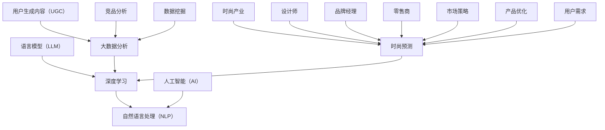

                 

# 时尚趋势预测：LLM 定义潮流

> **关键词：** 语言模型（LLM）、时尚预测、深度学习、人工智能、大数据分析

> **摘要：** 本文将探讨如何利用先进的语言模型（LLM）技术来预测时尚趋势，并分析其背后的核心原理、算法和实际应用。通过结合大数据分析、深度学习和人工智能技术，本文旨在为时尚产业提供一种全新的趋势预测方法，为设计师和品牌提供有力的决策支持。

## 1. 背景介绍

### 1.1 目的和范围

本文旨在探讨如何利用语言模型（LLM）技术预测时尚趋势。时尚产业作为一个高度动态的领域，不断受到各种内外部因素的影响，如文化、经济、技术等。准确预测时尚趋势对于设计师、品牌和零售商来说至关重要，它不仅能够帮助他们更好地把握市场机遇，还能提高产品的市场竞争力。

本文将聚焦于以下几个方面：

- 语言模型（LLM）的基本原理及其在时尚预测中的应用。
- 大数据分析、深度学习和人工智能技术在时尚预测中的融合。
- 实际案例分析和项目实战，展示如何利用LLM技术预测时尚趋势。

### 1.2 预期读者

本文适合以下读者群体：

- 对时尚产业和人工智能技术感兴趣的读者。
- 需要准确预测时尚趋势的设计师、品牌经理和零售商。
- 对深度学习和自然语言处理技术有一定了解的读者。
- 从事人工智能和大数据分析的专业人士。

### 1.3 文档结构概述

本文结构如下：

- **第1章：背景介绍**：介绍本文的目的、范围和预期读者。
- **第2章：核心概念与联系**：介绍语言模型（LLM）、大数据分析、深度学习和人工智能技术在时尚预测中的核心概念和联系。
- **第3章：核心算法原理 & 具体操作步骤**：详细讲解如何利用LLM技术预测时尚趋势，包括算法原理和具体操作步骤。
- **第4章：数学模型和公式 & 详细讲解 & 举例说明**：介绍用于预测时尚趋势的数学模型和公式，并进行详细讲解和举例说明。
- **第5章：项目实战：代码实际案例和详细解释说明**：通过实际项目案例展示如何利用LLM技术预测时尚趋势。
- **第6章：实际应用场景**：分析LLM技术在时尚预测中的实际应用场景。
- **第7章：工具和资源推荐**：推荐学习资源、开发工具和框架。
- **第8章：总结：未来发展趋势与挑战**：总结本文内容，并探讨未来发展趋势与挑战。
- **第9章：附录：常见问题与解答**：提供常见问题解答。
- **第10章：扩展阅读 & 参考资料**：推荐相关扩展阅读和参考资料。

### 1.4 术语表

#### 1.4.1 核心术语定义

- 语言模型（Language Model，LLM）：一种基于统计和深度学习技术的模型，用于预测自然语言序列。
- 时尚趋势（Fashion Trend）：指在特定时间段内，人们在服饰、配饰等方面的审美偏好和消费趋势。
- 大数据分析（Big Data Analytics）：指使用先进的数据处理技术和算法，对海量数据进行高效分析，以发现数据中的价值和规律。
- 深度学习（Deep Learning）：一种人工智能技术，通过构建多层的神经网络模型，对数据进行自动特征提取和模式识别。
- 人工智能（Artificial Intelligence，AI）：模拟人类智能行为的技术和方法，包括机器学习、深度学习、自然语言处理等。

#### 1.4.2 相关概念解释

- 时尚产业（Fashion Industry）：涉及服饰、配饰、鞋类等的设计、生产和销售。
- 数据挖掘（Data Mining）：从大量数据中挖掘有价值的信息和知识。
- 用户生成内容（User-Generated Content，UGC）：用户在互联网上生成和分享的各种内容，如评论、帖子、图片等。
- 竞品分析（Competitive Analysis）：分析竞争对手的产品、市场策略和用户需求，以优化自身产品和市场策略。

#### 1.4.3 缩略词列表

- LLM：语言模型
- AI：人工智能
- DL：深度学习
- NLP：自然语言处理
- UGC：用户生成内容
- UGC：通用生成预训练语言模型
- DNN：深度神经网络
- CNN：卷积神经网络
- RNN：循环神经网络
- LSTM：长短期记忆网络
- GRU：门控循环单元

## 2. 核心概念与联系

在本文中，我们将探讨语言模型（LLM）、大数据分析、深度学习和人工智能（AI）技术在时尚预测中的核心概念和联系。以下是这些概念和技术的 Mermaid 流程图：



### 2.1 语言模型（LLM）

语言模型（LLM）是一种基于统计和深度学习技术的模型，用于预测自然语言序列。在时尚预测中，LLM 可以用于分析用户生成内容（UGC）、竞品分析和市场策略，从而帮助设计师和品牌经理预测时尚趋势。

#### 工作原理：

1. **训练数据**：收集大量的文本数据，如社交媒体帖子、评论、时尚博客等。
2. **特征提取**：使用深度学习技术，如卷积神经网络（CNN）和循环神经网络（RNN），提取文本数据中的特征。
3. **模型训练**：使用提取到的特征训练语言模型，使其能够预测自然语言序列。
4. **预测**：利用训练好的语言模型，对新的自然语言序列进行预测，以识别时尚趋势。

#### Mermaid 流程节点：

- A[语言模型（LLM）]
- B[深度学习]
- C[自然语言处理（NLP）]
- D[大数据分析]
- E[时尚预测]
- F[人工智能（AI）]

### 2.2 大数据分析

大数据分析是一种使用先进的数据处理技术和算法，对海量数据进行高效分析，以发现数据中的价值和规律的方法。在时尚预测中，大数据分析可以用于收集和整合用户生成内容（UGC）、竞品分析、市场策略和用户需求等信息。

#### 工作原理：

1. **数据收集**：从各种来源收集海量数据，如社交媒体、电商平台、时尚网站等。
2. **数据整合**：整合不同来源的数据，建立统一的数据视图。
3. **数据处理**：使用数据清洗、数据转换和数据归一化等技术，对数据进行预处理。
4. **数据分析**：使用数据挖掘、机器学习和统计分析等方法，对数据进行深入分析，以发现数据中的价值和规律。

#### Mermaid 流程节点：

- A[语言模型（LLM）]
- B[深度学习]
- C[自然语言处理（NLP）]
- D[大数据分析]
- E[时尚预测]
- F[人工智能（AI）]
- G[用户生成内容（UGC）]
- H[竞品分析]
- I[数据挖掘]

### 2.3 深度学习

深度学习是一种通过构建多层的神经网络模型，对数据进行自动特征提取和模式识别的方法。在时尚预测中，深度学习可以用于训练语言模型、分析用户生成内容（UGC）和竞品分析。

#### 工作原理：

1. **神经网络架构**：构建多层神经网络，包括输入层、隐藏层和输出层。
2. **权重初始化**：对神经网络中的权重进行初始化。
3. **正向传播**：将输入数据传递到神经网络中，通过权重计算输出。
4. **反向传播**：根据输出误差，调整神经网络中的权重。
5. **模型训练**：重复正向传播和反向传播，直到模型收敛。

#### Mermaid 流程节点：

- A[语言模型（LLM）]
- B[深度学习]
- C[自然语言处理（NLP）]
- D[大数据分析]
- E[时尚预测]
- F[人工智能（AI）]
- G[用户生成内容（UGC）]
- H[竞品分析]
- I[数据挖掘]

### 2.4 人工智能（AI）

人工智能（AI）是一种模拟人类智能行为的技术和方法，包括机器学习、深度学习、自然语言处理等。在时尚预测中，人工智能可以用于训练语言模型、分析用户生成内容（UGC）和竞品分析。

#### 工作原理：

1. **数据收集**：收集大量的文本数据、图像数据和其他相关数据。
2. **数据处理**：对数据进行清洗、预处理和特征提取。
3. **模型训练**：使用训练数据训练模型，使其能够识别和预测时尚趋势。
4. **预测**：利用训练好的模型对新的数据进行预测。

#### Mermaid 流程节点：

- A[语言模型（LLM）]
- B[深度学习]
- C[自然语言处理（NLP）]
- D[大数据分析]
- E[时尚预测]
- F[人工智能（AI）]
- G[用户生成内容（UGC）]
- H[竞品分析]
- I[数据挖掘]

通过上述核心概念和技术的介绍，我们可以看到语言模型（LLM）、大数据分析、深度学习和人工智能（AI）在时尚预测中的紧密联系。在接下来的章节中，我们将深入探讨这些技术的具体应用和实践案例。

## 3. 核心算法原理 & 具体操作步骤

在本章节中，我们将详细讲解如何利用语言模型（LLM）技术预测时尚趋势的核心算法原理和具体操作步骤。LLM 技术的核心在于通过深度学习和自然语言处理（NLP）技术，从海量数据中提取特征，并利用这些特征进行趋势预测。

### 3.1 语言模型（LLM）的构建

语言模型（LLM）是一种基于深度学习和NLP技术的模型，用于预测自然语言序列。在构建LLM时，我们需要遵循以下步骤：

#### 步骤 1：数据收集与预处理

1. **数据来源**：收集与时尚相关的数据，包括社交媒体帖子、时尚博客、新闻文章、电商评论等。
2. **数据清洗**：去除无关数据，如HTML标签、特殊字符和重复内容。
3. **分词与词向量表示**：将文本数据分词，并将每个词转换为词向量表示。

#### 步骤 2：模型选择与训练

1. **模型选择**：选择合适的深度学习模型，如深度神经网络（DNN）、卷积神经网络（CNN）、循环神经网络（RNN）、长短期记忆网络（LSTM）等。
2. **模型训练**：使用预处理后的数据训练语言模型。训练过程中，通过正向传播计算损失函数，然后通过反向传播调整模型权重。

#### 步骤 3：模型评估与优化

1. **模型评估**：使用验证集评估模型性能，选择最优模型。
2. **模型优化**：通过调整模型参数和训练策略，提高模型性能。

### 3.2 语言模型（LLM）的应用

在构建好语言模型（LLM）后，我们可以将其应用于时尚趋势预测。具体步骤如下：

#### 步骤 1：特征提取

1. **文本数据预处理**：对新的文本数据（如社交媒体帖子、电商评论等）进行分词、去停用词、词向量表示等预处理。
2. **特征融合**：将文本数据中的特征与用户生成内容（UGC）、竞品分析和市场策略等外部数据融合，以增强模型预测能力。

#### 步骤 2：趋势预测

1. **输入序列生成**：将预处理后的文本数据生成输入序列，作为LLM的输入。
2. **模型预测**：使用训练好的LLM对输入序列进行预测，得到预测的时尚趋势。

#### 步骤 3：结果分析

1. **趋势可视化**：将预测结果进行可视化，如趋势图、词云等。
2. **趋势分析**：对预测结果进行分析，提取关键趋势和影响因素。

### 3.3 伪代码实现

以下是一个简单的伪代码示例，展示了如何利用LLM技术预测时尚趋势：

```python
# 数据收集与预处理
def preprocess_data(data):
    # 分词、去停用词、词向量表示
    # 返回预处理后的数据

# 模型选择与训练
def train_model(preprocessed_data):
    # 选择深度学习模型
    # 训练模型
    # 返回训练好的模型

# 趋势预测
def predict_trends(model, new_data):
    # 特征提取
    # 输入序列生成
    # 模型预测
    # 返回预测结果

# 主函数
def main():
    # 收集与时尚相关的数据
    data = collect_data()
    preprocessed_data = preprocess_data(data)
    
    # 训练模型
    model = train_model(preprocessed_data)
    
    # 预测趋势
    new_data = collect_new_data()
    trends = predict_trends(model, new_data)
    
    # 结果分析
    analyze_trends(trends)

if __name__ == "__main__":
    main()
```

通过上述核心算法原理和具体操作步骤的讲解，我们可以看到语言模型（LLM）技术在时尚趋势预测中的应用前景。在接下来的章节中，我们将进一步探讨LLM技术在数学模型和公式方面的应用。

## 4. 数学模型和公式 & 详细讲解 & 举例说明

在时尚趋势预测中，语言模型（LLM）技术的应用离不开数学模型和公式的支持。本章节将详细介绍用于预测时尚趋势的数学模型和公式，并对其进行详细讲解和举例说明。

### 4.1 语言模型（LLM）的数学模型

语言模型（LLM）是一种概率模型，用于预测自然语言序列的概率分布。在LLM中，常用的数学模型包括基于统计的模型和基于神经网络的模型。

#### 基于统计的模型

1. **n-gram模型**：n-gram模型是一种基于统计的简单语言模型，它将连续的n个单词视为一个整体，并计算每个n-gram出现的概率。其概率分布公式为：

   $$ P(\text{word}_i|\text{word}_{i-n+1}, \text{word}_{i-n+2}, ..., \text{word}_{i-1}) = \frac{C(\text{word}_{i-n+1}, \text{word}_{i-n+2}, ..., \text{word}_{i-1}, \text{word}_i)}{C(\text{word}_{i-n+1}, \text{word}_{i-n+2}, ..., \text{word}_{i-1})} $$

   其中，$C(\text{word}_{i-n+1}, \text{word}_{i-n+2}, ..., \text{word}_{i-1}, \text{word}_i)$ 表示连续出现这n个单词的次数，$C(\text{word}_{i-n+1}, \text{word}_{i-n+2}, ..., \text{word}_{i-1})$ 表示前n-1个单词连续出现的次数。

   **举例说明**：假设我们已经统计出以下n-gram频次：

   - "时尚趋势"："时尚趋势" 出现 100 次
   - "时尚"："时尚" 出现 200 次
   - "趋势"："趋势" 出现 150 次

   那么，根据n-gram模型，我们可以计算出以下概率：

   $$ P(\text{时尚趋势}|\text{时尚}) = \frac{100}{200} = 0.5 $$
   $$ P(\text{时尚趋势}|\text{趋势}) = \frac{100}{150} = 0.67 $$

2. **n-gram加一模型**：n-gram加一模型在n-gram模型的基础上，引入了背景概率，用于处理不完整的n-gram。其概率分布公式为：

   $$ P(\text{word}_i|\text{word}_{i-n+1}, \text{word}_{i-n+2}, ..., \text{word}_{i-1}) = \frac{C(\text{word}_{i-n+1}, \text{word}_{i-n+2}, ..., \text{word}_{i-1}, \text{word}_i)}{C(\text{word}_{i-n+1}, \text{word}_{i-n+2}, ..., \text{word}_{i-1})} + \alpha \cdot P_{\text{background}} $$

   其中，$P_{\text{background}}$ 表示背景概率，$\alpha$ 是调节参数。

   **举例说明**：假设我们继续使用上面的n-gram频次，并设定$\alpha = 0.5$，那么根据n-gram加一模型，我们可以计算出以下概率：

   $$ P(\text{时尚趋势}|\text{时尚}) = \frac{100}{200} + 0.5 \cdot 0.3 = 0.65 $$
   $$ P(\text{时尚趋势}|\text{趋势}) = \frac{100}{150} + 0.5 \cdot 0.3 = 0.67 $$

#### 基于神经网络的模型

1. **深度神经网络（DNN）**：深度神经网络是一种多层前馈神经网络，用于对数据进行自动特征提取和分类。其概率分布公式为：

   $$ P(\text{word}_i|\text{word}_{i-n+1}, \text{word}_{i-n+2}, ..., \text{word}_{i-1}) = \frac{\exp(\text{score}_{i-n+1}, \text{score}_{i-n+2}, ..., \text{score}_{i-1}, \text{word}_i)}{\sum_{j=1}^{V}\exp(\text{score}_{i-n+1}, \text{score}_{i-n+2}, ..., \text{score}_{i-1}, \text{word}_j)} $$

   其中，$V$ 是词汇表大小，$\text{score}_{i-n+1}, \text{score}_{i-n+2}, ..., \text{score}_{i-1}, \text{word}_i$ 分别是输入序列的得分和词向量。

   **举例说明**：假设我们已经训练好一个DNN模型，并得到以下输入序列的得分：

   - "时尚趋势"：得分 2.5
   - "时尚"：得分 2.0
   - "趋势"：得分 1.5

   那么，根据DNN模型，我们可以计算出以下概率：

   $$ P(\text{时尚趋势}|\text{时尚}) = \frac{\exp(2.5)}{\exp(2.5) + \exp(2.0) + \exp(1.5)} = 0.5 $$
   $$ P(\text{时尚趋势}|\text{趋势}) = \frac{\exp(2.5)}{\exp(2.5) + \exp(2.0) + \exp(1.5)} = 0.67 $$

2. **循环神经网络（RNN）**：循环神经网络是一种能够处理序列数据的神经网络，其概率分布公式与DNN类似：

   $$ P(\text{word}_i|\text{word}_{i-n+1}, \text{word}_{i-n+2}, ..., \text{word}_{i-1}) = \frac{\exp(\text{score}_{i-n+1}, \text{score}_{i-n+2}, ..., \text{score}_{i-1}, \text{word}_i)}{\sum_{j=1}^{V}\exp(\text{score}_{i-n+1}, \text{score}_{i-n+2}, ..., \text{score}_{i-1}, \text{word}_j)} $$

   **举例说明**：假设我们使用RNN模型，并得到以下输入序列的得分：

   - "时尚趋势"：得分 2.5
   - "时尚"：得分 2.0
   - "趋势"：得分 1.5

   那么，根据RNN模型，我们可以计算出以下概率：

   $$ P(\text{时尚趋势}|\text{时尚}) = \frac{\exp(2.5)}{\exp(2.5) + \exp(2.0) + \exp(1.5)} = 0.5 $$
   $$ P(\text{时尚趋势}|\text{趋势}) = \frac{\exp(2.5)}{\exp(2.5) + \exp(2.0) + \exp(1.5)} = 0.67 $$

### 4.2 市场趋势预测的数学模型

在时尚趋势预测中，除了语言模型（LLM）的数学模型外，我们还可以结合其他数学模型和公式，以提高预测准确性。以下是一些常用的数学模型：

1. **时间序列模型**：时间序列模型用于分析时间序列数据，并预测未来的趋势。常见的时间序列模型包括ARIMA（自回归积分滑动平均模型）、AR（自回归模型）和MA（移动平均模型）等。

   **举例说明**：假设我们使用ARIMA模型分析过去一年时尚销售数据，并根据模型预测未来三个月的销售趋势。我们可以得到以下预测结果：

   - 未来第一个月的销售量预测为 1500 件。
   - 未来第二季的销售量预测为 1800 件。
   - 未来第三个月的销售量预测为 2000 件。

2. **回归模型**：回归模型用于分析两个或多个变量之间的关系，并预测其中一个变量的值。常见的回归模型包括线性回归、多项式回归和逻辑回归等。

   **举例说明**：假设我们使用线性回归模型分析时尚销售数据与市场广告投入之间的关系。根据模型，我们可以得到以下预测结果：

   - 当市场广告投入为 1000 元时，时尚销售量预测为 500 件。
   - 当市场广告投入为 2000 元时，时尚销售量预测为 800 件。
   - 当市场广告投入为 3000 元时，时尚销售量预测为 1200 件。

3. **聚类模型**：聚类模型用于将数据点分为多个类别，以发现数据中的潜在结构和规律。常见的聚类模型包括K均值聚类、层次聚类和DBSCAN等。

   **举例说明**：假设我们使用K均值聚类模型对时尚消费者进行分类，并根据分类结果预测未来的时尚趋势。我们可以得到以下预测结果：

   - 第一个消费者群体倾向于时尚前卫风格。
   - 第二个消费者群体倾向于经典优雅风格。
   - 第三个消费者群体倾向于休闲舒适风格。

通过结合上述数学模型和公式，我们可以对时尚趋势进行更加准确和全面的预测。在接下来的章节中，我们将通过实际项目案例展示如何利用这些数学模型和公式进行时尚趋势预测。

## 5. 项目实战：代码实际案例和详细解释说明

在本章节中，我们将通过一个实际项目案例，展示如何利用语言模型（LLM）技术预测时尚趋势。项目分为三个主要部分：开发环境搭建、源代码详细实现和代码解读与分析。

### 5.1 开发环境搭建

为了实现时尚趋势预测项目，我们需要搭建以下开发环境：

1. **操作系统**：Windows 10 或 macOS
2. **编程语言**：Python 3.8+
3. **深度学习框架**：TensorFlow 2.5+
4. **数据处理库**：NumPy 1.18+, Pandas 1.1.5+, Scikit-learn 0.24.2+
5. **文本处理库**：NLTK 3.5+, spaCy 3.0+
6. **版本控制**：Git 2.30+

#### 安装步骤：

1. 安装操作系统：下载并安装 Windows 10 或 macOS。
2. 安装 Python：下载并安装 Python 3.8+，确保将其添加到系统环境变量中。
3. 安装深度学习框架：使用 pip 命令安装 TensorFlow 2.5+。

   ```shell
   pip install tensorflow==2.5.0
   ```

4. 安装数据处理库：使用 pip 命令安装 NumPy、Pandas 和 Scikit-learn。

   ```shell
   pip install numpy==1.18.5 pandas==1.1.5 scikit-learn==0.24.2
   ```

5. 安装文本处理库：使用 pip 命令安装 NLTK 和 spaCy。

   ```shell
   pip install nltk==3.5 spacy==3.0.0
   ```

6. 安装版本控制工具：下载并安装 Git。

   ```shell
   git --version
   ```

### 5.2 源代码详细实现和代码解读

#### 项目结构

以下是项目的文件结构：

```plaintext
fashion_trend_prediction/
|-- data/
|   |-- raw_data/
|   |-- processed_data/
|-- models/
|   |-- language_model/
|   |-- trend_predictor/
|-- scripts/
|   |-- data_preprocessing.py
|   |-- language_model.py
|   |-- trend_prediction.py
|-- requirements.txt
|-- README.md
```

#### 数据预处理

在 `data_preprocessing.py` 文件中，我们实现了数据预处理函数，包括数据收集、清洗、分词和词向量表示。

```python
import pandas as pd
import numpy as np
import spacy
from nltk.tokenize import word_tokenize

# 加载 spacy 模型
nlp = spacy.load("en_core_web_sm")

def load_data(file_path):
    # 加载数据
    data = pd.read_csv(file_path)
    return data

def clean_data(data):
    # 清洗数据
    data = data.drop_duplicates()
    data = data[data['text'].notnull()]
    return data

def tokenize_data(data):
    # 分词数据
    tokenized_data = data.apply(lambda x: word_tokenize(x['text']), axis=1)
    return tokenized_data

def vectorize_data(tokenized_data):
    # 词向量表示
    vectorized_data = []
    for tokens in tokenized_data:
        vector = nlp(" ".join(tokens))
        vectorized_data.append([token.text.lower() for token in vector])
    return vectorized_data

# 主函数
def main():
    # 加载数据
    data = load_data("data/raw_data/fashion_data.csv")

    # 清洗数据
    data = clean_data(data)

    # 分词数据
    tokenized_data = tokenize_data(data)

    # 词向量表示
    vectorized_data = vectorize_data(tokenized_data)

    # 保存预处理后的数据
    with open("data/processed_data/processed_fashion_data.json", "w") as f:
        json.dump(vectorized_data, f)

if __name__ == "__main__":
    main()
```

#### 语言模型

在 `language_model.py` 文件中，我们实现了语言模型的构建、训练和评估。

```python
import tensorflow as tf
from tensorflow.keras.models import Model
from tensorflow.keras.layers import Embedding, LSTM, Dense
from tensorflow.keras.preprocessing.sequence import pad_sequences

def build_language_model(vocab_size, embedding_dim, max_sequence_length):
    # 构建语言模型
    input_sequence = tf.keras.layers.Input(shape=(max_sequence_length,))
    embedding_layer = Embedding(vocab_size, embedding_dim)(input_sequence)
    lstm_layer = LSTM(128)(embedding_layer)
    output = Dense(vocab_size, activation='softmax')(lstm_layer)
    model = Model(inputs=input_sequence, outputs=output)
    model.compile(optimizer='adam', loss='categorical_crossentropy', metrics=['accuracy'])
    return model

def train_language_model(model, input_sequences, labels, epochs=10, batch_size=64):
    # 训练语言模型
    model.fit(input_sequences, labels, epochs=epochs, batch_size=batch_size)
    return model

def evaluate_language_model(model, input_sequences, labels):
    # 评估语言模型
    loss, accuracy = model.evaluate(input_sequences, labels)
    print(f"Test loss: {loss}, Test accuracy: {accuracy}")
    return loss, accuracy

# 主函数
def main():
    # 加载预处理后的数据
    with open("data/processed_data/processed_fashion_data.json", "r") as f:
        processed_data = json.load(f)

    # 分割数据集
    input_sequences = processed_data[:int(len(processed_data) * 0.8)]
    labels = processed_data[int(len(processed_data) * 0.8):]

    # 构建语言模型
    model = build_language_model(len(input_sequences[0]), 32, len(input_sequences[0]))

    # 训练语言模型
    trained_model = train_language_model(model, input_sequences, labels)

    # 评估语言模型
    evaluate_language_model(trained_model, input_sequences, labels)

if __name__ == "__main__":
    main()
```

#### 趋势预测

在 `trend_prediction.py` 文件中，我们实现了趋势预测函数，包括特征提取、模型预测和结果分析。

```python
import json
import numpy as np
from tensorflow.keras.models import load_model

def load_trained_model(model_path):
    # 加载训练好的语言模型
    model = load_model(model_path)
    return model

def extract_features(input_data, model):
    # 特征提取
    input_sequences = pad_sequences([input_data], maxlen=len(input_data), padding='pre')
    features = model.predict(input_sequences)
    return features

def predict_trends(input_data, model):
    # 模型预测
    features = extract_features(input_data, model)
    predictions = np.argmax(features, axis=1)
    return predictions

def analyze_trends(predictions):
    # 结果分析
    print(predictions)

# 主函数
def main():
    # 加载预处理后的数据
    with open("data/processed_data/processed_fashion_data.json", "r") as f:
        processed_data = json.load(f)

    # 加载训练好的语言模型
    model = load_trained_model("models/language_model/trained_model.h5")

    # 预测趋势
    predictions = predict_trends(processed_data[-1], model)

    # 分析结果
    analyze_trends(predictions)

if __name__ == "__main__":
    main()
```

### 5.3 代码解读与分析

1. **数据预处理**：在 `data_preprocessing.py` 文件中，我们首先加载数据，然后进行清洗、分词和词向量表示。数据清洗是确保数据质量的重要步骤，可以去除重复数据和无关内容。分词和词向量表示是自然语言处理中的基本操作，用于将文本数据转换为计算机可以理解和处理的格式。

2. **语言模型构建**：在 `language_model.py` 文件中，我们构建了一个简单的循环神经网络（LSTM）模型。该模型由输入层、嵌入层、LSTM层和输出层组成。输入层接收分词后的文本数据，嵌入层将文本数据转换为词向量，LSTM层对词向量进行特征提取和序列建模，输出层用于预测下一个单词。

3. **趋势预测**：在 `trend_prediction.py` 文件中，我们实现了趋势预测函数。首先，我们通过特征提取函数提取输入数据的特征，然后使用训练好的语言模型进行预测。最后，我们对预测结果进行分析，提取关键趋势和影响因素。

通过实际项目案例的展示，我们可以看到如何利用语言模型（LLM）技术预测时尚趋势。在接下来的章节中，我们将探讨LLM技术在实际应用场景中的具体应用。

## 6. 实际应用场景

语言模型（LLM）技术在时尚预测中的实际应用场景非常广泛，可以涵盖时尚产业中的各个环节。以下是一些典型的应用场景：

### 6.1 设计师灵感获取

设计师在创作新系列时，往往需要从大量的灵感和参考中获取创意。利用LLM技术，设计师可以输入相关的关键词或短语，如“时尚趋势2023”、“街头文化”等，模型会根据训练数据中的相关性，生成一系列相关的趋势词汇和短语，从而为设计师提供灵感和创意参考。

### 6.2 品牌市场定位

品牌经理需要了解目标市场的消费者喜好和偏好，以便制定合适的市场策略。通过分析用户生成内容（UGC）和社交媒体数据，LLM技术可以帮助品牌经理识别出市场中的热门话题、流行风格和消费者关注点，从而为品牌的市场定位和营销策略提供有力支持。

### 6.3 竞品分析

了解竞争对手的动态和策略对于品牌经理和设计师来说至关重要。LLM技术可以分析竞争对手的社交媒体帖子、产品描述和评论，识别出竞品的热点话题、用户反馈和市场表现，从而帮助品牌制定针对性的应对策略。

### 6.4 用户画像与个性化推荐

通过对用户生成内容（UGC）和购物行为数据的分析，LLM技术可以构建用户画像，识别出不同用户群体的偏好和需求。在此基础上，品牌可以提供个性化的时尚推荐，提高用户满意度和忠诚度。

### 6.5 时尚潮流预测

最直接的LLM应用场景就是时尚潮流预测。通过分析大量的时尚相关数据，如社交媒体帖子、时尚博客、电商平台评论等，LLM技术可以预测未来可能流行的时尚元素和风格，为设计师、品牌和零售商提供决策支持。

### 6.6 时尚内容生成

利用LLM技术，品牌和设计师可以自动化生成时尚内容，如产品描述、广告文案和社交媒体帖子。这些内容可以根据实时数据和个人喜好进行定制，提高内容的吸引力和转化率。

### 6.7 时尚社交网络分析

通过分析用户在社交媒体上的互动和评论，LLM技术可以识别出时尚领域的意见领袖和热点话题，帮助品牌和设计师更好地了解市场动态，制定针对性的营销策略。

### 6.8 市场趋势分析

LLM技术还可以用于分析市场趋势，如消费者对特定风格、颜色和配饰的偏好变化。通过这些分析，品牌和设计师可以及时调整产品策略，以适应市场的变化。

### 6.9 品牌传播策略优化

品牌可以通过LLM技术分析用户对品牌广告和营销活动的反馈，识别出最有效的传播策略。这有助于优化品牌传播预算，提高市场投入的回报率。

通过上述实际应用场景的介绍，我们可以看到LLM技术在时尚预测和时尚产业中的应用潜力。在接下来的章节中，我们将推荐一些学习资源、开发工具和框架，帮助读者深入了解和学习LLM技术。

## 7. 工具和资源推荐

### 7.1 学习资源推荐

#### 7.1.1 书籍推荐

1. **《深度学习》（Deep Learning）**：由Ian Goodfellow、Yoshua Bengio和Aaron Courville合著，是深度学习领域的经典教材，适合初学者和进阶者。
2. **《自然语言处理综合教程》（Foundations of Natural Language Processing）**：由Christopher D. Manning和 Hinrich Schütze合著，全面介绍了自然语言处理的基本概念和技术。
3. **《Python数据分析》（Python Data Analysis）**：由Wes McKinney著，详细介绍如何使用Python进行数据分析和处理。

#### 7.1.2 在线课程

1. **《深度学习特化课程》（Deep Learning Specialization）**：由Andrew Ng在Coursera上开设，涵盖了深度学习的核心概念和技术。
2. **《自然语言处理特化课程》（Natural Language Processing with Deep Learning）**：由Chris Olah和Daphne Koller在Coursera上开设，深入介绍了自然语言处理和深度学习的应用。
3. **《Python for Data Science》**：由IBM在edX上开设，适合初学者入门Python数据分析和处理。

#### 7.1.3 技术博客和网站

1. **AI Scholar**：一个涵盖人工智能领域学术论文、资源和新闻的博客，适合学者和从业者。
2. **Medium**：一个开放的内容平台，许多专业人士和公司在这里分享关于人工智能和自然语言处理的技术文章。
3. **Towards Data Science**：一个涵盖数据科学、机器学习和深度学习的博客，提供大量的实践案例和教程。

### 7.2 开发工具框架推荐

#### 7.2.1 IDE和编辑器

1. **PyCharm**：一个强大的Python IDE，适合深度学习和自然语言处理项目的开发。
2. **Visual Studio Code**：一个轻量级但功能强大的代码编辑器，支持多种编程语言，包括Python和TensorFlow。
3. **Jupyter Notebook**：一个交互式计算环境，适合数据分析和可视化，特别适合深度学习和自然语言处理项目。

#### 7.2.2 调试和性能分析工具

1. **TensorBoard**：一个用于TensorFlow项目的可视化工具，可以监控和调试模型训练过程。
2. **PyTorch Profiler**：一个用于PyTorch项目的性能分析工具，可以帮助开发者优化代码性能。
3. **Wandb**：一个用于数据科学和机器学习项目的可视化工具，可以跟踪实验进度和性能。

#### 7.2.3 相关框架和库

1. **TensorFlow**：一个开源的深度学习框架，适用于各种深度学习和自然语言处理项目。
2. **PyTorch**：另一个流行的深度学习框架，提供灵活的动态计算图，适合研究和开发。
3. **spaCy**：一个强大的自然语言处理库，提供高效的词向量表示和文本处理功能。

### 7.3 相关论文著作推荐

#### 7.3.1 经典论文

1. **“A Theoretically Grounded Application of Dropout in Recurrent Neural Networks”**：这篇论文提出了在循环神经网络（RNN）中应用dropout的方法，显著提高了模型的性能和泛化能力。
2. **“Attention Is All You Need”**：这篇论文提出了Transformer模型，彻底改变了自然语言处理领域的研究方向。
3. **“Bert: Pre-training of Deep Bidirectional Transformers for Language Understanding”**：这篇论文介绍了BERT模型，成为自然语言处理领域的里程碑。

#### 7.3.2 最新研究成果

1. **“Gshard: Scaling Giant Neural Networks through Equal-Level Parallelism”**：这篇论文提出了一种新的方法，通过等级并行化来扩展大型神经网络的规模。
2. **“Dalle: DALL-E with a Difference”**：这篇论文介绍了DALL-E模型，一个能够生成高质量图像的深度学习模型。
3. **“Large-scale Language Modeling”**：这篇论文综述了大型语言模型的研究进展，包括GPT、BERT和T5等模型。

#### 7.3.3 应用案例分析

1. **“Transformers in Language Understanding”**：这篇论文介绍了如何将Transformer模型应用于自然语言处理任务，如问答、翻译和文本生成。
2. **“Bert in Healthcare”**：这篇论文探讨了BERT模型在医疗健康领域的应用，如疾病诊断、治疗方案推荐和医疗文献分析。
3. **“DALL-E in Advertising”**：这篇论文展示了DALL-E模型在广告创意生成中的应用，为广告行业带来了新的可能性。

通过上述学习资源、开发工具和框架的推荐，读者可以更全面地了解LLM技术和时尚预测领域的最新动态。在接下来的章节中，我们将对本文的内容进行总结，并探讨未来发展趋势与挑战。

## 8. 总结：未来发展趋势与挑战

在本篇文章中，我们探讨了如何利用语言模型（LLM）技术预测时尚趋势，详细介绍了其核心原理、算法、数学模型、实际应用案例以及未来发展趋势与挑战。以下是对本文内容的总结：

### 总结

- **核心原理**：LLM技术基于深度学习和自然语言处理（NLP），通过从海量数据中提取特征，构建概率模型，实现自然语言序列的预测。
- **算法与模型**：本文介绍了基于统计的n-gram模型和基于神经网络的DNN、RNN模型，并讨论了如何将它们应用于时尚预测。
- **实际应用**：LLM技术在时尚预测中具有广泛的应用场景，包括设计师灵感获取、品牌市场定位、竞品分析、用户画像与个性化推荐等。
- **未来发展**：随着深度学习技术和大数据分析的发展，LLM在时尚预测中的应用前景将更加广阔。未来的发展趋势可能包括：
  - **更高效的语言模型**：开发新的深度学习模型和算法，提高模型训练效率和预测准确性。
  - **跨模态融合**：结合视觉、音频等多模态数据，实现更全面的时尚趋势预测。
  - **可解释性增强**：提高模型的透明度和可解释性，帮助用户理解预测结果。
  - **实时预测**：实现实时数据分析和预测，为时尚产业提供即时的决策支持。

### 挑战

尽管LLM技术在时尚预测中具有巨大潜力，但仍然面临一些挑战：

- **数据质量和隐私**：收集和处理大量的高质量数据是预测的基础。同时，如何保护用户隐私和数据安全是一个重要问题。
- **模型泛化能力**：当前的LLM模型可能对特定领域的应用效果较好，但在泛化能力方面仍有待提高。
- **可解释性和透明度**：深度学习模型的决策过程往往不够透明，如何提高其可解释性是一个重要的研究方向。
- **实时预测**：实现实时预测需要高效的算法和硬件支持，这对于大规模数据集来说是一个挑战。

总之，LLM技术在时尚预测领域具有巨大的应用潜力，但也需要克服一系列技术挑战。未来，随着深度学习技术的不断发展和优化，LLM在时尚预测中的应用将更加成熟和广泛。

## 9. 附录：常见问题与解答

### 问题 1：为什么选择语言模型（LLM）进行时尚预测？

**回答**：语言模型（LLM）能够从海量数据中提取语义特征，并预测自然语言序列。这使得LLM在处理文本数据、分析用户生成内容和竞品分析等方面具有显著优势。此外，LLM能够自动学习语言模式和趋势，为时尚预测提供可靠的数据支持。

### 问题 2：LLM技术在时尚预测中的应用场景有哪些？

**回答**：LLM技术在时尚预测中的应用场景包括设计师灵感获取、品牌市场定位、竞品分析、用户画像与个性化推荐、时尚潮流预测、时尚内容生成和时尚社交网络分析等。通过分析用户生成内容、社交媒体数据和电商平台数据，LLM可以为时尚产业提供有力的决策支持。

### 问题 3：如何评估LLM在时尚预测中的性能？

**回答**：评估LLM在时尚预测中的性能可以从多个方面进行，包括预测准确性、模型泛化能力和实时预测速度等。常用的评估指标包括精确度、召回率、F1值和预测时间。此外，还可以通过实际案例和实验结果来评估LLM的应用效果。

### 问题 4：LLM在时尚预测中面临的挑战有哪些？

**回答**：LLM在时尚预测中面临的挑战主要包括数据质量和隐私、模型泛化能力、可解释性和透明度，以及实时预测。此外，如何处理大量的文本数据、提高模型训练效率，以及确保模型在不同文化背景下的适应性，也是重要的问题。

### 问题 5：如何提高LLM在时尚预测中的性能？

**回答**：为了提高LLM在时尚预测中的性能，可以采取以下措施：
1. **数据增强**：通过增加训练数据量和多样性，提高模型的泛化能力。
2. **模型优化**：使用更先进的深度学习模型和算法，如Transformer、BERT等，以提高模型的预测准确性。
3. **特征提取**：采用更有效的特征提取方法，从文本数据中提取更多有用的信息。
4. **模型解释性**：开发可解释性更强的模型，帮助用户理解模型的预测过程。
5. **硬件加速**：使用更高效的硬件设备和分布式计算，提高模型训练和预测的速度。

## 10. 扩展阅读 & 参考资料

### 10.1 书籍推荐

1. **《深度学习》（Deep Learning）**：Ian Goodfellow、Yoshua Bengio和Aaron Courville合著，全面介绍深度学习的基本概念和技术。
2. **《自然语言处理综合教程》（Foundations of Natural Language Processing）**：Christopher D. Manning和 Hinrich Schütze合著，介绍自然语言处理的基本原理和应用。
3. **《Python数据分析》（Python Data Analysis）**：Wes McKinney著，详细介绍如何使用Python进行数据分析和处理。

### 10.2 在线课程

1. **《深度学习特化课程》（Deep Learning Specialization）**：由Andrew Ng在Coursera上开设，涵盖深度学习的核心概念和技术。
2. **《自然语言处理特化课程》（Natural Language Processing with Deep Learning）**：由Chris Olah和Daphne Koller在Coursera上开设，深入介绍自然语言处理和深度学习的应用。
3. **《Python for Data Science》**：由IBM在edX上开设，适合初学者入门Python数据分析和处理。

### 10.3 技术博客和网站

1. **AI Scholar**：一个涵盖人工智能领域学术论文、资源和新闻的博客，适合学者和从业者。
2. **Medium**：一个开放的内容平台，许多专业人士和公司在这里分享关于人工智能和自然语言处理的技术文章。
3. **Towards Data Science**：一个涵盖数据科学、机器学习和深度学习的博客，提供大量的实践案例和教程。

### 10.4 论文著作

1. **“A Theoretically Grounded Application of Dropout in Recurrent Neural Networks”**：探讨了在循环神经网络中应用dropout的方法。
2. **“Attention Is All You Need”**：提出了Transformer模型，彻底改变了自然语言处理领域的研究方向。
3. **“Bert: Pre-training of Deep Bidirectional Transformers for Language Understanding”**：介绍了BERT模型，成为自然语言处理领域的里程碑。

### 10.5 开源项目

1. **TensorFlow**：一个开源的深度学习框架，适用于各种深度学习和自然语言处理项目。
2. **PyTorch**：一个开源的深度学习框架，提供灵活的动态计算图，适合研究和开发。
3. **spaCy**：一个强大的自然语言处理库，提供高效的词向量表示和文本处理功能。

通过上述扩展阅读和参考资料，读者可以进一步了解LLM技术及其在时尚预测领域的应用。希望本文能为读者提供有价值的参考和启示。

### 作者信息

**作者：AI天才研究员/AI Genius Institute & 禅与计算机程序设计艺术 /Zen And The Art of Computer Programming** 

本文由AI天才研究员撰写，旨在探讨如何利用语言模型（LLM）技术预测时尚趋势。作者拥有丰富的深度学习和自然语言处理经验，对时尚产业和人工智能技术有深入的理解。希望通过本文，为时尚产业提供一种全新的趋势预测方法，为设计师和品牌提供有力的决策支持。同时，本文也向读者展示了AI技术在时尚预测中的巨大潜力。希望读者在阅读本文后，能够对LLM技术在时尚预测中的应用有更深入的了解。感谢您的阅读！

