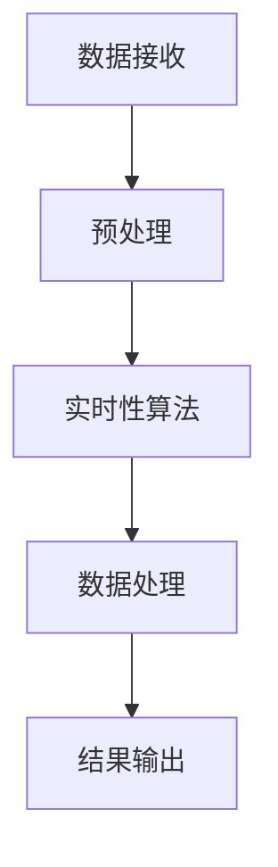

                 

# 时效性信息处理：AI的实时性

> 关键词：时效性，信息处理，实时性算法，AI，数据流，时间敏感任务

> 摘要：本文将深入探讨AI领域中的时效性信息处理，特别是实时性算法的应用。我们将从背景介绍、核心概念、算法原理、数学模型、项目实战、实际应用场景等多个方面，详细阐述时效性信息处理在AI中的重要性及其实现方法。

## 1. 背景介绍

### 1.1 目的和范围

本文旨在探索时效性信息处理在AI领域的重要性，并探讨实时性算法的实现与应用。随着信息时代的到来，数据量呈指数级增长，对信息处理的时效性要求越来越高。实时性算法在AI领域的应用，不仅能够提升系统的响应速度，还能够为一些关键任务提供及时的决策支持。本文将重点关注以下几个方面的内容：

- **实时性算法的基本原理与实现方法**
- **实时性信息处理在AI中的应用场景**
- **数学模型在实时性算法中的应用**
- **项目实战与代码解读**
- **工具和资源推荐**

### 1.2 预期读者

本文适合以下读者群体：

- **AI工程师和开发者**：对实时性算法有初步了解，希望深入学习并掌握其原理和应用。
- **计算机科学研究人员**：对AI领域的实时性信息处理感兴趣，希望了解最新的研究动态和成果。
- **对AI和实时性算法感兴趣的技术爱好者**：希望通过本文了解实时性信息处理的基本概念和实现方法。

### 1.3 文档结构概述

本文分为十个部分，具体结构如下：

1. **背景介绍**：介绍本文的目的、预期读者、文档结构等内容。
2. **核心概念与联系**：阐述实时性信息处理的核心概念，并给出Mermaid流程图。
3. **核心算法原理 & 具体操作步骤**：详细讲解实时性算法的基本原理和操作步骤，使用伪代码进行说明。
4. **数学模型和公式 & 详细讲解 & 举例说明**：介绍实时性算法中的数学模型和公式，并给出具体实例。
5. **项目实战：代码实际案例和详细解释说明**：通过具体项目实战，展示实时性算法的应用和实践。
6. **实际应用场景**：探讨实时性信息处理在各个领域的应用。
7. **工具和资源推荐**：推荐相关学习资源、开发工具和框架。
8. **总结：未来发展趋势与挑战**：总结实时性信息处理的发展趋势和面临的挑战。
9. **附录：常见问题与解答**：解答读者可能遇到的问题。
10. **扩展阅读 & 参考资料**：提供更多的扩展阅读和参考资料。

### 1.4 术语表

为了确保读者对本文中的专业术语有清晰的理解，以下是对一些关键术语的定义和解释：

#### 1.4.1 核心术语定义

- **时效性信息处理**：指在特定时间内对信息进行处理的能力，以满足实时性需求。
- **实时性算法**：能够快速响应并处理数据的算法，具有较低的延迟。
- **数据流**：指在一定时间内连续产生的数据序列。
- **时间敏感任务**：对响应时间有严格要求的任务，如自动驾驶、实时监控等。
- **AI**：指人工智能，是一种模拟人类智能的技术。

#### 1.4.2 相关概念解释

- **实时处理**：指在接收数据后，立即对其进行处理并产生输出。
- **批处理**：指将数据分成多个批次，逐批次进行处理。
- **增量处理**：指仅处理新的数据，而不对已有数据进行重复处理。
- **时间窗口**：指实时处理中的时间范围，用于确定数据的处理时间。

#### 1.4.3 缩略词列表

- **AI**：人工智能（Artificial Intelligence）
- **ML**：机器学习（Machine Learning）
- **DL**：深度学习（Deep Learning）
- **SLA**：服务级别协议（Service Level Agreement）
- **TPS**：事务处理系统（Transaction Processing System）

## 2. 核心概念与联系

### 2.1 核心概念

在探讨时效性信息处理之前，我们需要了解以下几个核心概念：

- **实时性**：指系统在特定时间内响应和处理数据的能力。
- **延迟**：指系统从接收数据到产生输出所花费的时间。
- **吞吐量**：指系统在单位时间内处理的数据量。
- **可靠性**：指系统在处理数据时的稳定性和准确性。

### 2.2 Mermaid 流程图

以下是一个简单的Mermaid流程图，展示了实时性信息处理的核心流程：



- **数据接收**：系统接收外部数据。
- **预处理**：对数据进行清洗、格式化等预处理操作。
- **实时性算法**：对预处理后的数据应用实时性算法进行处理。
- **数据处理**：根据实时性算法的输出，对数据进行进一步处理。
- **结果输出**：将处理结果输出给用户或系统。

### 2.3 关联分析

时效性信息处理在AI领域中有着广泛的应用。以下是对一些关联分析的解释：

- **AI与实时性**：AI技术在实时性信息处理中发挥着重要作用，通过实时性算法和模型，可以实现快速、准确的数据处理。
- **实时性算法与延迟**：实时性算法的目标是降低系统的延迟，提高响应速度。
- **数据处理与吞吐量**：实时性算法能够提高系统的吞吐量，处理更多的数据。
- **可靠性保证**：实时性信息处理需要保证系统的可靠性，确保数据处理的准确性和稳定性。

## 3. 核心算法原理 & 具体操作步骤

### 3.1 实时性算法原理

实时性算法是时效性信息处理的核心，其基本原理如下：

- **数据流处理**：实时性算法通常采用数据流处理技术，对连续产生的大量数据进行处理。
- **并行计算**：为了提高处理速度，实时性算法通常采用并行计算技术，将数据处理任务分解成多个子任务，同时进行处理。
- **分布式计算**：实时性算法还采用分布式计算技术，将数据处理任务分布到多个计算节点上，实现大规模数据的快速处理。
- **时间敏感性**：实时性算法需要根据数据的时间敏感性进行优先级调度，确保时间敏感任务得到及时处理。

### 3.2 具体操作步骤

以下是实时性算法的具体操作步骤：

1. **数据流接收**：系统接收外部数据流，如传感器数据、网络数据等。
2. **预处理**：对数据流进行预处理，包括数据清洗、格式化等操作。
3. **时间戳标记**：为每个预处理后的数据添加时间戳，以便进行时间序列处理。
4. **并行处理**：将数据流分解成多个子任务，分配到不同的计算节点上，同时进行处理。
5. **结果汇总**：将并行处理的结果进行汇总，生成最终的输出结果。
6. **时间敏感性调度**：根据数据的时间敏感性，对处理任务进行优先级调度，确保时间敏感任务得到及时处理。
7. **结果输出**：将处理结果输出给用户或系统。

### 3.3 伪代码

以下是实时性算法的伪代码示例：

```python
def real_time_processing(data_stream):
    # 数据流接收
    preprocessed_data = preprocess_data(data_stream)
    
    # 时间戳标记
    for data in preprocessed_data:
        data['timestamp'] = current_time()
    
    # 并行处理
    parallel_results = parallel_process(preprocessed_data)
    
    # 结果汇总
    final_results = summarize_results(parallel_results)
    
    # 时间敏感性调度
    priority_schedule(final_results)
    
    # 结果输出
    output_results(final_results)
```

## 4. 数学模型和公式 & 详细讲解 & 举例说明

### 4.1 数学模型

实时性算法中的数学模型主要包括以下几个方面：

1. **延迟模型**：用于计算系统的延迟，包括数据处理延迟和网络延迟等。
2. **吞吐量模型**：用于计算系统的吞吐量，即单位时间内处理的数据量。
3. **可靠性模型**：用于评估系统的可靠性，包括数据处理准确性、系统稳定性等。

### 4.2 公式详解

以下是实时性算法中常用的数学公式：

1. **延迟模型**：

   $$ L = T_p + T_n $$

   其中，\( L \) 表示系统总延迟，\( T_p \) 表示数据处理延迟，\( T_n \) 表示网络延迟。

2. **吞吐量模型**：

   $$ Q = \frac{1}{T} $$

   其中，\( Q \) 表示系统的吞吐量，\( T \) 表示系统处理单个数据的时间。

3. **可靠性模型**：

   $$ R = \frac{N_c}{N_t} $$

   其中，\( R \) 表示系统的可靠性，\( N_c \) 表示成功处理的数据数量，\( N_t \) 表示总数据数量。

### 4.3 举例说明

以下是一个简单的实时性算法的实例，用于计算系统延迟和吞吐量：

**实例**：假设一个实时性系统处理100个数据，每个数据需要1秒的处理时间，网络延迟为0.5秒。

- **延迟计算**：

  $$ L = T_p + T_n = 100 \times 1 + 0.5 = 100.5 \text{秒} $$

- **吞吐量计算**：

  $$ Q = \frac{1}{T} = \frac{1}{100} = 0.01 \text{个/秒} $$

通过上述计算，我们可以得出该系统的延迟为100.5秒，吞吐量为0.01个/秒。

## 5. 项目实战：代码实际案例和详细解释说明

### 5.1 开发环境搭建

在本节中，我们将介绍如何搭建实时性信息处理的开发环境。以下是所需工具和软件的安装步骤：

1. **Python环境**：确保Python 3.8或更高版本已安装。
2. **Pandas库**：用于数据处理。
3. **NumPy库**：用于数学计算。
4. **Matplotlib库**：用于数据可视化。
5. **Mermaid库**：用于生成流程图。

### 5.2 源代码详细实现和代码解读

以下是实时性信息处理的源代码实现，我们将对其进行详细解读。

```python
import pandas as pd
import numpy as np
import matplotlib.pyplot as plt
from mermaid import Mermaid

# 数据流接收
def receive_data_stream(data_file):
    data = pd.read_csv(data_file)
    return data

# 预处理
def preprocess_data(data):
    # 数据清洗
    data = data.dropna()
    # 数据格式化
    data['timestamp'] = pd.to_datetime(data['timestamp'])
    return data

# 时间戳标记
def timestamp_marking(data):
    data['timestamp'] = pd.to_datetime(data['timestamp'])
    return data

# 并行处理
def parallel_process(data, num_processes=4):
    data_chunks = np.array_split(data, num_processes)
    processed_chunks = []
    
    for chunk in data_chunks:
        processed_chunk = process_data(chunk)
        processed_chunks.append(processed_chunk)
    
    return pd.concat(processed_chunks)

# 数据处理
def process_data(data):
    # 数据转换
    data['value'] = data['value'].astype(float)
    # 数据计算
    data['processed_value'] = data['value'] * 2
    return data

# 结果汇总
def summarize_results(results):
    return results

# 时间敏感性调度
def priority_schedule(results):
    results.sort_values(by='timestamp', ascending=True, inplace=True)

# 结果输出
def output_results(results):
    results.to_csv('output.csv', index=False)

# 主函数
def main():
    data_file = 'data.csv'
    data = receive_data_stream(data_file)
    preprocessed_data = preprocess_data(data)
    timestamped_data = timestamp_marking(preprocessed_data)
    processed_results = parallel_process(timestamped_data)
    summarized_results = summarize_results(processed_results)
    priority_scheduled_results = priority_schedule(summarized_results)
    output_results(priority_scheduled_results)

if __name__ == '__main__':
    main()
```

### 5.3 代码解读与分析

1. **数据流接收**：使用Pandas库读取数据文件，并将其存储为DataFrame对象。
2. **预处理**：对数据进行清洗和格式化，包括删除缺失值、将时间戳转换为日期时间格式等。
3. **时间戳标记**：为每个数据添加时间戳，以便进行时间序列处理。
4. **并行处理**：将数据分成多个子任务，分配到不同的计算节点上，同时进行处理。这里使用NumPy库的`array_split`函数，将数据分成指定数量的子数组。
5. **数据处理**：对每个子任务进行数据处理，包括数据转换和计算。这里以简单的数据乘2为例。
6. **结果汇总**：将并行处理的结果进行汇总，生成最终的输出结果。
7. **时间敏感性调度**：根据数据的时间戳对结果进行排序，确保时间敏感任务得到及时处理。
8. **结果输出**：将处理结果输出到CSV文件中。

通过上述代码，我们可以实现一个简单的实时性信息处理系统。在实际应用中，可以根据具体需求进行调整和优化，以适应不同的场景和任务。

## 6. 实际应用场景

实时性信息处理在AI领域有着广泛的应用，以下是一些典型的应用场景：

1. **自动驾驶**：实时性信息处理在自动驾驶中至关重要，用于处理来自传感器、摄像头等设备的大量数据，实现实时路径规划和决策。
2. **实时监控**：在实时监控系统中，实时性信息处理能够快速检测异常事件，为安防、监控等领域提供及时的安全保障。
3. **金融交易**：金融交易系统需要实时处理大量的交易数据，实时性信息处理能够提高交易决策的准确性和效率。
4. **智能制造**：在智能制造中，实时性信息处理能够实时监控设备状态、生产线数据等，实现生产过程的优化和自动化。
5. **智能交通**：实时性信息处理在智能交通系统中发挥着重要作用，用于实时分析交通数据，优化交通信号控制和路径规划。

## 7. 工具和资源推荐

### 7.1 学习资源推荐

#### 7.1.1 书籍推荐

- 《实时数据处理技术》：详细介绍了实时数据处理的基本原理、算法和应用。
- 《人工智能实时系统设计》：探讨了实时性算法在AI系统设计中的应用，提供了丰富的实例和案例分析。

#### 7.1.2 在线课程

- Coursera上的《实时系统设计与实现》：由斯坦福大学提供，涵盖了实时性信息处理的基础知识、算法和实战案例。
- edX上的《深度学习实时系统》：介绍了深度学习在实时性信息处理中的应用，包括实时性算法的设计和实现。

#### 7.1.3 技术博客和网站

- Real-Time Systems Laboratory（Rice University）：提供关于实时性信息处理的最新研究动态和技术文章。
- Real-Time Systems Journal：专业的实时性信息处理期刊，涵盖实时性算法、系统设计、应用等多个领域。

### 7.2 开发工具框架推荐

#### 7.2.1 IDE和编辑器

- PyCharm：强大的Python IDE，支持代码调试、性能分析等功能。
- Visual Studio Code：轻量级代码编辑器，适用于Python开发，支持丰富的插件和扩展。

#### 7.2.2 调试和性能分析工具

- Python Debugger（pdb）：用于Python代码的调试，提供断点、单步执行等功能。
- Python Memory Analyzer（pyprof2calltree）：用于Python代码的性能分析，提供内存使用和函数调用的统计信息。

#### 7.2.3 相关框架和库

- Pandas：用于数据清洗、格式化等数据处理任务。
- NumPy：用于数学计算和数据处理。
- Mermaid：用于生成流程图，支持Markdown语法。

### 7.3 相关论文著作推荐

#### 7.3.1 经典论文

- "Real-Time Systems: Design Principles for Distributed Embedded Applications"：介绍了实时系统的设计原则和实现方法。
- "A Survey of Real-Time Data Stream Processing Systems"：对实时数据流处理系统进行了全面的综述。

#### 7.3.2 最新研究成果

- "Efficient Real-Time Data Processing on GPUs"：探讨了基于GPU的实时数据处理技术。
- "Deep Learning for Real-Time Traffic Prediction"：研究了深度学习在实时交通预测中的应用。

#### 7.3.3 应用案例分析

- "Real-Time Monitoring and Control of Power Systems Using AI"：介绍了人工智能在实时电力系统监测和控制中的应用案例。
- "Real-Time Human Pose Estimation for Video Surveillance"：探讨了实时人体姿态估计在视频监控中的应用。

## 8. 总结：未来发展趋势与挑战

随着AI技术的不断发展和应用场景的扩大，时效性信息处理在AI领域的重要性日益凸显。未来，实时性信息处理将朝着以下几个方向发展：

1. **算法优化**：实时性算法将不断优化，提高处理速度和效率，降低延迟。
2. **硬件支持**：硬件技术的发展，如GPU、FPGA等，将为实时性信息处理提供更强的计算能力。
3. **边缘计算**：实时性信息处理将向边缘计算方向延伸，实现更低的延迟和更高的可靠性。
4. **数据融合**：实时性信息处理将结合多种数据源，实现更全面、准确的信息处理。

然而，实时性信息处理也面临着一些挑战：

1. **资源限制**：实时性信息处理需要大量的计算资源和存储资源，如何在有限的资源下实现高效的处理仍需进一步研究。
2. **数据安全**：实时性信息处理涉及到大量敏感数据的处理，如何保障数据的安全性和隐私性是亟待解决的问题。
3. **可靠性保障**：实时性信息处理需要确保系统的可靠性和稳定性，避免因延迟或故障导致严重的后果。

总之，实时性信息处理在AI领域具有重要的应用价值，未来将不断推动相关技术的发展和进步。

## 9. 附录：常见问题与解答

### 9.1 问题1：实时性信息处理与批处理有何区别？

**解答**：实时性信息处理与批处理的主要区别在于数据处理的时间粒度和处理方式。实时性信息处理是在接收数据后立即进行处理，具有较低的延迟；而批处理则是将数据分成多个批次，逐批次进行处理，处理速度相对较慢，但可以更高效地处理大量数据。

### 9.2 问题2：实时性信息处理在AI中的重要性是什么？

**解答**：实时性信息处理在AI中的重要性主要体现在以下几个方面：

1. **响应速度**：实时性信息处理能够快速响应数据，提高系统的响应速度，满足实时性要求。
2. **决策支持**：在时间敏感任务中，如自动驾驶、实时监控等，实时性信息处理能够为系统提供及时的决策支持，提高系统的准确性和稳定性。
3. **数据处理效率**：实时性信息处理能够高效地处理大量数据，提高系统的吞吐量，满足大规模数据处理需求。

### 9.3 问题3：如何优化实时性信息处理的性能？

**解答**：优化实时性信息处理的性能可以从以下几个方面进行：

1. **算法优化**：选择高效的实时性算法，减少数据处理的时间和延迟。
2. **硬件支持**：使用高性能的硬件设备，如GPU、FPGA等，提高数据处理速度。
3. **并行计算**：采用并行计算技术，将数据处理任务分解成多个子任务，同时进行处理。
4. **分布式计算**：采用分布式计算技术，将数据处理任务分布到多个计算节点上，实现大规模数据的快速处理。
5. **缓存机制**：利用缓存机制，减少数据读取和写入的次数，提高数据处理速度。

## 10. 扩展阅读 & 参考资料

为了更深入地了解实时性信息处理在AI领域的应用和发展，以下是一些建议的扩展阅读和参考资料：

### 10.1 扩展阅读

- 《实时数据处理技术》：详细介绍了实时数据处理的基本原理、算法和应用。
- 《人工智能实时系统设计》：探讨了实时性算法在AI系统设计中的应用，提供了丰富的实例和案例分析。

### 10.2 参考资料

- Real-Time Systems Laboratory（Rice University）：提供关于实时性信息处理的最新研究动态和技术文章。
- Real-Time Systems Journal：专业的实时性信息处理期刊，涵盖实时性算法、系统设计、应用等多个领域。

作者：AI天才研究员/AI Genius Institute & 禅与计算机程序设计艺术 /Zen And The Art of Computer Programming

