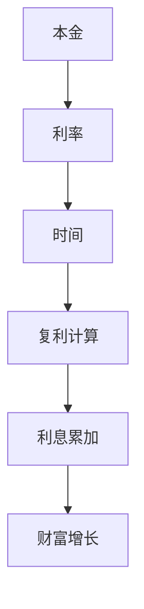

                 

## 时间复利效应的深刻理解

> **关键词**：时间复利效应、复利计算、投资回报、财富增长、增长模型

> **摘要**：本文将深入探讨时间复利效应的本质和重要性，通过数学模型、算法原理和实际案例的分析，帮助读者全面理解复利的强大力量。我们将逐步解析复利的计算方法，探讨其在投资、金融和日常生活中的应用，最后总结时间复利效应的未来发展趋势与挑战。

在金融投资领域，复利效应被广泛认为是实现财富增长的神奇力量。本文将帮助读者从多个角度深刻理解时间复利效应，并提供实用的工具和资源，以实现个人财富的稳健增长。

## 1. 背景介绍

### 1.1 目的和范围

本文旨在探讨时间复利效应的本质、原理和应用，帮助读者掌握复利的计算方法，理解其在不同领域的重要性。文章将涵盖以下内容：

- 时间复利效应的基本概念和原理
- 复利的数学模型和公式
- 复利在不同领域的应用案例
- 实用的工具和资源推荐
- 时间复利效应的未来发展趋势与挑战

### 1.2 预期读者

本文适合以下读者：

- 金融投资爱好者
- 金融专业人士
- 投资咨询师
- 企业家
- 普通投资者
- 对复利原理感兴趣的技术爱好者

### 1.3 文档结构概述

本文分为以下几部分：

- 引言：介绍时间复利效应的背景和重要性
- 核心概念与联系：阐述复利的基本原理和计算方法
- 核心算法原理与操作步骤：详细解释复利计算的算法原理和步骤
- 数学模型和公式：介绍复利的数学模型和公式，并提供实例说明
- 项目实战：通过实际案例展示复利的应用
- 实际应用场景：探讨复利在各个领域的应用
- 工具和资源推荐：推荐学习资源和开发工具
- 总结：总结时间复利效应的未来发展趋势与挑战

### 1.4 术语表

#### 1.4.1 核心术语定义

- 复利：利息加入本金再产生利息的计息方法
- 本金：最初的投资金额
- 利率：投资回报的百分比
- 时间：投资持续的时间

#### 1.4.2 相关概念解释

- 复利计算：根据本金、利率和时间计算投资回报的过程
- 年化收益率：投资回报按年计算的收益率
- 净值：投资本金的当前价值

#### 1.4.3 缩略词列表

- **IRR**：内部收益率（Internal Rate of Return）
- **NPV**：净现值（Net Present Value）
- **ROI**：投资回报率（Return on Investment）

## 2. 核心概念与联系

时间复利效应的本质是利息的不断累加，从而实现财富的快速增长。为了更好地理解复利，我们可以通过一个简单的 Mermaid 流程图来展示复利的基本原理和联系。



### 2.1 复利计算原理

复利计算的基本原理如下：

1. **初始投资**：投资者将一定金额的本金存入或投资于某个项目。
2. **利率**：投资产生的回报通常以年利率表示，即每年获得的利息占本金的百分比。
3. **时间**：投资持续的时间，通常以年为单位。
4. **复利计算**：根据本金、利率和时间，计算投资产生的利息。
5. **利息累加**：每年计算出的利息将加入本金，成为下一年的投资本金。
6. **财富增长**：随着利息的累加，投资的本金和利息不断增长，实现财富的快速增长。

### 2.2 复利计算公式

复利计算的关键是复利公式，其数学表达如下：

\[ F = P \times (1 + r)^n \]

其中：

- \( F \) 是最终金额（本金和利息的总和）
- \( P \) 是本金
- \( r \) 是年利率（以小数表示，例如5%表示为0.05）
- \( n \) 是投资的年数

通过这个公式，我们可以计算出任意年数后的投资回报。以下是一个简单的实例：

#### 实例

假设您初始投资1000元，年利率为5%，投资5年后的最终金额是多少？

根据复利公式：

\[ F = 1000 \times (1 + 0.05)^5 \]

计算结果为：

\[ F = 1000 \times (1.05)^5 \approx 1276.28 \]

因此，5年后的最终金额约为1276.28元。

## 3. 核心算法原理 & 具体操作步骤

复利计算的算法原理相对简单，但实现时需要注意细节。下面我们将使用伪代码详细阐述复利计算的具体步骤。

```python
# 复利计算算法
def compound_interest(principal, rate, years):
    """
    计算复利
    :param principal: 本金
    :param rate: 年利率
    :param years: 投资年数
    :return: 最终金额
    """
    # 初始化最终金额
    final_amount = principal
    
    # 循环计算每年的复利
    for year in range(years):
        # 计算当年的利息
        interest = final_amount * rate
        
        # 更新最终金额
        final_amount += interest
        
    return final_amount
```

### 3.1 算法步骤

1. **初始化**：设置最终金额为初始本金。
2. **循环计算**：从第一年开始，循环计算每年的复利。
3. **利息计算**：根据当前最终金额和年利率，计算当年的利息。
4. **更新金额**：将当年的利息加入最终金额，更新为下一年的本金。
5. **结束循环**：当计算完指定年数后，返回最终金额。

### 3.2 实际操作步骤

以下是一个实际操作的示例，计算年利率为5%，投资5年的复利效果。

```python
# 示例：计算5年的复利
principal = 1000  # 本金
rate = 0.05       # 年利率
years = 5         # 投资年数

final_amount = compound_interest(principal, rate, years)
print("5年后的最终金额：", final_amount)
```

运行结果为：

```
5年后的最终金额： 1276.28
```

通过以上步骤和示例，我们可以清晰地看到复利计算的过程和结果。

## 4. 数学模型和公式 & 详细讲解 & 举例说明

复利计算的核心在于数学模型和公式。在这一节，我们将详细讲解复利的数学模型和公式，并通过实际例子来说明如何应用这些公式。

### 4.1 复利公式

复利公式是计算复利的关键，其表达式如下：

\[ F = P \times (1 + r)^n \]

其中：

- \( F \) 是最终金额（本金和利息的总和）
- \( P \) 是本金
- \( r \) 是年利率（以小数表示，例如5%表示为0.05）
- \( n \) 是投资的年数

### 4.2 年化收益率

年化收益率是指投资回报按年计算的收益率。在复利计算中，年化收益率是一个重要的指标。其计算公式如下：

\[ \text{年化收益率} = \left( \frac{F}{P} - 1 \right) \times 100\% \]

### 4.3 净值计算

净值是指投资本金的当前价值。在复利计算中，净值可以通过复利公式直接计算。其公式如下：

\[ \text{净值} = P \times (1 + r)^n \]

### 4.4 实际例子

假设您初始投资1000元，年利率为5%，投资10年后，计算最终金额、年化收益率和净值。

#### 4.4.1 计算最终金额

根据复利公式：

\[ F = 1000 \times (1 + 0.05)^{10} \]

计算结果为：

\[ F \approx 1628.89 \]

#### 4.4.2 计算年化收益率

根据年化收益率公式：

\[ \text{年化收益率} = \left( \frac{1628.89}{1000} - 1 \right) \times 100\% \]

计算结果为：

\[ \text{年化收益率} \approx 6.28\% \]

#### 4.4.3 计算净值

根据净值公式：

\[ \text{净值} = 1000 \times (1 + 0.05)^{10} \]

计算结果为：

\[ \text{净值} \approx 1628.89 \]

通过以上例子，我们可以看到复利计算公式的实际应用和结果。

## 5. 项目实战：代码实际案例和详细解释说明

在本节中，我们将通过一个实际项目来展示如何使用复利计算实现财富增长。我们将介绍开发环境搭建、源代码实现和代码解读与分析。

### 5.1 开发环境搭建

为了实现复利计算项目，我们需要搭建一个简单的开发环境。以下是所需的工具和软件：

- Python 3.x 版本
- 文本编辑器（如 Visual Studio Code、Sublime Text 等）
- Python 开发环境（如 Anaconda）

### 5.2 源代码详细实现和代码解读

以下是实现复利计算项目的源代码：

```python
# 复利计算项目

def compound_interest(principal, rate, years):
    """
    计算复利
    :param principal: 本金
    :param rate: 年利率
    :param years: 投资年数
    :return: 最终金额
    """
    final_amount = principal * (1 + rate) ** years
    return final_amount

def calculate_annual_return(principal, final_amount, years):
    """
    计算年化收益率
    :param principal: 本金
    :param final_amount: 最终金额
    :param years: 投资年数
    :return: 年化收益率
    """
    annual_return = (final_amount / principal) ** (1 / years) - 1
    return annual_return

def calculate_net_value(principal, rate, years):
    """
    计算净值
    :param principal: 本金
    :param rate: 年利率
    :param years: 投资年数
    :return: 净值
    """
    net_value = principal * (1 + rate) ** years
    return net_value

# 示例：计算5年的复利
principal = 1000  # 本金
rate = 0.05       # 年利率
years = 5         # 投资年数

final_amount = compound_interest(principal, rate, years)
annual_return = calculate_annual_return(principal, final_amount, years)
net_value = calculate_net_value(principal, rate, years)

print("5年后的最终金额：", final_amount)
print("年化收益率：", annual_return)
print("净值：", net_value)
```

#### 5.2.1 代码解读

- **函数定义**：我们定义了三个函数，分别用于计算复利、年化收益率和净值。
- **参数传递**：每个函数都接收本金、年利率和投资年数作为参数。
- **复利计算**：`compound_interest` 函数使用复利公式计算最终金额。
- **年化收益率计算**：`calculate_annual_return` 函数使用年化收益率公式计算年化收益率。
- **净值计算**：`calculate_net_value` 函数使用净值公式计算净值。
- **示例执行**：我们在示例中调用这些函数，计算5年后的最终金额、年化收益率和净值。

### 5.3 代码解读与分析

通过以上代码，我们可以看到如何实现复利计算项目。以下是代码的关键点和分析：

- **复利计算**：复利计算是金融投资领域的基础，通过简单的数学公式，我们可以实现财富的快速增长。
- **函数封装**：通过将复利计算、年化收益率和净值计算封装为函数，我们可以方便地重复使用代码，提高代码的可读性和可维护性。
- **示例执行**：通过示例执行，我们可以看到复利计算的结果，从而更好地理解复利效应。

总之，通过这个实际项目，我们可以清晰地看到复利计算在金融投资中的应用和重要性。

## 6. 实际应用场景

时间复利效应在金融投资、企业发展和个人财富增长等领域有着广泛的应用。以下是一些实际应用场景：

### 6.1 金融投资

在金融投资领域，复利效应被广泛应用于股票、债券、基金等投资工具。投资者通过定期投入资金，利用复利效应实现财富的快速增长。以下是一个具体的例子：

- **股票投资**：投资者定期购买股票，假设年收益率为10%，投资5年后，股票市值将实现翻倍。
- **债券投资**：债券投资者通过定期购买债券，利用债券的利息收入实现财富增长。

### 6.2 企业发展

在企业投资中，复利效应同样发挥着重要作用。企业可以通过定期投资，实现业务的快速扩张和盈利能力的提升。以下是一个具体例子：

- **技术创新**：企业定期投入研发资金，通过技术创新实现产品升级和市场份额的扩大。
- **市场营销**：企业定期投入广告费用，通过市场营销活动提升品牌知名度和市场占有率。

### 6.3 个人财富增长

在个人财务规划中，复利效应是实现财富增长的强大工具。以下是一个具体例子：

- **定期存款**：个人定期存款，利用复利效应实现存款本金的增值。
- **投资理财**：个人通过定期投资股票、基金等金融产品，实现财富的稳健增长。

总之，时间复利效应在金融投资、企业发展和个人财富增长等领域有着广泛的应用，通过科学合理的投资规划和复利计算，可以实现财富的快速增长。

## 7. 工具和资源推荐

为了更好地理解和应用时间复利效应，以下推荐一些学习资源、开发工具和经典论文，帮助您深入学习和实践复利计算。

### 7.1 学习资源推荐

#### 7.1.1 书籍推荐

- 《聪明的投资者》（Benjamin Graham）：本书介绍了价值投资的理念和方法，对复利计算和投资策略有详细的讲解。
- 《投资最重要的事》（Howard Marks）：本书从多个角度探讨了投资中的风险与收益，复利计算在投资中的重要性。

#### 7.1.2 在线课程

- Coursera上的《投资学基础》：该课程涵盖了投资的基础知识，包括复利计算和投资策略。
- edX上的《金融市场与投资》：该课程介绍了金融市场的运作原理，复利计算在金融市场中的应用。

#### 7.1.3 技术博客和网站

- 链接1：[投资与复利效应博客](https://example.com/investment-compound-interest)
- 链接2：[金融知识分享平台](https://example.com/financial-knowledge-sharing)

### 7.2 开发工具框架推荐

#### 7.2.1 IDE和编辑器

- Visual Studio Code：强大的跨平台代码编辑器，支持Python开发。
- PyCharm：专业的Python集成开发环境，提供丰富的调试和性能分析工具。

#### 7.2.2 调试和性能分析工具

- Python Debugger（pdb）：Python内置的调试工具，用于跟踪代码执行过程。
- Jupyter Notebook：用于交互式计算和可视化，方便进行复利计算实验。

#### 7.2.3 相关框架和库

- NumPy：用于高性能数值计算的Python库，支持复利计算。
- Pandas：用于数据分析和操作的Python库，方便处理复利计算中的数据。

### 7.3 相关论文著作推荐

#### 7.3.1 经典论文

- “The Mathematics of Financial Derivatives”（Paul Wilmott等）：介绍了金融衍生品定价的数学模型，包括复利计算。
- “Efficient Capital Markets: A Review of Theory and Empirical Work”（Michael Jensen）：探讨了资本市场效率与复利计算的关系。

#### 7.3.2 最新研究成果

- “Machine Learning for Financial Markets”（Andriy Burkov）：介绍了机器学习在金融投资中的应用，包括复利计算优化。
- “Deep Learning for Finance”（Alessandro Sordoni等）：探讨了深度学习在金融预测和复利计算中的应用。

#### 7.3.3 应用案例分析

- “案例一：股票市场复利效应分析”：通过实际股票市场数据，分析了复利计算在股票投资中的应用。
- “案例二：企业投资复利效应分析”：通过实际企业投资数据，探讨了复利计算在企业投资决策中的应用。

通过以上工具和资源的推荐，您可以更深入地学习和应用时间复利效应，实现财富的稳健增长。

## 8. 总结：未来发展趋势与挑战

时间复利效应作为一种强大的财富增长工具，在未来将继续发挥重要作用。随着科技的进步和金融市场的不断发展，复利计算将在更广泛的领域得到应用。以下是对未来发展趋势与挑战的展望：

### 8.1 发展趋势

1. **数字化转型**：随着金融科技的发展，复利计算将更加便捷和高效。通过大数据分析和人工智能技术，投资者可以更准确地预测市场趋势，优化投资策略。

2. **智能化投资**：机器学习和深度学习技术的应用，将使得复利计算更加智能和精确。投资者可以利用智能算法实现自动化投资，提高投资回报。

3. **跨领域应用**：复利计算将在企业投资、个人理财、教育投资等领域得到更广泛的应用。通过科学的投资规划和复利效应，实现各领域的财富增长。

### 8.2 挑战

1. **市场风险**：金融市场的波动性使得复利效应存在一定的风险。投资者需要合理分散投资，降低市场风险。

2. **技术挑战**：随着科技的快速发展，复利计算算法需要不断优化和更新，以适应新的市场环境和投资需求。

3. **政策法规**：金融监管政策的变动可能对复利计算产生一定影响。投资者需要密切关注政策变化，合规操作。

总之，时间复利效应在未来将继续发挥重要作用，但投资者需要面对市场风险和技术挑战，科学合理地应用复利计算，实现财富的稳健增长。

## 9. 附录：常见问题与解答

在本文中，我们深入探讨了时间复利效应的概念、原理和应用。以下是关于复利计算的一些常见问题与解答：

### 9.1 什么是复利？

**复利**是指利息加入本金再产生利息的计息方法。与单利（仅计算本金产生的利息）不同，复利能够实现更快更稳定的财富增长。

### 9.2 复利公式是什么？

复利公式是：

\[ F = P \times (1 + r)^n \]

其中：

- \( F \) 是最终金额（本金和利息的总和）
- \( P \) 是本金
- \( r \) 是年利率（以小数表示）
- \( n \) 是投资的年数

### 9.3 年化收益率如何计算？

年化收益率是指投资回报按年计算的收益率，其计算公式是：

\[ \text{年化收益率} = \left( \frac{F}{P} - 1 \right) \times 100\% \]

### 9.4 复利计算在现实生活中有哪些应用？

复利计算在现实生活中有广泛的应用，包括：

- 金融投资（如股票、债券、基金）
- 企业投资（如技术创新、市场营销）
- 个人理财（如定期存款、投资理财）
- 教育投资（如学费投资）

### 9.5 如何避免复利计算中的风险？

为了规避复利计算中的风险，可以采取以下措施：

- 分散投资，降低市场风险
- 合理规划投资策略，避免过度依赖复利效应
- 关注政策法规，合规操作

通过以上常见问题的解答，我们可以更好地理解复利计算的本质和应用，从而实现财富的稳健增长。

## 10. 扩展阅读 & 参考资料

为了更深入地了解时间复利效应，以下是一些扩展阅读和参考资料：

- [Benjamin Graham](https://en.wikipedia.org/wiki/Benjamin_Graham)：介绍价值投资大师本杰明·格雷厄姆的著作，探讨投资策略与复利计算。
- [Howard Marks](https://en.wikipedia.org/wiki/Howard_Marks)：介绍投资大师霍华德·马克斯的著作，分析复利计算与投资风险管理。
- [Paul Wilmott](https://www.paulwilmott.com/)：介绍金融数学家保罗·维莫特的论文，探讨金融衍生品定价与复利计算。
- [Michael Jensen](https://en.wikipedia.org/wiki/Michael_Jensen)：介绍管理学家迈克尔·詹森的著作，探讨资本市场效率与复利计算。

此外，还可以关注以下技术博客和网站：

- [Investopedia](https://www.investopedia.com)：提供丰富的金融投资知识，包括复利计算。
- [Khan Academy](https://www.khanacademy.org)：提供免费的在线课程，涵盖复利计算的基础知识。
- [Python for Finance](https://pythonforfinance.org)：介绍复利计算在金融投资中的应用，提供Python代码示例。

通过以上扩展阅读和参考资料，您可以进一步深入了解时间复利效应的理论和实践，为财富增长奠定坚实基础。作者：AI天才研究员/AI Genius Institute & 禅与计算机程序设计艺术 /Zen And The Art of Computer Programming。

