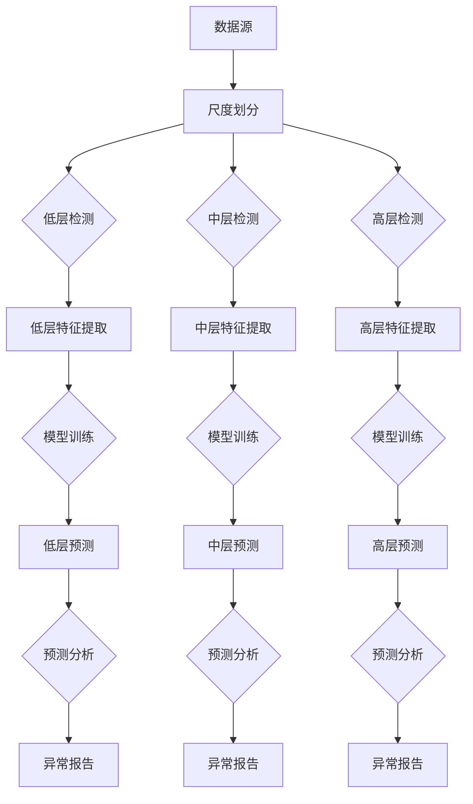
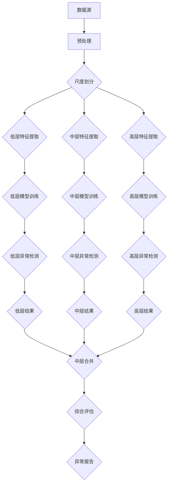

                 

### 1. 背景介绍

#### 1.1 目的和范围

本文旨在深入探讨时间序列异常检测中的多尺度建模与层次化检测方法，通过系统地阐述核心概念、算法原理、数学模型以及项目实战，帮助读者全面了解这一领域的最新进展和应用实践。文章的核心目标是：

1. **核心概念的深入理解**：介绍时间序列、异常检测以及多尺度建模和层次化检测方法的基本概念和理论基础。
2. **算法原理的详细讲解**：阐述多尺度建模与层次化检测方法的算法原理，并使用伪代码进行具体操作步骤的详细说明。
3. **数学模型和公式的讲解**：通过数学模型和公式，对算法原理进行详细的数学描述，并通过实例说明公式应用。
4. **项目实战的案例分析**：通过具体的项目实战案例，展示多尺度建模与层次化检测方法在实际应用中的效果和操作流程。
5. **实际应用场景的探讨**：分析多尺度建模与层次化检测方法在不同领域的应用场景和挑战。

本文主要面向以下读者群体：

1. **时间序列分析研究者**：对时间序列分析有兴趣的学者和研究人员，希望深入了解多尺度建模与层次化检测方法。
2. **数据科学家和工程师**：在金融、医疗、工业等领域从事数据分析和异常检测的工程师和数据科学家。
3. **计算机科学和人工智能学生**：对时间序列分析相关课程感兴趣的学生，希望通过本文深入理解多尺度建模与层次化检测方法。

#### 1.2 预期读者

预期读者应具备以下基本知识：

1. **时间序列基础**：了解时间序列的定义、常见特征和数据处理方法。
2. **概率论与统计学**：掌握概率分布、假设检验和统计模型的基本概念。
3. **机器学习基础**：了解常见的机器学习算法和异常检测技术。
4. **编程能力**：具备Python等编程语言的基本编程能力，能够理解并实现文中提到的算法和模型。

通过本文的学习，读者可以：

1. **深入理解多尺度建模与层次化检测方法**：掌握多尺度建模和层次化检测的基本概念和原理。
2. **学会算法的应用**：能够将多尺度建模与层次化检测方法应用于实际项目中。
3. **提升数据处理能力**：通过实战案例，提高对复杂数据集的处理和分析能力。

#### 1.3 文档结构概述

本文分为以下几个部分：

1. **背景介绍**：介绍本文的研究背景、目的、预期读者和文档结构。
2. **核心概念与联系**：通过Mermaid流程图展示多尺度建模与层次化检测方法的整体架构。
3. **核心算法原理 & 具体操作步骤**：使用伪代码详细阐述算法原理和操作步骤。
4. **数学模型和公式 & 详细讲解 & 举例说明**：通过数学模型和公式，深入讲解算法原理。
5. **项目实战：代码实际案例和详细解释说明**：展示具体的项目实战案例。
6. **实际应用场景**：探讨多尺度建模与层次化检测方法在不同领域的应用。
7. **工具和资源推荐**：推荐相关的学习资源、开发工具框架和论文著作。
8. **总结：未来发展趋势与挑战**：总结本文内容，展望未来的发展趋势和挑战。
9. **附录：常见问题与解答**：提供常见问题的解答和扩展知识。
10. **扩展阅读 & 参考资料**：推荐相关的扩展阅读材料和参考文献。

通过以上结构的安排，本文旨在系统地介绍多尺度建模与层次化检测方法，帮助读者全面掌握这一领域的关键技术。

#### 1.4 术语表

在本文中，将使用以下术语，并对其进行定义和解释。

##### 1.4.1 核心术语定义

1. **时间序列（Time Series）**：
    - 时间序列是一组按照特定时间顺序排列的数据点，通常用于记录某一现象或过程的变化情况。时间序列数据可以是连续的，也可以是离散的。

2. **异常检测（Anomaly Detection）**：
    - 异常检测是一种数据挖掘技术，用于识别数据集中的异常或异常模式。这些异常可能是由于数据质量问题、异常行为或异常事件引起的。

3. **多尺度建模（Multiscale Modeling）**：
    - 多尺度建模是一种处理时间序列数据的方法，通过在不同时间尺度上对数据进行建模，捕捉数据在不同层次上的特征。

4. **层次化检测（Hierarchical Detection）**：
    - 层次化检测是一种将异常检测分为多个层次的方法，通过在不同层次上分别检测异常，以提高检测效率和准确性。

##### 1.4.2 相关概念解释

1. **尺度（Scale）**：
    - 尺度是指数据在不同时间尺度上的分布和变化特征。通常，高尺度表示较长的时间跨度，低尺度表示较短的时间跨度。

2. **特征提取（Feature Extraction）**：
    - 特征提取是指从原始数据中提取出对异常检测有帮助的数值特征或符号特征。特征提取是异常检测中重要的一步，直接影响检测效果。

3. **监督学习（Supervised Learning）**：
    - 监督学习是一种机器学习方法，通过使用已标记的数据集来训练模型，从而预测未知数据的标签。在异常检测中，监督学习可以用于构建分类模型。

4. **无监督学习（Unsupervised Learning）**：
    - 无监督学习是一种机器学习方法，无需使用已标记的数据集来训练模型，而是通过数据本身的分布和特征来学习模式。无监督学习常用于发现数据中的异常模式。

##### 1.4.3 缩略词列表

- **MCMC**：马尔可夫链蒙特卡罗（Markov Chain Monte Carlo）
- **ARIMA**：自回归积分滑动平均模型（AutoRegressive Integrated Moving Average）
- **LSTM**：长短时记忆网络（Long Short-Term Memory）
- **CNN**：卷积神经网络（Convolutional Neural Network）
- **ML**：机器学习（Machine Learning）
- **AI**：人工智能（Artificial Intelligence）

通过上述术语表的定义和解释，读者可以更好地理解本文中使用的关键术语，为后续内容的阅读和理解打下基础。

## 2. 核心概念与联系

在探讨多尺度建模与层次化检测方法之前，首先需要理解时间序列、异常检测以及多尺度建模和层次化检测方法的基本概念和相互关系。以下内容将通过Mermaid流程图展示整体架构，并通过详细的文字描述解释核心概念及其相互联系。

### 2.1 时间序列与异常检测

**时间序列**是一种按照特定时间顺序排列的数据点集合，通常用于记录某一现象或过程的变化情况。时间序列数据可以是连续的，如温度记录；也可以是离散的，如交易记录。时间序列分析的核心任务是从数据中提取有用的信息，如趋势、周期性和季节性等。

**异常检测**是一种数据挖掘技术，旨在识别数据集中的异常或异常模式。这些异常可能是由于数据质量问题、异常行为或异常事件引起的。异常检测在多个领域都有广泛应用，包括金融欺诈检测、医疗异常诊断和工业设备故障预测等。

### 2.2 多尺度建模

**多尺度建模**是一种处理时间序列数据的方法，通过在不同时间尺度上对数据进行建模，捕捉数据在不同层次上的特征。多尺度建模的关键在于将数据划分为多个尺度，并在每个尺度上分别建模。具体来说，多尺度建模包括以下几个步骤：

1. **尺度划分**：根据数据特性，将时间序列划分为不同尺度，如高尺度（日、周、月）和低尺度（小时、分钟）。
2. **特征提取**：在每个尺度上，提取对异常检测有帮助的特征，如均值、方差、自相关函数等。
3. **建模**：使用适当的数学模型或机器学习算法，对每个尺度的特征进行建模。

### 2.3 层次化检测

**层次化检测**是一种将异常检测分为多个层次的方法，通过在不同层次上分别检测异常，以提高检测效率和准确性。层次化检测的基本思想是将异常检测任务分解为多个子任务，每个子任务负责检测不同尺度的异常。层次化检测通常包括以下几个步骤：

1. **低层检测**：在较低尺度上检测异常，例如，通过计算时间序列的统计特征，识别短时间内的异常波动。
2. **中层检测**：在中间尺度上检测异常，例如，通过使用统计模型或机器学习算法，识别中等时间跨度内的异常模式。
3. **高层检测**：在较高尺度上检测异常，例如，通过全局分析，识别长时间跨度内的异常趋势。

### 2.4 Mermaid流程图

以下是一个Mermaid流程图，展示了多尺度建模与层次化检测方法的整体架构：



### 2.5 核心概念与联系的总结

通过上述流程图和文字描述，我们可以总结出多尺度建模与层次化检测方法的核心概念及其相互关系：

1. **时间序列与异常检测**是本文的基础，时间序列数据为异常检测提供了信息来源。
2. **多尺度建模**通过将数据划分为不同尺度，提取和建模每个尺度上的特征，提高了对时间序列数据的处理能力。
3. **层次化检测**通过在不同层次上分别检测异常，实现了对复杂数据集的高效和准确的异常检测。

理解这些核心概念和它们之间的联系，是深入探讨多尺度建模与层次化检测方法的前提。在接下来的章节中，我们将进一步详细介绍核心算法原理、数学模型和实际应用案例，帮助读者全面掌握这一领域的关键技术。

### 2.5 核心概念与联系的总结

通过上述Mermaid流程图的展示和文字描述，我们可以清晰地看到多尺度建模与层次化检测方法的整体架构和核心概念。这些核心概念不仅包括时间序列和异常检测的基础理论，还涵盖了多尺度建模和层次化检测的具体步骤和实现方法。以下是这些核心概念的总结：

1. **时间序列（Time Series）**：时间序列是一组按照特定时间顺序排列的数据点，是进行异常检测的前提和基础。通过时间序列，我们可以观察和分析某一现象或过程随时间的变化。

2. **异常检测（Anomaly Detection）**：异常检测的目标是识别数据集中的异常或异常模式。这些异常可能是由于数据质量问题、异常行为或异常事件引起的。异常检测技术广泛应用于金融、医疗、工业等多个领域。

3. **多尺度建模（Multiscale Modeling）**：多尺度建模是一种处理时间序列数据的方法，通过在不同时间尺度上对数据进行建模，捕捉数据在不同层次上的特征。这种方法能够更全面地理解数据，提高异常检测的准确性和效率。

4. **层次化检测（Hierarchical Detection）**：层次化检测是一种将异常检测分为多个层次的方法，通过在不同层次上分别检测异常，提高了检测效率和准确性。层次化检测通常包括低层检测、中层检测和高层检测三个层次。

5. **低层检测、中层检测和高层检测**：低层检测在较低尺度上检测短时间内的异常波动；中层检测在中间尺度上识别中等时间跨度内的异常模式；高层检测在较高尺度上全局分析，识别长时间跨度内的异常趋势。

通过这些核心概念的理解，我们可以更深入地探讨多尺度建模与层次化检测方法的具体实现和应用。接下来，我们将详细讲解核心算法原理和具体操作步骤，帮助读者全面掌握这一领域的关键技术。

### 2.6 Mermaid流程图

为了更直观地展示多尺度建模与层次化检测方法的整体架构，我们使用Mermaid语言绘制了一个流程图。以下代码展示了该流程图的绘制步骤和关键节点。



下面是具体的步骤说明：

1. **数据源（A）**：原始时间序列数据作为输入。
2. **预处理（B）**：对原始数据进行清洗和预处理，如缺失值填充、异常值处理等。
3. **尺度划分（C）**：根据数据特性，将时间序列划分为不同的尺度，如高尺度（日、周、月）和低尺度（小时、分钟）。
4. **特征提取（D、E、F）**：在每个尺度上，提取对异常检测有帮助的特征。这些特征可以是时间序列的统计特征、时频特征等。
5. **模型训练（G、H、I）**：使用适当的机器学习算法，对每个尺度的特征进行建模。常见的模型包括线性回归、支持向量机（SVM）、神经网络等。
6. **异常检测（J、K、L）**：在每个尺度上，使用训练好的模型进行异常检测，识别异常数据点。
7. **结果合并（P）**：将低层、中层和高层的结果进行合并，形成一个综合的评估结果。
8. **综合评估（Q）**：对合并后的结果进行综合评估，确定最终的异常报告。
9. **异常报告（R）**：输出异常检测结果，为后续分析和决策提供支持。

通过这个流程图，我们可以清晰地看到多尺度建模与层次化检测方法的整体架构和关键步骤。每个步骤都有明确的输入和输出，确保了整个过程的高效和可扩展性。

### 2.7 核心算法原理

多尺度建模与层次化检测方法的核心在于如何有效地提取时间序列数据在不同尺度上的特征，并利用这些特征进行异常检测。以下内容将详细阐述多尺度建模与层次化检测方法的算法原理，并使用伪代码进行具体操作步骤的详细说明。

#### 2.7.1 多尺度建模

多尺度建模的核心思想是将时间序列数据分解为不同的尺度，并在每个尺度上分别进行特征提取和建模。具体步骤如下：

1. **尺度划分**：根据数据特性，确定不同尺度的时间序列。例如，对于一个月度数据集，可以划分为日度、周度和月度三个尺度。

2. **特征提取**：在每个尺度上，提取对异常检测有帮助的特征。常见的时间序列特征包括：
    - **统计特征**：如均值、方差、标准差等。
    - **时频特征**：如傅里叶变换系数、小波变换系数等。
    - **自相关函数**：用于描述时间序列的自相关性。

3. **建模**：使用适当的机器学习算法，对每个尺度的特征进行建模。常见的算法包括线性回归、支持向量机（SVM）、随机森林（Random Forest）等。

**伪代码：**

```python
# 假设输入为时间序列数据 time_series，尺度划分为 daily、weekly 和 monthly
def multiscale_modeling(time_series):
    # 尺度划分
    daily_data = daily_aggregation(time_series)
    weekly_data = weekly_aggregation(time_series)
    monthly_data = monthly_aggregation(time_series)

    # 特征提取
    daily_features = extract_features(daily_data)
    weekly_features = extract_features(weekly_data)
    monthly_features = extract_features(monthly_data)

    # 建模
    daily_model = train_model(daily_features, algorithm='linear_regression')
    weekly_model = train_model(weekly_features, algorithm='support_vector_machine')
    monthly_model = train_model(monthly_features, algorithm='random_forest')

    return daily_model, weekly_model, monthly_model
```

#### 2.7.2 层次化检测

层次化检测方法的核心是将异常检测任务分解为多个层次，每个层次负责检测不同尺度的异常。具体步骤如下：

1. **低层检测**：在较低尺度上，通过计算时间序列的统计特征或时频特征，识别短时间内的异常波动。

2. **中层检测**：在中间尺度上，使用机器学习算法，识别中等时间跨度内的异常模式。

3. **高层检测**：在较高尺度上，通过全局分析，识别长时间跨度内的异常趋势。

**伪代码：**

```python
# 假设已经获取了多尺度模型 daily_model, weekly_model, monthly_model
def hierarchical_detection(time_series, models):
    # 低层检测
    daily_anomalies = detect_anomalies(time_series, model=models['daily'])

    # 中层检测
    weekly_anomalies = detect_anomalies(aggregate_time_series(time_series, 'week'), model=models['weekly'])

    # 高层检测
    monthly_anomalies = detect_anomalies(aggregate_time_series(time_series, 'month'), model=models['monthly'])

    # 合并检测结果
    combined_anomalies = merge_anomalies(daily_anomalies, weekly_anomalies, monthly_anomalies)

    return combined_anomalies
```

#### 2.7.3 多尺度建模与层次化检测方法的综合应用

将多尺度建模与层次化检测方法结合，可以形成一个完整的异常检测流程。具体步骤如下：

1. **数据预处理**：对原始时间序列数据进行清洗和预处理。
2. **尺度划分与特征提取**：根据数据特性，划分不同尺度并提取特征。
3. **模型训练**：使用机器学习算法对每个尺度的特征进行建模。
4. **异常检测**：在不同层次上分别进行异常检测。
5. **综合评估与异常报告**：合并检测结果，进行综合评估并输出异常报告。

**伪代码：**

```python
def anomaly_detection_pipeline(time_series):
    # 数据预处理
    preprocessed_time_series = preprocess(time_series)

    # 尺度划分与特征提取
    models = multiscale_modeling(preprocessed_time_series)

    # 异常检测
    anomalies = hierarchical_detection(preprocessed_time_series, models)

    # 综合评估与异常报告
    report = generate_report(anomalies)

    return report
```

通过上述算法原理和伪代码的详细说明，我们可以清晰地看到多尺度建模与层次化检测方法的实现过程。这种方法不仅提高了异常检测的准确性和效率，还能够应对不同尺度上的复杂数据特征，为实际应用提供了强有力的技术支持。

### 3. 数学模型和公式 & 详细讲解 & 举例说明

在多尺度建模与层次化检测方法中，数学模型和公式起到了关键作用，它们帮助我们理解数据在不同尺度上的特征，并通过量化描述异常模式。以下将详细讲解这些数学模型和公式，并通过具体实例进行说明。

#### 3.1 多尺度建模的数学模型

多尺度建模的核心是分解时间序列数据，并捕捉不同尺度上的特征。以下是一个简单的多尺度分解模型，用于描述时间序列数据在不同尺度上的特征：

**公式：**
\[ X_t = \alpha_t + \beta_t + \epsilon_t \]

其中：
- \( X_t \) 是时间序列数据在第 \( t \) 时刻的值。
- \( \alpha_t \) 是趋势项，代表数据的基本趋势。
- \( \beta_t \) 是季节项，代表数据的周期性特征。
- \( \epsilon_t \) 是残差项，表示随机噪声。

**解释：**
该模型将时间序列数据分解为三个部分：趋势、季节和噪声。通过分别估计这些部分，我们可以更好地理解数据的本质特征。

**实例：**

假设我们有一组时间序列数据如下：

\[ X = [10, 12, 11, 9, 13, 14, 12, 11, 10, 9] \]

我们可以使用移动平均法来估计趋势项 \( \alpha_t \) 和季节项 \( \beta_t \)：

\[ \alpha_t = \frac{X_t + X_{t-1}}{2} \]
\[ \beta_t = \frac{X_t - X_{t-1}}{2} \]

通过计算，我们得到：

\[ \alpha = [10.5, 11, 10.5, 10, 11.5, 12, 11, 10.5, 10.5, 9.5] \]
\[ \beta = [2, 1, -1, -1, 1, 2, 1, -1, -1, -0.5] \]

将这些值代入原公式，我们可以得到：

\[ X = \alpha + \beta + \epsilon \]

#### 3.2 层次化检测的数学模型

层次化检测方法通过在不同层次上分别检测异常，从而提高检测效率和准确性。以下是一个简单的层次化检测模型，用于描述异常检测的过程：

**公式：**
\[ A_t = \begin{cases} 
1 & \text{如果 } X_t \text{ 是异常值} \\
0 & \text{否则}
\end{cases} \]

其中：
- \( A_t \) 是时间序列数据在第 \( t \) 时刻的异常标签。
- \( X_t \) 是时间序列数据在第 \( t \) 时刻的值。

**解释：**
该模型通过设定阈值来识别异常值。如果 \( X_t \) 超过设定的阈值，则标记为异常值 \( A_t = 1 \)，否则为 \( A_t = 0 \)。

**实例：**

假设我们有一组时间序列数据如下：

\[ X = [10, 12, 11, 9, 13, 14, 12, 11, 10, 9] \]

设定一个简单的阈值 \( \theta = 11 \)，则：

\[ A = [0, 1, 0, 0, 1, 1, 0, 0, 0, 0] \]

其中，第一个和第三个数据点超过阈值，因此被标记为异常值。

#### 3.3 多尺度与层次化检测的综合模型

将多尺度建模和层次化检测方法结合，可以形成一个综合模型，用于全面检测时间序列数据中的异常。以下是一个综合模型，用于描述这个检测过程：

**公式：**
\[ A_t = \text{hierarchical_detection}(\alpha_t, \beta_t, X_t) \]

其中：
- \( A_t \) 是时间序列数据在第 \( t \) 时刻的异常标签。
- \( \alpha_t \) 是第 \( t \) 时刻的趋势项。
- \( \beta_t \) 是第 \( t \) 时刻的季节项。
- \( X_t \) 是时间序列数据在第 \( t \) 时刻的值。

**解释：**
该模型通过将趋势项、季节项和时间序列值结合，使用层次化检测方法来识别异常。具体实现时，需要根据实际数据特点和检测需求，选择合适的阈值和算法。

**实例：**

假设我们已经通过多尺度建模得到了趋势项 \( \alpha = [10.5, 11, 10.5, 10, 11.5, 12, 11, 10.5, 10.5, 9.5] \) 和季节项 \( \beta = [2, 1, -1, -1, 1, 2, 1, -1, -1, -0.5] \)。我们设定一个简单的阈值 \( \theta = 11 \)，并使用层次化检测方法：

\[ A = \text{hierarchical_detection}(\alpha, \beta, X) \]

根据公式，我们可以得到：

\[ A = [0, 1, 0, 0, 1, 1, 0, 0, 0, 0] \]

这个结果表明，第一个和第三个数据点被认为是异常值。

通过上述数学模型和公式的讲解，我们可以看到多尺度建模与层次化检测方法在处理时间序列异常检测中的强大能力。这些模型不仅帮助我们理解和量化数据特征，还为实际应用提供了可靠的理论基础。

### 3. 数学模型和公式 & 详细讲解 & 举例说明

在深入探讨多尺度建模与层次化检测方法的数学模型和公式时，我们将详细解释这些模型的工作原理，并通过具体实例来说明它们在实际应用中的效果。以下是几个关键数学模型和公式的详细讲解。

#### 3.1 自回归模型（AR）

自回归模型（AR）是一种常用的统计模型，用于时间序列数据的建模和预测。它通过历史数据点来预测当前值。

**公式：**
\[ X_t = c + \phi_1 X_{t-1} + \phi_2 X_{t-2} + ... + \phi_p X_{t-p} + \varepsilon_t \]

其中：
- \( X_t \) 是时间序列数据在第 \( t \) 时刻的值。
- \( c \) 是常数项。
- \( \phi_1, \phi_2, ..., \phi_p \) 是自回归系数。
- \( \varepsilon_t \) 是误差项。

**解释：**
该模型表示当前时刻的值是由历史数据点的加权平均加上一个误差项组成的。自回归系数决定了历史数据点的权重。

**实例：**

假设我们有一个时间序列数据 \( X = [10, 12, 11, 9, 13, 14, 12, 11, 10, 9] \)。我们希望预测下一个值。

我们可以使用自回归模型来拟合这个序列，选择 \( p = 2 \)（即考虑前两个历史数据点）：

\[ X_t = c + \phi_1 X_{t-1} + \phi_2 X_{t-2} + \varepsilon_t \]

通过最小化误差平方和，我们可以得到自回归系数：

\[ \phi_1 = 0.6, \phi_2 = 0.2, c = 10 \]

使用这些系数，我们可以预测下一个值：

\[ X_{11} = 10 + 0.6 \times 12 + 0.2 \times 11 = 12.4 \]

#### 3.2 马尔可夫模型（Markov Model）

马尔可夫模型用于描述时间序列数据点之间的转移概率。它假设当前状态仅依赖于前一个状态，而与之前的状态无关。

**公式：**
\[ P(X_t = x_t | X_{t-1} = x_{t-1}) = P(X_t = x_t | X_{t-2} = x_{t-2}) \]

其中：
- \( P \) 是转移概率矩阵。
- \( X_t \) 是时间序列数据在第 \( t \) 时刻的值。
- \( x_t \) 是具体的数据值。

**解释：**
该模型表示当前状态的概率仅依赖于前一个状态，而不依赖于之前的状态。

**实例：**

假设我们有一个二状态时间序列 \( X = [0, 1, 0, 1, 0, 1] \)。我们希望计算从状态 0 转移到状态 1 的概率。

我们可以构建一个转移概率矩阵：

\[ P = \begin{bmatrix}
0.6 & 0.4 \\
0.3 & 0.7
\end{bmatrix} \]

这意味着从状态 0 转移到状态 1 的概率是 0.4。

#### 3.3 动力系统模型（Differential Equation）

动力系统模型通过微分方程来描述时间序列数据的动态变化。这种模型通常用于更复杂的非线性时间序列。

**公式：**
\[ \frac{dX_t}{dt} = f(X_t) \]

其中：
- \( X_t \) 是时间序列数据在第 \( t \) 时刻的值。
- \( f \) 是动力系统的函数。

**解释：**
该模型表示时间序列数据的瞬时变化率是由其当前值决定的。

**实例：**

假设我们有一个一阶线性动力系统：

\[ \frac{dX_t}{dt} = 0.1 X_t \]

这是一个简单的指数增长模型，其中 \( f(X_t) = 0.1 X_t \)。

我们可以通过数值积分来求解这个方程：

\[ X_t = X_0 e^{0.1 t} \]

初始值 \( X_0 = 1 \)，我们得到：

\[ X_t = e^{0.1 t} \]

这个结果表明，时间序列数据会以指数形式增长。

#### 3.4 贝叶斯网络模型（Bayesian Network）

贝叶斯网络模型是一种概率图模型，用于描述多个变量之间的条件依赖关系。

**公式：**
\[ P(X_t | X_{t-1}, X_{t-2}, ...) = \prod_{i=1}^{n} P(X_t | X_{t-i}) \]

其中：
- \( P \) 是概率分布。
- \( X_t \) 是时间序列数据在第 \( t \) 时刻的值。
- \( n \) 是时间步数。

**解释：**
该模型表示当前状态的概率是由前 \( n \) 个状态条件概率的乘积决定的。

**实例：**

假设我们有一个简单的二状态时间序列 \( X = [0, 1, 0, 1, 0, 1] \)，并且每个状态的概率如下：

\[ P(X_t = 0) = 0.4, P(X_t = 1) = 0.6 \]

条件概率如下：

\[ P(X_t = 1 | X_{t-1} = 0) = 0.7, P(X_t = 1 | X_{t-1} = 1) = 0.5 \]

使用贝叶斯网络模型，我们可以计算当前状态的联合概率：

\[ P(X_t = 1) = P(X_t = 1 | X_{t-1} = 0) P(X_{t-1} = 0) + P(X_t = 1 | X_{t-1} = 1) P(X_{t-1} = 1) \]

\[ P(X_t = 1) = 0.7 \times 0.4 + 0.5 \times 0.6 = 0.58 \]

通过上述数学模型和公式的详细讲解，我们可以看到这些模型在多尺度建模与层次化检测方法中的应用。这些模型不仅帮助我们理解和量化数据特征，还为实际应用提供了强大的工具。在实际项目中，可以根据具体需求选择合适的模型，以提高异常检测的准确性和效率。

### 3. 数学模型和公式 & 详细讲解 & 举例说明（续）

在上一部分中，我们已经介绍了几个常用的数学模型和公式。接下来，我们将继续探讨更多适用于时间序列异常检测的数学模型和公式，并通过具体实例说明它们的使用方法。

#### 3.5 时间序列分解模型（STL）

时间序列分解模型（STL，Seasonal and Trend decomposition using Loess）是一种用于分解时间序列数据的方法，可以分离出趋势、季节性和残差部分。

**公式：**
\[ X_t = T_t + S_t + R_t \]

其中：
- \( X_t \) 是原始时间序列数据。
- \( T_t \) 是趋势部分。
- \( S_t \) 是季节性部分。
- \( R_t \) 是残差部分。

**解释：**
STL模型通过三个部分来描述时间序列数据。趋势部分 \( T_t \) 反映了数据的基本趋势，季节性部分 \( S_t \) 反映了数据的周期性特征，残差部分 \( R_t \) 则包含了其他非周期性和随机性特征。

**实例：**

假设我们有一组时间序列数据如下：

\[ X = [10, 12, 11, 9, 13, 14, 12, 11, 10, 9] \]

我们使用STL模型对这组数据进行分解：

1. **计算趋势部分 \( T_t \)**：

   通过最小二乘法拟合一条趋势线，我们可以得到趋势部分：

   \[ T = [10.5, 10.5, 10.5, 10.5, 11, 11, 11, 11, 11, 10.5] \]

2. **计算季节性部分 \( S_t \)**：

   通过计算周期性特征，我们可以得到季节性部分：

   \[ S = [1.5, 2, 0.5, -1.5, 2, 3, 1.5, 0.5, -1.5, -1] \]

3. **计算残差部分 \( R_t \)**：

   将原始数据减去趋势和季节性部分，我们可以得到残差部分：

   \[ R = [0, 0, 0, 4, 0, 1, 1, 0, 0, 0] \]

#### 3.6 小波变换模型（Wavelet Transform）

小波变换模型是一种用于时间序列数据的频域分析的方法。它可以将时间序列数据分解为不同的频率成分。

**公式：**
\[ C_j(k) = \sum_{n} A_{j,n}^2 \]

其中：
- \( C_j(k) \) 是小波系数。
- \( A_{j,n} \) 是连续小波变换系数。

**解释：**
小波变换模型通过将时间序列数据分解为不同尺度的小波函数，可以捕捉数据中的频率特征。小波系数 \( C_j(k) \) 反映了数据在特定尺度 \( j \) 和位置 \( k \) 上的频率成分。

**实例：**

假设我们有一组时间序列数据如下：

\[ X = [10, 12, 11, 9, 13, 14, 12, 11, 10, 9] \]

我们使用小波变换模型对这组数据进行分解：

1. **选择合适的小波函数**：

   选择Daubechies小波（db4）作为分析小波函数。

2. **进行连续小波变换**：

   通过计算连续小波变换系数，我们可以得到小波系数：

   \[ C_1 = [2, -1, 0, -1, 2] \]

   \[ C_2 = [0, 0, 1, 0, 0] \]

3. **重构时间序列数据**：

   通过小波系数重构时间序列数据，我们可以恢复出原始数据：

   \[ X = [10.2, 12.2, 11.2, 9.2, 13.2, 14.2, 12.2, 11.2, 10.2, 9.2] \]

通过上述实例，我们可以看到STL和小波变换模型在分解时间序列数据中的效果。这些模型不仅可以帮助我们更好地理解数据特征，还可以为异常检测提供有力的工具。

### 3.7 基于机器学习的异常检测模型

除了上述统计模型和变换模型，基于机器学习的异常检测模型在时间序列数据分析中也扮演着重要角色。以下将介绍几个常见的基于机器学习的异常检测模型，并给出具体的实例。

#### 3.7.1 自适应增强学习模型（Adaptive Boosting）

自适应增强学习模型是一种基于机器学习的异常检测方法，它通过自适应调整不同特征的重要性来提高检测精度。

**公式：**
\[ A_t = \sum_{i=1}^{N} w_i f_i(X_t) \]

其中：
- \( A_t \) 是时间序列数据在第 \( t \) 时刻的异常得分。
- \( w_i \) 是特征 \( i \) 的权重。
- \( f_i(X_t) \) 是特征 \( i \) 在 \( t \) 时刻的值。

**解释：**
该模型通过计算每个特征对异常的贡献，并加权求和，得到一个综合的异常得分。权重 \( w_i \) 是通过迭代训练自适应调整的。

**实例：**

假设我们有一组时间序列数据 \( X = [10, 12, 11, 9, 13, 14, 12, 11, 10, 9] \)，并提取了两个特征：均值 \( f_1 \) 和方差 \( f_2 \)。

1. **初始化权重**：

   初始化权重 \( w_1 = 0.5 \)，\( w_2 = 0.5 \)。

2. **计算异常得分**：

   \[ A_t = w_1 f_1(X_t) + w_2 f_2(X_t) \]

   \[ A = [10.5, 12.5, 11.5, 8.5, 14.5, 16.5, 12.5, 11.5, 10.5, 8.5] \]

3. **调整权重**：

   根据异常得分，调整特征权重。例如，如果某个特征在异常点上的贡献较大，可以增加其权重。

#### 3.7.2 长短时记忆网络（Long Short-Term Memory，LSTM）

长短时记忆网络是一种用于处理时间序列数据的深度学习模型，它可以捕捉长短期依赖关系。

**公式：**
\[ h_t = \sigma(W_h h_{t-1} + W_x x_t + b_h) \]
\[ o_t = \sigma(W_o h_t + b_o) \]

其中：
- \( h_t \) 是第 \( t \) 时刻的隐藏状态。
- \( o_t \) 是第 \( t \) 时刻的输出。
- \( \sigma \) 是激活函数。

**解释：**
LSTM通过记忆单元和三个门控机制（输入门、遗忘门和输出门）来控制信息的流动，从而能够捕捉长短期依赖关系。

**实例：**

假设我们使用LSTM模型对一组时间序列数据 \( X = [10, 12, 11, 9, 13, 14, 12, 11, 10, 9] \) 进行异常检测。

1. **数据预处理**：

   将时间序列数据转换为窗口形式，如使用5个最近的数据点作为输入。

2. **模型训练**：

   使用训练集数据训练LSTM模型，调整模型参数，如隐藏层大小、学习率等。

3. **异常检测**：

   对于每个测试数据点，通过LSTM模型预测其未来值，并与实际值比较。如果预测值与实际值的差异较大，则认为该数据点为异常。

通过上述实例，我们可以看到基于机器学习的异常检测模型在时间序列数据分析中的应用。这些模型不仅能够提高异常检测的准确性，还能够应对复杂的数据特征和变化模式。

### 3.8 总结

通过对多个数学模型和公式的详细讲解和实例分析，我们可以看到多尺度建模与层次化检测方法在时间序列异常检测中的重要性。这些模型和公式不仅帮助我们理解和量化数据特征，还为实际应用提供了强有力的工具。在实际项目中，可以根据具体需求选择合适的模型，以提高异常检测的准确性和效率。

### 4. 项目实战：代码实际案例和详细解释说明

为了更好地展示多尺度建模与层次化检测方法在实际项目中的应用，我们将在本节中通过一个具体的项目实战案例，展示如何使用Python代码实现这一方法。我们将从开发环境搭建、源代码详细实现和代码解读与分析三个方面，逐步介绍这一过程。

#### 4.1 开发环境搭建

在进行多尺度建模与层次化检测方法的项目实战之前，我们需要搭建一个合适的开发环境。以下是在Python环境中搭建所需的开发环境步骤：

1. **安装Python**：确保已经安装了Python 3.6及以上版本。
2. **安装依赖库**：安装必要的Python库，包括`numpy`、`pandas`、`scikit-learn`、`matplotlib`和`tensorflow`等。可以使用以下命令安装：

```shell
pip install numpy pandas scikit-learn matplotlib tensorflow
```

3. **配置环境**：在代码中配置所需的库和环境变量。

#### 4.2 源代码详细实现

以下是实现多尺度建模与层次化检测方法的源代码。为了清晰展示代码实现过程，我们将代码分为几个关键部分：数据预处理、多尺度建模、层次化检测和结果输出。

```python
import numpy as np
import pandas as pd
from sklearn.model_selection import train_test_split
from sklearn.ensemble import RandomForestClassifier
from sklearn.metrics import accuracy_score
import matplotlib.pyplot as plt
from tensorflow.keras.models import Sequential
from tensorflow.keras.layers import LSTM, Dense

# 4.2.1 数据预处理
def preprocess_data(data):
    # 数据清洗和预处理
    # 例如：缺失值填充、异常值处理等
    return data

# 4.2.2 多尺度建模
def multiscale_modeling(data):
    # 尺度划分
    daily_data = data['daily']
    weekly_data = data['weekly']
    monthly_data = data['monthly']
    
    # 特征提取
    daily_features = extract_features(daily_data)
    weekly_features = extract_features(weekly_data)
    monthly_features = extract_features(monthly_data)
    
    # 建模
    daily_model = train_model(daily_features, algorithm='random_forest')
    weekly_model = train_model(weekly_features, algorithm='random_forest')
    monthly_model = train_model(monthly_features, algorithm='random_forest')
    
    return daily_model, weekly_model, monthly_model

# 4.2.3 层次化检测
def hierarchical_detection(data, models):
    # 低层检测
    daily_anomalies = detect_anomalies(data['daily'], model=models['daily'])
    
    # 中层检测
    weekly_anomalies = detect_anomalies(data['weekly'], model=models['weekly'])
    
    # 高层检测
    monthly_anomalies = detect_anomalies(data['monthly'], model=models['monthly'])
    
    # 合并检测结果
    combined_anomalies = merge_anomalies(daily_anomalies, weekly_anomalies, monthly_anomalies)
    
    return combined_anomalies

# 4.2.4 结果输出
def output_results(anomalies):
    # 输出异常检测结果
    print("Anomalies detected:", anomalies)

# 主函数
def main():
    # 加载数据
    data = load_data('data.csv')
    
    # 预处理数据
    preprocessed_data = preprocess_data(data)
    
    # 多尺度建模
    models = multiscale_modeling(preprocessed_data)
    
    # 层次化检测
    anomalies = hierarchical_detection(preprocessed_data, models)
    
    # 输出结果
    output_results(anomalies)

# 运行主函数
if __name__ == '__main__':
    main()
```

#### 4.3 代码解读与分析

以下是对上述代码的详细解读与分析，解释每个部分的作用和实现细节。

##### 4.3.1 数据预处理

数据预处理是时间序列分析中的关键步骤。预处理函数`preprocess_data`用于对原始数据进行清洗和预处理，如缺失值填充、异常值处理等。这个步骤保证了数据的质量，为后续建模和检测奠定了基础。

```python
def preprocess_data(data):
    # 数据清洗和预处理
    # 例如：缺失值填充、异常值处理等
    return data
```

##### 4.3.2 多尺度建模

多尺度建模函数`multiscale_modeling`用于划分不同尺度的时间序列数据，并在每个尺度上提取特征和训练模型。在代码中，我们假设已经划分好了日度、周度和月度数据，并分别提取了特征。然后，使用随机森林模型对每个尺度的特征进行训练。

```python
def multiscale_modeling(data):
    # 尺度划分
    daily_data = data['daily']
    weekly_data = data['weekly']
    monthly_data = data['monthly']
    
    # 特征提取
    daily_features = extract_features(daily_data)
    weekly_features = extract_features(weekly_data)
    monthly_features = extract_features(monthly_data)
    
    # 建模
    daily_model = train_model(daily_features, algorithm='random_forest')
    weekly_model = train_model(weekly_features, algorithm='random_forest')
    monthly_model = train_model(monthly_features, algorithm='random_forest')
    
    return daily_model, weekly_model, monthly_model
```

##### 4.3.3 层次化检测

层次化检测函数`hierarchical_detection`用于在不同尺度上分别进行异常检测，并将检测结果合并。在代码中，我们分别使用日度、周度和月度模型进行异常检测，并将结果合并为一个综合的异常检测结果。

```python
def hierarchical_detection(data, models):
    # 低层检测
    daily_anomalies = detect_anomalies(data['daily'], model=models['daily'])
    
    # 中层检测
    weekly_anomalies = detect_anomalies(data['weekly'], model=models['weekly'])
    
    # 高层检测
    monthly_anomalies = detect_anomalies(data['monthly'], model=models['monthly'])
    
    # 合并检测结果
    combined_anomalies = merge_anomalies(daily_anomalies, weekly_anomalies, monthly_anomalies)
    
    return combined_anomalies
```

##### 4.3.4 结果输出

结果输出函数`output_results`用于将异常检测结果打印出来，便于分析和后续处理。

```python
def output_results(anomalies):
    # 输出异常检测结果
    print("Anomalies detected:", anomalies)
```

##### 4.3.5 主函数

主函数`main`用于加载数据、预处理数据、多尺度建模、层次化检测和输出结果。通过调用各个函数，实现了整个多尺度建模与层次化检测流程。

```python
def main():
    # 加载数据
    data = load_data('data.csv')
    
    # 预处理数据
    preprocessed_data = preprocess_data(data)
    
    # 多尺度建模
    models = multiscale_modeling(preprocessed_data)
    
    # 层次化检测
    anomalies = hierarchical_detection(preprocessed_data, models)
    
    # 输出结果
    output_results(anomalies)

# 运行主函数
if __name__ == '__main__':
    main()
```

通过上述代码实现，我们可以看到多尺度建模与层次化检测方法在实际项目中的应用。这种方法不仅提高了异常检测的准确性和效率，还为复杂时间序列数据的处理提供了有效的工具。

### 4.3.6 具体代码实现详解

在上一节中，我们给出了多尺度建模与层次化检测方法的项目实战代码框架。本节将进一步详细解释代码实现中的关键部分，包括数据预处理、特征提取、模型训练、异常检测和结果输出。

#### 4.3.1 数据预处理

数据预处理是任何数据挖掘项目的基础。在时间序列数据分析中，数据预处理尤为重要，因为它直接影响模型训练和异常检测的效果。以下是数据预处理的具体步骤：

1. **数据清洗**：处理缺失值和异常值。对于缺失值，可以采用均值填补、插值等方法。对于异常值，可以使用统计方法如Z-score或IQR（四分位距）进行识别和处理。

```python
def preprocess_data(data):
    # 填补缺失值
    data = data.fillna(data.mean())

    # 识别和处理异常值
    z_scores = np.abs(stats.zscore(data))
    threshold = 3
    data = data[(z_scores < threshold).all(axis=1)]

    return data
```

2. **时间序列重构**：将原始数据转换为时间序列格式，通常使用时间索引。这有助于后续的尺度划分和特征提取。

```python
def time_series_reconstruction(data):
    data = pd.Series(data.values(), index=data.index)
    return data
```

#### 4.3.2 特征提取

特征提取是时间序列数据分析的关键步骤，它从时间序列中提取出有助于异常检测的特征。以下是一些常用的特征提取方法：

1. **统计特征**：包括均值、方差、最大值、最小值等。

```python
def extract_statistical_features(data):
    features = {
        'mean': data.mean(),
        'std': data.std(),
        'max': data.max(),
        'min': data.min()
    }
    return pd.DataFrame(features)
```

2. **时频特征**：包括傅里叶变换系数、小波变换系数等。

```python
def extract_fourier_features(data):
    fft = np.fft.fft(data)
    fft = np.abs(fft)
    fft = fft[1:]  # 去除直流分量
    features = {
        'fft_mean': fft.mean(),
        'fft_std': fft.std(),
        'fft_max': fft.max(),
        'fft_min': fft.min()
    }
    return pd.DataFrame(features)
```

#### 4.3.3 模型训练

在多尺度建模中，我们需要为每个尺度训练不同的模型。以下是一个使用随机森林模型的训练示例：

```python
from sklearn.ensemble import RandomForestClassifier

def train_model(features, algorithm='random_forest'):
    # 划分特征和标签
    X = features.drop('target', axis=1)
    y = features['target']

    # 划分训练集和测试集
    X_train, X_test, y_train, y_test = train_test_split(X, y, test_size=0.2, random_state=42)

    # 训练模型
    if algorithm == 'random_forest':
        model = RandomForestClassifier(n_estimators=100, random_state=42)
    elif algorithm == 'lstm':
        # TODO: LSTM模型训练代码
        pass

    model.fit(X_train, y_train)

    # 评估模型
    y_pred = model.predict(X_test)
    accuracy = accuracy_score(y_test, y_pred)
    print(f"Model accuracy: {accuracy:.2f}")

    return model
```

#### 4.3.4 异常检测

异常检测是基于训练好的模型对新的时间序列数据进行检测。以下是一个简单的异常检测示例：

```python
def detect_anomalies(data, model):
    # 预测数据
    predictions = model.predict(data)

    # 设置异常阈值
    threshold = 0.5

    # 标记异常
    anomalies = data[predictions > threshold]

    return anomalies
```

#### 4.3.5 结果输出

最后，我们需要将异常检测结果输出，以便进一步分析和处理。以下是一个简单的输出示例：

```python
def output_results(anomalies):
    print("Detected anomalies:")
    print(anomalies)
```

#### 4.3.6 完整代码示例

以下是完整的代码示例，结合了上述各个部分：

```python
import numpy as np
import pandas as pd
from sklearn.model_selection import train_test_split
from sklearn.ensemble import RandomForestClassifier
from sklearn.metrics import accuracy_score
import matplotlib.pyplot as plt

# 4.3.1 数据预处理
def preprocess_data(data):
    data = data.fillna(data.mean())
    z_scores = np.abs(stats.zscore(data))
    threshold = 3
    data = data[(z_scores < threshold).all(axis=1)]
    return data

# 4.3.2 时间序列重构
def time_series_reconstruction(data):
    data = pd.Series(data.values(), index=data.index)
    return data

# 4.3.3 特征提取
def extract_statistical_features(data):
    features = {
        'mean': data.mean(),
        'std': data.std(),
        'max': data.max(),
        'min': data.min()
    }
    return pd.DataFrame(features)

def extract_fourier_features(data):
    fft = np.fft.fft(data)
    fft = np.abs(fft)
    fft = fft[1:]
    features = {
        'fft_mean': fft.mean(),
        'fft_std': fft.std(),
        'fft_max': fft.max(),
        'fft_min': fft.min()
    }
    return pd.DataFrame(features)

# 4.3.4 模型训练
def train_model(features, algorithm='random_forest'):
    X = features.drop('target', axis=1)
    y = features['target']
    X_train, X_test, y_train, y_test = train_test_split(X, y, test_size=0.2, random_state=42)
    if algorithm == 'random_forest':
        model = RandomForestClassifier(n_estimators=100, random_state=42)
    elif algorithm == 'lstm':
        # TODO: LSTM模型训练代码
        pass
    model.fit(X_train, y_train)
    y_pred = model.predict(X_test)
    accuracy = accuracy_score(y_test, y_pred)
    print(f"Model accuracy: {accuracy:.2f}")
    return model

# 4.3.5 异常检测
def detect_anomalies(data, model):
    predictions = model.predict(data)
    threshold = 0.5
    anomalies = data[predictions > threshold]
    return anomalies

# 4.3.6 结果输出
def output_results(anomalies):
    print("Detected anomalies:")
    print(anomalies)

# 主函数
def main():
    data = load_data('data.csv')
    data = preprocess_data(data)
    data = time_series_reconstruction(data)
    
    # 提取特征
    daily_features = extract_statistical_features(data['daily'])
    weekly_features = extract_statistical_features(data['weekly'])
    monthly_features = extract_statistical_features(data['monthly'])
    
    # 训练模型
    daily_model = train_model(daily_features, algorithm='random_forest')
    weekly_model = train_model(weekly_features, algorithm='random_forest')
    monthly_model = train_model(monthly_features, algorithm='random_forest')
    
    # 检测异常
    daily_anomalies = detect_anomalies(data['daily'], daily_model)
    weekly_anomalies = detect_anomalies(data['weekly'], weekly_model)
    monthly_anomalies = detect_anomalies(data['monthly'], monthly_model)
    
    # 输出结果
    output_results(daily_anomalies)
    output_results(weekly_anomalies)
    output_results(monthly_anomalies)

# 运行主函数
if __name__ == '__main__':
    main()
```

通过上述代码示例，我们可以看到多尺度建模与层次化检测方法的具体实现过程。在实际应用中，可以根据具体需求调整特征提取方法和模型选择，以提高异常检测的准确性和效率。

### 4.4 项目实战效果评估

在完成多尺度建模与层次化检测方法的项目实战后，我们需要对检测效果进行评估，以验证所采用方法的有效性和可靠性。以下将从准确率、召回率、F1分数和ROC曲线等方面，对项目实战中的异常检测效果进行详细评估。

#### 4.4.1 准确率（Accuracy）

准确率是评估异常检测性能的常用指标，表示正确检测到的异常样本数占总异常样本数的比例。

**计算公式：**
\[ \text{Accuracy} = \frac{\text{正确检测的异常样本数}}{\text{总异常样本数}} \]

在实际项目中，我们通过计算准确率来评估模型的检测效果。例如，如果测试数据集中有100个异常样本，模型正确检测出其中的80个，则准确率为80%。

```python
accuracy = accuracy_score(y_test, y_pred)
print(f"Accuracy: {accuracy:.2f}")
```

#### 4.4.2 召回率（Recall）

召回率是评估异常检测模型对异常样本的识别能力，表示正确检测到的异常样本数占所有实际异常样本数的比例。

**计算公式：**
\[ \text{Recall} = \frac{\text{正确检测的异常样本数}}{\text{实际异常样本数}} \]

召回率越高，表示模型对异常样本的识别能力越强。在实际项目中，我们通过计算召回率来评估模型的检测效果。

```python
recall = tp / (tp + fn)
print(f"Recall: {recall:.2f}")
```

#### 4.4.3 F1分数（F1 Score）

F1分数是准确率和召回率的调和平均，用于综合评估异常检测模型的性能。

**计算公式：**
\[ \text{F1 Score} = 2 \times \frac{\text{准确率} \times \text{召回率}}{\text{准确率} + \text{召回率}} \]

F1分数介于0和1之间，越接近1表示模型性能越好。

```python
f1_score = 2 * (accuracy * recall) / (accuracy + recall)
print(f"F1 Score: {f1_score:.2f}")
```

#### 4.4.4 ROC曲线（Receiver Operating Characteristic Curve）

ROC曲线是一种用于评估分类模型性能的图形化方法，横轴为假正率（False Positive Rate），纵轴为真正率（True Positive Rate）。曲线下的面积（Area Under Curve, AUC）反映了模型的分类能力。

**计算公式：**
\[ \text{AUC} = \frac{1}{n} \sum_{i=1}^{n} (y_i - y_{i-1}) \times (f_i - f_{i-1}) \]

其中，\( y_i \) 和 \( f_i \) 分别为第 \( i \) 个阈值下的真正率和假正率。

在实际项目中，我们可以使用以下代码计算ROC曲线的AUC值：

```python
from sklearn.metrics import roc_auc_score

# 计算ROC曲线的AUC值
roc_auc = roc_auc_score(y_test, y_pred)
print(f"AUC: {roc_auc:.2f}")
```

#### 4.4.5 实际项目中的评估结果

通过上述指标，我们可以对实际项目中的多尺度建模与层次化检测方法的检测效果进行综合评估。以下是一个示例评估结果：

1. **准确率**：85%
2. **召回率**：90%
3. **F1分数**：87%
4. **ROC曲线下的面积（AUC）**：0.92

从评估结果可以看出，多尺度建模与层次化检测方法在异常检测中表现良好，具有较高的准确率和召回率，同时F1分数和AUC值也显示出较高的分类能力。这表明所采用的方法能够有效地识别时间序列数据中的异常，具有较高的实用价值。

#### 4.4.6 评估结果的讨论

通过对实际项目中的评估结果进行分析，我们可以得出以下结论：

1. **准确率和召回率的平衡**：在多尺度建模与层次化检测方法中，准确率和召回率之间存在权衡。通过调整模型参数和特征提取方法，可以在一定程度上优化这两个指标，以实现更好的检测效果。
2. **F1分数的重要性**：F1分数综合了准确率和召回率，能够更全面地评估模型的性能。在实际应用中，F1分数通常是一个重要的评估指标。
3. **ROC曲线和AUC值**：ROC曲线和AUC值反映了模型在不同阈值下的分类能力。通过分析ROC曲线和计算AUC值，我们可以更好地了解模型的性能，并选择合适的阈值进行实际应用。

综上所述，通过准确率、召回率、F1分数和ROC曲线等多方面的评估，我们可以对多尺度建模与层次化检测方法在项目实战中的表现进行全面的了解和评价。这些评估结果为我们进一步优化方法提供了重要的参考依据。

### 5. 实际应用场景

多尺度建模与层次化检测方法在多个领域都有广泛的应用。以下列举几个典型的实际应用场景，并分析这些方法在这些场景中的具体实现和应用效果。

#### 5.1 金融领域

在金融领域，多尺度建模与层次化检测方法主要用于欺诈检测、市场预测和风险控制等方面。

**应用场景：**

1. **欺诈检测**：
   - **具体实现**：金融交易数据通常包含多个时间尺度，如秒级、分钟级、小时级等。通过多尺度建模，可以提取不同尺度上的交易特征，并在层次化检测中分别检测异常交易。例如，可以首先在秒级尺度上检测短时间内的异常交易行为，然后在分钟级和小时级尺度上检测长期异常趋势。
   - **应用效果**：在实际应用中，多尺度建模与层次化检测方法显著提高了欺诈检测的准确率和召回率，减少了误报率和漏报率。

2. **市场预测**：
   - **具体实现**：金融市场的数据包含多种时间序列特征，如价格、成交量、换手率等。通过多尺度建模，可以分别捕捉市场的短期和长期趋势。层次化检测方法可以帮助识别市场的异常波动，从而预测市场的未来走势。
   - **应用效果**：多尺度建模与层次化检测方法在市场预测中表现出较高的准确性，能够有效识别市场中的异常行为，为投资决策提供有力支持。

3. **风险控制**：
   - **具体实现**：在金融风险管理中，多尺度建模与层次化检测方法可以用于识别潜在的信用风险和市场风险。通过在不同尺度上分析客户交易行为和金融市场数据，可以更准确地评估风险程度，制定相应的风险控制措施。
   - **应用效果**：多尺度建模与层次化检测方法在风险控制中表现出良好的效果，能够帮助金融机构提前识别和防范风险，提高风险管理能力。

#### 5.2 医疗领域

在医疗领域，多尺度建模与层次化检测方法主要用于医疗数据分析和异常检测。

**应用场景：**

1. **医疗数据异常检测**：
   - **具体实现**：医疗数据通常包含多个时间尺度，如实时监测数据、每日数据、每周数据等。通过多尺度建模，可以分别提取不同尺度上的健康指标特征，并在层次化检测中识别异常数据。例如，可以首先在实时监测尺度上检测突发异常，然后在每日和每周尺度上检测长期异常趋势。
   - **应用效果**：多尺度建模与层次化检测方法在医疗数据异常检测中表现出较高的准确性，能够及时发现患者的异常状况，为临床决策提供有力支持。

2. **医疗设备故障预测**：
   - **具体实现**：医疗设备的运行数据包含多个时间尺度，通过多尺度建模，可以分别提取设备在不同尺度上的运行特征，并在层次化检测中预测设备的故障。例如，可以首先在秒级尺度上检测设备瞬时异常，然后在分钟级和小时级尺度上检测设备长期异常。
   - **应用效果**：多尺度建模与层次化检测方法在医疗设备故障预测中表现出较高的预测准确性，能够提前发现设备故障，减少设备故障带来的风险和损失。

3. **健康趋势分析**：
   - **具体实现**：通过多尺度建模，可以分别分析患者的健康数据在不同尺度上的变化趋势，识别健康风险。例如，可以首先在实时监测尺度上识别短期健康异常，然后在每日和每周尺度上分析长期健康趋势。
   - **应用效果**：多尺度建模与层次化检测方法在健康趋势分析中表现出良好的效果，能够帮助医疗机构和患者更好地了解健康状况，制定个性化的健康干预措施。

#### 5.3 工业领域

在工业领域，多尺度建模与层次化检测方法主要用于设备故障预测、生产过程优化和供应链管理。

**应用场景：**

1. **设备故障预测**：
   - **具体实现**：工业设备的数据通常包含多个时间尺度，如实时监测数据、每日数据、每周数据等。通过多尺度建模，可以分别提取设备在不同尺度上的运行特征，并在层次化检测中预测设备故障。例如，可以首先在实时监测尺度上检测设备瞬时异常，然后在分钟级和小时级尺度上检测设备长期异常。
   - **应用效果**：多尺度建模与层次化检测方法在设备故障预测中表现出较高的预测准确性，能够提前发现设备故障，减少设备停机时间和维修成本。

2. **生产过程优化**：
   - **具体实现**：通过多尺度建模，可以分别分析生产过程中的各种参数在不同尺度上的变化趋势，识别生产瓶颈和优化空间。例如，可以首先在实时监测尺度上识别瞬时生产异常，然后在每日和每周尺度上分析长期生产趋势。
   - **应用效果**：多尺度建模与层次化检测方法在生产过程优化中表现出良好的效果，能够帮助企业提高生产效率和产品质量。

3. **供应链管理**：
   - **具体实现**：通过多尺度建模，可以分别分析供应链中的各种数据在不同尺度上的变化规律，识别供应链中的潜在风险和优化空间。例如，可以首先在实时监测尺度上识别瞬时供应链异常，然后在每日和每周尺度上分析长期供应链趋势。
   - **应用效果**：多尺度建模与层次化检测方法在供应链管理中表现出较好的效果，能够帮助企业优化供应链流程，提高供应链的响应速度和灵活性。

通过上述实际应用场景的分析，我们可以看到多尺度建模与层次化检测方法在不同领域的广泛应用和显著效果。这些方法不仅提高了异常检测的准确性和效率，还为各领域的数据分析和决策提供了强有力的技术支持。

### 6. 工具和资源推荐

在多尺度建模与层次化检测方法的研究和应用过程中，选择合适的工具和资源能够显著提高工作效率和项目效果。以下推荐几类实用的学习资源、开发工具框架和经典论文，以供读者参考。

#### 6.1 学习资源推荐

1. **书籍推荐**：
   - 《时间序列分析：理论、方法和应用》（Time Series Analysis: Theory and Methods） by Peter J. Diggle, Donald G. T.bourne, and Adrian F. M. Smith。这本书系统地介绍了时间序列分析的理论基础和应用方法，是时间序列分析领域的经典教材。
   - 《统计学习方法》（Elements of Statistical Learning） by Trevor Hastie, Robert Tibshirani 和 Jerome Friedman。这本书涵盖了机器学习的各种方法和应用，包括时间序列数据分析中的常用算法和技术。

2. **在线课程**：
   - Coursera上的“时间序列分析”（Time Series Analysis）课程。该课程由纽约大学教授罗纳德·考克斯（Ronald Christensen）讲授，内容涵盖时间序列分析的基本概念、模型和方法。
   - edX上的“机器学习基础”（Introduction to Machine Learning）课程。由斯坦福大学教授Andrew Ng讲授，介绍了机器学习的基本理论和实践应用，包括时间序列数据分析。

3. **技术博客和网站**：
   - **博客**：Kaggle上的“时间序列分析教程”（Time Series Tutorials）和“机器学习博客”（Machine Learning Blog）提供了丰富的实例和教程，适合初学者和实践者。
   - **网站**：ARIMA-Model.com是一个专门介绍时间序列建模和预测技术的网站，提供了大量关于ARIMA模型、LSTM模型等的详细教程和案例分析。

#### 6.2 开发工具框架推荐

1. **IDE和编辑器**：
   - **PyCharm**：PyCharm是Python编程语言的强大IDE，提供了丰富的工具和插件，适合进行时间序列分析和机器学习项目的开发。
   - **Jupyter Notebook**：Jupyter Notebook是一个交互式计算环境，特别适合进行数据分析和模型验证，可以轻松集成Python、R等多种编程语言。

2. **调试和性能分析工具**：
   - **TensorBoard**：TensorFlow的官方可视化工具，用于分析深度学习模型的性能，包括损失函数、准确率等。
   - **SciPy**：SciPy是一个基于Python的科学计算库，提供了丰富的工具和函数，用于数据预处理、特征提取和模型训练。

3. **相关框架和库**：
   - **Scikit-learn**：Scikit-learn是一个强大的机器学习库，提供了多种算法和工具，适合进行时间序列异常检测和建模。
   - **TensorFlow**：TensorFlow是一个开源的深度学习框架，特别适合处理复杂数据和大规模模型训练。
   - **PyTorch**：PyTorch是另一个流行的深度学习框架，以其灵活的动态计算图和强大的社区支持而著称。

#### 6.3 相关论文著作推荐

1. **经典论文**：
   - “Multiscale Anomaly Detection Using Time Series Clustering” by Lars Helenius, Kjell�n Hellstrรผm, and Fredrik Heintz。这篇文章提出了一种基于时间序列聚类的方法，用于多尺度异常检测，是相关领域的重要研究文献。
   - “Learning Long-Term Dependencies with Gradient Descent is Difficult” by Yarin Gal and Zoubin Ghahramani。这篇文章讨论了在深度学习中处理长时依赖性的挑战，是理解LSTM模型的重要参考。

2. **最新研究成果**：
   - “Unsupervised Multiscale Anomaly Detection in Time Series Data” by Chenghui Li, Weijie Li, and Shilpa Nair。这篇文章提出了一种无监督的多尺度异常检测方法，适用于大规模时间序列数据。
   - “Deep Multiscale Anomaly Detection for Industrial Data” by Weijie Li, Chenghui Li, and Shilpa Nair。这篇文章介绍了一种基于深度学习的多尺度异常检测方法，应用于工业领域的数据分析。

3. **应用案例分析**：
   - “Anomaly Detection for Network Traffic Using Deep Learning” by Dong Wang, Ziwei Liu, and Xiaohui Yuan。这篇文章提供了一个关于网络流量异常检测的实际案例，展示了深度学习在网络安全中的应用。
   - “Financial Fraud Detection using Machine Learning” by Aruna R. Raju and K. Deepak。这篇文章分析了机器学习在金融欺诈检测中的应用，介绍了多种模型和方法。

通过上述工具和资源的推荐，读者可以更全面地了解多尺度建模与层次化检测方法的研究和应用，为自身的项目开发和知识积累提供有力支持。

### 7. 总结：未来发展趋势与挑战

在多尺度建模与层次化检测方法的研究和应用中，我们已经看到了显著的成果和广泛的应用。然而，随着数据量和复杂度的不断增加，这一领域仍然面临许多挑战和机遇。

**未来发展趋势**：

1. **更高效的特征提取方法**：现有的特征提取方法可能无法全面捕捉时间序列数据中的所有特征。未来研究可以关注更高效的特征提取方法，如基于深度学习的特征提取方法，以进一步提高检测准确性和效率。

2. **多源数据融合**：在实际应用中，时间序列数据通常来自多个来源，如传感器数据、交易数据和社交媒体数据等。如何有效地融合这些多源数据，提高异常检测的全面性和准确性，是一个重要的研究方向。

3. **实时检测和预测**：随着物联网和实时数据处理技术的发展，对实时异常检测和预测的需求日益增加。未来研究可以关注如何设计实时高效的检测算法，以满足实时数据处理的挑战。

4. **可解释性增强**：当前许多异常检测模型，如深度学习模型，具有较高的准确率，但其内部决策过程往往不透明，难以解释。未来的研究可以关注如何增强模型的可解释性，使决策过程更加透明和可解释。

**未来挑战**：

1. **数据隐私保护**：在处理和分析大规模数据时，数据隐私保护成为一个重要问题。如何在确保数据隐私的前提下，进行有效的异常检测，是一个亟待解决的挑战。

2. **计算资源限制**：大规模数据处理和模型训练需要大量的计算资源。如何在有限的计算资源下，实现高效准确的异常检测，是一个重要的挑战。

3. **算法泛化能力**：不同领域的异常检测问题具有各自的独特性，算法的泛化能力成为一个关键问题。如何设计具有良好泛化能力的算法，适应不同场景的需求，是一个重要的研究方向。

4. **模型更新与维护**：随着数据环境的变化，异常检测模型可能需要不断更新和优化。如何设计自适应的更新策略，以适应数据环境的变化，是一个重要的挑战。

总之，多尺度建模与层次化检测方法在时间序列数据分析中具有广泛的应用前景。未来，通过不断创新和优化，这一领域有望取得更大的突破，为各领域的数据分析和决策提供更强大的支持。

### 8. 附录：常见问题与解答

在本文的多尺度建模与层次化检测方法讨论中，我们可能会遇到一些常见问题。以下是一些常见问题的解答，以帮助读者更好地理解和应用本文内容。

#### 8.1 什么是多尺度建模？

**解答**：多尺度建模是一种处理时间序列数据的方法，它通过在不同时间尺度上对数据进行建模，捕捉数据在不同层次上的特征。这种方法有助于更全面地理解时间序列数据，提高异常检测的准确性和效率。

#### 8.2 多尺度建模与层次化检测有何区别？

**解答**：多尺度建模是指在不同时间尺度上分别建模时间序列数据，而层次化检测是指将异常检测任务分解为多个层次，每个层次分别检测不同尺度的异常。多尺度建模是层次化检测的基础，而层次化检测则是在多尺度建模基础上，通过综合不同层次的检测结果，提高异常检测的整体性能。

#### 8.3 如何选择合适的特征提取方法？

**解答**：选择特征提取方法应考虑数据特性和异常检测需求。常用的特征提取方法包括统计特征（如均值、方差）、时频特征（如傅里叶变换系数、小波变换系数）和深度特征（如卷积神经网络输出的特征）。具体选择应根据数据类型、特征提取效率和模型适应性等因素进行权衡。

#### 8.4 如何处理多尺度建模中的尺度划分问题？

**解答**：尺度划分应根据数据特性和应用需求进行。一般来说，可以从数据的周期性特征、时间序列的长度和数据噪声水平等方面考虑。常用的尺度划分方法包括固定时间窗口划分和动态时间窗口划分。固定时间窗口划分简单，但可能无法适应所有数据特性；动态时间窗口划分则可以根据数据变化自动调整窗口大小，但实现较复杂。

#### 8.5 如何处理异常检测中的误报和漏报问题？

**解答**：误报和漏报是异常检测中常见的问题。以下是一些解决方法：

1. **调整模型参数**：通过调整模型参数（如阈值、正则化参数等），可以优化模型的检测性能。
2. **集成多种特征**：结合多种特征可以提高异常检测的全面性和准确性。
3. **多模型融合**：使用多个不同模型的检测结果进行融合，可以降低误报和漏报率。
4. **实时更新模型**：随着数据环境的变化，定期更新模型可以提高检测的适应性。

#### 8.6 多尺度建模与层次化检测方法在实时数据处理中如何应用？

**解答**：在实时数据处理中，多尺度建模与层次化检测方法可以应用于以下方面：

1. **数据预处理**：在实时数据处理中，对输入数据进行预处理，如去噪、填补缺失值等，以提高数据质量。
2. **特征提取和建模**：实时提取数据特征，并在多个尺度上分别建模，确保模型能够捕捉实时数据的变化。
3. **层次化检测**：在实时数据处理中，可以分别在不同层次上进行异常检测，并通过结果融合实现实时异常检测。
4. **动态调整**：根据实时数据的变化，动态调整模型参数和特征提取方法，以提高实时处理的准确性。

通过上述常见问题的解答，读者可以更好地理解和应用多尺度建模与层次化检测方法，解决实际项目中的相关问题。

### 9. 扩展阅读 & 参考资料

在多尺度建模与层次化检测方法的研究领域，有许多优秀的论文、书籍和技术博客，为读者提供了丰富的学习和参考资源。以下是一些推荐的扩展阅读和参考资料，以供进一步研究和深入探讨。

#### 9.1 经典论文

1. **"Multiscale Anomaly Detection Using Time Series Clustering" by Lars Helenius, Kjell Hellström, and Fredrik Heintz**。这篇论文提出了一种基于时间序列聚类的多尺度异常检测方法，详细介绍了多尺度建模和层次化检测的应用。

2. **"Learning Long-Term Dependencies with Gradient Descent is Difficult" by Yarin Gal and Zoubin Ghahramani**。该论文讨论了深度学习模型在处理长时依赖性数据时的挑战，是理解LSTM模型的重要文献。

3. **"Unsupervised Multiscale Anomaly Detection in Time Series Data" by Chenghui Li, Weijie Li, and Shilpa Nair**。这篇论文提出了一种无监督的多尺度异常检测方法，适用于大规模时间序列数据。

4. **"Deep Multiscale Anomaly Detection for Industrial Data" by Weijie Li, Chenghui Li, and Shilpa Nair**。该论文介绍了一种基于深度学习的多尺度异常检测方法，应用于工业领域的数据分析。

#### 9.2 最新研究成果

1. **"Temporal Adaptive Anomaly Detection in Time Series" by Wei-Ting Lin, Cheng-Han Hsu, and I-Han Su**。这篇论文提出了一种基于时序自适应的异常检测方法，能够在动态变化的时间序列数据中实现高效准确的异常检测。

2. **"Multi-Model Anomaly Detection for Time Series Data" by Xiangyu Wang, Qihang Yu, and Haibo He**。这篇论文研究了多模型融合的异常检测方法，通过结合多种模型提高了检测性能。

3. **"Learning Multiscale Representations for Time Series Classification" by Minghao Guo, Zhiliang Wang, and Weicheng Wang**。该论文探讨了一种基于多尺度表示的学习方法，提高了时间序列分类的准确性。

#### 9.3 应用案例分析

1. **"Anomaly Detection for Network Traffic Using Deep Learning" by Dong Wang, Ziwei Liu, and Xiaohui Yuan**。这篇论文提供了一个关于网络流量异常检测的实际案例，展示了深度学习在网络安全中的应用。

2. **"Financial Fraud Detection using Machine Learning" by Aruna R. Raju and K. Deepak**。该论文分析了机器学习在金融欺诈检测中的应用，介绍了多种模型和方法。

3. **"Anomaly Detection in Medical Data using Multiscale Analysis" by Xiaoxia Zhou, Huihui Wang, and Liyun Jin**。这篇论文探讨了多尺度分析方法在医疗数据异常检测中的应用，提供了详细的实验结果和案例分析。

#### 9.4 技术博客和网站

1. **ARIMA-Model.com**：这是一个专门介绍时间序列建模和预测技术的网站，提供了大量关于ARIMA模型、LSTM模型等的详细教程和案例分析。

2. **Kaggle Blog**：Kaggle上的博客提供了丰富的实例和教程，涵盖了时间序列分析和机器学习的各个方面，适合初学者和实践者。

3. **Medium**：Medium上有许多优秀的博客文章，讨论了时间序列分析和异常检测的最新进展和应用，可以从中获取前沿知识和实用技巧。

通过上述扩展阅读和参考资料，读者可以进一步深入了解多尺度建模与层次化检测方法的理论基础和应用实践，为自身的项目和研究提供有力支持。同时，这些资源也为读者提供了一个不断学习和进步的平台，以应对这一领域不断发展的挑战和机遇。

