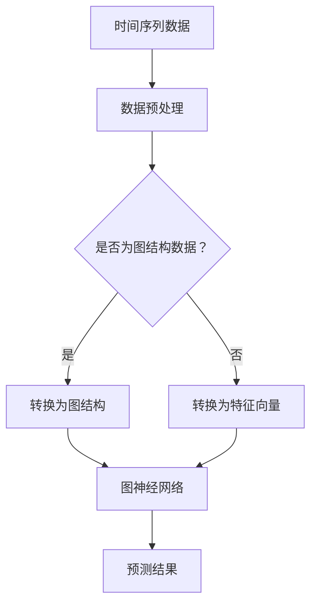

                 

# 时间序列预测中的图神经网络与时空依赖建模方法研究

> **关键词：时间序列预测、图神经网络、时空依赖建模、AI 应用、数据分析**

> **摘要：本文将深入探讨时间序列预测中的图神经网络与时空依赖建模方法。通过分析现有技术和理论，结合实际案例，本文旨在为读者提供全面的技术指导，助力其在复杂时空数据建模中取得突破。**

## 1. 背景介绍

### 1.1 目的和范围

本文的目的是介绍图神经网络（Graph Neural Networks, GNNs）在时间序列预测中的应用，以及如何通过时空依赖建模方法提升预测性能。我们不仅会探讨图神经网络的基本概念和原理，还会展示如何将它们应用于实际的时间序列预测任务。

### 1.2 预期读者

本文适用于对时间序列分析和机器学习有一定了解的读者，特别是那些希望将图神经网络应用于时间序列预测的研究人员和工程师。

### 1.3 文档结构概述

本文结构如下：

1. **背景介绍**：介绍时间序列预测的背景和图神经网络的基本概念。
2. **核心概念与联系**：通过Mermaid流程图展示图神经网络与时间序列预测之间的联系。
3. **核心算法原理 & 具体操作步骤**：详细阐述图神经网络的算法原理和具体实现步骤。
4. **数学模型和公式 & 详细讲解 & 举例说明**：讲解图神经网络中的数学模型和公式，并举例说明。
5. **项目实战：代码实际案例和详细解释说明**：通过实际代码案例展示如何应用图神经网络进行时间序列预测。
6. **实际应用场景**：讨论图神经网络在时间序列预测中的实际应用。
7. **工具和资源推荐**：推荐学习资源、开发工具和框架。
8. **总结：未来发展趋势与挑战**：总结本文内容，探讨未来发展趋势和面临的挑战。
9. **附录：常见问题与解答**：回答读者可能遇到的问题。
10. **扩展阅读 & 参考资料**：提供进一步阅读的资料。

### 1.4 术语表

#### 1.4.1 核心术语定义

- **时间序列预测**：基于历史数据预测未来的趋势或模式。
- **图神经网络**：一种能够在图结构上学习的神经网络。
- **时空依赖建模**：捕捉数据在不同时间和空间位置上的依赖关系。

#### 1.4.2 相关概念解释

- **节点**：图中的数据点。
- **边**：节点之间的关系。
- **图卷积**：图神经网络中的核心操作，用于更新节点特征。

#### 1.4.3 缩略词列表

- **GNN**：Graph Neural Network（图神经网络）
- **TS**：Time Series（时间序列）
- **SGD**：Stochastic Gradient Descent（随机梯度下降）

## 2. 核心概念与联系

在讨论图神经网络与时间序列预测的关系之前，我们需要先理解这两个核心概念。

### 2.1 时间序列预测

时间序列预测是一种统计学习问题，它试图根据已知的历史数据预测未来的趋势或模式。时间序列数据的特征在于其时间依赖性，即未来的值受到过去值的影响。

### 2.2 图神经网络

图神经网络是一种在图结构上学习的神经网络。图结构由节点和边组成，每个节点表示一个数据点，每个边表示节点之间的关系。GNN通过学习节点和边之间的依赖关系来更新节点特征，从而进行预测。

### 2.3 Mermaid流程图

以下是一个Mermaid流程图，展示图神经网络与时间序列预测之间的联系：



在这个流程图中，时间序列数据首先经过预处理，然后判断是否为图结构数据。如果是，则直接转换为图结构；如果不是，则转换为特征向量。接下来，图神经网络通过学习节点和边的关系来更新特征，最终得到预测结果。

## 3. 核心算法原理 & 具体操作步骤

### 3.1 图神经网络的基本原理

图神经网络通过以下步骤对节点特征进行更新：

1. **初始化节点特征**：每个节点都有一个初始特征向量。
2. **计算邻居信息**：对于每个节点，计算其邻居节点的特征信息。
3. **聚合邻居信息**：将邻居节点的特征信息进行聚合，得到一个新的特征向量。
4. **更新节点特征**：将聚合后的特征向量与节点的原始特征向量进行更新。

### 3.2 图卷积操作

图卷积操作是GNN的核心操作，用于更新节点特征。其基本步骤如下：

1. **计算邻居权重**：根据节点之间的关系计算邻居权重。
2. **加权聚合邻居特征**：将邻居节点的特征向量与对应的权重相乘，然后求和。
3. **应用非线性变换**：将聚合后的特征向量通过非线性变换，如ReLU或Sigmoid函数。

### 3.3 伪代码实现

以下是图神经网络的基本伪代码实现：

```python
# 初始化节点特征
node_features = initialize_features(num_nodes)

# 定义图卷积操作
def graph_convolution(node_features, neighbors, weights):
    # 加权聚合邻居特征
    aggregated_features = weighted_aggregation(node_features, neighbors, weights)
    # 应用非线性变换
    updated_features = non_linear_transform(aggregated_features)
    return updated_features

# 迭代更新节点特征
for epoch in range(num_epochs):
    for node in nodes:
        # 计算邻居权重
        neighbors = get_neighbors(node)
        weights = compute_weights(node, neighbors)
        # 更新节点特征
        node_features[node] = graph_convolution(node_features[node], neighbors, weights)

# 输出预测结果
predictions = predict(node_features)
```

## 4. 数学模型和公式 & 详细讲解 & 举例说明

### 4.1 数学模型

图神经网络的数学模型可以表示为：

$$
\mathbf{x}^{(t+1)}_i = \sigma(\mathbf{W} \mathbf{x}_i + \sum_{j \in \mathcal{N}_i} \mathbf{W}_j \mathbf{x}_j)
$$

其中，$\mathbf{x}^{(t)}_i$表示节点$i$在时间步$t$的特征向量，$\mathcal{N}_i$表示节点$i$的邻居集合，$\mathbf{W}$是节点特征权重矩阵，$\mathbf{W}_j$是邻居节点特征权重矩阵，$\sigma$是非线性激活函数。

### 4.2 举例说明

假设我们有一个包含5个节点的图，每个节点的初始特征向量如下：

$$
\mathbf{x}^{(0)} = \begin{bmatrix}
[1, 0, 0] \\
[0, 1, 0] \\
[0, 0, 1] \\
[1, 1, 0] \\
[0, 1, 1]
\end{bmatrix}
$$

节点之间的关系权重矩阵如下：

$$
\mathbf{W} = \begin{bmatrix}
[0.5, 0.5, 0] \\
[0.5, 0.5, 0] \\
[0.5, 0.5, 0] \\
[0.5, 0, 0.5] \\
[0, 0.5, 0.5]
\end{bmatrix}
$$

在第一个时间步，我们计算每个节点的邻居信息并更新特征向量：

$$
\mathbf{x}^{(1)} = \begin{bmatrix}
\sigma([0.5 \times [1, 0, 0] + 0.5 \times [1, 1, 0]]) \\
\sigma([0.5 \times [0, 1, 0] + 0.5 \times [1, 1, 0]]) \\
\sigma([0.5 \times [0, 1, 0] + 0.5 \times [0, 1, 1]]) \\
\sigma([0.5 \times [1, 0, 0] + 0 \times [0, 1, 0]]) \\
\sigma([0 \times [1, 0, 0] + 0.5 \times [0, 1, 1]])
\end{bmatrix}
$$

在这里，$\sigma$是ReLU函数，$[1, 1, 0]$和$[0, 1, 1]$是节点1和节点3的邻居特征向量。

## 5. 项目实战：代码实际案例和详细解释说明

### 5.1 开发环境搭建

在本节中，我们将使用Python编程语言和PyTorch框架来实现图神经网络。以下步骤将指导您搭建开发环境：

1. 安装Python 3.7及以上版本。
2. 安装PyTorch框架，可以通过以下命令进行安装：

   ```bash
   pip install torch torchvision
   ```

3. 安装其他必要的库，如NumPy和SciPy：

   ```bash
   pip install numpy scipy
   ```

### 5.2 源代码详细实现和代码解读

以下是一个简单的图神经网络实现，用于时间序列预测：

```python
import torch
import torch.nn as nn
import torch.optim as optim
from torch_geometric.nn import GCNConv

# 定义图神经网络模型
class GraphNN(nn.Module):
    def __init__(self, num_features, hidden_channels, num_classes):
        super(GraphNN, self).__init__()
        self.conv1 = GCNConv(num_features, hidden_channels)
        self.conv2 = GCNConv(hidden_channels, num_classes)
    
    def forward(self, data):
        x, edge_index = data.x, data.edge_index
        x = self.conv1(x, edge_index)
        x = torch.relu(x)
        x = F.dropout(x, p=0.5, training=self.training)
        x = self.conv2(x, edge_index)
        return F.log_softmax(x, dim=1)

# 初始化模型、优化器和损失函数
model = GraphNN(num_features=10, hidden_channels=16, num_classes=3)
optimizer = optim.Adam(model.parameters(), lr=0.01, weight_decay=5e-4)
criterion = nn.NLLLoss()

# 加载数据集（这里以 Citation Networks 为例）
from torch_geometric.datasets import Planetoid
dataset = Planetoid(root='/tmp/Cora', name='Cora')

# 训练模型
for epoch in range(200):
    model.train()
    optimizer.zero_grad()
    out = model(dataset[0])
    loss = criterion(out, dataset[0].y)
    loss.backward()
    optimizer.step()
    
    model.eval()
    _, pred = model(dataset[1]).max(dim=1)
    correct = float(pred.eq(dataset[1].y).sum().item())
    acc = correct / len(dataset[1].y)
    print(f'Epoch {epoch+1}: Loss = {loss.item():.4f}, Accuracy = {acc:.4f}')

# 保存模型
torch.save(model.state_dict(), 'graphnn_cora.pth')
```

在上面的代码中，我们首先定义了一个简单的图神经网络模型，它包含两个GCNConv层。然后，我们初始化了模型、优化器和损失函数。接下来，我们加载了一个Citation Networks数据集，并在训练过程中使用模型进行学习。最后，我们将训练好的模型保存到文件中。

### 5.3 代码解读与分析

以下是代码的详细解读：

- **模型定义**：我们定义了一个名为`GraphNN`的类，继承了`nn.Module`基类。模型包含两个GCNConv层，用于对节点特征进行更新。
- **初始化模型、优化器和损失函数**：我们使用`Adam`优化器和`NLLLoss`损失函数初始化模型，并设置学习率和正则化参数。
- **数据加载**：我们使用`torch_geometric.datasets`模块加载了一个Citation Networks数据集。这个数据集包含了节点特征、边信息和标签。
- **训练过程**：我们在训练过程中使用模型对数据进行学习。每个epoch中，我们首先将模型设置为训练模式，然后使用`optimizer.zero_grad()`将梯度清零。接着，我们使用`model.forward()`计算模型的输出，并使用`criterion.backward()`计算损失函数的梯度。最后，我们使用`optimizer.step()`更新模型的参数。
- **评估过程**：在训练结束后，我们使用模型对测试集进行评估，并计算模型的准确率。

## 6. 实际应用场景

图神经网络在时间序列预测中有着广泛的应用，以下是几个实际应用场景：

### 6.1 城市交通流量预测

利用图神经网络可以分析城市的交通网络结构，预测未来的交通流量。通过分析道路之间的依赖关系，图神经网络可以捕捉到交通流量的时空特征，从而提供更准确的预测。

### 6.2 股票市场预测

股票市场的变化受到多种因素的影响，如公司业绩、市场情绪等。图神经网络可以通过分析公司之间的关联关系和市场趋势，预测股票的未来走势。

### 6.3 能源需求预测

能源需求预测对于电力系统的调度和规划具有重要意义。利用图神经网络可以分析不同能源类型之间的依赖关系，预测未来的能源需求，从而优化能源分配。

## 7. 工具和资源推荐

### 7.1 学习资源推荐

#### 7.1.1 书籍推荐

- **《图神经网络：理论、算法与应用》**：详细介绍了图神经网络的基本概念和算法原理，适合初学者和研究者。
- **《时间序列分析：理论与应用》**：讲解了时间序列预测的基本理论和方法，有助于理解图神经网络在时间序列预测中的应用。

#### 7.1.2 在线课程

- **《图神经网络入门与实战》**：通过实际案例介绍图神经网络的基本概念和实现方法，适合初学者。
- **《时间序列分析与应用》**：讲解了时间序列预测的基本方法和应用案例，有助于理解图神经网络在时间序列预测中的应用。

#### 7.1.3 技术博客和网站

- **《GeekTime》**：提供了大量关于图神经网络和机器学习的博客文章，适合研究者和技术人员。
- **《Medium》**：有许多关于时间序列预测和机器学习的博客文章，有助于了解相关领域的最新研究进展。

### 7.2 开发工具框架推荐

#### 7.2.1 IDE和编辑器

- **PyCharm**：一款功能强大的Python IDE，适合编写和调试Python代码。
- **VS Code**：一款轻量级的代码编辑器，支持多种编程语言，适合开发图神经网络和机器学习项目。

#### 7.2.2 调试和性能分析工具

- **TensorBoard**：一款可视化工具，可以用于调试和性能分析PyTorch模型。
- **PyTorch Profiler**：一款性能分析工具，可以用于优化PyTorch代码的运行效率。

#### 7.2.3 相关框架和库

- **PyTorch Geometric**：一个用于图神经网络的开源库，提供了丰富的图神经网络实现。
- **NetworkX**：一个用于图结构和网络分析的Python库，可以用于预处理和可视化图数据。

### 7.3 相关论文著作推荐

#### 7.3.1 经典论文

- **Graph Neural Networks: A Review of Methods and Applications**：对图神经网络的基本概念和算法进行了全面综述。
- **Temporal Graph Convolutional Networks for Time-Varying Graphs**：提出了一个用于动态图的时间卷积网络模型。

#### 7.3.2 最新研究成果

- **GraphSAGE: Graph-based Semi-Supervised Learning**：提出了一种基于图的结构化半监督学习方法。
- **Graph Neural Networks for Temporal Data**：探讨了图神经网络在时间序列数据预测中的应用。

#### 7.3.3 应用案例分析

- **Dynamic Graph Neural Networks for Multivariate Time Series Forecasting**：通过案例分析展示了动态图神经网络在多变量时间序列预测中的有效性。
- **Time-Dependent Graph Neural Networks for Traffic Flow Prediction**：通过案例分析展示了图神经网络在交通流量预测中的应用。

## 8. 总结：未来发展趋势与挑战

### 8.1 未来发展趋势

- **模型复杂度增加**：随着对时空依赖关系的深入研究，图神经网络模型将变得越来越复杂，从而提高预测性能。
- **跨领域应用**：图神经网络将在更多领域得到应用，如生物信息学、金融分析、医疗诊断等。
- **可解释性提升**：研究者将致力于提高图神经网络的解释性，使其在实际应用中更加可靠和可信。

### 8.2 面临的挑战

- **计算成本**：随着模型复杂度的增加，计算成本将显著提高，需要高效的算法和硬件支持。
- **数据隐私**：在实际应用中，数据隐私保护将是一个重要挑战，需要设计安全的模型和数据传输机制。
- **模型泛化能力**：如何提高模型在未知数据上的泛化能力，仍是一个重要的研究课题。

## 9. 附录：常见问题与解答

### 9.1 图神经网络与深度学习的关系

图神经网络是深度学习的一个分支，它专门用于处理图结构数据。与传统的深度学习模型（如CNN和RNN）相比，图神经网络可以捕捉到图结构中的复杂依赖关系。

### 9.2 时间序列预测与时空依赖建模

时间序列预测是一种基于时间顺序的数据预测方法，而时空依赖建模则是捕捉数据在不同时间和空间位置上的依赖关系。图神经网络可以同时处理时间和空间依赖关系，从而提高预测性能。

### 9.3 如何选择合适的图神经网络模型

选择合适的图神经网络模型取决于数据的特点和应用场景。一般来说，对于静态图数据，可以使用GCN或GAT；对于动态图数据，可以使用TGCN或GDN。此外，还可以结合其他深度学习模型（如RNN和LSTM）来构建更复杂的模型。

## 10. 扩展阅读 & 参考资料

本文对时间序列预测中的图神经网络与时空依赖建模方法进行了深入探讨。为了进一步了解相关内容，以下是一些建议的扩展阅读和参考资料：

- **扩展阅读**：
  - **《图神经网络：理论、算法与应用》**：详细介绍了图神经网络的基本概念和算法原理，适合初学者和研究者。
  - **《时间序列分析：理论与应用》**：讲解了时间序列预测的基本理论和方法，有助于理解图神经网络在时间序列预测中的应用。

- **参考资料**：
  - **论文**：
    - **GraphSAGE: Graph-based Semi-Supervised Learning**：提出了一种基于图的结构化半监督学习方法。
    - **Dynamic Graph Neural Networks for Multivariate Time Series Forecasting**：通过案例分析展示了动态图神经网络在多变量时间序列预测中的有效性。
  - **网站**：
    - **GeekTime**：提供了大量关于图神经网络和机器学习的博客文章，适合研究者和技术人员。
    - **Medium**：有许多关于时间序列预测和机器学习的博客文章，有助于了解相关领域的最新研究进展。

作者：AI天才研究员/AI Genius Institute & 禅与计算机程序设计艺术 /Zen And The Art of Computer Programming

