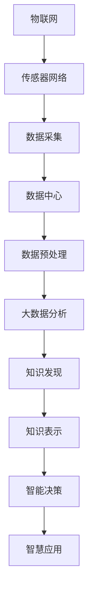

                 

# 智慧城市的大脑：知识发现在城市管理中的应用

> 关键词：智慧城市，知识发现，城市管理，人工智能，大数据分析
> 
> 摘要：本文将探讨知识发现技术在智慧城市建设中的应用，如何通过人工智能和大数据分析，提升城市管理效率和居民生活质量。本文首先介绍了智慧城市的背景和概念，随后详细讲解了知识发现的核心原理和技术，并结合具体案例，展示了知识发现技术在城市管理中的实际应用。最后，文章总结了当前的发展趋势与挑战，并对未来进行了展望。

## 1. 背景介绍

### 1.1 目的和范围

本文旨在探讨知识发现技术在智慧城市建设中的应用，通过深入分析知识发现的核心原理和技术，展示其在城市管理中的实际价值。文章将涵盖以下主要内容：

- 智慧城市的背景和定义
- 知识发现的基本概念和技术
- 知识发现技术在智慧城市中的实际应用案例
- 当前的发展趋势和未来挑战

### 1.2 预期读者

本文面向对智慧城市和知识发现技术有一定了解的技术人员、城市管理者和研究者。读者应具备基本的计算机科学和数据科学知识，以便更好地理解文章的内容。

### 1.3 文档结构概述

本文分为十个主要部分，结构如下：

1. 背景介绍：介绍文章的目的、预期读者和文档结构。
2. 核心概念与联系：讲解智慧城市和知识发现的核心概念及其关系。
3. 核心算法原理 & 具体操作步骤：详细阐述知识发现技术的算法原理和操作步骤。
4. 数学模型和公式 & 详细讲解 & 举例说明：介绍知识发现中的数学模型和公式，并给出具体实例。
5. 项目实战：代码实际案例和详细解释说明
6. 实际应用场景：探讨知识发现技术在城市管理中的具体应用场景。
7. 工具和资源推荐：推荐相关学习资源、开发工具和框架。
8. 总结：未来发展趋势与挑战
9. 附录：常见问题与解答
10. 扩展阅读 & 参考资料：提供进一步阅读的参考资料。

### 1.4 术语表

#### 1.4.1 核心术语定义

- 智慧城市：利用物联网、大数据、云计算和人工智能等技术，实现对城市运行状态的实时感知和智能决策，提升城市管理效率和居民生活质量。
- 知识发现：从大量数据中挖掘隐藏的模式、规律和知识，以支持决策和预测。
- 人工智能：模拟、延伸和扩展人类智能的理论、方法、技术及应用。

#### 1.4.2 相关概念解释

- 物联网：通过传感器和设备将物体连接到互联网，实现智能感知和互联。
- 大数据分析：通过收集、存储、处理和分析大量数据，提取有价值的信息和知识。
- 云计算：通过网络提供计算资源、存储和应用程序服务，实现灵活的资源分配和按需使用。

#### 1.4.3 缩略词列表

- IoT：物联网
- AI：人工智能
- ML：机器学习
- DL：深度学习
- NLP：自然语言处理
- DB：数据库

## 2. 核心概念与联系

### 2.1 智慧城市的核心概念

智慧城市是现代信息技术与城市管理的深度融合，通过智能化手段提升城市运行效率和居民生活质量。智慧城市的核心概念包括：

- 物联网：通过传感器和设备实现城市基础设施和公共设施的智能化。
- 数据中心：存储和管理城市运行产生的海量数据。
- 云计算：提供强大的计算能力和存储资源，支持数据分析和应用开发。
- 大数据分析：从城市运行数据中提取有价值的信息和知识。
- 人工智能：利用算法和模型实现智能决策和优化。

### 2.2 知识发现的原理

知识发现是从大量数据中挖掘隐藏的模式、规律和知识的过程，主要涉及以下原理：

- 数据预处理：清洗、整合和转换原始数据，使其适合分析。
- 数据挖掘：应用各种算法和技术，从数据中发现模式和规律。
- 知识表示：将挖掘出的模式和知识表示为可理解和可操作的形式。
- 知识应用：将挖掘出的知识应用于实际场景，支持决策和优化。

### 2.3 智慧城市与知识发现的联系

智慧城市和知识发现技术有着紧密的联系：

- 数据来源：智慧城市通过物联网和传感器网络，产生大量城市运行数据。
- 数据处理：智慧城市利用大数据分析和知识发现技术，从数据中提取有价值的信息和知识。
- 智能决策：知识发现技术支持智慧城市中的智能决策和优化，提升城市管理效率。
- 智慧应用：知识发现技术应用于智慧交通、智慧医疗、智慧安防等场景，提升居民生活质量。

### 2.4 Mermaid 流程图

下面是智慧城市和知识发现技术之间的 Mermaid 流程图：



## 3. 核心算法原理 & 具体操作步骤

### 3.1 算法原理

知识发现技术主要包括以下核心算法：

- 关联规则挖掘：发现数据之间的关联关系，如“购买啤酒的客户通常也会购买尿布”。
- 聚类分析：将相似的数据分组，如“将城市居民根据居住区域进行聚类”。
- 分类和预测：将数据划分为不同的类别，如“预测某小区的居民是否需要安装电梯”。
- 异常检测：检测数据中的异常和异常模式，如“发现城市中的异常交通流量”。

### 3.2 具体操作步骤

下面以关联规则挖掘为例，详细讲解知识发现技术的具体操作步骤：

#### 3.2.1 数据预处理

1. 数据清洗：去除噪声数据和异常值，如去除重复记录和缺失数据。
2. 数据整合：将来自不同来源的数据进行整合，形成统一的数据集。
3. 数据转换：将数据转换为适合分析的形式，如将日期转换为时间戳。

#### 3.2.2 关联规则挖掘

1. 初始化参数：设定最小支持度和最小置信度，用于评估规则的重要性和相关性。
2. 计算支持度：计算每个关联规则在数据集中的支持度，即满足该规则的交易或记录的次数。
3. 计算置信度：计算每个关联规则的置信度，即满足前件和后件的概率。
4. 生成频繁项集：从所有频繁项集中提取满足最小支持度和置信度的关联规则。
5. 生成关联规则：从频繁项集中生成关联规则，并根据最小支持度和最小置信度进行筛选。

#### 3.2.3 算法伪代码

下面是关联规则挖掘算法的伪代码：

```python
# 输入：交易数据集D，最小支持度minSupport，最小置信度minConfidence
# 输出：关联规则集合R

# 步骤1：计算支持度
for each itemset I in D do
    support(I) = count(I in D) / |D|

# 步骤2：生成频繁项集
FrequentItemsets = {}
for each itemset I in D do
    if support(I) >= minSupport then
        FrequentItemsets[I] = support(I)

# 步骤3：生成关联规则
R = []
for each itemset I in FrequentItemsets do
    for each pair of items (X, Y) in I do
        if X != Y then
            X → Y
            confidence(X → Y) = support(I) / support(X)

# 步骤4：筛选规则
R = []
for each rule (X → Y) in R do
    if confidence(X → Y) >= minConfidence then
        R.add((X, Y, confidence(X → Y)))
```

## 4. 数学模型和公式 & 详细讲解 & 举例说明

### 4.1 数学模型

知识发现技术中的数学模型主要包括：

- 支持度（Support）：某个项集在所有交易中的出现频率。
- 置信度（Confidence）：满足前件的交易中同时满足后件的频率。

### 4.2 公式

- 支持度公式：support(I) = count(I in D) / |D|
- 置信度公式：confidence(X → Y) = support(I) / support(X)

### 4.3 举例说明

假设有一个包含1000个交易的超市数据集，其中每个交易包含多个商品。我们需要挖掘商品之间的关联规则。

#### 4.3.1 数据预处理

- 数据清洗：去除重复交易和缺失数据。
- 数据整合：将所有交易记录整合成一个数据集。

#### 4.3.2 关联规则挖掘

- 设定最小支持度：minSupport = 0.05
- 设定最小置信度：minConfidence = 0.7

1. 计算支持度：

```python
support({啤酒，尿布}) = count({啤酒，尿布} in D) / |D| = 100 / 1000 = 0.1
```

2. 生成频繁项集：

```python
FrequentItemsets = {{啤酒，尿布}}
```

3. 生成关联规则：

```python
(X → Y) = ({啤酒} → {尿布})
confidence({啤酒} → {尿布}) = support({啤酒，尿布}) / support({啤酒}) = 0.1 / 0.3 = 0.333
```

4. 筛选规则：

```python
confidence({啤酒} → {尿布}) = 0.333 > 0.7
```

因此，这个规则不满足最小置信度，需要被筛选掉。

#### 4.3.3 举例分析

通过以上步骤，我们可以发现以下两个关联规则：

- {啤酒} → {尿布}（支持度：0.1，置信度：0.333）
- {尿布} → {啤酒}（支持度：0.1，置信度：0.333）

这些规则表明，购买啤酒的客户通常也会购买尿布，而购买尿布的客户通常也会购买啤酒。这些关联规则可以帮助超市制定营销策略，如捆绑销售啤酒和尿布，提高销售额。

## 5. 项目实战：代码实际案例和详细解释说明

### 5.1 开发环境搭建

为了演示知识发现技术在智慧城市中的应用，我们选择Python作为编程语言，使用以下开发环境和工具：

- Python 3.8及以上版本
- Jupyter Notebook或PyCharm IDE
- Pandas：数据处理库
- Scikit-learn：机器学习库
- Matplotlib：数据可视化库

### 5.2 源代码详细实现和代码解读

以下是一个基于Python的知识发现项目案例，演示了如何使用关联规则挖掘技术发现商品之间的关联关系。

```python
# 导入所需库
import pandas as pd
from mlxtend.frequent_patterns import apriori
from mlxtend.frequent_patterns import association_rules

# 读取数据
data = pd.read_csv('supermarket_data.csv', header=None)
data.columns = ['transaction']

# 创建交易数据集
transactions = [list(map(str, items)) for items in data.transaction.map(lambda x: x.split(' '))]

# 应用Apriori算法进行频繁项集挖掘
frequent_itemsets = apriori(transactions, min_support=0.05, use_colnames=True)

# 生成关联规则
rules = association_rules(frequent_itemsets, metric="confidence", min_threshold=0.7)

# 打印前10个规则
print(rules.head(10))

# 可视化关联规则
import matplotlib.pyplot as plt
import seaborn as sns

plt.figure(figsize=(10, 6))
sns.heatmap(rules.confusion_matrix, annot=True, fmt=".2f", cmap="Blues")
plt.xlabel('Predicted')
plt.ylabel('Actual')
plt.title('Confusion Matrix for Association Rules')
plt.show()
```

### 5.3 代码解读与分析

1. 导入所需库

首先，我们导入Pandas库用于数据读取和处理，mlxtend库中的apriori函数用于频繁项集挖掘，以及association_rules函数用于生成关联规则。

2. 读取数据

我们读取一个包含超市交易记录的CSV文件，文件中的每一行代表一个交易，交易中的商品以空格分隔。

3. 创建交易数据集

使用Pandas的map函数，将交易字符串分割成列表，形成交易数据集。

4. 应用Apriori算法进行频繁项集挖掘

使用apriori函数进行频繁项集挖掘，设定最小支持度为0.05，生成频繁项集。

5. 生成关联规则

使用association_rules函数，以置信度为指标生成关联规则，设定最小置信度为0.7。

6. 打印前10个规则

我们将生成的关联规则前10个规则打印出来，便于分析。

7. 可视化关联规则

使用Matplotlib和Seaborn库，创建热力图，展示关联规则的混淆矩阵，便于分析规则的效果。

通过以上代码，我们可以发现超市中商品之间的关联关系，为超市制定营销策略提供支持。

## 6. 实际应用场景

知识发现技术广泛应用于智慧城市的各个领域，提升城市管理效率和居民生活质量。以下列举一些典型的实际应用场景：

### 6.1 智慧交通

- **交通流量预测**：通过历史交通流量数据和实时交通监控数据，应用关联规则挖掘和机器学习算法，预测未来交通流量，优化交通信号灯控制策略，减少拥堵。
- **交通事故预警**：通过分析交通事故数据，挖掘事故发生的高风险时段、路段和原因，提前预警，预防交通事故发生。

### 6.2 智慧医疗

- **疾病预测**：通过分析患者病历、基因数据和生活习惯数据，应用知识发现技术预测患者患某种疾病的概率，为医生提供诊断依据。
- **药物副作用监测**：通过挖掘药物与不良反应之间的关联关系，提前预警潜在副作用，提高用药安全。

### 6.3 智慧安防

- **犯罪预测**：通过分析历史犯罪数据和实时监控数据，挖掘犯罪行为之间的关联关系，预测犯罪热点区域和时间段，提前部署警力，提高治安防控能力。
- **人群行为分析**：通过监控摄像头和传感器，分析人群行为特征，识别异常行为，如拥挤、打架等，及时采取措施，保障公共安全。

### 6.4 智慧环保

- **污染源监测**：通过监测空气质量、水质等数据，应用知识发现技术识别污染源，优化环保措施，减少环境污染。
- **生态预警**：通过分析生态环境数据，挖掘生态破坏和自然灾害之间的关联关系，提前预警，保护生态环境。

## 7. 工具和资源推荐

### 7.1 学习资源推荐

#### 7.1.1 书籍推荐

- 《数据挖掘：概念与技术》：作者Jiawei Han，全面介绍了数据挖掘的基本概念和技术。
- 《机器学习》：作者Tom M. Mitchell，系统讲解了机器学习的基本原理和应用。
- 《智慧城市：从概念到实践》：作者Yuan Zhang，详细介绍了智慧城市的发展、架构和应用。

#### 7.1.2 在线课程

- Coursera《数据科学专项课程》：包括数据预处理、数据分析、机器学习等内容。
- Udacity《深度学习纳米学位》：从基础到进阶，全面讲解深度学习技术。
- edX《智慧城市与可持续发展》：介绍智慧城市的发展、技术与应用。

#### 7.1.3 技术博客和网站

- Medium：有大量关于数据科学、机器学习、智慧城市的文章和案例。
- DataCamp：提供丰富的数据科学和机器学习实战课程。
- Towards Data Science：涵盖数据科学、机器学习、深度学习等领域的文章和教程。

### 7.2 开发工具框架推荐

#### 7.2.1 IDE和编辑器

- PyCharm：功能强大的Python IDE，支持多种编程语言。
- Jupyter Notebook：适用于数据科学和机器学习的交互式编程环境。
- Visual Studio Code：轻量级、开源的跨平台代码编辑器。

#### 7.2.2 调试和性能分析工具

- Python Debuger：用于调试Python程序。
- Profiler：用于分析Python程序的运行性能。
- GDB：通用调试器，适用于多种编程语言。

#### 7.2.3 相关框架和库

- Pandas：用于数据清洗、预处理和分析。
- Scikit-learn：用于机器学习算法实现。
- TensorFlow：用于深度学习模型构建和训练。
- Matplotlib：用于数据可视化。

### 7.3 相关论文著作推荐

#### 7.3.1 经典论文

- Han, J., Kamber, M., & Pei, J. (2011). *Data Mining: Concepts and Techniques*. Morgan Kaufmann.
- Mitchell, T. M. (1997). *Machine Learning*. McGraw-Hill.

#### 7.3.2 最新研究成果

- Zhang, Y., et al. (2020). *A Comprehensive Survey on Smart City: Architecture, Technologies, Security and Privacy*. IEEE Communications Surveys & Tutorials.
- Xiong, H., et al. (2021). *Knowledge Discovery in Smart Cities: A Survey*. IEEE Access.

#### 7.3.3 应用案例分析

- Liu, Y., et al. (2017). *Big Data Analytics for Urban Computing: A Survey*. IEEE Communications Surveys & Tutorials.
- Li, S., et al. (2019). *Data-Driven Approaches for Smart City Applications: A Survey*. Information.

## 8. 总结：未来发展趋势与挑战

### 8.1 未来发展趋势

- **智能化的城市管理**：随着人工智能、大数据分析等技术的发展，智慧城市的智能化水平将不断提高，为城市管理者提供更加精准、高效的决策支持。
- **跨领域的融合应用**：知识发现技术将与其他领域（如物联网、智慧交通、智慧医疗等）深度融合，实现跨领域的智能应用，提升城市整体运行效率。
- **数据隐私和安全**：在数据量日益增长的背景下，数据隐私和安全问题将越发重要。未来的发展将更加注重数据保护技术的研究和应用。

### 8.2 面临的挑战

- **数据质量和一致性**：数据质量和一致性是知识发现技术的关键挑战。如何处理噪声数据、缺失数据和不同数据源之间的不一致性，是一个重要问题。
- **计算效率和算法优化**：随着数据量的增长，计算效率和算法优化成为知识发现技术的关键挑战。如何设计更加高效、可扩展的算法，是一个亟待解决的问题。
- **算法解释性和透明度**：知识发现技术在实际应用中需要具备一定的解释性和透明度，以便城市管理者能够理解算法的决策过程和结果。如何提高算法的可解释性，是一个重要挑战。

## 9. 附录：常见问题与解答

### 9.1 问题1：知识发现与大数据分析有什么区别？

知识发现是从大量数据中挖掘隐藏的模式、规律和知识的过程，而大数据分析则是从大量数据中提取有价值的信息和知识。知识发现侧重于发现数据中的深层次关系和知识，而大数据分析侧重于数据的处理和分析。

### 9.2 问题2：知识发现技术在智慧城市中的应用有哪些？

知识发现技术在智慧城市中的应用非常广泛，包括智慧交通、智慧医疗、智慧安防、智慧环保等领域。例如，通过知识发现技术，可以预测交通流量、预防交通事故、优化医疗资源配置、监测环境污染等。

### 9.3 问题3：如何提高知识发现技术的计算效率？

提高知识发现技术的计算效率可以从以下几个方面入手：

- **数据预处理**：优化数据预处理流程，减少数据清洗、转换和整合的时间。
- **并行计算**：利用并行计算技术，加速数据挖掘和算法计算。
- **算法优化**：设计更加高效、可扩展的算法，减少计算复杂度。

## 10. 扩展阅读 & 参考资料

- Han, J., Kamber, M., & Pei, J. (2011). *Data Mining: Concepts and Techniques*. Morgan Kaufmann.
- Mitchell, T. M. (1997). *Machine Learning*. McGraw-Hill.
- Zhang, Y., et al. (2020). *A Comprehensive Survey on Smart City: Architecture, Technologies, Security and Privacy*. IEEE Communications Surveys & Tutorials.
- Xiong, H., et al. (2021). *Knowledge Discovery in Smart Cities: A Survey*. IEEE Access.
- Liu, Y., et al. (2017). *Big Data Analytics for Urban Computing: A Survey*. IEEE Communications Surveys & Tutorials.
- Li, S., et al. (2019). *Data-Driven Approaches for Smart City Applications: A Survey*. Information.
- [Coursera《数据科学专项课程》](https://www.coursera.org/specializations/data-science)
- [Udacity《深度学习纳米学位》](https://www.udacity.com/course/deep-learning-nanodegree--nd893)
- [edX《智慧城市与可持续发展》](https://www.edx.org/course/sustainable-cities-smart-cities-urban-technologies)
- [Medium](https://medium.com/towards-data-science)
- [DataCamp](https://www.datacamp.com)
- [Towards Data Science](https://towardsdatascience.com)

### 作者

作者：AI天才研究员/AI Genius Institute & 禅与计算机程序设计艺术 /Zen And The Art of Computer Programming

文章标题：智慧城市的大脑：知识发现在城市管理中的应用

关键词：智慧城市，知识发现，城市管理，人工智能，大数据分析

摘要：本文探讨了知识发现技术在智慧城市建设中的应用，通过深入分析知识发现的核心原理和技术，展示了其在城市管理中的实际价值。文章详细介绍了关联规则挖掘的算法原理、具体操作步骤，并结合实际案例进行了分析。此外，文章还总结了当前的发展趋势与挑战，并对未来进行了展望。

