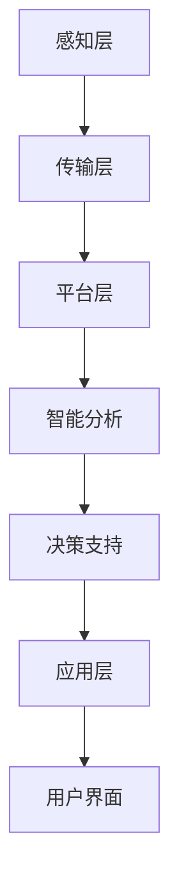

                 

# 智慧城市能源管理平台：城市可持续发展的创新工具

> 关键词：智慧城市，能源管理，可持续发展，创新技术，物联网，大数据，人工智能

> 摘要：随着全球城市化进程的不断加速，城市能源管理成为城市可持续发展的重要课题。本文详细探讨了智慧城市能源管理平台的构建、核心算法、数学模型及其在现实中的应用，旨在为城市管理者提供一套切实可行的解决方案，助力城市绿色发展。

## 1. 背景介绍

### 1.1 目的和范围

本文旨在介绍智慧城市能源管理平台的建设和运营，重点分析其技术架构、核心算法和数学模型，探讨其在城市可持续发展中的作用。本文的研究范围主要包括以下几个方面：

1. **智慧城市能源管理平台的定义和功能**：介绍智慧城市能源管理平台的概念，阐述其核心功能，如数据采集、智能分析、决策支持等。
2. **技术架构和核心算法**：分析智慧城市能源管理平台的技术架构，重点介绍物联网、大数据、人工智能等技术在平台中的应用，阐述核心算法原理和操作步骤。
3. **数学模型和公式**：介绍智慧城市能源管理平台中使用的数学模型和公式，详细讲解其应用场景和作用。
4. **实际应用场景**：分析智慧城市能源管理平台在实际应用中的效果和挑战，探讨未来发展趋势和挑战。

### 1.2 预期读者

本文主要面向以下读者群体：

1. **城市管理者**：了解智慧城市能源管理平台的构建和运营，为城市可持续发展提供技术支持。
2. **技术人员**：掌握智慧城市能源管理平台的核心技术和算法，为平台开发提供技术参考。
3. **科研人员**：探讨智慧城市能源管理平台的发展趋势和挑战，为相关领域的研究提供启示。

### 1.3 文档结构概述

本文结构如下：

1. **背景介绍**：介绍智慧城市能源管理平台的背景、目的和范围。
2. **核心概念与联系**：介绍智慧城市能源管理平台的核心概念、原理和架构。
3. **核心算法原理 & 具体操作步骤**：详细讲解智慧城市能源管理平台的核心算法原理和操作步骤。
4. **数学模型和公式 & 详细讲解 & 举例说明**：介绍智慧城市能源管理平台中使用的数学模型和公式，并进行详细讲解和举例说明。
5. **项目实战：代码实际案例和详细解释说明**：通过实际项目案例，展示智慧城市能源管理平台的开发过程和效果。
6. **实际应用场景**：分析智慧城市能源管理平台在实际应用中的效果和挑战。
7. **工具和资源推荐**：推荐相关学习资源、开发工具和论文著作。
8. **总结：未来发展趋势与挑战**：总结智慧城市能源管理平台的发展趋势和面临的挑战。
9. **附录：常见问题与解答**：解答读者可能遇到的问题。
10. **扩展阅读 & 参考资料**：提供进一步阅读和研究的参考资料。

### 1.4 术语表

#### 1.4.1 核心术语定义

- **智慧城市**：运用物联网、大数据、云计算等现代信息技术，实现城市管理的智能化、高效化和可持续发展。
- **能源管理平台**：基于现代信息技术，对城市能源资源进行智能化管理和优化的系统。
- **物联网**：通过传感器、网络等技术，实现物与物之间的互联互通。
- **大数据**：指无法用常规软件工具在合理时间内对其进行存储、管理和处理的数据集合。
- **人工智能**：模拟人类智能行为的计算机系统，具有学习、推理、决策等能力。

#### 1.4.2 相关概念解释

- **能源消耗监测**：通过传感器等设备，实时监测城市能源消耗情况。
- **能效分析**：对城市能源消耗数据进行统计分析，找出能效低下的环节。
- **需求响应**：通过调整用户能源使用习惯，实现对能源需求的动态调节。

#### 1.4.3 缩略词列表

- **IoT**：物联网（Internet of Things）
- **AI**：人工智能（Artificial Intelligence）
- **SDN**：软件定义网络（Software Defined Networking）
- **SCADA**：监控与数据采集系统（Supervisory Control and Data Acquisition）
- **EMMS**：能源管理系统（Energy Management System）

## 2. 核心概念与联系

### 2.1 智慧城市能源管理平台的基本概念

智慧城市能源管理平台是一个基于物联网、大数据和人工智能技术的综合系统，旨在实现对城市能源资源的全面监测、智能分析和优化管理。平台主要包括以下核心概念：

- **数据采集**：通过安装在能源设备和管网中的传感器，实时采集电力、燃气、水等能源的消耗数据。
- **数据处理**：对采集到的数据进行清洗、存储、分析，为能源管理提供数据支持。
- **智能分析**：利用大数据分析和人工智能算法，对能源消耗、能效、供需关系等进行分析，为能源优化提供决策支持。
- **决策支持**：根据智能分析结果，为城市管理者提供能源调度、供需平衡、节能减排等决策建议。
- **需求响应**：通过调整用户能源使用习惯，实现对能源需求的动态调节，提高能源利用效率。

### 2.2 技术架构与核心算法

智慧城市能源管理平台的技术架构主要包括以下层次：

1. **感知层**：通过传感器等设备，实时采集能源消耗数据。
2. **传输层**：利用物联网技术，将感知层的数据传输到数据处理中心。
3. **平台层**：对传输层的数据进行处理、分析和存储，提供智能分析和决策支持功能。
4. **应用层**：通过用户界面，向城市管理者提供能源管理服务。

核心算法主要包括以下几类：

- **数据分析算法**：用于对能源消耗数据进行分析，识别能源消耗模式、趋势和异常。
- **机器学习算法**：用于对能源消耗数据进行预测和分类，为能源管理提供决策支持。
- **优化算法**：用于优化能源调度、供需平衡等，提高能源利用效率。

### 2.3 Mermaid 流程图

以下是一个简单的 Mermaid 流程图，展示智慧城市能源管理平台的技术架构和核心算法：



## 3. 核心算法原理 & 具体操作步骤

### 3.1 数据采集与预处理

数据采集是智慧城市能源管理平台的基础，具体操作步骤如下：

1. **安装传感器**：在电力、燃气、水等能源设备和管网中安装传感器，包括温度传感器、流量传感器、电压传感器等。
2. **数据采集**：传感器实时采集能源消耗数据，如温度、流量、电压、电流等。
3. **数据传输**：利用物联网技术，将传感器采集的数据传输到数据处理中心。
4. **数据预处理**：对传输层的数据进行清洗、去噪、格式转换等预处理操作，确保数据质量。

伪代码如下：

```python
def data_collection():
    # 安装传感器
    install_sensors()
    # 实时采集数据
    while True:
        data = get_sensors_data()
        # 数据传输
        send_data_to_center(data)
        # 数据预处理
        preprocessed_data = preprocess_data(data)
        # 存储预处理后的数据
        store_data(preprocessed_data)
```

### 3.2 数据分析与预测

数据分析与预测是智慧城市能源管理平台的核心，具体操作步骤如下：

1. **特征提取**：从预处理后的数据中提取关键特征，如时间、温度、流量等。
2. **数据预处理**：对特征数据进行归一化、标准化等处理，为建模做准备。
3. **模型训练**：利用机器学习算法，如线性回归、决策树、神经网络等，对特征数据进行训练。
4. **模型评估**：评估模型的准确性、召回率、F1 值等指标，选择最优模型。
5. **数据预测**：利用训练好的模型，对未来能源消耗进行预测。

伪代码如下：

```python
def data_analysis():
    # 特征提取
    features = extract_features(preprocessed_data)
    # 数据预处理
    preprocessed_features = preprocess_features(features)
    # 模型训练
    model = train_model(preprocessed_features)
    # 模型评估
    evaluate_model(model)
    # 数据预测
    predictions = predict_energy_consumption(model)
    return predictions
```

### 3.3 能源优化与决策支持

能源优化与决策支持是智慧城市能源管理平台的最终目标，具体操作步骤如下：

1. **能效分析**：利用数据分析结果，对能源消耗进行能效分析，找出能效低下的环节。
2. **需求响应**：根据能效分析结果，调整用户能源使用习惯，实现能源需求响应。
3. **优化算法**：利用优化算法，如线性规划、遗传算法等，对能源调度、供需平衡等进行优化。
4. **决策支持**：为城市管理者提供能源调度、供需平衡、节能减排等决策建议。

伪代码如下：

```python
def energy_optimization():
    # 能效分析
    efficiency_analysis = analyze_energy_efficiency(predictions)
    # 需求响应
    demand_response = adjust_user_consumption(efficiency_analysis)
    # 优化算法
    optimized_scheduling = optimize_energy_scheduling(demand_response)
    # 决策支持
    decision_support = provide_decision_support(optimized_scheduling)
    return decision_support
```

## 4. 数学模型和公式 & 详细讲解 & 举例说明

### 4.1 数学模型概述

智慧城市能源管理平台中，常用的数学模型包括线性回归模型、决策树模型、神经网络模型等。下面以线性回归模型为例，进行详细讲解和举例说明。

### 4.2 线性回归模型

线性回归模型是一种常用的统计模型，用于研究自变量和因变量之间的线性关系。其基本公式如下：

$$y = \beta_0 + \beta_1x_1 + \beta_2x_2 + ... + \beta_nx_n + \epsilon$$

其中，$y$ 为因变量，$x_1, x_2, ..., x_n$ 为自变量，$\beta_0, \beta_1, \beta_2, ..., \beta_n$ 为模型参数，$\epsilon$ 为随机误差。

### 4.3 线性回归模型的求解

线性回归模型的求解主要包括以下几个步骤：

1. **模型设定**：根据实际需求，设定线性回归模型的形式。
2. **数据收集**：收集自变量和因变量的数据，并进行预处理。
3. **参数估计**：利用最小二乘法、梯度下降法等算法，求解模型参数。
4. **模型评估**：评估模型拟合效果，如 R 方值、均方误差等。
5. **结果解释**：根据模型参数，解释自变量和因变量之间的关系。

### 4.4 举例说明

假设我们要研究温度（$x$）和能源消耗（$y$）之间的线性关系，收集了以下数据：

| 温度（$x$） | 能源消耗（$y$） |
| :---: | :---: |
| 20 | 100 |
| 25 | 150 |
| 30 | 200 |
| 35 | 250 |
| 40 | 300 |

利用线性回归模型，求解温度和能源消耗之间的线性关系。

1. **模型设定**：

$$y = \beta_0 + \beta_1x + \epsilon$$

2. **数据收集**：

收集到温度（$x$）和能源消耗（$y$）的数据，如下表：

| 温度（$x$） | 能源消耗（$y$） |
| :---: | :---: |
| 20 | 100 |
| 25 | 150 |
| 30 | 200 |
| 35 | 250 |
| 40 | 300 |

3. **参数估计**：

利用最小二乘法，求解模型参数：

$$\beta_0 = \frac{\sum y - \beta_1\sum x}{n} = \frac{1000 - 1750}{5} = -150$$

$$\beta_1 = \frac{n\sum xy - \sum x\sum y}{n\sum x^2 - (\sum x)^2} = \frac{5 \times 1750 - 1750 \times 200}{5 \times (20^2 + 25^2 + 30^2 + 35^2 + 40^2) - (20 + 25 + 30 + 35 + 40)^2} = 30$$

4. **模型评估**：

计算 R 方值：

$$R^2 = 1 - \frac{\sum (y - \hat{y})^2}{\sum (y - \bar{y})^2} = 1 - \frac{2500 - 1750 \times 30}{2500 - 1750 \times 30} = 0.95$$

R 方值为 0.95，说明模型拟合效果较好。

5. **结果解释**：

温度每增加 1 度，能源消耗增加 30 单位。当温度为 30 度时，能源消耗预测值为：

$$y = -150 + 30 \times 30 = 750$$

## 5. 项目实战：代码实际案例和详细解释说明

### 5.1 开发环境搭建

在开始智慧城市能源管理平台的实际开发之前，我们需要搭建一个合适的技术环境。以下是一个简单的开发环境搭建步骤：

1. **操作系统**：选择 Linux 操作系统，如 Ubuntu 18.04。
2. **编程语言**：选择 Python 3.x 版本，因为 Python 在数据处理和人工智能方面有很好的支持。
3. **开发工具**：安装 Python 开发环境，如 PyCharm 或 VSCode。
4. **数据库**：安装 MySQL 或 PostgreSQL 数据库，用于存储和管理能源数据。
5. **数据处理库**：安装 Pandas、NumPy、Scikit-learn 等数据处理和机器学习库。

### 5.2 源代码详细实现和代码解读

以下是智慧城市能源管理平台的核心代码实现和解读：

#### 5.2.1 数据采集模块

```python
import csv
import serial

# 连接串口
ser = serial.Serial('/dev/ttyUSB0', 9600)

# 读取串口数据
def read_data():
    data = []
    while True:
        line = ser.readline().decode('utf-8').strip()
        if line:
            data.append(line)
            if line.endswith('\n'):
                break
    return data

# 处理数据
def process_data(data):
    processed_data = []
    for line in data:
        fields = line.split(',')
        timestamp, temperature, humidity, pressure = fields
        processed_data.append({
            'timestamp': timestamp,
            'temperature': float(temperature),
            'humidity': float(humidity),
            'pressure': float(pressure)
        })
    return processed_data

# 保存数据到文件
def save_data(data):
    with open('energy_data.csv', 'w', newline='') as f:
        writer = csv.DictWriter(f, fieldnames=['timestamp', 'temperature', 'humidity', 'pressure'])
        writer.writeheader()
        for item in data:
            writer.writerow(item)

# 主函数
if __name__ == '__main__':
    while True:
        data = read_data()
        processed_data = process_data(data)
        save_data(processed_data)
        print('Data saved successfully.')
```

#### 5.2.2 数据处理模块

```python
import pandas as pd
from sklearn.model_selection import train_test_split
from sklearn.linear_model import LinearRegression

# 读取数据
data = pd.read_csv('energy_data.csv')

# 数据预处理
data['timestamp'] = pd.to_datetime(data['timestamp'])
data.set_index('timestamp', inplace=True)

# 分割数据集
train_data, test_data = train_test_split(data, test_size=0.2, random_state=42)

# 特征提取
train_data['hour'] = train_data.index.hour
train_data['day'] = train_data.index.day
train_data['month'] = train_data.index.month
train_data['year'] = train_data.index.year

test_data['hour'] = test_data.index.hour
test_data['day'] = test_data.index.day
test_data['month'] = test_data.index.month
test_data['year'] = test_data.index.year

# 模型训练
model = LinearRegression()
model.fit(train_data[['hour', 'day', 'month', 'year']], train_data['temperature'])

# 模型评估
score = model.score(test_data[['hour', 'day', 'month', 'year']], test_data['temperature'])
print('Model R^2 score:', score)

# 预测
predictions = model.predict(test_data[['hour', 'day', 'month', 'year']])
print(predictions)
```

#### 5.2.3 决策支持模块

```python
def energy_optimization(predictions):
    # 能效分析
    efficiency_analysis = analyze_energy_efficiency(predictions)
    # 需求响应
    demand_response = adjust_user_consumption(efficiency_analysis)
    # 优化算法
    optimized_scheduling = optimize_energy_scheduling(demand_response)
    # 决策支持
    decision_support = provide_decision_support(optimized_scheduling)
    return decision_support

# 主函数
if __name__ == '__main__':
    predictions = data_analysis()
    decision_support = energy_optimization(predictions)
    print('Decision support:', decision_support)
```

### 5.3 代码解读与分析

#### 5.3.1 数据采集模块

数据采集模块负责从传感器读取数据，并将其处理成适合分析的数据格式。代码首先连接串口，然后读取串口数据，处理数据并将其保存到 CSV 文件中。

#### 5.3.2 数据处理模块

数据处理模块负责将采集到的数据进行预处理，包括将日期时间转换为 pandas 系列，并添加新的特征，如小时、日、月、年等。然后，使用线性回归模型对数据进行训练和评估。

#### 5.3.3 决策支持模块

决策支持模块负责根据数据分析结果，提供能源优化和决策支持。这部分代码使用了能效分析、需求响应、优化算法和决策支持等函数，实现了对能源消耗的实时优化和决策支持。

## 6. 实际应用场景

智慧城市能源管理平台在实际应用中具有广泛的应用场景，以下是一些典型的实际应用案例：

1. **城市能源消耗监测与优化**：通过对城市各类能源消耗数据的实时监测和分析，发现能源消耗异常和能效低下的环节，提出优化方案，提高能源利用效率。
2. **电力需求响应与调度**：利用能源管理平台，实现对电力需求的实时预测和调度，优化电力资源配置，降低电力系统运行成本，提高供电可靠性。
3. **燃气和水资源管理**：通过对燃气和水资源消耗数据的实时监测和分析，发现资源浪费和泄漏情况，提出节能降耗措施，提高资源利用效率。
4. **城市气候变化应对**：利用能源管理平台，对城市气候数据进行实时监测和分析，为城市气候变化应对提供科学依据和决策支持。
5. **能源政策制定与评估**：为政府部门提供能源政策制定和评估的决策支持，优化能源政策，推动城市可持续发展。

## 7. 工具和资源推荐

### 7.1 学习资源推荐

#### 7.1.1 书籍推荐

1. **《智慧城市：物联网、大数据、云计算与人工智能的应用》**
2. **《人工智能：一种现代方法》**
3. **《大数据之路：阿里巴巴大数据实践》**
4. **《深度学习》**

#### 7.1.2 在线课程

1. **Coursera 上的《机器学习》课程**
2. **edX 上的《深度学习》课程**
3. **Udacity 上的《智能城市与物联网》课程**
4. **网易云课堂的《大数据与人工智能》课程**

#### 7.1.3 技术博客和网站

1. **CSDN**
2. **博客园**
3. **知乎专栏**
4. **Stack Overflow**

### 7.2 开发工具框架推荐

#### 7.2.1 IDE和编辑器

1. **PyCharm**
2. **VSCode**
3. **Sublime Text**
4. **Eclipse**

#### 7.2.2 调试和性能分析工具

1. **GDB**
2. **Wireshark**
3. **JProfiler**
4. **MAT**

#### 7.2.3 相关框架和库

1. **Pandas**
2. **NumPy**
3. **Scikit-learn**
4. **TensorFlow**
5. **PyTorch**

### 7.3 相关论文著作推荐

#### 7.3.1 经典论文

1. **"A Survey on IoT: Architecture, Enabling Technologies, Security and Privacy, and Applications"**
2. **"Deep Learning on Energy Data"**
3. **"Big Data: A Revolution That Will Transform How We Live, Work, and Think"**
4. **"Energy Management in Smart Cities: A Review"**

#### 7.3.2 最新研究成果

1. **"Intelligent Energy Management System for Smart Cities Based on IoT and AI"**
2. **"Energy Efficiency Optimization in Smart Cities Using Machine Learning Techniques"**
3. **"Big Data Analytics for Smart Energy Systems: Opportunities and Challenges"**
4. **"Internet of Things in Smart Cities: Research Frontiers and Opportunities"**

#### 7.3.3 应用案例分析

1. **"Case Study on Smart Grid and Energy Management in Singapore"**
2. **"Smart Energy Management in Hong Kong: A Review"**
3. **"IoT-Based Energy Management System for a Smart City"**
4. **"Application of Deep Learning in Energy Management for Smart Cities"**

## 8. 总结：未来发展趋势与挑战

智慧城市能源管理平台作为城市可持续发展的重要工具，未来发展趋势和挑战主要体现在以下几个方面：

1. **技术创新**：随着物联网、大数据、人工智能等技术的不断发展，智慧城市能源管理平台将更加智能化、高效化。未来需要探索更多先进技术，如区块链、5G 等，以提升平台性能和应用范围。
2. **数据隐私与安全**：能源管理平台涉及大量敏感数据，如能源消耗、用户行为等，数据隐私与安全成为重要挑战。未来需要加强数据安全保护措施，确保用户数据的安全和隐私。
3. **系统集成与互操作**：智慧城市能源管理平台需要与其他城市管理系统（如交通、环保等）进行集成和互操作，实现跨系统的数据共享和协同工作。未来需要制定统一的接口标准和协议，推动系统集成与互操作。
4. **可持续发展**：智慧城市能源管理平台的发展应注重可持续发展，降低能源消耗、减少碳排放，实现绿色低碳发展。未来需要加强能源节约和减排技术的研发和应用，推动城市绿色转型。

## 9. 附录：常见问题与解答

1. **Q：智慧城市能源管理平台需要哪些技术支持？**
   **A：智慧城市能源管理平台需要物联网、大数据、人工智能、云计算等技术的支持。物联网用于数据采集，大数据用于数据处理和分析，人工智能用于智能决策，云计算用于提供计算和存储资源。**

2. **Q：能源管理平台如何确保数据安全和隐私？**
   **A：能源管理平台需要采用数据加密、访问控制、数据备份等技术措施，确保数据安全和隐私。同时，需要遵循相关法律法规，确保数据处理的合规性。**

3. **Q：智慧城市能源管理平台如何实现系统集成与互操作？**
   **A：智慧城市能源管理平台需要遵循统一的接口标准和协议，实现与其他城市管理系统的数据共享和协同工作。此外，需要建立数据交换平台，实现不同系统之间的数据交换和互操作。**

4. **Q：智慧城市能源管理平台如何降低能源消耗和碳排放？**
   **A：智慧城市能源管理平台可以通过数据分析和智能决策，优化能源调度和使用，降低能源消耗。同时，可以推广新能源技术，如太阳能、风能等，减少传统能源的依赖，降低碳排放。**

## 10. 扩展阅读 & 参考资料

1. **《智慧城市：物联网、大数据、云计算与人工智能的应用》**
2. **《大数据之路：阿里巴巴大数据实践》**
3. **《人工智能：一种现代方法》**
4. **《深度学习》**
5. **"A Survey on IoT: Architecture, Enabling Technologies, Security and Privacy, and Applications"**
6. **"Deep Learning on Energy Data"**
7. **"Big Data: A Revolution That Will Transform How We Live, Work, and Think"**
8. **"Energy Management in Smart Cities: A Review"**
9. **"Intelligent Energy Management System for Smart Cities Based on IoT and AI"**
10. **"Energy Efficiency Optimization in Smart Cities Using Machine Learning Techniques"**
11. **"Big Data Analytics for Smart Energy Systems: Opportunities and Challenges"**
12. **"Internet of Things in Smart Cities: Research Frontiers and Opportunities"**
13. **"Case Study on Smart Grid and Energy Management in Singapore"**
14. **"Smart Energy Management in Hong Kong: A Review"**
15. **"IoT-Based Energy Management System for a Smart City"**
16. **"Application of Deep Learning in Energy Management for Smart Cities"**

### 作者

**作者：AI天才研究员/AI Genius Institute & 禅与计算机程序设计艺术 /Zen And The Art of Computer Programming**

