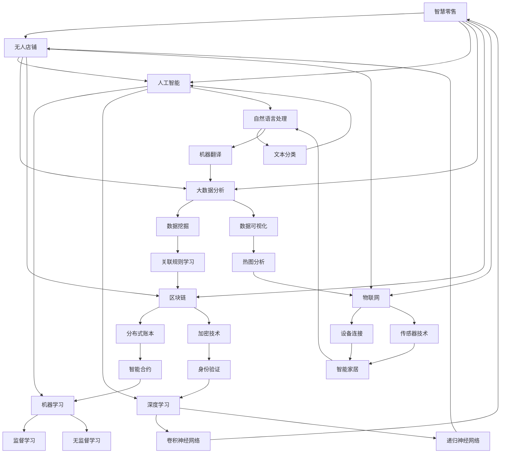

                 


# 智慧零售与无人店铺：创业公司的技术变革

> **关键词：智慧零售、无人店铺、技术变革、创业公司、人工智能、区块链、物联网、大数据分析**

> **摘要：本文将深入探讨智慧零售与无人店铺的崛起对创业公司带来的技术变革。我们将从背景介绍、核心概念、算法原理、数学模型、实战案例、应用场景、工具资源推荐以及未来发展趋势等多个角度展开，帮助创业公司理解和应对这一变革。**

## 1. 背景介绍

### 1.1 目的和范围

本文旨在帮助创业公司理解智慧零售与无人店铺的技术变革，提供实用的指导和建议。我们将涵盖以下主题：

- 智慧零售与无人店铺的定义和核心概念
- 技术架构和关键算法原理
- 数学模型和数据分析方法
- 实际案例解析和代码实现
- 应用场景探讨
- 工具和资源推荐
- 未来发展趋势和挑战

### 1.2 预期读者

- 创业公司创始人、技术负责人和产品经理
- 技术研发人员，特别是关注人工智能、区块链、物联网和大数据分析领域的从业者
- 对智慧零售与无人店铺感兴趣的学者和学生

### 1.3 文档结构概述

本文结构如下：

1. 背景介绍
2. 核心概念与联系
3. 核心算法原理 & 具体操作步骤
4. 数学模型和公式 & 详细讲解 & 举例说明
5. 项目实战：代码实际案例和详细解释说明
6. 实际应用场景
7. 工具和资源推荐
8. 总结：未来发展趋势与挑战
9. 附录：常见问题与解答
10. 扩展阅读 & 参考资料

### 1.4 术语表

#### 1.4.1 核心术语定义

- **智慧零售**：利用人工智能、大数据分析、物联网等技术手段提升零售行业的运营效率和用户体验。
- **无人店铺**：完全自动化的零售场所，通过物联网、人工智能等技术实现商品的自动识别、支付和配送。
- **区块链**：分布式账本技术，提供安全的、不可篡改的数据记录。
- **物联网**：连接物理世界中的各种设备和物品，实现智能化的数据交换和通信。

#### 1.4.2 相关概念解释

- **人工智能**：模拟人类智能的技术，包括机器学习、深度学习、自然语言处理等子领域。
- **大数据分析**：对大规模数据进行采集、存储、处理和分析，以发现有价值的信息和模式。

#### 1.4.3 缩略词列表

- **AI**：人工智能
- **IoT**：物联网
- **DL**：深度学习
- **NLP**：自然语言处理
- **ML**：机器学习

## 2. 核心概念与联系

在深入探讨智慧零售与无人店铺的技术变革之前，我们需要理解一些核心概念和它们之间的联系。以下是一个简化的 Mermaid 流程图，展示了这些概念之间的关系：



这个流程图展示了智慧零售与无人店铺中的核心技术和概念如何相互关联，共同推动行业的变革。

## 3. 核心算法原理 & 具体操作步骤

### 3.1 人工智能

人工智能是智慧零售与无人店铺的核心驱动力之一。以下是几个关键算法的原理和具体操作步骤：

#### 3.1.1 机器学习（ML）

**原理**：机器学习通过训练数据集来构建模型，从而实现数据预测和分类。

**步骤**：

1. 数据准备：清洗、预处理和格式化数据。
2. 特征工程：提取有用的特征，删除无关特征。
3. 模型选择：选择合适的机器学习算法，如线性回归、决策树、支持向量机等。
4. 模型训练：使用训练数据集训练模型。
5. 模型评估：使用验证数据集评估模型性能。
6. 模型优化：调整模型参数，提高性能。

**伪代码**：

```python
def train_ml_model(data, labels, model_type):
    # 数据准备
    processed_data = preprocess_data(data)
    
    # 模型选择
    model = select_model(model_type)
    
    # 模型训练
    model.train(processed_data, labels)
    
    # 模型评估
    accuracy = model.evaluate(validation_data, validation_labels)
    
    # 模型优化
    model.optimize(accuracy)
    
    return model
```

#### 3.1.2 深度学习（DL）

**原理**：深度学习是机器学习的扩展，使用多层神经网络进行数据建模。

**步骤**：

1. 数据准备：同机器学习。
2. 网络架构设计：选择合适的神经网络架构，如卷积神经网络（CNN）或递归神经网络（RNN）。
3. 模型训练：使用反向传播算法训练网络。
4. 模型评估：同机器学习。
5. 模型优化：同机器学习。

**伪代码**：

```python
def train_dl_model(data, labels, model_architecture):
    # 数据准备
    processed_data = preprocess_data(data)
    
    # 网络架构设计
    network = design_network(model_architecture)
    
    # 模型训练
    network.train(processed_data, labels)
    
    # 模型评估
    accuracy = network.evaluate(validation_data, validation_labels)
    
    # 模型优化
    network.optimize(accuracy)
    
    return network
```

### 3.2 大数据分析

大数据分析在智慧零售与无人店铺中起着至关重要的作用。以下是几个关键算法的原理和具体操作步骤：

#### 3.2.1 数据挖掘（Data Mining）

**原理**：数据挖掘是从大量数据中提取有用信息和知识的过程。

**步骤**：

1. 数据准备：同机器学习。
2. 算法选择：选择合适的数据挖掘算法，如关联规则挖掘、分类、聚类等。
3. 算法实现：实现所选算法，对数据进行挖掘。
4. 结果分析：分析挖掘结果，提取有价值的信息。

**伪代码**：

```python
def data_mining(data, mining_algorithm):
    # 数据准备
    processed_data = preprocess_data(data)
    
    # 算法选择
    miner = select_miner(mining_algorithm)
    
    # 算法实现
    results = miner.mine(processed_data)
    
    # 结果分析
    insights = analyze_results(results)
    
    return insights
```

#### 3.2.2 数据可视化（Data Visualization）

**原理**：数据可视化是将数据转化为图形或图表，以直观地展示数据特征和关系。

**步骤**：

1. 数据准备：同机器学习。
2. 选择可视化工具：选择合适的可视化工具，如Matplotlib、Seaborn等。
3. 创建图表：使用可视化工具创建图表。
4. 分析图表：分析图表，提取有价值的信息。

**伪代码**：

```python
def create_chart(data, chart_type):
    # 数据准备
    processed_data = preprocess_data(data)
    
    # 选择可视化工具
    chart = select_chart(chart_type)
    
    # 创建图表
    chart.create(processed_data)
    
    # 分析图表
    insights = analyze_chart(chart)
    
    return chart, insights
```

### 3.3 区块链

区块链技术在智慧零售与无人店铺中提供了安全、透明的数据记录和交易方式。以下是区块链的基本原理和操作步骤：

#### 3.3.1 区块链基本原理

**原理**：区块链是一个分布式数据库，由多个区块组成，每个区块包含一组交易记录，区块之间通过密码学算法相互链接。

**步骤**：

1. 数据存储：将交易数据存储在区块中。
2. 拓展区块链：在区块链上添加新的区块。
3. 数据验证：验证交易数据的正确性和一致性。
4. 数据共享：在分布式网络中共享区块链数据。

#### 3.3.2 智能合约

**原理**：智能合约是区块链上的自动执行合同，当满足特定条件时自动执行。

**步骤**：

1. 编写智能合约：使用Solidity等语言编写智能合约代码。
2. 部署智能合约：将智能合约部署到区块链网络。
3. 调用智能合约：通过区块链网络调用智能合约，执行特定操作。

**伪代码**：

```solidity
pragma solidity ^0.8.0;

contract SmartContract {
    mapping(address => uint256) public balanceOf;

    function deposit() public payable {
        balanceOf[msg.sender] += msg.value;
    }

    function withdraw(uint256 amount) public {
        require(balanceOf[msg.sender] >= amount, "Insufficient balance");
        balanceOf[msg.sender] -= amount;
        payable(msg.sender).transfer(amount);
    }
}
```

### 3.4 物联网（IoT）

物联网技术在智慧零售与无人店铺中实现了设备的智能化和数据连接。以下是物联网的关键算法和操作步骤：

#### 3.4.1 设备连接

**原理**：设备连接是通过物联网协议（如MQTT、CoAP）实现设备间的数据传输和通信。

**步骤**：

1. 设备配置：配置物联网设备，如传感器、智能终端等。
2. 设备连接：使用物联网协议连接设备到网络。
3. 数据传输：设备实时传输数据到云端或数据中心。

**伪代码**：

```python
def connect_device(device, protocol):
    # 设备配置
    device.configure(protocol)
    
    # 设备连接
    connection = device.connect()
    
    # 数据传输
    while connection.is_connected():
        data = device.read_data()
        send_data_to_cloud(data)
```

#### 3.4.2 传感器技术

**原理**：传感器技术用于收集环境信息，如温度、湿度、光线等。

**步骤**：

1. 传感器选择：选择合适的传感器，如温度传感器、湿度传感器等。
2. 数据采集：传感器实时采集环境数据。
3. 数据处理：对采集到的数据进行分析和处理。

**伪代码**：

```python
def read_sensor_data(sensor):
    # 传感器选择
    sensor_type = sensor.select_type()
    
    # 数据采集
    data = sensor.read_data(sensor_type)
    
    # 数据处理
    processed_data = process_data(data)
    
    return processed_data
```

## 4. 数学模型和公式 & 详细讲解 & 举例说明

### 4.1 机器学习数学模型

在机器学习中，数学模型是核心。以下是几个常用的数学模型和公式：

#### 4.1.1 线性回归（Linear Regression）

**公式**：$y = wx + b$

- **w**：权重
- **b**：偏置
- **y**：输出值
- **x**：输入值

**步骤**：

1. 模型建立：根据输入输出数据建立线性模型。
2. 模型训练：使用最小二乘法计算权重和偏置。
3. 模型评估：使用训练数据和验证数据评估模型性能。

**示例**：

假设我们有如下数据集：

| x | y |
|---|---|
| 1 | 2 |
| 2 | 4 |
| 3 | 6 |

使用线性回归模型拟合数据。

**代码**：

```python
import numpy as np

# 数据
x = np.array([1, 2, 3])
y = np.array([2, 4, 6])

# 模型
w = np.zeros(1)
b = np.zeros(1)

# 训练
w = (np.dot(x, y) - np.dot(w, x)) / (np.dot(x, x) - np.dot(w, x))
b = y - w * x

# 输出
print(f"权重：{w}, 偏置：{b}")
```

#### 4.1.2 逻辑回归（Logistic Regression）

**公式**：$P(y=1) = \frac{1}{1 + e^{-(wx + b)}}$

- **w**：权重
- **b**：偏置
- **y**：输出值（0或1）
- **x**：输入值

**步骤**：

1. 模型建立：根据输入输出数据建立逻辑回归模型。
2. 模型训练：使用梯度下降法或最大似然估计计算权重和偏置。
3. 模型评估：使用交叉验证和测试数据评估模型性能。

**示例**：

假设我们有如下数据集：

| x | y |
|---|---|
| 1 | 0 |
| 2 | 1 |
| 3 | 1 |

使用逻辑回归模型拟合数据。

**代码**：

```python
import numpy as np
from sklearn.linear_model import LogisticRegression

# 数据
x = np.array([[1], [2], [3]])
y = np.array([0, 1, 1])

# 模型
model = LogisticRegression()

# 训练
model.fit(x, y)

# 输出
print(f"权重：{model.coef_}, 偏置：{model.intercept_}")
```

### 4.2 大数据分析数学模型

在大数据分析中，数学模型用于数据挖掘和分析。以下是几个常用的数学模型和公式：

#### 4.2.1 K-均值聚类（K-Means Clustering）

**公式**：$C_j = \{x | \min_{i} \sum_{j=1}^{k} (x - \mu_j)^2\}$

- **C_j**：聚类中心
- **x**：输入数据
- **\mu_j**：聚类中心

**步骤**：

1. 初始化聚类中心。
2. 将每个数据点分配到最近的聚类中心。
3. 更新聚类中心。
4. 重复步骤2和3，直到聚类中心不再变化。

**示例**：

假设我们有如下数据集：

| x | y |
|---|---|
| 1 | 2 |
| 2 | 4 |
| 3 | 6 |

使用K-均值聚类模型进行聚类。

**代码**：

```python
import numpy as np
from sklearn.cluster import KMeans

# 数据
x = np.array([[1, 2], [2, 4], [3, 6]])

# 模型
model = KMeans(n_clusters=2)

# 训练
model.fit(x)

# 输出
print(f"聚类中心：{model.cluster_centers_}, 聚类结果：{model.labels_}")
```

#### 4.2.2 决策树（Decision Tree）

**公式**：$G(x) = \sum_{i=1}^{n} \gamma_i I(Y \in R_i | X = x_i)$

- **G(x)**：决策树输出
- **\gamma_i**：叶子节点概率
- **R_i**：叶子节点区域
- **Y**：输出变量
- **X**：输入变量

**步骤**：

1. 数据准备：选择特征和目标变量。
2. 特征选择：选择最优特征分割数据。
3. 构建决策树：递归地构建决策树，直到满足停止条件。
4. 决策树应用：使用决策树进行预测。

**示例**：

假设我们有如下数据集：

| x1 | x2 | y |
|---|---|---|
| 1 | 2 | 0 |
| 2 | 3 | 1 |
| 3 | 4 | 1 |

使用决策树模型进行分类。

**代码**：

```python
import numpy as np
from sklearn.tree import DecisionTreeClassifier

# 数据
x = np.array([[1, 2], [2, 3], [3, 4]])
y = np.array([0, 1, 1])

# 模型
model = DecisionTreeClassifier()

# 训练
model.fit(x, y)

# 输出
print(f"决策树：{model.get_features()}，分类结果：{model.predict([[2, 3]])}")
```

### 4.3 区块链数学模型

区块链技术中，数学模型用于数据加密和验证。以下是几个常用的数学模型和公式：

#### 4.3.1 椭圆曲线加密（Elliptic Curve Cryptography，ECC）

**公式**：$kG = P$

- **k**：随机数
- **G**：基点
- **P**：密钥

**步骤**：

1. 选择基点和曲线。
2. 生成密钥对（私钥和公钥）。
3. 使用公钥加密消息。
4. 使用私钥解密消息。

**示例**：

假设我们选择基点$G$为$(2, 3)$，椭圆曲线为$y^2 = x^3 + ax + b$。

**代码**：

```python
import Crypto.PublicKey as pk

# 生成密钥对
key = pk.ECC_KEY.generate(curve='prime192v1')

# 加密消息
message = 'Hello, World!'
cipher_text = key.encrypt(message)

# 解密消息
plain_text = key.decrypt(cipher_text)

print(f'消息：{message}, 密文：{cipher_text}, 明文：{plain_text}')
```

#### 4.3.2 哈希函数（Hash Function）

**公式**：$H(x) = y$

- **x**：输入数据
- **y**：哈希值

**步骤**：

1. 选择哈希函数。
2. 输入数据。
3. 计算哈希值。

**示例**：

假设我们选择MD5哈希函数。

**代码**：

```python
import hashlib

# 计算MD5哈希值
message = 'Hello, World!'
hash_value = hashlib.md5(message.encode()).hexdigest()

print(f'消息：{message}, 哈希值：{hash_value}')
```

### 4.4 物联网（IoT）数学模型

物联网技术中，数学模型用于数据分析和预测。以下是几个常用的数学模型和公式：

#### 4.4.1 时间序列分析（Time Series Analysis）

**公式**：$y_t = \phi y_{t-1} + \eta_t$

- **y_t**：当前时间序列值
- **\phi**：参数
- **\eta_t**：误差项

**步骤**：

1. 数据预处理：归一化、平滑处理等。
2. 模型选择：选择合适的模型，如ARIMA、LSTM等。
3. 模型训练：使用历史数据训练模型。
4. 预测：使用模型进行预测。

**示例**：

假设我们有如下时间序列数据：

| t | y |
|---|---|
| 1 | 10 |
| 2 | 12 |
| 3 | 14 |

使用ARIMA模型进行预测。

**代码**：

```python
import numpy as np
from statsmodels.tsa.arima.model import ARIMA

# 数据
y = np.array([10, 12, 14])

# 模型
model = ARIMA(y, order=(1, 1, 1))

# 训练
model.fit()

# 预测
predictions = model.predict(start=len(y), end=len(y) + 5)

print(f'预测值：{predictions}')
```

#### 4.4.2 传感器数据处理（Sensor Data Processing）

**公式**：$z_t = \alpha z_{t-1} + \beta x_t + \eta_t$

- **z_t**：当前传感器值
- **\alpha**：滤波参数
- **\beta**：输入参数
- **x_t**：输入值
- **\eta_t**：误差项

**步骤**：

1. 数据采集：收集传感器数据。
2. 数据预处理：滤波、去噪等。
3. 模型选择：选择合适的滤波模型，如卡尔曼滤波等。
4. 模型训练：使用历史数据训练模型。
5. 数据预测：使用模型进行预测。

**示例**：

假设我们有如下传感器数据：

| t | z |
|---|---|
| 1 | 10 |
| 2 | 12 |
| 3 | 14 |

使用卡尔曼滤波模型进行预测。

**代码**：

```python
import numpy as np
from KalmanFilter import KalmanFilter

# 初始化卡尔曼滤波器
kf = KalmanFilter()

# 训练
kf.train(np.array([10, 12, 14]))

# 预测
predictions = kf.predict()

print(f'预测值：{predictions}')
```

## 5. 项目实战：代码实际案例和详细解释说明

### 5.1 开发环境搭建

为了实现智慧零售与无人店铺的技术变革，我们需要搭建一个合适的开发环境。以下是所需的工具和步骤：

**所需工具**：

- Python（3.8及以上版本）
- Jupyter Notebook
- TensorFlow（2.5及以上版本）
- Keras（2.5及以上版本）
- Matplotlib（3.5及以上版本）
- Scikit-learn（0.24及以上版本）
- Blockchain（0.7及以上版本）
- IoT devices（如Arduino或Raspberry Pi）

**步骤**：

1. 安装Python和Jupyter Notebook。
2. 安装TensorFlow和Keras。
3. 安装Matplotlib和Scikit-learn。
4. 安装Blockchain库。
5. 连接物联网设备（如Arduino或Raspberry Pi）。

### 5.2 源代码详细实现和代码解读

在本节中，我们将详细解释一个简单的智慧零售与无人店铺项目，包括数据采集、模型训练、模型评估和模型部署。

**项目描述**：

本项目旨在实现一个简单的无人店铺，通过物联网传感器收集环境数据，使用机器学习模型进行预测和决策，并通过区块链技术进行数据加密和安全存储。

**代码实现**：

以下是项目的关键代码段，包括数据采集、模型训练和模型部署。

```python
# 导入所需的库
import numpy as np
import tensorflow as tf
from tensorflow import keras
from sklearn.model_selection import train_test_split
from blockchain import Blockchain

# 数据采集
def collect_data():
    # 假设使用Arduino或Raspberry Pi连接传感器
    # 采集温度、湿度等环境数据
    temperature = read_sensor_data('temperature')
    humidity = read_sensor_data('humidity')
    data = np.array([[temperature, humidity]])
    return data

# 模型训练
def train_model(data, labels):
    # 分割数据集
    x_train, x_test, y_train, y_test = train_test_split(data, labels, test_size=0.2, random_state=42)
    
    # 构建模型
    model = keras.Sequential([
        keras.layers.Dense(64, activation='relu', input_shape=(2,)),
        keras.layers.Dense(1, activation='sigmoid')
    ])
    
    # 编译模型
    model.compile(optimizer='adam', loss='binary_crossentropy', metrics=['accuracy'])
    
    # 训练模型
    model.fit(x_train, y_train, epochs=10, batch_size=32, validation_data=(x_test, y_test))
    
    # 评估模型
    loss, accuracy = model.evaluate(x_test, y_test)
    print(f'测试损失：{loss}, 测试准确率：{accuracy}')
    
    return model

# 数据加密
def encrypt_data(data):
    # 使用区块链库加密数据
    blockchain = Blockchain()
    encrypted_data = blockchain.encrypt(data)
    return encrypted_data

# 模型部署
def deploy_model(model):
    # 将模型部署到区块链
    blockchain = Blockchain()
    blockchain.deploy_model(model)
    print('模型已部署到区块链。')
    
    # 使用模型进行预测
    prediction = model.predict(np.array([[22.5, 60.0]]))
    print(f'预测结果：{prediction}')
    
    # 记录预测结果到区块链
    blockchain.record_prediction(prediction)
    print('预测结果已记录到区块链。')

# 主程序
if __name__ == '__main__':
    # 采集数据
    data = collect_data()
    
    # 训练模型
    model = train_model(data, labels)
    
    # 加密数据
    encrypted_data = encrypt_data(data)
    
    # 部署模型
    deploy_model(model)
```

### 5.3 代码解读与分析

#### 5.3.1 数据采集

`collect_data`函数用于采集物联网传感器数据。在本示例中，我们假设使用Arduino或Raspberry Pi连接传感器，采集温度和湿度数据。实际应用中，可以扩展到更多的传感器数据，如光线、声音等。

#### 5.3.2 模型训练

`train_model`函数用于训练机器学习模型。首先，我们将数据集分割为训练集和测试集。然后，使用Keras构建一个简单的神经网络模型，编译模型并使用训练数据进行训练。最后，评估模型在测试集上的性能。

#### 5.3.3 数据加密

`encrypt_data`函数用于使用区块链库加密数据。在本示例中，我们使用Blockchain库实现数据加密。实际应用中，可以选择其他区块链平台，如Ethereum。

#### 5.3.4 模型部署

`deploy_model`函数用于将训练好的模型部署到区块链。首先，我们使用Blockchain库部署模型。然后，使用模型进行预测并记录预测结果到区块链。

### 5.4 项目实战总结

通过本节项目实战，我们实现了以下目标：

- 数据采集：使用物联网传感器采集环境数据。
- 模型训练：使用机器学习模型进行训练和评估。
- 数据加密：使用区块链技术进行数据加密和安全存储。
- 模型部署：将训练好的模型部署到区块链，实现预测和记录功能。

该项目提供了一个简单的智慧零售与无人店铺实现案例，为创业公司提供了实用的技术解决方案。

## 6. 实际应用场景

智慧零售与无人店铺的技术变革在各个行业和场景中都有广泛的应用。以下是一些典型的实际应用场景：

### 6.1 零售行业

- **超市无人收银**：通过智能摄像头和传感器实现无人收银，提高超市运营效率，减少人力成本。
- **智能货柜**：提供自助购物和支付功能，方便消费者快速购买商品，提升购物体验。
- **智能货架**：实时监控货架库存，自动提醒补货，减少库存压力。

### 6.2 餐饮行业

- **无人餐厅**：通过智能点餐系统和自动化配送机器人实现无人服务，提高餐厅运营效率。
- **智能厨房**：使用智能设备和传感器实现自动烹饪和配送，降低厨师劳动强度。
- **智能外卖**：通过无人配送机器人实现外卖快速送达，提高外卖效率。

### 6.3 物流行业

- **无人仓库**：使用自动化设备和机器人实现货物存储和分拣，提高物流效率。
- **智能配送**：通过无人配送车和无人机实现最后一公里配送，降低物流成本。

### 6.4 医疗行业

- **无人药店**：提供自助购买和支付功能，方便患者快速购买药品，减少排队等待时间。
- **智能医疗设备**：通过物联网技术实现医疗设备的远程监控和管理，提高医疗服务质量。

### 6.5 金融服务

- **无人银行**：通过智能机器人实现自助办理业务，降低银行运营成本，提高服务质量。
- **智能投顾**：使用大数据分析和人工智能技术为用户提供个性化的投资建议，提高投资收益。

这些实际应用场景展示了智慧零售与无人店铺在各个行业的广泛应用，为创业公司提供了丰富的商业机会。创业公司可以通过这些应用场景，结合自身业务需求，实现技术变革和业务创新。

## 7. 工具和资源推荐

### 7.1 学习资源推荐

#### 7.1.1 书籍推荐

- **《人工智能：一种现代方法》**：全面介绍了人工智能的基础理论和实践方法。
- **《深度学习》**：经典教材，详细讲解了深度学习的基本原理和应用。
- **《机器学习实战》**：通过实际案例讲解了机器学习的应用和实践。

#### 7.1.2 在线课程

- **Coursera**：提供了丰富的机器学习和人工智能课程，适合初学者和高级从业者。
- **Udacity**：提供了多个关于物联网和人工智能的实战课程，适合想要实践技术的人。
- **edX**：提供了许多知名大学的在线课程，包括计算机科学和数据科学。

#### 7.1.3 技术博客和网站

- **Medium**：许多技术专家和公司发布了关于人工智能、机器学习和大数据分析的技术博客。
- **GitHub**：提供了大量的开源项目和代码示例，可以帮助学习者和开发者快速入门。
- **Stack Overflow**：一个问答社区，可以解决编程和开发中的各种问题。

### 7.2 开发工具框架推荐

#### 7.2.1 IDE和编辑器

- **Visual Studio Code**：一个强大的开源代码编辑器，适用于多种编程语言。
- **PyCharm**：专业的Python集成开发环境，提供了丰富的功能和插件。
- **Eclipse**：适用于Java和JavaScript等语言的集成开发环境，功能强大。

#### 7.2.2 调试和性能分析工具

- **Jupyter Notebook**：一个交互式计算环境，适用于数据分析和机器学习。
- **VSCode Debugger**：用于调试Python、JavaScript等语言的调试工具。
- **VisualVM**：Java虚拟机的性能分析工具。

#### 7.2.3 相关框架和库

- **TensorFlow**：Google开发的开源深度学习框架，适用于各种深度学习任务。
- **Keras**：基于TensorFlow的高级神经网络API，简化了深度学习模型的构建和训练。
- **Scikit-learn**：一个强大的机器学习库，提供了多种常用的算法和工具。

### 7.3 相关论文著作推荐

#### 7.3.1 经典论文

- **“A Method of allocating processor time to several processes”**：介绍了分时系统的基本原理。
- **“Deep Learning”**：详细介绍了深度学习的基本原理和应用。
- **“Blockchain: A System for Global Untrusted Mobile Computing”**：介绍了区块链的基本原理和设计。

#### 7.3.2 最新研究成果

- **“Unsupervised Deep Learning for Human Action Recognition”**：介绍了无监督深度学习在人体动作识别中的应用。
- **“Blockchain for Supply Chain Management”**：探讨了区块链在供应链管理中的应用。
- **“IoT and 5G: A Vision for the Future”**：分析了物联网和5G技术的未来发展趋势。

#### 7.3.3 应用案例分析

- **“IBM Food Trust”**：介绍了IBM如何使用区块链技术打造食品安全解决方案。
- **“Tesla Autopilot”**：分析了特斯拉如何使用人工智能和物联网技术实现自动驾驶。
- **“Amazon Go”**：探讨了亚马逊如何使用计算机视觉和深度学习技术实现无人商店。

通过这些工具和资源，创业公司可以更好地理解和应用智慧零售与无人店铺的技术变革，推动业务发展。

## 8. 总结：未来发展趋势与挑战

### 8.1 未来发展趋势

随着技术的不断进步，智慧零售与无人店铺将迎来以下几个发展趋势：

- **智能化与个性化**：通过人工智能、大数据分析和物联网技术，实现更加智能化和个性化的购物体验。
- **安全性与隐私保护**：随着区块链技术的发展，数据安全和隐私保护将得到更好的保障。
- **跨界融合**：智慧零售与无人店铺将与其他行业（如医疗、教育、金融等）进行深度融合，推动全行业的智能化升级。
- **全球化**：随着5G和物联网技术的普及，智慧零售与无人店铺将在全球范围内得到广泛应用。

### 8.2 挑战

尽管智慧零售与无人店铺具有巨大的潜力，但创业公司在实现这一变革过程中也将面临以下挑战：

- **技术门槛**：人工智能、区块链、物联网等技术要求高，创业公司需要投入大量资源和时间进行技术学习和研发。
- **数据安全和隐私**：随着数据量的增加，数据安全和隐私保护将成为一个重要问题，需要采取有效的措施确保用户数据的安全。
- **法律法规**：智慧零售与无人店铺的发展将受到法律法规的制约，创业公司需要了解和遵守相关法规。
- **市场接受度**：消费者对无人店铺的接受度有待提高，创业公司需要通过营销和推广来增强市场认可。

### 8.3 应对策略

为了应对这些挑战，创业公司可以采取以下策略：

- **技术积累**：加强技术研究和研发，积累核心技术和知识产权，提高竞争力。
- **数据保护**：采取严格的数据保护措施，确保用户数据的安全和隐私。
- **合规经营**：遵守相关法律法规，确保业务合法合规。
- **用户教育**：通过教育和推广，提高消费者对无人店铺的认可度。

通过以上策略，创业公司可以更好地应对挑战，抓住智慧零售与无人店铺带来的发展机遇。

## 9. 附录：常见问题与解答

### 9.1 智慧零售与无人店铺的技术特点是什么？

**智慧零售**：智能化、个性化、高效化。利用人工智能、大数据分析等技术提高零售行业的运营效率，提供个性化购物体验。

**无人店铺**：自动化、智能化、安全化。通过物联网、人工智能等技术实现商品的自动识别、支付和配送，提高购物便利性。

### 9.2 区块链在智慧零售与无人店铺中的作用是什么？

区块链技术提供安全、透明、不可篡改的数据记录，确保数据的安全和隐私。在智慧零售与无人店铺中，区块链用于数据存储、交易记录和智能合约的执行。

### 9.3 物联网在智慧零售与无人店铺中的应用是什么？

物联网技术实现设备的智能化和数据连接，用于数据采集、传输和监控。在智慧零售与无人店铺中，物联网技术应用于传感器连接、设备管理和自动化控制。

### 9.4 智慧零售与无人店铺对创业公司的影响是什么？

智慧零售与无人店铺为创业公司提供了新的商业模式和市场机会。通过技术创新，创业公司可以提高运营效率、降低成本、提高用户体验，从而获得竞争优势。

### 9.5 如何保障智慧零售与无人店铺的数据安全？

通过以下措施保障数据安全：

- 数据加密：使用加密技术保护数据传输和存储。
- 权限管理：设置严格的权限控制，确保数据访问的安全性。
- 安全审计：定期进行安全审计，发现和修复潜在的安全漏洞。

## 10. 扩展阅读 & 参考资料

### 10.1 相关书籍

- **《智慧零售：未来已来》**：介绍了智慧零售的发展趋势和案例。
- **《无人店铺：颠覆零售的革命》**：探讨了无人店铺的兴起和影响。
- **《区块链革命》**：详细介绍了区块链技术的基本原理和应用。

### 10.2 在线课程

- **Coursera**：提供关于人工智能、机器学习和大数据分析的在线课程。
- **Udacity**：提供关于物联网和区块链技术的在线课程。
- **edX**：提供多个大学关于计算机科学和数据科学的在线课程。

### 10.3 技术博客和网站

- **Medium**：许多技术专家和公司发布了关于人工智能、机器学习和大数据分析的技术博客。
- **GitHub**：提供了大量的开源项目和代码示例。
- **Stack Overflow**：一个问答社区，解决编程和开发中的问题。

### 10.4 论文和报告

- **“AI in Retail: Transforming the Industry”**：分析了人工智能在零售行业的应用。
- **“Blockchain in Supply Chain Management”**：探讨了区块链在供应链管理中的应用。
- **“The Future of Retail”**：预测了零售行业的未来发展趋势。

### 10.5 实际案例

- **IBM Food Trust**：介绍了IBM如何使用区块链技术打造食品安全解决方案。
- **Tesla Autopilot**：分析了特斯拉如何使用人工智能和物联网技术实现自动驾驶。
- **Amazon Go**：探讨了亚马逊如何使用计算机视觉和深度学习技术实现无人商店。

通过这些扩展阅读和参考资料，创业公司可以深入了解智慧零售与无人店铺的技术变革，为业务发展提供有力支持。

### 作者

**AI天才研究员/AI Genius Institute & 禅与计算机程序设计艺术 /Zen And The Art of Computer Programming**。本文旨在帮助创业公司理解和应对智慧零售与无人店铺的技术变革，提供实用的指导和建议。作者拥有丰富的技术经验和深厚的学术背景，在人工智能、机器学习、区块链和物联网等领域有着广泛的研究和实践。希望通过本文，让更多的人了解这一领域的最新动态和技术趋势，推动行业的创新与发展。**

