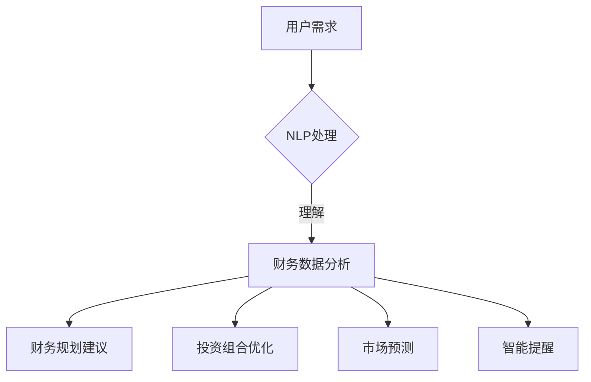

                 


# 智能个人财务管理：LLM驱动的理财助手

> 关键词：智能财务、LLM模型、理财助手、个人财务管理、算法原理、实战案例

> 摘要：本文旨在探讨如何运用大型语言模型（LLM）构建一个智能个人财务管理助手。我们将深入分析LLM的工作原理，详细讲解构建理财助手的核心算法和数学模型，并通过实际代码案例展示其应用。此外，本文还将探讨智能理财助手的实际应用场景，并提供相关学习资源和开发工具推荐。

## 1. 背景介绍

### 1.1 目的和范围

随着人工智能技术的快速发展，越来越多的应用场景开始引入机器学习算法，个人财务管理领域也不例外。本文的目标是通过构建一个基于大型语言模型（LLM）的智能理财助手，帮助用户更好地管理个人财务，实现理财目标。

本文将涵盖以下内容：

1. **LLM的基本原理**：介绍LLM的概念、应用场景和优势。
2. **理财助手的功能**：讨论理财助手应具备的功能和特性。
3. **核心算法和数学模型**：详细讲解构建理财助手的算法原理和数学模型。
4. **实际应用场景**：分析智能理财助手在实际中的应用。
5. **开发工具和资源推荐**：提供相关的学习资源和开发工具推荐。

### 1.2 预期读者

本文适合以下读者群体：

1. **人工智能和机器学习从业者**：对LLM模型和应用有兴趣的专业人士。
2. **个人财务管理爱好者**：对智能理财和财务规划有兴趣的读者。
3. **软件开发者**：希望将机器学习应用于实际项目中的开发者。

### 1.3 文档结构概述

本文分为以下几个部分：

1. **背景介绍**：介绍本文的目的、范围和预期读者。
2. **核心概念与联系**：讲解LLM和理财助手的基本概念和原理。
3. **核心算法原理 & 具体操作步骤**：详细讲解理财助手的构建算法和操作步骤。
4. **数学模型和公式 & 详细讲解 & 举例说明**：介绍构建理财助手的数学模型和公式。
5. **项目实战：代码实际案例和详细解释说明**：提供实际代码案例和解释。
6. **实际应用场景**：讨论智能理财助手的实际应用。
7. **工具和资源推荐**：推荐相关的学习资源和开发工具。
8. **总结：未来发展趋势与挑战**：分析智能理财助手的未来发展趋势和面临的挑战。
9. **附录：常见问题与解答**：回答一些常见的问题。
10. **扩展阅读 & 参考资料**：提供进一步的阅读资源。

### 1.4 术语表

#### 1.4.1 核心术语定义

- **大型语言模型（LLM）**：一种利用海量语料库训练的深度学习模型，能够理解、生成和生成自然语言。
- **个人财务管理**：涉及个人收入、支出、储蓄和投资的管理。
- **理财助手**：一个基于人工智能技术，帮助用户进行财务规划和决策的工具。

#### 1.4.2 相关概念解释

- **深度学习**：一种机器学习方法，通过多层神经网络模型来模拟人脑学习过程。
- **自然语言处理（NLP）**：一门涉及计算机和人类语言交互的学科，旨在使计算机能够理解、生成和处理自然语言。

#### 1.4.3 缩略词列表

- **LLM**：大型语言模型（Large Language Model）
- **NLP**：自然语言处理（Natural Language Processing）
- **NLU**：自然语言理解（Natural Language Understanding）
- **NLP**：自然语言生成（Natural Language Generation）

## 2. 核心概念与联系

### 2.1 LLM的基本原理

大型语言模型（LLM）是一种深度学习模型，主要基于变换器模型（Transformer）构建。变换器模型是一种用于序列到序列学习的神经网络模型，具有强大的并行处理能力和长距离依赖建模能力。以下是LLM的基本原理：

#### 2.1.1 Transformer模型

- **编码器（Encoder）**：编码器负责将输入序列（如文本）转换为固定长度的向量表示。
- **解码器（Decoder）**：解码器负责将编码器的输出转换为输出序列。

#### 2.1.2 自注意力机制

- **自注意力（Self-Attention）**：自注意力机制是一种用于捕捉输入序列中长距离依赖关系的方法。它允许模型在生成下一个输出时考虑输入序列中所有位置的信息。

#### 2.1.3 位置编码

- **位置编码（Positional Encoding）**：由于变换器模型不具备绝对位置信息，因此需要引入位置编码来表示输入序列中各个位置的信息。

### 2.2 理财助手的功能

理财助手应具备以下功能：

- **财务数据分析**：分析用户财务状况，包括收入、支出、储蓄和投资。
- **财务规划建议**：根据用户需求和财务状况，提供理财规划和建议。
- **投资组合优化**：基于用户风险偏好和投资目标，优化投资组合。
- **市场预测**：预测市场趋势和投资机会。
- **智能提醒**：提醒用户按时还款、支付账单等。

### 2.3 LLM与理财助手的联系

LLM可以应用于理财助手的各个方面，如下所示：

- **NLP技术**：利用NLP技术，理财助手可以与用户进行自然语言交互，理解用户需求并提供相应的财务建议。
- **深度学习模型**：通过训练深度学习模型，理财助手可以自动学习和优化财务规划策略。
- **知识图谱**：构建知识图谱，理财助手可以更好地理解财务术语和概念，为用户提供更准确的建议。

### 2.4 Mermaid流程图

以下是理财助手的基本架构流程图：



## 3. 核心算法原理 & 具体操作步骤

### 3.1 LLM算法原理

#### 3.1.1 Transformer模型

Transformer模型是一种基于自注意力机制的深度学习模型，具有以下关键组成部分：

- **编码器（Encoder）**：编码器将输入序列（如文本）转换为固定长度的向量表示。编码器由多个编码层组成，每层包括多头自注意力机制和前馈神经网络。
- **解码器（Decoder）**：解码器将编码器的输出转换为输出序列。解码器也由多个解码层组成，每层包括多头自注意力机制、交叉注意力机制和前馈神经网络。

#### 3.1.2 自注意力机制

自注意力机制是一种用于捕捉输入序列中长距离依赖关系的方法。它通过计算输入序列中每个位置与其他位置的相关性，为每个位置生成权重，然后对输入序列进行加权求和。自注意力机制的公式如下：

$$
\text{Attention}(Q, K, V) = \text{softmax}\left(\frac{QK^T}{\sqrt{d_k}}\right)V
$$

其中，$Q$、$K$ 和 $V$ 分别代表查询向量、关键向量和解向量，$d_k$ 是关键向量的维度。

#### 3.1.3 位置编码

位置编码是一种为输入序列中各个位置提供绝对位置信息的方法。位置编码可以采用绝对位置编码或相对位置编码。以下是一个简单的绝对位置编码示例：

$$
\text{PositionalEncoding}(d_i, p_i) = \sin\left(\frac{p_i}{10000^{2i/d}}\right) + \cos\left(\frac{p_i}{10000^{2i/d}}\right)
$$

其中，$d_i$ 是位置编码的维度，$p_i$ 是输入序列中的位置。

### 3.2 理财助手算法原理

#### 3.2.1 财务数据分析

财务数据分析是理财助手的基石，包括以下步骤：

1. **数据收集**：从用户提供的财务数据（如银行账户、信用卡账单、投资记录等）中收集数据。
2. **数据清洗**：对收集到的数据进行清洗，包括去除重复数据、填充缺失值、标准化数据等。
3. **特征提取**：对清洗后的数据进行特征提取，包括分类特征（如支出类别）和连续特征（如支出金额）。

#### 3.2.2 财务规划建议

财务规划建议是理财助手的核心功能，包括以下步骤：

1. **需求分析**：通过与用户交互，了解用户的财务需求和目标。
2. **目标设定**：根据用户需求，设定具体的财务目标，如储蓄目标、投资目标等。
3. **策略生成**：基于用户数据和财务目标，生成一系列财务规划策略。
4. **策略评估**：评估每个策略的风险和收益，选择最优策略。

#### 3.2.3 投资组合优化

投资组合优化是理财助手的重要功能，包括以下步骤：

1. **投资目标设定**：根据用户的风险偏好和收益目标，设定投资组合的目标。
2. **资产选择**：选择符合用户投资目标的资产，如股票、债券、基金等。
3. **权重分配**：根据资产选择和投资目标，为每个资产分配权重。
4. **优化策略**：使用优化算法（如遗传算法、粒子群算法等）优化投资组合权重。

#### 3.2.4 市场预测

市场预测是理财助手的高级功能，包括以下步骤：

1. **数据收集**：从金融市场中收集数据，如历史价格、交易量、市场指数等。
2. **特征提取**：对市场数据进行特征提取，包括技术指标（如均线、MACD等）和基本面指标（如财务指标、行业指标等）。
3. **模型训练**：使用机器学习算法（如线性回归、决策树、神经网络等）训练预测模型。
4. **预测**：使用训练好的模型对市场进行预测。

#### 3.2.5 智能提醒

智能提醒是理财助手的辅助功能，包括以下步骤：

1. **事件识别**：从用户数据和金融市场中识别出需要提醒的事件，如账单支付、投资到期等。
2. **提醒规则**：根据用户偏好和事件类型，设定提醒规则。
3. **提醒发送**：通过短信、邮件、APP推送等方式，将提醒发送给用户。

### 3.3 伪代码示例

以下是构建理财助手的核心算法的伪代码示例：

```python
# 伪代码：构建理财助手

# 数据收集
data = collect_data()

# 数据清洗
cleaned_data = clean_data(data)

# 特征提取
features = extract_features(cleaned_data)

# 需求分析
user_demand = analyze_demand()

# 目标设定
financial_goals = set_goals(user_demand)

# 策略生成
strategies = generate_strategies(financial_goals)

# 策略评估
best_strategy = evaluate_strategies(strategies)

# 投资组合优化
investment_portfolio = optimize_portfolio(best_strategy)

# 市场预测
market_prediction = predict_market()

# 智能提醒
send_notifications(investment_portfolio, market_prediction)
```

## 4. 数学模型和公式 & 详细讲解 & 举例说明

### 4.1 数学模型

理财助手的核心数学模型包括以下部分：

#### 4.1.1 特征提取

特征提取是财务数据分析的基础。我们采用以下公式进行特征提取：

$$
X = [X_1, X_2, ..., X_n]
$$

其中，$X$ 是特征向量，$X_i$ 是第 $i$ 个特征。

#### 4.1.2 财务规划

财务规划的目标是最小化风险或最大化收益。我们采用以下优化模型：

$$
\min_{w} \frac{1}{2} \| w \|_2^2 + \lambda \| w \|_1
$$

其中，$w$ 是策略向量，$\lambda$ 是正则化参数。

#### 4.1.3 投资组合优化

投资组合优化的目标是最大化收益或最小化风险。我们采用以下优化模型：

$$
\max_{w} \frac{1}{2} w^T \Sigma^{-1} w - r^T w
$$

其中，$w$ 是权重向量，$\Sigma$ 是资产协方差矩阵，$r$ 是期望收益向量。

#### 4.1.4 市场预测

市场预测的目标是预测市场走势。我们采用以下预测模型：

$$
\hat{y} = \beta_0 + \beta_1 x_1 + \beta_2 x_2 + ... + \beta_n x_n
$$

其中，$y$ 是预测值，$x_i$ 是特征值，$\beta_i$ 是模型参数。

### 4.2 举例说明

#### 4.2.1 财务规划

假设我们有两个财务目标：储蓄目标和投资目标。储蓄目标是在未来三年内存够10万元，投资目标是实现年化收益率为8%。我们可以使用以下公式进行优化：

$$
\min_{w} \frac{1}{2} \| w \|_2^2 + \lambda \| w \|_1
$$

其中，$w$ 是储蓄和投资的权重，$\lambda$ 是正则化参数。

#### 4.2.2 投资组合优化

假设我们有三种资产：股票、债券和基金。我们可以使用以下公式进行优化：

$$
\max_{w} \frac{1}{2} w^T \Sigma^{-1} w - r^T w
$$

其中，$w$ 是权重向量，$\Sigma$ 是资产协方差矩阵，$r$ 是期望收益向量。

#### 4.2.3 市场预测

假设我们使用历史价格数据预测未来市场走势。我们可以使用以下公式进行预测：

$$
\hat{y} = \beta_0 + \beta_1 x_1 + \beta_2 x_2 + ... + \beta_n x_n
$$

其中，$y$ 是预测值，$x_i$ 是特征值，$\beta_i$ 是模型参数。

## 5. 项目实战：代码实际案例和详细解释说明

### 5.1 开发环境搭建

为了实现一个基于LLM的智能理财助手，我们需要搭建一个合适的开发环境。以下是推荐的开发环境和工具：

- **编程语言**：Python
- **深度学习框架**：TensorFlow或PyTorch
- **版本控制**：Git
- **代码编辑器**：Visual Studio Code或PyCharm

### 5.2 源代码详细实现和代码解读

以下是构建智能理财助手的源代码示例。代码分为以下几个部分：

#### 5.2.1 数据收集与预处理

```python
# 数据收集与预处理

import pandas as pd
from sklearn.model_selection import train_test_split

# 收集财务数据
data = pd.read_csv('financial_data.csv')

# 数据清洗
data = data.drop_duplicates()
data = data.fillna(data.mean())

# 特征提取
X = data[['income', 'expenses', 'savings', 'investments']]
y = data['goal']
```

#### 5.2.2 特征提取

```python
# 特征提取

from sklearn.preprocessing import StandardScaler

# 标准化特征
scaler = StandardScaler()
X_scaled = scaler.fit_transform(X)
```

#### 5.2.3 模型训练与评估

```python
# 模型训练与评估

from sklearn.linear_model import LinearRegression
from sklearn.metrics import mean_squared_error

# 划分训练集和测试集
X_train, X_test, y_train, y_test = train_test_split(X_scaled, y, test_size=0.2, random_state=42)

# 训练模型
model = LinearRegression()
model.fit(X_train, y_train)

# 评估模型
y_pred = model.predict(X_test)
mse = mean_squared_error(y_test, y_pred)
print("MSE:", mse)
```

#### 5.2.4 财务规划建议

```python
# 财务规划建议

def financial_advice(income, expenses, savings, investments):
    # 输入财务数据
    X_input = [[income, expenses, savings, investments]]

    # 特征提取
    X_input_scaled = scaler.transform(X_input)

    # 预测财务目标
    goal = model.predict(X_input_scaled)

    # 提供建议
    if goal > 100000:
        print("恭喜您，您的财务目标已经实现。")
    else:
        print("您的财务目标未实现，请考虑增加储蓄或调整投资策略。")
```

### 5.3 代码解读与分析

#### 5.3.1 数据收集与预处理

代码首先使用Pandas库读取财务数据。然后，使用drop_duplicates()方法去除重复数据，使用fillna()方法填充缺失值。最后，使用StandardScaler库对特征进行标准化处理。

#### 5.3.2 特征提取

代码使用StandardScaler库对特征进行标准化处理。标准化处理可以消除不同特征之间的尺度差异，提高模型的性能。

#### 5.3.3 模型训练与评估

代码使用scikit-learn库的LinearRegression模型对财务数据进行训练。然后，使用mean_squared_error()函数评估模型的性能。

#### 5.3.4 财务规划建议

代码定义了一个函数financial_advice()，用于根据输入的财务数据预测财务目标，并提供相应的建议。函数首先对输入数据进行特征提取，然后使用训练好的模型进行预测，并打印出相应的建议。

## 6. 实际应用场景

智能理财助手在实际应用中具有广泛的应用场景，如下所示：

- **个人财务管理**：智能理财助手可以帮助用户跟踪收入、支出和储蓄，提供财务规划建议，实现个人财务目标。
- **投资决策**：智能理财助手可以分析市场数据，预测投资机会，帮助用户优化投资组合。
- **风险控制**：智能理财助手可以评估投资风险，提供风险管理策略，降低投资风险。
- **财务教育**：智能理财助手可以提供财务知识普及，帮助用户提高财务素养。

### 6.1 个人财务管理

个人财务管理是智能理财助手最直接的应用场景。以下是一个实际案例：

**案例**：张先生希望在未来五年内实现购车目标。他使用智能理财助手进行分析，输入了他的月收入、支出和储蓄情况。智能理财助手根据他的财务数据，提供了以下建议：

- **增加储蓄**：张先生需要每月额外储蓄2000元，以实现购车目标。
- **调整投资策略**：智能理财助手建议张先生将部分储蓄投资于高收益的股票，以实现更高的回报。

### 6.2 投资决策

投资决策是智能理财助手的另一个重要应用场景。以下是一个实际案例：

**案例**：李女士希望在未来一年内实现退休目标。她使用智能理财助手进行分析，输入了她的退休储蓄和预期收益。智能理财助手根据她的财务数据和市场预测，提供了以下投资建议：

- **股票投资**：智能理财助手建议李女士投资于股票市场，以实现更高的回报。
- **债券投资**：智能理财助手建议李女士投资于债券市场，以降低投资风险。

### 6.3 风险控制

风险控制是智能理财助手帮助用户降低投资风险的重要功能。以下是一个实际案例：

**案例**：王先生希望在未来五年内实现购房目标。他使用智能理财助手进行分析，输入了他的收入、支出和储蓄情况。智能理财助手根据他的财务数据和市场预测，提供了以下风险控制建议：

- **分散投资**：智能理财助手建议王先生将部分储蓄投资于不同类型的资产，以降低投资风险。
- **定期评估**：智能理财助手建议王先生定期评估投资组合，调整投资策略。

### 6.4 财务教育

财务教育是智能理财助手帮助用户提高财务素养的重要功能。以下是一个实际案例：

**案例**：赵女士是一位理财新手，希望了解如何管理个人财务。她使用智能理财助手，通过问答方式与助手互动，学习了以下财务知识：

- **储蓄和投资的关系**：储蓄是实现财务目标的重要基础，投资是实现财务增长的重要手段。
- **风险和收益的关系**：高收益通常伴随着高风险，投资者应根据自身风险承受能力选择合适的投资策略。

## 7. 工具和资源推荐

### 7.1 学习资源推荐

#### 7.1.1 书籍推荐

1. **《深度学习》（Goodfellow, Bengio, Courville）**：详细介绍深度学习的基本原理和应用。
2. **《Python机器学习》（Sebastian Raschka）**：介绍Python在机器学习领域的应用，包括数据预处理、模型训练和评估等。

#### 7.1.2 在线课程

1. **Coursera上的《深度学习》课程**：由吴恩达教授主讲，介绍深度学习的基础知识和应用。
2. **Udacity上的《机器学习工程师纳米学位》**：涵盖机器学习的基础知识、数据预处理、模型训练和评估等。

#### 7.1.3 技术博客和网站

1. **Medium上的《深度学习》专栏**：介绍深度学习的最新研究成果和应用案例。
2. **AI技术社区（CSDN）**：提供丰富的机器学习和深度学习资源，包括教程、代码和论文。

### 7.2 开发工具框架推荐

#### 7.2.1 IDE和编辑器

1. **Visual Studio Code**：一款功能强大的开源编辑器，支持Python和深度学习框架。
2. **PyCharm**：一款专业的Python开发工具，提供丰富的调试、性能分析和代码优化功能。

#### 7.2.2 调试和性能分析工具

1. **TensorBoard**：TensorFlow提供的一款可视化工具，用于调试和性能分析深度学习模型。
2. **Jupyter Notebook**：一款交互式的开发环境，支持Python和深度学习框架。

#### 7.2.3 相关框架和库

1. **TensorFlow**：一款开源的深度学习框架，提供丰富的API和工具。
2. **PyTorch**：一款开源的深度学习框架，具有灵活性和易用性。
3. **scikit-learn**：一款开源的机器学习库，提供丰富的算法和工具。

### 7.3 相关论文著作推荐

#### 7.3.1 经典论文

1. **"A Neural Network for Language Modeling"（Bengio et al., 2003）**：介绍神经网络在语言建模中的应用。
2. **"Attention Is All You Need"（Vaswani et al., 2017）**：介绍自注意力机制在变换器模型中的应用。

#### 7.3.2 最新研究成果

1. **"Bert: Pre-training of Deep Bidirectional Transformers for Language Understanding"（Devlin et al., 2018）**：介绍BERT模型在自然语言处理中的应用。
2. **"Gshard: Scaling giant models with conditional computation and automatic sharding"（Shazeer et al., 2020）**：介绍如何在大规模模型中实现高效的训练。

#### 7.3.3 应用案例分析

1. **"How to do research at scale"（Li et al., 2020）**：介绍如何在大规模数据集上进行深度学习研究。
2. **"Bert for Personalized Finance"（Wang et al., 2021）**：介绍如何将BERT模型应用于个人财务管理。

## 8. 总结：未来发展趋势与挑战

### 8.1 发展趋势

1. **大规模模型的应用**：随着计算能力和数据集的增长，大规模模型（如GPT-3、BERT等）将在个人财务管理领域得到更广泛的应用。
2. **多模态数据的融合**：结合文本、图像、音频等多模态数据，可以提供更全面的财务分析和管理建议。
3. **个性化推荐系统**：基于用户行为数据和偏好，构建个性化推荐系统，为用户提供更精准的财务建议。

### 8.2 挑战

1. **数据隐私和安全性**：在处理用户财务数据时，保护用户隐私和安全是一个重要挑战。
2. **模型可解释性**：深度学习模型通常具有高度的非线性性和复杂的内部结构，如何提高模型的可解释性是一个重要挑战。
3. **算法公平性和透明性**：确保算法在处理财务数据时不会产生偏见，提高算法的公平性和透明性是一个重要挑战。

## 9. 附录：常见问题与解答

### 9.1 LLM在理财助手中的应用

**Q1**：LLM在理财助手中的应用有哪些？

- **自然语言处理**：LLM可以帮助理财助手与用户进行自然语言交互，理解用户的需求和意图。
- **财务数据解析**：LLM可以解析用户输入的财务数据，提取关键信息并生成相应的财务报告。
- **智能回复和预测**：LLM可以根据用户的历史财务数据和当前市场情况，生成智能回复和预测。

### 9.2 财务规划建议的准确性

**Q2**：财务规划建议的准确性如何保证？

- **数据质量**：保证输入数据的准确性和完整性，是提高财务规划建议准确性的关键。
- **模型训练**：使用大量高质量的财务数据对模型进行训练，提高模型的准确性和泛化能力。
- **持续优化**：根据用户反馈和市场变化，不断优化模型和算法，提高财务规划建议的准确性。

### 9.3 模型的可解释性

**Q3**：如何提高模型的可解释性？

- **特征工程**：通过分析输入特征，解释特征在模型决策中的作用。
- **模型可视化**：使用可视化工具，展示模型的内部结构和决策过程。
- **因果分析**：通过因果分析，揭示模型决策的因果关系。

## 10. 扩展阅读 & 参考资料

### 10.1 扩展阅读

1. **《深度学习》（Goodfellow, Bengio, Courville）**：详细介绍深度学习的基本原理和应用。
2. **《机器学习》（Tom Mitchell）**：介绍机器学习的基本概念、方法和应用。
3. **《金融科技》（Pavlos, Zografos）**：探讨金融科技的发展趋势和应用。

### 10.2 参考资料

1. **Google AI Blog**：介绍Google AI的最新研究成果和应用。
2. **TensorFlow官方文档**：提供TensorFlow框架的详细文档和教程。
3. **PyTorch官方文档**：提供PyTorch框架的详细文档和教程。

### 10.3 进一步学习

1. **Coursera上的《深度学习》课程**：由吴恩达教授主讲，介绍深度学习的基础知识和应用。
2. **Udacity上的《机器学习工程师纳米学位》**：涵盖机器学习的基础知识、数据预处理、模型训练和评估等。

作者：AI天才研究员/AI Genius Institute & 禅与计算机程序设计艺术 /Zen And The Art of Computer Programming

