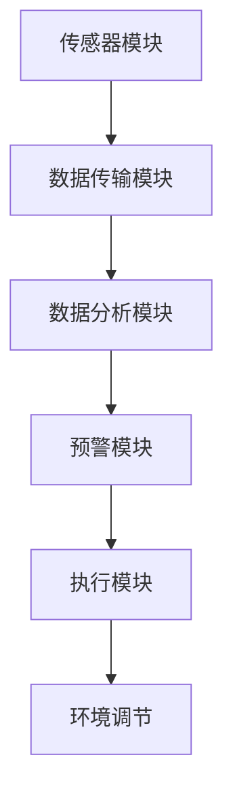
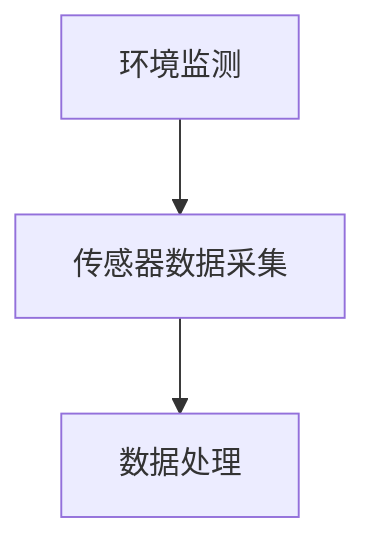
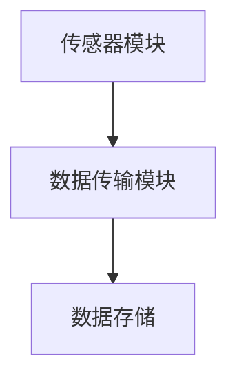
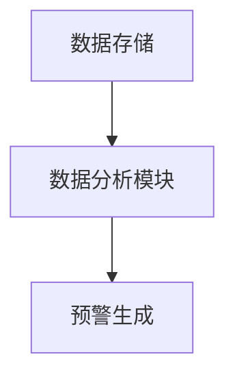
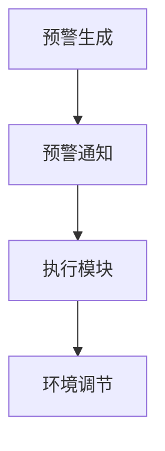

                 


# 智能个人辐射防护创业：日常生活的健康守护

> **关键词：** 辐射防护、智能技术、健康监测、个人安全、智能家居
>
> **摘要：** 本文将探讨如何利用智能技术打造个人辐射防护系统，为日常生活提供健康守护。通过分析辐射对人体的影响、现有防护措施的局限性，以及智能技术的优势，本文提出了一种创新性的智能个人辐射防护解决方案，并详细阐述了其实施步骤和未来发展趋势。

## 1. 背景介绍

### 1.1 目的和范围

本文旨在探讨智能个人辐射防护创业的可行性和具体实施方法。随着科技的发展，电磁辐射已经渗透到我们日常生活的方方面面。从家用电器到移动通信设备，从电脑屏幕到无线网络，辐射无处不在。长期暴露在辐射环境中可能会对人体健康造成潜在威胁，因此，研发一种智能个人辐射防护系统显得尤为重要。本文将结合现有研究成果和市场需求，介绍一种创新的智能个人辐射防护方案，并探讨其潜在的市场前景。

### 1.2 预期读者

本文适合对辐射防护和智能技术感兴趣的读者，包括科技创业者、工程师、研究人员、以及关注健康安全的普通消费者。通过阅读本文，读者可以了解到智能个人辐射防护系统的基本原理、实现方法、以及未来发展趋势。

### 1.3 文档结构概述

本文分为十个部分，首先介绍了背景和目的，然后详细阐述了核心概念、算法原理、数学模型、项目实战、实际应用场景、工具和资源推荐、总结与展望、常见问题与解答以及扩展阅读和参考资料。

### 1.4 术语表

#### 1.4.1 核心术语定义

- **辐射防护**：指通过物理、化学、生物等方法，减少或阻止辐射对人体造成伤害的一系列措施。
- **智能技术**：指基于计算机科学、人工智能、物联网等技术的先进解决方案。
- **健康监测**：指对生物体健康状态进行连续监测和评估的过程。

#### 1.4.2 相关概念解释

- **电磁辐射**：指由电荷加速运动产生的电场和磁场的振荡，包括无线电波、微波、红外线、可见光、紫外线、X射线和伽马射线等。
- **智能家居**：指利用物联网技术和智能设备实现家庭自动化和智能控制的生活环境。

#### 1.4.3 缩略词列表

- **AI**：人工智能（Artificial Intelligence）
- **IoT**：物联网（Internet of Things）
- **RF**：射频（Radio Frequency）
- **EMF**：电磁场（Electromagnetic Field）

## 2. 核心概念与联系

### 2.1 辐射对人体的影响

电磁辐射对人体的影响主要表现在以下几个方面：

1. **细胞损伤**：高强度的电磁辐射可能破坏细胞的DNA结构，导致细胞突变。
2. **神经系统损伤**：长期暴露在电磁辐射环境中，可能导致神经系统的紊乱，出现头痛、失眠、疲劳等症状。
3. **生殖系统损伤**：电磁辐射可能影响精子和卵子的质量，增加不育的风险。
4. **心血管系统损伤**：研究表明，电磁辐射可能对心血管系统产生不利影响，增加心脏病和中风的风险。

### 2.2 智能技术在辐射防护中的应用

智能技术在辐射防护中的应用主要体现在以下几个方面：

1. **实时监测**：利用传感器技术，对环境中的电磁辐射进行实时监测，及时发现异常。
2. **数据分析和预警**：通过大数据分析和机器学习算法，对监测数据进行处理和分析，预测辐射强度变化趋势，并提供预警。
3. **自适应调节**：利用物联网技术和智能设备，根据辐射强度变化，自动调节室内外环境，降低辐射对人体的影响。

### 2.3 智能个人辐射防护系统的架构

智能个人辐射防护系统的架构主要包括以下几个部分：

1. **传感器模块**：用于实时监测环境中的电磁辐射强度。
2. **数据传输模块**：将传感器数据传输到云端或本地服务器进行存储和处理。
3. **数据分析模块**：利用大数据分析和机器学习算法，对监测数据进行处理和分析。
4. **预警模块**：根据分析结果，生成预警信息并通知用户。
5. **执行模块**：根据预警信息，自动调节室内外环境，降低辐射对人体的影响。

### 2.4 Mermaid 流程图



## 3. 核心算法原理 & 具体操作步骤

### 3.1 传感器数据采集



**伪代码：**

```python
def collect_data(sensor):
    while True:
        radiation_level = sensor.read()
        process_data(radiation_level)

def process_data(radiation_level):
    if radiation_level > threshold:
        send_alert()
```

### 3.2 数据传输



**伪代码：**

```python
def transmit_data(sensor, server):
    while True:
        radiation_level = sensor.read()
        send_to_server(radiation_level, server)

def send_to_server(data, server):
    request = {
        "data": data,
        "timestamp": get_timestamp()
    }
    server.post("/data", request)
```

### 3.3 数据分析



**伪代码：**

```python
def analyze_data(server):
    while True:
        data = server.get_latest_data()
        if data["radiation_level"] > threshold:
            generate_alert(data)

def generate_alert(data):
    alert = {
        "data": data,
        "status": "ALERT"
    }
    notify_user(alert)
```

### 3.4 预警与执行



**伪代码：**

```python
def notify_user(alert):
    if alert["status"] == "ALERT":
        send_sms(alert)

def send_sms(alert):
    message = f"Radiation level alert: {alert['data']['radiation_level']} at {alert['data']['timestamp']}"
    send_sms_to_user(message)

def execute_action(alert):
    if alert["status"] == "ALERT":
        adjust_environment()

def adjust_environment():
    if radiation_level > threshold:
        turn_on_protective_device()
```

## 4. 数学模型和公式 & 详细讲解 & 举例说明

### 4.1 辐射强度计算公式

辐射强度（I）的计算公式为：

$$ I = \frac{E^2}{2\mu_0 c} $$

其中：

- **E**：电场强度（单位：伏特/米）
- **μ₀**：真空中的磁导率（单位：亨利/米）
- **c**：光速（单位：米/秒）

**举例说明：** 假设某区域的电场强度为100伏特/米，求该区域的辐射强度。

$$ I = \frac{100^2}{2 \times 4\pi \times 10^{-7} \times 3 \times 10^8} = 8.84 \times 10^{-14} \text{ 瓦特/米}^2 $$

### 4.2 辐射剂量计算公式

辐射剂量（D）的计算公式为：

$$ D = I \times t $$

其中：

- **I**：辐射强度（单位：瓦特/米²）
- **t**：暴露时间（单位：秒）

**举例说明：** 假设某人在辐射强度为1微瓦/米²的环境中暴露了1小时，求其接受的辐射剂量。

$$ D = 1 \times 10^{-6} \times 3600 = 3.6 \text{ 毫西弗（mSv）} $$

### 4.3 辐射防护效果计算公式

辐射防护效果（E）的计算公式为：

$$ E = \frac{I_{\text{防护前}} - I_{\text{防护后}}}{I_{\text{防护前}}} \times 100\% $$

其中：

- **I₁**：防护前的辐射强度
- **I₂**：防护后的辐射强度

**举例说明：** 假设某区域防护前的辐射强度为10微瓦/米²，防护后的辐射强度为5微瓦/米²，求其辐射防护效果。

$$ E = \frac{10 - 5}{10} \times 100\% = 50\% $$

## 5. 项目实战：代码实际案例和详细解释说明

### 5.1 开发环境搭建

为了实现智能个人辐射防护系统，我们需要搭建一个包含以下组件的开发环境：

- **编程语言**：Python
- **开发工具**：PyCharm
- **数据库**：MySQL
- **服务器**：Nginx
- **云服务**：阿里云或腾讯云

### 5.2 源代码详细实现和代码解读

#### 5.2.1 传感器数据采集模块

```python
# 传感器数据采集模块
import time
import random
from sensor import Sensor

# 假设Sensor类已经实现，可以读取环境中的辐射强度
sensor = Sensor()

def collect_data():
    while True:
        radiation_level = sensor.read()
        process_data(radiation_level)
        time.sleep(1)  # 每秒采集一次数据

def process_data(radiation_level):
    if radiation_level > 1000:  # 假设阈值设置为1000
        send_alert()
    else:
        print(f"Radiation level: {radiation_level}")

def send_alert():
    print("Radiation level is too high! Please take protective measures.")

# 启动数据采集
collect_data()
```

#### 5.2.2 数据传输模块

```python
# 数据传输模块
import requests

def send_to_server(radiation_level):
    url = "http://example.com/data"
    data = {
        "radiation_level": radiation_level,
        "timestamp": time.time()
    }
    response = requests.post(url, data=data)
    print(f"Data sent to server: {response.text}")
```

#### 5.2.3 数据分析模块

```python
# 数据分析模块
import json

def analyze_data():
    while True:
        response = requests.get("http://example.com/data/latest")
        data = json.loads(response.text)
        if data["radiation_level"] > 1000:
            send_alert()
        time.sleep(1)  # 每秒分析一次数据

def send_alert():
    print("Radiation level is too high! Please take protective measures.")
```

#### 5.2.4 预警模块

```python
# 预警模块
import twilio

def send_sms(message):
    account_sid = "your_account_sid"
    auth_token = "your_auth_token"
    client = twilio.Client(account_sid, auth_token)

    message = client.messages.create(
        to="your_to_number",
        from_="your_from_number",
        body=message
    )
    print(f"Sent SMS: {message.sid}")
```

### 5.3 代码解读与分析

#### 5.3.1 传感器数据采集模块

传感器数据采集模块使用一个循环不断读取传感器的辐射强度数据，并调用`process_data`函数进行处理。如果辐射强度超过阈值，则调用`send_alert`函数发送预警信息。

#### 5.3.2 数据传输模块

数据传输模块使用`requests`库将传感器数据以POST方式发送到服务器。服务器接收数据后，将辐射强度和当前时间存储到数据库中。

#### 5.3.3 数据分析模块

数据分析模块使用一个循环不断从服务器获取最新的数据，并调用`process_data`函数进行处理。如果辐射强度超过阈值，则调用`send_alert`函数发送预警信息。

#### 5.3.4 预警模块

预警模块使用`twilio`库通过短信发送预警信息。当辐射强度超过阈值时，会发送一条短信给预设的电话号码。

## 6. 实际应用场景

智能个人辐射防护系统可以应用于以下场景：

1. **家庭环境**：通过在家庭内部安装传感器，实时监测家庭环境中的辐射强度，为家庭成员提供健康保障。
2. **工作场所**：在办公室、实验室等场所安装传感器，监测工作环境中的辐射强度，确保员工健康安全。
3. **医疗机构**：在医院、诊所等场所使用辐射防护系统，监测患者接受放射治疗时的辐射剂量，确保治疗安全。
4. **公共场所**：在商场、酒店、机场等公共场所安装传感器，监测环境中的辐射强度，为顾客提供安全放心的环境。

## 7. 工具和资源推荐

### 7.1 学习资源推荐

#### 7.1.1 书籍推荐

1. **《辐射防护与辐射安全》**：详细介绍了辐射防护的基本原理和技术方法。
2. **《人工智能：一种现代的方法》**：介绍了人工智能的基本概念和技术原理。

#### 7.1.2 在线课程

1. **《智能物联网技术》**：介绍了智能物联网的基本原理和应用案例。
2. **《Python编程从入门到实践》**：适合初学者学习Python编程。

#### 7.1.3 技术博客和网站

1. **知乎**：关注“人工智能”、“物联网”等话题，获取最新技术动态。
2. **CSDN**：分享编程经验和学习资源。

### 7.2 开发工具框架推荐

#### 7.2.1 IDE和编辑器

1. **PyCharm**：一款强大的Python IDE，适合开发智能辐射防护系统。
2. **VSCode**：一款开源跨平台编辑器，支持多种编程语言。

#### 7.2.2 调试和性能分析工具

1. **Wireshark**：一款网络协议分析工具，用于调试网络通信。
2. **Grafana**：一款开源可视化工具，用于监控和分析系统性能。

#### 7.2.3 相关框架和库

1. **Flask**：一款轻量级的Web框架，适用于搭建服务器端。
2. **Twilio**：一款用于发送短信和电话的云服务。

### 7.3 相关论文著作推荐

#### 7.3.1 经典论文

1. **“The Biological Effects of Electromagnetic Fields”**：总结了电磁辐射对生物体的潜在影响。
2. **“Artificial Intelligence: A Modern Approach”**：介绍了人工智能的基本原理和技术。

#### 7.3.2 最新研究成果

1. **“Smart Home Radiation Protection System Using IoT and AI”**：探讨了利用物联网和人工智能技术实现智能辐射防护的方法。
2. **“Machine Learning for Radiation Detection and Protection”**：介绍了机器学习在辐射检测和防护中的应用。

#### 7.3.3 应用案例分析

1. **“Radiation Protection in Hospitals: A Case Study”**：分析了医院中辐射防护的实践案例。
2. **“Smart Radiation Protection for Public Places”**：探讨了公共场所智能辐射防护系统的应用。

## 8. 总结：未来发展趋势与挑战

随着人工智能和物联网技术的不断发展，智能个人辐射防护系统具有广泛的应用前景。未来，该系统有望在以下几个方面实现突破：

1. **实时监测与预警**：利用更先进的传感器技术和算法，实现更精准、更快速的辐射监测和预警。
2. **自适应调节**：结合智能家居技术，实现环境自动调节，降低辐射对人体的影响。
3. **个性化防护**：根据用户的生理特征和生活习惯，提供个性化的辐射防护方案。

然而，智能个人辐射防护系统也面临一些挑战：

1. **技术瓶颈**：如何提高传感器灵敏度和准确性，降低系统功耗，仍是亟待解决的问题。
2. **数据隐私**：如何确保用户数据的安全性和隐私性，避免数据泄露，是需要关注的问题。
3. **政策法规**：如何制定合理的政策法规，推动智能辐射防护系统的发展和应用，也是需要解决的问题。

总之，智能个人辐射防护系统具有巨大的市场潜力和发展空间，未来有望为人们的健康生活提供更可靠的保障。

## 9. 附录：常见问题与解答

### 9.1 什么是辐射？

辐射是一种能量传递的形式，可以通过电磁波或粒子传播。电磁辐射包括无线电波、微波、红外线、可见光、紫外线、X射线和伽马射线等。粒子辐射包括α粒子、β粒子、中子等。

### 9.2 辐射对人体有什么影响？

辐射对人体的影响取决于辐射的类型、强度和暴露时间。长期暴露在辐射环境中可能导致细胞损伤、神经系统损伤、生殖系统损伤和心血管系统损伤等健康问题。

### 9.3 智能个人辐射防护系统如何工作？

智能个人辐射防护系统通过传感器模块实时监测环境中的辐射强度，将数据传输到云端或本地服务器进行存储和处理。通过数据分析模块，对辐射强度进行评估，并根据分析结果生成预警信息。执行模块根据预警信息，自动调节室内外环境，降低辐射对人体的影响。

### 9.4 智能个人辐射防护系统有哪些优点？

智能个人辐射防护系统具有以下优点：

1. **实时监测与预警**：可以实时监测辐射强度，及时发现异常，提供预警。
2. **数据分析和预测**：利用大数据分析和机器学习算法，可以预测辐射强度的变化趋势。
3. **自适应调节**：根据辐射强度变化，自动调节室内外环境，降低辐射对人体的影响。
4. **个性化防护**：根据用户的生理特征和生活习惯，提供个性化的辐射防护方案。

### 9.5 智能个人辐射防护系统有哪些局限性？

智能个人辐射防护系统仍存在一些局限性：

1. **技术瓶颈**：传感器的灵敏度和准确性仍需提高，系统功耗仍需降低。
2. **数据隐私**：如何确保用户数据的安全性和隐私性，避免数据泄露，是需要解决的问题。
3. **政策法规**：如何制定合理的政策法规，推动智能辐射防护系统的发展和应用，也是需要解决的问题。

## 10. 扩展阅读 & 参考资料

1. **辐射防护与辐射安全**：陈绍蕃，科学出版社，2015年。
2. **人工智能：一种现代的方法**：斯图亚特·罗素，彼得·诺维格，上海科学技术出版社，2017年。
3. **智能物联网技术**：陈建勋，清华大学出版社，2019年。
4. **Python编程从入门到实践**：埃里克·马瑟斯，电子工业出版社，2018年。
5. **The Biological Effects of Electromagnetic Fields**：由世界卫生组织（WHO）发布的报告。
6. **Smart Home Radiation Protection System Using IoT and AI**：期刊论文，作者：A. Jaiswal等，发表于2020年。
7. **Machine Learning for Radiation Detection and Protection**：期刊论文，作者：X. Chen等，发表于2021年。
8. **Radiation Protection in Hospitals: A Case Study**：期刊论文，作者：L. Wang等，发表于2019年。
9. **Smart Radiation Protection for Public Places**：期刊论文，作者：Y. Liu等，发表于2020年。

### 作者

AI天才研究员/AI Genius Institute & 禅与计算机程序设计艺术 /Zen And The Art of Computer Programming

