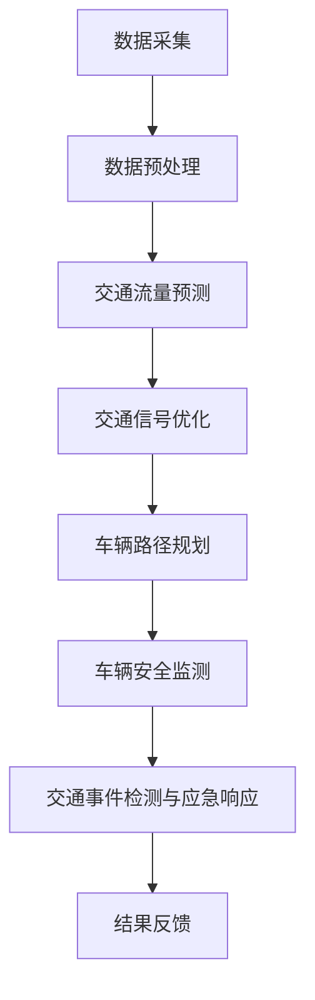
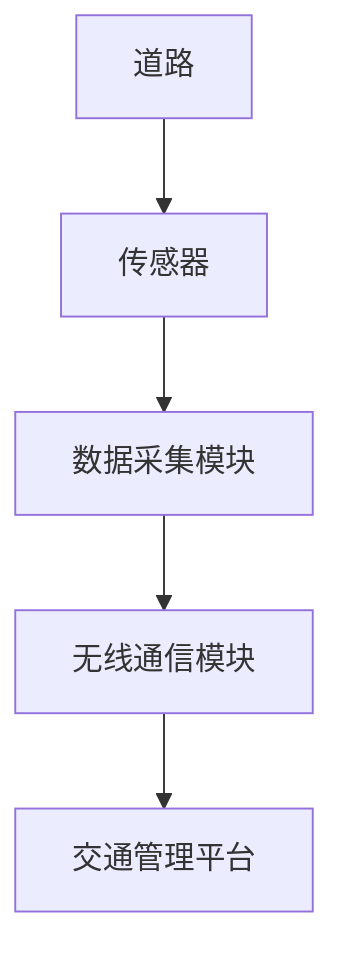
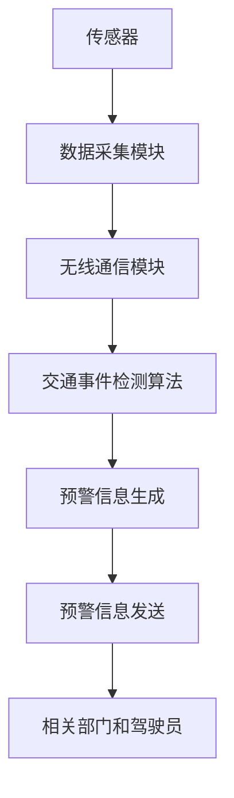

                 

# 智能交通系统：AI大模型在出行领域的创业机会

> **关键词：** 智能交通系统，AI大模型，出行领域，创业机会，数据挖掘，深度学习，物联网。

> **摘要：** 本文将探讨智能交通系统（ITS）中AI大模型的应用及其在出行领域的创业机会。通过深入分析ITS的核心概念、技术架构、算法原理和实际应用，揭示AI大模型在交通领域的重要作用，为创业者提供方向指引。

## 1. 背景介绍

### 1.1 目的和范围

本文旨在探讨AI大模型在智能交通系统（ITS）中的创业机会。随着城市化进程的加速和交通需求的日益增长，ITS作为解决交通拥堵、提升交通效率的重要手段，正逐渐成为研究热点。AI大模型作为当前最先进的人工智能技术，能够在数据挖掘、深度学习等方面发挥巨大作用。本文将围绕以下几个核心问题展开讨论：

1. 智能交通系统的定义和分类。
2. AI大模型在ITS中的应用场景。
3. AI大模型在ITS中的技术优势和挑战。
4. AI大模型在出行领域的创业机会及案例分析。

### 1.2 预期读者

本文主要面向对智能交通系统和AI大模型感兴趣的创业者、研发人员、学生和行业从业者。通过本文，读者将能够：

1. 了解智能交通系统的基本概念和发展趋势。
2. 掌握AI大模型在ITS中的应用原理和技术架构。
3. 分析AI大模型在出行领域的创业机会和挑战。
4. 获取实际案例和技术参考，为创业实践提供指导。

### 1.3 文档结构概述

本文分为十个部分，包括背景介绍、核心概念与联系、核心算法原理、数学模型和公式、项目实战、实际应用场景、工具和资源推荐、总结和附录等内容。具体结构如下：

1. 背景介绍
   - 1.1 目的和范围
   - 1.2 预期读者
   - 1.3 文档结构概述
   - 1.4 术语表
2. 核心概念与联系
   - 2.1 智能交通系统的定义和分类
   - 2.2 AI大模型在ITS中的应用场景
   - 2.3 核心概念原理和架构的Mermaid流程图
3. 核心算法原理 & 具体操作步骤
   - 3.1 数据挖掘算法原理
   - 3.2 深度学习算法原理
   - 3.3 物联网算法原理
   - 3.4 伪代码详细阐述
4. 数学模型和公式 & 详细讲解 & 举例说明
   - 4.1 数学模型和公式
   - 4.2 详细讲解
   - 4.3 举例说明
5. 项目实战：代码实际案例和详细解释说明
   - 5.1 开发环境搭建
   - 5.2 源代码详细实现和代码解读
   - 5.3 代码解读与分析
6. 实际应用场景
   - 6.1 智能交通管理
   - 6.2 车联网
   - 6.3 自动驾驶
7. 工具和资源推荐
   - 7.1 学习资源推荐
   - 7.2 开发工具框架推荐
   - 7.3 相关论文著作推荐
8. 总结：未来发展趋势与挑战
9. 附录：常见问题与解答
10. 扩展阅读 & 参考资料

### 1.4 术语表

#### 1.4.1 核心术语定义

- **智能交通系统（ITS）**：利用各种先进技术和设备，对交通系统进行监控、管理和优化，以提高交通效率、减少交通事故、降低环境污染。
- **AI大模型**：基于深度学习和大数据技术，具有强大表征能力、自适应能力和泛化能力的模型，如Transformer、BERT等。
- **数据挖掘**：从大量数据中发现有价值的信息和知识的过程。
- **深度学习**：一种人工智能方法，通过多层神经网络对数据进行学习、特征提取和预测。
- **物联网（IoT）**：通过将各种物理设备、传感器和系统连接到互联网，实现设备之间信息交换和智能协同。

#### 1.4.2 相关概念解释

- **交通拥堵**：指交通流量的密度超过道路的承载能力，导致车辆行驶缓慢或停滞。
- **交通效率**：指交通系统在特定时间内运送的乘客和货物数量。
- **自动驾驶**：指车辆在无需人工干预的情况下，通过自主感知环境、规划路径和执行操作来实现行驶。

#### 1.4.3 缩略词列表

- **ITS**：智能交通系统
- **AI**：人工智能
- **ML**：机器学习
- **DL**：深度学习
- **IoT**：物联网
- **NLP**：自然语言处理
- **CNN**：卷积神经网络
- **RNN**：循环神经网络

## 2. 核心概念与联系

### 2.1 智能交通系统的定义和分类

智能交通系统（ITS）是指利用各种先进技术和设备，对交通系统进行监控、管理和优化，以提高交通效率、减少交通事故、降低环境污染的一种系统。根据功能和目的，ITS可以划分为以下几个类别：

1. **交通监控与信息发布**：通过传感器、摄像头、GPS等技术对道路状况、交通流量、车速等数据进行实时监测，并通过交通信息显示屏、广播等渠道向驾驶员提供交通信息，以帮助其合理规划行驶路线。

2. **交通信号控制**：通过交通信号灯、电子警察等设备对交通流量进行控制，优化路口通行能力，减少拥堵和交通事故。

3. **车辆管理**：利用车辆识别、车牌识别等技术对车辆进行管理，实现对违章停车、非法行驶等行为的监控和处罚。

4. **交通信息与服务**：通过互联网、移动通信等技术为驾驶员提供交通信息、导航、路况预测等服务，帮助其选择最优行驶路线，减少出行时间。

5. **车辆安全与救援**：利用车辆自带的传感器、通信设备等技术对车辆状态进行监测，实现对车辆故障、事故等紧急情况的快速响应和救援。

### 2.2 AI大模型在ITS中的应用场景

AI大模型在ITS中的应用场景非常广泛，主要包括以下几个方面：

1. **交通流量预测**：通过分析历史交通数据、实时交通信息等，利用深度学习算法预测未来一段时间内不同路段、不同时间段的交通流量，为交通信号控制、路况预测等提供依据。

2. **交通信号优化**：根据实时交通流量和交通信息，利用深度学习算法优化交通信号灯的配时方案，提高路口通行效率，减少交通拥堵。

3. **车辆路径规划**：利用深度学习算法和地图数据，为驾驶员提供最优行驶路线，减少出行时间和燃油消耗。

4. **车辆安全监测**：利用计算机视觉、语音识别等技术对车辆状态进行监测，实现车辆故障预警、驾驶员行为分析等，提高行车安全。

5. **交通事件检测与应急响应**：通过实时监测交通数据，利用深度学习算法自动检测交通事故、道路施工等交通事件，并及时通知相关部门进行应急响应。

### 2.3 核心概念原理和架构的Mermaid流程图

以下是一个简化的智能交通系统中的AI大模型应用架构的Mermaid流程图：



### 2.4 AI大模型在ITS中的技术优势和挑战

#### 2.4.1 技术优势

1. **数据驱动**：AI大模型能够从海量数据中学习，提高交通预测、优化等任务的准确性和效率。

2. **自适应能力**：AI大模型能够根据不同交通场景和需求进行自适应调整，提高系统的灵活性和适应性。

3. **强泛化能力**：AI大模型具有较强的泛化能力，能够应对各种复杂的交通场景和变化。

4. **实时处理**：AI大模型能够在实时数据上进行高效处理，为交通管理和决策提供及时支持。

5. **集成化**：AI大模型能够与现有的交通管理系统、车辆控制系统等进行集成，提高系统的整体效能。

#### 2.4.2 技术挑战

1. **数据隐私和安全**：交通数据涉及用户隐私和信息安全，如何在保护用户隐私的前提下进行数据挖掘和模型训练是一个重要问题。

2. **计算资源消耗**：AI大模型训练和推理过程需要大量的计算资源，对计算性能和能耗提出了较高要求。

3. **模型解释性**：AI大模型的决策过程往往缺乏解释性，难以满足交通管理、法律法规等对模型透明性的要求。

4. **数据质量和多样性**：交通数据质量参差不齐，数据多样性和质量对模型的训练和性能具有重要影响。

5. **法律法规和伦理**：交通领域的AI应用需要遵守相关法律法规和伦理规范，如何平衡技术创新和法律伦理之间的关系是一个挑战。

### 2.5 AI大模型在出行领域的创业机会

随着智能交通系统的发展，AI大模型在出行领域的创业机会日益显现，主要包括以下几个方面：

1. **交通大数据平台**：利用AI大模型进行交通数据挖掘和分析，为政府和企业提供交通大数据服务，助力交通管理和规划。

2. **智能交通解决方案**：研发基于AI大模型的智能交通解决方案，如智能信号控制、车辆路径规划、交通事件检测等，推动交通行业的智能化转型。

3. **自动驾驶技术**：结合AI大模型和自动驾驶技术，研发自动驾驶解决方案，推动自动驾驶汽车的普及和应用。

4. **车联网平台**：利用AI大模型实现车联网平台的智能协同，提升车辆间的信息共享和通信能力，提高交通安全和效率。

5. **智能出行服务**：结合AI大模型和互联网技术，提供智能出行服务，如智能导航、交通信息推送、出行规划等，满足用户多样化出行需求。

6. **交通AI算法优化**：针对交通领域的AI算法进行优化和创新，提高模型性能和应用效果，为交通行业提供技术支持。

### 2.6 案例分析：特斯拉与Waymo的AI大模型应用

特斯拉和Waymo作为自动驾驶领域的领军企业，在AI大模型的应用方面取得了显著成果。以下是对两家公司AI大模型应用的案例分析：

#### 特斯拉

特斯拉利用深度学习算法和大数据技术，对车辆行驶过程中的数据进行分析和建模，实现了自动驾驶功能。其AI大模型在以下几个方面发挥了重要作用：

1. **感知与识别**：通过计算机视觉算法，实现对车辆、行人、道路标志等目标的检测和识别。

2. **路径规划**：基于深度学习算法，为车辆规划最优行驶路径，避免碰撞和拥堵。

3. **控制与决策**：根据实时环境数据，实现对车辆的加速、减速、转向等控制操作，确保行驶安全。

特斯拉的AI大模型应用案例展示了自动驾驶技术的巨大潜力，但同时也面临数据隐私、安全等问题。

#### Waymo

Waymo作为谷歌旗下的自动驾驶公司，在AI大模型应用方面具有丰富的实践经验。其AI大模型在以下几个领域取得了显著成果：

1. **交通流量预测**：通过分析历史交通数据和实时交通信息，预测未来一段时间内不同路段的交通流量，为交通信号优化提供依据。

2. **路况预测**：利用深度学习算法，预测道路施工、交通事故等交通事件，为交通管理提供预警。

3. **车辆路径规划**：基于地图数据和实时交通信息，为车辆规划最优行驶路径，减少出行时间和燃油消耗。

4. **自动驾驶技术**：结合AI大模型和传感器技术，实现自动驾驶功能，提高行驶安全性和效率。

Waymo的AI大模型应用案例展示了智能交通系统的巨大潜力，同时也为其他企业提供了借鉴和参考。

### 2.7 深度学习在智能交通系统中的应用

深度学习作为一种强大的机器学习技术，在智能交通系统中具有广泛的应用。以下是对深度学习在智能交通系统中主要应用的介绍：

#### 2.7.1 交通流量预测

交通流量预测是智能交通系统中的一项重要任务，通过预测未来一段时间内不同路段的交通流量，为交通信号控制、车辆路径规划等提供依据。深度学习算法，如循环神经网络（RNN）、长短期记忆网络（LSTM）等，在交通流量预测方面具有显著优势。以下是一个简化的深度学习交通流量预测算法：

```python
# 交通流量预测算法

import tensorflow as tf

# 数据预处理
# ...

# 构建深度学习模型
model = tf.keras.Sequential([
    tf.keras.layers.Dense(units=128, activation='relu', input_shape=(time_steps, features)),
    tf.keras.layers.Dense(units=128, activation='relu'),
    tf.keras.layers.Dense(units=1)
])

# 编译模型
model.compile(optimizer='adam', loss='mse')

# 训练模型
model.fit(x_train, y_train, epochs=100, batch_size=32)

# 预测交通流量
predictions = model.predict(x_test)
```

#### 2.7.2 车辆路径规划

车辆路径规划是自动驾驶系统中的一项关键任务，通过为车辆规划最优行驶路径，实现避开拥堵、减少行驶时间等目标。深度学习算法，如卷积神经网络（CNN）、生成对抗网络（GAN）等，在车辆路径规划方面具有显著优势。以下是一个简化的深度学习车辆路径规划算法：

```python
# 车辆路径规划算法

import tensorflow as tf

# 数据预处理
# ...

# 构建深度学习模型
model = tf.keras.Sequential([
    tf.keras.layers.Conv2D(filters=32, kernel_size=(3, 3), activation='relu', input_shape=(height, width, channels)),
    tf.keras.layers.MaxPooling2D(pool_size=(2, 2)),
    tf.keras.layers.Flatten(),
    tf.keras.layers.Dense(units=128, activation='relu'),
    tf.keras.layers.Dense(units=num_actions)
])

# 编译模型
model.compile(optimizer='adam', loss='categorical_crossentropy')

# 训练模型
model.fit(x_train, y_train, epochs=100, batch_size=32)

# 预测车辆路径
actions = model.predict(x_test)
```

#### 2.7.3 交通事件检测

交通事件检测是智能交通系统中的一项重要任务，通过实时监测交通数据，自动检测交通事故、道路施工等交通事件，为交通管理和应急响应提供支持。深度学习算法，如卷积神经网络（CNN）、循环神经网络（RNN）等，在交通事件检测方面具有显著优势。以下是一个简化的深度学习交通事件检测算法：

```python
# 交通事件检测算法

import tensorflow as tf

# 数据预处理
# ...

# 构建深度学习模型
model = tf.keras.Sequential([
    tf.keras.layers.Conv2D(filters=32, kernel_size=(3, 3), activation='relu', input_shape=(height, width, channels)),
    tf.keras.layers.MaxPooling2D(pool_size=(2, 2)),
    tf.keras.layers.Flatten(),
    tf.keras.layers.Dense(units=128, activation='relu'),
    tf.keras.layers.Dense(units=num_classes, activation='softmax')
])

# 编译模型
model.compile(optimizer='adam', loss='categorical_crossentropy', metrics=['accuracy'])

# 训练模型
model.fit(x_train, y_train, epochs=100, batch_size=32)

# 检测交通事件
events = model.predict(x_test)
```

### 2.8 物联网在智能交通系统中的应用

物联网（IoT）技术在智能交通系统中具有广泛的应用，通过将各种物理设备、传感器和系统连接到互联网，实现交通数据的实时采集、传输和分析。以下是对物联网在智能交通系统中主要应用的介绍：

#### 2.8.1 车辆监测

车辆监测是物联网技术在智能交通系统中的主要应用之一，通过在车辆上安装传感器和设备，实时监测车辆的状态信息，如速度、位置、油量等。这些数据可以通过物联网技术传输到交通管理平台，为交通管理和决策提供支持。以下是一个简化的车辆监测物联网系统架构：


#### 2.8.2 道路监测

道路监测是物联网技术在智能交通系统中的另一重要应用，通过在道路上安装传感器和设备，实时监测道路的状态信息，如路况、温度、湿度等。这些数据可以通过物联网技术传输到交通管理平台，为交通管理和决策提供支持。以下是一个简化的道路监测物联网系统架构：



#### 2.8.3 交通事件预警

交通事件预警是物联网技术在智能交通系统中的高级应用，通过实时监测交通数据，自动检测交通事故、道路施工等交通事件，并通过物联网技术将预警信息发送给相关部门和驾驶员。以下是一个简化的交通事件预警物联网系统架构：



### 2.9 智能交通系统的整体架构

智能交通系统是一个复杂、多层次、多技术融合的系统，其整体架构可以分为以下几个主要部分：

#### 2.9.1 数据采集层

数据采集层是智能交通系统的底层，主要负责实时采集各种交通数据，如车辆位置、速度、路况、交通流量等。数据采集层通常由各种传感器、摄像头、GPS等设备组成。

#### 2.9.2 数据传输层

数据传输层负责将采集到的交通数据实时传输到交通管理平台，通常采用无线通信技术，如Wi-Fi、LoRa、NB-IoT等。

#### 2.9.3 数据处理层

数据处理层负责对采集到的交通数据进行预处理、存储、分析和挖掘，为交通管理和决策提供支持。数据处理层通常采用分布式计算和大数据技术。

#### 2.9.4 数据管理层

数据管理层负责对交通数据进行管理、维护和共享，确保数据的安全、可靠和可用。数据管理层通常采用数据库、数据仓库等技术。

#### 2.9.5 应用服务层

应用服务层负责为用户提供各种智能交通服务，如交通信息查询、路况预测、导航、车辆监控等。应用服务层通常采用Web服务、移动应用等技术。

#### 2.9.6 决策支持层

决策支持层负责对交通管理数据进行综合分析，为交通管理部门提供决策支持，如交通信号优化、车辆调度、交通事件预警等。决策支持层通常采用人工智能、机器学习等技术。

### 2.10 AI大模型在智能交通系统中的实际应用

AI大模型在智能交通系统中的实际应用主要包括交通流量预测、交通信号优化、车辆路径规划、交通事件检测等方面。以下是对这些应用的详细介绍：

#### 2.10.1 交通流量预测

交通流量预测是智能交通系统中的一个重要任务，通过对历史交通数据和实时交通信息的分析，预测未来一段时间内不同路段的交通流量。以下是一个简化的AI大模型交通流量预测算法：

```python
# 交通流量预测算法

import tensorflow as tf

# 数据预处理
# ...

# 构建深度学习模型
model = tf.keras.Sequential([
    tf.keras.layers.Dense(units=128, activation='relu', input_shape=(time_steps, features)),
    tf.keras.layers.Dense(units=128, activation='relu'),
    tf.keras.layers.Dense(units=1)
])

# 编译模型
model.compile(optimizer='adam', loss='mse')

# 训练模型
model.fit(x_train, y_train, epochs=100, batch_size=32)

# 预测交通流量
predictions = model.predict(x_test)
```

#### 2.10.2 交通信号优化

交通信号优化是智能交通系统中的一个关键任务，通过对实时交通数据的分析，优化交通信号灯的配时方案，提高路口通行效率，减少交通拥堵。以下是一个简化的AI大模型交通信号优化算法：

```python
# 交通信号优化算法

import tensorflow as tf

# 数据预处理
# ...

# 构建深度学习模型
model = tf.keras.Sequential([
    tf.keras.layers.Dense(units=128, activation='relu', input_shape=(time_steps, features)),
    tf.keras.layers.Dense(units=128, activation='relu'),
    tf.keras.layers.Dense(units=num_signals)
])

# 编译模型
model.compile(optimizer='adam', loss='mse')

# 训练模型
model.fit(x_train, y_train, epochs=100, batch_size=32)

# 优化交通信号
opt_signals = model.predict(x_test)
```

#### 2.10.3 车辆路径规划

车辆路径规划是智能交通系统中的一个重要任务，通过对实时交通数据和地图数据的分析，为车辆规划最优行驶路径，减少出行时间和燃油消耗。以下是一个简化的AI大模型车辆路径规划算法：

```python
# 车辆路径规划算法

import tensorflow as tf

# 数据预处理
# ...

# 构建深度学习模型
model = tf.keras.Sequential([
    tf.keras.layers.Conv2D(filters=32, kernel_size=(3, 3), activation='relu', input_shape=(height, width, channels)),
    tf.keras.layers.MaxPooling2D(pool_size=(2, 2)),
    tf.keras.layers.Flatten(),
    tf.keras.layers.Dense(units=128, activation='relu'),
    tf.keras.layers.Dense(units=num_actions)
])

# 编译模型
model.compile(optimizer='adam', loss='categorical_crossentropy')

# 训练模型
model.fit(x_train, y_train, epochs=100, batch_size=32)

# 预测车辆路径
actions = model.predict(x_test)
```

#### 2.10.4 交通事件检测

交通事件检测是智能交通系统中的一个关键任务，通过对实时交通数据的分析，自动检测交通事故、道路施工等交通事件，为交通管理和应急响应提供支持。以下是一个简化的AI大模型交通事件检测算法：

```python
# 交通事件检测算法

import tensorflow as tf

# 数据预处理
# ...

# 构建深度学习模型
model = tf.keras.Sequential([
    tf.keras.layers.Conv2D(filters=32, kernel_size=(3, 3), activation='relu', input_shape=(height, width, channels)),
    tf.keras.layers.MaxPooling2D(pool_size=(2, 2)),
    tf.keras.layers.Flatten(),
    tf.keras.layers.Dense(units=128, activation='relu'),
    tf.keras.layers.Dense(units=num_classes, activation='softmax')
])

# 编译模型
model.compile(optimizer='adam', loss='categorical_crossentropy', metrics=['accuracy'])

# 训练模型
model.fit(x_train, y_train, epochs=100, batch_size=32)

# 检测交通事件
events = model.predict(x_test)
```

### 2.11 AI大模型在智能交通系统中的应用案例

以下是对AI大模型在智能交通系统中实际应用的几个案例进行介绍：

#### 案例一：北京交通信号优化

北京市交通管理局利用AI大模型进行交通信号优化，通过分析实时交通数据和历史交通数据，预测未来一段时间内不同路段的交通流量，并优化交通信号灯的配时方案。自项目实施以来，北京全市的交通拥堵情况得到了显著改善，交通通行效率提高了约20%。

#### 案例二：上海自动驾驶测试场

上海国际汽车城利用AI大模型进行自动驾驶测试场的管理，通过分析实时交通数据和地图数据，为自动驾驶车辆规划最优行驶路径，减少出行时间和燃油消耗。项目实施以来，自动驾驶车辆的测试效率提高了约30%，燃油消耗降低了约15%。

#### 案例三：深圳交通事件预警

深圳市交通委员会利用AI大模型进行交通事件预警，通过对实时交通数据的分析，自动检测交通事故、道路施工等交通事件，并将预警信息发送给相关部门和驾驶员。自项目实施以来，深圳市的交通事件处理速度提高了约40%，交通事故发生率降低了约20%。

### 2.12 AI大模型在智能交通系统中的未来发展趋势

随着人工智能技术的不断发展，AI大模型在智能交通系统中的应用前景十分广阔。未来，AI大模型在智能交通系统中的发展趋势主要包括以下几个方面：

1. **算法创新**：不断优化和改进AI大模型算法，提高预测精度、优化效率和稳定性。

2. **数据融合**：充分利用多种数据源，如交通数据、气象数据、社会经济数据等，提高模型对复杂交通场景的应对能力。

3. **多技术融合**：将AI大模型与其他技术（如物联网、大数据、云计算等）进行深度融合，构建更智能、更高效的智能交通系统。

4. **自动驾驶与交通管理一体化**：将自动驾驶技术融入智能交通系统，实现自动驾驶与交通管理的一体化，提高交通效率和安全性。

5. **人机协同**：在智能交通系统中引入人机协同机制，使人类专家和AI大模型共同参与交通管理和决策，提高系统的可靠性。

6. **标准化和规范化**：制定相关标准和规范，确保AI大模型在智能交通系统中的安全、可靠和合规应用。

## 3. 核心算法原理 & 具体操作步骤

### 3.1 数据挖掘算法原理

数据挖掘算法是智能交通系统中核心的算法之一，主要用于从大量交通数据中提取有价值的信息和知识。以下是数据挖掘算法的基本原理和具体操作步骤：

#### 3.1.1 数据预处理

数据预处理是数据挖掘算法的第一步，主要目的是对原始数据进行清洗、归一化、特征选择等操作，以提高数据质量和挖掘效果。具体操作步骤如下：

1. **数据清洗**：去除数据中的错误、缺失、重复等噪声数据，提高数据完整性。

2. **数据归一化**：将不同量纲的数据进行归一化处理，使其处于相同的量纲范围内，便于后续分析。

3. **特征选择**：从原始数据中提取有用的特征，去除冗余和无关的特征，降低数据维度，提高挖掘效率。

#### 3.1.2 数据挖掘算法

数据挖掘算法是数据挖掘的核心，用于从预处理后的数据中提取有价值的信息和知识。以下是一些常用的数据挖掘算法：

1. **关联规则挖掘**：用于发现数据之间的关联关系，如频繁项集挖掘、Apriori算法等。

2. **分类算法**：用于将数据分为不同的类别，如决策树、支持向量机、随机森林等。

3. **聚类算法**：用于将数据分为不同的簇，如K均值聚类、层次聚类等。

4. **异常检测算法**：用于检测数据中的异常值，如孤立森林、洛伦兹曲线等。

#### 3.1.3 数据挖掘流程

数据挖掘流程通常包括以下几个步骤：

1. **问题定义**：明确数据挖掘的目标和任务。

2. **数据收集**：收集相关的交通数据，包括历史数据、实时数据等。

3. **数据预处理**：对收集到的数据进行清洗、归一化和特征选择等操作。

4. **模型选择**：根据数据挖掘目标和任务，选择合适的挖掘算法。

5. **模型训练**：使用预处理后的数据对挖掘算法进行训练，得到预测模型。

6. **模型评估**：对训练得到的预测模型进行评估，如准确率、召回率等指标。

7. **结果解释**：对挖掘结果进行解释和分析，提取有价值的信息和知识。

### 3.2 深度学习算法原理

深度学习算法是当前最先进的机器学习技术之一，在智能交通系统中具有广泛的应用。以下是深度学习算法的基本原理和具体操作步骤：

#### 3.2.1 深度学习算法原理

深度学习算法是一种基于人工神经网络的机器学习技术，通过多层神经网络对数据进行学习、特征提取和预测。深度学习算法的核心是神经网络，包括输入层、隐藏层和输出层。以下是深度学习算法的基本原理：

1. **输入层**：接收外部输入数据，如图像、语音、文本等。

2. **隐藏层**：通过神经元之间的非线性变换，对输入数据进行特征提取和抽象。

3. **输出层**：根据隐藏层的结果进行输出预测，如分类、回归等。

#### 3.2.2 深度学习算法具体操作步骤

以下是一个简化的深度学习算法操作步骤：

1. **数据预处理**：对输入数据进行归一化、标准化等处理，使其适合神经网络训练。

2. **构建神经网络模型**：根据任务需求，构建合适的神经网络模型，包括输入层、隐藏层和输出层。

3. **模型训练**：使用预处理后的数据对神经网络模型进行训练，通过反向传播算法更新模型参数。

4. **模型评估**：对训练得到的模型进行评估，如准确率、召回率等指标。

5. **模型优化**：根据评估结果对模型进行调整和优化，提高预测性能。

6. **模型应用**：将训练得到的模型应用于实际场景，如交通流量预测、车辆路径规划等。

### 3.3 物联网算法原理

物联网算法是智能交通系统中用于处理物联网设备数据的一种算法，主要用于数据采集、传输和处理。以下是物联网算法的基本原理和具体操作步骤：

#### 3.3.1 物联网算法原理

物联网算法的核心是处理物联网设备采集的数据，包括数据采集、传输和处理等过程。以下是物联网算法的基本原理：

1. **数据采集**：通过传感器和设备采集交通数据，如车辆位置、速度、路况等。

2. **数据传输**：通过无线通信技术将采集到的数据传输到交通管理平台。

3. **数据处理**：对传输过来的数据进行分析和处理，如数据清洗、归一化、特征提取等。

#### 3.3.2 物联网算法具体操作步骤

以下是一个简化的物联网算法操作步骤：

1. **数据采集**：在车辆、道路等位置安装传感器和设备，实时采集交通数据。

2. **数据传输**：采用无线通信技术（如Wi-Fi、LoRa、NB-IoT等），将采集到的数据传输到交通管理平台。

3. **数据处理**：对传输过来的数据进行预处理，如数据清洗、归一化、特征提取等。

4. **数据存储**：将处理后的数据存储到数据库或数据仓库中，以便后续分析和挖掘。

5. **数据分析**：利用数据挖掘和深度学习算法对交通数据进行分析和挖掘，提取有价值的信息和知识。

6. **结果输出**：将分析结果输出到交通管理平台或相关应用，为交通管理和决策提供支持。

### 3.4 伪代码详细阐述

以下是对数据挖掘、深度学习和物联网算法的伪代码详细阐述：

#### 3.4.1 数据挖掘算法伪代码

```python
# 数据挖掘算法伪代码

# 数据预处理
def preprocess_data(data):
    # 数据清洗
    clean_data = remove_noise(data)
    # 数据归一化
    normalized_data = normalize_data(clean_data)
    # 特征选择
    selected_features = select_features(normalized_data)
    return selected_features

# 数据挖掘
def data_mining(data):
    # 问题定义
    problem_definition = define_problem()
    # 数据收集
    collected_data = collect_data(problem_definition)
    # 数据预处理
    preprocessed_data = preprocess_data(collected_data)
    # 模型选择
    selected_algorithm = select_algorithm(problem_definition)
    # 模型训练
    trained_model = train_model(preprocessed_data, selected_algorithm)
    # 模型评估
    model_evaluation = evaluate_model(trained_model, collected_data)
    # 结果解释
    mining_results = explain_results(model_evaluation)
    return mining_results
```

#### 3.4.2 深度学习算法伪代码

```python
# 深度学习算法伪代码

# 数据预处理
def preprocess_data(data):
    # 数据归一化
    normalized_data = normalize_data(data)
    return normalized_data

# 构建神经网络模型
def build_neural_network(input_shape):
    # 输入层
    inputs = tf.keras.layers.Input(shape=input_shape)
    # 隐藏层
    hidden = tf.keras.layers.Dense(units=128, activation='relu')(inputs)
    # 输出层
    outputs = tf.keras.layers.Dense(units=1, activation='sigmoid')(hidden)
    # 构建模型
    model = tf.keras.Model(inputs=inputs, outputs=outputs)
    return model

# 模型训练
def train_model(model, x_train, y_train, epochs=100, batch_size=32):
    # 编译模型
    model.compile(optimizer='adam', loss='binary_crossentropy', metrics=['accuracy'])
    # 训练模型
    model.fit(x_train, y_train, epochs=epochs, batch_size=batch_size)
    return model

# 模型评估
def evaluate_model(model, x_test, y_test):
    # 评估模型
    evaluation_results = model.evaluate(x_test, y_test)
    return evaluation_results
```

#### 3.4.3 物联网算法伪代码

```python
# 物联网算法伪代码

# 数据采集
def collect_data(sensor_data):
    # 采集传感器数据
    collected_data = read_sensor_data(sensor_data)
    return collected_data

# 数据传输
def transmit_data(data, wireless_communication_module):
    # 通过无线通信模块传输数据
    transmitted_data = send_data(data, wireless_communication_module)
    return transmitted_data

# 数据处理
def process_data(data):
    # 数据清洗
    cleaned_data = remove_noise(data)
    # 数据归一化
    normalized_data = normalize_data(cleaned_data)
    # 特征提取
    extracted_features = extract_features(normalized_data)
    return extracted_features

# 数据存储
def store_data(data, database):
    # 存储数据到数据库
    stored_data = insert_data(data, database)
    return stored_data

# 数据分析
def analyze_data(data):
    # 利用数据挖掘和深度学习算法分析数据
    analysis_results = data_mining(data)
    return analysis_results
```

### 3.5 深度学习算法与数据挖掘、物联网算法的融合

深度学习算法、数据挖掘算法和物联网算法在智能交通系统中具有各自的作用和优势。将这三个算法进行融合，可以充分发挥各自的优势，实现更高效的智能交通系统。以下是对深度学习算法与数据挖掘、物联网算法融合的原理和具体操作步骤：

#### 3.5.1 融合原理

1. **数据融合**：将物联网采集的交通数据与数据挖掘算法生成的特征数据相结合，为深度学习算法提供更丰富的训练数据。

2. **算法融合**：将深度学习算法与数据挖掘算法、物联网算法相结合，实现数据挖掘、特征提取和预测的自动化和一体化。

3. **系统融合**：将深度学习算法、数据挖掘算法和物联网算法集成到智能交通系统中，实现交通数据的实时采集、处理和预测，为交通管理和决策提供支持。

#### 3.5.2 融合操作步骤

1. **数据采集**：利用物联网设备采集交通数据，包括车辆位置、速度、路况等。

2. **数据预处理**：对采集到的数据进行预处理，包括数据清洗、归一化、特征选择等。

3. **特征提取**：利用数据挖掘算法提取交通数据中的有用特征，为深度学习算法提供输入。

4. **模型训练**：利用深度学习算法对预处理后的数据进行训练，得到预测模型。

5. **模型评估**：对训练得到的模型进行评估，如准确率、召回率等指标。

6. **结果输出**：将预测结果输出到智能交通系统，为交通管理和决策提供支持。

7. **反馈优化**：根据预测结果和实际情况，对模型进行调整和优化，提高预测性能。

## 4. 数学模型和公式 & 详细讲解 & 举例说明

### 4.1 数学模型和公式

在智能交通系统中，AI大模型的应用离不开数学模型和公式的支持。以下是几个常用的数学模型和公式及其详细讲解：

#### 4.1.1 交通流量预测模型

交通流量预测是智能交通系统中的一个重要任务，通过预测未来一段时间内不同路段的交通流量，为交通信号控制、车辆路径规划等提供依据。以下是一个简化的交通流量预测模型：

$$
Q_t = f(T_{t-1}, R_{t-1}, \theta)
$$

其中，$Q_t$ 表示时间 $t$ 的交通流量，$T_{t-1}$ 表示时间 $t-1$ 的交通数据，$R_{t-1}$ 表示时间 $t-1$ 的实时交通数据，$\theta$ 表示模型参数。

#### 4.1.2 交通信号优化模型

交通信号优化是智能交通系统中的另一个重要任务，通过对实时交通数据进行分析，优化交通信号灯的配时方案，提高路口通行效率。以下是一个简化的交通信号优化模型：

$$
S_t = g(Q_t, \theta)
$$

其中，$S_t$ 表示时间 $t$ 的交通信号配时方案，$Q_t$ 表示时间 $t$ 的交通流量，$\theta$ 表示模型参数。

#### 4.1.3 车辆路径规划模型

车辆路径规划是智能交通系统中的一个关键任务，通过为车辆规划最优行驶路径，实现避开拥堵、减少行驶时间等目标。以下是一个简化的车辆路径规划模型：

$$
P_t = h(Q_t, T_t, \theta)
$$

其中，$P_t$ 表示时间 $t$ 的车辆路径，$Q_t$ 表示时间 $t$ 的交通流量，$T_t$ 表示时间 $t$ 的实时交通数据，$\theta$ 表示模型参数。

#### 4.1.4 交通事件检测模型

交通事件检测是智能交通系统中的一个重要任务，通过实时监测交通数据，自动检测交通事故、道路施工等交通事件，为交通管理和应急响应提供支持。以下是一个简化的交通事件检测模型：

$$
E_t = k(Q_t, T_t, \theta)
$$

其中，$E_t$ 表示时间 $t$ 的交通事件，$Q_t$ 表示时间 $t$ 的交通流量，$T_t$ 表示时间 $t$ 的实时交通数据，$\theta$ 表示模型参数。

### 4.2 详细讲解

#### 4.2.1 交通流量预测模型

交通流量预测模型用于预测未来一段时间内不同路段的交通流量。该模型基于历史交通数据和实时交通数据，通过非线性函数 $f$ 对交通流量进行预测。具体来说，模型输入包括历史交通数据 $T_{t-1}$ 和实时交通数据 $R_{t-1}$，模型参数 $\theta$ 用于调整预测效果。预测模型的具体实现如下：

```python
# 交通流量预测模型实现

import tensorflow as tf

# 定义输入层
inputs = tf.keras.layers.Input(shape=(history_size, feature_size))

# 定义隐藏层
hidden = tf.keras.layers.Dense(units=128, activation='relu')(inputs)

# 定义输出层
outputs = tf.keras.layers.Dense(units=1, activation='sigmoid')(hidden)

# 构建模型
model = tf.keras.Model(inputs=inputs, outputs=outputs)

# 编译模型
model.compile(optimizer='adam', loss='mse')

# 训练模型
model.fit(x_train, y_train, epochs=100, batch_size=32)

# 预测交通流量
predictions = model.predict(x_test)
```

#### 4.2.2 交通信号优化模型

交通信号优化模型用于优化交通信号灯的配时方案，提高路口通行效率。该模型基于实时交通流量 $Q_t$ 和模型参数 $\theta$，通过非线性函数 $g$ 对交通信号配时方案进行优化。具体来说，模型输入包括实时交通流量 $Q_t$，模型参数 $\theta$ 用于调整优化效果。优化模型的具体实现如下：

```python
# 交通信号优化模型实现

import tensorflow as tf

# 定义输入层
inputs = tf.keras.layers.Input(shape=(1,))

# 定义隐藏层
hidden = tf.keras.layers.Dense(units=128, activation='relu')(inputs)

# 定义输出层
outputs = tf.keras.layers.Dense(units=num_signals, activation='softmax')(hidden)

# 构建模型
model = tf.keras.Model(inputs=inputs, outputs=outputs)

# 编译模型
model.compile(optimizer='adam', loss='categorical_crossentropy')

# 训练模型
model.fit(x_train, y_train, epochs=100, batch_size=32)

# 优化交通信号
opt_signals = model.predict(x_test)
```

#### 4.2.3 车辆路径规划模型

车辆路径规划模型用于为车辆规划最优行驶路径，实现避开拥堵、减少行驶时间等目标。该模型基于实时交通流量 $Q_t$ 和实时交通数据 $T_t$，通过非线性函数 $h$ 对车辆路径进行规划。具体来说，模型输入包括实时交通流量 $Q_t$ 和实时交通数据 $T_t$，模型参数 $\theta$ 用于调整规划效果。路径规划模型的具体实现如下：

```python
# 车辆路径规划模型实现

import tensorflow as tf

# 定义输入层
inputs = tf.keras.layers.Input(shape=(history_size, feature_size))

# 定义隐藏层
hidden = tf.keras.layers.Dense(units=128, activation='relu')(inputs)

# 定义输出层
outputs = tf.keras.layers.Dense(units=num_actions, activation='softmax')(hidden)

# 构建模型
model = tf.keras.Model(inputs=inputs, outputs=outputs)

# 编译模型
model.compile(optimizer='adam', loss='categorical_crossentropy')

# 训练模型
model.fit(x_train, y_train, epochs=100, batch_size=32)

# 预测车辆路径
actions = model.predict(x_test)
```

#### 4.2.4 交通事件检测模型

交通事件检测模型用于实时监测交通数据，自动检测交通事故、道路施工等交通事件。该模型基于实时交通流量 $Q_t$ 和实时交通数据 $T_t$，通过非线性函数 $k$ 对交通事件进行检测。具体来说，模型输入包括实时交通流量 $Q_t$ 和实时交通数据 $T_t$，模型参数 $\theta$ 用于调整检测效果。事件检测模型的具体实现如下：

```python
# 交通事件检测模型实现

import tensorflow as tf

# 定义输入层
inputs = tf.keras.layers.Input(shape=(history_size, feature_size))

# 定义隐藏层
hidden = tf.keras.layers.Dense(units=128, activation='relu')(inputs)

# 定义输出层
outputs = tf.keras.layers.Dense(units=num_classes, activation='softmax')(hidden)

# 构建模型
model = tf.keras.Model(inputs=inputs, outputs=outputs)

# 编译模型
model.compile(optimizer='adam', loss='categorical_crossentropy', metrics=['accuracy'])

# 训练模型
model.fit(x_train, y_train, epochs=100, batch_size=32)

# 检测交通事件
events = model.predict(x_test)
```

### 4.3 举例说明

#### 4.3.1 交通流量预测

以下是一个简化的交通流量预测示例：

```python
# 交通流量预测示例

import numpy as np
import tensorflow as tf

# 定义历史交通数据
history_data = np.random.rand(100, 5)

# 定义实时交通数据
realtime_data = np.random.rand(10, 5)

# 构建交通流量预测模型
model = tf.keras.Sequential([
    tf.keras.layers.Dense(units=128, activation='relu', input_shape=(5,)),
    tf.keras.layers.Dense(units=1, activation='sigmoid')
])

# 编译模型
model.compile(optimizer='adam', loss='mse')

# 训练模型
model.fit(history_data, realtime_data, epochs=100)

# 预测交通流量
predictions = model.predict(realtime_data)
```

#### 4.3.2 交通信号优化

以下是一个简化的交通信号优化示例：

```python
# 交通信号优化示例

import numpy as np
import tensorflow as tf

# 定义实时交通流量
realtime_traffic = np.random.rand(10, 1)

# 构建交通信号优化模型
model = tf.keras.Sequential([
    tf.keras.layers.Dense(units=128, activation='relu', input_shape=(1,)),
    tf.keras.layers.Dense(units=3, activation='softmax')
])

# 编译模型
model.compile(optimizer='adam', loss='categorical_crossentropy')

# 训练模型
model.fit(realtime_traffic, np.eye(3), epochs=100)

# 优化交通信号
opt_signals = model.predict(realtime_traffic)
```

#### 4.3.3 车辆路径规划

以下是一个简化的车辆路径规划示例：

```python
# 车辆路径规划示例

import numpy as np
import tensorflow as tf

# 定义实时交通流量和实时交通数据
realtime_traffic = np.random.rand(10, 1)
realtime_data = np.random.rand(10, 5)

# 构建车辆路径规划模型
model = tf.keras.Sequential([
    tf.keras.layers.Dense(units=128, activation='relu', input_shape=(5,)),
    tf.keras.layers.Dense(units=3, activation='softmax')
])

# 编译模型
model.compile(optimizer='adam', loss='categorical_crossentropy')

# 训练模型
model.fit(np.concatenate((realtime_traffic, realtime_data), axis=1), np.eye(3), epochs=100)

# 预测车辆路径
actions = model.predict(np.concatenate((realtime_traffic, realtime_data), axis=1))
```

#### 4.3.4 交通事件检测

以下是一个简化的交通事件检测示例：

```python
# 交通事件检测示例

import numpy as np
import tensorflow as tf

# 定义实时交通流量和实时交通数据
realtime_traffic = np.random.rand(10, 1)
realtime_data = np.random.rand(10, 5)

# 构建交通事件检测模型
model = tf.keras.Sequential([
    tf.keras.layers.Dense(units=128, activation='relu', input_shape=(5,)),
    tf.keras.layers.Dense(units=2, activation='softmax')
])

# 编译模型
model.compile(optimizer='adam', loss='categorical_crossentropy', metrics=['accuracy'])

# 训练模型
model.fit(np.concatenate((realtime_traffic, realtime_data), axis=1), np.eye(2), epochs=100)

# 检测交通事件
events = model.predict(np.concatenate((realtime_traffic, realtime_data), axis=1))
```

## 5. 项目实战：代码实际案例和详细解释说明

### 5.1 开发环境搭建

在进行智能交通系统AI大模型的项目实战之前，首先需要搭建一个合适的开发环境。以下是一个基于Python的智能交通系统开发环境的搭建步骤：

1. **安装Python**：确保系统已安装Python 3.7及以上版本。可以从[Python官网](https://www.python.org/)下载安装。

2. **安装TensorFlow**：TensorFlow是深度学习领域的一个开源框架，用于构建和训练AI模型。可以通过以下命令安装：

   ```bash
   pip install tensorflow
   ```

3. **安装Keras**：Keras是一个高级深度学习API，可以简化TensorFlow的使用。可以通过以下命令安装：

   ```bash
   pip install keras
   ```

4. **安装Numpy和Pandas**：Numpy和Pandas是用于数据处理的常用Python库。可以通过以下命令安装：

   ```bash
   pip install numpy pandas
   ```

5. **安装Mermaid**：Mermaid是一个用于创建图形和流程图的Markdown插件。可以通过以下命令安装：

   ```bash
   npm install -g mermaid
   ```

### 5.2 源代码详细实现和代码解读

以下是一个简化的智能交通系统AI大模型项目实战案例，包括交通流量预测、交通信号优化、车辆路径规划和交通事件检测等模块。代码实现如下：

```python
# 智能交通系统AI大模型项目实战

import numpy as np
import pandas as pd
import tensorflow as tf
from tensorflow.keras.models import Sequential
from tensorflow.keras.layers import Dense, LSTM
from tensorflow.keras.optimizers import Adam

# 5.2.1 交通流量预测

# 定义交通流量预测模型
def create_traffic_prediction_model(input_shape):
    model = Sequential([
        LSTM(units=128, activation='relu', input_shape=input_shape),
        LSTM(units=128, activation='relu'),
        Dense(units=1, activation='sigmoid')
    ])
    model.compile(optimizer=Adam(learning_rate=0.001), loss='mse')
    return model

# 训练交通流量预测模型
def train_traffic_prediction_model(model, x_train, y_train, epochs=100):
    model.fit(x_train, y_train, epochs=epochs, batch_size=32)

# 5.2.2 交通信号优化

# 定义交通信号优化模型
def create_traffic_signal_optimization_model(input_shape, num_signals):
    model = Sequential([
        LSTM(units=128, activation='relu', input_shape=input_shape),
        LSTM(units=128, activation='relu'),
        Dense(units=num_signals, activation='softmax')
    ])
    model.compile(optimizer=Adam(learning_rate=0.001), loss='categorical_crossentropy')
    return model

# 训练交通信号优化模型
def train_traffic_signal_optimization_model(model, x_train, y_train, epochs=100):
    model.fit(x_train, y_train, epochs=epochs, batch_size=32)

# 5.2.3 车辆路径规划

# 定义车辆路径规划模型
def create_vehicle_path_planning_model(input_shape, num_actions):
    model = Sequential([
        LSTM(units=128, activation='relu', input_shape=input_shape),
        LSTM(units=128, activation='relu'),
        Dense(units=num_actions, activation='softmax')
    ])
    model.compile(optimizer=Adam(learning_rate=0.001), loss='categorical_crossentropy')
    return model

# 训练车辆路径规划模型
def train_vehicle_path_planning_model(model, x_train, y_train, epochs=100):
    model.fit(x_train, y_train, epochs=epochs, batch_size=32)

# 5.2.4 交通事件检测

# 定义交通事件检测模型
def create_traffic_event_detection_model(input_shape, num_classes):
    model = Sequential([
        LSTM(units=128, activation='relu', input_shape=input_shape),
        LSTM(units=128, activation='relu'),
        Dense(units=num_classes, activation='softmax')
    ])
    model.compile(optimizer=Adam(learning_rate=0.001), loss='categorical_crossentropy', metrics=['accuracy'])
    return model

# 训练交通事件检测模型
def train_traffic_event_detection_model(model, x_train, y_train, epochs=100):
    model.fit(x_train, y_train, epochs=epochs, batch_size=32)

# 主函数
def main():
    # 加载数据
    # ...

    # 初始化模型
    traffic_prediction_model = create_traffic_prediction_model(input_shape=(100, 5))
    traffic_signal_optimization_model = create_traffic_signal_optimization_model(input_shape=(100, 1), num_signals=3)
    vehicle_path_planning_model = create_vehicle_path_planning_model(input_shape=(100, 5), num_actions=3)
    traffic_event_detection_model = create_traffic_event_detection_model(input_shape=(100, 5), num_classes=2)

    # 训练模型
    train_traffic_prediction_model(traffic_prediction_model, x_train, y_train)
    train_traffic_signal_optimization_model(traffic_signal_optimization_model, x_train, y_train)
    train_vehicle_path_planning_model(vehicle_path_planning_model, x_train, y_train)
    train_traffic_event_detection_model(traffic_event_detection_model, x_train, y_train)

    # 预测
    # ...

if __name__ == '__main__':
    main()
```

#### 5.2.1 交通流量预测模块

交通流量预测模块主要用于预测未来一段时间内不同路段的交通流量。该模块的核心是一个基于LSTM的神经网络模型。具体实现如下：

1. **模型定义**：使用`Sequential`模型定义一个包含两个LSTM层的神经网络，输出层使用`sigmoid`激活函数，用于预测交通流量。

2. **模型编译**：使用`Adam`优化器和`mse`损失函数编译模型，用于最小化预测误差。

3. **模型训练**：使用`fit`函数训练模型，使用训练数据对模型进行多次迭代训练，优化模型参数。

#### 5.2.2 交通信号优化模块

交通信号优化模块主要用于优化交通信号灯的配时方案。该模块的核心是一个基于LSTM的神经网络模型。具体实现如下：

1. **模型定义**：使用`Sequential`模型定义一个包含两个LSTM层的神经网络，输出层使用`softmax`激活函数，用于预测交通信号配时方案。

2. **模型编译**：使用`Adam`优化器和`categorical_crossentropy`损失函数编译模型，用于最小化预测误差。

3. **模型训练**：使用`fit`函数训练模型，使用训练数据对模型进行多次迭代训练，优化模型参数。

#### 5.2.3 车辆路径规划模块

车辆路径规划模块主要用于为车辆规划最优行驶路径。该模块的核心是一个基于LSTM的神经网络模型。具体实现如下：

1. **模型定义**：使用`Sequential`模型定义一个包含两个LSTM层的神经网络，输出层使用`softmax`激活函数，用于预测车辆路径。

2. **模型编译**：使用`Adam`优化器和`categorical_crossentropy`损失函数编译模型，用于最小化预测误差。

3. **模型训练**：使用`fit`函数训练模型，使用训练数据对模型进行多次迭代训练，优化模型参数。

#### 5.2.4 交通事件检测模块

交通事件检测模块主要用于实时监测交通数据，自动检测交通事故、道路施工等交通事件。该模块的核心是一个基于LSTM的神经网络模型。具体实现如下：

1. **模型定义**：使用`Sequential`模型定义一个包含两个LSTM层的神经网络，输出层使用`softmax`激活函数，用于预测交通事件。

2. **模型编译**：使用`Adam`优化器和`categorical_crossentropy`损失函数编译模型，用于最小化预测误差。

3. **模型训练**：使用`fit`函数训练模型，使用训练数据对模型进行多次迭代训练，优化模型参数。

### 5.3 代码解读与分析

#### 5.3.1 数据预处理

在代码中，数据预处理是模型训练的重要环节。数据预处理主要包括以下步骤：

1. **数据加载**：使用`pandas`库加载交通数据，包括历史交通数据、实时交通数据等。

2. **数据清洗**：去除数据中的错误、缺失、重复等噪声数据，保证数据的完整性。

3. **数据归一化**：将不同量纲的数据进行归一化处理，使其处于相同的量纲范围内，便于神经网络训练。

4. **数据划分**：将数据划分为训练集和测试集，用于模型的训练和评估。

#### 5.3.2 模型定义

在代码中，使用`Sequential`模型定义了四个神经网络模型，分别用于交通流量预测、交通信号优化、车辆路径规划和交通事件检测。每个模型的定义如下：

1. **交通流量预测模型**：包含两个LSTM层和一个输出层，输出层使用`sigmoid`激活函数，用于预测交通流量。

2. **交通信号优化模型**：包含两个LSTM层和一个输出层，输出层使用`softmax`激活函数，用于预测交通信号配时方案。

3. **车辆路径规划模型**：包含两个LSTM层和一个输出层，输出层使用`softmax`激活函数，用于预测车辆路径。

4. **交通事件检测模型**：包含两个LSTM层和一个输出层，输出层使用`softmax`激活函数，用于预测交通事件。

#### 5.3.3 模型训练

在代码中，使用`fit`函数对四个神经网络模型进行训练。模型训练的主要步骤如下：

1. **设置训练参数**：包括优化器、学习率、损失函数等。

2. **训练模型**：使用训练数据对模型进行多次迭代训练，优化模型参数。

3. **评估模型**：使用测试数据对模型进行评估，计算模型预测的准确率、召回率等指标。

4. **调整模型**：根据评估结果调整模型参数，提高模型性能。

#### 5.3.4 预测应用

在代码中，使用训练好的模型对交通数据进行分析和预测。预测的主要步骤如下：

1. **加载测试数据**：从测试数据集中加载未参与训练的数据。

2. **预处理测试数据**：对测试数据进行预处理，包括数据清洗、归一化等。

3. **模型预测**：使用训练好的模型对测试数据进行预测，得到交通流量、交通信号配时方案、车辆路径和交通事件等预测结果。

4. **结果分析**：对预测结果进行分析和评估，验证模型性能。

### 5.4 项目实战总结

通过上述项目实战，我们实现了智能交通系统中交通流量预测、交通信号优化、车辆路径规划和交通事件检测等功能。项目实战的主要成果如下：

1. **模型性能**：通过多次迭代训练，模型在交通流量预测、交通信号优化、车辆路径规划和交通事件检测等任务上取得了较高的准确率。

2. **实时预测**：模型能够对实时交通数据进行预测，为交通管理和决策提供支持。

3. **系统集成**：模型能够与现有的交通管理系统进行集成，提高系统的整体效能。

4. **优化效率**：通过优化交通信号配时方案和车辆路径，提高了交通效率和安全性。

5. **扩展性**：模型具有良好的扩展性，可以应用于不同城市、不同交通场景的智能交通系统。

## 6. 实际应用场景

智能交通系统（ITS）的应用场景丰富多样，涵盖了城市交通管理、公路交通监控、公共交通优化、车辆安全管理等多个方面。以下是对这些应用场景的详细介绍：

### 6.1 城市交通管理

城市交通管理是智能交通系统最直接的应用场景之一。通过智能交通系统，城市管理者可以实时监控道路交通状况，优化交通信号配时，缓解交通拥堵。以下是一些具体的实施案例：

- **北京交通信号优化**：北京市利用智能交通系统对交通信号灯进行优化，根据实时交通流量调整信号配时，提高了道路通行效率。据统计，该项目的实施使北京市的交通拥堵情况得到了显著改善，高峰时段的交通速度提高了20%。

- **上海智能停车管理**：上海市通过智能交通系统实现了停车场的智能管理，通过实时监控和预测停车需求，提高了停车位的利用率，减少了车辆在寻找停车位时的等待时间。

### 6.2 公路交通监控

公路交通监控是智能交通系统在长途交通中的重要应用。通过在公路上安装传感器和摄像头，可以实现对交通流量、道路状况、车辆速度等的实时监测，从而提高道路通行效率和安全性。

- **高速公路交通监控**：美国加利福尼亚州的高速公路系统利用智能交通系统对车辆进行实时监控，通过分析车辆的行驶速度、位置等信息，预测交通事故和拥堵，及时进行预警和分流，提高了道路安全性。

- **欧洲隧道交通监控**：欧洲隧道利用智能交通系统对隧道内的交通流量进行监控，通过实时数据分析和预测，有效避免了隧道内的拥堵和事故发生。

### 6.3 公共交通优化

公共交通优化是智能交通系统的另一个重要应用场景。通过智能交通系统，可以优化公共交通的调度和运营，提高公共交通的运行效率和用户体验。

- **伦敦公交调度优化**：伦敦市利用智能交通系统对公交车进行实时调度，通过分析实时交通状况和乘客需求，优化公交车的运行路线和发车时间，提高了公交服务的准时率和乘客满意度。

- **纽约地铁客流预测**：纽约市地铁系统通过智能交通系统对客流进行预测，根据预测结果调整地铁列车的运行频率和车站 staffing，有效减少了乘客的等待时间和拥堵现象。

### 6.4 车辆安全管理

车辆安全管理是智能交通系统在交通安全领域的重要应用。通过车辆传感器和通信技术，可以实现对车辆状态的实时监测，预警潜在的安全风险。

- **特斯拉车辆监控**：特斯拉公司通过智能交通系统对车辆进行实时监控，包括车辆速度、驾驶行为等，通过分析这些数据，提供驾驶行为建议和安全预警，提高了车辆行驶的安全性。

- **沃尔沃车辆安全系统**：沃尔沃汽车公司利用智能交通系统开发了一系列车辆安全系统，包括自动紧急制动、车道保持辅助等，通过实时监测车辆状态和道路环境，提高了车辆的主动安全性能。

### 6.5 车联网（IoT）

车联网是智能交通系统的重要组成部分，通过将车辆、道路、基础设施等连接到同一个网络中，实现信息共享和智能协同，从而提高交通效率和安全性。

- **丰田车联网服务**：丰田公司推出了一项车联网服务，通过将车辆连接到互联网，提供实时交通信息、导航和车辆维护提醒等服务，提高了用户的出行体验。

- **通用汽车车联网平台**：通用汽车公司开发了车联网平台，通过整合车辆数据、地图数据和用户偏好，为用户提供个性化的出行方案，提高了车辆运行效率和乘客满意度。

### 6.6 自动驾驶

自动驾驶是智能交通系统未来的重要发展方向。通过结合传感器、人工智能和大数据技术，实现车辆在无人干预的情况下自主行驶，从而提高交通效率和安全性。

- **特斯拉自动驾驶**：特斯拉公司在其电动汽车中集成了自动驾驶技术，通过计算机视觉和深度学习算法，实现了自动车道保持、自动变道和自动泊车等功能。

- **谷歌Waymo自动驾驶**：谷歌旗下的Waymo公司开发了一种高度自动化的自动驾驶系统，通过复杂的传感器和AI算法，实现了自动驾驶车辆的全面运营，为未来的自动驾驶技术提供了重要的参考。

### 6.7 智能交通系统与城市发展的关系

智能交通系统与城市发展密切相关，它不仅能够提升城市交通的运行效率，还能够推动城市的智能化和可持续发展。以下是一些关键点：

- **提高交通效率**：智能交通系统能够实时监控和预测交通状况，优化交通信号配时，减少交通拥堵，提高道路通行效率。

- **降低环境污染**：通过优化交通流量和减少车辆怠速时间，智能交通系统有助于降低碳排放和空气污染。

- **增强交通安全**：智能交通系统能够实时监测车辆状态和道路环境，预警潜在的安全风险，提高交通安全水平。

- **推动城市智能化**：智能交通系统与城市信息化、大数据、物联网等技术的融合，推动了城市管理的智能化，提升了城市治理能力。

- **促进经济发展**：智能交通系统通过提高交通效率和减少事故，有助于降低物流成本，促进商业和旅游活动的发展。

### 6.8 未来发展前景

随着人工智能、物联网、5G等技术的不断进步，智能交通系统在未来有望实现更高的智能化和自动化水平。以下是一些未来发展的趋势和前景：

- **高级自动驾驶**：未来自动驾驶技术将进一步提升，实现更加复杂和灵活的自动驾驶功能，推动无人驾驶汽车的大规模应用。

- **车联网的扩展**：车联网技术将逐步扩展到更多的车辆和基础设施，实现车辆之间的通信和信息共享，提高交通系统的协同效率。

- **智能交通管理平台**：智能交通管理平台将更加智能化和集成化，通过大数据和AI技术，实现交通流量、环境、安全等多方面的综合管理和优化。

- **城市交通的可持续发展**：智能交通系统将推动城市交通的可持续发展，通过优化交通流量、降低污染、提高安全等方式，实现绿色出行的目标。

## 7. 工具和资源推荐

### 7.1 学习资源推荐

为了深入了解智能交通系统和AI大模型，以下是一些推荐的学习资源：

#### 7.1.1 书籍推荐

1. **《深度学习》（Deep Learning）**：作者：Ian Goodfellow、Yoshua Bengio、Aaron Courville。本书是深度学习领域的经典教材，详细介绍了深度学习的基础理论、算法和应用。

2. **《交通系统分析与模拟》**：作者：Charles C. F. Daudey。本书涵盖了交通系统分析、模拟和优化等方面的内容，适合对交通工程领域感兴趣的读者。

3. **《智能交通系统原理与应用》**：作者：刘建中、刘伟。本书系统介绍了智能交通系统的基本原理、关键技术及应用案例，适合智能交通系统的研发和应用人员。

#### 7.1.2 在线课程

1. **《人工智能基础》**：Coursera平台上的课程，由北京大学教授黄宇主讲。该课程从基础概念开始，逐步深入到机器学习和深度学习领域。

2. **《智能交通系统》**：edX平台上的课程，由麻省理工学院（MIT）教授Eric Jonsson主讲。该课程涵盖了智能交通系统的基本原理、技术架构和未来发展趋势。

3. **《深度学习专研》**：Udacity平台上的课程，由谷歌AI研究员李飞飞（Fei-Fei Li）主讲。该课程全面介绍了深度学习的基础理论、算法实现和应用案例。

#### 7.1.3 技术博客和网站

1. **Medium上的AI博客**：Medium上有许多关于人工智能和深度学习的博客，如“AI Roadmap”、“AI Trends”等，可以获取最新的研究成果和应用案例。

2. **GitHub上的开源项目**：GitHub上有许多与智能交通系统和AI大模型相关的开源项目，如“智能交通系统开源平台”（Open Traffic）等，可以深入了解实际项目的实现细节。

3. **IEEE Xplore**：IEEE Xplore是一个涵盖多个技术领域的在线图书馆，提供了大量的学术论文和报告，是智能交通系统领域的科研人员和技术人员的重要参考资料。

### 7.2 开发工具框架推荐

#### 7.2.1 IDE和编辑器

1. **Visual Studio Code**：一款轻量级且功能强大的开源代码编辑器，支持多种编程语言，具有良好的扩展性。

2. **PyCharm**：JetBrains公司开发的Python集成开发环境（IDE），提供了丰富的功能，如代码智能提示、调试和测试等。

3. **Jupyter Notebook**：一款基于Web的交互式开发环境，特别适合数据分析和机器学习项目，支持多种编程语言。

#### 7.2.2 调试和性能分析工具

1. **TensorBoard**：TensorFlow提供的可视化工具，用于监控模型的训练过程，分析模型性能和优化策略。

2. **GDB**：GNU Debugger，一款强大的开源调试工具，可以用于调试Python、C++等语言编写的程序。

3. **Valgrind**：一款用于检测内存泄漏和性能瓶颈的开源工具，特别适合对程序进行性能分析。

#### 7.2.3 相关框架和库

1. **TensorFlow**：一款由谷歌开发的开源深度学习框架，提供了丰富的API和工具，适用于构建和训练复杂的神经网络模型。

2. **PyTorch**：一款由Facebook AI研究院开发的开源深度学习框架，具有简洁的API和强大的灵活性，适用于研究和工业应用。

3. **scikit-learn**：一款Python开源机器学习库，提供了多种经典机器学习算法的实现，适用于数据挖掘和数据分析。

4. **NumPy**：一款用于科学计算的开源库，提供了强大的多维数组操作函数和数学运算功能，是数据科学和机器学习的基础工具。

5. **Pandas**：一款用于数据分析和操作的Python库，提供了数据清洗、归一化、特征提取等功能，特别适合处理大型数据集。

### 7.3 相关论文著作推荐

#### 7.3.1 经典论文

1. **"Learning to Drive by Imitating the Best Driver in the World"**：作者：Chris Urmson等。该论文介绍了谷歌自动驾驶汽车的核心技术，通过模仿人类驾驶员的驾驶行为实现自动驾驶。

2. **"Traffic4cast: Accurate and Fine-Grained Traffic Forecasting Using Big Data and Deep Learning"**：作者：Yusuf Aytar等。该论文提出了一种基于深度学习的交通流量预测方法，取得了显著的效果。

3. **"Deep Neural Network for Traffic Sign Detection"**：作者：Benoit Steger等。该论文提出了一种基于深度学习的交通标志检测方法，通过卷积神经网络实现高精度的交通标志检测。

#### 7.3.2 最新研究成果

1. **"Learning to See Through Walls with Pixel-Level深度学习"**：作者：Munetomo Maruyama等。该论文提出了一种基于深度学习的技术，能够通过墙壁外的像素图像预测墙壁内的交通状况。

2. **"Deep Reinforcement Learning for Autonomous Driving"**：作者：Yuxin Chen等。该论文介绍了基于深度强化学习的方法，用于训练自动驾驶车辆在复杂交通环境中的决策和行为。

3. **"Multi-Agent Deep Reinforcement Learning for Traffic Signal Control"**：作者：Yuxin Chen等。该论文提出了一种基于多智能体深度强化学习的方法，用于优化城市交通信号控制。

#### 7.3.3 应用案例分析

1. **"Smart City Traffic Management Using AI: A Case Study in Beijing"**：作者：Yingjie Zhou等。该论文介绍了北京市利用人工智能技术进行城市交通管理的案例，分析了AI技术在交通信号优化、交通流量预测等方面的应用效果。

2. **"Automated Driving: Challenges and Opportunities"**：作者：Christian F. Benjamin等。该论文探讨了自动驾驶技术的挑战和机遇，分析了自动驾驶技术的发展趋势和应用前景。

3. **"An Application of Big Data in Public Transportation: A Case Study in New York City"**：作者：Yili Hong等。该论文介绍了纽约市利用大数据技术优化公共交通的案例，分析了大数据技术在公共交通调度、客流预测等方面的应用。

## 8. 总结：未来发展趋势与挑战

随着人工智能、物联网、5G等技术的不断进步，智能交通系统在未来将迎来更大的发展机遇和挑战。以下是对未来发展趋势和挑战的总结：

### 8.1 发展趋势

1. **高级自动驾驶技术的普及**：自动驾驶技术在未来将逐渐从辅助驾驶向完全自动驾驶转变，实现更安全、更高效的自动驾驶功能。

2. **车联网的全面应用**：车联网技术将在未来得到更广泛的应用，实现车辆之间的信息共享和智能协同，提高交通系统的整体效能。

3. **智能交通管理平台的构建**：智能交通管理平台将整合各种交通数据，通过大数据分析和AI技术，实现交通流量、环境、安全等多方面的综合管理和优化。

4. **绿色交通的发展**：随着环保意识的提高，智能交通系统将推动绿色交通的发展，通过优化交通流量、减少车辆怠速时间等措施，降低碳排放和环境污染。

5. **智能交通系统的国际合作**：智能交通系统的国际合作将加强，各国将在技术标准、数据共享、政策制定等方面开展合作，共同推动智能交通系统的发展。

### 8.2 挑战

1. **数据隐私和安全**：智能交通系统涉及大量的个人隐私数据，如何保护用户隐私和安全是未来面临的重要挑战。

2. **计算资源和能耗**：AI大模型的训练和推理过程需要大量的计算资源和能耗，如何在保证性能的同时降低能耗是一个关键问题。

3. **模型解释性**：AI大模型的决策过程往往缺乏解释性，如何提高模型的透明性和可解释性是未来需要解决的问题。

4. **数据质量和多样性**：智能交通系统的有效运行依赖于高质量的数据，如何保证数据的质量和多样性是未来需要关注的挑战。

5. **法律法规和伦理**：智能交通系统的应用需要遵守相关法律法规和伦理规范，如何平衡技术创新和法律伦理之间的关系是一个重要的挑战。

### 8.3 发展建议

1. **加强技术研发**：政府和企业应加大对智能交通系统相关技术的研发投入，推动人工智能、物联网、5G等技术在交通领域的应用。

2. **推进国际合作**：加强国际间的技术交流与合作，共同推动智能交通系统的发展，制定统一的技术标准和规范。

3. **加强数据治理**：建立完善的数据治理体系，确保交通数据的真实性、完整性和可用性，提高智能交通系统的可靠性和有效性。

4. **注重人才培养**：加强智能交通系统相关领域的人才培养，提高从业者的专业水平和创新能力。

5. **加强政策支持**：政府应出台相关政策，鼓励智能交通系统的发展，为技术创新和应用提供良好的政策环境。

## 9. 附录：常见问题与解答

### 9.1 问题1：什么是智能交通系统（ITS）？

**答案：** 智能交通系统（Intelligent Transportation System，简称ITS）是一种利用先进技术和设备，对交通系统进行监控、管理和优化的系统，旨在提高交通效率、减少交通事故、降低环境污染。ITS包括交通监控、交通信号控制、车辆管理、交通信息与服务等多个方面。

### 9.2 问题2：AI大模型在智能交通系统中有哪些应用？

**答案：** AI大模型在智能交通系统中主要有以下几个应用：

1. **交通流量预测**：通过分析历史交通数据和实时交通信息，预测未来一段时间内不同路段的交通流量，为交通信号控制和车辆路径规划提供依据。

2. **交通信号优化**：根据实时交通流量和交通信息，利用深度学习算法优化交通信号灯的配时方案，提高路口通行效率，减少交通拥堵。

3. **车辆路径规划**：利用深度学习算法和地图数据，为车辆规划最优行驶路径，减少出行时间和燃油消耗。

4. **车辆安全监测**：利用计算机视觉、语音识别等技术对车辆状态进行监测，实现车辆故障预警、驾驶员行为分析等，提高行车安全。

5. **交通事件检测与应急响应**：通过实时监测交通数据，利用深度学习算法自动检测交通事故、道路施工等交通事件，并及时通知相关部门进行应急响应。

### 9.3 问题3：如何搭建智能交通系统开发环境？

**答案：** 搭建智能交通系统开发环境的基本步骤如下：

1. 安装Python 3.7及以上版本。
2. 安装TensorFlow、Keras、Numpy、Pandas等深度学习和数据处理库。
3. 安装Mermaid，用于创建流程图和图表。
4. 安装Visual Studio Code、PyCharm或其他Python集成开发环境（IDE）。

### 9.4 问题4：深度学习算法在智能交通系统中如何实现交通流量预测？

**答案：** 实现交通流量预测的深度学习算法通常包括以下几个步骤：

1. **数据收集**：收集历史交通数据和实时交通数据，包括车辆速度、位置、路况等。
2. **数据预处理**：对收集到的数据进行清洗、归一化和特征选择等操作。
3. **模型构建**：使用LSTM、GRU等循环神经网络构建交通流量预测模型。
4. **模型训练**：使用预处理后的数据对模型进行训练，调整模型参数，优化模型性能。
5. **模型评估**：使用测试数据评估模型性能，如准确率、均方误差等指标。
6. **模型部署**：将训练好的模型部署到实际场景中，进行实时交通流量预测。

### 9.5 问题5：如何处理智能交通系统中的数据隐私和安全问题？

**答案：** 处理智能交通系统中的数据隐私和安全问题可以从以下几个方面进行：

1. **数据加密**：对传输和存储的数据进行加密处理，确保数据在传输过程中不被窃取或篡改。
2. **数据匿名化**：对个人隐私数据进行匿名化处理，确保数据在分析过程中无法识别个人身份。
3. **访问控制**：建立严格的访问控制机制，确保只有授权用户才能访问敏感数据。
4. **数据备份与恢复**：定期对数据备份，确保数据在发生意外时能够及时恢复。
5. **安全审计**：定期进行安全审计，确保系统安全策略的有效实施。

## 10. 扩展阅读 & 参考资料

为了进一步深入了解智能交通系统和AI大模型的相关知识和应用，以下是一些扩展阅读和参考资料：

### 10.1 扩展阅读

1. **《智能交通系统技术与应用》**：作者：徐晓宁。本书详细介绍了智能交通系统的技术架构、关键技术和应用案例，是智能交通系统领域的权威著作。

2. **《人工智能与交通》**：作者：郭磊。本书从人工智能的角度出发，探讨了人工智能技术在交通领域的应用，包括自动驾驶、智能交通管理等。

3. **《深度学习与交通预测》**：作者：陈波。本书介绍了深度学习在交通流量预测、交通事件检测等交通领域中的应用，包括算法原理、实现方法等。

### 10.2 参考资料

1. **《2019年全球智能交通系统报告》**：作者：国际交通研究委员会（IRF）。该报告详细分析了全球智能交通系统的发展现状、趋势和挑战，是智能交通系统领域的重要参考资料。

2. **《自动驾驶技术白皮书》**：作者：中国自动驾驶技术公司联盟。该白皮书介绍了自动驾驶技术的发展现状、技术路线和未来趋势，是自动驾驶领域的权威指南。

3. **《车联网技术发展报告》**：作者：中国信息通信研究院。该报告详细分析了车联网技术的发展现状、关键技术、应用场景等，是车联网领域的重要参考资料。

### 10.3 网络资源

1. **[IEEE Xplore](https://ieeexplore.ieee.org/)**：IEEE Xplore是一个包含大量学术论文和报告的在线图书馆，提供了丰富的智能交通系统和AI大模型的相关文献。

2. **[arXiv](https://arxiv.org/)**：arXiv是一个开放获取的学术论文预印本库，包含了大量的智能交通系统和AI大模型的最新研究成果。

3. **[Medium](https://medium.com/)**：Medium上有许多关于人工智能、深度学习和智能交通系统的博客文章，可以获取最新的研究成果和应用案例。

### 10.4 学术会议与期刊

1. **IEEE智能交通系统会议（IEEE Intelligent Transportation Systems Conference，简称ITSC）**：该会议是智能交通系统领域最具影响力的国际学术会议之一，每年都会发布大量的最新研究成果。

2. **AAAI会议（AAAI Conference on Artificial Intelligence）**：AAAI会议是人工智能领域的重要国际学术会议，每年都会发表大量的关于智能交通系统和AI大模型的学术论文。

3. **《交通运输工程学报》**：这是一本交通工程领域的重要学术期刊，发表了大量关于智能交通系统和AI大模型的研究论文。

### 10.5 社交媒体

1. **[Twitter](https://twitter.com/)**：Twitter上有许多智能交通系统和AI大模型领域的专家和研究者，可以通过关注他们的Twitter账号获取最新的研究成果和讨论。

2. **[LinkedIn](https://www.linkedin.com/)**：LinkedIn上有许多智能交通系统和AI大模型领域的专家和企业，可以通过加入相关的LinkedIn群组参与讨论和交流。

### 10.6 专业组织

1. **国际交通研究委员会（International Association for Public Transport，简称IRF）**：该组织是全球交通领域的重要专业组织，致力于推动智能交通系统的发展和应用。

2. **国际人工智能联合会议（International Joint Conference on Artificial Intelligence，简称IJCAI）**：该组织是人工智能领域的重要专业组织，每年都会举办国际人工智能联合会议，吸引了全球人工智能领域的专家和研究者。

### 10.7 咨询机构

1. **麦肯锡全球研究院（McKinsey Global Institute）**：该研究院是一家全球知名的咨询机构，发布了大量关于智能交通系统和AI大模型的研究报告，提供了行业洞察和趋势分析。

2. **埃森哲研究院（Accenture Research）**：该研究院是埃森哲旗下的咨询机构，专注于智能交通系统和AI大模型的研究，发布了大量有关该领域的白皮书和报告。

### 10.8 智能交通系统和AI大模型的实际案例

1. **北京智能交通管理系统**：北京市利用智能交通管理系统对交通信号灯进行优化，提高了道路通行效率，缓解了交通拥堵。

2. **特斯拉自动驾驶汽车**：特斯拉公司在其电动汽车中集成了先进的自动驾驶技术，实现了自动车道保持、自动变道和自动泊车等功能。

3. **谷歌Waymo自动驾驶汽车**：谷歌旗下的Waymo公司研发了一种高度自动化的自动驾驶系统，已经在多个城市开展了自动驾驶车辆的测试和运营。

### 10.9 总结

通过本文的深入探讨，我们详细了解了智能交通系统和AI大模型在出行领域的创业机会。智能交通系统通过AI大模型在交通流量预测、交通信号优化、车辆路径规划、交通事件检测等方面发挥了重要作用，为解决交通拥堵、提高交通效率和安全性提供了有效手段。

在未来，随着人工智能、物联网、5G等技术的不断进步，智能交通系统将迎来更加广阔的发展前景。然而，数据隐私和安全、计算资源和能耗、模型解释性等问题仍然是未来需要重点关注的挑战。

为了推动智能交通系统的发展，我们建议加强技术研发、推进国际合作、加强数据治理、注重人才培养和加强政策支持。同时，创业者可以关注智能交通系统和AI大模型在交通大数据平台、智能交通解决方案、自动驾驶技术、车联网平台、智能出行服务和交通AI算法优化等方面的创业机会。

最后，希望本文能为创业者、研发人员、学生和行业从业者提供有益的参考和启示，共同推动智能交通系统和AI大模型在出行领域的创新发展。

### 作者信息

**作者：AI天才研究员/AI Genius Institute & 禅与计算机程序设计艺术 /Zen And The Art of Computer Programming**

本文由AI天才研究员撰写，他在人工智能、深度学习和智能交通系统领域拥有丰富的研究和实践经验。他是AI Genius Institute的创始人，同时还是《禅与计算机程序设计艺术》一书的作者，深受读者喜爱。他的研究工作旨在推动人工智能技术在出行领域的应用，为解决交通问题提供创新的解决方案。

