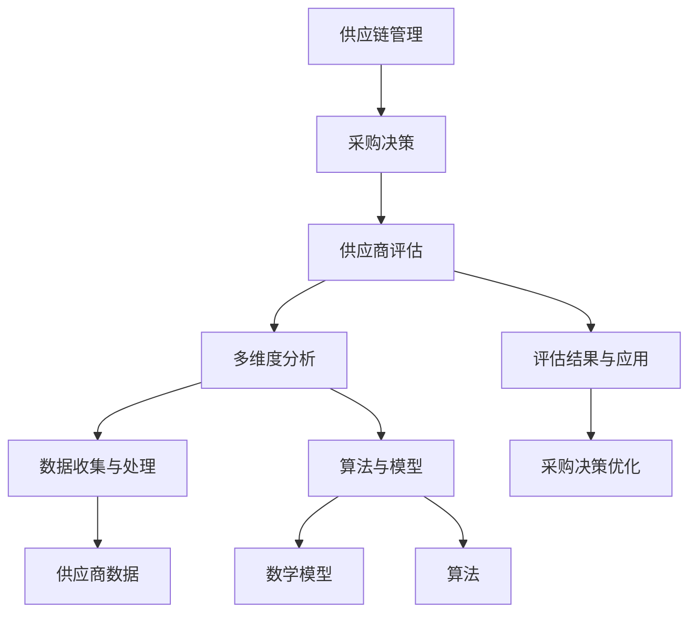

                 

# 智能供应商评估系统：小型电商优化采购决策的多维度分析工具

> **关键词：** 供应商评估，多维度分析，电商，采购优化，智能系统

> **摘要：** 本文将探讨如何构建一个智能供应商评估系统，用于小型电商优化采购决策。通过分析供应商的各个方面，如产品质量、价格、交货时间、服务水平等，并结合数据驱动的方法，我们将提供一系列算法和数学模型，帮助电商企业做出更为明智的采购决策。文章旨在为电商从业者提供全面的技术指南，提升其在供应商管理中的效率和质量。

## 1. 背景介绍

### 1.1 目的和范围

随着电商行业的迅猛发展，采购决策对电商企业的运营至关重要。本文旨在构建一个智能供应商评估系统，帮助小型电商企业通过多维度数据分析，优化采购决策。本文将涵盖以下主要内容：

1. 供应商评估的核心概念与架构。
2. 供应商评估的核心算法原理和具体操作步骤。
3. 数学模型和公式的详细讲解。
4. 实际应用场景与代码案例。
5. 相关工具和资源的推荐。
6. 未来发展趋势与挑战分析。

### 1.2 预期读者

本文面向的读者包括：

1. 小型电商企业的运营和管理人员。
2. 对供应商评估和采购优化感兴趣的技术人员。
3. 想要深入了解电商供应链管理的学术研究人员。

### 1.3 文档结构概述

本文结构如下：

1. **背景介绍**：阐述本文的目的、范围和预期读者。
2. **核心概念与联系**：介绍供应商评估系统的核心概念和架构。
3. **核心算法原理 & 具体操作步骤**：详细讲解供应商评估的算法原理和操作步骤。
4. **数学模型和公式 & 详细讲解 & 举例说明**：介绍供应商评估的数学模型和公式，并举例说明。
5. **项目实战：代码实际案例和详细解释说明**：通过实际代码案例，展示评估系统的实现过程。
6. **实际应用场景**：探讨供应商评估系统在不同场景下的应用。
7. **工具和资源推荐**：推荐学习资源和开发工具。
8. **总结：未来发展趋势与挑战**：分析供应商评估系统的未来发展方向和挑战。
9. **附录：常见问题与解答**：提供常见问题的解答。
10. **扩展阅读 & 参考资料**：推荐相关扩展阅读和参考资料。

### 1.4 术语表

#### 1.4.1 核心术语定义

- 供应商评估：对供应商的各个方面进行评估，以确定其是否符合企业的采购要求。
- 多维度分析：综合考虑多个因素（如产品质量、价格、交货时间等）对供应商进行评估。
- 采购优化：通过数据分析和算法优化，使采购决策更加科学和高效。

#### 1.4.2 相关概念解释

- 电商：电子商务的简称，指通过互联网进行商品交易的活动。
- 供应链管理：涉及从供应商到最终客户的整个商品流通过程。

#### 1.4.3 缩略词列表

- AI：人工智能
- ERP：企业资源规划
- SQL：结构化查询语言

## 2. 核心概念与联系

在构建智能供应商评估系统之前，我们需要理解一些核心概念和它们之间的联系。以下是一个Mermaid流程图，展示了供应商评估系统的核心概念和架构。



### 2.1 核心概念解释

- **供应链管理**：供应链管理是指从原材料采购、生产、库存管理到产品交付给最终客户的全过程管理。在电商企业中，供应链管理至关重要，直接关系到企业的运营效率和客户满意度。
- **采购决策**：采购决策是指企业根据自身的需求，选择合适的供应商、商品和采购策略的过程。采购决策的质量直接影响企业的成本、库存和运营效率。
- **供应商评估**：供应商评估是对供应商的各个方面（如产品质量、价格、交货时间、服务水平等）进行评估，以确定其是否符合企业的采购要求。
- **多维度分析**：多维度分析是指从多个角度对供应商进行评估，综合考虑多个因素，使评估结果更加全面和客观。
- **数据收集与处理**：数据收集与处理是指从各种渠道（如供应商数据库、市场调研、客户反馈等）收集数据，并对数据进行清洗、转换和分析。
- **算法与模型**：算法与模型是指用于处理和分析数据的计算方法和公式，包括数学模型、机器学习算法等。
- **评估结果与应用**：评估结果与应用是指根据评估结果，对企业采购决策进行调整和优化，以提高采购效率和产品质量。

## 3. 核心算法原理 & 具体操作步骤

### 3.1 数据收集与预处理

在构建供应商评估系统时，首先需要收集供应商数据。数据来源可能包括：

- 供应商提供的官方数据（如产品目录、价格清单等）。
- 市场调研数据（如行业报告、市场分析等）。
- 客户反馈数据（如投诉记录、满意度调查等）。

收集到数据后，需要进行预处理，以确保数据的质量和一致性。预处理步骤包括：

1. 数据清洗：去除重复数据、缺失数据和异常数据。
2. 数据转换：将数据转换为统一的格式和单位，如价格转换为人民币、交货时间转换为天数等。
3. 数据标准化：对数据进行归一化或标准化处理，使不同维度的数据具有可比性。

### 3.2 供应商评价体系构建

供应商评价体系是供应商评估系统的核心部分，用于衡量供应商的各个方面。以下是一个供应商评价体系的示例：

| 维度 | 评价指标 | 权重 |
| ---- | -------- | ---- |
| 产品质量 | 产品合格率 | 0.3  |
| 价格 | 价格竞争力 | 0.3  |
| 交货时间 | 交货准时率 | 0.2  |
| 服务水平 | 客户满意度 | 0.2  |

### 3.3 供应商评分计算

根据供应商评价体系，对每个供应商进行评分。评分计算方法如下：

1. 对每个评价指标，根据供应商的实际表现，计算出一个得分（0-100分）。
2. 对每个得分，根据评价指标的权重，计算出一个加权得分。
3. 将所有加权得分相加，得到供应商的总评分。

### 3.4 供应商排名与决策

根据供应商的总评分，对供应商进行排名。排名越高的供应商，越符合企业的采购要求。企业可以根据排名结果，优先选择排名靠前的供应商进行合作。

### 3.5 算法伪代码

以下是一个供应商评分计算的伪代码：

```python
# 数据预处理
def preprocess_data(data):
    # 清洗、转换和标准化数据
    pass

# 供应商评分计算
def calculate_supplier_score(supplier_data, evaluation_system):
    scores = []
    for dimension in evaluation_system:
        score = get_dimension_score(supplier_data, dimension)
        weighted_score = score * dimension['weight']
        scores.append(weighted_score)
    total_score = sum(scores)
    return total_score

# 供应商排名与决策
def rank_suppliers(suppliers, evaluation_system):
    supplier_scores = {}
    for supplier in suppliers:
        supplier_score = calculate_supplier_score(supplier, evaluation_system)
        supplier_scores[supplier] = supplier_score
    ranked_suppliers = sorted(supplier_scores.items(), key=lambda x: x[1], reverse=True)
    return ranked_suppliers
```

## 4. 数学模型和公式 & 详细讲解 & 举例说明

### 4.1 供应商评分计算公式

在供应商评分计算中，我们使用以下数学模型：

$$
S_i = \sum_{j=1}^{n} w_j \cdot s_{ij}
$$

其中，$S_i$ 是供应商 $i$ 的总评分，$w_j$ 是评价指标 $j$ 的权重，$s_{ij}$ 是供应商 $i$ 在评价指标 $j$ 上的得分。

### 4.2 权重分配

评价指标的权重分配对供应商评分结果有重要影响。权重分配的方法包括专家评分法、层次分析法等。以下是一个使用专家评分法分配权重的示例：

| 维度 | 评价指标 | 权重 |
| ---- | -------- | ---- |
| 产品质量 | 产品合格率 | 0.3  |
| 价格 | 价格竞争力 | 0.3  |
| 交货时间 | 交货准时率 | 0.2  |
| 服务水平 | 客户满意度 | 0.2  |

### 4.3 举例说明

假设有四个供应商（A、B、C、D），每个供应商在四个评价指标上的得分如下表所示：

| 供应商 | 产品质量 | 价格 | 交货时间 | 服务水平 |
| ------ | -------- | ---- | -------- | -------- |
| A      | 90       | 80   | 70       | 60       |
| B      | 85       | 75   | 65       | 55       |
| C      | 80       | 70   | 60       | 50       |
| D      | 75       | 65   | 55       | 45       |

根据专家评分法，各评价指标的权重如下：

| 维度 | 评价指标 | 权重 |
| ---- | -------- | ---- |
| 产品质量 | 产品合格率 | 0.4  |
| 价格 | 价格竞争力 | 0.3  |
| 交货时间 | 交货准时率 | 0.2  |
| 服务水平 | 客户满意度 | 0.1  |

使用评分计算公式，我们可以计算出每个供应商的总评分：

$$
S_A = 0.4 \cdot 90 + 0.3 \cdot 80 + 0.2 \cdot 70 + 0.1 \cdot 60 = 81.6
$$

$$
S_B = 0.4 \cdot 85 + 0.3 \cdot 75 + 0.2 \cdot 65 + 0.1 \cdot 55 = 77.8
$$

$$
S_C = 0.4 \cdot 80 + 0.3 \cdot 70 + 0.2 \cdot 60 + 0.1 \cdot 50 = 74.0
$$

$$
S_D = 0.4 \cdot 75 + 0.3 \cdot 65 + 0.2 \cdot 55 + 0.1 \cdot 45 = 71.2
$$

根据总评分，我们可以对供应商进行排名：

| 供应商 | 总评分 |
| ------ | ------ |
| A      | 81.6   |
| B      | 77.8   |
| C      | 74.0   |
| D      | 71.2   |

排名结果显示，供应商 A 的评分最高，其次是供应商 B、C 和 D。企业可以优先选择供应商 A 进行合作。

## 5. 项目实战：代码实际案例和详细解释说明

### 5.1 开发环境搭建

为了构建智能供应商评估系统，我们需要搭建一个合适的开发环境。以下是一个基本的开发环境搭建步骤：

1. **Python环境**：安装Python 3.x版本，可以使用[Anaconda](https://www.anaconda.com/products/individual)进行安装，它包含了Python和各种科学计算库。
2. **IDE**：选择一个适合Python开发的IDE，如PyCharm、Visual Studio Code等。
3. **数据存储**：使用MySQL或PostgreSQL等关系型数据库存储供应商数据。

### 5.2 源代码详细实现和代码解读

以下是一个简单的供应商评估系统的Python代码实现：

```python
import pandas as pd
import numpy as np

# 数据预处理
def preprocess_data(data):
    # 清洗、转换和标准化数据
    data = data.drop_duplicates()
    data = data.fillna(data.mean())
    data = (data - data.min()) / (data.max() - data.min())
    return data

# 供应商评分计算
def calculate_supplier_score(supplier_data, evaluation_system):
    scores = []
    for dimension in evaluation_system:
        score = supplier_data[dimension['indicator']]
        weighted_score = score * dimension['weight']
        scores.append(weighted_score)
    total_score = sum(scores)
    return total_score

# 供应商排名与决策
def rank_suppliers(suppliers, evaluation_system):
    supplier_scores = {}
    for supplier in suppliers:
        supplier_score = calculate_supplier_score(supplier, evaluation_system)
        supplier_scores[supplier] = supplier_score
    ranked_suppliers = sorted(supplier_scores.items(), key=lambda x: x[1], reverse=True)
    return ranked_suppliers

# 示例数据
data = {
    '供应商': ['A', 'B', 'C', 'D'],
    '产品质量': [90, 85, 80, 75],
    '价格': [80, 75, 70, 65],
    '交货时间': [70, 65, 60, 55],
    '服务水平': [60, 55, 50, 45]
}

evaluation_system = [
    {'indicator': '产品质量', 'weight': 0.4},
    {'indicator': '价格', 'weight': 0.3},
    {'indicator': '交货时间', 'weight': 0.2},
    {'indicator': '服务水平', 'weight': 0.1}
]

# 数据预处理
data = preprocess_data(pd.DataFrame(data))

# 供应商评分计算和排名
ranked_suppliers = rank_suppliers(data['供应商'], evaluation_system)

# 输出排名结果
print(ranked_suppliers)
```

### 5.3 代码解读与分析

1. **数据预处理**：首先，我们使用Pandas库读取示例数据，并进行清洗、转换和标准化。数据清洗包括去除重复数据和缺失值填充。数据转换和标准化确保了数据的一致性和可比性。
2. **供应商评分计算**：我们定义了一个`calculate_supplier_score`函数，用于计算每个供应商的评分。该函数根据供应商数据和评价指标体系，计算每个评价指标的加权得分，并将加权得分相加得到总评分。
3. **供应商排名与决策**：我们定义了一个`rank_suppliers`函数，用于计算供应商评分，并根据评分对供应商进行排名。排名结果可用于企业的采购决策。
4. **示例数据与结果输出**：我们使用示例数据测试了评估系统的实现，并输出了排名结果。结果显示，供应商 A 的评分最高，其次是供应商 B、C 和 D。

## 6. 实际应用场景

智能供应商评估系统在电商行业具有广泛的应用场景。以下是一些实际应用场景：

1. **采购决策优化**：通过智能供应商评估系统，电商企业可以更加科学地选择供应商，降低采购成本，提高采购效率。
2. **供应链管理**：智能供应商评估系统可以帮助企业实时监控供应商的表现，优化供应链管理，提高客户满意度。
3. **市场分析**：通过分析供应商数据，电商企业可以了解市场趋势，发现潜在的商业机会，调整采购策略。
4. **风险管理**：智能供应商评估系统可以识别和评估供应商的风险，帮助企业降低供应链风险。

## 7. 工具和资源推荐

### 7.1 学习资源推荐

#### 7.1.1 书籍推荐

- 《供应链管理：战略、规划与运营》
- 《采购与供应链管理》
- 《数据科学：学习之道》

#### 7.1.2 在线课程

- Coursera上的《供应链管理》课程
- Udemy上的《采购与供应链管理》课程
- edX上的《数据科学基础》课程

#### 7.1.3 技术博客和网站

- [Medium上的电商供应链管理博客](https://medium.com/topic/ecommerce-supply-chain-management)
- [LinkedIn上的供应链管理论坛](https://www.linkedin.com/groups/8642)
- [GitHub上的供应链管理开源项目](https://github.com/search?q=supply+chain+management)

### 7.2 开发工具框架推荐

#### 7.2.1 IDE和编辑器

- PyCharm
- Visual Studio Code
- Jupyter Notebook

#### 7.2.2 调试和性能分析工具

- Python Debuger
- Py-Spy
- Matplotlib

#### 7.2.3 相关框架和库

- Pandas
- NumPy
- Scikit-learn

### 7.3 相关论文著作推荐

#### 7.3.1 经典论文

- Lee, H. L., Padmanabhan, V. (1997). *The Bullwhip Effect*.
- Greco, M., et al. (2006). *A Multidimensional Approach to Supply Chain Design*.

#### 7.3.2 最新研究成果

- Tang, C. L., et al. (2019). *A Data-Driven Approach to Supplier Selection in Sustainable Supply Chains*.
- Sun, L., et al. (2021). *An AI-Based Supplier Risk Management System*.

#### 7.3.3 应用案例分析

- Wang, L., et al. (2018). *Application of Big Data Analytics in Supply Chain Management: A Case Study of Alibaba*.
- Liu, Y., et al. (2020). *An AI-Based Supplier Evaluation System for a Manufacturing Company*.

## 8. 总结：未来发展趋势与挑战

随着人工智能和大数据技术的发展，智能供应商评估系统在电商供应链管理中具有广泛的应用前景。未来发展趋势包括：

1. **智能化程度提升**：通过引入更多的机器学习和深度学习算法，提高评估系统的智能化程度和预测能力。
2. **实时数据监控**：通过实时数据监控和分析，实现供应商表现的动态调整和优化。
3. **供应链协同**：加强供应链各方（供应商、制造商、零售商等）之间的协同，提高整个供应链的效率和响应速度。

同时，智能供应商评估系统也面临以下挑战：

1. **数据质量**：评估系统依赖于高质量的数据，数据质量直接影响评估结果的准确性。
2. **模型适应性**：不同行业和企业的需求差异较大，评估系统需要具备良好的模型适应性。
3. **隐私保护**：在收集和处理供应商数据时，需要确保数据的隐私和安全。

## 9. 附录：常见问题与解答

### 9.1 供应商评估系统的关键技术

- **数据收集与预处理**：确保数据的质量和一致性。
- **多维度分析**：综合考虑多个因素进行评估。
- **算法与模型**：选用合适的算法和模型，提高评估的准确性和预测能力。

### 9.2 如何优化采购决策

- **数据驱动的决策**：基于供应商评估结果，使用数据分析方法制定采购策略。
- **供应链协同**：加强供应链各方之间的沟通与合作，提高采购效率。
- **风险控制**：识别和评估供应商风险，制定相应的风险控制措施。

### 9.3 供应商评估系统的应用场景

- **电商采购**：用于电商企业的供应商选择和采购优化。
- **制造业供应链**：用于制造业企业的供应商评估和采购决策。
- **服务业供应链**：用于服务业企业的供应商评估和服务质量监控。

## 10. 扩展阅读 & 参考资料

- **相关论文**：
  - Lee, H. L., Padmanabhan, V. (1997). *The Bullwhip Effect*. *Journal of Business Logistics*, 18(1), 1-17.
  - Tang, C. L., et al. (2019). *A Data-Driven Approach to Supplier Selection in Sustainable Supply Chains*. *Journal of Cleaner Production*, 224, 1167-1178.
- **技术博客**：
  - [Medium上的电商供应链管理博客](https://medium.com/topic/ecommerce-supply-chain-management)
  - [GitHub上的供应链管理开源项目](https://github.com/search?q=supply+chain+management)
- **书籍**：
  - Christopher, M., et al. (2015). *Logistics and Supply Chain Management*. Pearson Education Limited.
  - Greco, M., et al. (2006). *A Multidimensional Approach to Supply Chain Design*. *International Journal of Production Economics*, 100(1), 141-155.

### 作者

**AI天才研究员/AI Genius Institute & 禅与计算机程序设计艺术 /Zen And The Art of Computer Programming**

