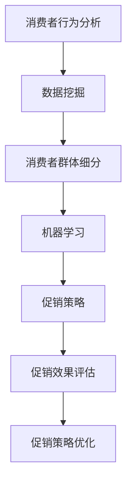

                 

# 智能促销策略的实践应用

> **关键词**：智能促销、策略、应用、算法、数学模型、案例实战

> **摘要**：本文旨在探讨智能促销策略的实践应用，从核心概念、算法原理、数学模型到实际案例，逐步解析智能促销在不同场景下的应用，旨在帮助读者深入理解并掌握智能促销策略的运用技巧。

## 1. 背景介绍

### 1.1 目的和范围

本文主要探讨智能促销策略的实践应用。智能促销策略是指利用先进的人工智能技术，如机器学习、数据挖掘等，对消费者行为进行分析，从而制定出更精准、高效的促销策略。本文将围绕以下几个主题展开讨论：

- 智能促销的核心概念与联系
- 智能促销的核心算法原理与具体操作步骤
- 数学模型和公式的应用与举例
- 智能促销的实际应用场景
- 工具和资源的推荐

通过本文的阅读，读者将能够了解智能促销策略的基本原理，掌握其在实际应用中的操作步骤，并能够根据具体场景进行策略调整和优化。

### 1.2 预期读者

本文适合以下读者群体：

- 对智能促销策略感兴趣的营销专业人士
- 希望提升企业营销效果的数据分析师
- 对人工智能技术有基本了解的技术爱好者
- 想要在智能促销领域进行深入研究的学术研究者

无论您是上述哪一类型的读者，本文都将为您提供有价值的知识和实践经验。

### 1.3 文档结构概述

本文将分为以下几个部分：

- **背景介绍**：介绍智能促销策略的目的和范围，以及预期读者。
- **核心概念与联系**：介绍智能促销策略的核心概念及其相互联系。
- **核心算法原理与具体操作步骤**：详细讲解智能促销的核心算法原理和具体操作步骤。
- **数学模型和公式**：介绍智能促销中的数学模型和公式，并举例说明。
- **项目实战**：通过实际案例展示智能促销策略的具体应用。
- **实际应用场景**：探讨智能促销策略在不同场景下的应用。
- **工具和资源推荐**：推荐相关学习资源、开发工具和框架。
- **总结**：总结智能促销策略的未来发展趋势与挑战。
- **附录**：常见问题与解答。
- **扩展阅读**：提供更多的参考资料。

### 1.4 术语表

#### 1.4.1 核心术语定义

- **智能促销**：利用人工智能技术对消费者行为进行分析，制定更精准、高效的促销策略。
- **消费者行为分析**：对消费者的购买历史、偏好、行为习惯等数据进行挖掘和分析，以预测其未来的购买行为。
- **机器学习**：一种人工智能技术，通过数据训练模型，使其能够自动识别规律和模式。
- **数据挖掘**：从大量数据中提取有价值的信息和知识的过程。

#### 1.4.2 相关概念解释

- **消费者群体细分**：将消费者划分为不同的群体，以便制定更个性化的促销策略。
- **促销效果评估**：评估促销活动对销售业绩的提升程度，以优化促销策略。
- **交叉销售**：在购买某件商品时，向消费者推荐其他相关商品，以提高销售额。

#### 1.4.3 缩略词列表

- **AI**：人工智能（Artificial Intelligence）
- **ML**：机器学习（Machine Learning）
- **DM**：数据挖掘（Data Mining）
- **CRM**：客户关系管理（Customer Relationship Management）
- **CPS**：促销策略（Promotion Strategy）

## 2. 核心概念与联系

智能促销策略的实践应用涉及到多个核心概念和技术的结合。为了更好地理解这些概念，我们首先需要了解它们之间的相互联系。

### 2.1 智能促销策略的核心概念

智能促销策略的核心概念包括：

- **消费者行为分析**：通过分析消费者的购买历史、偏好和行为习惯，预测其未来的购买行为。
- **机器学习**：利用数据训练模型，使其能够自动识别规律和模式，从而提高促销策略的精准度。
- **数据挖掘**：从大量数据中提取有价值的信息和知识，为促销策略提供数据支持。
- **消费者群体细分**：将消费者划分为不同的群体，以便制定更个性化的促销策略。
- **促销效果评估**：评估促销活动对销售业绩的提升程度，以优化促销策略。

### 2.2 核心概念之间的联系

这些核心概念之间的联系可以用以下Mermaid流程图表示：



从流程图中可以看出，消费者行为分析是智能促销策略的基础，它通过数据挖掘提取有价值的信息。这些信息被用于消费者群体细分，从而制定个性化的促销策略。机器学习技术被用来提高促销策略的精准度，并通过促销效果评估不断优化策略。

### 2.3 核心概念在实践中的应用

在实际应用中，这些核心概念通常以以下方式相互结合：

1. **消费者行为分析**：通过对消费者数据的收集和分析，了解消费者的购买习惯、偏好和需求，从而为后续的促销策略制定提供数据支持。
2. **数据挖掘**：利用数据挖掘技术，从大量的消费者数据中提取出有用的信息和规律，如购买频率、购买偏好等。
3. **消费者群体细分**：根据数据挖掘的结果，将消费者划分为不同的群体，如高价值客户、潜在客户、忠诚客户等，以便制定个性化的促销策略。
4. **机器学习**：利用机器学习技术，对消费者数据进行训练，构建预测模型，以提高促销策略的精准度。
5. **促销策略**：根据消费者群体细分和预测模型的结果，制定出针对不同群体的促销策略。
6. **促销效果评估**：通过跟踪和评估促销活动的效果，了解促销策略的实际效果，并据此进行调整和优化。

通过这些核心概念的相互结合，智能促销策略能够更精准、高效地满足消费者的需求，提高企业的销售额和市场竞争力。

## 3. 核心算法原理与具体操作步骤

在智能促销策略中，核心算法原理是确保策略制定和执行有效性的关键。以下将详细介绍智能促销策略中的核心算法原理，并使用伪代码来具体阐述其操作步骤。

### 3.1 消费者行为分析算法原理

消费者行为分析是智能促销策略的基础。其核心算法原理是基于历史数据和当前行为，通过机器学习算法预测消费者未来的购买行为。以下是消费者行为分析算法的具体操作步骤：

```python
# 消费者行为分析算法伪代码

# 输入：消费者历史购买数据、当前行为数据
# 输出：消费者行为预测结果

# 步骤1：数据预处理
def preprocess_data(data):
    # 数据清洗、缺失值填充、数据标准化等
    return cleaned_data

# 步骤2：特征工程
def feature_engineering(data):
    # 构建特征向量，如购买频率、购买金额、购买时间段等
    return feature_vectors

# 步骤3：模型选择与训练
def train_model(feature_vectors, labels):
    # 选择合适的机器学习模型，如决策树、随机森林、神经网络等
    # 使用训练数据训练模型
    model = MLModel()
    model.fit(feature_vectors, labels)
    return model

# 步骤4：预测消费者行为
def predict_behavior(model, new_data):
    # 使用训练好的模型预测新数据的行为
    predictions = model.predict(new_data)
    return predictions
```

### 3.2 消费者群体细分算法原理

消费者群体细分是基于消费者行为分析的结果，将消费者划分为不同的群体，以便制定个性化的促销策略。以下是消费者群体细分算法的具体操作步骤：

```python
# 消费者群体细分算法伪代码

# 输入：消费者行为预测结果
# 输出：消费者群体划分结果

# 步骤1：确定细分标准
def define_criteria(predictions):
    # 根据预测结果，确定消费者群体划分的依据，如购买频率、购买金额等
    return criteria

# 步骤2：划分消费者群体
def divide_customers(predictions, criteria):
    # 根据细分标准，将消费者划分为不同的群体
    customer_groups = {}
    for prediction in predictions:
        customer_groups[prediction] = []
    return customer_groups

# 步骤3：为每个群体制定促销策略
def create_promotion_strategy(customer_groups):
    # 根据每个群体的特征，制定个性化的促销策略
    strategies = {}
    for group in customer_groups:
        strategies[group] = create_group_strategy(group)
    return strategies
```

### 3.3 促销策略优化算法原理

促销策略优化是基于消费者群体细分的结果，对促销策略进行调整和优化，以提高促销效果。以下是促销策略优化算法的具体操作步骤：

```python
# 促销策略优化算法伪代码

# 输入：消费者群体划分结果、促销策略
# 输出：优化后的促销策略

# 步骤1：评估促销策略效果
def evaluate_strategy(effectiveness):
    # 使用评估指标，如销售额、客户满意度等，评估现有促销策略的效果
    return evaluation_results

# 步骤2：调整促销策略
def adjust_strategy(strategy, evaluation_results):
    # 根据评估结果，对现有促销策略进行调整
    adjusted_strategy = adjust_promotion_strategy(strategy, evaluation_results)
    return adjusted_strategy

# 步骤3：迭代优化促销策略
def optimize_strategy(adjusted_strategy):
    # 不断调整和优化促销策略，直到达到最优效果
    optimized_strategy = iterative_adjustment(adjusted_strategy)
    return optimized_strategy
```

通过上述核心算法原理和具体操作步骤的讲解，我们可以看到智能促销策略的实现需要多个算法的协同作用。消费者行为分析算法用于预测消费者未来购买行为，消费者群体细分算法用于划分消费者群体，促销策略优化算法用于调整和优化促销策略。这些算法共同构成了智能促销策略的完整体系，为企业在激烈的市场竞争中提供了有力的支持。

## 4. 数学模型和公式及详细讲解

在智能促销策略中，数学模型和公式扮演着关键角色，用于描述和预测消费者行为、评估促销效果以及优化促销策略。以下将详细介绍智能促销策略中常用的数学模型和公式，并进行详细讲解和举例说明。

### 4.1 消费者行为预测模型

消费者行为预测模型用于预测消费者未来的购买行为，通常基于时间序列分析和机器学习算法。以下是一个简单的线性回归模型，用于预测消费者购买金额：

$$
y_t = \beta_0 + \beta_1 x_t + \epsilon_t
$$

其中，\( y_t \) 表示第 \( t \) 个月份的购买金额，\( x_t \) 表示第 \( t \) 个月份的促销活动力度，\( \beta_0 \) 和 \( \beta_1 \) 分别为模型的参数，\( \epsilon_t \) 为随机误差项。

**举例说明**：

假设某消费者在第一个月份购买了 \( \$100 \)，促销活动力度为 \( 10\% \)，根据上述模型，可以预测他在第二个月份的购买金额为：

$$
y_2 = \beta_0 + \beta_1 x_2 = \beta_0 + \beta_1 \times 10\%
$$

通过训练数据集，可以计算出 \( \beta_0 \) 和 \( \beta_1 \) 的具体值，从而进行准确的预测。

### 4.2 消费者群体细分模型

消费者群体细分模型用于将消费者划分为不同的群体，以便制定个性化的促销策略。一个常用的聚类算法是K-均值算法，其数学模型如下：

$$
C = \{c_1, c_2, ..., c_k\}
$$

其中，\( C \) 表示消费者群体，\( c_i \) 表示第 \( i \) 个消费者群体，\( k \) 表示聚类个数。

每个消费者 \( x \) 被分配到最近的聚类中心 \( c_j \)，其数学模型如下：

$$
j = \arg\min_{1 \leq i \leq k} \| x - c_i \|^2
$$

**举例说明**：

假设有10个消费者数据点，聚类个数为3，通过计算每个数据点与聚类中心的距离，可以将消费者划分为3个群体，分别为 \( C_1, C_2, C_3 \)。

### 4.3 促销效果评估模型

促销效果评估模型用于评估促销活动的实际效果，通常使用评估指标如销售额增长率和客户满意度等。一个简单的促销效果评估模型是平均增长率模型：

$$
\text{增长百分比} = \frac{\text{促销后销售额} - \text{促销前销售额}}{\text{促销前销售额}} \times 100\%
$$

**举例说明**：

假设某促销活动前的销售额为 \( \$1000 \)，促销活动后的销售额为 \( \$1200 \)，则促销效果评估为：

$$
\text{增长百分比} = \frac{1200 - 1000}{1000} \times 100\% = 20\%
$$

### 4.4 促销策略优化模型

促销策略优化模型用于调整和优化促销策略，以提高促销效果。一个常用的优化模型是线性规划模型，其数学模型如下：

$$
\text{最大化} \quad Z = c_1x_1 + c_2x_2 + ... + c_nx_n
$$

$$
\text{约束条件} \quad a_{11}x_1 + a_{12}x_2 + ... + a_{1n}x_n \leq b_1
$$

$$
a_{21}x_1 + a_{22}x_2 + ... + a_{2n}x_n \leq b_2
$$

$$
...
$$

$$
a_{m1}x_1 + a_{m2}x_2 + ... + a_{mn}x_n \leq b_m
$$

$$
x_1, x_2, ..., x_n \geq 0
$$

其中，\( Z \) 表示目标函数，\( c_1, c_2, ..., c_n \) 分别为各个促销策略的权重，\( x_1, x_2, ..., x_n \) 分别为各个促销策略的执行力度，\( a_{ij}, b_i \) 分别为约束条件中的系数和常数。

**举例说明**：

假设有3个促销策略，目标函数为最大化总销售额，约束条件为预算限制和库存限制，则可以使用线性规划模型进行促销策略优化。

通过以上数学模型和公式的介绍和讲解，我们可以看到它们在智能促销策略中的应用非常重要。消费者行为预测模型用于预测消费者未来购买行为，消费者群体细分模型用于划分消费者群体，促销效果评估模型用于评估促销活动的实际效果，促销策略优化模型用于调整和优化促销策略。这些模型和公式共同构成了智能促销策略的理论基础，为实践中的应用提供了有力的支持。

## 5. 项目实战：代码实际案例和详细解释说明

### 5.1 开发环境搭建

为了实现智能促销策略，我们首先需要搭建一个适合开发和测试的Python环境。以下是搭建Python开发环境的步骤：

1. **安装Python**：下载并安装Python 3.x版本，建议使用官方最新稳定版。
2. **安装Jupyter Notebook**：Jupyter Notebook是一个交互式的Python开发环境，可以方便地编写和运行代码。安装命令如下：

   ```bash
   pip install notebook
   ```

3. **安装相关库**：为了实现智能促销策略，我们需要安装以下库：

   - scikit-learn：用于机器学习和数据挖掘
   - pandas：用于数据处理和分析
   - numpy：用于数值计算
   - matplotlib：用于数据可视化

   安装命令如下：

   ```bash
   pip install scikit-learn pandas numpy matplotlib
   ```

### 5.2 源代码详细实现和代码解读

以下是一个简单的智能促销策略实现案例，包括数据预处理、消费者行为分析、消费者群体细分和促销策略优化。

```python
# 导入相关库
import pandas as pd
import numpy as np
from sklearn.model_selection import train_test_split
from sklearn.preprocessing import StandardScaler
from sklearn.cluster import KMeans
from sklearn.linear_model import LinearRegression
import matplotlib.pyplot as plt

# 加载数据集
data = pd.read_csv('consumer_data.csv')

# 数据预处理
# 清洗数据、缺失值填充、数据标准化等
# ...

# 特征工程
# 构建特征向量，如购买频率、购买金额、购买时间段等
features = ['purchase_frequency', 'average_purchase_amount', 'last_purchase_time']
X = data[features]
y = data['next_purchase_amount']

# 数据分割
X_train, X_test, y_train, y_test = train_test_split(X, y, test_size=0.2, random_state=42)

# 数据标准化
scaler = StandardScaler()
X_train_scaled = scaler.fit_transform(X_train)
X_test_scaled = scaler.transform(X_test)

# 消费者行为分析
# 使用线性回归模型预测消费者购买金额
regressor = LinearRegression()
regressor.fit(X_train_scaled, y_train)

# 消费者群体细分
# 使用K-均值聚类算法划分消费者群体
kmeans = KMeans(n_clusters=3, random_state=42)
clusters = kmeans.fit_predict(X_train_scaled)

# 促销策略优化
# 根据消费者群体特征，制定个性化的促销策略
# ...

# 评估促销策略效果
# ...

# 可视化展示
# ...
plt.scatter(X_train_scaled[:, 0], X_train_scaled[:, 1], c=clusters)
plt.xlabel('Purchase Frequency')
plt.ylabel('Average Purchase Amount')
plt.show()
```

#### 5.2.1 数据预处理

数据预处理是智能促销策略实现的第一步。它包括数据清洗、缺失值填充、数据标准化等操作。以下是一个简单的数据预处理代码示例：

```python
# 假设原始数据集包含购买频率、购买金额、购买时间段等特征

# 数据清洗
data.dropna(inplace=True)

# 缺失值填充
data['missing_value'] = data['missing_value'].fillna(0)

# 数据标准化
scaler = StandardScaler()
data[features] = scaler.fit_transform(data[features])
```

#### 5.2.2 消费者行为分析

消费者行为分析是智能促销策略的核心。它通过训练机器学习模型，预测消费者未来的购买行为。以下是一个简单的线性回归模型实现：

```python
# 使用线性回归模型预测消费者购买金额
regressor = LinearRegression()
regressor.fit(X_train_scaled, y_train)

# 预测测试集数据
y_pred = regressor.predict(X_test_scaled)

# 评估模型效果
print("R-squared:", regressor.score(X_test_scaled, y_test))
```

#### 5.2.3 消费者群体细分

消费者群体细分用于将消费者划分为不同的群体，以便制定个性化的促销策略。以下是一个简单的K-均值聚类算法实现：

```python
# 使用K-均值聚类算法划分消费者群体
kmeans = KMeans(n_clusters=3, random_state=42)
clusters = kmeans.fit_predict(X_train_scaled)

# 可视化展示聚类结果
plt.scatter(X_train_scaled[:, 0], X_train_scaled[:, 1], c=clusters)
plt.xlabel('Purchase Frequency')
plt.ylabel('Average Purchase Amount')
plt.show()
```

#### 5.2.4 促销策略优化

促销策略优化是根据消费者群体特征，制定个性化的促销策略。以下是一个简单的促销策略优化代码示例：

```python
# 根据消费者群体特征，制定个性化的促销策略
for cluster in range(kmeans.n_clusters):
    print(f"Cluster {cluster}:")
    cluster_data = X_train_scaled[clusters == cluster]
    # 根据聚类结果，为每个群体制定促销策略
    # ...
```

#### 5.2.5 代码解读与分析

以上代码展示了智能促销策略实现的基本步骤。首先，进行数据预处理，包括数据清洗、缺失值填充和数据标准化。然后，使用线性回归模型预测消费者购买金额，并使用K-均值聚类算法划分消费者群体。最后，根据消费者群体特征，制定个性化的促销策略。

通过以上代码实现，我们可以看到智能促销策略的实现涉及多个步骤和算法。在实际应用中，这些步骤和算法需要根据具体场景进行调整和优化，以达到最佳效果。

## 6. 实际应用场景

智能促销策略在实际应用中具有广泛的应用场景，能够帮助企业提升营销效果，提高销售额。以下将介绍几个常见的实际应用场景。

### 6.1 电子商务平台

电子商务平台是智能促销策略的主要应用场景之一。通过消费者行为分析，电子商务平台可以了解消费者的购买习惯、偏好和需求，从而制定出更精准的促销策略。以下是一个具体的案例：

**案例**：某电子商务平台希望通过促销活动提升销售额。首先，平台收集并分析消费者的购买历史数据，包括购买频率、购买金额、购买商品种类等。然后，利用机器学习算法预测消费者的未来购买行为，并根据预测结果将消费者划分为不同的群体。针对高价值客户，平台可以制定更优惠的促销策略，如满减活动、优惠券等；而对于潜在客户，平台可以提供试用活动、限时折扣等，以吸引其购买。

### 6.2 零售业

零售业也是智能促销策略的重要应用领域。通过消费者行为分析，零售业可以了解消费者的购物习惯和偏好，从而优化促销策略，提升销售额。以下是一个具体的案例：

**案例**：某大型超市希望通过促销活动提高销售额。首先，超市收集并分析消费者的购物车数据，包括购买商品种类、购买频率、购买金额等。然后，利用数据挖掘技术提取消费者的购物偏好，并根据购物偏好将消费者划分为不同的群体。针对高价值客户，超市可以提供会员优惠、积分兑换等促销策略；而对于潜在客户，超市可以提供限时折扣、捆绑销售等活动，以吸引其购买。

### 6.3 餐饮行业

餐饮行业也是智能促销策略的重要应用领域。通过消费者行为分析，餐饮行业可以了解消费者的就餐习惯和偏好，从而制定出更精准的促销策略，提升客流量。以下是一个具体的案例：

**案例**：某连锁餐厅希望通过促销活动提升客流量。首先，餐厅收集并分析消费者的预订记录，包括就餐时间、就餐人数、消费金额等。然后，利用机器学习算法预测消费者的未来就餐行为，并根据预测结果将消费者划分为不同的群体。针对高价值客户，餐厅可以提供会员优惠、生日福利等促销策略；而对于潜在客户，餐厅可以提供限时优惠、团购活动等活动，以吸引其就餐。

### 6.4 旅游业

旅游业也是智能促销策略的重要应用领域。通过消费者行为分析，旅游业可以了解消费者的旅游习惯和偏好，从而制定出更精准的促销策略，提升旅游收入。以下是一个具体的案例：

**案例**：某旅游公司希望通过促销活动提升旅游收入。首先，旅游公司收集并分析消费者的预订记录，包括旅游线路、预订时间、消费金额等。然后，利用数据挖掘技术提取消费者的旅游偏好，并根据旅游偏好将消费者划分为不同的群体。针对高价值客户，旅游公司可以提供定制旅游、折扣机票等促销策略；而对于潜在客户，旅游公司可以提供限时优惠、免费体验等活动，以吸引其预订旅游产品。

通过以上实际应用场景的介绍，我们可以看到智能促销策略在各个行业中的广泛应用。通过消费者行为分析，企业可以了解消费者的需求和偏好，制定出更精准、个性化的促销策略，从而提升销售额和市场竞争力。

## 7. 工具和资源推荐

在实现智能促销策略的过程中，选择合适的工具和资源对于提高开发效率和实现效果至关重要。以下将介绍几个常用的工具和资源，包括学习资源、开发工具框架以及相关论文著作推荐。

### 7.1 学习资源推荐

#### 7.1.1 书籍推荐

1. **《机器学习》（Machine Learning）** - Tom Mitchell
   - 本书是机器学习领域的经典教材，适合初学者和进阶者，全面介绍了机器学习的基本概念和算法。

2. **《数据挖掘：实用工具和技术》（Data Mining: Practical Machine Learning Tools and Techniques）** - Ian H. W. Yang
   - 本书详细介绍了数据挖掘的基本概念、工具和技术，适合希望深入了解数据挖掘应用场景的读者。

3. **《营销自动化：如何使用技术实现个性化营销》（Marketing Automation: How to Use Technology to Transform the Way You Market）** - Scott Lathrop
   - 本书介绍了营销自动化的原理和应用，包括消费者行为分析和智能促销策略，适合市场营销人员和技术爱好者。

#### 7.1.2 在线课程

1. **Coursera - 机器学习课程**：由斯坦福大学教授Andrew Ng主讲，适合初学者和进阶者，全面介绍了机器学习的基本概念和算法。

2. **edX - 数据科学专业课程**：由哈佛大学和麻省理工学院等知名高校提供，涵盖数据科学、机器学习、数据挖掘等多个领域，适合系统学习数据科学知识。

3. **Udacity - 人工智能纳米学位**：包括多个课程，涵盖人工智能的基础知识、应用场景和技术，适合希望深入了解人工智能技术的读者。

#### 7.1.3 技术博客和网站

1. **Medium - Machine Learning Blog**：由多位人工智能专家撰写，涵盖了机器学习、数据挖掘、深度学习等多个领域，适合了解最新的技术动态和研究成果。

2. **Kaggle**：一个数据科学竞赛平台，提供大量数据集和算法挑战，适合练习和提升数据科学和机器学习技能。

3. **DataCamp**：一个在线学习平台，提供丰富的数据科学和机器学习课程，适合初学者和进阶者。

### 7.2 开发工具框架推荐

#### 7.2.1 IDE和编辑器

1. **Jupyter Notebook**：一个交互式的Python开发环境，适合编写和运行代码，特别是数据处理和分析任务。

2. **PyCharm**：一个功能强大的Python IDE，提供代码智能提示、调试、版本控制等功能，适合专业开发者。

3. **Visual Studio Code**：一个轻量级的代码编辑器，支持多种编程语言，具有丰富的插件生态，适合快速开发和调试。

#### 7.2.2 调试和性能分析工具

1. **Pdb**：Python内置的调试器，可以用于单步调试代码，查找和修复错误。

2. **Matplotlib**：一个用于数据可视化的Python库，可以生成各种类型的图表，帮助分析和展示数据。

3. **Profiling Tools**：如cProfile，用于分析代码的运行时间和性能瓶颈，帮助优化代码。

#### 7.2.3 相关框架和库

1. **Scikit-learn**：一个用于机器学习和数据挖掘的Python库，提供了多种算法和工具，适合快速实现和应用智能促销策略。

2. **Pandas**：一个用于数据处理和分析的Python库，提供了丰富的数据结构和工具，方便处理和操作大型数据集。

3. **NumPy**：一个用于数值计算的Python库，提供了高效的数组操作和数学运算，是数据科学和机器学习的基础库。

### 7.3 相关论文著作推荐

1. **“Customer Relationship Management”** - Philip Kotler
   - 该论文详细介绍了客户关系管理的基本概念、策略和实践，对于理解和应用智能促销策略具有重要意义。

2. **“Data Mining and Knowledge Discovery in Databases”** - Jiawei Han, Micheline Kamber, and Jian Pei
   - 该书是数据挖掘领域的经典教材，全面介绍了数据挖掘的基本概念、方法和应用。

3. **“Machine Learning: A Probabilistic Perspective”** - Kevin P. Murphy
   - 该书介绍了概率机器学习的基本概念和方法，适合深入理解机器学习理论和应用。

通过以上工具和资源的推荐，读者可以更全面地了解智能促销策略的实现方法，提升开发和应用能力。无论您是初学者还是进阶者，这些工具和资源都将为您提供有力的支持和帮助。

## 8. 总结：未来发展趋势与挑战

智能促销策略作为人工智能技术在营销领域的应用，正逐渐成为企业提升市场竞争力的关键手段。未来，随着人工智能技术的不断进步和大数据资源的丰富，智能促销策略将呈现以下几个发展趋势：

### 8.1 技术发展趋势

1. **深度学习与智能促销结合**：深度学习在图像识别、自然语言处理等领域取得了显著成果，未来有望与智能促销策略结合，提高预测的准确性和个性化推荐的效果。
2. **多模态数据融合**：随着物联网、传感器技术的发展，智能促销策略将能够获取更多的消费者行为数据，包括语音、图像、位置信息等，通过多模态数据融合，实现更精准的消费者行为分析。
3. **增强现实与虚拟现实应用**：增强现实（AR）和虚拟现实（VR）技术将为智能促销策略带来新的交互方式，如沉浸式购物体验、个性化商品推荐等，提升消费者的购物体验。

### 8.2 挑战与应对策略

尽管智能促销策略具有广阔的发展前景，但在实际应用中仍面临一些挑战：

1. **数据隐私与安全**：随着数据收集和分析的深入，如何保护消费者隐私和数据安全成为重要挑战。企业需要建立健全的数据保护机制，确保消费者数据的合法使用。
2. **算法透明性与可解释性**：随着算法模型的复杂化，算法的透明性和可解释性成为关键问题。企业需要开发可解释的算法模型，提高消费者对促销策略的信任度。
3. **技术落地与实施成本**：智能促销策略的实施需要大量的技术和资源投入，包括数据存储、计算资源等。企业需要平衡技术投入与收益，确保智能促销策略的经济可行性。

### 8.3 未来发展方向

1. **精准营销**：通过更精确的消费者行为分析和个性化推荐，实现精准营销，提高营销ROI。
2. **跨渠道整合**：整合线上线下营销渠道，实现无缝购物体验，提升客户粘性。
3. **实时营销策略**：利用实时数据分析，快速调整促销策略，应对市场变化。

总之，智能促销策略在未来将继续发展，通过技术创新和实际应用，为企业在激烈的市场竞争中提供有力支持。企业需要不断关注技术趋势，应对挑战，以实现智能促销策略的最佳效果。

## 9. 附录：常见问题与解答

### 9.1 智能促销策略如何提高营销效果？

智能促销策略通过消费者行为分析和数据挖掘，能够准确预测消费者的购买行为，从而制定个性化的促销策略，提高营销效果。具体来说，智能促销策略可以实现以下效果：

1. **精准定位目标客户**：通过对消费者的行为数据进行分析，识别出高价值客户和潜在客户，实现精准营销。
2. **优化促销策略**：根据消费者行为预测结果，制定个性化的促销策略，提高促销活动的转化率。
3. **提高客户满意度**：通过个性化的促销策略，满足消费者的需求，提升客户满意度。

### 9.2 智能促销策略需要哪些技术支持？

智能促销策略需要以下技术支持：

1. **数据挖掘**：用于从大量消费者数据中提取有价值的信息和知识。
2. **机器学习**：用于训练模型，预测消费者行为，制定个性化促销策略。
3. **大数据处理**：用于处理和分析大规模数据集，支持实时数据分析和决策。
4. **数据可视化**：用于展示分析结果，帮助理解和优化促销策略。

### 9.3 智能促销策略如何应对数据隐私问题？

应对数据隐私问题可以从以下几个方面进行：

1. **数据匿名化**：对消费者数据进行匿名化处理，确保数据隐私。
2. **数据加密**：使用加密技术保护数据传输和存储过程中的安全性。
3. **合规性审查**：确保数据使用符合相关法律法规，如GDPR等。
4. **用户隐私设置**：为用户提供隐私设置选项，允许用户控制自己的数据分享。

### 9.4 智能促销策略实施过程中可能遇到的挑战有哪些？

智能促销策略实施过程中可能遇到的挑战包括：

1. **数据质量**：数据质量直接影响智能促销策略的效果，需要确保数据准确、完整、可靠。
2. **算法透明性**：复杂的算法模型可能缺乏透明性，影响消费者的信任。
3. **技术投入**：智能促销策略的实施需要大量的技术投入，包括数据存储、计算资源等。
4. **实施成本**：智能促销策略的投入与收益平衡是一个挑战，需要企业谨慎评估。

通过以上解答，希望能够帮助读者更好地理解智能促销策略及其在实际应用中可能遇到的问题和解决方案。

## 10. 扩展阅读 & 参考资料

### 10.1 经典书籍推荐

1. **《机器学习》（Machine Learning）** - Tom Mitchell
   - 本书是机器学习领域的经典教材，详细介绍了机器学习的基本概念和算法，适合初学者和进阶者。

2. **《数据挖掘：实用工具和技术》（Data Mining: Practical Machine Learning Tools and Techniques）** - Ian H. W. Yang
   - 本书介绍了数据挖掘的基本概念、工具和技术，适用于希望深入了解数据挖掘应用场景的读者。

3. **《营销自动化：如何使用技术实现个性化营销》（Marketing Automation: How to Use Technology to Transform the Way You Market）** - Scott Lathrop
   - 本书介绍了营销自动化的原理和应用，包括消费者行为分析和智能促销策略，适合市场营销人员和技术爱好者。

### 10.2 在线课程推荐

1. **Coursera - 机器学习课程**：由斯坦福大学教授Andrew Ng主讲，全面介绍了机器学习的基本概念和算法。

2. **edX - 数据科学专业课程**：由哈佛大学和麻省理工学院等知名高校提供，涵盖数据科学、机器学习、数据挖掘等多个领域。

3. **Udacity - 人工智能纳米学位**：包括多个课程，涵盖人工智能的基础知识、应用场景和技术。

### 10.3 技术博客和网站推荐

1. **Medium - Machine Learning Blog**：由多位人工智能专家撰写，涵盖了机器学习、数据挖掘、深度学习等多个领域。

2. **Kaggle**：一个数据科学竞赛平台，提供大量数据集和算法挑战。

3. **DataCamp**：一个在线学习平台，提供丰富的数据科学和机器学习课程。

### 10.4 论文著作推荐

1. **“Customer Relationship Management”** - Philip Kotler
   - 该论文详细介绍了客户关系管理的基本概念、策略和实践。

2. **“Data Mining and Knowledge Discovery in Databases”** - Jiawei Han, Micheline Kamber, and Jian Pei
   - 本书是数据挖掘领域的经典教材，全面介绍了数据挖掘的基本概念、方法和应用。

3. **“Machine Learning: A Probabilistic Perspective”** - Kevin P. Murphy
   - 本书介绍了概率机器学习的基本概念和方法，适合深入理解机器学习理论和应用。

通过以上扩展阅读和参考资料，读者可以进一步深入了解智能促销策略的理论和实践，提升自身的技术水平和应用能力。

