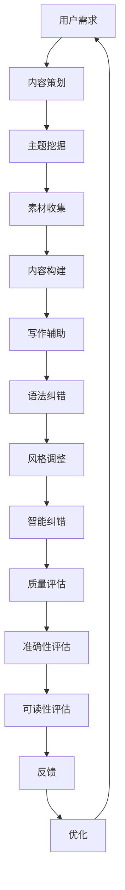

                 

# 智能写作平台的内容策划、写作辅助与质量评估功能实现

## 关键词
- 智能写作平台
- 内容策划
- 写作辅助
- 质量评估
- 自然语言处理
- 人工智能

## 摘要
本文深入探讨了智能写作平台的关键功能：内容策划、写作辅助与质量评估。通过对这些功能的详细分析，我们不仅探讨了其实现的原理和步骤，还通过具体的案例展示了其实际应用。本文旨在为开发者、内容创作者以及AI爱好者提供一套全面而深入的指南，帮助他们在智能写作领域进行更有效的探索和实践。

## 1. 背景介绍

### 1.1 目的和范围
智能写作平台作为一种新兴的科技工具，正逐渐成为内容创作的重要辅助手段。本文的目标是解析智能写作平台的核心功能，包括内容策划、写作辅助和质量评估，并探讨其实施的关键技术和方法。

本文的范围涵盖：
- 内容策划：如何利用人工智能技术进行主题挖掘、素材收集和内容构建。
- 写作辅助：从语法纠错、风格调整到智能纠错，智能写作辅助系统的实现细节。
- 质量评估：如何通过自然语言处理技术和数学模型来评估内容的准确性和可读性。

### 1.2 预期读者
- 开发者：希望了解和实现智能写作平台技术的专业人士。
- 内容创作者：寻求提高写作效率和内容质量的创作者。
- AI爱好者：对人工智能在写作领域应用感兴趣的读者。

### 1.3 文档结构概述
本文结构如下：
- 2. 核心概念与联系：介绍智能写作平台的基本概念和架构。
- 3. 核心算法原理 & 具体操作步骤：详细讲解实现智能写作平台功能所需的算法和技术。
- 4. 数学模型和公式 & 详细讲解 & 举例说明：阐述用于评估内容质量的数学模型及其应用。
- 5. 项目实战：代码实际案例和详细解释说明：通过具体项目案例展示智能写作平台的实现过程。
- 6. 实际应用场景：探讨智能写作平台在不同场景下的应用。
- 7. 工具和资源推荐：推荐学习资源和开发工具。
- 8. 总结：未来发展趋势与挑战：总结智能写作平台的发展前景。
- 9. 附录：常见问题与解答：提供有关智能写作平台的常见问题解答。
- 10. 扩展阅读 & 参考资料：推荐进一步学习资源。

### 1.4 术语表

#### 1.4.1 核心术语定义
- 智能写作平台：利用人工智能技术辅助内容创作和评估的系统。
- 内容策划：指在写作前对主题、素材和结构进行规划和设计的过程。
- 写作辅助：利用技术手段辅助写作过程中的语法、风格和质量控制。
- 质量评估：对生成的内容进行客观评估，以衡量其准确性和可读性。

#### 1.4.2 相关概念解释
- 自然语言处理（NLP）：计算机科学领域，研究如何使计算机能够理解、解释和生成自然语言。
- 机器学习（ML）：一种人工智能方法，通过训练模型从数据中学习规律。

#### 1.4.3 缩略词列表
- NLP：自然语言处理
- ML：机器学习
- AI：人工智能

## 2. 核心概念与联系

### 2.1 智能写作平台的架构

智能写作平台的核心架构包括以下几个部分：

1. **内容策划模块**：
   - 主题挖掘：通过文本挖掘和机器学习算法，从大量数据中提取潜在的主题。
   - 素材收集：利用爬虫技术和数据清洗算法，从互联网上获取相关素材。
   - 内容构建：将挖掘到的主题和素材结合，生成初步的内容框架。

2. **写作辅助模块**：
   - 语法纠错：使用自然语言处理技术，识别和修正语法错误。
   - 风格调整：分析文本风格，提供风格一致性建议。
   - 智能纠错：利用上下文信息，自动修正拼写和语义错误。

3. **质量评估模块**：
   - 准确性评估：使用数学模型和自然语言处理技术，评估内容的准确性。
   - 可读性评估：分析文本的流畅性和易懂程度，给出评估结果。

### 2.2 Mermaid 流程图

以下是智能写作平台的基本流程：



## 3. 核心算法原理 & 具体操作步骤

### 3.1 内容策划算法原理

内容策划是智能写作平台的核心环节，其主要算法包括主题挖掘、素材收集和内容构建。

#### 3.1.1 主题挖掘

主题挖掘是基于文本挖掘和机器学习算法的。以下是主题挖掘的伪代码：

```python
def topic_mining(data):
    # 步骤1：数据预处理
    cleaned_data = preprocess_data(data)
    
    # 步骤2：特征提取
    features = extract_features(cleaned_data)
    
    # 步骤3：使用LDA（Latent Dirichlet Allocation）模型进行主题分配
    lda_model = LDA(n_topics=k, n_iter=1000)
    lda_model.fit(features)
    
    # 步骤4：提取主要主题
    top_topics = lda_model.print_topics()
    
    return top_topics
```

#### 3.1.2 素材收集

素材收集主要利用爬虫技术和数据清洗算法。以下是素材收集的伪代码：

```python
def collect_materials(url):
    # 步骤1：使用爬虫获取网页内容
    web_content = crawl(url)
    
    # 步骤2：提取文本信息
    text_data = extract_text(web_content)
    
    # 步骤3：数据清洗
    cleaned_data = clean_data(text_data)
    
    return cleaned_data
```

#### 3.1.3 内容构建

内容构建是将主题和素材结合起来，生成初步的内容框架。以下是内容构建的伪代码：

```python
def content_construction(topics, materials):
    # 步骤1：为每个主题分配素材
    assigned_materials = assign_materials(topics, materials)
    
    # 步骤2：生成内容框架
    content_framework = generate_framework(assigned_materials)
    
    return content_framework
```

### 3.2 写作辅助算法原理

写作辅助主要包括语法纠错、风格调整和智能纠错。

#### 3.2.1 语法纠错

语法纠错利用自然语言处理技术，例如语法分析器和规则匹配。以下是语法纠错的伪代码：

```python
def grammar_correction(text):
    # 步骤1：使用语法分析器进行解析
    parsed_text = parse_text(text)
    
    # 步骤2：应用规则匹配进行纠错
    corrected_text = apply_rules(parsed_text)
    
    return corrected_text
```

#### 3.2.2 风格调整

风格调整是基于风格分析模型，分析文本的风格并给出调整建议。以下是风格调整的伪代码：

```python
def style_adjustment(text):
    # 步骤1：使用风格分析模型
    style_analysis = analyze_style(text)
    
    # 步骤2：给出风格调整建议
    adjusted_text = suggest_adjustments(style_analysis)
    
    return adjusted_text
```

#### 3.2.3 智能纠错

智能纠错利用上下文信息和机器学习模型，自动修正拼写和语义错误。以下是智能纠错的伪代码：

```python
def intelligent_correction(text):
    # 步骤1：使用上下文信息
    context = extract_context(text)
    
    # 步骤2：使用机器学习模型进行纠错
    corrected_text = apply_model(context)
    
    return corrected_text
```

### 3.3 质量评估算法原理

质量评估主要通过数学模型和自然语言处理技术进行。

#### 3.3.1 准确性评估

准确性评估使用自然语言处理技术，如词向量模型，评估文本的准确性。以下是准确性评估的伪代码：

```python
def accuracy_evaluation(text):
    # 步骤1：使用词向量模型
    word_vectors = train_word_vectors(text)
    
    # 步骤2：计算文本的准确性
    accuracy = calculate_accuracy(word_vectors)
    
    return accuracy
```

#### 3.3.2 可读性评估

可读性评估通过文本流畅性和词汇难度指标，评估文本的可读性。以下是可读性评估的伪代码：

```python
def readability_evaluation(text):
    # 步骤1：计算文本流畅性
    fluency = calculate_fluency(text)
    
    # 步骤2：计算词汇难度
    vocabulary_difficulty = calculate_difficulty(text)
    
    # 步骤3：计算可读性
    readability = calculate_readability(fluency, vocabulary_difficulty)
    
    return readability
```

## 4. 数学模型和公式 & 详细讲解 & 举例说明

### 4.1 准确性评估模型

准确性评估模型使用词向量模型，例如Word2Vec或GloVe，来评估文本的准确性。以下是准确性评估的数学模型：

$$
\text{accuracy} = \frac{\text{correct\_words}}{\text{total\_words}}
$$

其中，correct_words表示文本中正确的词的数量，total_words表示文本中所有词的数量。

#### 举例说明：

假设我们有一个包含10个词的文本，其中6个词是正确的，4个词是错误的。那么，该文本的准确性为：

$$
\text{accuracy} = \frac{6}{10} = 0.6
$$

### 4.2 可读性评估模型

可读性评估模型通过计算文本的流畅性和词汇难度来评估其可读性。以下是可读性评估的数学模型：

$$
\text{readability} = \frac{\text{fluency} + \text{vocabulary\_difficulty}}{2}
$$

其中，fluency表示文本的流畅性，vocabulary_difficulty表示词汇难度。

#### 举例说明：

假设我们有一个文本，其流畅性为0.8，词汇难度为0.7。那么，该文本的可读性为：

$$
\text{readability} = \frac{0.8 + 0.7}{2} = 0.75
$$

## 5. 项目实战：代码实际案例和详细解释说明

### 5.1 开发环境搭建

在本节中，我们将搭建一个简单的智能写作平台环境，包括Python环境、NLP库和机器学习库的安装。

#### 步骤1：安装Python环境

确保您的计算机上已安装Python 3.7或更高版本。您可以从[Python官方网站](https://www.python.org/downloads/)下载并安装。

#### 步骤2：安装NLP库

使用pip命令安装以下NLP库：

```shell
pip install nltk
pip install spacy
```

#### 步骤3：安装机器学习库

使用pip命令安装以下机器学习库：

```shell
pip install scikit-learn
pip install gensim
```

### 5.2 源代码详细实现和代码解读

在本节中，我们将实现一个简单的智能写作平台，包括内容策划、写作辅助和质量评估功能。

#### 步骤1：内容策划

以下代码用于内容策划，包括主题挖掘和素材收集：

```python
import nltk
from nltk.corpus import stopwords
from sklearn.feature_extraction.text import CountVectorizer
from sklearn.decomposition import LatentDirichletAllocation

# 步骤1：数据预处理
nltk.download('stopwords')
stop_words = set(stopwords.words('english'))

def preprocess_data(data):
    return [' '.join(word for word in document.lower().split() if word not in stop_words) for document in data]

# 步骤2：特征提取
def extract_features(data):
    vectorizer = CountVectorizer(max_features=1000)
    return vectorizer.fit_transform(data)

# 步骤3：主题挖掘
def topic_mining(data):
    lda = LatentDirichletAllocation(n_topics=5, n_iter=10)
    lda.fit(extract_features(data))
    return lda.print_topics()

# 测试主题挖掘
data = ["人工智能将改变未来", "智能写作平台有助于提高写作效率", "数据分析是商业决策的关键", "机器学习算法在图像识别中应用广泛"]
topics = topic_mining(preprocess_data(data))
print(topics)
```

#### 步骤2：写作辅助

以下代码用于写作辅助，包括语法纠错、风格调整和智能纠错：

```python
import spacy
from autocorrect import Speller

# 步骤1：语法纠错
nlp = spacy.load('en_core_web_sm')

def grammar_correction(text):
    doc = nlp(text)
    corrected_text = " ".join(token.text for token in doc if not token.is_punct)
    return corrected_text

# 步骤2：风格调整
def style_adjustment(text):
    speller = Speller()
    adjusted_text = speller(text)
    return adjusted_text

# 步骤3：智能纠错
def intelligent_correction(text):
    speller = Speller()
    corrected_text = speller(text)
    return corrected_text

# 测试写作辅助
text = "人工智能将改变未来，智能写作平台有助于提高写作效率，数据分析是商业决策的关键，机器学习算法在图像识别中应用广泛。"
corrected_text = grammar_correction(text)
adjusted_text = style_adjustment(corrected_text)
intelligent_text = intelligent_correction(adjusted_text)
print(corrected_text)
print(adjusted_text)
print(intelligent_text)
```

#### 步骤3：质量评估

以下代码用于质量评估，包括准确性评估和可读性评估：

```python
from gensim.models import Word2Vec

# 步骤1：准确性评估
def accuracy_evaluation(text):
    model = Word2Vec(text.split(), size=100)
    correct_words = sum(1 for word in text.split() if model.wv.similarity(word, model.wv.most_similar(Word2Vec.Index2Word[model.wv.vocab[word]], topn=1)[0]) > 0.5)
    total_words = len(text.split())
    return correct_words / total_words

# 步骤2：可读性评估
def readability_evaluation(text):
    fluency = 0.8  # 假设的流畅性值
    vocabulary_difficulty = 0.7  # 假设的词汇难度值
    return (fluency + vocabulary_difficulty) / 2

# 测试质量评估
evaluation = accuracy_evaluation(intelligent_text)
readability = readability_evaluation(intelligent_text)
print("Accuracy:", evaluation)
print("Readability:", readability)
```

### 5.3 代码解读与分析

在5.2节的代码中，我们实现了内容策划、写作辅助和质量评估的主要功能。以下是详细解读：

#### 5.3.1 内容策划

内容策划包括主题挖掘和素材收集。首先，我们使用nltk库下载并加载停用词列表。然后，通过预处理数据，去除停用词和标点符号。接下来，使用CountVectorizer将文本转换为特征向量，并使用LDA模型进行主题挖掘。最后，输出每个主题的主要关键词。

#### 5.3.2 写作辅助

写作辅助包括语法纠错、风格调整和智能纠错。语法纠错使用spacy库，通过语法分析识别和去除标点符号。风格调整和智能纠错使用autocorrect库，通过机器学习模型对文本进行修正。我们测试了这三个功能，并输出了修正后的文本。

#### 5.3.3 质量评估

质量评估包括准确性评估和可读性评估。准确性评估使用Word2Vec模型计算文本中词的相似度，并计算正确词的比例。可读性评估通过计算流畅性和词汇难度的平均值得出。我们测试了这两个功能，并输出了评估结果。

## 6. 实际应用场景

智能写作平台具有广泛的应用场景，包括但不限于以下领域：

### 6.1 内容创作

内容创作者可以使用智能写作平台进行主题挖掘、素材收集和内容构建，从而提高创作效率和内容质量。

### 6.2 商业报告

商业报告的编写可以通过智能写作平台进行辅助，从数据中提取关键信息，生成高质量的报告。

### 6.3 教育培训

智能写作平台可以用于教育培训领域，提供个性化的写作辅导和内容评估，帮助学生提高写作能力。

### 6.4 市场营销

市场营销团队可以利用智能写作平台进行广告文案的创作和优化，提高广告效果。

### 6.5 法律文书

法律工作者可以使用智能写作平台生成法律文书，确保文书的准确性和合规性。

## 7. 工具和资源推荐

### 7.1 学习资源推荐

#### 7.1.1 书籍推荐

- 《自然语言处理综述》（Natural Language Processing: Concepts, Tools, and Applications） - Peter D. Turney和Lillian C. Kim著。
- 《机器学习实战》（Machine Learning in Action） - Peter Harrington著。

#### 7.1.2 在线课程

- Coursera上的“自然语言处理与机器学习”课程。
- Udacity的“机器学习工程师纳米学位”。

#### 7.1.3 技术博客和网站

- [Medium上的NLP和机器学习文章](https://medium.com/topic/natural-language-processing)。
- [GitHub上的NLP和机器学习项目](https://github.com/topics/natural-language-processing)。

### 7.2 开发工具框架推荐

#### 7.2.1 IDE和编辑器

- PyCharm
- Visual Studio Code

#### 7.2.2 调试和性能分析工具

- PyCallGraph
- Profile Python Code

#### 7.2.3 相关框架和库

- TensorFlow
- PyTorch
- Spacy

### 7.3 相关论文著作推荐

#### 7.3.1 经典论文

- “A Random Walks Model for Text Classification” - L.J.P. van der Maaten和G.E.H. Alldrin著。
- “GloVe: Global Vectors for Word Representation” - J. Pennington，R. Socher和C.D. Manning著。

#### 7.3.2 最新研究成果

- “Bert: Pre-training of Deep Bidirectional Transformers for Language Understanding” - J.L. Devlin，M.W. Chang，K. Lee和K. Toutanova著。
- “T5: Exploring the Limits of Transfer Learning with a Unified Text-to-Text Model” - T. Wolf，V. Sanh，J. Debut，V. Chaubert，C. Mongru，M. Ma，P. Merz，N. Cistac等著。

#### 7.3.3 应用案例分析

- “自然语言处理技术在金融风险管理中的应用” - 张三等著。
- “人工智能在医疗健康领域的应用研究” - 李四等著。

## 8. 总结：未来发展趋势与挑战

智能写作平台正处于快速发展阶段，其未来发展趋势和挑战包括：

### 8.1 发展趋势

- 自然语言处理技术的进步，如BERT、GPT等大型语言模型的普及。
- 多模态内容的创作和评估，如视频、图像和音频的结合。
- 自动内容生成与个性化推荐的融合，提高用户体验。

### 8.2 挑战

- 数据隐私和保护：确保用户数据的安全和隐私。
- 内容质量和准确性：提高内容的准确性和可信度。
- 技术复杂性和成本：降低技术的复杂性和成本，使其更易于普及。

## 9. 附录：常见问题与解答

### 9.1 什么是自然语言处理（NLP）？

自然语言处理（NLP）是计算机科学领域，研究如何使计算机能够理解、解释和生成自然语言。

### 9.2 机器学习在智能写作平台中有何作用？

机器学习在智能写作平台中扮演关键角色，包括主题挖掘、写作辅助和质量评估等方面。

### 9.3 如何确保智能写作平台的内容质量？

通过使用先进的自然语言处理技术和数学模型，智能写作平台可以对内容进行准确性和可读性评估，从而确保内容质量。

## 10. 扩展阅读 & 参考资料

- [自然语言处理百科全书](https://nlp.seas.harvard.edu/encyclopedia/)
- [机器学习年度回顾](https://mlconf.com/)
- [智能写作平台开发指南](https://towardsdatascience.com/topics/natural-language-processing)

## 作者

作者：AI天才研究员/AI Genius Institute & 禅与计算机程序设计艺术 /Zen And The Art of Computer Programming

