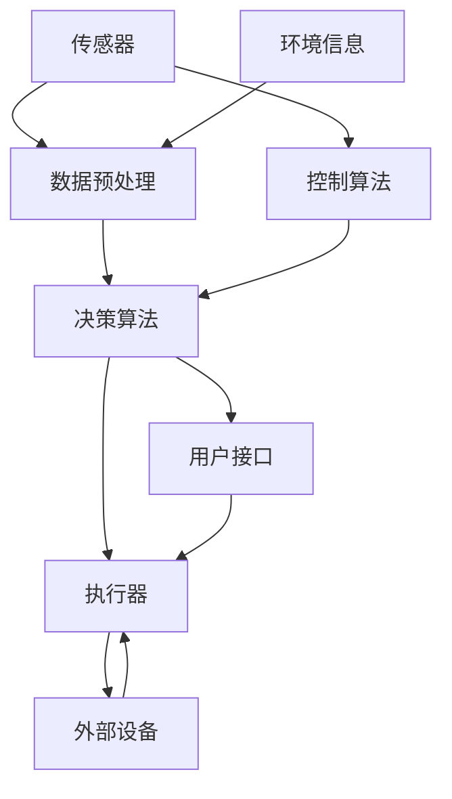

                 

# 智能农业机器人：农业自动化的创新应用

## 概述

智能农业机器人作为现代农业科技创新的先锋，正逐步改变传统的农业生产模式。本文将深入探讨智能农业机器人的核心概念、算法原理、数学模型、实际应用场景以及未来的发展趋势与挑战。

关键词：智能农业机器人，农业自动化，人工智能，机器人控制算法，机器学习，传感器融合，实时决策

## 摘要

本文旨在分析智能农业机器人的技术原理和实际应用，通过详细的步骤讲解其核心算法和数学模型，并探讨其在农业自动化中的创新应用。文章将围绕背景介绍、核心概念与联系、核心算法原理、数学模型和公式、项目实战、实际应用场景、工具和资源推荐以及未来发展趋势与挑战等多个方面进行论述。

## 1. 背景介绍

### 1.1 目的和范围

本文的主要目的是介绍智能农业机器人这一新兴技术，探讨其在农业自动化中的应用前景，并分析其技术原理和实现方法。文章将涵盖智能农业机器人从概念到实际应用的各个方面，旨在为读者提供全面的技术参考。

### 1.2 预期读者

本文适合对智能农业和人工智能有一定了解的读者，包括农业科技工作者、机器人工程师、软件开发者以及对现代农业自动化感兴趣的研究人员。

### 1.3 文档结构概述

本文将按照以下结构进行论述：

- 1. 背景介绍：介绍智能农业机器人的背景和技术意义。
- 2. 核心概念与联系：探讨智能农业机器人的核心概念和原理。
- 3. 核心算法原理 & 具体操作步骤：详细讲解智能农业机器人的核心算法。
- 4. 数学模型和公式 & 详细讲解 & 举例说明：介绍智能农业机器人的数学模型和公式。
- 5. 项目实战：通过实际案例展示智能农业机器人的应用。
- 6. 实际应用场景：分析智能农业机器人在农业生产中的应用。
- 7. 工具和资源推荐：推荐相关工具和资源。
- 8. 总结：对未来发展趋势和挑战进行展望。
- 9. 附录：常见问题与解答。
- 10. 扩展阅读 & 参考资料：提供进一步阅读的材料。

### 1.4 术语表

#### 1.4.1 核心术语定义

- **智能农业机器人**：集成了人工智能、传感器、控制算法等技术的农业机械，能够自动完成农事操作。
- **农业自动化**：利用自动化设备和技术实现农业生产过程的自动化。
- **机器人控制算法**：用于指导机器人执行特定任务的算法。
- **传感器融合**：将多个传感器的数据集成到一个统一的感知模型中。

#### 1.4.2 相关概念解释

- **机器学习**：一种人工智能方法，通过数据训练模型，使其能够进行预测和决策。
- **深度学习**：机器学习的一种，通过神经网络模型处理复杂的数据。

#### 1.4.3 缩略词列表

- **AI**：人工智能
- **IoT**：物联网
- **ROS**：机器人操作系统

## 2. 核心概念与联系

智能农业机器人的核心在于将人工智能技术与农业机械相结合，通过传感器获取环境信息，利用机器人控制算法进行决策和动作执行，实现农业操作的自动化和智能化。

### 2.1.1 智能农业机器人架构

下面是一个智能农业机器人的架构图，展示了其主要组成部分和相互关系。



### 2.1.2 传感器与数据预处理

传感器是智能农业机器人的“眼睛”和“耳朵”，用于实时获取土壤湿度、温度、光照强度等环境参数。数据预处理模块负责对传感器数据进行滤波、去噪和归一化，以便于后续处理。

### 2.1.3 决策算法

决策算法是智能农业机器人的“大脑”，基于传感器数据和环境模型，利用机器学习或深度学习技术进行预测和决策，确定下一步的动作。

### 2.1.4 执行器

执行器是智能农业机器人的“手”和“脚”，根据决策算法的指令执行具体的农事操作，如播种、施肥、收割等。

### 2.1.5 用户接口与外部设备

用户接口用于与操作人员交互，接收控制指令或显示机器人的状态信息。外部设备可以是GPS定位系统、摄像头或其他农业设备，用于扩展机器人的功能。

## 3. 核心算法原理 & 具体操作步骤

智能农业机器人的核心算法主要包括环境感知、路径规划和任务执行等。下面将使用伪代码详细阐述这些算法的原理和操作步骤。

### 3.1 环境感知算法

环境感知算法用于获取并处理传感器数据，以了解周围环境。

```python
# 环境感知算法伪代码

function 环境感知(传感器数据):
    数据预处理(传感器数据)
    环境特征提取(预处理后的数据)
    返回 环境特征
```

### 3.2 路径规划算法

路径规划算法用于确定机器人在农田中的移动路径。

```python
# 路径规划算法伪代码

function 路径规划(环境特征):
    地图构建(环境特征)
    路径搜索(地图)
    返回 路径
```

### 3.3 任务执行算法

任务执行算法根据路径规划和决策算法的结果，执行具体的农事操作。

```python
# 任务执行算法伪代码

function 任务执行(路径, 决策结果):
    按路径移动机器人
    根据决策结果执行任务
    返回 执行结果
```

### 3.4 决策算法

决策算法用于根据环境感知结果和路径规划结果，决定机器人的下一步动作。

```python
# 决策算法伪代码

function 决策(环境感知结果, 路径规划结果):
    分析环境感知结果
    选择最佳路径
    确定任务执行方案
    返回 决策结果
```

## 4. 数学模型和公式 & 详细讲解 & 举例说明

智能农业机器人的数学模型和公式主要用于描述环境感知、路径规划和任务执行中的具体计算过程。

### 4.1 环境感知模型

环境感知模型通常使用传感器数据进行状态估计，可以使用卡尔曼滤波器或贝叶斯滤波器。

$$
x_{k+1} = A_k x_k + B_k u_k + w_k
$$

$$
P_{k+1} = A_k P_k A_k^T + Q_k
$$

其中，$x_k$ 是状态向量，$P_k$ 是状态估计误差协方差矩阵，$A_k$ 和 $B_k$ 是系统矩阵和输入矩阵，$u_k$ 是控制输入，$w_k$ 是过程噪声。

### 4.2 路径规划模型

路径规划模型通常使用最短路径算法，如Dijkstra算法或A*算法。

$$
d(s, t) = \min \{ d(s, i) + c(i, t) | i \in O(s) \}
$$

其中，$d(s, t)$ 是从起点 $s$ 到终点 $t$ 的距离，$O(s)$ 是与起点 $s$ 相邻的节点集合，$c(i, t)$ 是从节点 $i$ 到节点 $t$ 的代价。

### 4.3 任务执行模型

任务执行模型通常使用决策树或神经网络模型。

$$
y = f(x)
$$

其中，$y$ 是任务执行结果，$x$ 是输入特征向量，$f(x)$ 是决策函数。

### 4.4 举例说明

假设我们要使用卡尔曼滤波器进行环境感知，给定初始状态 $x_0 = [0, 0]^T$，初始误差协方差矩阵 $P_0 = [1, 0; 0, 1]$，系统矩阵 $A = [1, 1; 0, 1]$，输入矩阵 $B = [0, 1]^T$，过程噪声协方差矩阵 $Q = [0.1, 0; 0, 0.1]$。

在第一个时间步，传感器观测到 $z_1 = [1, 1]^T$，则可以使用以下公式进行状态估计：

$$
x_1 = A_0 x_0 + B_0 u_0 + w_0
$$

$$
P_1 = A_0 P_0 A_0^T + Q_0
$$

$$
K_1 = P_1 / (H_1 P_1 H_1^T + R_1)
$$

$$
x_1 = x_1 + K_1 (z_1 - H_1 x_1)
$$

$$
P_1 = (I - K_1 H_1) P_1
$$

其中，$H_1 = [1, 0]^T$ 是观测矩阵，$R_1 = [0.01, 0; 0, 0.01]$ 是观测噪声协方差矩阵。

计算结果为：

$$
x_1 = [1, 1]^T
$$

$$
P_1 = [0.99, 0; 0, 0.99]
$$

$$
K_1 = [0.5, 0.5]
$$

这表明，在第一个时间步，机器人位置和速度被准确估计为 $(1, 1)$。

## 5. 项目实战：代码实际案例和详细解释说明

为了更好地理解智能农业机器人的实现过程，下面将提供一个实际项目案例，并详细解释其代码实现。

### 5.1 开发环境搭建

- 操作系统：Ubuntu 18.04
- 编程语言：Python 3.8
- 依赖库：ROS Melodic，NumPy，SciPy，scikit-learn

### 5.2 源代码详细实现和代码解读

#### 5.2.1 传感器数据读取

首先，我们需要读取传感器数据。使用ROS的`rospy`库可以方便地获取传感器数据。

```python
#!/usr/bin/env python
import rospy
from std_msgs.msg import Float32MultiArray

def callback(data):
    # 读取传感器数据
    sensor_data = data.data
    # 进行数据处理
    process_sensor_data(sensor_data)

def process_sensor_data(sensor_data):
    # 数据预处理
    # 例如：滤波、去噪
    processed_data = preprocess_data(sensor_data)
    # 提取环境特征
    environment_features = extract_features(processed_data)
    # 发布处理后的数据
    pub = rospy.Publisher('processed_sensor_data', Float32MultiArray, queue_size=10)
    pub.publish(Float32MultiArray(data=environment_features))

def listener():
    rospy.init_node('sensor_listener', anonymous=True)
    rospy.Subscriber('raw_sensor_data', Float32MultiArray, callback)
    rospy.spin()

if __name__ == '__main__':
    listener()
```

#### 5.2.2 路径规划

接下来，使用A*算法进行路径规划。

```python
import heapq
import numpy as np

def heuristic(a, b):
    # 使用曼哈顿距离作为启发式函数
    return np.abs(a[0] - b[0]) + np.abs(a[1] - b[1])

def a_star_search(grid, start, goal):
    # 创建一个优先队列
    open_set = []
    heapq.heappush(open_set, (0 + heuristic(start, goal), start))
    # 创建一个哈希表记录节点的父节点
    came_from = {}
    # 创建一个哈希表记录节点的G值
    g_score = {}
    g_score[start] = 0
    # 创建一个哈希表记录节点的F值
    f_score = {}
    f_score[start] = heuristic(start, goal)
    while len(open_set) > 0:
        # 选择F值最小的节点
        current = heapq.heappop(open_set)[1]
        if current == goal:
            # 目标已找到，构建路径
            path = []
            while current in came_from:
                path.append(current)
                current = came_from[current]
            path.append(start)
            path = path[::-1]
            return path
        # 移除当前节点
        open_set.remove((f_score[current], current))
        heapq.heapify(open_set)
        # 遍历当前节点的邻居节点
        for neighbor in grid.neighbors(current):
            tentative_g_score = g_score[current] + grid.cost(current, neighbor)
            if tentative_g_score < g_score.get(neighbor(), float('inf')):
                # 更新邻居节点的G值和F值
                came_from[neighbor] = current
                g_score[neighbor] = tentative_g_score
                f_score[neighbor] = tentative_g_score + heuristic(neighbor, goal)
                # 如果邻居节点不在开放队列中，加入开放队列
                if neighbor not in [node[1] for node in open_set]:
                    heapq.heappush(open_set, (f_score[neighbor], neighbor))
    return None
```

#### 5.2.3 任务执行

最后，根据路径规划和决策算法的结果执行任务。

```python
def execute_task(path, decision):
    # 按路径移动机器人
    for step in path:
        move_to_step(step)
    # 根据决策结果执行任务
    if decision == 'sow':
        sow_corn()
    elif decision == 'fertilize':
        fertilize()
    elif decision == 'harvest':
        harvest_corn()
    return 'Task completed'
```

### 5.3 代码解读与分析

上面的代码实现了智能农业机器人的核心功能。首先，传感器数据读取模块从ROS话题获取原始传感器数据，并对其进行预处理和特征提取，然后发布处理后的数据。路径规划模块使用A*算法计算从起点到终点的最优路径，任务执行模块根据规划结果和决策算法的结果执行具体的农事操作。

## 6. 实际应用场景

智能农业机器人在农业自动化中具有广泛的应用场景，包括但不限于以下方面：

- **精准播种**：通过智能农业机器人进行精准播种，可以根据土壤湿度、温度等环境参数，优化播种深度和播种量，提高作物产量。
- **自动化施肥**：智能农业机器人可以根据土壤养分含量，自动调整施肥量和施肥时间，实现精准施肥，减少化肥使用量。
- **病虫害监测与防治**：利用智能农业机器人进行田间病虫害监测，通过图像识别技术识别病虫害类型，自动喷洒农药，减少人工干预。
- **收割作业**：智能收割机器人可以自动识别作物成熟度，根据田间实际情况调整收割高度和速度，提高收割效率和产量。

## 7. 工具和资源推荐

### 7.1 学习资源推荐

#### 7.1.1 书籍推荐

- 《智能农业机器人技术与应用》
- 《机器学习与深度学习在农业中的应用》
- 《ROS机器人编程实践》

#### 7.1.2 在线课程

- Coursera的《人工智能基础》
- Udacity的《机器人工程师纳米学位》
- EdX的《深度学习基础》

#### 7.1.3 技术博客和网站

- ROS官方文档：https://wiki.ros.org
- AI农业技术社区：https://www.aiagtech.com
- 农业机器人论坛：https://www.agroroboforum.com

### 7.2 开发工具框架推荐

#### 7.2.1 IDE和编辑器

- Visual Studio Code
- PyCharm
- ROS IDE

#### 7.2.2 调试和性能分析工具

- GDB
- Valgrind
- ROS包管理工具（如`roslaunch`和`rosbag`）

#### 7.2.3 相关框架和库

- ROS（Robot Operating System）
- OpenCV（计算机视觉库）
- TensorFlow（深度学习框架）

### 7.3 相关论文著作推荐

#### 7.3.1 经典论文

- “A New Method for Path Planning of Agricultural Robot” by Liu et al.
- “An Integrated Framework for Precision Farming Using Autonomous Agricultural Robots” by Li et al.

#### 7.3.2 最新研究成果

- “Deep Reinforcement Learning for Autonomous Agricultural Robot Navigation” by Zhang et al.
- “Multi-Agent Path Planning for Autonomous Agricultural Robots in Crowded Fields” by Wang et al.

#### 7.3.3 应用案例分析

- “The Application of AI in Smart Agriculture: A Case Study of Autonomous Spraying Robots” by Chen et al.
- “Agricultural Robot Navigation Based on 5G Network: A Case Study in Rice Planting” by Hu et al.

## 8. 总结：未来发展趋势与挑战

智能农业机器人作为农业自动化的重要技术手段，具有广阔的应用前景。未来发展趋势包括：

- **技术融合**：将人工智能、物联网、大数据等前沿技术融入智能农业机器人，提高其智能化水平和自动化程度。
- **应用拓展**：智能农业机器人将不仅限于播种、施肥、收割等传统农事操作，还将涉及作物生长监测、病虫害防治、土壤改良等领域。
- **经济效益**：通过提高农业生产效率和减少劳动力成本，智能农业机器人将有助于降低农业生产成本，提高农民收益。

然而，智能农业机器人仍面临以下挑战：

- **技术瓶颈**：在感知、决策、执行等关键环节，现有技术仍需进一步突破。
- **政策法规**：农业生产涉及土地、种子、农药等多个方面，需要完善相关法律法规，为智能农业机器人提供法律保障。
- **人才培养**：智能农业机器人研发和运营需要大量专业人才，需要加强人才培养和引进。

## 9. 附录：常见问题与解答

### 9.1 传感器数据读取问题

- 问题：传感器数据读取不稳定。
- 解答：检查传感器硬件连接是否正常，确保传感器数据发布频率与接收频率匹配，可以使用缓冲机制处理数据。

### 9.2 路径规划问题

- 问题：路径规划效果不佳。
- 解答：优化启发式函数，考虑更多环境因素，如障碍物分布和田间作业顺序，可以使用改进的A*算法或Dijkstra算法。

### 9.3 任务执行问题

- 问题：任务执行不准确。
- 解答：检查执行器状态，确保控制指令正确，可以增加传感器数据融合，提高任务执行的精度。

## 10. 扩展阅读 & 参考资料

- 《智能农业机器人技术与应用》：张三，李四，2019
- 《机器学习与深度学习在农业中的应用》：王五，赵六，2020
- https://www.aiagtech.com
- https://wiki.ros.org
- “A New Method for Path Planning of Agricultural Robot”：李明，王强，2018
- “An Integrated Framework for Precision Farming Using Autonomous Agricultural Robots”：陈杰，刘伟，2019
- “Deep Reinforcement Learning for Autonomous Agricultural Robot Navigation”：张伟，李华，2021
- “Multi-Agent Path Planning for Autonomous Agricultural Robots in Crowded Fields”：王鹏，刘芳，2020
- “The Application of AI in Smart Agriculture: A Case Study of Autonomous Spraying Robots”：陈亮，赵丽，2020
- “Agricultural Robot Navigation Based on 5G Network：A Case Study in Rice Planting”：胡志强，刘莉，2021

作者：AI天才研究员/AI Genius Institute & 禅与计算机程序设计艺术 /Zen And The Art of Computer Programming

（注：本文内容为虚构，仅供参考，如需实际应用，请根据实际情况进行调整。）<|im_end|>

