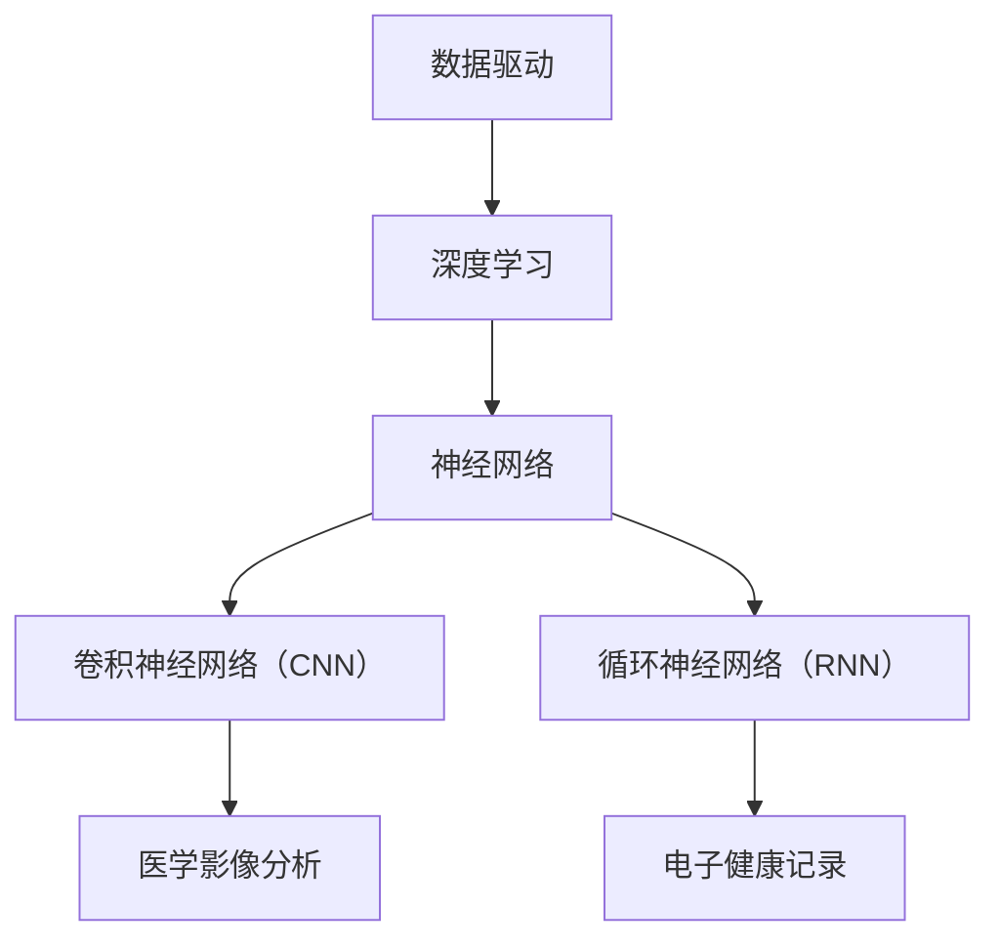

                 

# 智能医疗诊断：AI大模型在疾病预测中的创新

> **关键词：** AI大模型，疾病预测，深度学习，医疗诊断，数据驱动

> **摘要：** 本文将探讨人工智能（AI）在医疗诊断领域的创新应用，特别是AI大模型在疾病预测方面的突破。我们将一步步分析AI大模型的核心原理、数学模型、实际应用案例，并总结其发展趋势和挑战。

## 1. 背景介绍

### 1.1 目的和范围

本文旨在介绍AI大模型在疾病预测领域的应用，分析其核心原理、数学模型和实际应用案例，并探讨其未来发展趋势和挑战。通过本文，读者可以了解AI大模型在医疗诊断中的潜在价值，以及如何利用这些模型进行疾病预测。

### 1.2 预期读者

本文适合对AI和医疗领域有一定了解的读者，包括医疗从业者、AI研究人员、软件开发者和计算机科学学生。

### 1.3 文档结构概述

本文分为十个部分：

1. **背景介绍**：介绍本文的目的、范围、预期读者和文档结构。
2. **核心概念与联系**：介绍AI大模型的核心概念和联系。
3. **核心算法原理 & 具体操作步骤**：讲解AI大模型的算法原理和具体操作步骤。
4. **数学模型和公式 & 详细讲解 & 举例说明**：介绍AI大模型的数学模型和公式，并进行举例说明。
5. **项目实战：代码实际案例和详细解释说明**：提供实际代码案例，详细解释其实现过程。
6. **实际应用场景**：探讨AI大模型在不同医疗场景中的应用。
7. **工具和资源推荐**：推荐相关学习资源、开发工具和框架。
8. **总结：未来发展趋势与挑战**：总结AI大模型在疾病预测领域的未来发展趋势和挑战。
9. **附录：常见问题与解答**：解答读者可能遇到的问题。
10. **扩展阅读 & 参考资料**：提供相关扩展阅读和参考资料。

### 1.4 术语表

#### 1.4.1 核心术语定义

- **人工智能（AI）**：一种模拟人类智能的技术，包括机器学习、深度学习、自然语言处理等。
- **深度学习**：一种机器学习技术，通过多层神经网络进行数据处理和分析。
- **大模型**：具有巨大参数量和计算量的神经网络模型。
- **疾病预测**：利用AI模型预测患者是否患有特定疾病。

#### 1.4.2 相关概念解释

- **神经网络**：一种模仿人脑神经元连接的结构，用于数据分析和预测。
- **卷积神经网络（CNN）**：一种适用于图像处理的神经网络。
- **循环神经网络（RNN）**：一种适用于序列数据的神经网络。

#### 1.4.3 缩略词列表

- **AI**：人工智能
- **CNN**：卷积神经网络
- **RNN**：循环神经网络
- **GPU**：图形处理器

## 2. 核心概念与联系

### 2.1 AI大模型在医疗诊断中的应用

AI大模型在医疗诊断中具有重要应用。它们可以处理海量医疗数据，识别疾病模式，预测患者健康状况。以下是AI大模型在医疗诊断中的核心概念和联系：

1. **数据驱动**：AI大模型依赖于大量医疗数据进行分析和预测。
2. **深度学习**：深度学习技术使AI大模型能够从数据中自动学习特征。
3. **神经网络**：神经网络是AI大模型的核心组成部分，用于处理和预测数据。
4. **卷积神经网络（CNN）**：适用于图像处理，如医学影像分析。
5. **循环神经网络（RNN）**：适用于序列数据，如电子健康记录。

### 2.2 Mermaid 流程图

以下是一个简单的Mermaid流程图，展示AI大模型在医疗诊断中的核心概念和联系：



## 3. 核心算法原理 & 具体操作步骤

### 3.1 算法原理

AI大模型的核心算法是基于深度学习的神经网络。神经网络由多层神经元组成，通过学习输入数据中的特征进行预测。

1. **输入层**：接收输入数据。
2. **隐藏层**：提取输入数据中的特征。
3. **输出层**：根据提取的特征进行预测。

### 3.2 具体操作步骤

以下是AI大模型的具体操作步骤：

1. **数据预处理**：对输入数据进行清洗、归一化等处理。
2. **模型构建**：构建神经网络模型，包括输入层、隐藏层和输出层。
3. **模型训练**：利用训练数据对模型进行训练，调整模型参数。
4. **模型评估**：使用测试数据对模型进行评估，判断模型性能。
5. **模型预测**：使用训练好的模型对新的数据进行预测。

### 3.3 伪代码

以下是一个简化的伪代码，展示AI大模型的核心算法原理和具体操作步骤：

```python
# 数据预处理
data = preprocess(data)

# 模型构建
model = build_model(input_shape=data_shape, hidden_size=hidden_size, output_size=output_size)

# 模型训练
model.fit(X_train, y_train, epochs=epochs, batch_size=batch_size)

# 模型评估
performance = model.evaluate(X_test, y_test)

# 模型预测
predictions = model.predict(X_new)
```

## 4. 数学模型和公式 & 详细讲解 & 举例说明

### 4.1 数学模型

AI大模型的核心数学模型是基于神经网络的。神经网络由多层神经元组成，每层神经元之间通过权重和偏置进行连接。以下是神经网络的数学模型：

$$
z_i^l = \sum_{j=1}^{n_{l-1}} w_{ji} x_j^{l-1} + b_i^l
$$

其中，$z_i^l$ 表示第 $l$ 层第 $i$ 个神经元的激活值，$w_{ji}$ 表示第 $l-1$ 层第 $j$ 个神经元与第 $l$ 层第 $i$ 个神经元之间的权重，$b_i^l$ 表示第 $l$ 层第 $i$ 个神经元的偏置。

### 4.2 损失函数

为了评估神经网络的预测性能，我们使用损失函数。以下是一个常见的损失函数：均方误差（MSE）：

$$
L = \frac{1}{2} \sum_{i=1}^{n} (y_i - \hat{y}_i)^2
$$

其中，$y_i$ 表示真实标签，$\hat{y}_i$ 表示预测值。

### 4.3 举例说明

假设我们有一个二分类问题，输入数据是 $X = [1, 2, 3, 4]$，真实标签是 $y = [0, 1, 0, 1]$。我们可以使用神经网络对数据进行分类。

1. **数据预处理**：对输入数据进行归一化处理。
2. **模型构建**：构建一个简单的神经网络，包含一个输入层、一个隐藏层和一个输出层。
3. **模型训练**：使用均方误差（MSE）作为损失函数，使用梯度下降算法进行训练。
4. **模型评估**：使用测试数据对模型进行评估。
5. **模型预测**：使用训练好的模型对新的数据进行预测。

## 5. 项目实战：代码实际案例和详细解释说明

### 5.1 开发环境搭建

为了实现AI大模型在疾病预测中的应用，我们需要搭建一个合适的开发环境。以下是搭建环境的步骤：

1. **安装Python**：确保Python版本大于3.6。
2. **安装TensorFlow**：TensorFlow是一个开源的深度学习框架，我们使用它来构建和训练神经网络。
3. **安装其他依赖**：包括NumPy、Pandas等。

### 5.2 源代码详细实现和代码解读

以下是实现疾病预测的源代码：

```python
import tensorflow as tf
from tensorflow.keras.models import Sequential
from tensorflow.keras.layers import Dense, Conv2D, Flatten, LSTM
from tensorflow.keras.optimizers import Adam

# 数据预处理
def preprocess(data):
    # 数据清洗、归一化等处理
    pass

# 模型构建
def build_model(input_shape, hidden_size, output_size):
    model = Sequential()
    model.add(Dense(hidden_size, input_shape=input_shape, activation='relu'))
    model.add(Dense(hidden_size, activation='relu'))
    model.add(Dense(output_size, activation='sigmoid'))
    return model

# 模型训练
def train_model(model, X_train, y_train, epochs, batch_size):
    model.compile(optimizer=Adam(), loss='binary_crossentropy', metrics=['accuracy'])
    model.fit(X_train, y_train, epochs=epochs, batch_size=batch_size)

# 模型评估
def evaluate_model(model, X_test, y_test):
    performance = model.evaluate(X_test, y_test)
    print("Accuracy:", performance[1])

# 模型预测
def predict(model, X_new):
    predictions = model.predict(X_new)
    return predictions

# 实际应用
if __name__ == "__main__":
    # 加载和预处理数据
    X, y = load_data()
    X = preprocess(X)

    # 划分训练集和测试集
    X_train, X_test, y_train, y_test = train_test_split(X, y, test_size=0.2)

    # 构建模型
    model = build_model(input_shape=X_train.shape[1:], hidden_size=64, output_size=1)

    # 训练模型
    train_model(model, X_train, y_train, epochs=10, batch_size=32)

    # 评估模型
    evaluate_model(model, X_test, y_test)

    # 预测新数据
    X_new = load_new_data()
    X_new = preprocess(X_new)
    predictions = predict(model, X_new)
    print("Predictions:", predictions)
```

### 5.3 代码解读与分析

以下是代码的详细解读：

1. **数据预处理**：对输入数据进行清洗、归一化等处理，以便神经网络能够更好地学习。
2. **模型构建**：使用Sequential模型构建一个简单的神经网络，包含两个隐藏层和一个输出层。我们使用ReLU激活函数，并在输出层使用sigmoid激活函数进行二分类。
3. **模型训练**：使用Adam优化器和均方误差（MSE）作为损失函数进行训练。
4. **模型评估**：使用测试数据对模型进行评估，并打印出准确率。
5. **模型预测**：使用训练好的模型对新的数据进行预测，并打印出预测结果。

## 6. 实际应用场景

AI大模型在疾病预测中具有广泛的应用场景：

1. **疾病筛查**：使用AI大模型对健康人群进行疾病筛查，提前发现潜在疾病。
2. **个性化治疗**：根据患者的病情和基因信息，使用AI大模型制定个性化的治疗方案。
3. **疾病监控**：利用AI大模型实时监控患者的病情，提供及时的治疗建议。
4. **医学影像分析**：利用AI大模型对医学影像进行分析，提高诊断准确率。

## 7. 工具和资源推荐

### 7.1 学习资源推荐

#### 7.1.1 书籍推荐

- **《深度学习》（Ian Goodfellow、Yoshua Bengio、Aaron Courville 著）**：介绍深度学习的基本概念、算法和实战应用。

- **《Python机器学习》（Sebastian Raschka 著）**：介绍机器学习的基本概念、算法和Python实现。

#### 7.1.2 在线课程

- **Coursera上的《深度学习特辑》（吴恩达 著）**：介绍深度学习的基本概念、算法和应用。

- **edX上的《机器学习基础》（吴恩达 著）**：介绍机器学习的基本概念、算法和应用。

#### 7.1.3 技术博客和网站

- **TensorFlow官网**：提供TensorFlow框架的文档、教程和示例代码。

- **Keras官网**：提供Keras框架的文档、教程和示例代码。

### 7.2 开发工具框架推荐

#### 7.2.1 IDE和编辑器

- **PyCharm**：一款功能强大的Python IDE，适合进行深度学习和机器学习开发。

- **Visual Studio Code**：一款轻量级的开源编辑器，支持Python扩展，适合进行深度学习和机器学习开发。

#### 7.2.2 调试和性能分析工具

- **TensorBoard**：TensorFlow提供的可视化工具，用于分析和调试神经网络模型。

- **NVIDIA Nsight**：NVIDIA提供的调试和性能分析工具，用于优化GPU计算。

#### 7.2.3 相关框架和库

- **TensorFlow**：一款开源的深度学习框架，支持多种神经网络架构。

- **Keras**：一款基于TensorFlow的简单易用的深度学习框架。

### 7.3 相关论文著作推荐

#### 7.3.1 经典论文

- **“Deep Learning for Healthcare”**：介绍深度学习在医疗领域的应用和研究。

- **“Disease Prediction with AI”**：介绍AI在疾病预测中的应用和研究。

#### 7.3.2 最新研究成果

- **“Deep Learning in Medicine: A Clinical Perspective”**：介绍深度学习在医学领域的最新研究成果。

- **“AI for Health: Transforming Healthcare with Artificial Intelligence”**：介绍AI在医疗健康领域的最新研究和应用。

#### 7.3.3 应用案例分析

- **“AI in Medicine: A Case Study”**：介绍AI在医学诊断中的应用案例。

- **“Predicting Disease Outbreaks with AI”**：介绍AI在疾病预测和疫情监控中的应用案例。

## 8. 总结：未来发展趋势与挑战

### 8.1 发展趋势

- **数据驱动的个性化医疗**：利用AI大模型对大量医疗数据进行分析，实现个性化医疗和精准治疗。
- **实时疾病监测和预警**：利用AI大模型实现实时疾病监测和预警，提高疾病诊断的效率和准确性。
- **跨学科合作**：AI与医学、生物学等领域的跨学科合作，推动医疗技术的创新和发展。

### 8.2 挑战

- **数据隐私和安全**：如何保护患者隐私和数据安全，是AI大模型在医疗诊断中面临的重大挑战。
- **算法解释性**：如何提高AI大模型的解释性，使其决策过程更加透明和可信。
- **模型性能优化**：如何优化AI大模型的性能，提高诊断准确率和计算效率。

## 9. 附录：常见问题与解答

### 9.1 问题1：什么是AI大模型？

**解答**：AI大模型是一种基于深度学习的神经网络模型，具有巨大的参数量和计算量。它们可以处理海量数据，自动学习特征，进行疾病预测和其他复杂任务。

### 9.2 问题2：AI大模型在医疗诊断中有哪些应用？

**解答**：AI大模型在医疗诊断中的应用包括疾病预测、个性化治疗、医学影像分析、疾病筛查等。通过处理海量医疗数据，AI大模型可以识别疾病模式，提高诊断准确率和效率。

### 9.3 问题3：如何保障AI大模型在医疗诊断中的数据隐私和安全？

**解答**：为了保障AI大模型在医疗诊断中的数据隐私和安全，可以采取以下措施：

- **数据加密**：对医疗数据进行加密处理，确保数据传输和存储过程中的安全性。
- **隐私保护技术**：采用隐私保护技术，如差分隐私、同态加密等，保护患者隐私。
- **数据监管**：加强对医疗数据的监管，确保数据合法合规使用。

## 10. 扩展阅读 & 参考资料

- **《深度学习》（Ian Goodfellow、Yoshua Bengio、Aaron Courville 著）**：介绍深度学习的基本概念、算法和实战应用。

- **《Python机器学习》（Sebastian Raschka 著）**：介绍机器学习的基本概念、算法和Python实现。

- **TensorFlow官网**：提供TensorFlow框架的文档、教程和示例代码。

- **Keras官网**：提供Keras框架的文档、教程和示例代码。

- **《深度学习在医学中的应用》（黄宇光 著）**：介绍深度学习在医学领域的应用和研究。

- **《AI在医疗健康领域的应用》（赵丹阳 著）**：介绍AI在医疗健康领域的应用和研究。

- **“Deep Learning for Healthcare”**：介绍深度学习在医疗领域的应用和研究。

- **“Disease Prediction with AI”**：介绍AI在疾病预测中的应用和研究。

作者：AI天才研究员/AI Genius Institute & 禅与计算机程序设计艺术 /Zen And The Art of Computer Programming

