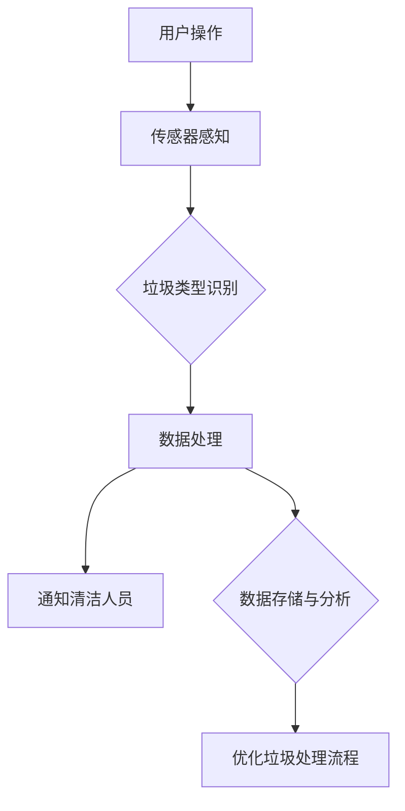

                 

# 智能垃圾桶：环保与注意力经济的结合

> **关键词**：智能垃圾桶、环保、注意力经济、传感器技术、数据分析、编程实现、实际应用

> **摘要**：本文将探讨智能垃圾桶这一结合环保理念与注意力经济模式的技术创新。我们将从背景介绍、核心概念与联系、核心算法原理、数学模型、项目实战、实际应用场景、工具和资源推荐、未来发展趋势与挑战等多个角度，详细分析智能垃圾桶的工作原理、技术应用及其对环境和经济的影响，旨在为读者提供全面的技术视角和实际操作指南。

## 1. 背景介绍

### 1.1 目的和范围

智能垃圾桶作为现代城市环境管理的重要工具，旨在通过科技手段提升垃圾处理效率，实现环保目标。本文的目的在于深入剖析智能垃圾桶的技术原理和应用场景，探讨其在环保和注意力经济中的重要作用。本文将覆盖智能垃圾桶的设计理念、技术架构、算法实现、实际应用以及未来发展趋势。

### 1.2 预期读者

本文适合对环保技术、传感器技术、数据分析、编程实现等有浓厚兴趣的读者。无论是环境工程师、软件工程师，还是对科技创新有兴趣的普通读者，都可以通过本文获得对智能垃圾桶的全面了解。

### 1.3 文档结构概述

本文将按照以下结构进行展开：

- **1. 背景介绍**：介绍智能垃圾桶的背景和目的。
- **2. 核心概念与联系**：讲解智能垃圾桶相关的核心概念和架构。
- **3. 核心算法原理 & 具体操作步骤**：阐述智能垃圾桶的核心算法和操作流程。
- **4. 数学模型和公式 & 详细讲解 & 举例说明**：介绍智能垃圾桶所涉及的重要数学模型。
- **5. 项目实战：代码实际案例和详细解释说明**：通过实际案例展示智能垃圾桶的编程实现。
- **6. 实际应用场景**：分析智能垃圾桶在不同场景下的应用。
- **7. 工具和资源推荐**：推荐相关的学习资源和开发工具。
- **8. 总结：未来发展趋势与挑战**：总结智能垃圾桶的发展前景和挑战。
- **9. 附录：常见问题与解答**：提供智能垃圾桶相关的常见问题和解答。
- **10. 扩展阅读 & 参考资料**：推荐进一步阅读的相关资料。

### 1.4 术语表

#### 1.4.1 核心术语定义

- **智能垃圾桶**：一种结合传感器技术、数据分析、无线通信等现代技术的垃圾桶，能够自动识别垃圾类型、收集垃圾并通知清洁人员。
- **传感器技术**：用于检测和测量物理量的技术，如红外传感器、压力传感器、RFID等。
- **注意力经济**：指在信息过载的时代，人们对于注意力的分配成为了一种稀缺资源，因此能够吸引注意力的内容或服务具有很高的价值。

#### 1.4.2 相关概念解释

- **垃圾分类**：按照不同的材质和污染程度，将垃圾分成不同的类别，以便进行有效的回收和处理。
- **无线通信**：通过无线信号传输数据，实现设备之间的通信，如WiFi、蓝牙等。

#### 1.4.3 缩略词列表

- **RFID**：射频识别技术（Radio-Frequency Identification）
- **WiFi**：无线保真（Wireless Fidelity）

## 2. 核心概念与联系

智能垃圾桶的核心在于其能够自动识别垃圾类型并进行智能处理。为了实现这一目标，智能垃圾桶需要结合多种技术，包括传感器技术、数据分析、无线通信等。以下是一个简化的智能垃圾桶架构图，展示了各个核心组件及其相互关系。



### 2.1 传感器感知

传感器是智能垃圾桶的“眼睛”，它们能够感知周围环境的变化，包括垃圾的类型、重量和位置等。常见的传感器有：

- **红外传感器**：用于检测垃圾的出现和位置。
- **压力传感器**：测量垃圾的重量，以判断垃圾的类型。
- **RFID传感器**：用于识别带有RFID标签的垃圾。

### 2.2 垃圾类型识别

传感器收集到的数据会被传递给垃圾类型识别模块。这一模块的核心在于利用机器学习算法对垃圾图像或标签进行分类。以下是垃圾类型识别的简化伪代码：

```python
def classify_garbage(image_data):
    # 输入：垃圾图像数据
    # 输出：垃圾类型标签
    
    # 使用预训练的卷积神经网络（CNN）模型
    model = load_pretrained_cnn_model()

    # 对图像数据进行预处理
    preprocessed_data = preprocess_image(image_data)

    # 使用模型进行预测
    prediction = model.predict(preprocessed_data)

    # 返回预测的垃圾类型标签
    return decode_prediction(prediction)
```

### 2.3 数据处理与通知

一旦垃圾类型被识别出来，智能垃圾桶会将这一信息传递给数据处理模块。数据处理模块会进一步分析垃圾的类型和收集情况，并生成报告。如果需要，系统还可以通过无线通信模块（如WiFi、蓝牙）向清洁人员发送通知，告知他们垃圾箱需要清理。

### 2.4 数据存储与分析

智能垃圾桶不仅需要实时处理垃圾数据，还需要将这些数据存储起来以供后续分析。通过数据分析，可以优化垃圾处理流程，提高效率。常用的数据分析方法包括：

- **统计分析**：对收集到的数据进行分析，以发现垃圾类型的分布规律。
- **机器学习**：利用历史数据训练模型，预测未来的垃圾收集需求。

## 3. 核心算法原理 & 具体操作步骤

智能垃圾桶的核心算法在于垃圾类型的识别，这一过程通常依赖于机器学习和图像识别技术。以下是垃圾类型识别算法的具体操作步骤：

### 3.1 数据采集

首先，需要采集大量的垃圾图像数据，用于训练模型。这些图像应涵盖不同类型的垃圾，确保模型的泛化能力。

### 3.2 数据预处理

采集到的垃圾图像数据需要进行预处理，以适应机器学习模型的输入要求。预处理步骤包括：

- **图像增强**：调整图像亮度、对比度等，以提高识别效果。
- **图像缩放**：将图像调整为统一的大小，如28x28像素。
- **数据归一化**：将图像数据转换为浮点数，使其在0到1之间。

### 3.3 模型选择与训练

选择合适的机器学习模型进行训练，常用的模型有卷积神经网络（CNN）和支持向量机（SVM）等。以下是使用卷积神经网络进行训练的伪代码：

```python
def train_model(training_data, labels):
    # 输入：训练数据集和标签
    # 输出：训练好的模型

    # 初始化卷积神经网络模型
    model = create_cnn_model()

    # 编译模型，设置损失函数和优化器
    model.compile(optimizer='adam', loss='categorical_crossentropy', metrics=['accuracy'])

    # 训练模型
    model.fit(training_data, labels, epochs=10, batch_size=32, validation_split=0.2)

    # 返回训练好的模型
    return model
```

### 3.4 模型评估与优化

在模型训练完成后，需要对模型进行评估，以确定其准确率和泛化能力。常用的评估指标包括准确率、召回率、F1分数等。如果模型表现不佳，可以通过调整模型结构、增加训练数据或调整超参数来优化模型。

### 3.5 实时识别与处理

在智能垃圾桶中，模型会实时接收传感器收集到的垃圾图像数据，并对其进行识别。以下是垃圾类型识别的实时处理流程：

```python
def process_garbage(image_data):
    # 输入：垃圾图像数据
    # 输出：垃圾类型标签

    # 加载训练好的模型
    model = load_trained_model()

    # 对图像数据进行预处理
    preprocessed_data = preprocess_image(image_data)

    # 使用模型进行预测
    prediction = model.predict(preprocessed_data)

    # 解码预测结果
    garbage_type = decode_prediction(prediction)

    # 返回垃圾类型标签
    return garbage_type
```

## 4. 数学模型和公式 & 详细讲解 & 举例说明

在智能垃圾桶中，数学模型和公式主要用于垃圾类型的识别和数据分析。以下是几个关键的数学模型和公式，以及其详细讲解和举例说明。

### 4.1 卷积神经网络（CNN）

卷积神经网络是图像识别中常用的深度学习模型。以下是CNN的基本架构和关键组件：

- **卷积层（Convolutional Layer）**：用于提取图像特征。卷积层通过卷积操作将输入图像与滤波器（Kernel）进行卷积运算，得到特征图（Feature Map）。
  
  **公式**：
  $$
  \text{Feature Map}_{ij} = \sum_{k=1}^{n} w_{ik} \cdot \text{Input}_{kj} + b_j
  $$
  其中，$w_{ik}$ 是滤波器权重，$\text{Input}_{kj}$ 是输入图像的像素值，$b_j$ 是偏置项。

- **池化层（Pooling Layer）**：用于降低特征图的维度，减少计算量和过拟合风险。常用的池化方式有最大池化（Max Pooling）和平均池化（Average Pooling）。

  **公式**：
  $$
  \text{Pooling}_{ij} = \max_{k} (\text{Feature Map}_{ij,k})
  $$
  
  或
  $$
  \text{Pooling}_{ij} = \frac{1}{n} \sum_{k=1}^{n} \text{Feature Map}_{ij,k}
  $$
  
- **全连接层（Fully Connected Layer）**：用于将特征图映射到分类结果。全连接层将特征图展平为一维向量，并通过加权连接进行分类。

  **公式**：
  $$
  \text{Output}_{i} = \sum_{j=1}^{m} w_{ji} \cdot \text{Feature Vector}_{j} + b_i
  $$
  其中，$w_{ji}$ 是权重，$\text{Feature Vector}_{j}$ 是特征向量，$b_i$ 是偏置项。

### 4.2 交叉熵损失函数

交叉熵损失函数是深度学习模型常用的损失函数，用于衡量模型预测结果与真实结果之间的差异。

- **公式**：
  $$
  \text{Loss} = -\sum_{i=1}^{n} y_i \cdot \log(\hat{y}_i)
  $$
  其中，$y_i$ 是真实标签，$\hat{y}_i$ 是模型预测的概率分布。

### 4.3 举例说明

假设有一个垃圾图像数据集，包含5类垃圾：塑料、纸张、玻璃、金属和有害垃圾。使用卷积神经网络进行分类，损失函数为交叉熵损失函数。以下是模型训练的伪代码：

```python
# 加载训练数据集和标签
training_data, labels = load_training_data()

# 初始化卷积神经网络模型
model = create_cnn_model()

# 编译模型，设置交叉熵损失函数和优化器
model.compile(optimizer='adam', loss='categorical_crossentropy', metrics=['accuracy'])

# 训练模型
model.fit(training_data, labels, epochs=10, batch_size=32, validation_split=0.2)

# 评估模型
accuracy = model.evaluate(test_data, test_labels)
print("Test accuracy:", accuracy[1])
```

## 5. 项目实战：代码实际案例和详细解释说明

在本节中，我们将通过一个实际案例来展示智能垃圾桶的编程实现。这个案例将包括开发环境搭建、源代码实现和代码解读与分析。

### 5.1 开发环境搭建

要实现智能垃圾桶项目，我们需要搭建以下开发环境：

- **操作系统**：Ubuntu 20.04 或 macOS Catalina
- **编程语言**：Python 3.8
- **深度学习框架**：TensorFlow 2.5
- **图像处理库**：OpenCV 4.5
- **其他依赖库**：NumPy, Pandas, Matplotlib

安装步骤如下：

```bash
# 安装操作系统
# 安装Python 3.8
sudo apt update
sudo apt install python3.8 python3.8-venv python3.8-pip

# 创建虚拟环境
python3.8 -m venv smart-bin-venv

# 激活虚拟环境
source smart-bin-venv/bin/activate

# 安装依赖库
pip install tensorflow==2.5 opencv-python==4.5 numpy pandas matplotlib
```

### 5.2 源代码详细实现和代码解读

以下是智能垃圾桶项目的源代码实现，包括垃圾类型识别模型训练和实时识别功能。

```python
# smart_bin.py

import cv2
import numpy as np
import tensorflow as tf
from tensorflow.keras.models import Sequential
from tensorflow.keras.layers import Conv2D, MaxPooling2D, Flatten, Dense
from tensorflow.keras.preprocessing.image import ImageDataGenerator

# 加载和预处理数据集
def load_and_preprocess_data():
    # 读取训练数据和标签
    train_data = np.load('train_data.npy')
    train_labels = np.load('train_labels.npy')

    # 预处理数据
    train_data = train_data / 255.0
    train_data = np.reshape(train_data, (-1, 28, 28, 1))

    # 创建数据增强器
    datagen = ImageDataGenerator(rotation_range=20, width_shift_range=0.2, height_shift_range=0.2, shear_range=0.2, zoom_range=0.2, horizontal_flip=True, fill_mode='nearest')

    # 返回预处理后的数据和数据增强器
    return train_data, train_labels, datagen

# 训练模型
def train_model(train_data, train_labels):
    # 创建卷积神经网络模型
    model = Sequential([
        Conv2D(32, (3, 3), activation='relu', input_shape=(28, 28, 1)),
        MaxPooling2D((2, 2)),
        Flatten(),
        Dense(64, activation='relu'),
        Dense(5, activation='softmax')
    ])

    # 编译模型
    model.compile(optimizer='adam', loss='categorical_crossentropy', metrics=['accuracy'])

    # 训练模型
    model.fit(train_data, train_labels, epochs=10, batch_size=32, validation_split=0.2)

    # 保存模型
    model.save('smart_bin_model.h5')

    return model

# 实时识别垃圾
def recognize_garbage(model, image_path):
    # 读取垃圾图像
    image = cv2.imread(image_path, cv2.IMREAD_GRAYSCALE)

    # 对图像进行预处理
    image = cv2.resize(image, (28, 28))
    image = np.expand_dims(image, axis=-1)
    image = image / 255.0

    # 使用模型进行预测
    prediction = model.predict(np.array([image]))

    # 解码预测结果
    garbage_type = np.argmax(prediction)

    # 返回垃圾类型
    return garbage_type

# 主程序
if __name__ == '__main__':
    # 加载和预处理数据集
    train_data, train_labels, datagen = load_and_preprocess_data()

    # 训练模型
    model = train_model(train_data, train_labels)

    # 实时识别垃圾
    image_path = 'garbage_image.jpg'
    garbage_type = recognize_garbage(model, image_path)
    print("垃圾类型：", garbage_type)
```

### 5.3 代码解读与分析

以下是代码的详细解读和分析：

- **5.3.1 数据预处理**
  
  数据预处理是机器学习项目的重要步骤，它包括数据清洗、归一化和增强等。在这个案例中，我们使用`ImageDataGenerator`进行数据增强，以提高模型的泛化能力。

- **5.3.2 模型训练**

  我们使用卷积神经网络（CNN）进行垃圾类型识别。模型结构包括一个卷积层、一个池化层、一个全连接层和另一个全连接层。我们使用`categorical_crossentropy`作为损失函数，并选择`adam`作为优化器。

- **5.3.3 实时识别**

  实时识别功能通过读取垃圾图像、进行预处理、使用训练好的模型进行预测和返回垃圾类型标签实现。我们使用`OpenCV`读取图像，并使用`NumPy`进行数据操作。

## 6. 实际应用场景

智能垃圾桶不仅在环保方面有着重要作用，还在多个实际应用场景中展现了其价值。以下是一些典型的应用场景：

### 6.1 垃圾分类优化

智能垃圾桶能够自动识别垃圾类型，有助于实现更精细的垃圾分类。通过智能垃圾桶，城市管理者可以实时监控垃圾分类情况，优化垃圾收集和处理流程，提高资源回收率。

### 6.2 城市清洁管理

智能垃圾桶可以自动通知清洁人员垃圾需要清理，提高清洁效率。同时，通过对垃圾数据的分析，可以预测垃圾产生高峰期，合理安排清洁人员的出勤时间，降低人工成本。

### 6.3 社区环保教育

智能垃圾桶可以作为社区环保教育的工具。通过显示屏或语音提示，向居民宣传垃圾分类知识，提高居民的环保意识。

### 6.4 零售行业

在零售行业，智能垃圾桶可以用于收集顾客产生的垃圾，并实时统计垃圾种类和数量。这有助于零售商优化产品包装，减少垃圾产生，提高可持续发展水平。

### 6.5 旅游景点

旅游景点常常产生大量垃圾，智能垃圾桶可以帮助景点管理者及时清理垃圾，保持环境整洁。此外，通过分析垃圾数据，可以了解游客的旅游行为，优化景点管理。

## 7. 工具和资源推荐

为了更好地学习和开发智能垃圾桶项目，以下是一些推荐的工具和资源：

### 7.1 学习资源推荐

#### 7.1.1 书籍推荐

- **《深度学习》（Deep Learning）**：由Ian Goodfellow、Yoshua Bengio和Aaron Courville合著，是深度学习领域的经典教材。
- **《Python机器学习》（Python Machine Learning）**：由Sebastian Raschka和Vahid Mirjalili合著，介绍了使用Python进行机器学习的方法。

#### 7.1.2 在线课程

- **Coursera上的《机器学习》**：由Andrew Ng教授讲授，是学习机器学习的优秀课程。
- **Udacity的《深度学习纳米学位》**：提供了深度学习的实践项目，适合初学者入门。

#### 7.1.3 技术博客和网站

- **TensorFlow官方文档**：提供详细的TensorFlow使用教程和API文档。
- **opencv.org**：OpenCV的官方网站，提供了丰富的图像处理资源和教程。

### 7.2 开发工具框架推荐

#### 7.2.1 IDE和编辑器

- **PyCharm**：一款功能强大的Python IDE，支持代码智能提示和调试。
- **VSCode**：轻量级的代码编辑器，支持多种编程语言，插件丰富。

#### 7.2.2 调试和性能分析工具

- **TensorBoard**：TensorFlow提供的可视化工具，用于分析和调试神经网络模型。
- **GDB**：GNU调试工具，适用于Python代码的调试。

#### 7.2.3 相关框架和库

- **TensorFlow**：一款强大的深度学习框架，支持多种神经网络结构和算法。
- **OpenCV**：用于图像处理和计算机视觉的库，提供了丰富的图像处理函数。

### 7.3 相关论文著作推荐

#### 7.3.1 经典论文

- **“LeNet: Convolutional Neural Networks for Handwritten Digit Recognition”**：介绍了卷积神经网络在数字识别中的应用。
- **“A Theoretically Optimal Algorithm for Training Multi-Layer Neural Networks”**：提出了梯度下降法的优化算法。

#### 7.3.2 最新研究成果

- **“Self-Supervised Visual Representation Learning by Adaptively Projecting Gradient Ascent”**：介绍了自监督学习在图像识别中的应用。
- **“EfficientDet: Scalable and Efficient Object Detection”**：提出了适用于对象检测的EfficientDet模型。

#### 7.3.3 应用案例分析

- **“Deep Learning for Waste Sorting”**：探讨了深度学习在垃圾回收中的应用。
- **“Using AI to Improve Waste Management”**：介绍了人工智能在城市垃圾处理中的应用案例。

## 8. 总结：未来发展趋势与挑战

智能垃圾桶作为结合环保和注意力经济的创新技术，具有广泛的应用前景。然而，其未来发展仍面临一些挑战。

### 8.1 发展趋势

1. **智能化程度提升**：随着传感器技术和人工智能算法的发展，智能垃圾桶将能够更精确地识别垃圾类型，实现更高效的垃圾分类和处理。
2. **数据驱动的管理**：通过大数据分析和机器学习，智能垃圾桶可以更好地预测垃圾产生量，优化垃圾收集和处理流程。
3. **注意力经济的拓展**：智能垃圾桶可以通过数据收集和分析，为企业和政府提供有价值的商业情报，推动注意力经济模式的深化。

### 8.2 挑战

1. **技术瓶颈**：传感器精度、算法效率和数据处理速度等仍然是制约智能垃圾桶发展的关键因素。
2. **成本问题**：智能垃圾桶的研发和部署成本较高，需要寻找经济可行的解决方案。
3. **隐私保护**：智能垃圾桶的数据收集和处理可能涉及用户隐私，需要建立有效的隐私保护机制。

总之，智能垃圾桶的发展前景广阔，但也需要克服诸多挑战。通过技术创新和产业合作，有望实现智能垃圾桶的广泛应用，为环保和经济发展贡献力量。

## 9. 附录：常见问题与解答

### 9.1 传感器技术在智能垃圾桶中的应用

**Q**：智能垃圾桶中的传感器有哪些类型？

**A**：智能垃圾桶常用的传感器包括红外传感器、压力传感器和RFID传感器。红外传感器用于检测垃圾的出现和位置，压力传感器用于测量垃圾的重量，以判断垃圾的类型，RFID传感器则用于识别带有RFID标签的垃圾。

**Q**：传感器数据如何进行预处理？

**A**：传感器数据通常需要进行以下预处理步骤：

1. **数据清洗**：去除无效或噪声数据。
2. **归一化**：将传感器数据转换为统一的量纲，如将压力传感器的数据归一化到0到1之间。
3. **去噪**：使用滤波方法去除传感器数据中的噪声。
4. **特征提取**：从原始数据中提取关键特征，如垃圾的重量、位置和类型等。

### 9.2 机器学习在智能垃圾桶中的应用

**Q**：智能垃圾桶中的机器学习算法有哪些？

**A**：智能垃圾桶中常用的机器学习算法包括卷积神经网络（CNN）、支持向量机（SVM）和决策树等。其中，卷积神经网络（CNN）因其强大的图像识别能力，在智能垃圾桶中得到广泛应用。

**Q**：如何评估机器学习模型的效果？

**A**：评估机器学习模型的效果可以通过以下指标：

1. **准确率**：模型预测正确的样本数量与总样本数量的比例。
2. **召回率**：模型预测正确的样本数量与实际正样本数量的比例。
3. **F1分数**：综合考虑准确率和召回率的指标，计算公式为 $F1 = 2 \times \frac{准确率 \times 召回率}{准确率 + 召回率}$。
4. **混淆矩阵**：用于展示模型预测结果与真实结果的对比，有助于分析模型的性能。

### 9.3 数据分析在智能垃圾桶中的应用

**Q**：智能垃圾桶中的数据分析方法有哪些？

**A**：智能垃圾桶中的数据分析方法包括：

1. **统计分析**：对垃圾数据进行分析，以发现垃圾类型的分布规律。
2. **聚类分析**：将相似类型的垃圾进行聚类，以便进行更有效的处理。
3. **关联规则挖掘**：发现不同类型垃圾之间的关联关系，有助于优化垃圾分类和处理。
4. **预测分析**：利用历史数据预测未来的垃圾产生量和收集需求。

**Q**：如何优化垃圾处理流程？

**A**：优化垃圾处理流程的方法包括：

1. **数据驱动**：通过数据分析，发现垃圾处理的瓶颈和问题，提出改进措施。
2. **模拟优化**：使用仿真技术模拟不同处理方案的效率和效果，选择最优方案。
3. **流程再造**：重新设计垃圾处理流程，以提高效率和质量。
4. **人员培训**：提高清洁人员的技能和效率，减少资源浪费。

## 10. 扩展阅读 & 参考资料

为了进一步了解智能垃圾桶及相关技术，以下是推荐的扩展阅读和参考资料：

### 10.1 经典论文

- **“LeNet: Convolutional Neural Networks for Handwritten Digit Recognition”**
- **“A Theoretically Optimal Algorithm for Training Multi-Layer Neural Networks”**

### 10.2 最新研究成果

- **“Self-Supervised Visual Representation Learning by Adaptively Projecting Gradient Ascent”**
- **“EfficientDet: Scalable and Efficient Object Detection”**

### 10.3 应用案例分析

- **“Deep Learning for Waste Sorting”**
- **“Using AI to Improve Waste Management”**

### 10.4 相关书籍

- **《深度学习》（Deep Learning）**：Ian Goodfellow、Yoshua Bengio和Aaron Courville合著。
- **《Python机器学习》（Python Machine Learning）**：Sebastian Raschka和Vahid Mirjalili合著。

### 10.5 技术博客和网站

- **TensorFlow官方文档**：[https://www.tensorflow.org](https://www.tensorflow.org)
- **opencv.org**：[https://opencv.org](https://opencv.org)

通过阅读这些资料，您可以更深入地了解智能垃圾桶的技术原理和应用实践，为后续研究和开发提供参考。

---

**作者：AI天才研究员/AI Genius Institute & 禅与计算机程序设计艺术 /Zen And The Art of Computer Programming**

