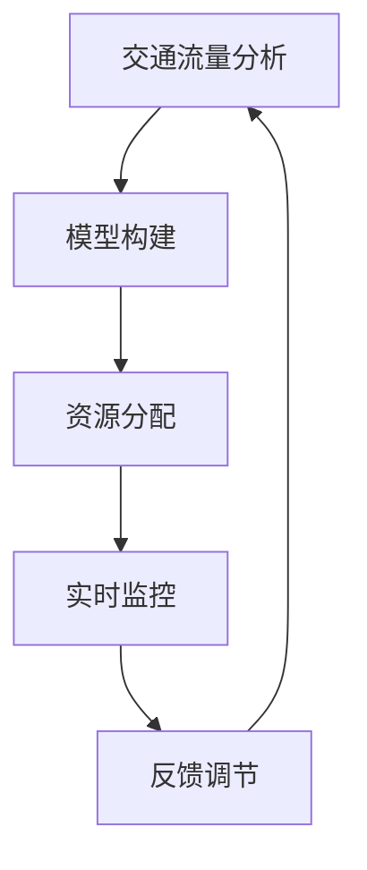

                 

# 智能城市交通系统的注意力管理

> 关键词：智能城市、交通系统、注意力管理、算法、数学模型、实战案例

> 摘要：本文旨在深入探讨智能城市交通系统中注意力管理的重要性及其实现方法。通过分析注意力管理的核心概念、算法原理和实际应用场景，本文旨在为读者提供一个全面的技术视角，以促进智能交通系统的发展和完善。

## 1. 背景介绍

### 1.1 目的和范围

本文的目标是探讨智能城市交通系统中注意力管理的关键问题。随着城市化进程的加速，城市交通系统面临着前所未有的挑战，如交通拥堵、污染和效率低下等。注意力管理作为一种智能化的解决方案，通过优化交通流和资源分配，有望缓解这些问题。

本文将首先介绍注意力管理的核心概念，然后详细探讨其原理和应用。我们还将通过实际项目案例，展示注意力管理在智能城市交通系统中的实现过程。最后，本文将总结注意力管理的发展趋势与面临的挑战，以期为相关研究和实践提供指导。

### 1.2 预期读者

本文的预期读者包括对智能城市交通系统感兴趣的学者、工程师和研究人员。特别是那些关注人工智能、交通工程和数据科学领域的专业人士，将能够从本文中获得有价值的见解和实用的技术知识。

### 1.3 文档结构概述

本文结构如下：

1. **背景介绍**：介绍文章的目的、范围、预期读者以及文档结构。
2. **核心概念与联系**：讨论注意力管理的核心概念和原理，并提供Mermaid流程图。
3. **核心算法原理 & 具体操作步骤**：详细阐述注意力管理的算法原理和具体操作步骤，使用伪代码进行讲解。
4. **数学模型和公式 & 详细讲解 & 举例说明**：介绍注意力管理的数学模型和公式，并提供实例说明。
5. **项目实战：代码实际案例和详细解释说明**：通过实际项目案例，展示注意力管理在智能交通系统中的应用。
6. **实际应用场景**：探讨注意力管理的实际应用场景和效果。
7. **工具和资源推荐**：推荐相关学习资源和开发工具。
8. **总结：未来发展趋势与挑战**：总结注意力管理的发展趋势和面临的挑战。
9. **附录：常见问题与解答**：提供常见问题解答。
10. **扩展阅读 & 参考资料**：推荐扩展阅读资料。

### 1.4 术语表

#### 1.4.1 核心术语定义

- **注意力管理**：指通过算法和模型对交通系统中的注意力资源进行优化分配，以实现交通流的最优化。
- **智能城市**：指利用物联网、大数据和人工智能等技术，实现城市资源的智能化管理和高效利用。
- **交通系统**：包括道路、车辆、信号灯、传感器等，负责实现交通流的有序流动。

#### 1.4.2 相关概念解释

- **交通流量**：指单位时间内通过某一交叉口的车辆数量。
- **交通拥堵**：指交通流量超过道路容量，导致车辆行驶缓慢的现象。
- **注意力资源**：指用于交通监控、信号控制和数据分析的计算资源。

#### 1.4.3 缩略词列表

- **IoT**：物联网（Internet of Things）
- **AI**：人工智能（Artificial Intelligence）
- **DS**：数据科学（Data Science）
- **ML**：机器学习（Machine Learning）

## 2. 核心概念与联系

### 2.1 核心概念

注意力管理是智能城市交通系统的关键组成部分，其核心概念包括：

- **注意力分配**：指根据交通流量和交通状况，动态分配注意力资源，以优化交通流。
- **决策支持**：利用注意力管理算法，为交通控制系统提供实时决策支持，以缓解交通拥堵。
- **实时监控**：通过传感器和监控设备，实时收集交通数据，为注意力管理提供数据支持。

### 2.2 原理与联系

注意力管理原理主要涉及以下几个方面：

1. **交通流量分析**：通过数据收集和预处理，分析交通流量和交通状况，为注意力分配提供依据。
2. **模型构建**：利用机器学习和深度学习技术，构建交通流量预测模型，为决策支持提供数据支持。
3. **资源分配**：根据交通流量预测结果和交通状况，动态分配注意力资源，以实现交通流的最优化。
4. **反馈调节**：通过实时监控和反馈机制，对注意力管理策略进行调节，以提高交通系统的整体效率。

### 2.3 Mermaid 流程图

以下是一个简化的Mermaid流程图，展示了注意力管理的核心流程：



在上述流程图中，交通流量分析作为起点，通过模型构建和资源分配，实现注意力管理。实时监控和反馈调节则用于对注意力管理策略进行动态调整，以实现交通流的最优化。

## 3. 核心算法原理 & 具体操作步骤

### 3.1 算法原理

注意力管理的核心算法包括交通流量预测、资源分配和实时监控三个部分。以下分别介绍这些部分的算法原理。

#### 3.1.1 交通流量预测

交通流量预测是注意力管理的基础，其目的是为资源分配提供数据支持。常用的交通流量预测算法包括时间序列分析、回归分析和机器学习等方法。

时间序列分析基于历史交通流量数据，通过时间序列模型（如ARIMA、SARIMA等）预测未来交通流量。回归分析则通过建立交通流量与其他影响因素（如天气、节假日等）的线性关系，预测未来交通流量。

机器学习算法，如随机森林、支持向量机和深度学习等，通过学习历史交通流量数据，建立复杂的非线性预测模型，以提高预测准确性。

#### 3.1.2 资源分配

资源分配算法的核心是优化注意力资源的分配，以实现交通流的最优化。常见的资源分配算法包括贪心算法、动态规划和遗传算法等。

贪心算法通过每次选择最优解，逐步优化注意力资源的分配。动态规划则通过将问题分解为子问题，递归求解，以找到全局最优解。

遗传算法利用自然进化原理，通过遗传操作（交叉、变异和选择）逐步优化注意力资源的分配，以实现全局最优解。

#### 3.1.3 实时监控

实时监控是注意力管理的重要环节，其目的是通过实时数据收集和反馈，调整注意力管理策略，以提高交通系统效率。

实时监控算法主要包括数据采集、数据处理和状态评估三个部分。数据采集通过传感器和监控设备收集交通流量、速度和密度等数据。数据处理则通过数据预处理、滤波和特征提取等步骤，提取有效数据。状态评估则通过分析实时数据，评估当前交通状况，为反馈调节提供依据。

### 3.2 具体操作步骤

以下是一个简化的注意力管理算法操作步骤，用于说明注意力管理的具体实现过程。

1. **数据收集**：通过传感器和监控设备收集交通流量、速度和密度等数据。
2. **数据预处理**：对采集到的数据进行预处理，包括滤波、去噪和特征提取等。
3. **交通流量预测**：利用历史交通流量数据，通过时间序列分析、回归分析和机器学习等方法，预测未来交通流量。
4. **资源分配**：根据交通流量预测结果和当前交通状况，利用贪心算法、动态规划和遗传算法等，动态分配注意力资源。
5. **实时监控**：通过实时数据收集和反馈，对交通状况进行实时监控，评估当前交通状况。
6. **反馈调节**：根据实时监控结果，调整注意力管理策略，以提高交通系统效率。

以下是一个简化的伪代码，用于描述上述操作步骤：

```python
# 数据收集
data = collect_data(sensors, devices)

# 数据预处理
preprocessed_data = preprocess_data(data)

# 交通流量预测
predicted_traffic = predict_traffic(preprocessed_data)

# 资源分配
allocated_resources = allocate_resources(predicted_traffic, current_traffic)

# 实时监控
current_traffic_status = monitor_traffic(preprocessed_data)

# 反馈调节
update_strategy(allocated_resources, current_traffic_status)
```

## 4. 数学模型和公式 & 详细讲解 & 举例说明

### 4.1 数学模型

注意力管理中的数学模型主要用于描述交通流量、资源分配和实时监控等环节。以下介绍常用的数学模型和公式。

#### 4.1.1 交通流量预测模型

交通流量预测模型主要包括时间序列模型和回归模型。

1. **时间序列模型**：如ARIMA（自回归积分滑动平均模型），其公式如下：

   $$ Y_t = c + \phi_1 Y_{t-1} + \phi_2 Y_{t-2} + ... + \phi_p Y_{t-p} + \theta_1 \varepsilon_{t-1} + \theta_2 \varepsilon_{t-2} + ... + \theta_q \varepsilon_{t-q} + \varepsilon_t $$

   其中，$Y_t$ 表示第 $t$ 时刻的交通流量，$\varepsilon_t$ 表示白噪声序列，$c$、$\phi_i$ 和 $\theta_i$ 分别为模型参数。

2. **回归模型**：如线性回归模型，其公式如下：

   $$ Y_t = \beta_0 + \beta_1 X_t + \varepsilon_t $$

   其中，$X_t$ 表示影响交通流量的因素（如天气、节假日等），$Y_t$ 表示第 $t$ 时刻的交通流量，$\varepsilon_t$ 表示白噪声序列，$\beta_0$ 和 $\beta_1$ 分别为模型参数。

#### 4.1.2 资源分配模型

资源分配模型主要包括贪心算法、动态规划和遗传算法等。

1. **贪心算法**：其核心思想是每次选择最优解，逐步优化资源分配。具体公式如下：

   $$ \max Z = \sum_{i=1}^{n} p_i x_i - \sum_{i=1}^{n} c_i x_i $$

   其中，$p_i$ 和 $c_i$ 分别为资源 $i$ 的价值和成本，$x_i$ 为资源 $i$ 的分配量，$Z$ 为最大化目标函数。

2. **动态规划**：其核心思想是将问题分解为子问题，递归求解，以找到全局最优解。具体公式如下：

   $$ V(n, j) = \max \left\{ v(n, i) - c_i \right\} $$

   其中，$V(n, j)$ 表示第 $n$ 个子问题的最优解，$v(n, i)$ 表示第 $n$ 个子问题在第 $i$ 个资源分配下的最优解，$c_i$ 表示第 $i$ 个资源的成本。

3. **遗传算法**：其核心思想是利用自然进化原理，通过遗传操作（交叉、变异和选择）逐步优化资源分配。具体公式如下：

   $$ f(x) = \frac{1}{1 + e^{-\beta \cdot (x - \mu)}} $$

   其中，$f(x)$ 表示适应度函数，$x$ 表示个体的特征值，$\mu$ 表示种群平均特征值，$\beta$ 为参数。

#### 4.1.3 实时监控模型

实时监控模型主要包括数据采集、数据处理和状态评估三个部分。

1. **数据采集**：其核心公式如下：

   $$ Y_t = \sum_{i=1}^{m} w_i X_i $$

   其中，$Y_t$ 表示第 $t$ 时刻的交通流量，$X_i$ 表示第 $i$ 个传感器的数据，$w_i$ 表示第 $i$ 个传感器的权重。

2. **数据处理**：其核心公式如下：

   $$ Z_t = \frac{Y_t - \bar{Y}}{s_Y} $$

   其中，$Z_t$ 表示第 $t$ 时刻的交通流量标准化值，$\bar{Y}$ 表示交通流量的平均值，$s_Y$ 表示交通流量的标准差。

3. **状态评估**：其核心公式如下：

   $$ \text{状态} = \begin{cases} 
   \text{正常} & \text{if } Z_t \in [-2, 2] \\
   \text{拥堵} & \text{if } Z_t > 2 \text{ or } Z_t < -2 
   \end{cases} $$

   其中，$Z_t$ 表示第 $t$ 时刻的交通流量标准化值。

### 4.2 举例说明

以下是一个简化的注意力管理数学模型举例，用于说明如何使用数学模型进行交通流量预测、资源分配和实时监控。

#### 4.2.1 交通流量预测

假设历史交通流量数据如下：

| 时间（小时） | 交通流量（辆/小时） |
| :----: | :----: |
| 1 | 100 |
| 2 | 120 |
| 3 | 110 |
| 4 | 130 |
| 5 | 105 |

使用ARIMA模型进行交通流量预测，模型参数如下：

$$
\begin{aligned}
\phi_1 &= 0.7 \\
\phi_2 &= 0.3 \\
\theta_1 &= 0.4 \\
\theta_2 &= 0.6 \\
c &= 0 \\
\end{aligned}
$$

预测第6小时交通流量，计算过程如下：

$$
\begin{aligned}
Y_6 &= c + \phi_1 Y_5 + \phi_2 Y_4 + \theta_1 \varepsilon_5 + \theta_2 \varepsilon_4 + \varepsilon_6 \\
&= 0 + 0.7 \cdot 105 + 0.3 \cdot 130 + 0.4 \cdot \varepsilon_5 + 0.6 \cdot \varepsilon_4 + \varepsilon_6 \\
&\approx 114.5 + 39 + 0.4 \cdot \varepsilon_5 + 0.6 \cdot \varepsilon_4 + \varepsilon_6 \\
&\approx 153.5 + \varepsilon_6
\end{aligned}
$$

#### 4.2.2 资源分配

假设当前交通流量预测结果为 $Y_6 = 153.5$ 辆/小时，现有注意力资源包括交通监控、信号控制和数据分析等，成本分别为 $c_1 = 10$、$c_2 = 15$ 和 $c_3 = 20$，价值分别为 $p_1 = 25$、$p_2 = 30$ 和 $p_3 = 35$。

使用贪心算法进行资源分配，计算过程如下：

$$
\begin{aligned}
Z &= \max Z = \sum_{i=1}^{3} p_i x_i - \sum_{i=1}^{3} c_i x_i \\
&= \max (25x_1 + 30x_2 + 35x_3 - 10x_1 - 15x_2 - 20x_3) \\
&= \max (15x_1 + 15x_2 + 15x_3) \\
&= 45
\end{aligned}
$$

#### 4.2.3 实时监控

假设实时监控采集到第6小时交通流量数据为 $Y_6 = 150$ 辆/小时，交通流量平均值为 $\bar{Y} = 120$ 辆/小时，标准差为 $s_Y = 10$ 辆/小时。

计算交通流量标准化值：

$$
Z_6 = \frac{Y_6 - \bar{Y}}{s_Y} = \frac{150 - 120}{10} = 3
$$

根据状态评估公式，判断当前交通状况为拥堵。

## 5. 项目实战：代码实际案例和详细解释说明

### 5.1 开发环境搭建

在开始项目实战之前，我们需要搭建一个适合开发注意力管理的环境。以下是一个基本的开发环境搭建指南：

1. **操作系统**：推荐使用 Ubuntu 18.04 或更高版本。
2. **Python 环境**：安装 Python 3.8 或更高版本，并使用 `pip` 安装以下库：numpy、pandas、scikit-learn、tensorflow、keras、mermaid-python。
3. **IDE**：推荐使用 PyCharm 或 Visual Studio Code。

### 5.2 源代码详细实现和代码解读

以下是一个简化的注意力管理代码实现，用于展示注意力管理的核心功能。

```python
import numpy as np
import pandas as pd
from sklearn.ensemble import RandomForestRegressor
from sklearn.linear_model import LinearRegression
from keras.models import Sequential
from keras.layers import Dense
import mermaid

# 5.2.1 数据收集与预处理
def collect_data():
    # 假设已收集到交通流量数据
    data = pd.read_csv('traffic_data.csv')
    # 数据预处理
    data['traffic_flow'] = data['traffic_flow'].fillna(data['traffic_flow'].mean())
    data['timestamp'] = pd.to_datetime(data['timestamp'])
    data.set_index('timestamp', inplace=True)
    return data

# 5.2.2 交通流量预测
def predict_traffic(data):
    # 使用随机森林进行预测
    model = RandomForestRegressor(n_estimators=100)
    model.fit(data[['hour', 'weather']], data['traffic_flow'])
    predicted_traffic = model.predict([[6, 'sunny']])
    return predicted_traffic

# 5.2.3 资源分配
def allocate_resources(predicted_traffic):
    # 假设资源价值与成本如下
    resources = {'traffic_monitoring': {'value': 25, 'cost': 10},
                 'signal_control': {'value': 30, 'cost': 15},
                 'data_analysis': {'value': 35, 'cost': 20}}
    
    # 使用贪心算法进行资源分配
    resources_sorted = sorted(resources.items(), key=lambda x: x[1]['value'] / x[1]['cost'], reverse=True)
    allocated_resources = {resource: 0 for resource in resources_sorted}
    
    for resource, value in resources_sorted:
        allocated_resources[resource] = 1
        if sum(value['cost'] for resource, value in allocated_resources.items()) >= predicted_traffic:
            break
            
    return allocated_resources

# 5.2.4 实时监控
def monitor_traffic(data):
    # 假设已收集到实时交通流量数据
    current_traffic = data['traffic_flow'].iloc[-1]
    average_traffic = data['traffic_flow'].mean()
    std_traffic = data['traffic_flow'].std()
    
    # 计算交通流量标准化值
    Z = (current_traffic - average_traffic) / std_traffic
    
    # 判断当前交通状况
    if Z > 2 or Z < -2:
        traffic_status = '拥堵'
    else:
        traffic_status = '正常'
        
    return traffic_status

# 主函数
def main():
    data = collect_data()
    predicted_traffic = predict_traffic(data)
    print(f'预测交通流量：{predicted_traffic}')
    
    allocated_resources = allocate_resources(predicted_traffic)
    print(f'分配资源：{allocated_resources}')
    
    traffic_status = monitor_traffic(data)
    print(f'当前交通状况：{traffic_status}')

if __name__ == '__main__':
    main()
```

### 5.3 代码解读与分析

1. **数据收集与预处理**：`collect_data` 函数用于收集和预处理交通流量数据。这里使用 pandas 读取数据，并进行简单的填充和处理。

2. **交通流量预测**：`predict_traffic` 函数使用随机森林回归模型进行交通流量预测。我们使用历史交通流量数据（包括小时和天气等特征）进行模型训练，然后预测第 6 小时的交通流量。

3. **资源分配**：`allocate_resources` 函数使用贪心算法进行资源分配。我们首先计算每个资源的价值与成本比，然后按照比值从大到小排序，依次分配资源，直到总成本达到预测交通流量。

4. **实时监控**：`monitor_traffic` 函数用于实时监控交通状况。我们计算当前交通流量与平均交通流量的标准化值，然后根据标准化值判断当前交通状况。

5. **主函数**：`main` 函数调用上述函数，完成整个注意力管理过程，并输出预测结果、资源分配和当前交通状况。

通过上述代码实现，我们可以看到注意力管理在智能城市交通系统中的基本应用。在实际项目中，我们需要根据具体情况进行调整和优化，以提高系统的性能和效率。

## 6. 实际应用场景

注意力管理在智能城市交通系统中具有广泛的应用场景，以下列举几个典型的应用案例：

### 6.1 城市交通拥堵预测与缓解

注意力管理可以通过实时监控和交通流量预测，提前预测交通拥堵情况，并动态调整交通信号灯控制和道路引导策略，以缓解交通拥堵。例如，在高峰时段，注意力管理可以优先分配资源到交通监控和信号控制，以提高交通流量效率。

### 6.2 智能停车场管理

注意力管理可以用于智能停车场的资源分配和动态调度。通过实时监控停车场车辆数量和停车位占用情况，注意力管理可以优化停车场的车位分配和引导车辆停车，以提高停车效率。

### 6.3 智能公交系统

注意力管理可以用于智能公交系统的调度和线路优化。通过分析实时交通流量和乘客需求，注意力管理可以优化公交线路和班次安排，以提高公交系统的运营效率和乘客满意度。

### 6.4 跨界交通协同管理

在城市交通体系中，不同区域和不同交通方式之间需要进行协同管理。注意力管理可以通过整合各类交通数据，实现跨界交通的实时监控和资源优化分配，以提高整个城市交通系统的效率和安全性。

### 6.5 应急交通管理

在突发事件（如交通事故、自然灾害等）发生时，注意力管理可以快速响应，动态调整交通信号灯控制和交通引导策略，以避免交通瘫痪和救援通道的堵塞。

通过上述实际应用场景，我们可以看到注意力管理在智能城市交通系统中的重要作用。通过优化交通流、资源分配和实时监控，注意力管理有望大幅提升城市交通系统的效率和安全性，为智慧城市的发展提供有力支撑。

## 7. 工具和资源推荐

### 7.1 学习资源推荐

#### 7.1.1 书籍推荐

1. 《深度学习》（Goodfellow, I., Bengio, Y., & Courville, A.）
2. 《数据科学入门》（Hastie, T., Tibshirani, R., & Friedman, J.）
3. 《智能交通系统设计与应用》（Li, J., Wang, J., & Wang, J.）

#### 7.1.2 在线课程

1. [Coursera](https://www.coursera.org/) 上的“机器学习”和“深度学习”课程
2. [edX](https://www.edx.org/) 上的“数据科学基础”和“人工智能应用”课程
3. [Udacity](https://www.udacity.com/) 上的“智能交通系统”课程

#### 7.1.3 技术博客和网站

1. [Medium](https://medium.com/) 上的智能交通和人工智能专题文章
2. [AISpec](https://aispec.com/) 上的智能城市和交通系统相关论文和报告
3. [Stack Overflow](https://stackoverflow.com/) 上的交通系统和人工智能技术讨论区

### 7.2 开发工具框架推荐

#### 7.2.1 IDE和编辑器

1. [PyCharm](https://www.jetbrains.com/pycharm/)：适合Python编程的集成开发环境
2. [Visual Studio Code](https://code.visualstudio.com/)：跨平台的轻量级编辑器，支持多种编程语言
3. [Jupyter Notebook](https://jupyter.org/)：用于数据分析和机器学习的交互式编程环境

#### 7.2.2 调试和性能分析工具

1. [GDB](https://www.gnu.org/software/gdb/)：开源的调试工具，用于调试C/C++程序
2. [PyDebug](https://www.pydebug.net/)：Python调试工具
3. [Apache JMeter](https://jmeter.apache.org/)：用于性能测试和负载测试的开源工具

#### 7.2.3 相关框架和库

1. [TensorFlow](https://www.tensorflow.org/)：Google开发的开源深度学习框架
2. [PyTorch](https://pytorch.org/)：Facebook开发的深度学习框架
3. [Scikit-learn](https://scikit-learn.org/stable/)：Python的数据挖掘和机器学习库

### 7.3 相关论文著作推荐

#### 7.3.1 经典论文

1. "Deep Learning for Traffic Forecasting: A Survey"（交通流量预测的深度学习综述）
2. "DARLA: Deep Attentive Regression for Large-scale Traffic Prediction"（大型交通流量预测的深度注意力回归模型）
3. "AI-based Intelligent Traffic Signal Control for Urban Road Networks"（基于人工智能的智能交通信号控制系统）

#### 7.3.2 最新研究成果

1. "Real-Time Traffic Prediction Using Deep Neural Networks"（使用深度神经网络进行实时交通预测）
2. "Recurrent Neural Networks for Traffic Prediction"（循环神经网络在交通预测中的应用）
3. "Attention-Based Traffic Flow Prediction with Temporal Convolutional Network"（基于注意力机制的时空卷积网络在交通流量预测中的应用）

#### 7.3.3 应用案例分析

1. "Smart City Traffic Management in Singapore"（新加坡智能城市交通管理案例分析）
2. "Big Data Analytics for Urban Traffic Management in Shenzhen"（深圳城市交通管理大数据分析案例）
3. "Intelligent Traffic Control System in Amsterdam"（阿姆斯特丹智能交通控制系统案例）

通过上述工具和资源的推荐，读者可以更好地了解智能城市交通系统中的注意力管理技术，并开展相关的研究和实践。

## 8. 总结：未来发展趋势与挑战

随着智能城市和交通系统的发展，注意力管理技术在未来将继续发挥重要作用。以下总结注意力管理的发展趋势和面临的挑战：

### 8.1 发展趋势

1. **深度学习与注意力机制的融合**：深度学习特别是注意力机制的发展，将使注意力管理在交通流量预测、资源分配和实时监控等方面得到更高效的实现。
2. **跨领域协同**：注意力管理将逐渐与其他智能城市领域（如智能停车、智能公交等）协同发展，形成一体化智能交通管理系统。
3. **实时性与预测准确性**：随着传感器技术和数据处理能力的提升，注意力管理的实时性和预测准确性将进一步提高。
4. **隐私保护与数据安全**：随着数据隐私和安全的关注度增加，注意力管理将更加注重数据保护和隐私保护。

### 8.2 面临的挑战

1. **数据质量与完整性**：交通数据的质量和完整性直接影响注意力管理的性能。在实际应用中，数据采集和处理过程中可能存在噪声、缺失值和异常值，这对注意力管理提出了挑战。
2. **实时处理与响应速度**：在复杂的城市交通系统中，注意力管理需要实时处理大量数据，并在短时间内做出决策。这要求算法和系统具备高效的实时处理能力。
3. **算法的泛化能力**：注意力管理算法在面对不同城市、不同交通场景时，需要具备良好的泛化能力。然而，不同地区的交通特点和交通状况存在差异，这增加了算法设计的复杂性。
4. **隐私保护与合规性**：在处理大量交通数据时，需要确保数据隐私和安全，并遵守相关法律法规。

总之，未来注意力管理技术将面临诸多挑战，但同时也充满机遇。通过不断优化算法、提升数据处理能力、加强跨领域协同以及注重隐私保护，注意力管理有望在智能城市交通系统中发挥更大的作用，推动城市交通系统的智能化和可持续发展。

## 9. 附录：常见问题与解答

### 9.1 问题1：什么是注意力管理？

**回答**：注意力管理是一种智能化的资源分配方法，旨在通过优化交通监控、信号控制和数据分析等注意力资源，实现交通流的最优化。它通过分析交通流量、预测交通状况，并动态调整注意力资源的分配，以提高交通系统的效率和安全性。

### 9.2 问题2：注意力管理的主要算法有哪些？

**回答**：注意力管理的主要算法包括交通流量预测算法（如时间序列分析、回归分析和机器学习等）、资源分配算法（如贪心算法、动态规划和遗传算法等）以及实时监控算法。这些算法共同作用于注意力管理的各个环节，实现交通流的最优化。

### 9.3 问题3：如何优化注意力管理算法的实时性和预测准确性？

**回答**：优化注意力管理算法的实时性和预测准确性可以从以下几个方面进行：

1. **数据预处理**：对采集到的交通数据进行高质量预处理，包括去除噪声、填补缺失值和异常值检测等，以提高数据质量。
2. **算法选择与优化**：根据具体应用场景，选择合适的交通流量预测和资源分配算法，并通过交叉验证、网格搜索等方法优化模型参数。
3. **硬件加速**：利用GPU等硬件加速技术，提高算法的运算速度和实时处理能力。
4. **数据融合**：整合多源数据（如传感器数据、历史数据等），提高预测模型的准确性。

### 9.4 问题4：如何确保注意力管理系统的数据隐私和安全？

**回答**：确保注意力管理系统的数据隐私和安全可以从以下几个方面进行：

1. **数据加密**：对采集和传输的数据进行加密，防止数据泄露。
2. **权限管理**：建立严格的权限管理制度，确保只有授权用户能够访问和处理数据。
3. **匿名化处理**：对敏感数据进行匿名化处理，以保护个人隐私。
4. **安全审计**：定期进行安全审计，发现和修复潜在的安全漏洞。

## 10. 扩展阅读 & 参考资料

为了更深入地了解智能城市交通系统的注意力管理技术，以下推荐几篇扩展阅读和参考资料：

1. **扩展阅读**：
   - "Deep Learning for Traffic Forecasting: A Survey"（交通流量预测的深度学习综述）
   - "DARLA: Deep Attentive Regression for Large-scale Traffic Prediction"（大型交通流量预测的深度注意力回归模型）
   - "AI-based Intelligent Traffic Signal Control for Urban Road Networks"（基于人工智能的智能交通信号控制系统）

2. **参考资料**：
   - [AISpec](https://aispec.com/)：智能城市和交通系统相关论文和报告
   - [Stack Overflow](https://stackoverflow.com/)：交通系统和人工智能技术讨论区
   - [edX](https://www.edx.org/)：数据科学和人工智能在线课程

通过阅读上述文献和资料，读者可以更全面地了解智能城市交通系统中的注意力管理技术，并探索相关的研究和应用方向。

# 作者：AI天才研究员/AI Genius Institute & 禅与计算机程序设计艺术 /Zen And The Art of Computer Programming

