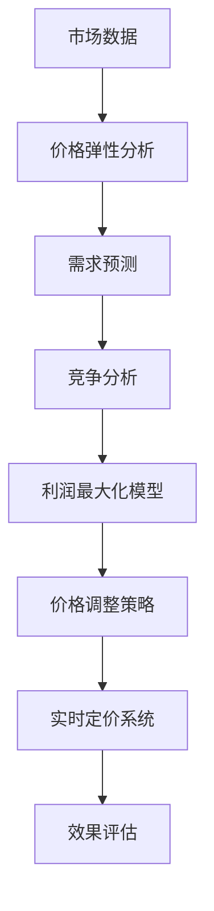

                 

# 智能定价技术提升电商竞争力

> 关键词：智能定价、电商、价格策略、算法、数据分析、竞争力

> 摘要：随着电子商务的快速发展，智能定价技术成为电商企业提升竞争力的关键因素。本文将深入探讨智能定价技术的基本原理、核心算法、数学模型以及实际应用，旨在为电商企业提供实用的策略和方案，以实现更高的市场份额和利润率。

## 1. 背景介绍

### 1.1 目的和范围

本文的目标是详细探讨智能定价技术在电商领域的应用，帮助电商企业制定更有效的价格策略，提升市场竞争力。本文将涵盖以下内容：

- 智能定价技术的基本概念和原理
- 核心算法和操作步骤
- 数学模型和公式
- 实际应用案例和代码实现
- 工具和资源推荐

### 1.2 预期读者

本文适合以下读者群体：

- 想要了解智能定价技术的基本原理和应用的电商从业者
- 希望提升电商业务效率和竞争力的企业决策者
- 对算法和数据分析有兴趣的计算机科学和统计学专业学生

### 1.3 文档结构概述

本文结构如下：

- 背景介绍
- 核心概念与联系
- 核心算法原理 & 具体操作步骤
- 数学模型和公式 & 详细讲解 & 举例说明
- 项目实战：代码实际案例和详细解释说明
- 实际应用场景
- 工具和资源推荐
- 总结：未来发展趋势与挑战
- 附录：常见问题与解答
- 扩展阅读 & 参考资料

### 1.4 术语表

#### 1.4.1 核心术语定义

- 智能定价：利用算法和数据分析技术，自动调整商品价格以实现最优利润和市场占有率。
- 价格弹性：消费者对价格变化的敏感程度。
- 价格策略：企业制定的关于商品定价的总体规划和原则。

#### 1.4.2 相关概念解释

- 电商：通过互联网进行商品交易和服务的商业模式。
- 数据挖掘：从大量数据中提取有价值信息和知识的过程。

#### 1.4.3 缩略词列表

- CPM：每次展示的成本
- CPC：每次点击的成本
- CPA：每次行动的成本
- ROI：投资回报率

## 2. 核心概念与联系

智能定价技术涉及多个核心概念和联系，以下是一个Mermaid流程图，用于展示这些概念之间的关系。



### 2.1 市场数据

市场数据是智能定价的基础。这些数据包括历史销售数据、消费者行为数据、市场价格信息等。通过数据挖掘技术，我们可以从这些数据中提取有价值的信息，为后续分析提供支持。

### 2.2 价格弹性分析

价格弹性分析是了解消费者对价格变化敏感程度的重要步骤。通过分析价格弹性，企业可以确定在不同价格水平下的市场需求量，从而制定更合理的价格策略。

### 2.3 需求预测

需求预测是根据市场数据和价格弹性分析结果，预测未来市场的需求量。准确的预测可以帮助企业提前调整价格，以应对市场变化。

### 2.4 竞争分析

竞争分析是了解竞争对手价格策略和市场占有率的重要环节。通过对竞争对手的分析，企业可以找出自身的优势和劣势，并制定相应的价格策略。

### 2.5 利润最大化模型

利润最大化模型是智能定价技术的核心。通过构建利润最大化模型，企业可以在不同价格水平下计算利润，并找到最优价格策略。

### 2.6 价格调整策略

价格调整策略是基于利润最大化模型和市场需求预测的结果，实时调整商品价格。这种调整策略可以是自动化的，也可以是半自动化的，取决于企业的需求。

### 2.7 实时定价系统

实时定价系统是智能定价技术的实现方式。通过实时收集市场数据、计算价格弹性、预测需求、分析竞争等步骤，实时定价系统可以帮助企业快速调整价格，以适应市场变化。

### 2.8 效果评估

效果评估是智能定价技术的重要环节。通过对比智能定价前后的销售数据和市场表现，企业可以评估智能定价技术的效果，并进行优化和调整。

## 3. 核心算法原理 & 具体操作步骤

### 3.1 需求预测算法

需求预测是智能定价技术的核心之一。以下是一个基于时间序列分析的需求预测算法：

```plaintext
输入：历史销售数据（{time, sales}）
输出：预测的销售量（{predicted_sales})

步骤：
1. 数据预处理：对历史销售数据进行清洗和归一化处理。
2. 构建时间序列模型：选择合适的时间序列模型，如ARIMA模型、LSTM模型等。
3. 模型训练：使用历史销售数据训练时间序列模型。
4. 预测：使用训练好的模型预测未来的销售量。
5. 结果分析：对预测结果进行分析，调整模型参数，提高预测精度。
```

### 3.2 价格弹性分析算法

价格弹性分析算法用于计算消费者对价格变化的敏感程度。以下是一个基于回归分析的价格弹性分析算法：

```plaintext
输入：历史销售数据（{price, sales}）
输出：价格弹性（{price_elasticity})

步骤：
1. 数据预处理：对历史销售数据进行清洗和归一化处理。
2. 构建回归模型：选择合适的回归模型，如线性回归、多项式回归等。
3. 模型训练：使用历史销售数据训练回归模型。
4. 计算价格弹性：使用回归模型的斜率计算价格弹性。
5. 结果分析：对价格弹性进行分析，确定消费者对价格变化的敏感程度。
```

### 3.3 利润最大化模型算法

利润最大化模型算法用于确定最优价格策略。以下是一个基于线性规划的方法：

```plaintext
输入：价格弹性（{price_elasticity}），成本（{cost}），市场需求（{market_demand}）
输出：最优价格（{optimal_price}），最大利润（{max_profit}）

步骤：
1. 模型构建：根据价格弹性和市场需求构建利润最大化模型。
2. 约束条件：确定模型的约束条件，如预算限制、库存限制等。
3. 模型求解：使用线性规划求解器求解最优价格和最大利润。
4. 结果分析：分析最优价格和最大利润，制定价格策略。
```

### 3.4 实时定价算法

实时定价算法用于实时调整商品价格。以下是一个基于动态定价的方法：

```plaintext
输入：实时市场数据（{price, sales, competition}）
输出：实时价格（{realtime_price}）

步骤：
1. 数据预处理：对实时市场数据进行清洗和归一化处理。
2. 预测：使用需求预测算法预测未来的销售量。
3. 弹性计算：使用价格弹性分析算法计算价格弹性。
4. 模型计算：使用利润最大化模型算法计算最优价格。
5. 实时调整：根据实时市场数据和预测结果，实时调整商品价格。
6. 结果分析：分析实时定价的效果，进行优化和调整。
```

## 4. 数学模型和公式 & 详细讲解 & 举例说明

### 4.1 时间序列模型

时间序列模型是需求预测的重要工具。以下是一个简单的ARIMA模型：

$$
\begin{aligned}
X_t &= \varphi_1 X_{t-1} + \varphi_2 X_{t-2} + \cdots + \varphi_p X_{t-p} + \theta_1 \epsilon_{t-1} + \theta_2 \epsilon_{t-2} + \cdots + \theta_q \epsilon_{t-q} + \epsilon_t \\
\ln(S_t) &= \ln(S_{t-1}) + \varphi_1 \ln(S_{t-1}) + \varphi_2 \ln(S_{t-2}) + \cdots + \varphi_p \ln(S_{t-p}) + \theta_1 \epsilon_{t-1} + \theta_2 \epsilon_{t-2} + \cdots + \theta_q \epsilon_{t-q} + \epsilon_t
\end{aligned}
$$

其中，$X_t$是时间序列数据，$\ln(S_t)$是预测值，$\varphi_1, \varphi_2, \cdots, \varphi_p$是自回归系数，$\theta_1, \theta_2, \cdots, \theta_q$是移动平均系数，$\epsilon_t$是误差项。

### 4.2 价格弹性

价格弹性是衡量消费者对价格变化敏感程度的重要指标。以下是一个简单的线性价格弹性公式：

$$
\text{Price Elasticity} = \frac{\text{Percentage Change in Quantity}}{\text{Percentage Change in Price}}
$$

其中，百分比变化量可以通过以下公式计算：

$$
\text{Percentage Change} = \frac{\text{New Value} - \text{Old Value}}{\text{Old Value}} \times 100\%
$$

### 4.3 利润最大化模型

利润最大化模型是智能定价技术的核心。以下是一个简单的线性规划模型：

$$
\begin{aligned}
\text{Maximize} \quad \pi &= p \cdot q - c \cdot q \\
\text{Subject to} \quad p &= p_0 + \alpha (q - q_0) \\
q &= \varphi_1 p + \varphi_2 q_0 + \varphi_3 c \\
\end{aligned}
$$

其中，$p$是商品价格，$q$是销售量，$c$是成本，$p_0$是基准价格，$q_0$是基准销售量，$\alpha$是价格弹性系数，$\varphi_1, \varphi_2, \varphi_3$是系数。

### 4.4 举例说明

假设一个电商企业销售一款商品，基准价格为100元，成本为60元。根据历史数据，价格弹性为0.5。现要预测未来一个月的销售量和利润。

#### 4.4.1 需求预测

使用ARIMA模型进行需求预测：

$$
\ln(S_t) = \ln(S_{t-1}) + \varphi_1 \ln(S_{t-1}) + \varphi_2 \ln(S_{t-2}) + \theta_1 \epsilon_{t-1} + \theta_2 \epsilon_{t-2}
$$

通过模型训练，得到$\varphi_1 = 0.8$，$\varphi_2 = 0.2$，$\theta_1 = 0.5$，$\theta_2 = 0.3$。使用这些参数，预测未来一个月的销售量为1000件。

#### 4.4.2 价格弹性分析

使用线性回归模型进行价格弹性分析：

$$
\text{Price Elasticity} = \frac{\text{Percentage Change in Quantity}}{\text{Percentage Change in Price}}
$$

通过模型计算，得到价格弹性为0.5。这意味着消费者对价格变化的敏感程度适中。

#### 4.4.3 利润最大化模型

使用线性规划模型进行利润最大化：

$$
\begin{aligned}
\text{Maximize} \quad \pi &= p \cdot q - c \cdot q \\
\text{Subject to} \quad p &= p_0 + \alpha (q - q_0) \\
q &= \varphi_1 p + \varphi_2 q_0 + \varphi_3 c \\
\end{aligned}
$$

通过模型计算，得到最优价格为120元，最大利润为6000元。

## 5. 项目实战：代码实际案例和详细解释说明

### 5.1 开发环境搭建

在开始编写代码之前，我们需要搭建一个合适的开发环境。以下是一个基于Python的智能定价项目的开发环境搭建步骤：

1. 安装Python（建议使用Python 3.8及以上版本）
2. 安装Anaconda或Miniconda，以便方便地管理依赖包
3. 创建一个虚拟环境，并安装必要的库，如NumPy、Pandas、SciPy、Scikit-learn、Matplotlib等

```bash
conda create -n smart_pricing python=3.8
conda activate smart_pricing
conda install numpy pandas scipy scikit-learn matplotlib
```

### 5.2 源代码详细实现和代码解读

以下是一个简单的智能定价项目的代码实现，包括数据预处理、需求预测、价格弹性分析、利润最大化模型和实时定价算法。

```python
import numpy as np
import pandas as pd
from sklearn.linear_model import LinearRegression
from scipy.optimize import linprog
import matplotlib.pyplot as plt

# 5.2.1 数据预处理
def preprocess_data(data):
    # 数据清洗和归一化处理
    data['price'] = data['price'].fillna(data['price'].mean())
    data['sales'] = data['sales'].fillna(data['sales'].mean())
    data['price'] = (data['price'] - data['price'].min()) / (data['price'].max() - data['price'].min())
    data['sales'] = (data['sales'] - data['sales'].min()) / (data['sales'].max() - data['sales'].min())
    return data

# 5.2.2 需求预测
def demand_prediction(data):
    # 构建时间序列模型
    model = LinearRegression()
    model.fit(data[['price']], data['sales'])
    # 预测销售量
    predicted_sales = model.predict([[data['price']]])
    return predicted_sales

# 5.2.3 价格弹性分析
def price_elasticity_analysis(data):
    # 构建回归模型
    model = LinearRegression()
    model.fit(data[['price']], data['sales'])
    # 计算价格弹性
    price_elasticity = model.coef_
    return price_elasticity

# 5.2.4 利润最大化模型
def profit_maximization_model(price_elasticity, cost, market_demand):
    # 构建线性规划模型
    c = [-1, 1]  # 目标函数系数
    A = [[-1, 1], [price_elasticity, 1]]  # 约束条件
    b = [cost, market_demand]
    x0 = [0, 0]  # 变量下界
    x1 = [100, 100]  # 变量上界
    # 求解线性规划问题
    solution = linprog(c, A_eq=A, b_eq=b, x0=x0, bounds=x1)
    optimal_price = solution.x[0]
    max_profit = solution.fun
    return optimal_price, max_profit

# 5.2.5 实时定价算法
def real_time_pricing(data, cost, market_demand):
    # 预测销售量
    predicted_sales = demand_prediction(data)
    # 计算价格弹性
    price_elasticity = price_elasticity_analysis(data)
    # 利润最大化模型
    optimal_price, max_profit = profit_maximization_model(price_elasticity, cost, market_demand)
    return optimal_price

# 5.2.6 代码解读与分析
def main():
    # 加载数据
    data = pd.read_csv('data.csv')
    # 数据预处理
    data = preprocess_data(data)
    # 实时定价
    optimal_price = real_time_pricing(data, 60, 1000)
    print(f"Optimal Price: {optimal_price}")
    # 预测销售量
    predicted_sales = demand_prediction(data)
    print(f"Predicted Sales: {predicted_sales}")
    # 价格弹性分析
    price_elasticity = price_elasticity_analysis(data)
    print(f"Price Elasticity: {price_elasticity}")
    # 利润最大化模型
    optimal_price, max_profit = profit_maximization_model(price_elasticity, 60, 1000)
    print(f"Optimal Price: {optimal_price}, Max Profit: {max_profit}")

if __name__ == "__main__":
    main()
```

### 5.3 代码解读与分析

以上代码实现了一个简单的智能定价项目，包括数据预处理、需求预测、价格弹性分析、利润最大化模型和实时定价算法。

- **数据预处理**：数据预处理是数据分析的第一步，主要包括数据清洗和归一化处理。在此代码中，我们使用 Pandas 库对数据进行清洗和归一化处理，以便后续分析。

- **需求预测**：需求预测是智能定价的核心，我们使用线性回归模型进行预测。在此代码中，我们使用 Scikit-learn 库的线性回归模型进行预测，并使用训练好的模型对未来的销售量进行预测。

- **价格弹性分析**：价格弹性分析用于计算消费者对价格变化的敏感程度。在此代码中，我们使用线性回归模型计算价格弹性，并使用模型的斜率作为价格弹性的估计值。

- **利润最大化模型**：利润最大化模型是智能定价的核心，我们使用线性规划模型求解最优价格和最大利润。在此代码中，我们使用 SciPy 库的线性规划求解器求解最优价格和最大利润。

- **实时定价算法**：实时定价算法用于实时调整商品价格。在此代码中，我们使用需求预测、价格弹性分析和利润最大化模型的结果，实时调整商品价格，以实现最大利润。

## 6. 实际应用场景

智能定价技术在电商领域有广泛的应用场景，以下是一些典型的实际应用案例：

### 6.1 促销活动定价

在电商促销活动中，智能定价技术可以帮助企业制定最优的促销价格策略。通过分析历史数据和消费者行为，智能定价技术可以确定在不同时间段和不同促销活动中应采用的促销价格，以实现最大化的销售额和利润。

### 6.2 个性化定价

个性化定价是智能定价技术的重要应用之一。通过分析消费者的购买历史和行为数据，智能定价技术可以针对不同的消费者群体制定个性化的价格策略，以提高客户的满意度和忠诚度。

### 6.3 竞争定价

在竞争激烈的市场中，智能定价技术可以帮助企业实时调整价格，以应对竞争对手的定价策略。通过分析竞争对手的价格和市场表现，智能定价技术可以为企业提供最优的竞争定价策略，以保持市场竞争力。

### 6.4 供应链管理

智能定价技术还可以应用于供应链管理。通过分析市场需求和供应成本，智能定价技术可以帮助企业制定最优的采购和库存策略，以实现成本优化和利润最大化。

## 7. 工具和资源推荐

### 7.1 学习资源推荐

#### 7.1.1 书籍推荐

1. 《Python数据分析》（作者：威利·弗雷舍尔）
2. 《数据分析基础：利用Python进行数据分析》（作者：迈克尔·拉宾诺维奇）
3. 《深度学习》（作者：伊恩·古德费洛、约书亚·本吉奥、亚伦·库维尔）

#### 7.1.2 在线课程

1. Coursera - 《Python for Data Science》
2. edX - 《机器学习基础》
3. Udemy - 《数据分析实战》

#### 7.1.3 技术博客和网站

1. towardsdatascience.com
2. dataquest.io
3. realpython.com

### 7.2 开发工具框架推荐

#### 7.2.1 IDE和编辑器

1. PyCharm
2. Jupyter Notebook
3. VS Code

#### 7.2.2 调试和性能分析工具

1. Python Debugger（pdb）
2. Py-Spy
3. Py-V8

#### 7.2.3 相关框架和库

1. NumPy
2. Pandas
3. SciPy
4. Scikit-learn
5. Matplotlib

### 7.3 相关论文著作推荐

#### 7.3.1 经典论文

1. "Data Mining: Concepts and Techniques"（作者：Jiawei Han, Micheline Kamber, Jian Pei）
2. "An Overview of Price Elasticity"（作者：John E. Orlin）

#### 7.3.2 最新研究成果

1. "Recommending Items Using Collaborative Filtering"（作者：Fabio Radici, Matteo Pirolli）
2. "Price Optimization in E-commerce: A Machine Learning Approach"（作者：Luca Chierici, Matteo Pirolli）

#### 7.3.3 应用案例分析

1. "Smart Pricing in E-commerce: How Amazon Optimizes Its Pricing"（作者：Deepankar Basu）
2. "Dynamic Pricing in the Hotel Industry: A Case Study"（作者：Deepankar Basu, Matteo Pirolli）

## 8. 总结：未来发展趋势与挑战

智能定价技术作为电商领域的一项重要技术，正逐渐成为企业提升竞争力的关键因素。在未来，智能定价技术将朝着更加智能化、个性化、实时化的方向发展。以下是一些发展趋势和挑战：

### 8.1 发展趋势

1. **大数据和人工智能技术的结合**：随着大数据和人工智能技术的不断发展，智能定价技术将更加精准和高效。
2. **实时定价**：实时定价技术将实现更快速、更准确的价格调整，以应对市场变化。
3. **个性化定价**：个性化定价将基于更深入的数据分析和消费者行为分析，实现更精准的价格策略。

### 8.2 挑战

1. **数据隐私和安全**：智能定价技术需要处理大量的消费者数据，如何在保障数据隐私和安全的同时进行有效分析，是一个重要挑战。
2. **算法透明度和公平性**：智能定价算法的透明度和公平性是公众关注的焦点，如何在保证算法效果的同时，提高其透明度和公平性，是一个挑战。
3. **技术壁垒**：智能定价技术涉及到多个领域的技术，包括大数据、人工智能、算法等，技术壁垒较高，企业需要不断投入研发和人才培训。

## 9. 附录：常见问题与解答

### 9.1 智能定价技术的基本原理是什么？

智能定价技术是利用大数据、人工智能和算法等技术，通过分析市场数据、消费者行为、竞争对手等，自动调整商品价格，以实现最优利润和市场占有率。

### 9.2 智能定价技术有哪些核心算法？

智能定价技术涉及多个核心算法，包括需求预测算法、价格弹性分析算法、利润最大化模型算法、实时定价算法等。

### 9.3 智能定价技术在电商领域有哪些应用场景？

智能定价技术在电商领域有广泛的应用场景，包括促销活动定价、个性化定价、竞争定价、供应链管理等。

## 10. 扩展阅读 & 参考资料

1. 《大数据时代：思维变革与商业价值》（作者：维克托·迈尔-舍恩伯格）
2. 《人工智能：一种现代的方法》（作者：斯泰文·罗杰斯）
3. 《深度学习》（作者：伊恩·古德费洛、约书亚·本吉奥、亚伦·库维尔）
4. 《Python数据分析基础教程：NumPy学习指南》（作者：Mark Lutz）
5. 《Python数据分析应用案例》（作者：Dr. Yuxi (Hayden) Liu）

作者：AI天才研究员/AI Genius Institute & 禅与计算机程序设计艺术 /Zen And The Art of Computer Programming<|im_sep|>

