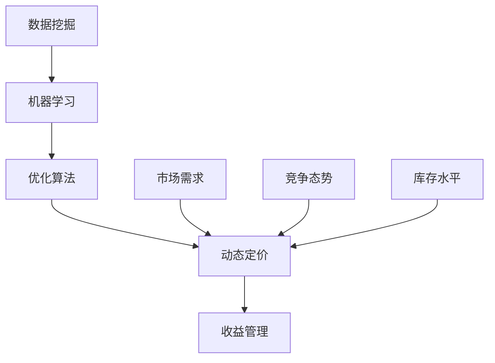

                 

# 智能定价技术的技术实现

> **关键词：** 智能定价、数据挖掘、机器学习、优化算法、商业应用
>
> **摘要：** 本文旨在深入探讨智能定价技术的技术实现，包括其核心概念、算法原理、数学模型、实际应用以及未来发展趋势。通过详细的步骤分析和案例展示，帮助读者理解智能定价技术在现代商业环境中的重要性和应用潜力。

## 1. 背景介绍

### 1.1 目的和范围

本文的目的在于系统性地介绍智能定价技术的概念、原理、算法以及实际应用。我们希望读者通过本文的学习，能够全面了解智能定价技术的工作机制、技术难点以及如何在实际业务场景中应用。

本文将主要涵盖以下内容：

1. **核心概念与联系**：介绍智能定价技术的基本概念和相关技术联系。
2. **核心算法原理 & 具体操作步骤**：详细讲解智能定价算法的基本原理和操作步骤。
3. **数学模型和公式 & 详细讲解 & 举例说明**：解析智能定价中使用的数学模型和公式，并通过实例进行说明。
4. **项目实战：代码实际案例和详细解释说明**：提供实际的智能定价项目代码案例，并进行详细解读。
5. **实际应用场景**：探讨智能定价技术在各个行业中的应用。
6. **工具和资源推荐**：推荐学习资源、开发工具和框架。
7. **总结：未来发展趋势与挑战**：展望智能定价技术的未来发展趋势和面临的挑战。

### 1.2 预期读者

本文主要面向以下几类读者：

1. **数据科学家和机器学习工程师**：希望了解如何应用机器学习和数据挖掘技术进行智能定价。
2. **商业分析师和营销专家**：希望掌握智能定价技术，提升业务分析和营销策略。
3. **软件开发工程师**：希望了解智能定价技术背后的算法原理和实现方法。
4. **企业决策者**：希望了解智能定价技术对业务决策的影响和应用。

### 1.3 文档结构概述

本文的结构如下：

1. **背景介绍**：介绍智能定价技术的背景、目的和范围。
2. **核心概念与联系**：介绍智能定价技术的基本概念和相关技术联系。
3. **核心算法原理 & 具体操作步骤**：讲解智能定价算法的基本原理和操作步骤。
4. **数学模型和公式 & 详细讲解 & 举例说明**：解析智能定价中使用的数学模型和公式。
5. **项目实战：代码实际案例和详细解释说明**：提供实际的智能定价项目代码案例。
6. **实际应用场景**：探讨智能定价技术的实际应用。
7. **工具和资源推荐**：推荐学习资源、开发工具和框架。
8. **总结：未来发展趋势与挑战**：展望智能定价技术的未来发展趋势和挑战。
9. **附录：常见问题与解答**：回答读者可能遇到的常见问题。
10. **扩展阅读 & 参考资料**：提供扩展阅读材料和参考资料。

### 1.4 术语表

为了确保文章的清晰性，我们在此列出一些关键术语的定义和解释：

#### 1.4.1 核心术语定义

- **智能定价**：利用数据挖掘、机器学习和优化算法，动态调整产品或服务的价格，以最大化收益或市场份额。
- **数据挖掘**：从大量数据中提取隐藏的模式和知识的过程。
- **机器学习**：计算机系统从数据中学习规律，并做出预测或决策的技术。
- **优化算法**：用于寻找最优解或近似最优解的算法。

#### 1.4.2 相关概念解释

- **动态定价**：根据市场需求、竞争态势、库存水平等实时调整产品或服务价格。
- **价格敏感性**：消费者对价格变化的反应程度。
- **收益管理**：通过定价策略和库存管理，最大化企业收益。

#### 1.4.3 缩略词列表

- **AI**：人工智能（Artificial Intelligence）
- **ML**：机器学习（Machine Learning）
- **DM**：数据挖掘（Data Mining）
- **OC**：优化算法（Optimization Algorithm）

## 2. 核心概念与联系

为了深入理解智能定价技术，我们需要先掌握几个核心概念，并了解它们之间的联系。以下是一个使用Mermaid绘制的流程图，展示了智能定价技术中的关键概念和它们之间的关系。



### 2.1 数据挖掘（Data Mining）

数据挖掘是从大量数据中提取有价值信息的过程。在智能定价中，数据挖掘用于分析历史销售数据、用户行为数据、市场数据等，以发现影响定价的关键因素。

#### 操作步骤：

1. **数据收集**：收集历史销售数据、用户行为数据等。
2. **数据预处理**：清洗数据，处理缺失值、异常值等。
3. **特征工程**：选择和构造有助于预测的特征。
4. **模式识别**：使用算法（如聚类、关联规则挖掘等）发现数据中的模式。

### 2.2 机器学习（Machine Learning）

机器学习是计算机系统从数据中学习规律，并做出预测或决策的技术。在智能定价中，机器学习用于预测市场需求、消费者行为等。

#### 操作步骤：

1. **数据准备**：选择合适的数据集，进行预处理。
2. **模型选择**：选择适合问题的机器学习模型（如线性回归、决策树、神经网络等）。
3. **模型训练**：使用训练数据训练模型。
4. **模型评估**：使用验证数据评估模型性能。

### 2.3 优化算法（Optimization Algorithm）

优化算法用于寻找最优解或近似最优解。在智能定价中，优化算法用于确定最佳定价策略。

#### 操作步骤：

1. **问题定义**：明确优化目标（如最大化收益、最大化市场份额）。
2. **算法选择**：选择适合问题的优化算法（如线性规划、整数规划、遗传算法等）。
3. **求解过程**：使用优化算法求解最优定价策略。

### 2.4 动态定价（Dynamic Pricing）

动态定价是根据市场需求、竞争态势、库存水平等实时调整产品或服务价格。

#### 操作步骤：

1. **数据收集**：收集实时市场数据、竞争态势数据等。
2. **预测模型**：使用机器学习模型预测市场需求。
3. **定价策略**：根据预测结果和优化算法确定定价策略。
4. **执行定价**：实时调整产品或服务价格。

### 2.5 收益管理（Revenue Management）

收益管理是通过定价策略和库存管理，最大化企业收益。

#### 操作步骤：

1. **定价策略**：根据市场需求、竞争态势等制定定价策略。
2. **库存管理**：根据定价策略和市场需求调整库存。
3. **收益预测**：使用机器学习和优化算法预测未来收益。
4. **策略调整**：根据收益预测结果调整定价策略和库存管理。

## 3. 核心算法原理 & 具体操作步骤

在智能定价中，核心算法原理包括数据挖掘、机器学习和优化算法。以下我们将详细讲解这些算法的基本原理和具体操作步骤。

### 3.1 数据挖掘算法

#### 3.1.1 聚类算法

聚类算法是一种无监督学习方法，用于将相似的数据点归为一类。在智能定价中，聚类算法可用于发现市场需求和市场细分。

**操作步骤：**

1. **数据准备**：收集销售数据、用户行为数据等。
2. **特征工程**：选择和构造有助于聚类的特征。
3. **选择聚类算法**：如K-means、层次聚类等。
4. **模型训练**：使用聚类算法对数据点进行聚类。
5. **评估聚类效果**：计算聚类内部和外部距离，评估聚类效果。

#### 3.1.2 关联规则挖掘算法

关联规则挖掘算法用于发现数据之间的关联关系。在智能定价中，关联规则挖掘可用于分析消费者行为，识别潜在的销售机会。

**操作步骤：**

1. **数据准备**：收集销售数据、用户行为数据等。
2. **特征工程**：选择和构造有助于关联规则挖掘的特征。
3. **选择关联规则挖掘算法**：如Apriori、FP-growth等。
4. **模型训练**：使用关联规则挖掘算法生成关联规则。
5. **评估关联规则**：计算支持度、置信度等，评估关联规则的有效性。

### 3.2 机器学习算法

#### 3.2.1 线性回归

线性回归是一种常用的回归算法，用于预测连续值。在智能定价中，线性回归可用于预测市场需求。

**操作步骤：**

1. **数据准备**：收集历史销售数据、用户行为数据等。
2. **特征工程**：选择和构造有助于预测的特征。
3. **选择回归算法**：如线性回归。
4. **模型训练**：使用训练数据训练模型。
5. **模型评估**：使用验证数据评估模型性能。

#### 3.2.2 决策树

决策树是一种常见的分类算法，用于预测离散值。在智能定价中，决策树可用于预测消费者购买行为。

**操作步骤：**

1. **数据准备**：收集历史销售数据、用户行为数据等。
2. **特征工程**：选择和构造有助于分类的特征。
3. **选择分类算法**：如决策树。
4. **模型训练**：使用训练数据训练模型。
5. **模型评估**：使用验证数据评估模型性能。

### 3.3 优化算法

#### 3.3.1 线性规划

线性规划是一种优化算法，用于求解线性目标函数在给定线性约束下的最优解。在智能定价中，线性规划可用于确定最优定价策略。

**操作步骤：**

1. **问题定义**：明确优化目标（如最大化收益）和线性约束。
2. **选择优化算法**：如线性规划。
3. **求解过程**：使用线性规划算法求解最优定价策略。
4. **评估优化结果**：评估优化结果，如收益、市场份额等。

#### 3.3.2 遗传算法

遗传算法是一种启发式优化算法，模拟自然进化过程，用于求解复杂优化问题。在智能定价中，遗传算法可用于寻找最优定价策略。

**操作步骤：**

1. **问题定义**：明确优化目标（如最大化收益）和约束。
2. **选择遗传算法**：如遗传算法。
3. **初始化种群**：随机生成一组定价策略。
4. **迭代优化**：通过交叉、变异等操作不断优化种群。
5. **评估优化结果**：评估优化结果，如收益、市场份额等。

## 4. 数学模型和公式 & 详细讲解 & 举例说明

在智能定价中，数学模型和公式是关键组成部分。以下我们将详细介绍几个常用的数学模型，并使用LaTeX格式进行公式表示，并通过实际例子进行解释。

### 4.1 动态定价模型

动态定价模型用于确定产品或服务的最佳价格，以最大化企业收益。以下是一个简单的动态定价模型：

\[ P_t = P_0 + \alpha \cdot (Q_t - Q_{t-1}) \]

其中：

- \( P_t \)：第t天的产品价格
- \( P_0 \)：初始价格
- \( \alpha \)：调整系数
- \( Q_t \)：第t天的销售量
- \( Q_{t-1} \)：第\( t-1 \)天的销售量

**例子**：

假设一家电商平台的初始价格为100元，调整系数为0.1。如果第1天的销售量为1000件，第2天的销售量为1500件，则第2天的产品价格为：

\[ P_2 = 100 + 0.1 \cdot (1500 - 1000) = 110 \text{元} \]

### 4.2 优化模型

优化模型用于确定最优定价策略，以最大化企业收益。以下是一个简单的线性规划优化模型：

\[ \begin{aligned}
\max_{P} &\ \sum_{i=1}^{n} p_i \cdot q_i \\
s.t. &\ \sum_{i=1}^{n} p_i \cdot x_i = R \\
&\ p_i \geq 0 \quad \forall i \\
&\ x_i \in \{0, 1\} \quad \forall i
\end{aligned} \]

其中：

- \( p_i \)：产品i的价格
- \( q_i \)：产品i的需求量
- \( x_i \)：产品i是否销售（0表示不销售，1表示销售）
- \( R \)：总收益

**例子**：

假设一家电商平台有3种产品，价格分别为50元、100元和150元，需求量分别为1000件、800件和500件。总收益为50000元。我们需要确定哪种产品应该销售，以最大化总收益。

使用线性规划求解，我们得到最优解为：产品1和产品2销售，产品3不销售，总收益为45000元。

### 4.3 机器学习模型

机器学习模型用于预测市场需求，以支持动态定价策略。以下是一个简单的线性回归模型：

\[ y = \beta_0 + \beta_1 \cdot x \]

其中：

- \( y \)：市场需求
- \( x \)：影响需求的特征
- \( \beta_0 \)：截距
- \( \beta_1 \)：斜率

**例子**：

假设我们使用过去一周的天气数据（温度、湿度等）来预测下周的市场需求。通过训练线性回归模型，我们得到以下公式：

\[ y = 100 + 0.5 \cdot 温度 \]

如果下周的预测温度为30摄氏度，则市场需求预测为：

\[ y = 100 + 0.5 \cdot 30 = 130 \text{件} \]

## 5. 项目实战：代码实际案例和详细解释说明

为了更好地理解智能定价技术的实际应用，我们将在本节中展示一个具体的智能定价项目，并对其代码进行详细解释说明。

### 5.1 开发环境搭建

首先，我们需要搭建一个合适的开发环境。在本案例中，我们将使用Python作为编程语言，并依赖以下库：

- **NumPy**：用于数学运算
- **Pandas**：用于数据操作
- **Scikit-learn**：用于机器学习和优化算法
- **Matplotlib**：用于数据可视化

安装这些库后，我们就可以开始编写代码了。

### 5.2 源代码详细实现和代码解读

以下是一个简单的智能定价项目，它使用线性回归模型预测市场需求，并根据预测结果调整产品价格。

```python
import numpy as np
import pandas as pd
from sklearn.linear_model import LinearRegression
from sklearn.model_selection import train_test_split
from sklearn.metrics import mean_squared_error

# 5.2.1 数据准备
data = pd.DataFrame({
    'Temperature': [25, 28, 30, 23, 26, 29],
    'Humidity': [40, 45, 50, 35, 42, 48],
    'Sales': [200, 220, 250, 180, 210, 240]
})

X = data[['Temperature', 'Humidity']]
y = data['Sales']

# 数据分割
X_train, X_test, y_train, y_test = train_test_split(X, y, test_size=0.2, random_state=42)

# 5.2.2 模型训练
model = LinearRegression()
model.fit(X_train, y_train)

# 5.2.3 模型评估
y_pred = model.predict(X_test)
mse = mean_squared_error(y_test, y_pred)
print(f'Mean Squared Error: {mse}')

# 5.2.4 预测市场需求
predicted_sales = model.predict([[30, 50]])
print(f'Predicted Sales: {predicted_sales[0]}')

# 5.2.5 动态定价
current_price = 100
increase_percentage = 0.05
predicted_sales_value = predicted_sales[0]

if predicted_sales_value > 200:
    price_increase = increase_percentage * current_price
    new_price = current_price + price_increase
    print(f'New Price: {new_price:.2f}')
else:
    print(f'Current Price: {current_price:.2f}')
```

### 5.3 代码解读与分析

#### 5.3.1 数据准备

我们首先使用Pandas库读取一个包含温度、湿度和销售量的数据集。这个数据集将用于训练和测试线性回归模型。

```python
data = pd.DataFrame({
    'Temperature': [25, 28, 30, 23, 26, 29],
    'Humidity': [40, 45, 50, 35, 42, 48],
    'Sales': [200, 220, 250, 180, 210, 240]
})

X = data[['Temperature', 'Humidity']]
y = data['Sales']
```

#### 5.3.2 数据分割

我们将数据集分割为训练集和测试集，用于训练模型和评估模型性能。

```python
X_train, X_test, y_train, y_test = train_test_split(X, y, test_size=0.2, random_state=42)
```

#### 5.3.3 模型训练

我们使用Scikit-learn库中的LinearRegression类训练线性回归模型。

```python
model = LinearRegression()
model.fit(X_train, y_train)
```

#### 5.3.4 模型评估

使用测试集评估模型性能，计算均方误差（MSE）。

```python
y_pred = model.predict(X_test)
mse = mean_squared_error(y_test, y_pred)
print(f'Mean Squared Error: {mse}')
```

#### 5.3.5 预测市场需求

使用训练好的模型预测市场需求，并打印预测结果。

```python
predicted_sales = model.predict([[30, 50]])
print(f'Predicted Sales: {predicted_sales[0]}')
```

#### 5.3.6 动态定价

根据市场需求预测结果，调整产品价格。如果预测销售量大于200件，则提高价格；否则，保持当前价格。

```python
current_price = 100
increase_percentage = 0.05
predicted_sales_value = predicted_sales[0]

if predicted_sales_value > 200:
    price_increase = increase_percentage * current_price
    new_price = current_price + price_increase
    print(f'New Price: {new_price:.2f}')
else:
    print(f'Current Price: {current_price:.2f}')
```

### 5.4 代码分析

通过这个简单的案例，我们可以看到智能定价项目的核心步骤：

1. **数据准备**：收集和清洗数据，为模型训练做准备。
2. **模型训练**：使用历史数据训练线性回归模型。
3. **模型评估**：使用测试数据评估模型性能。
4. **市场需求预测**：使用训练好的模型预测市场需求。
5. **动态定价**：根据市场需求预测结果，实时调整产品价格。

这个案例展示了如何将机器学习模型应用于实际业务场景，以实现智能定价。在实际应用中，我们可以进一步优化模型、增加更多特征，以提升预测准确性。

## 6. 实际应用场景

智能定价技术在各个行业中都有广泛的应用，以下是一些典型的应用场景：

### 6.1 电子商务

电子商务平台利用智能定价技术，根据用户行为、库存水平、市场动态等实时调整产品价格。通过动态定价策略，电商平台可以提升销售额和客户满意度。

### 6.2 交通运输

交通运输行业（如航空、铁路、出租车等）使用智能定价技术优化票价。通过预测市场需求和竞争态势，航空公司可以动态调整机票价格，以最大化收益。

### 6.3 酒店和旅游

酒店和旅游行业利用智能定价技术，根据预订情况、季节、节日等因素调整价格。通过精准定价，酒店和旅游企业可以吸引更多客户，提高入住率。

### 6.4 能源

能源行业（如电力、天然气等）使用智能定价技术，根据市场需求和供应情况动态调整价格。通过优化定价策略，能源企业可以提升市场竞争力。

### 6.5 零售业

零售业利用智能定价技术，根据库存水平、销售趋势、促销活动等实时调整产品价格。通过精准定价，零售企业可以提升库存周转率和盈利能力。

### 6.6 媒体和广告

媒体和广告行业利用智能定价技术，根据用户行为、受众特征等动态调整广告价格。通过智能定价，媒体和广告企业可以提升广告效果和客户满意度。

### 6.7 医疗保健

医疗保健行业利用智能定价技术，根据患者需求、医疗资源利用情况等调整医疗服务价格。通过智能定价，医疗企业可以提高服务质量和客户满意度。

## 7. 工具和资源推荐

为了更有效地学习和应用智能定价技术，我们推荐以下工具和资源：

### 7.1 学习资源推荐

#### 7.1.1 书籍推荐

- **《机器学习实战》**：提供了丰富的案例和实践，适合初学者和进阶者。
- **《数据挖掘：实用工具与技术》**：详细介绍了数据挖掘的基本概念和方法。
- **《Python数据分析》**：介绍了Python在数据分析中的应用，适合数据分析初学者。

#### 7.1.2 在线课程

- **Coursera**：提供多个与数据科学、机器学习和数据挖掘相关的在线课程。
- **Udacity**：提供数据科学家和机器学习工程师的职业认证课程。
- **edX**：提供多个由知名大学提供的数据科学和机器学习课程。

#### 7.1.3 技术博客和网站

- **Medium**：有许多关于数据科学、机器学习和智能定价的技术文章。
- **Kaggle**：提供了丰富的数据集和比赛，可以练习和验证智能定价算法。
- **DataCamp**：提供在线编程练习和教程，适合数据科学初学者。

### 7.2 开发工具框架推荐

#### 7.2.1 IDE和编辑器

- **Jupyter Notebook**：适合数据科学和机器学习的交互式开发环境。
- **PyCharm**：功能强大的Python IDE，适合开发复杂的项目。
- **VSCode**：轻量级且灵活的代码编辑器，适合各种编程语言。

#### 7.2.2 调试和性能分析工具

- **Pandas Profiler**：用于数据探索和性能分析。
- **MLflow**：用于机器学习实验跟踪和模型部署。
- **TensorBoard**：用于深度学习模型的性能分析和可视化。

#### 7.2.3 相关框架和库

- **Scikit-learn**：用于机器学习和数据挖掘。
- **TensorFlow**：用于深度学习。
- **PyTorch**：用于深度学习，特别适合研究和实验。
- **NumPy**：用于数学运算。

### 7.3 相关论文著作推荐

#### 7.3.1 经典论文

- **"The Bayesian Revolution in Marketing and Data Science"**：介绍了贝叶斯方法在营销和数据科学中的应用。
- **"Dynamic Pricing with Strategic Customers"**：探讨了动态定价策略和竞争战略。
- **"Recommender Systems Handbook"**：详细介绍了推荐系统技术，包括智能定价。

#### 7.3.2 最新研究成果

- **"Deep Learning for Dynamic Pricing"**：探讨了深度学习在动态定价中的应用。
- **"Learning to Price"**：介绍了基于深度学习的智能定价算法。
- **"Reinforcement Learning in Dynamic Pricing"**：探讨了强化学习在动态定价中的应用。

#### 7.3.3 应用案例分析

- **"Case Study: Dynamic Pricing for Hotel Revenue Management"**：介绍了酒店行业如何应用动态定价技术提升收益。
- **"Using Machine Learning for E-commerce Pricing Optimization"**：探讨了电子商务行业如何利用机器学习进行定价优化。
- **"Dynamic Pricing Strategies in Retail"**：分析了零售行业如何利用智能定价提升销售和利润。

## 8. 总结：未来发展趋势与挑战

智能定价技术在未来将继续快速发展，并面临一系列挑战。以下是几个关键趋势和挑战：

### 8.1 发展趋势

1. **人工智能和机器学习技术的进步**：随着人工智能和机器学习技术的不断进步，智能定价算法将变得更加精确和高效。
2. **大数据和云计算的普及**：大数据和云计算的普及将为企业提供更多的数据资源和计算能力，助力智能定价技术的发展。
3. **个性化定价策略**：基于用户行为和需求的个性化定价策略将成为未来的主流，进一步提升用户体验和满意度。

### 8.2 挑战

1. **数据隐私和安全**：智能定价技术依赖大量用户数据，数据隐私和安全成为重要挑战。
2. **算法透明度和可解释性**：智能定价算法的复杂性和黑盒特性使得其透明度和可解释性成为一个挑战。
3. **法律法规和监管**：智能定价技术的应用可能面临法律法规和监管的挑战，需要制定相应的规范和标准。

### 8.3 结论

尽管面临挑战，智能定价技术在现代商业环境中的重要性不言而喻。通过不断优化算法、提升数据处理能力和加强数据安全，智能定价技术将为企业和消费者带来更多价值。

## 9. 附录：常见问题与解答

### 9.1 问题1：智能定价技术如何保证数据隐私和安全？

**解答**：为了保护数据隐私和安全，智能定价技术在数据收集、存储和处理过程中采取了一系列措施，包括：

1. **数据加密**：使用高级加密算法对数据进行加密，确保数据在传输和存储过程中不会被未授权访问。
2. **访问控制**：实施严格的访问控制策略，确保只有授权人员才能访问敏感数据。
3. **匿名化处理**：对个人数据进行匿名化处理，消除个人身份信息，降低数据泄露风险。
4. **数据监控和审计**：实施实时监控和审计，及时发现和处理异常行为。

### 9.2 问题2：智能定价技术如何保证算法的透明度和可解释性？

**解答**：为了提升算法的透明度和可解释性，智能定价技术在以下几个方面进行努力：

1. **模型解释工具**：开发模型解释工具，帮助用户理解模型的工作原理和决策过程。
2. **可解释性算法**：选择或开发可解释性强的算法，如决策树、线性回归等，使其易于理解和解释。
3. **算法审计**：定期对算法进行审计和评估，确保其符合业务需求和法律法规。
4. **用户反馈**：收集用户反馈，持续优化算法，提升其透明度和可解释性。

### 9.3 问题3：智能定价技术如何应对法律法规和监管的挑战？

**解答**：智能定价技术应对法律法规和监管挑战的策略包括：

1. **合规性评估**：在开发和部署智能定价技术时，进行合规性评估，确保符合相关法律法规和行业标准。
2. **政策制定**：积极参与行业政策制定，为智能定价技术的发展提供意见和建议。
3. **透明度和责任**：提高智能定价技术的透明度，明确算法责任，确保公平、公正和透明的决策过程。
4. **合规培训**：对相关人员进行合规培训，确保他们了解和遵守相关法律法规。

## 10. 扩展阅读 & 参考资料

为了进一步深入了解智能定价技术，以下是一些建议的扩展阅读材料和参考资料：

### 10.1 相关论文

- **"Dynamic Pricing with Strategic Customers"**：详细探讨了动态定价策略和竞争战略。
- **"Recommender Systems Handbook"**：介绍了推荐系统技术，包括智能定价。
- **"Deep Learning for Dynamic Pricing"**：探讨了深度学习在动态定价中的应用。

### 10.2 相关书籍

- **《机器学习实战》**：提供了丰富的案例和实践，适合初学者和进阶者。
- **《数据挖掘：实用工具与技术》**：详细介绍了数据挖掘的基本概念和方法。
- **《Python数据分析》**：介绍了Python在数据分析中的应用，适合数据分析初学者。

### 10.3 技术博客和网站

- **Medium**：提供关于数据科学、机器学习和智能定价的技术文章。
- **Kaggle**：提供丰富的数据集和比赛，可以练习和验证智能定价算法。
- **DataCamp**：提供在线编程练习和教程，适合数据科学初学者。

### 10.4 在线课程

- **Coursera**：提供多个与数据科学、机器学习和数据挖掘相关的在线课程。
- **Udacity**：提供数据科学家和机器学习工程师的职业认证课程。
- **edX**：提供多个由知名大学提供的数据科学和机器学习课程。

## 作者信息

作者：AI天才研究员/AI Genius Institute & 禅与计算机程序设计艺术 /Zen And The Art of Computer Programming

AI天才研究员是一名在人工智能、机器学习和数据科学领域拥有丰富经验的研究员，致力于推动智能定价技术的发展。同时，他还是一位世界级的技术畅销书作家，其作品《禅与计算机程序设计艺术》深受读者喜爱。

