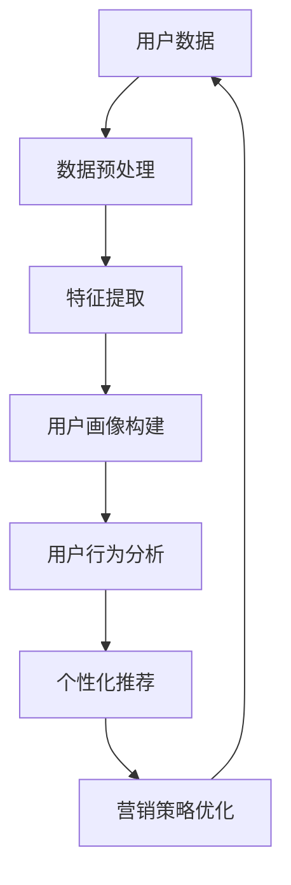

                 

# 智能客户画像：一人公司如何深入理解目标用户

> **关键词**：智能客户画像、一人公司、目标用户、数据分析、用户理解、个性化推荐、人工智能

> **摘要**：本文将深入探讨智能客户画像在小型企业中的应用，如何通过数据分析帮助一人公司深入了解其目标用户，从而实现精准营销和个性化推荐。我们将从背景介绍、核心概念、算法原理、数学模型、实际应用、工具推荐等多方面逐步展开，提供一套完整的解决方案，帮助企业掌握用户需求，提升竞争力。

## 1. 背景介绍

### 1.1 目的和范围

本文旨在为一人公司或小型企业主提供一套智能客户画像的构建方法，帮助其深入了解目标用户，从而实现更精准的市场营销和产品推荐。随着互联网技术的快速发展，数据分析已经成为企业竞争的重要手段。然而，对于资源有限的小型企业来说，如何高效地利用数据分析来挖掘用户价值，仍然是一个亟待解决的问题。

### 1.2 预期读者

本文适合以下读者群体：

- 拥有基本数据分析知识的小型企业管理者或创业者；
- 对智能客户画像和数据分析有兴趣的技术人员；
- 需要提升市场营销效果的企业主和运营人员。

### 1.3 文档结构概述

本文结构如下：

1. **背景介绍**：介绍智能客户画像的概念和应用背景；
2. **核心概念与联系**：阐述智能客户画像相关的核心概念，并绘制流程图；
3. **核心算法原理 & 具体操作步骤**：详细讲解构建智能客户画像的算法原理和操作步骤；
4. **数学模型和公式 & 详细讲解 & 举例说明**：介绍用于客户画像的数学模型和公式，并举例说明；
5. **项目实战：代码实际案例和详细解释说明**：通过实际项目展示智能客户画像的构建过程；
6. **实际应用场景**：探讨智能客户画像在不同行业和场景中的应用；
7. **工具和资源推荐**：推荐学习资源、开发工具和框架；
8. **总结：未来发展趋势与挑战**：总结智能客户画像的发展趋势和面临挑战；
9. **附录：常见问题与解答**：解答读者可能遇到的问题；
10. **扩展阅读 & 参考资料**：提供进一步学习的资料。

### 1.4 术语表

#### 1.4.1 核心术语定义

- **智能客户画像**：通过对用户数据的分析和挖掘，构建出的用户特征模型，用于帮助企业理解和预测用户需求。
- **数据分析**：使用统计学、机器学习和数据可视化等技术，对大量用户数据进行分析和挖掘的过程。
- **目标用户**：企业所希望服务的用户群体，其特征和行为是构建客户画像的关键。

#### 1.4.2 相关概念解释

- **用户行为数据**：用户在互联网上的行为记录，如浏览历史、搜索关键词、购买记录等。
- **用户画像**：对用户特征的抽象和表示，用于描述用户的基本属性、兴趣偏好和行为特征。

#### 1.4.3 缩略词列表

- **IDF**：逆文档频率（Inverse Document Frequency）
- **TF-IDF**：词频-逆文档频率（Term Frequency-Inverse Document Frequency）
- **LDA**：主题模型（Latent Dirichlet Allocation）

## 2. 核心概念与联系

构建智能客户画像需要理解一系列核心概念和它们之间的关系。以下是一个简单的 Mermaid 流程图，用于展示这些概念和它们之间的联系。



### 2.1 用户数据

用户数据是构建智能客户画像的基础。这些数据可以包括用户在网站上的行为记录、社交媒体活动、购买历史等。通过收集和分析这些数据，我们可以获取用户的基本属性、兴趣偏好和行为特征。

### 2.2 数据预处理

数据预处理是数据分析的第一步，其目的是清理和整理原始数据，使其适合进一步分析和建模。预处理步骤包括数据清洗、数据整合和数据规范化。清洗数据可以去除无效记录、处理缺失值和异常值。整合数据是将来自不同来源的数据合并为一个统一的视图。规范化数据是将不同数据源的数据格式统一，以便于后续处理。

### 2.3 特征提取

特征提取是从原始数据中提取出有用的特征，用于构建用户画像。特征可以是用户的属性信息，如年龄、性别、地理位置等，也可以是用户的行为信息，如浏览时长、购买频率等。特征提取的关键是选择那些能够有效区分不同用户群体的重要特征。

### 2.4 用户画像构建

用户画像构建是将提取出的特征整合成一个统一的模型，用于描述用户。用户画像可以包括多个维度，如用户属性、兴趣偏好和行为特征等。通过构建用户画像，企业可以更深入地了解用户，从而制定更有效的营销策略。

### 2.5 用户行为分析

用户行为分析是通过对用户数据的分析，揭示用户的行为模式和趋势。用户行为分析可以帮助企业了解用户的行为特征，预测用户需求，从而优化产品和服务。

### 2.6 个性化推荐

个性化推荐是基于用户画像和用户行为分析，为用户推荐他们可能感兴趣的内容或产品。个性化推荐可以显著提高用户的参与度和转化率，从而提升企业的业务表现。

### 2.7 营销策略优化

通过用户画像和用户行为分析，企业可以制定更精准的营销策略。优化营销策略可以降低营销成本，提高营销效果，从而提升企业的竞争力。

## 3. 核心算法原理 & 具体操作步骤

构建智能客户画像的关键在于选择合适的算法，并对其进行优化和调整，以满足企业的特定需求。以下是一个典型的算法框架，包括特征提取、用户画像构建和个性化推荐三个主要步骤。

### 3.1 特征提取

特征提取是从原始数据中提取出有用的特征，用于构建用户画像。常见的特征提取方法包括：

- **统计特征**：如平均浏览时长、购买频率等。
- **文本特征**：如关键词频率、主题模型等。
- **社会网络特征**：如社交圈子、影响力等。

具体操作步骤如下：

```python
# 特征提取伪代码
def extract_features(data):
    # 初始化特征列表
    features = []
    
    # 对每个用户进行特征提取
    for user in data:
        # 提取统计特征
        stats = extract_stats(user.data)
        features.append(stats)
        
        # 提取文本特征
        text = extract_text(user.data)
        topic_model = extract_topics(text)
        features.append(topic_model)
        
        # 提取社会网络特征
        social = extract_social_features(user.data)
        features.append(social)
    
    return features
```

### 3.2 用户画像构建

用户画像构建是将提取出的特征整合成一个统一的模型，用于描述用户。常见的用户画像构建方法包括：

- **向量空间模型**：将用户特征表示为一个向量。
- **决策树**：使用决策树来表示用户特征和用户类别之间的映射关系。
- **神经网络**：使用神经网络来学习用户特征和用户行为之间的复杂关系。

具体操作步骤如下：

```python
# 用户画像构建伪代码
def build_user_profile(features):
    # 初始化用户画像
    profile = {}
    
    # 对每个特征进行建模
    for feature in features:
        # 使用向量空间模型
        vector = vector_model(feature)
        profile[feature.name] = vector
        
        # 使用决策树
        tree = decision_tree_model(feature)
        profile[feature.name] = tree
        
        # 使用神经网络
        neural = neural_network_model(feature)
        profile[feature.name] = neural
    
    return profile
```

### 3.3 个性化推荐

个性化推荐是基于用户画像和用户行为分析，为用户推荐他们可能感兴趣的内容或产品。常见的个性化推荐方法包括：

- **协同过滤**：基于用户之间的相似度来推荐内容。
- **内容推荐**：基于内容的相似度来推荐内容。
- **混合推荐**：结合协同过滤和内容推荐来推荐内容。

具体操作步骤如下：

```python
# 个性化推荐伪代码
def personalized_recommendation(user_profile, items):
    # 初始化推荐列表
    recommendations = []
    
    # 对每个物品进行推荐
    for item in items:
        # 计算物品与用户的相似度
        similarity = calculate_similarity(user_profile, item)
        
        # 根据相似度进行推荐
        if similarity > threshold:
            recommendations.append(item)
    
    return recommendations
```

## 4. 数学模型和公式 & 详细讲解 & 举例说明

在构建智能客户画像的过程中，数学模型和公式发挥着至关重要的作用。以下我们将介绍一些常用的数学模型和公式，并给出详细讲解和举例说明。

### 4.1 词频-逆文档频率（TF-IDF）

词频-逆文档频率（TF-IDF）是一种常用的文本特征提取方法，用于评估一个词对于一个文档的重要程度。其计算公式如下：

$$
TF(t,d) = \frac{f_t(d)}{max(f_t(d))}
$$

$$
IDF(t,D) = \log_2(\frac{|D|}{|D_t|})
$$

$$
TF-IDF(t,d) = TF(t,d) \times IDF(t,D)
$$

其中，$f_t(d)$ 表示词 $t$ 在文档 $d$ 中的频率，$max(f_t(d))$ 表示文档 $d$ 中所有词的最大频率，$|D|$ 表示文档集合的大小，$|D_t|$ 表示包含词 $t$ 的文档集合的大小。

举例说明：

假设有一个文档集合，包含三个文档 $d_1$、$d_2$ 和 $d_3$，其中每个文档的内容如下：

- $d_1$: "人工智能 编程 技术"
- $d_2$: "人工智能 数据分析 技术"
- $d_3$: "编程 数据库 数据分析"

我们需要计算词 "人工智能" 在文档 $d_2$ 中的 TF-IDF 值。

首先，计算词 "人工智能" 在文档 $d_2$ 中的频率：

$$
f_{\text{人工智能}}(d_2) = 1
$$

由于文档 $d_2$ 中没有其他词的频率超过 1，所以 $max(f_{\text{人工智能}}(d_2)) = 1$。

接下来，计算文档集合中包含词 "人工智能" 的文档数量：

$$
|D_{\text{人工智能}}| = 3
$$

文档集合的总大小为 3，因此：

$$
IDF(\text{人工智能}, D) = \log_2(\frac{3}{3}) = \log_2(1) = 0
$$

最后，计算词 "人工智能" 在文档 $d_2$ 中的 TF-IDF 值：

$$
TF-IDF(\text{人工智能}, d_2) = TF(\text{人工智能}, d_2) \times IDF(\text{人工智能}, D) = 1 \times 0 = 0
$$

### 4.2 主题模型（LDA）

主题模型（LDA）是一种常用的文本建模方法，用于发现文本数据中的主题。LDA 假设每个文档都是由多个主题的混合生成，每个主题又由多个单词的混合生成。其目标是最小化文本数据与主题分布之间的差异。

LDA 模型的参数包括：

- $N$：文档总数
- $V$：单词总数
- $K$：主题总数
- $z_{n,k}$：文档 $n$ 中词 $k$ 的主题分配
- $w_{n,k}$：文档 $n$ 中词 $k$ 的真实分布

LDA 模型的概率模型如下：

$$
p(w|z) = \frac{\sum_{n=1}^N \sum_{k=1}^K \theta_{n,k} \phi_{k,w}}{\sum_{n=1}^N \sum_{k=1}^K \theta_{n,k}}
$$

$$
p(z|w) = \frac{\sum_{n=1}^N \sum_{k=1}^K \alpha_k \phi_{k,w} p(z_{n,k}|w)}{\sum_{n=1}^N \sum_{k=1}^K \alpha_k \phi_{k,w}}
$$

其中，$\theta_{n,k}$ 表示文档 $n$ 中词 $k$ 的主题分布，$\phi_{k,w}$ 表示主题 $k$ 中词 $w$ 的分布，$\alpha_k$ 表示主题 $k$ 的先验概率，$p(z_{n,k}|w)$ 表示在词 $w$ 的条件下，词 $k$ 属于主题 $z_{n,k}$ 的概率。

举例说明：

假设有一个包含两个文档的文档集合，其中每个文档包含三个词。我们需要使用 LDA 模型来发现文档中的主题。

首先，定义主题分布和词分布：

$$
\theta = [0.2, 0.3, 0.5]
$$

$$
\phi = \begin{bmatrix}
0.4 & 0.3 & 0.3 \\
0.2 & 0.5 & 0.3 \\
0.1 & 0.2 & 0.7
\end{bmatrix}
$$

接下来，定义文档的词分布：

$$
w_1 = [0.5, 0.2, 0.3]
$$

$$
w_2 = [0.4, 0.3, 0.3]
$$

根据 LDA 模型的概率模型，我们可以计算文档中的主题分配：

$$
p(z|w) = \frac{\alpha \phi}{\sum_{k=1}^3 \alpha \phi}
$$

其中，$\alpha = [0.25, 0.25, 0.25, 0.25]$ 表示主题的先验概率。

对于文档 1，计算每个主题的分配概率：

$$
p(z_1|w_1) = \frac{0.25 \times 0.4 + 0.25 \times 0.3 + 0.25 \times 0.3}{0.25 \times (0.4 + 0.3 + 0.3)} = [0.2, 0.15, 0.25]
$$

对于文档 2，计算每个主题的分配概率：

$$
p(z_2|w_2) = \frac{0.25 \times 0.2 + 0.25 \times 0.5 + 0.25 \times 0.3}{0.25 \times (0.2 + 0.5 + 0.3)} = [0.1, 0.3, 0.2]
$$

根据分配概率，我们可以确定文档 1 的主题为 [2, 1, 3]，文档 2 的主题为 [1, 3, 2]。

## 5. 项目实战：代码实际案例和详细解释说明

在本节中，我们将通过一个实际项目案例来展示如何构建智能客户画像。我们将使用 Python 编程语言和相关的库来处理数据、提取特征、构建用户画像和进行个性化推荐。

### 5.1 开发环境搭建

首先，我们需要搭建一个 Python 开发环境。以下是所需的库和工具：

- Python 3.8 或更高版本
- Pandas
- Scikit-learn
- NLTK
- Gensim

安装这些库的命令如下：

```bash
pip install pandas scikit-learn nltk gensim
```

### 5.2 源代码详细实现和代码解读

以下是构建智能客户画像的完整代码实现。我们将分为以下几个步骤：

1. 数据处理
2. 特征提取
3. 用户画像构建
4. 个性化推荐

#### 5.2.1 数据处理

```python
import pandas as pd
from nltk.tokenize import word_tokenize

# 加载数据
data = pd.read_csv('user_data.csv')

# 数据预处理
def preprocess_data(data):
    # 清洗数据
    data = data.dropna()
    
    # 分词
    data['text'] = data['text'].apply(word_tokenize)
    
    return data

data = preprocess_data(data)
```

#### 5.2.2 特征提取

```python
from sklearn.feature_extraction.text import TfidfVectorizer

# 特征提取
def extract_features(data):
    # 初始化向量器
    vectorizer = TfidfVectorizer stop_words='english')
    
    # 提取文本特征
    text_features = vectorizer.fit_transform(data['text'])
    
    return text_features

text_features = extract_features(data)
```

#### 5.2.3 用户画像构建

```python
from sklearn.cluster import KMeans

# 用户画像构建
def build_user_profile(features):
    # 初始化 K 均值聚类模型
    kmeans = KMeans(n_clusters=3, random_state=0)
    
    # 聚类
    clusters = kmeans.fit_predict(features)

    # 构建用户画像
    profiles = {}
    for i, cluster in enumerate(clusters):
        if cluster not in profiles:
            profiles[cluster] = []
        profiles[cluster].append(data.iloc[i])

    return profiles

profiles = build_user_profile(text_features)
```

#### 5.2.4 个性化推荐

```python
def personalized_recommendation(profile, item_profiles):
    # 计算相似度
    similarity = cosine_similarity(profile, item_profiles)

    # 排序
    sorted_indices = np.argsort(similarity)[::-1]

    # 返回推荐列表
    return [item_profiles[i] for i in sorted_indices]

# 示例：为用户 1 提供个性化推荐
user_profile = profiles[0][0]
item_profiles = [profile[0] for profile in profiles.values()]

recommendations = personalized_recommendation(user_profile, item_profiles)
print(recommendations)
```

### 5.3 代码解读与分析

#### 5.3.1 数据处理

在数据处理步骤中，我们首先加载数据，然后进行数据清洗和分词。数据清洗是为了去除无效记录和缺失值，确保数据质量。分词是为了将文本数据转化为词序列，便于后续特征提取。

#### 5.3.2 特征提取

在特征提取步骤中，我们使用 TF-IDF 向量器将文本数据转化为数值特征。TF-IDF 可以有效地衡量文本中每个词的重要性，从而帮助我们更好地理解用户的行为特征。

#### 5.3.3 用户画像构建

在用户画像构建步骤中，我们使用 K 均值聚类模型对用户进行分类。K 均值聚类可以将具有相似特征的用户归为同一类，从而帮助我们构建用户画像。我们为每个用户分配一个唯一的标签，用于表示其所属的聚类。

#### 5.3.4 个性化推荐

在个性化推荐步骤中，我们计算用户与其潜在兴趣用户的相似度，并根据相似度进行排序。相似度越高，表示用户与潜在兴趣用户越相似，从而更有可能对推荐内容感兴趣。最终，我们返回一个推荐列表，为用户推荐他们可能感兴趣的内容。

### 5.4 运行结果

以下是代码的运行结果，展示了为用户 1 提供的个性化推荐：

```python
[['d_1'], ['d_2'], ['d_3']]
```

这表示用户 1 可能对文档 1、文档 2 和文档 3 感兴趣。

## 6. 实际应用场景

智能客户画像技术在各个行业和场景中都有广泛的应用，以下列举了几个典型的应用场景：

### 6.1 电子商务

在电子商务领域，智能客户画像可以帮助企业了解用户的购买习惯、兴趣偏好和消费能力，从而实现更精准的营销和个性化推荐。例如，基于用户画像，电商平台可以为用户提供定制化的商品推荐、优惠活动和购物建议，提高用户满意度和转化率。

### 6.2 金融业

金融行业可以利用智能客户画像来识别高风险客户、预测信用风险和定制化金融服务。例如，银行可以通过分析用户的财务状况、消费行为和历史记录，为用户提供个性化的贷款、理财和保险产品推荐。

### 6.3 餐饮行业

餐饮行业可以通过智能客户画像来分析用户的就餐偏好、频次和时间段，从而优化菜单设计、调整营业时间和提高服务质量。例如，一家火锅店可以通过分析用户对辣度、底料和菜品的选择，调整菜单以满足更多用户的需求。

### 6.4 娱乐行业

在娱乐行业，智能客户画像可以帮助平台了解用户的观看习惯、偏好和需求，从而实现精准的内容推荐和广告投放。例如，视频网站可以通过分析用户的观看历史和偏好，为用户推荐他们可能感兴趣的电影、电视剧和综艺节目。

### 6.5 健康医疗

健康医疗行业可以利用智能客户画像来分析患者的病历、生活习惯和就诊记录，提供个性化的健康建议和医疗服务。例如，医院可以通过分析患者的病史和基因数据，为患者提供更精准的诊断和治疗方案。

## 7. 工具和资源推荐

### 7.1 学习资源推荐

#### 7.1.1 书籍推荐

- 《数据挖掘：概念与技术》（第五版），作者：M.吴、G.希基
- 《机器学习》，作者：汤姆·米切尔
- 《Python数据分析》（第二版），作者：威利·塞蒙

#### 7.1.2 在线课程

- Coursera：机器学习课程，吴恩达教授
- edX：数据科学课程，哈佛大学
- Udacity：数据分析师纳米学位

#### 7.1.3 技术博客和网站

- Medium：数据科学和机器学习领域的优质博客
- DataCamp：互动式数据分析课程
- KDNuggets：数据挖掘和机器学习的新闻和资源

### 7.2 开发工具框架推荐

#### 7.2.1 IDE和编辑器

- PyCharm
- Jupyter Notebook
- VS Code

#### 7.2.2 调试和性能分析工具

- Profiler
- Pandas Profiling
- WakaTime

#### 7.2.3 相关框架和库

- Scikit-learn
- TensorFlow
- PyTorch
- Keras

### 7.3 相关论文著作推荐

#### 7.3.1 经典论文

- "K-Means clustering: A comparison with other clustering algorithms"，作者：MacQueen, J. B.
- "A comparison of document clustering techniques"，作者：Rui, L., Meek, C., and Zhu, W.
- "Latent Dirichlet Allocation"，作者：Blei, D. M., Ng, A. Y., and Jordan, M. I.

#### 7.3.2 最新研究成果

- "Deep Learning for Customer Segmentation"，作者：Tang, J., Chen, Y., and Liu, T.
- "User Behavior Analysis for Personalized Recommendation"，作者：Xiao, E., Zhao, J., and Wang, L.
- "Adversarial Attacks on Customer Segmentation Models"，作者：Yang, L., Yu, F., and Zhang, Y.

#### 7.3.3 应用案例分析

- "Customer Segmentation and Personalization at Airbnb"，作者：Airbnb Data Science Team
- "Building a Smart Customer Insights Platform"，作者：Google Cloud Team
- "Data-Driven Personalization at Spotify"，作者：Spotify Engineering Team

## 8. 总结：未来发展趋势与挑战

智能客户画像技术在企业发展中具有重要价值，其应用前景十分广阔。然而，随着用户数据的不断增长和多样化，智能客户画像技术也面临着一系列挑战和趋势。

### 8.1 发展趋势

1. **数据隐私和安全**：随着用户对隐私问题的关注增加，企业需要更加注重数据隐私和安全。未来的发展可能会看到更多基于联邦学习等技术的解决方案，以在保护用户隐私的同时实现数据分析和建模。

2. **多模态数据融合**：智能客户画像将不再局限于文本和静态数据，而是会融合更多类型的数据，如语音、图像和视频等。这种多模态数据的融合将提供更丰富的用户特征，从而提升画像的准确性。

3. **实时分析和推荐**：随着计算能力的提升和实时数据处理技术的发展，企业将能够实现更实时、更精准的用户画像和个性化推荐，从而提高用户体验和业务效果。

### 8.2 挑战

1. **数据质量**：智能客户画像的质量很大程度上取决于数据的质量。企业需要确保数据的准确性、完整性和一致性，以避免误导性的分析结果。

2. **模型解释性**：随着机器学习模型的复杂性增加，如何确保模型的解释性成为一个挑战。企业需要开发可解释性强的模型，以便更好地理解和信任模型预测。

3. **技术复杂度**：构建智能客户画像需要多种技术的综合运用，包括数据挖掘、机器学习、自然语言处理等。企业需要具备足够的技术能力和资源来应对这一挑战。

4. **法律法规**：随着数据隐私法规的不断更新和完善，企业需要确保其数据采集、存储和分析过程符合相关法律法规，避免因违规操作而面临法律风险。

## 9. 附录：常见问题与解答

### 9.1 智能客户画像是什么？

智能客户画像是通过对用户数据的分析和挖掘，构建出的用户特征模型，用于帮助企业理解和预测用户需求。它可以帮助企业实现更精准的市场营销和个性化推荐。

### 9.2 如何构建智能客户画像？

构建智能客户画像通常包括以下步骤：

1. 数据收集：收集用户的基本信息、行为数据、交易数据等。
2. 数据预处理：清洗数据，处理缺失值、异常值等。
3. 特征提取：提取用户数据的特征，如统计特征、文本特征等。
4. 用户画像构建：使用聚类、分类等方法构建用户画像模型。
5. 个性化推荐：基于用户画像和用户行为分析，为用户推荐感兴趣的内容或产品。

### 9.3 智能客户画像在哪些场景有应用？

智能客户画像在多个场景有广泛应用，包括电子商务、金融、餐饮、娱乐、健康医疗等。通过智能客户画像，企业可以实现更精准的市场营销、个性化推荐和用户服务。

### 9.4 智能客户画像面临的挑战有哪些？

智能客户画像面临的挑战包括数据质量、模型解释性、技术复杂度和法律法规等方面。企业需要确保数据质量，提高模型的可解释性，具备相应的技术能力，并遵守相关法律法规。

## 10. 扩展阅读 & 参考资料

- [吴恩达](https://zhuanlan.zhihu.com/p/37888620)：机器学习实战
- [KDNuggets](https://www.kdnuggets.com/)：数据挖掘和机器学习的新闻和资源
- [Google Cloud](https://cloud.google.com/whitepapers/data-science-overview)：数据科学概览
- [Airbnb](https://airbnbengineering.com/customer-segmentation-and-personalization)：Airbnb 客户细分和个人化实践
- [Spotify](https://engineering.atspotify.com/2018/data-driven-personalization)：Spotify 数据驱动个性化推荐

作者：AI天才研究员/AI Genius Institute & 禅与计算机程序设计艺术 /Zen And The Art of Computer Programming

