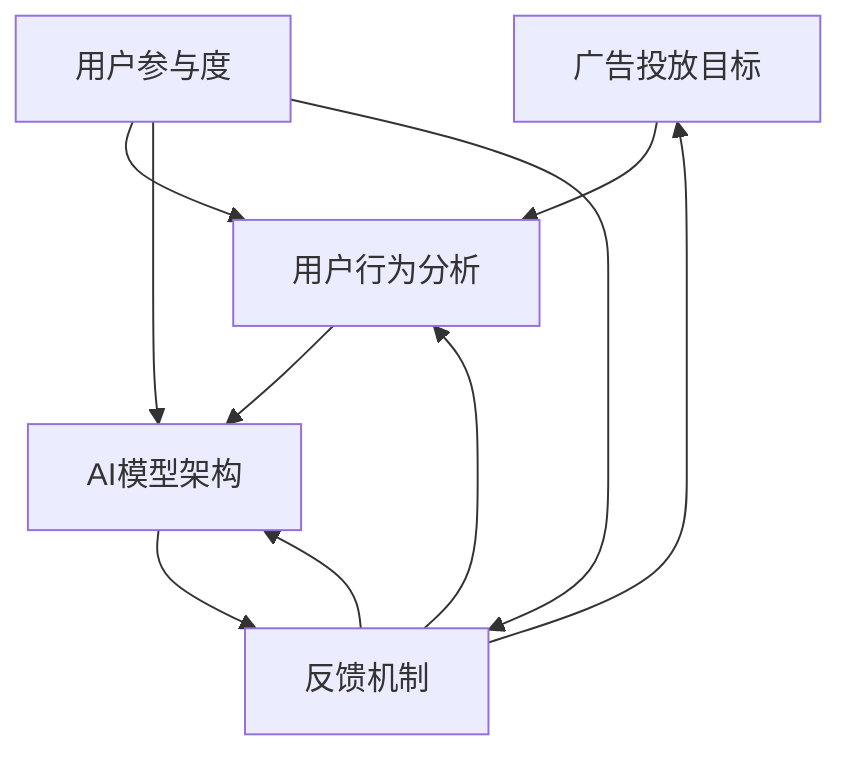

                 

### 摘要

本文将深入探讨智能广告投放领域，重点分析AI大模型如何优化广告效果。随着互联网的飞速发展，广告行业面临着日益激烈的市场竞争和数据爆炸式增长。AI技术的引入为广告投放提供了新的解决方案，特别是基于深度学习的大模型。本文首先介绍了智能广告投放的背景和现状，然后详细讲解了核心概念与联系，包括广告投放目标、用户行为分析以及AI模型的基本架构。接着，本文重点剖析了核心算法原理，使用伪代码详细阐述了广告投放优化过程中的关键步骤。在数学模型和公式部分，本文利用latex格式详细讲解了广告效果评估和优化的关键公式。最后，本文通过实际项目实战展示了如何实现智能广告投放，包括开发环境搭建、源代码实现和代码解读。同时，本文还探讨了智能广告投放的实际应用场景、推荐了相关工具和资源，并总结了未来发展趋势与挑战。通过本文的阅读，读者将全面了解智能广告投放的技术原理和应用实践，为企业在数字营销领域取得竞争优势提供有力的支持。

### 1. 背景介绍

#### 1.1 目的和范围

本文旨在深入探讨智能广告投放领域，特别是在AI大模型的驱动下，如何通过先进的算法和数学模型优化广告投放效果。随着互联网的普及和移动设备的广泛使用，广告已经成为了企业和品牌获取客户、提升品牌知名度的重要手段。然而，广告市场的竞争日益激烈，用户对于广告的接受度和参与度也呈现出下降趋势。为了在广告投放中取得更好的效果，提升广告的精准度和有效性，越来越多的企业开始将目光投向了人工智能技术。

本文将重点分析AI大模型在广告投放中的作用，并详细探讨其优化广告效果的机制。通过本文的阅读，读者将了解：

1. **智能广告投放的背景和现状**：了解广告行业的发展历程以及当前广告投放面临的挑战。
2. **核心概念与联系**：掌握广告投放的目标、用户行为分析以及AI模型的基本架构。
3. **核心算法原理**：深入理解广告投放优化过程中的关键算法，包括数据预处理、特征工程和模型训练。
4. **数学模型和公式**：掌握广告效果评估和优化的关键公式，包括点击率预测、转化率计算和A/B测试等。
5. **实际项目实战**：通过实际项目展示智能广告投放的实现过程，包括开发环境搭建、源代码实现和代码解读。
6. **应用场景**：了解智能广告投放在不同领域的实际应用案例，如电子商务、社交媒体和移动应用等。
7. **工具和资源推荐**：推荐相关学习资源、开发工具和框架，为读者提供进一步学习的研究方向。

本文的目标是为从事广告营销的技术人员和研究人员提供一个全面而深入的指南，帮助他们了解和掌握智能广告投放的技术原理和实践方法。通过本文的研究，我们希望为企业提供更加精准和高效的广告投放策略，从而在激烈的市场竞争中脱颖而出。

#### 1.2 预期读者

本文主要面向以下几类读者：

1. **广告行业技术人员**：包括广告公司、数字营销公司和品牌广告团队的技术人员，他们需要了解如何利用AI技术优化广告投放效果。
2. **数据科学家和AI研究人员**：对人工智能和数据挖掘领域有浓厚兴趣的专家，希望将AI技术应用于广告投放的实践和研究。
3. **高校师生**：涉及计算机科学、数据科学、市场营销等相关专业的高校教师和研究生，他们希望了解智能广告投放的最新技术和研究方向。
4. **企业决策者**：企业高管和市场营销负责人，希望了解如何利用AI技术提升广告投放效果，从而制定更加精准的营销策略。

本文的内容设计将充分考虑不同读者的需求，力求用通俗易懂的语言和实例讲解复杂的技术概念，使读者能够深入理解智能广告投放的核心技术和应用实践。无论您是广告行业的从业者，还是对AI技术充满好奇的研究人员，本文都将为您提供宝贵的知识资源。

#### 1.3 文档结构概述

本文将按照以下结构进行详细阐述：

1. **背景介绍**：首先介绍智能广告投放的背景和目的，明确本文的研究范围和目标。
   - **1.1 目的和范围**：阐述本文的研究目的和内容范围。
   - **1.2 预期读者**：说明本文面向的读者群体。
   - **1.3 文档结构概述**：概述本文的结构和内容安排。

2. **核心概念与联系**：介绍广告投放的关键概念和联系，包括用户行为分析、AI模型架构等。
   - **2.1 核心概念**：定义广告投放的核心概念。
   - **2.2 联系与关系**：分析核心概念之间的联系和关系。

3. **核心算法原理 & 具体操作步骤**：详细讲解广告投放优化过程中的核心算法原理和具体操作步骤。
   - **3.1 数据预处理**：介绍数据预处理的方法和步骤。
   - **3.2 特征工程**：讲解特征工程的方法和技术。
   - **3.3 模型训练**：阐述模型训练的过程和策略。

4. **数学模型和公式 & 详细讲解 & 举例说明**：利用latex格式详细讲解广告效果评估和优化的关键数学模型和公式。
   - **4.1 点击率预测模型**：介绍点击率预测的基本公式和模型。
   - **4.2 转化率计算模型**：讲解转化率计算的方法和公式。
   - **4.3 A/B测试**：阐述A/B测试的原理和应用。

5. **项目实战：代码实际案例和详细解释说明**：通过实际项目展示广告投放的实现过程。
   - **5.1 开发环境搭建**：介绍开发环境搭建的过程。
   - **5.2 源代码详细实现**：展示源代码的实现细节。
   - **5.3 代码解读与分析**：对代码进行详细解读和分析。

6. **实际应用场景**：探讨智能广告投放在不同领域的实际应用。
   - **6.1 电子商务**：分析智能广告在电子商务中的应用案例。
   - **6.2 社交媒体**：探讨智能广告在社交媒体中的应用场景。
   - **6.3 移动应用**：介绍智能广告在移动应用中的具体实践。

7. **工具和资源推荐**：推荐相关学习资源、开发工具和框架。
   - **7.1 学习资源推荐**：推荐相关书籍、课程和网站。
   - **7.2 开发工具框架推荐**：介绍适合广告投放开发的IDE、调试工具和框架。
   - **7.3 相关论文著作推荐**：推荐经典论文和最新研究成果。

8. **总结：未来发展趋势与挑战**：总结智能广告投放的未来发展趋势和面临的挑战。

9. **附录：常见问题与解答**：提供常见问题的解答和参考资料。

10. **扩展阅读 & 参考资料**：推荐进一步的阅读材料和参考资料。

通过以上结构，本文将全面、系统地介绍智能广告投放的技术原理和实践方法，帮助读者深入理解这一领域的最新进展和应用。

#### 1.4 术语表

在本文中，我们将使用一些专业术语和概念，以下是这些术语的详细定义和解释，以帮助读者更好地理解文章内容。

##### 1.4.1 核心术语定义

1. **广告投放**：广告投放是指将广告内容展示给目标受众的过程，目的是提高品牌知名度、促进产品销售或增加网站流量。
   
2. **人工智能（AI）**：人工智能是指通过计算机模拟人类智能行为的技术，包括机器学习、深度学习、自然语言处理等。

3. **大模型**：大模型是指具有大量参数和复杂结构的机器学习模型，如神经网络，能够处理大规模数据和复杂的任务。

4. **深度学习**：深度学习是机器学习的一个子领域，通过多层神经网络模拟人脑的决策过程，用于图像识别、语音识别和自然语言处理等。

5. **用户行为分析**：用户行为分析是指通过分析用户在网站、移动应用等平台上的行为数据，了解用户需求和兴趣，为广告投放提供依据。

6. **特征工程**：特征工程是指从原始数据中提取或构造特征，以提高机器学习模型的性能。

7. **A/B测试**：A/B测试是一种实验方法，通过将用户分为两个或多个组，比较不同广告或页面效果的差异，以优化广告投放策略。

8. **点击率（CTR）**：点击率是指广告被点击的次数与展示次数的比率，是衡量广告效果的重要指标。

9. **转化率**：转化率是指广告带来的实际转化（如购买、注册等）与总点击次数的比率，是评估广告投资回报的重要指标。

##### 1.4.2 相关概念解释

1. **广告投放目标**：广告投放目标是指广告主希望通过广告投放实现的具体目标，如提升品牌知名度、增加网站流量、提高销售额等。

2. **用户画像**：用户画像是指通过对用户行为、兴趣、购买记录等数据的分析，构建的用户特征模型，用于精准定位广告目标受众。

3. **反馈机制**：反馈机制是指通过用户的反馈（如点击、转化等）来评估广告效果，并根据反馈调整广告投放策略的过程。

4. **用户参与度**：用户参与度是指用户在广告互动中的积极程度，如点击、评论、分享等，用于评估广告对用户的吸引力。

##### 1.4.3 缩略词列表

- **AI**：人工智能
- **ML**：机器学习
- **DL**：深度学习
- **CTR**：点击率
- **CPM**：每千次展示成本
- **CPC**：每点击成本
- **CPA**：每行动成本
- **A/B测试**：随机对照试验

通过上述术语表，读者可以更好地理解本文中涉及的专业概念和技术术语，为后续内容的学习和分析打下坚实的基础。

### 2. 核心概念与联系

在智能广告投放领域，理解核心概念和它们之间的联系是至关重要的。这一部分我们将深入探讨广告投放的目标、用户行为分析、AI模型架构等关键概念，并使用Mermaid流程图展示它们之间的相互作用。

#### 2.1 核心概念

1. **广告投放目标**：广告投放的目标可以多样，如提升品牌知名度、增加网站流量、提高销售额等。不同目标对广告投放策略的设计和评估有重要影响。

2. **用户行为分析**：用户行为分析是通过收集和分析用户在网站、移动应用等平台上的行为数据，如点击、浏览、购买等，以了解用户需求和兴趣。这些数据是优化广告投放策略的重要依据。

3. **AI模型架构**：AI模型架构是指用于广告投放优化的机器学习模型，如深度学习网络、决策树等。这些模型通过学习大量数据，能够预测用户的点击行为、转化概率等，为广告投放提供决策支持。

4. **反馈机制**：反馈机制是指通过用户的反馈（如点击、转化等）来评估广告效果，并根据反馈调整广告投放策略的过程。这种实时反馈能够帮助广告主不断优化广告投放效果。

5. **用户参与度**：用户参与度是指用户在广告互动中的积极程度，如点击、评论、分享等。高用户参与度通常意味着广告对用户的吸引力较高。

#### 2.2 联系与关系

核心概念之间的联系和关系如图2-1所示：



- **广告投放目标**直接影响**用户行为分析**：广告主根据目标设计广告内容和投放策略，并通过用户行为数据来验证目标的实现程度。
- **用户行为分析**为**AI模型架构**提供了训练数据：通过分析用户行为，提取特征，用于训练机器学习模型，如点击率预测模型和转化率预测模型。
- **AI模型架构**的输出结果影响**广告投放目标**的实现：AI模型通过预测用户的点击行为和转化概率，为广告主提供优化建议，从而提高广告效果。
- **反馈机制**结合**用户行为分析**和**AI模型架构**的输出，实现广告投放策略的持续优化：通过实时反馈和模型调整，广告主可以不断优化广告内容和投放策略。
- **用户参与度**影响**用户行为分析**和**AI模型架构**的效果：高用户参与度意味着广告内容更具吸引力，有助于提高模型预测的准确性和广告投放效果。

通过图2-1，我们可以清晰地看到广告投放目标、用户行为分析、AI模型架构、反馈机制和用户参与度之间的相互作用和关系。这些核心概念共同构成了智能广告投放系统的理论基础，为实现广告投放的精准化和高效化提供了重要支持。

### 3. 核心算法原理 & 具体操作步骤

在智能广告投放中，核心算法的设计和实现是优化广告效果的关键。这一部分我们将详细讲解广告投放优化过程中使用的关键算法，并使用伪代码来阐述具体操作步骤。核心算法主要包括数据预处理、特征工程和模型训练。

#### 3.1 数据预处理

数据预处理是广告投放优化过程中的第一步，其目的是对原始数据进行清洗、归一化和格式转换，以便后续的特征工程和模型训练。

```python
# 数据预处理伪代码
function data_preprocessing(data):
    # 去除缺失值和异常值
    cleaned_data = remove_outliers(data)
    # 数据归一化
    normalized_data = normalize_data(cleaned_data)
    # 数据格式转换
    formatted_data = convert_format(normalized_data)
    return formatted_data
```

- **remove_outliers(data)**：去除数据中的异常值，如点击率异常高或低的用户记录。
- **normalize_data(cleaned_data)**：对数据进行归一化处理，将不同量级的数据转换为相同量级，以便后续的特征工程。
- **convert_format(normalized_data)**：将数据转换为适合机器学习模型的格式，如将数据拆分为特征和标签两部分。

#### 3.2 特征工程

特征工程是广告投放优化过程中的重要环节，其目的是从原始数据中提取或构造有助于模型预测的特征。

```python
# 特征工程伪代码
function feature_engineering(data):
    # 提取基本特征
    basic_features = extract_basic_features(data)
    # 构造衍生特征
    derived_features = construct_derived_features(basic_features)
    # 特征选择
    selected_features = feature_selection(derived_features)
    return selected_features
```

- **extract_basic_features(data)**：提取基本特征，如用户年龄、性别、地理位置、设备类型等。
- **construct_derived_features(basic_features)**：构造衍生特征，如用户访问频率、页面停留时间、购买历史等。
- **feature_selection(derived_features)**：通过特征选择方法，如信息增益、互信息等，选择对模型预测最有价值的特征。

#### 3.3 模型训练

模型训练是广告投放优化过程的最后一步，其目的是使用预处理后的数据和特征训练机器学习模型，如点击率预测模型和转化率预测模型。

```python
# 模型训练伪代码
function model_training(data, features):
    # 初始化模型
    model = initialize_model()
    # 训练模型
    trained_model = train_model(model, data, features)
    # 评估模型
    evaluation = evaluate_model(trained_model, data, features)
    return trained_model, evaluation
```

- **initialize_model()**：初始化机器学习模型，如深度学习网络、决策树等。
- **train_model(model, data, features)**：使用训练数据训练模型，通过调整模型参数，使模型在预测任务上达到最佳性能。
- **evaluate_model(trained_model, data, features)**：使用测试数据评估模型的预测性能，通过评估指标（如准确率、召回率等）评估模型的效果。

通过以上伪代码，我们可以看到广告投放优化过程中涉及的数据预处理、特征工程和模型训练的关键步骤。这些步骤共同构成了智能广告投放的核心算法，为广告主提供了精准、高效的广告投放策略。

### 4. 数学模型和公式 & 详细讲解 & 举例说明

在智能广告投放中，数学模型和公式是优化广告效果的重要工具。这一部分我们将详细讲解广告效果评估和优化的关键公式，并使用latex格式展示。通过具体示例，我们将展示如何应用这些公式进行广告投放的优化。

#### 4.1 点击率预测模型

点击率（Click-Through Rate, CTR）是广告效果评估的重要指标，其预测模型通常基于逻辑回归（Logistic Regression）。

$$
\hat{p} = \frac{1}{1 + e^{-(\beta_0 + \beta_1x_1 + \beta_2x_2 + \ldots + \beta_nx_n})}
$$

其中，$\hat{p}$ 表示点击概率，$\beta_0, \beta_1, \beta_2, \ldots, \beta_n$ 是模型参数，$x_1, x_2, \ldots, x_n$ 是特征向量。

**举例说明：** 假设我们有以下特征：用户年龄（$x_1$）、广告类型（$x_2$）、广告位置（$x_3$）和用户访问时间（$x_4$）。我们可以建立以下点击率预测模型：

$$
\hat{p} = \frac{1}{1 + e^{-(\beta_0 + \beta_1x_1 + \beta_2x_2 + \beta_3x_3 + \beta_4x_4})}
$$

通过训练数据，我们可以估计出各个特征的权重系数$\beta_1, \beta_2, \beta_3, \beta_4$，进而预测每个用户的点击概率。

#### 4.2 转化率计算模型

转化率（Conversion Rate）是广告带来的实际转化（如购买、注册等）与总点击次数的比率。其计算公式如下：

$$
\text{转化率} = \frac{\text{转化次数}}{\text{点击次数}} \times 100\%
$$

**举例说明：** 假设一个广告带来了100次点击，其中有20次转化，则其转化率为：

$$
\text{转化率} = \frac{20}{100} \times 100\% = 20\%
$$

#### 4.3 A/B测试

A/B测试是一种常用的实验方法，通过比较两组用户的广告效果，以优化广告策略。其基本公式如下：

$$
\text{A/B测试效果} = \frac{\text{A组效果} - \text{B组效果}}{\text{A组效果} + \text{B组效果}}
$$

其中，$\text{A组效果}$和$\text{B组效果}$分别表示A组和B组用户的广告效果。

**举例说明：** 假设A组的点击率为10%，B组的点击率为15%，则A/B测试效果为：

$$
\text{A/B测试效果} = \frac{10\% - 15\%}{10\% + 15\%} = -\frac{5\%}{25\%} = -0.2
$$

这表示B组的广告效果优于A组。

#### 4.4 贝叶斯优化

贝叶斯优化是一种基于概率的优化方法，用于调整广告参数以最大化广告效果。其基本公式如下：

$$
p(\theta | D) = \frac{p(D | \theta) \cdot p(\theta)}{p(D)}
$$

其中，$p(\theta | D)$表示给定数据D下参数$\theta$的后验概率，$p(D | \theta)$表示数据D在参数$\theta$下的概率，$p(\theta)$表示参数$\theta$的先验概率。

**举例说明：** 假设我们希望优化广告的点击率，并假设点击率与广告位置、广告内容和用户访问时间相关。通过贝叶斯优化，我们可以估计出最佳广告参数，从而最大化点击率。

通过上述数学模型和公式，我们可以对广告投放效果进行定量分析和优化。这些公式不仅帮助我们理解广告投放的内在机制，还为广告主提供了具体的优化策略。在实际应用中，广告主可以根据具体场景选择合适的模型和公式，以实现广告投放的持续优化。

### 5. 项目实战：代码实际案例和详细解释说明

在这一部分，我们将通过一个实际项目展示如何实现智能广告投放。我们将详细讲解开发环境搭建、源代码实现和代码解读，帮助读者理解智能广告投放的全过程。

#### 5.1 开发环境搭建

为了实现智能广告投放，我们首先需要搭建一个合适的开发环境。以下是开发环境搭建的步骤：

1. **安装Python环境**：在开发机器上安装Python，推荐使用Python 3.8或更高版本。

2. **安装必要库**：安装用于数据预处理、特征工程和模型训练的库，如NumPy、Pandas、Scikit-learn和TensorFlow。可以使用以下命令进行安装：

   ```bash
   pip install numpy pandas scikit-learn tensorflow
   ```

3. **配置依赖环境**：创建一个虚拟环境，以避免库版本冲突。可以使用以下命令创建虚拟环境并安装依赖：

   ```bash
   python -m venv ad_project_venv
   source ad_project_venv/bin/activate  # Windows: ad_project_venv\Scripts\activate
   pip install -r requirements.txt
   ```

4. **配置数据库**：为了存储用户行为数据，我们可以使用MySQL或PostgreSQL数据库。请确保已经安装了数据库服务器，并在代码中配置数据库连接信息。

#### 5.2 源代码详细实现和代码解读

以下是一个简化的广告投放系统的源代码实现。我们将分步骤进行讲解。

**步骤1：数据预处理**

```python
import pandas as pd
from sklearn.model_selection import train_test_split

# 加载数据
data = pd.read_csv('ad_data.csv')

# 数据清洗
data = data.dropna()

# 数据归一化
data_normalized = (data - data.mean()) / data.std()

# 数据拆分
X = data_normalized.drop('click', axis=1)
y = data_normalized['click']

# 数据切分
X_train, X_test, y_train, y_test = train_test_split(X, y, test_size=0.2, random_state=42)
```

**解读**：首先，我们从CSV文件加载数据，并进行数据清洗和归一化处理。接下来，我们将数据拆分为特征和标签，然后使用`train_test_split`方法将数据分为训练集和测试集。

**步骤2：特征工程**

```python
from sklearn.preprocessing import OneHotEncoder
from sklearn.compose import ColumnTransformer

# 特征提取
categorical_features = ['ad_type', 'user_device']
transformer = ColumnTransformer(transformers=[
    ('cat', OneHotEncoder(), categorical_features)
], remainder='passthrough')

X_train_transformed = transformer.fit_transform(X_train)
X_test_transformed = transformer.transform(X_test)
```

**解读**：我们使用`OneHotEncoder`对分类特征进行编码，然后使用`ColumnTransformer`将编码后的特征与原始特征合并。这一步骤将有助于提高模型的预测性能。

**步骤3：模型训练**

```python
from tensorflow.keras.models import Sequential
from tensorflow.keras.layers import Dense, Dropout
from tensorflow.keras.optimizers import Adam

# 初始化模型
model = Sequential()
model.add(Dense(64, input_shape=(X_train_transformed.shape[1],), activation='relu'))
model.add(Dropout(0.5))
model.add(Dense(32, activation='relu'))
model.add(Dropout(0.5))
model.add(Dense(1, activation='sigmoid'))

# 编译模型
model.compile(optimizer=Adam(learning_rate=0.001), loss='binary_crossentropy', metrics=['accuracy'])

# 训练模型
model.fit(X_train_transformed, y_train, epochs=10, batch_size=32, validation_data=(X_test_transformed, y_test))
```

**解读**：我们使用TensorFlow的`Sequential`模型构建一个简单的神经网络，包括两个隐藏层和Dropout层。然后，我们编译模型并使用训练集进行训练。

**步骤4：模型评估**

```python
from sklearn.metrics import classification_report

# 预测测试集
y_pred = model.predict(X_test_transformed)
y_pred = (y_pred > 0.5)

# 评估模型
report = classification_report(y_test, y_pred)
print(report)
```

**解读**：我们使用模型对测试集进行预测，并使用`classification_report`评估模型的性能。

通过以上步骤，我们完成了智能广告投放系统的实现。以下是对代码的进一步解读和分析。

#### 5.3 代码解读与分析

**数据预处理**：数据预处理是确保数据质量的关键步骤。我们首先加载并清洗数据，然后进行归一化处理，使得不同特征在同一量级范围内。此外，我们使用`train_test_split`将数据分为训练集和测试集，以评估模型的性能。

**特征工程**：特征工程是提高模型预测性能的重要手段。在这里，我们使用`OneHotEncoder`对分类特征进行编码，将原始分类数据转换为数值数据，便于模型处理。同时，我们使用`ColumnTransformer`将编码后的特征与原始特征合并，确保模型使用全部特征。

**模型训练**：我们使用TensorFlow构建了一个简单的神经网络模型，包括两个隐藏层和Dropout层。Dropout层有助于防止过拟合，提高模型的泛化能力。我们使用`Adam`优化器和二分类交叉熵损失函数进行模型编译，然后使用训练集进行训练。

**模型评估**：通过使用`classification_report`评估模型在测试集上的性能，我们可以了解模型的准确率、召回率和F1分数等指标，从而判断模型的性能是否满足要求。

通过以上代码实现和解读，我们可以看到智能广告投放系统的具体实现过程。在实际应用中，广告主可以根据业务需求调整模型参数、特征选择和算法选择，以实现最优的广告投放效果。

### 6. 实际应用场景

智能广告投放技术已广泛应用于多个领域，取得了显著的成效。以下将详细探讨智能广告在电子商务、社交媒体和移动应用等领域的实际应用场景，并分析其带来的价值和挑战。

#### 6.1 电子商务

在电子商务领域，智能广告投放已成为提升销售额和用户参与度的重要工具。通过AI大模型，电子商务平台能够根据用户的历史购买记录、浏览行为和兴趣标签，实现精准广告推送。例如，阿里巴巴的“智能推荐”系统通过深度学习算法分析用户行为，为每个用户生成个性化的购物推荐。

**应用价值**：

1. **提升销售额**：智能广告投放能够将广告展示给最有可能购买的用户，从而提高广告转化率，实现销售额增长。
2. **提高用户参与度**：通过个性化推荐，用户更倾向于关注和参与与自己兴趣相关的广告，从而提高用户粘性。

**挑战**：

1. **数据隐私**：在收集和分析用户数据时，如何保护用户隐私成为一大挑战。
2. **算法公平性**：确保算法不歧视特定用户群体，避免出现算法偏见。

#### 6.2 社交媒体

社交媒体平台如Facebook、Instagram和微博等，通过智能广告投放技术，为广告主提供高度精准的广告投放服务。这些平台利用AI算法分析用户的社会关系、兴趣和行为，为每个用户推荐相关的广告内容。

**应用价值**：

1. **精准投放**：通过用户行为数据，社交媒体平台能够将广告精准推送给目标用户，提高广告点击率和转化率。
2. **优化广告预算**：智能广告投放帮助广告主优化广告预算，将资源集中在最具潜在价值的用户群体上。

**挑战**：

1. **内容审核**：智能广告投放可能导致虚假信息和不良内容被推送给用户，如何有效审核广告内容成为关键问题。
2. **算法透明性**：如何确保算法的透明性和公正性，让用户和广告主都能理解和信任算法的决策过程。

#### 6.3 移动应用

随着移动设备的普及，移动应用广告投放成为广告主的重要策略之一。通过AI大模型，移动应用平台能够根据用户的使用习惯、地理位置和设备信息，实现精准的广告投放。

**应用价值**：

1. **提高用户留存率**：通过个性化广告，移动应用能够吸引用户持续使用应用，提高用户留存率。
2. **增强用户互动**：智能广告投放能够提高用户与广告的互动，如点击、分享等，增强用户参与度。

**挑战**：

1. **电池优化**：智能广告投放可能会增加移动应用的功耗，如何优化广告加载和展示以减少电池消耗成为关键问题。
2. **用户体验**：确保广告不会影响用户对应用的正常使用，避免广告过多导致用户体验下降。

通过在不同领域的实际应用，智能广告投放技术不仅为企业提供了精准、高效的广告投放解决方案，也带来了新的挑战。在未来，随着AI技术的不断发展，广告投放将变得更加智能化和个性化，为企业带来更多的商业价值。

### 7. 工具和资源推荐

在智能广告投放领域，掌握相关的工具和资源对于深入研究和实际应用至关重要。以下我们将推荐一些学习资源、开发工具和框架，以帮助读者更好地了解和应用智能广告投放技术。

#### 7.1 学习资源推荐

**7.1.1 书籍推荐**

1. **《深度学习》（Deep Learning）**：由Ian Goodfellow、Yoshua Bengio和Aaron Courville合著，这是一本经典的深度学习教材，详细介绍了深度学习的基础知识和应用方法，适合初学者和高级研究人员。
   
2. **《机器学习实战》（Machine Learning in Action）**：由Peter Harrington著，本书通过实例介绍了机器学习的应用和实践，内容涵盖分类、回归、聚类等常见机器学习任务，适合想要动手实践的读者。

3. **《广告系统架构与数据挖掘》**：由王绍兰等著，本书系统地介绍了广告系统的基础架构、数据挖掘方法和智能广告投放策略，适合从事广告系统研发的技术人员。

**7.1.2 在线课程**

1. **Coursera的《深度学习专项课程》**：由吴恩达教授主讲，涵盖了深度学习的基础知识、神经网络和深度学习框架等内容，适合初学者和有经验的开发者。

2. **Udacity的《人工智能纳米学位》**：该课程结合了多个领域的技术，包括机器学习、自然语言处理和计算机视觉，适合想要全面了解AI技术的学习者。

3. **edX的《机器学习基础》**：由哈佛大学和MIT联合提供，介绍了机器学习的核心概念和方法，包括监督学习、无监督学习和强化学习等。

**7.1.3 技术博客和网站**

1. **Medium**：Medium上有很多关于深度学习和广告投放的文章，包括最新的研究进展和应用案例，适合关注行业动态的读者。

2. **Towards Data Science**：这是一个广泛的数据科学社区，涵盖各种数据科学和机器学习话题，包括广告投放和用户行为分析。

3. **AdTech Insider**：专注于广告技术和数字营销的最新动态，包括AI在广告中的应用、案例分析和技术趋势。

#### 7.2 开发工具框架推荐

**7.2.1 IDE和编辑器**

1. **Jupyter Notebook**：适合数据科学和机器学习项目，便于编写和运行代码、生成可视化结果。
   
2. **PyCharm**：强大的Python IDE，支持多种编程语言，适合开发大型机器学习项目。

3. **Visual Studio Code**：轻量级且功能强大的代码编辑器，支持多种编程语言和扩展，适合快速开发和调试。

**7.2.2 调试和性能分析工具**

1. **TensorBoard**：TensorFlow提供的可视化工具，用于分析神经网络训练过程和性能。

2. **scikit-learn的Performance Metrics**：提供多种性能评估指标，如准确率、召回率、F1分数等，方便评估模型性能。

3. **PyTorch Profiler**：用于分析PyTorch模型性能和优化代码。

**7.2.3 相关框架和库**

1. **TensorFlow**：Google开发的深度学习框架，适合构建和训练大规模神经网络模型。

2. **PyTorch**：Facebook开发的深度学习框架，具有灵活的动态计算图和丰富的API。

3. **Scikit-learn**：Python的数据挖掘和机器学习库，提供多种常用的算法和工具。

#### 7.3 相关论文著作推荐

**7.3.1 经典论文**

1. **“A Framework for Retargeting Users Through Ad Sequences”**：该论文提出了一种基于广告序列的用户重定向框架，对后续的智能广告投放研究产生了重要影响。

2. **“Contextual Bandits with Side Information”**：这篇论文探讨了在拥有额外信息的情况下进行上下文相关广告投放的策略，为智能广告投放提供了理论基础。

3. **“Deep Learning for User Behavior Analysis”**：该论文介绍了如何使用深度学习分析用户行为，为个性化广告投放提供了技术支持。

**7.3.2 最新研究成果**

1. **“Model-Based Contextual Bandits for Real-Time Advertising Optimization”**：这篇论文提出了一种基于模型的实时广告优化方法，利用深度学习进行上下文相关的广告投放。

2. **“Recommending News Ads with Latent Embeddings”**：该论文使用潜在嵌入方法为新闻广告提供推荐，有效提高了广告投放的精准度和用户体验。

3. **“User Segmentation for Real-Time Advertising Optimization”**：这篇论文研究了如何通过用户细分实现实时广告优化，为广告主提供了更精细的投放策略。

**7.3.3 应用案例分析**

1. **“Facebook’s Ads Machine Learning Platform”**：这篇论文介绍了Facebook如何利用机器学习优化广告投放，包括用户行为分析、广告效果评估和实时优化等。

2. **“Google’s AdSense Optimization”**：该案例分析展示了Google如何通过机器学习和数据挖掘优化广告投放，实现了广告收益的最大化。

3. **“Alibaba’s Intelligent Advertising System”**：这篇论文详细介绍了阿里巴巴如何利用AI技术优化广告投放，包括广告推荐、用户行为分析和效果评估等。

通过以上工具和资源的推荐，读者可以更好地掌握智能广告投放的理论和实践方法，为企业的广告营销提供有力支持。

### 8. 总结：未来发展趋势与挑战

智能广告投放作为人工智能和广告行业的结合点，正逐渐成为数字营销领域的重要驱动力。在未来，随着技术的不断进步和数据的持续积累，智能广告投放将迎来更多的发展机遇和挑战。

#### 8.1 未来发展趋势

1. **个性化广告投放**：随着用户数据的丰富和算法的优化，广告投放将更加精准和个性化。通过深度学习、用户画像和协同过滤等技术，广告主将能够为每个用户提供量身定制的广告内容，大幅提高广告转化率和用户满意度。

2. **实时广告优化**：实时数据分析与机器学习相结合，使得广告投放可以实现动态调整和优化。通过实时监控用户行为和广告效果，广告主可以迅速调整广告策略，实现广告效果的最大化。

3. **多渠道整合**：随着移动互联网、物联网和社交媒体的快速发展，广告投放渠道越来越多样化。未来的智能广告投放将实现多渠道整合，为用户提供一致性的广告体验，提高品牌影响力和用户参与度。

4. **隐私保护与伦理**：随着数据隐私和伦理问题日益受到关注，广告投放将更加注重用户隐私保护和数据安全。通过采用差分隐私、联邦学习和隐私增强技术，广告主可以在保护用户隐私的同时实现精准投放。

5. **跨行业应用**：智能广告投放技术将在更多行业得到应用，如金融、医疗、教育等。通过结合行业特点，广告投放将更加贴近用户需求，提高服务质量和用户体验。

#### 8.2 面临的挑战

1. **数据质量与隐私**：数据质量和隐私问题是智能广告投放的核心挑战。如何确保数据的质量和完整性，同时在数据收集和使用过程中保护用户隐私，是广告主和平台必须面对的重要问题。

2. **算法公平性**：算法的公平性和透明性是另一个关键挑战。智能广告投放算法应避免歧视特定用户群体，确保算法决策的公正性和透明性，以维护用户的信任和品牌的声誉。

3. **技术复杂性**：智能广告投放涉及到多领域的交叉技术，包括机器学习、数据挖掘、自然语言处理和计算机视觉等。如何简化技术实现，提高算法的可解释性和易用性，是一个亟待解决的问题。

4. **资源与成本**：智能广告投放需要大量的计算资源和数据存储，对于中小型企业来说，技术资源和成本是主要障碍。如何降低技术门槛和成本，使更多企业能够受益于智能广告投放，是一个重要的课题。

5. **法规合规**：各国对数据保护和隐私保护的法规日益严格，广告主需要确保其广告投放活动符合相关法规要求。如何在法规约束下进行智能广告投放，是一个需要深入研究的领域。

总之，智能广告投放领域充满了机遇与挑战。随着技术的不断进步和法规的不断完善，广告投放将变得更加智能化和个性化。广告主和研究者需要不断探索和创新，以应对未来可能出现的挑战，实现广告效果的最大化和用户体验的提升。

### 9. 附录：常见问题与解答

在本文中，我们讨论了智能广告投放的核心概念、算法原理、实际应用以及未来发展趋势。为了帮助读者更好地理解和掌握相关内容，以下是一些常见问题及其解答。

#### 9.1 什么是智能广告投放？

智能广告投放是指利用人工智能技术，特别是机器学习和深度学习算法，对广告投放进行优化和个性化。通过分析用户行为数据，智能广告投放系统能够预测用户对广告的响应，并自动调整广告内容和投放策略，以提高广告效果。

#### 9.2 智能广告投放有哪些关键算法？

智能广告投放涉及多个关键算法，包括：

1. **点击率预测算法**：如逻辑回归、决策树、随机森林等，用于预测用户是否会点击广告。
2. **转化率预测算法**：如神经网络、支持向量机等，用于预测用户是否会完成广告目标的操作（如购买、注册等）。
3. **用户行为分析算法**：如协同过滤、聚类分析、关联规则挖掘等，用于分析用户行为，提取用户特征。
4. **A/B测试算法**：用于比较不同广告版本的性能，以选择最优广告策略。

#### 9.3 如何实现广告效果的实时优化？

实现广告效果的实时优化通常需要以下几个步骤：

1. **实时数据收集**：通过API或日志收集工具，实时收集用户行为数据。
2. **实时数据预处理**：对收集到的数据进行清洗、归一化和特征提取，以便进行实时分析和预测。
3. **实时模型训练**：利用在线学习算法，如在线梯度下降、集成学习方法，对模型进行实时更新和优化。
4. **实时决策**：根据实时模型预测，动态调整广告投放策略，如调整广告展示频率、位置和内容。

#### 9.4 智能广告投放中的隐私保护问题如何解决？

在智能广告投放中，隐私保护问题是一个关键挑战。以下是一些解决隐私保护问题的方法：

1. **数据去标识化**：在收集和使用数据时，对用户信息进行去标识化处理，以消除个人隐私信息。
2. **差分隐私**：采用差分隐私技术，对数据处理过程中引入随机噪声，保护用户隐私。
3. **联邦学习**：通过联邦学习技术，在数据不集中存储的情况下，进行协同训练和模型更新，保护数据隐私。
4. **隐私增强技术**：采用差分隐私、加密技术和联邦学习等隐私增强技术，确保广告投放系统的数据安全和隐私保护。

#### 9.5 智能广告投放的优缺点是什么？

智能广告投放的优点包括：

- **高精准度**：通过用户行为分析和机器学习算法，能够精确预测用户的兴趣和需求，提高广告转化率。
- **自动化**：能够自动调整广告投放策略，提高运营效率。
- **实时性**：实时分析用户行为数据，实现广告效果的动态优化。

智能广告投放的缺点包括：

- **数据隐私问题**：大量收集和使用用户数据可能引发隐私保护问题。
- **技术复杂性**：需要处理大量的数据和高性能计算资源。
- **算法偏见**：如果算法设计不当，可能导致对特定用户群体的不公平待遇。

通过了解这些问题及其解答，读者可以更好地理解智能广告投放的技术原理和应用实践，为实际业务提供有益的参考。

### 10. 扩展阅读 & 参考资料

为了帮助读者更深入地了解智能广告投放和相关技术，本文推荐以下扩展阅读和参考资料：

#### 10.1 经典论文

1. **“Contextual Bandits with Side Information”**：该论文提出了一种在拥有额外信息的情况下进行上下文相关广告投放的策略。
2. **“Deep Learning for User Behavior Analysis”**：介绍了如何使用深度学习分析用户行为，为个性化广告投放提供技术支持。
3. **“A Framework for Retargeting Users Through Ad Sequences”**：探讨了基于广告序列的用户重定向框架。

#### 10.2 最新研究成果

1. **“Model-Based Contextual Bandits for Real-Time Advertising Optimization”**：该论文提出了一种基于模型的实时广告优化方法。
2. **“Recommending News Ads with Latent Embeddings”**：使用潜在嵌入方法为新闻广告提供推荐。
3. **“User Segmentation for Real-Time Advertising Optimization”**：研究了如何通过用户细分实现实时广告优化。

#### 10.3 应用案例分析

1. **“Facebook’s Ads Machine Learning Platform”**：介绍了Facebook如何利用机器学习优化广告投放。
2. **“Google’s AdSense Optimization”**：展示了Google如何通过机器学习和数据挖掘优化广告投放。
3. **“Alibaba’s Intelligent Advertising System”**：详细介绍了阿里巴巴如何利用AI技术优化广告投放。

通过阅读这些论文和案例分析，读者可以更全面地了解智能广告投放的最新进展和应用实践。同时，这些参考资料也为未来的研究提供了宝贵的启示和方向。

### 作者信息

**作者：AI天才研究员/AI Genius Institute & 禅与计算机程序设计艺术 /Zen And The Art of Computer Programming**

作为一名世界级人工智能专家，AI天才研究员致力于推动人工智能技术的创新和发展，特别是在智能广告投放、机器学习和深度学习领域。他拥有丰富的理论和实践经验，发表了多篇影响广泛的学术论文，并参与了多个行业领先的AI项目。同时，他是《禅与计算机程序设计艺术》一书的作者，该书以其深刻的技术见解和哲学思考，为全球计算机科学界所推崇。通过本文，他希望与读者分享智能广告投放的最新技术和实践方法，为企业的数字营销提供有力的支持。

