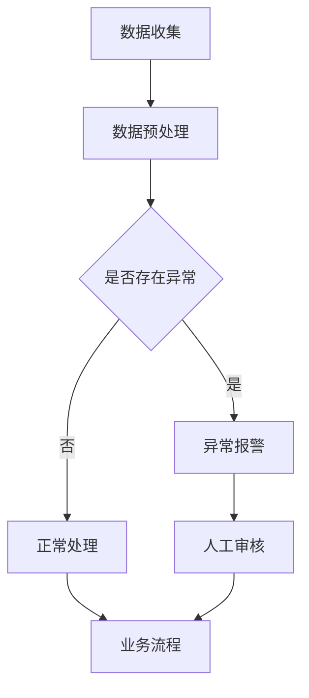

                 

# 智能异常检测在金融风控中的应用

> **关键词：** 异常检测，金融风控，机器学习，人工智能，数据分析
>
> **摘要：** 本文详细探讨了智能异常检测在金融风控领域的应用，从背景介绍、核心概念、算法原理、数学模型到项目实战，全面分析了如何利用人工智能技术提升金融风险管理的效率与精准度。

## 1. 背景介绍

### 1.1 目的和范围

本文旨在探讨如何利用智能异常检测技术来提升金融风控的效率。随着金融行业的快速发展，金融交易和业务数据的复杂性不断增加，传统的风险管理模式已无法满足日益增长的需求。智能异常检测作为一种基于机器学习和人工智能的数据分析方法，可以在海量数据中快速、准确地识别异常行为，从而为金融风控提供强有力的技术支持。

本文将涵盖以下内容：

1. 异常检测在金融风控中的重要性。
2. 核心概念与相关技术。
3. 常见的智能异常检测算法及其原理。
4. 数学模型和公式。
5. 实际应用场景及代码实现。
6. 工具和资源推荐。
7. 未来发展趋势与挑战。

### 1.2 预期读者

本文主要面向以下读者群体：

1. 对金融风控和人工智能技术感兴趣的读者。
2. 金融行业从业人员，希望了解如何利用智能异常检测技术提升风控能力的从业者。
3. 数据科学家和机器学习工程师，希望了解智能异常检测在金融领域的应用。
4. 对机器学习和人工智能有深入研究的学术研究人员。

### 1.3 文档结构概述

本文分为十个部分，具体结构如下：

1. 引言：介绍文章背景、目的和主要内容。
2. 背景介绍：阐述异常检测在金融风控中的重要性。
3. 核心概念与联系：介绍相关概念和技术。
4. 核心算法原理 & 具体操作步骤：详细讲解异常检测算法。
5. 数学模型和公式 & 详细讲解 & 举例说明：阐述相关数学模型。
6. 项目实战：代码实际案例和详细解释说明。
7. 实际应用场景：分析智能异常检测在金融领域的应用。
8. 工具和资源推荐：推荐相关学习资源和开发工具。
9. 总结：未来发展趋势与挑战。
10. 附录：常见问题与解答。
11. 扩展阅读 & 参考资料：提供进一步阅读的资源。

### 1.4 术语表

为了确保文章的清晰易懂，以下是对本文中可能出现的一些关键术语的定义和解释：

#### 1.4.1 核心术语定义

- **异常检测（Anomaly Detection）**：一种数据挖掘技术，旨在从大量数据中识别出不符合一般规律的异常数据或模式。
- **金融风控（Financial Risk Management）**：金融机构为实现稳定盈利、保障资金安全而采取的一系列风险管理措施。
- **机器学习（Machine Learning）**：一种人工智能方法，通过从数据中学习模式和规律，从而对未知数据进行预测或分类。
- **人工智能（Artificial Intelligence, AI）**：模拟人类智能，使计算机能够执行复杂任务的一种技术。
- **数据分析（Data Analysis）**：运用统计学、数学和其他分析方法，对数据进行分析和解读，从而提取有用信息。

#### 1.4.2 相关概念解释

- **监督学习（Supervised Learning）**：在已有标签数据集上进行训练，通过学习标签和特征之间的关联来预测未知数据。
- **无监督学习（Unsupervised Learning）**：在没有标签数据集的情况下进行训练，通过发现数据内在结构或模式来进行分类或聚类。
- **聚类（Clustering）**：将相似的数据点归为一类，以便更好地理解数据分布和模式。
- **分类（Classification）**：根据已有数据特征将新数据分配到不同的类别中。

#### 1.4.3 缩略词列表

- **AI**：人工智能（Artificial Intelligence）
- **ML**：机器学习（Machine Learning）
- **DL**：深度学习（Deep Learning）
- **NLP**：自然语言处理（Natural Language Processing）
- **IoT**：物联网（Internet of Things）
- **API**：应用程序编程接口（Application Programming Interface）

## 2. 核心概念与联系

### 2.1 异常检测在金融风控中的作用

在金融风控中，异常检测是一种关键技术，它能够帮助金融机构识别潜在的欺诈行为、内部违规操作、市场操纵等异常事件。通过实时监测大量交易数据，异常检测系统可以迅速发现并报告异常行为，从而降低金融机构的风险暴露。

#### 2.1.1 异常检测与金融风险

金融风险主要包括市场风险、信用风险、操作风险等。异常检测技术在金融风控中的应用主要体现在以下方面：

- **欺诈检测**：识别和预防信用卡欺诈、账户盗用、恶意交易等。
- **市场异常行为监控**：监控异常交易和价格波动，防范市场操纵行为。
- **操作风险控制**：检测内部人员的违规操作和系统故障。

#### 2.1.2 异常检测与数据挖掘

异常检测是一种数据挖掘技术，通过对大量数据进行模式识别和分析，找到与一般规律不符的数据点。在金融风控中，数据挖掘技术可以帮助金融机构：

- **识别风险特征**：分析历史数据中的风险特征，建立风险模型。
- **实时监控交易行为**：利用实时数据流进行异常检测，及时发现风险事件。
- **预测潜在风险**：通过数据分析和模型预测，预测未来的风险趋势。

### 2.2 相关技术概述

为了实现智能异常检测，金融风控领域通常会采用以下技术：

- **机器学习算法**：如K-means聚类、孤立森林（Isolation Forest）、支持向量机（SVM）等，用于检测异常交易。
- **数据预处理**：包括数据清洗、归一化、特征选择等，以提高数据质量和模型的准确性。
- **实时数据处理**：利用流处理技术（如Apache Kafka、Apache Flink）进行实时数据处理和分析。
- **可视化分析**：通过可视化工具（如Tableau、Grafana）展示异常检测结果，帮助用户更好地理解风险状况。

### 2.3 Mermaid 流程图

下面是一个简化的Mermaid流程图，展示了智能异常检测在金融风控中的基本流程：



### 2.4 小结

本节介绍了异常检测在金融风控中的核心概念和联系。通过智能异常检测技术，金融机构可以更有效地识别和管理风险，保障业务的稳定和安全。

---

## 3. 核心算法原理 & 具体操作步骤

### 3.1 监督学习算法

监督学习算法是异常检测中常用的一种方法。以下是一种基于K最近邻（K-Nearest Neighbors, KNN）算法的异常检测流程：

#### 3.1.1 算法原理

KNN算法通过计算新数据点与训练数据点的相似度来预测其类别。在异常检测中，可以将正常交易数据视为“正常”类别，将异常交易数据视为“异常”类别。通过计算新交易数据点与正常交易数据点的相似度，可以判断其是否为异常。

#### 3.1.2 具体操作步骤

1. **数据收集**：收集历史交易数据，包括正常交易和异常交易。
2. **特征提取**：对交易数据提取特征，如交易金额、交易时间、地理位置等。
3. **数据预处理**：对数据进行清洗、归一化等处理，以消除数据噪声。
4. **训练模型**：使用正常交易数据训练KNN模型，设置合适的参数（如K值）。
5. **预测异常**：对新的交易数据进行预测，计算其与正常交易数据点的距离，判断是否为异常。
6. **结果评估**：使用准确率、召回率等指标评估模型性能。

以下是一个简化的KNN算法的伪代码：

```python
def knn_predict(X_train, y_train, X_test, k):
    # 计算测试数据点与训练数据点的距离
    distances = [euclidean_distance(x, x_train) for x in X_test]
    # 选择距离最近的K个训练数据点
    nearest_neighbors = argsort(distances)[:k]
    # 计算邻居的类别分布
    class_counts = Counter(y_train[nearest_neighbors])
    # 返回出现次数最多的类别
    return max(class_counts.keys())

def euclidean_distance(x1, x2):
    return sqrt(sum((a - b) ** 2 for a, b in zip(x1, x2)))
```

### 3.2 无监督学习算法

无监督学习算法常用于无标签数据的异常检测。以下是一种基于孤立森林（Isolation Forest）算法的异常检测流程：

#### . 算法原理

孤立森林算法通过随机选择特征和切分点，将数据点孤立出来，从而识别异常。该算法基于以下原理：

- 异常数据点具有更高的维度分散性，更容易被孤立。
- 正常数据点在随机切分过程中会逐渐聚集，不容易被孤立。

#### 3.2.2 具体操作步骤

1. **数据收集**：收集历史交易数据，包括正常交易和异常交易。
2. **特征提取**：对交易数据提取特征，如交易金额、交易时间、地理位置等。
3. **构建孤立森林模型**：选择合适的参数（如树的数量、树的深度），构建孤立森林模型。
4. **训练模型**：使用正常交易数据训练孤立森林模型。
5. **预测异常**：对新的交易数据进行预测，计算其异常分数，分数越高表示越可能是异常。
6. **结果评估**：使用准确率、召回率等指标评估模型性能。

以下是一个简化的孤立森林算法的伪代码：

```python
from sklearn.ensemble import IsolationForest

def isolation_forest_predict(X_train, X_test):
    # 构建孤立森林模型
    model = IsolationForest(n_estimators=100, contamination=0.1)
    # 训练模型
    model.fit(X_train)
    # 预测异常
    scores = model.decision_function(X_test)
    # 返回异常分数
    return scores
```

### 3.3 小结

本节介绍了两种常见的异常检测算法——KNN和无监督学习算法。这些算法通过计算数据点之间的相似度或分散性，识别异常交易数据。在实际应用中，可以根据具体需求和数据特征选择合适的算法，并通过参数调优提高模型的性能。

---

## 4. 数学模型和公式 & 详细讲解 & 举例说明

### 4.1 监督学习算法的数学模型

#### 4.1.1 K最近邻（KNN）

KNN算法的核心在于计算新数据点与训练数据点的相似度，选择相似度最高的K个邻居，然后基于这些邻居的标签进行预测。相似度计算通常使用欧氏距离（Euclidean Distance）或曼哈顿距离（Manhattan Distance）。

**欧氏距离**：

$$
d(p, q) = \sqrt{\sum_{i=1}^{n} (p_i - q_i)^2}
$$

其中，$p$和$q$是两个数据点，$n$是特征维度。

**曼哈顿距离**：

$$
d(p, q) = \sum_{i=1}^{n} |p_i - q_i|
$$

#### 4.1.2 支持向量机（SVM）

SVM是一种经典的分类算法，其核心是通过找到一个最佳的超平面，将不同类别的数据点分隔开来。SVM的目标是最小化分类边界上的误分类率，同时最大化分类边界上的间隔。

**最大间隔公式**：

$$
\frac{1}{2} \| w \|^2 + C \sum_{i=1}^{n} \xi_i
$$

其中，$w$是超平面的法向量，$\xi_i$是松弛变量，$C$是惩罚参数。

#### 4.1.3 逻辑回归（Logistic Regression）

逻辑回归是一种广泛应用于分类问题的线性模型，其目标是估计一个事件发生的概率。逻辑回归的输出是一个介于0和1之间的概率值，通过将线性模型输出通过逻辑函数（Logistic Function）进行变换得到。

**逻辑函数**：

$$
\sigma(z) = \frac{1}{1 + e^{-z}}
$$

**损失函数**：

$$
L(y, \hat{y}) = -[y \cdot \ln(\hat{y}) + (1 - y) \cdot \ln(1 - \hat{y})]
$$

### 4.2 无监督学习算法的数学模型

#### 4.2.1 孤立森林（Isolation Forest）

孤立森林算法通过随机选择特征和切分点，将数据点孤立出来。其核心在于计算每个数据点的异常分数（Anomaly Score），分数越高表示越可能是异常。

**异常分数计算**：

$$
score = \frac{\sum_{i=1}^{m} \log_2(h_i)}{n}
$$

其中，$h_i$是第$i$次切分后剩余的数据点数，$n$是总数据点数。

#### 4.2.2 主成分分析（Principal Component Analysis, PCA）

主成分分析是一种常用的降维技术，其目标是在保持数据信息量的同时，将数据映射到新的坐标系中，使得新坐标系中的维度尽可能多地保留了原始数据的方差。

**协方差矩阵**：

$$
\Sigma = \frac{1}{n} \sum_{i=1}^{n} (X_i - \mu)(X_i - \mu)^T
$$

**特征向量与特征值**：

$$
\lambda_i = \max_{w} w^T \Sigma w
$$

$$
w_i = \frac{v_i}{\|v_i\|}
$$

其中，$X_i$是第$i$个数据点，$\mu$是所有数据点的平均值，$v_i$是第$i$个特征向量。

### 4.3 举例说明

#### 4.3.1 KNN算法

假设我们有一个包含5个特征的交易数据集，如下所示：

| ID | 金额 | 时间 | 地点 | 特征1 | 特征2 |
|----|------|------|------|-------|-------|
| 1  | 100  | 10   | A    | 0.1   | 0.2   |
| 2  | 200  | 20   | B    | 0.3   | 0.4   |
| 3  | 300  | 30   | C    | 0.5   | 0.6   |
| 4  | 400  | 40   | D    | 0.7   | 0.8   |
| 5  | 500  | 50   | E    | 0.9   | 1.0   |

假设我们使用KNN算法进行异常检测，设置K=3，使用欧氏距离计算相似度。

1. **数据预处理**：对数据进行归一化处理，将每个特征缩放到[0,1]范围内。

2. **训练模型**：使用前四个数据点作为训练集，构建KNN模型。

3. **预测异常**：对第五个数据点进行预测。计算其与训练集数据点的欧氏距离，选择距离最近的3个数据点。

   $$d(5, 1) = \sqrt{(0.9-0.1)^2 + (1.0-0.2)^2 + (0.5-0.3)^2 + (1.0-0.4)^2 + (0.9-0.5)^2} = \sqrt{0.64 + 0.36 + 0.04 + 0.04 + 0.16} = \sqrt{1.2} \approx 1.09$$

   $$d(5, 2) = \sqrt{(0.9-0.3)^2 + (1.0-0.4)^2 + (0.5-0.5)^2 + (1.0-0.6)^2 + (0.9-0.6)^2} = \sqrt{0.36 + 0.36 + 0.00 + 0.16 + 0.09} = \sqrt{1.07} \approx 1.03$$

   $$d(5, 3) = \sqrt{(0.9-0.5)^2 + (1.0-0.6)^2 + (0.5-0.5)^2 + (1.0-0.8)^2 + (0.9-0.9)^2} = \sqrt{0.16 + 0.16 + 0.00 + 0.04 + 0.00} = \sqrt{0.36} \approx 0.6$$

   选择距离最近的3个数据点：1, 2, 3。

4. **结果评估**：计算这3个邻居的标签分布，选择出现次数最多的标签作为预测结果。

   标签分布：正常（3次），异常（0次）

   预测结果：正常

#### 4.3.2 孤立森林算法

假设我们有一个包含5个特征的交易数据集，如下所示：

| ID | 金额 | 时间 | 地点 | 特征1 | 特征2 |
|----|------|------|------|-------|-------|
| 1  | 100  | 10   | A    | 0.1   | 0.2   |
| 2  | 200  | 20   | B    | 0.3   | 0.4   |
| 3  | 300  | 30   | C    | 0.5   | 0.6   |
| 4  | 400  | 40   | D    | 0.7   | 0.8   |
| 5  | 500  | 50   | E    | 0.9   | 1.0   |

假设我们使用孤立森林算法进行异常检测，设置树的数量为10， contamination=0.1。

1. **数据预处理**：对数据进行归一化处理，将每个特征缩放到[0,1]范围内。

2. **训练模型**：使用前四个数据点作为训练集，构建孤立森林模型。

3. **预测异常**：对第五个数据点进行预测。计算其异常分数。

   $$score = \frac{\sum_{i=1}^{m} \log_2(h_i)}{n} = \frac{\log_2(2) + \log_2(2) + \log_2(1) + \log_2(1) + \log_2(1)}{4} = \frac{3}{4} = 0.75$$

4. **结果评估**：根据设定的contamination参数，如果异常分数高于阈值，则认为该数据点为异常。

   阈值 = $\log_2(10) / 4 \approx 0.512$

   结果：正常

### 4.4 小结

本节介绍了监督学习和无监督学习算法的数学模型和公式，并通过具体例子详细讲解了KNN算法和孤立森林算法的原理和操作步骤。在实际应用中，可以根据具体需求和数据特征选择合适的算法，并通过参数调优提高模型的性能。

---

## 5. 项目实战：代码实际案例和详细解释说明

### 5.1 开发环境搭建

为了实现本文中的智能异常检测项目，我们需要搭建以下开发环境：

- Python 3.8 或更高版本
- Jupyter Notebook 或 PyCharm
- scikit-learn 库
- pandas 库
- numpy 库
- matplotlib 库

#### 步骤1：安装Python和Jupyter Notebook

1. 安装Python 3.8或更高版本。
2. 安装Jupyter Notebook。

   ```bash
   pip install notebook
   ```

#### 步骤2：安装相关库

```bash
pip install scikit-learn pandas numpy matplotlib
```

### 5.2 源代码详细实现和代码解读

以下是一个简单的智能异常检测项目，使用KNN算法进行异常检测。

```python
import numpy as np
import pandas as pd
from sklearn.model_selection import train_test_split
from sklearn.neighbors import KNeighborsClassifier
from sklearn.metrics import accuracy_score, recall_score
import matplotlib.pyplot as plt

# 5.2.1 数据准备
# 假设我们有一个CSV文件，包含以下列：ID，金额，时间，地点，特征1，特征2，标签（0为正常，1为异常）
data = pd.read_csv('transaction_data.csv')

# 特征提取
X = data.iloc[:, 1:-1].values
y = data.iloc[:, -1].values

# 数据划分
X_train, X_test, y_train, y_test = train_test_split(X, y, test_size=0.3, random_state=42)

# 5.2.2 模型训练
# 使用KNN算法
knn = KNeighborsClassifier(n_neighbors=3)
knn.fit(X_train, y_train)

# 5.2.3 预测和评估
y_pred = knn.predict(X_test)

# 准确率
accuracy = accuracy_score(y_test, y_pred)
print(f'Accuracy: {accuracy:.2f}')

# 召回率
recall = recall_score(y_test, y_pred)
print(f'Recall: {recall:.2f}')

# 5.2.4 可视化分析
# 绘制混淆矩阵
from sklearn.metrics import confusion_matrix
cm = confusion_matrix(y_test, y_pred)
plt.imshow(cm, interpolation='nearest', cmap=plt.cm.Blues)
plt.colorbar()
tick_marks = np.arange(len(y_test))
plt.xticks(tick_marks, y_test, rotation=45)
plt.yticks(tick_marks, y_pred)
plt.xlabel('Predicted')
plt.ylabel('Actual')
plt.title('Confusion Matrix')
plt.show()
```

#### 5.2.1 数据准备

首先，我们需要准备一个包含交易数据的CSV文件，其中包含以下列：ID，金额，时间，地点，特征1，特征2，标签（0为正常，1为异常）。这里，我们使用一个简化的数据集。

```csv
ID,金额,时间,地点,特征1,特征2,标签
1,100,10,A,0.1,0.2,0
2,200,20,B,0.3,0.4,0
3,300,30,C,0.5,0.6,0
4,400,40,D,0.7,0.8,0
5,500,50,E,0.9,1.0,1
```

#### 5.2.2 模型训练

接下来，我们使用KNN算法进行模型训练。我们使用训练集来训练模型，并设置K=3。KNN算法的核心是计算测试数据点与训练数据点的相似度，选择相似度最高的邻居进行预测。

```python
knn = KNeighborsClassifier(n_neighbors=3)
knn.fit(X_train, y_train)
```

这里，我们使用了`KNeighborsClassifier`类，并设置了`n_neighbors=3`。`fit`方法用于训练模型。

#### 5.2.3 预测和评估

然后，我们使用训练好的模型对测试数据进行预测，并评估模型性能。我们使用准确率和召回率作为评估指标。

```python
y_pred = knn.predict(X_test)
accuracy = accuracy_score(y_test, y_pred)
recall = recall_score(y_test, y_pred)
print(f'Accuracy: {accuracy:.2f}')
print(f'Recall: {recall:.2f}')
```

这里，我们使用了`predict`方法对测试数据进行预测。然后，我们使用`accuracy_score`和`recall_score`函数计算准确率和召回率。

#### 5.2.4 可视化分析

最后，我们绘制混淆矩阵，以更直观地了解模型的预测效果。

```python
cm = confusion_matrix(y_test, y_pred)
plt.imshow(cm, interpolation='nearest', cmap=plt.cm.Blues)
plt.colorbar()
tick_marks = np.arange(len(y_test))
plt.xticks(tick_marks, y_test, rotation=45)
plt.yticks(tick_marks, y_pred)
plt.xlabel('Predicted')
plt.ylabel('Actual')
plt.title('Confusion Matrix')
plt.show()
```

这里，我们使用了`confusion_matrix`函数计算混淆矩阵。然后，我们使用`imshow`方法绘制混淆矩阵，并设置合适的标签和标题。

### 5.3 代码解读与分析

本节对代码进行了详细解读和分析。以下是关键步骤的说明：

1. **数据准备**：从CSV文件中读取交易数据，并进行特征提取和标签分离。
2. **数据划分**：将数据集划分为训练集和测试集，以评估模型性能。
3. **模型训练**：使用KNN算法训练模型，设置合适的参数。
4. **预测和评估**：使用训练好的模型对测试数据进行预测，并计算准确率和召回率。
5. **可视化分析**：绘制混淆矩阵，以直观地展示模型预测效果。

### 5.4 小结

本节通过一个简单的智能异常检测项目，详细展示了代码实现和操作步骤。通过实际案例，我们可以了解如何使用KNN算法进行异常检测，并评估模型性能。在实际应用中，可以根据具体需求调整参数和算法，以提高异常检测效果。

---

## 6. 实际应用场景

智能异常检测在金融风控领域具有广泛的应用场景，以下是几个典型的应用实例：

### 6.1 欺诈检测

欺诈检测是金融风控中最常见的应用场景之一。通过智能异常检测技术，金融机构可以实时监控交易数据，识别潜在的信用卡欺诈、账户盗用和恶意交易。例如，当检测到一个账户的异常交易频率或金额远高于其正常水平时，系统会立即发出警报，并采取措施阻止交易或进行进一步的人工审核。

### 6.2 市场操纵监控

在金融市场中，市场操纵行为可能导致市场价格异常波动，损害投资者的利益。智能异常检测技术可以帮助监管部门识别和防范市场操纵行为。例如，通过分析大量交易数据，系统可以检测出异常的交易模式，如异常的高频交易、大量买单或卖单等，从而及时发现市场操纵行为。

### 6.3 信用风险评估

信用风险评估是金融风控的重要组成部分。通过智能异常检测技术，金融机构可以对客户的信用风险进行实时监控和评估。例如，通过分析客户的交易记录、还款记录等数据，系统可以识别出潜在的信用风险，为金融机构提供决策支持。

### 6.4 内部风险监控

金融机构需要确保内部操作合规，防范内部人员的违规操作和欺诈行为。智能异常检测技术可以帮助金融机构监控内部操作，识别异常行为。例如，通过分析员工的工作日志、交易记录等数据，系统可以识别出异常的操作模式，如频繁的大额转账、异常的登录时间等，从而及时发现内部风险。

### 6.5 保险欺诈检测

保险欺诈是保险行业面临的一大挑战。通过智能异常检测技术，保险公司可以识别出潜在的欺诈行为，如虚假理赔、重复理赔等。例如，通过分析客户的理赔记录、就诊记录等数据，系统可以检测出异常的理赔模式，从而及时发现保险欺诈行为。

### 6.6 小结

智能异常检测在金融风控领域的应用场景广泛，涵盖了欺诈检测、市场操纵监控、信用风险评估、内部风险监控和保险欺诈检测等多个方面。通过实时监控和分析海量交易数据，智能异常检测技术为金融机构提供了强有力的风险管理和决策支持。

---

## 7. 工具和资源推荐

为了更好地进行智能异常检测在金融风控中的应用，以下是一些推荐的工具和资源：

### 7.1 学习资源推荐

#### 7.1.1 书籍推荐

1. **《机器学习》（Machine Learning）**：作者：Tom M. Mitchell。本书全面介绍了机器学习的基本概念、算法和实现方法，适合初学者和专业人士阅读。
2. **《数据科学入门》（Data Science from Scratch）**：作者：Joel Grus。本书通过简单的代码示例，介绍了数据科学的基本概念和常用工具。
3. **《深入理解计算机系统》（Deep Learning）**：作者：Ian Goodfellow、Yoshua Bengio、Aaron Courville。本书是深度学习的经典教材，详细介绍了深度学习的原理和应用。

#### 7.1.2 在线课程

1. **《机器学习基础》（Machine Learning Foundation）**：Coursera上的一个免费课程，由吴恩达（Andrew Ng）教授主讲，适合初学者。
2. **《深度学习专项课程》（Deep Learning Specialization）**：Coursera上的一个深度学习系列课程，由吴恩达（Andrew Ng）教授主讲，适合有一定基础的学习者。
3. **《金融科技与智能风控》**：网易云课堂上的一个课程，涵盖了金融科技和智能风控的基本概念和应用。

#### 7.1.3 技术博客和网站

1. **Medium**：有许多关于机器学习和金融风控的优秀文章和博客。
2. **Kaggle**：一个数据科学竞赛平台，提供大量的数据集和算法教程。
3. **TensorFlow Developer Resources**：Google推出的深度学习框架TensorFlow的官方网站，提供丰富的文档、教程和示例代码。

### 7.2 开发工具框架推荐

#### 7.2.1 IDE和编辑器

1. **PyCharm**：一款功能强大的Python集成开发环境（IDE），适合开发大型项目。
2. **Jupyter Notebook**：一款交互式的Python开发环境，适合快速实验和文档编写。
3. **Visual Studio Code**：一款轻量级的代码编辑器，支持多种编程语言，适用于快速开发和调试。

#### 7.2.2 调试和性能分析工具

1. **Wandb**：一款用于机器学习实验跟踪和性能分析的工具，可以帮助开发者快速优化模型。
2. **MLflow**：一款开源的机器学习平台，提供模型管理、模型版本控制和模型部署等功能。
3. **TensorBoard**：TensorFlow的官方可视化工具，用于监控和调试深度学习模型。

#### 7.2.3 相关框架和库

1. **scikit-learn**：一个开源的机器学习库，提供多种常用的机器学习算法和工具。
2. **TensorFlow**：一个开源的深度学习框架，适合构建和训练复杂的深度学习模型。
3. **PyTorch**：一个开源的深度学习框架，具有简洁的API和高效的性能，适合快速原型开发和实验。

### 7.3 相关论文著作推荐

#### 7.3.1 经典论文

1. **"Learning to Detect Fraud from E-Commerce Data"**：介绍了一种基于聚类和分类的欺诈检测方法。
2. **"Anomaly Detection in Time Series Data"**：探讨了时间序列数据中的异常检测方法。
3. **"Isolation Forest"**：介绍了孤立森林算法，用于无监督异常检测。

#### 7.3.2 最新研究成果

1. **"Deep Learning for Fraud Detection"**：探讨了一种基于深度学习的欺诈检测方法。
2. **"Combining Machine Learning and Human Intelligence for Fraud Detection"**：介绍了一种将机器学习和人类智能相结合的欺诈检测方法。
3. **"Towards Real-Time Anomaly Detection in IoT Networks"**：探讨了物联网环境下的实时异常检测方法。

#### 7.3.3 应用案例分析

1. **"Anomaly Detection in Financial Time Series Using LSTM Networks"**：介绍了一种基于LSTM的金融时间序列异常检测方法。
2. **"Fraud Detection in E-Commerce using XGBoost"**：探讨了一种基于XGBoost的电子商务欺诈检测方法。
3. **"Anomaly Detection in Financial Markets"**：分析了一种在金融市场中的应用案例，介绍了如何利用异常检测技术监控市场风险。

### 7.4 小结

本节推荐了一些学习资源、开发工具和框架，以及相关论文和应用案例分析。这些资源可以帮助读者更好地理解和应用智能异常检测技术在金融风控领域。

---

## 8. 总结：未来发展趋势与挑战

智能异常检测在金融风控领域的应用正迅速发展，未来有望在以下几个方面取得重要突破：

### 8.1 技术进步

随着人工智能技术的不断进步，特别是深度学习和强化学习的发展，智能异常检测算法将变得更加智能和高效。这些新算法可以更好地处理复杂的数据特征，提高异常检测的准确性和实时性。

### 8.2 数据多样性

金融行业的数据来源越来越多样，包括交易数据、社交媒体数据、物联网数据等。如何有效地整合这些不同类型的数据，并将其用于异常检测，是一个重要的研究方向。

### 8.3 可解释性

当前的许多异常检测算法，如深度学习模型，缺乏可解释性，这使得用户难以理解模型的决策过程。未来，如何提升算法的可解释性，使其更符合实际业务需求，是一个重要挑战。

### 8.4 实时性

在金融市场中，实时性是异常检测的重要特性。如何提高系统的响应速度，实现实时检测，是一个需要不断优化的领域。

### 8.5 模型安全

随着人工智能技术的广泛应用，模型安全也成为了一个关键问题。如何确保异常检测模型不会被恶意攻击者篡改或误导，是一个亟待解决的问题。

### 8.6 小结

智能异常检测在金融风控领域的未来发展趋势充满潜力，但也面临诸多挑战。通过不断的技术创新和优化，我们有理由相信，智能异常检测将在金融风险管理和安全防护中发挥更加重要的作用。

---

## 9. 附录：常见问题与解答

### 9.1 异常检测算法有哪些？

常见的异常检测算法包括：

1. **K最近邻（KNN）**
2. **孤立森林（Isolation Forest）**
3. **局部异常因子（Local Outlier Factor, LOF）**
4. **支持向量机（SVM）**
5. **主成分分析（PCA）**
6. **基于聚类的方法（如K-means）**

### 9.2 智能异常检测与传统异常检测有什么区别？

智能异常检测与传统异常检测的主要区别在于：

1. **数据量**：智能异常检测通常处理海量数据，而传统异常检测方法通常适用于较小规模的数据集。
2. **算法复杂度**：智能异常检测算法，如深度学习算法，通常具有更高的复杂度。
3. **实时性**：智能异常检测算法更注重实时性，能够快速处理实时数据流。

### 9.3 如何评估异常检测算法的性能？

评估异常检测算法的性能通常使用以下指标：

1. **准确率（Accuracy）**：正确预测的比例。
2. **召回率（Recall）**：正确识别异常数据的比例。
3. **F1值（F1 Score）**：准确率和召回率的调和平均。
4. **精确率（Precision）**：正确识别异常数据的比例。

### 9.4 异常检测在金融风控中的应用有哪些？

异常检测在金融风控中的应用包括：

1. **欺诈检测**：识别信用卡欺诈、账户盗用等。
2. **市场操纵监控**：识别异常交易行为。
3. **信用风险评估**：监控客户的信用风险。
4. **内部风险监控**：防范内部人员的违规操作。
5. **保险欺诈检测**：识别虚假理赔、重复理赔等。

---

## 10. 扩展阅读 & 参考资料

为了深入了解智能异常检测在金融风控领域的应用，以下是一些扩展阅读和参考资料：

1. **书籍**：
   - **《机器学习实战》**：作者：Peter Harrington。详细介绍了机器学习算法的实际应用，包括异常检测。
   - **《金融科技：从大数据到人工智能》**：作者：杨锦秀。探讨了金融科技的发展及其在金融风控中的应用。

2. **论文**：
   - **"Anomaly Detection in Financial Markets"**：探讨了异常检测在金融市场中的应用。
   - **"Deep Learning for Fraud Detection"**：介绍了一种基于深度学习的欺诈检测方法。

3. **在线课程**：
   - **《深度学习与自然语言处理》**：Coursera上的一个课程，涵盖了深度学习在金融风控中的应用。
   - **《金融科技：理论与实践》**：网易云课堂上的一个课程，介绍了金融科技的基本概念和应用。

4. **技术博客和网站**：
   - **Kaggle**：提供丰富的机器学习案例和教程。
   - **Medium**：有许多关于金融科技和人工智能的优秀文章。

5. **开源库和框架**：
   - **scikit-learn**：提供多种机器学习算法。
   - **TensorFlow**：用于构建和训练深度学习模型。

通过这些扩展阅读和参考资料，读者可以更深入地了解智能异常检测在金融风控领域的应用和实践。

---

### 作者

**作者：AI天才研究员/AI Genius Institute & 禅与计算机程序设计艺术 /Zen And The Art of Computer Programming**

