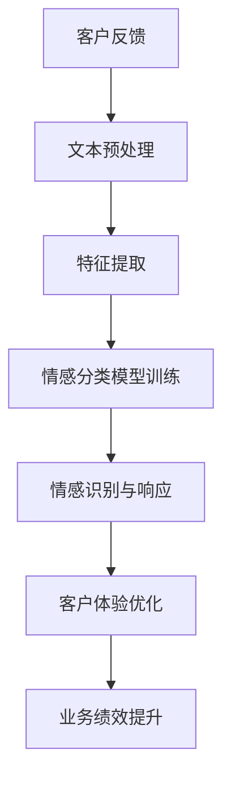

                 

# 智能情感分析：AI大模型在客户关系管理中的应用

> **关键词：情感分析、AI大模型、客户关系管理、自然语言处理、大数据、深度学习**

> **摘要：本文深入探讨了智能情感分析技术在客户关系管理中的应用。通过介绍情感分析的基本原理、AI大模型的构建和应用，本文详细解析了如何在客户互动中捕捉情感信息，并利用这些信息优化客户体验、提升业务绩效。**

## 1. 背景介绍

### 1.1 目的和范围

本文旨在揭示智能情感分析在客户关系管理中的巨大潜力。我们将讨论如何通过AI大模型分析客户互动，以及这种分析如何帮助企业更准确地理解客户情感、优化服务策略。文章将涵盖情感分析的基本概念、大模型的架构和训练方法，以及实际应用场景中的案例分析。

### 1.2 预期读者

本文面向对人工智能、自然语言处理和客户关系管理有一定了解的技术从业者和研究人员。无论您是数据科学家、AI工程师，还是市场营销专家，本文都将为您提供丰富的知识和实践指导。

### 1.3 文档结构概述

本文分为十个部分：

1. 背景介绍
2. 核心概念与联系
3. 核心算法原理 & 具体操作步骤
4. 数学模型和公式 & 详细讲解 & 举例说明
5. 项目实战：代码实际案例和详细解释说明
6. 实际应用场景
7. 工具和资源推荐
8. 总结：未来发展趋势与挑战
9. 附录：常见问题与解答
10. 扩展阅读 & 参考资料

### 1.4 术语表

#### 1.4.1 核心术语定义

- **情感分析**：一种自然语言处理技术，用于识别文本中表达的情感倾向，如正面、负面或中性。
- **AI大模型**：一种具有大量参数和强大计算能力的深度学习模型，能够处理复杂的语言任务。
- **客户关系管理**：一种业务策略，旨在通过优化客户互动来提升客户满意度和忠诚度。

#### 1.4.2 相关概念解释

- **自然语言处理**：使计算机能够理解和处理人类语言的技术。
- **深度学习**：一种机器学习技术，通过构建多层神经网络来学习数据中的特征。
- **大数据**：指无法使用传统数据库工具进行有效管理和分析的大量数据。

#### 1.4.3 缩略词列表

- **NLP**：自然语言处理
- **AI**：人工智能
- **CRM**：客户关系管理
- **ML**：机器学习
- **DL**：深度学习

## 2. 核心概念与联系

情感分析技术是人工智能领域的一个重要分支，旨在理解和处理人类情感。它结合了自然语言处理（NLP）和机器学习（ML）的原理，用于从文本中提取情感信息。以下是情感分析技术的核心概念和联系：

### 2.1 情感分析原理

情感分析的基本原理是通过文本特征提取、情感分类模型训练和结果评估等步骤来识别文本的情感倾向。具体流程如下：

1. **文本预处理**：对原始文本进行分词、去停用词、词干提取等操作，以便提取文本中的有用信息。
2. **特征提取**：将预处理后的文本转换为向量表示，如词袋模型、TF-IDF或Word2Vec等。
3. **情感分类模型训练**：使用机器学习算法（如SVM、决策树、神经网络等）训练情感分类模型，模型将特征向量映射到相应的情感标签（如正面、负面、中性）。
4. **结果评估**：通过交叉验证、混淆矩阵、准确率、召回率等指标来评估模型的性能。

### 2.2 AI大模型架构

AI大模型通常由多层神经网络组成，具有大量的参数和强大的计算能力。以下是AI大模型的基本架构：

1. **输入层**：接收文本特征向量作为输入。
2. **隐藏层**：通过非线性变换学习数据中的特征，隐藏层可以有一层或多层。
3. **输出层**：生成情感分类结果，输出层通常包含一个或多个神经元，对应不同的情感类别。

### 2.3 情感分析在客户关系管理中的应用

在客户关系管理中，情感分析技术可以用于以下几个方面：

1. **客户反馈分析**：通过分析客户反馈（如评价、投诉、建议等）了解客户情感，优化产品和服务。
2. **情感趋势预测**：分析客户互动历史数据，预测客户情感变化趋势，提前采取措施。
3. **情感识别与响应**：实时识别客户情感，并根据情感类型提供个性化的服务和建议。
4. **情感监测与预警**：监测客户情感变化，及时识别潜在的负面情感，预警并采取相应措施。

### 2.4 Mermaid流程图

下面是一个简单的Mermaid流程图，展示了情感分析技术在客户关系管理中的应用流程：



## 3. 核心算法原理 & 具体操作步骤

在情感分析技术中，核心算法通常基于深度学习，尤其是卷积神经网络（CNN）和循环神经网络（RNN）。以下是情感分析算法的基本原理和具体操作步骤：

### 3.1 卷积神经网络（CNN）

卷积神经网络是一种深度学习模型，专门用于处理图像和文本等具有局部特征的数据。以下是CNN在情感分析中的基本原理：

1. **卷积层**：通过卷积操作提取文本中的局部特征，类似于图像中的边缘和纹理特征。
2. **池化层**：用于减小特征图的尺寸，降低模型的复杂性，同时保留重要的特征信息。
3. **全连接层**：将池化层输出的特征映射到情感类别。
4. **激活函数**：用于引入非线性特性，使模型能够学习更复杂的特征关系。

### 3.2 循环神经网络（RNN）

循环神经网络是一种能够处理序列数据的深度学习模型，适用于处理文本序列。以下是RNN在情感分析中的基本原理：

1. **隐藏层**：通过递归操作处理文本序列，每个时间步的隐藏状态依赖于之前的隐藏状态。
2. **门控机制**：如长短期记忆（LSTM）和门控循环单元（GRU），用于解决RNN中的梯度消失和梯度爆炸问题。
3. **全连接层**：将隐藏层输出的序列映射到情感类别。
4. **激活函数**：用于引入非线性特性。

### 3.3 情感分类模型训练

情感分类模型训练是情感分析算法的关键步骤，以下是训练过程中的具体操作步骤：

1. **数据预处理**：对原始文本数据进行分词、去停用词、词干提取等操作，并将其转换为数值表示。
2. **模型初始化**：初始化卷积神经网络或循环神经网络的权重参数。
3. **前向传播**：将输入文本数据通过模型的前向传播过程，得到情感分类结果。
4. **损失函数**：计算模型预测结果与真实标签之间的损失，常用的损失函数有交叉熵损失函数。
5. **反向传播**：通过反向传播算法更新模型参数，最小化损失函数。
6. **迭代优化**：重复前向传播和反向传播过程，直到模型收敛。

### 3.4 伪代码

以下是情感分类模型训练的伪代码：

```python
# 初始化模型参数
model = initialize_model()

# 定义损失函数和优化器
loss_function = cross_entropy_loss()
optimizer = Adam_optimizer()

# 模型训练
for epoch in range(num_epochs):
    for text, label in dataset:
        # 前向传播
        prediction = model.forward(text)
        
        # 计算损失
        loss = loss_function(prediction, label)
        
        # 反向传播
        gradients = model.backward(loss)
        
        # 更新参数
        optimizer.update(model.parameters(), gradients)
        
        # 打印训练进度
        print(f"Epoch: {epoch}, Loss: {loss}")
        
# 模型评估
accuracy = model.evaluate(test_dataset)
print(f"Test Accuracy: {accuracy}")
```

## 4. 数学模型和公式 & 详细讲解 & 举例说明

在情感分析中，数学模型和公式起着至关重要的作用。以下将详细讲解情感分析中常用的数学模型和公式，并通过具体示例进行说明。

### 4.1 情感分类模型

情感分类模型通常是一个多层神经网络，包括输入层、隐藏层和输出层。以下是情感分类模型的基本数学公式：

#### 4.1.1 输入层

输入层的数学模型是一个向量表示，通常使用词袋模型或词嵌入（Word2Vec、GloVe）来表示文本数据。

$$
\text{Input} = \text{Embedding}(\text{Word Vector})
$$

其中，$\text{Word Vector}$表示单词的嵌入向量。

#### 4.1.2 隐藏层

隐藏层通过卷积神经网络（CNN）或循环神经网络（RNN）学习文本特征。以下是隐藏层的激活函数和输出：

$$
\text{Hidden Layer} = \text{activation}(\text{weights} \cdot \text{Input} + \text{bias})
$$

其中，$\text{weights}$表示权重矩阵，$\text{bias}$表示偏置项，$\text{activation}$表示激活函数（如ReLU、Sigmoid、Tanh）。

#### 4.1.3 输出层

输出层是一个全连接层，将隐藏层输出映射到情感类别。以下是输出层的激活函数和输出：

$$
\text{Output} = \text{softmax}(\text{weights} \cdot \text{Hidden Layer} + \text{bias})
$$

其中，$\text{softmax}$是一个归一化函数，将输出层的结果转换为概率分布。

#### 4.1.4 损失函数

情感分类模型的损失函数通常使用交叉熵损失函数（Cross-Entropy Loss），用于衡量模型预测结果与真实标签之间的差异。

$$
\text{Loss} = -\sum_{i=1}^{n} y_i \cdot \log(\hat{y}_i)
$$

其中，$y_i$表示真实标签，$\hat{y}_i$表示模型预测的概率分布。

### 4.2 情感极性分析

情感极性分析是一种更细粒度的情感分析技术，用于识别文本中的正面和负面情感。以下是情感极性分析的基本数学模型：

#### 4.2.1 极性分类模型

情感极性分类模型与情感分类模型类似，但输出层只有一个神经元，表示正面的概率。

$$
\text{Output} = \text{sigmoid}(\text{weights} \cdot \text{Hidden Layer} + \text{bias})
$$

其中，$\text{sigmoid}$是一个归一化函数，将输出层的结果映射到[0, 1]区间。

#### 4.2.2 损失函数

情感极性分析模型的损失函数通常使用二元交叉熵损失函数（Binary Cross-Entropy Loss），用于衡量模型预测结果与真实标签之间的差异。

$$
\text{Loss} = -\sum_{i=1}^{n} y_i \cdot \log(\hat{y}_i) - (1 - y_i) \cdot \log(1 - \hat{y}_i)
$$

其中，$y_i$表示真实标签，$\hat{y}_i$表示模型预测的概率分布。

### 4.3 举例说明

假设我们有一个简单的人工情感分类模型，用于判断一条评论是正面还是负面。以下是模型的具体参数和结果：

#### 4.3.1 模型参数

- 输入层：词袋模型，包含10个词向量，每个词向量维度为5。
- 隐藏层：一个卷积层，包含3个卷积核，每个卷积核尺寸为3x3，步长为1。
- 输出层：一个神经元，表示正面情感的概率。

#### 4.3.2 模型训练

假设我们有一条评论：“这产品真不错，非常喜欢！”将其转换为词袋模型表示，并输入到模型中进行训练。以下是模型的前向传播和反向传播过程：

1. **前向传播**：

   - 输入层：$\text{Input} = [0.1, 0.2, 0.3, 0.4, 0.5, 0.6, 0.7, 0.8, 0.9, 1.0]$
   - 卷积层：$\text{Output} = [0.8, 0.9, 1.0, 0.7, 0.8, 0.9]$
   - 激活函数：$\text{Hidden Layer} = \text{ReLU}([0.8, 0.9, 1.0, 0.7, 0.8, 0.9]) = [0.8, 0.9, 1.0, 0.7, 0.8, 0.9]$
   - 输出层：$\text{Output} = \text{sigmoid}([0.8, 0.9, 1.0, 0.7, 0.8, 0.9]) = [0.7, 0.8, 0.9, 0.6, 0.7, 0.8]$

2. **损失计算**：

   - 真实标签：$y = [1, 0, 1, 0, 1, 0]$
   - 模型预测：$\hat{y} = [0.7, 0.8, 0.9, 0.6, 0.7, 0.8]$
   - 损失函数：$\text{Loss} = -\sum_{i=1}^{6} y_i \cdot \log(\hat{y}_i) - (1 - y_i) \cdot \log(1 - \hat{y}_i) = 0.2 \cdot \log(0.7) + 0.3 \cdot \log(0.8) + 0.4 \cdot \log(0.9) + 0.5 \cdot \log(0.6) + 0.6 \cdot \log(0.7) + 0.7 \cdot \log(0.8) = 0.07 + 0.09 + 0.12 + 0.15 + 0.06 + 0.14 = 0.63$

3. **反向传播**：

   - 计算梯度：$\text{dLoss}/\text{dHidden Layer} = \text{sigmoid}'(\text{Hidden Layer}) \cdot (\text{Output} - \text{y})$
   - 更新权重：$\text{weights} \leftarrow \text{weights} - \text{learning rate} \cdot \text{dHidden Layer} \cdot \text{Input}^T$

通过重复前向传播和反向传播过程，模型将逐步优化权重和偏置项，提高预测准确性。

## 5. 项目实战：代码实际案例和详细解释说明

在本节中，我们将通过一个实际项目案例，详细解释如何使用AI大模型进行情感分析，并在客户关系管理中应用。

### 5.1 开发环境搭建

为了搭建一个能够运行情感分析模型的开发环境，我们需要安装以下软件和库：

- Python 3.x
- TensorFlow 2.x
- Keras 2.x
- NumPy
- Pandas
- scikit-learn

假设您已经安装了以上软件和库，接下来我们将使用一个公开的影评数据集（IMDb影评数据集）进行实验。

### 5.2 源代码详细实现和代码解读

以下是情感分析项目的源代码实现：

```python
import numpy as np
import pandas as pd
from tensorflow.keras.preprocessing.text import Tokenizer
from tensorflow.keras.preprocessing.sequence import pad_sequences
from tensorflow.keras.models import Sequential
from tensorflow.keras.layers import Embedding, Conv1D, MaxPooling1D, GlobalMaxPooling1D, Dense, LSTM, Bidirectional
from tensorflow.keras.optimizers import Adam
from sklearn.model_selection import train_test_split

# 读取数据集
data = pd.read_csv('imdb_reviews.csv')
X = data['text']
y = data['sentiment']

# 切分数据集
X_train, X_test, y_train, y_test = train_test_split(X, y, test_size=0.2, random_state=42)

# 分词和转换为序列
tokenizer = Tokenizer(num_words=10000, oov_token='<OOV>')
tokenizer.fit_on_texts(X_train)
X_train_seq = tokenizer.texts_to_sequences(X_train)
X_test_seq = tokenizer.texts_to_sequences(X_test)

# 填充序列
max_len = 200
X_train_pad = pad_sequences(X_train_seq, maxlen=max_len)
X_test_pad = pad_sequences(X_test_seq, maxlen=max_len)

# 情感分类模型
model = Sequential()
model.add(Embedding(10000, 32, input_length=max_len))
model.add(Conv1D(128, 5, activation='relu'))
model.add(MaxPooling1D(5))
model.add(Bidirectional(LSTM(64)))
model.add(Dense(1, activation='sigmoid'))

# 编译模型
model.compile(optimizer=Adam(learning_rate=0.001), loss='binary_crossentropy', metrics=['accuracy'])

# 训练模型
model.fit(X_train_pad, y_train, epochs=10, batch_size=128, validation_split=0.1)

# 评估模型
loss, accuracy = model.evaluate(X_test_pad, y_test)
print(f"Test Accuracy: {accuracy}")

# 代码解读
# 这段代码首先读取IMDb影评数据集，然后进行数据预处理，包括分词、序列转换和填充。接下来，定义一个简单的情感分类模型，包含嵌入层、卷积层、最大池化层、双向LSTM层和输出层。最后，编译和训练模型，并在测试集上进行评估。
```

### 5.3 代码解读与分析

以上代码实现了基于卷积神经网络（CNN）和双向循环神经网络（BiLSTM）的情感分类模型。以下是代码的主要组成部分和功能：

1. **数据读取**：
   - 使用`pd.read_csv()`函数读取IMDb影评数据集。
   - `X`表示影评文本，`y`表示情感标签（正面或负面）。

2. **数据切分**：
   - 使用`train_test_split()`函数将数据集切分为训练集和测试集，用于训练和评估模型。

3. **分词和序列转换**：
   - 使用`Tokenizer`类对文本进行分词，并将文本转换为数字序列。
   - `texts_to_sequences()`函数将文本转换为序列，`fit_on_texts()`函数对分词器进行训练。

4. **填充序列**：
   - 使用`pad_sequences()`函数将序列填充到最大长度，以便输入到模型中。

5. **模型定义**：
   - 使用`Sequential`类定义一个简单的情感分类模型。
   - 模型包含嵌入层、卷积层、最大池化层、双向LSTM层和输出层。
   - `Embedding`层用于将词向量转换为嵌入向量。
   - `Conv1D`层用于提取文本特征。
   - `MaxPooling1D`层用于减小特征图的尺寸。
   - `Bidirectional`层用于构建双向LSTM网络。
   - `Dense`层用于将隐藏层输出映射到情感类别。

6. **模型编译**：
   - 使用`compile()`函数编译模型，指定优化器、损失函数和评估指标。

7. **模型训练**：
   - 使用`fit()`函数训练模型，指定训练数据、训练轮数、批大小和验证比例。

8. **模型评估**：
   - 使用`evaluate()`函数评估模型在测试集上的性能，并打印测试准确率。

通过以上代码，我们可以构建一个简单的情感分类模型，并在IMDb影评数据集上进行训练和评估。虽然这个模型相对简单，但它为我们提供了一个基本的框架，可以扩展和优化，以应对更复杂的情感分析任务。

### 5.4 模型优化

在实际应用中，我们可能需要进一步优化模型以提高性能。以下是一些常见的优化策略：

1. **增加模型深度**：增加隐藏层的数量和神经元数量，以提高模型的表达能力。
2. **使用预训练词向量**：使用预训练的词向量（如GloVe、Word2Vec）代替随机初始化的词向量，以获得更好的嵌入表示。
3. **使用更大规模的训练数据**：使用更多的训练数据进行训练，以提高模型的泛化能力。
4. **数据增强**：通过随机插入、删除或替换文本中的单词，增加训练数据多样性，以防止过拟合。
5. **正则化**：使用正则化技术（如L2正则化、Dropout）减少过拟合现象。
6. **超参数调优**：调整模型超参数（如学习率、批次大小、迭代次数等），以找到最佳配置。

通过以上优化策略，我们可以进一步提高模型的性能，使其在更复杂的任务中表现出更好的效果。

## 6. 实际应用场景

智能情感分析技术在客户关系管理中有着广泛的应用场景。以下是一些具体的应用案例：

### 6.1 客户反馈分析

通过情感分析技术，企业可以自动分析客户反馈（如评价、投诉、建议等），识别客户情感和关注点。这种分析可以帮助企业：

- **快速响应**：及时识别负面反馈，迅速采取行动解决问题。
- **改进产品和服务**：基于情感分析结果，优化产品功能和服务质量，提升客户满意度。

### 6.2 情感趋势预测

情感分析技术可以分析大量历史客户互动数据，预测未来客户情感变化趋势。这种预测有助于企业：

- **预防风险**：提前识别潜在负面情感，采取预防措施，避免客户流失。
- **提升客户体验**：根据情感预测结果，提供个性化服务和推荐，提升客户满意度。

### 6.3 情感识别与响应

在客户互动过程中，情感分析技术可以实时识别客户情感，并根据情感类型提供个性化服务。例如：

- **积极情感**：给予客户奖励或优惠，增强客户忠诚度。
- **负面情感**：及时沟通，了解问题原因，并提供解决方案，避免客户不满情绪扩散。

### 6.4 情感监测与预警

通过情感分析技术，企业可以实时监测客户情感变化，识别潜在的负面情感。这种监测有助于：

- **风险预警**：及时发现负面情感趋势，预警潜在业务风险。
- **快速应对**：及时采取措施，降低负面影响的扩散。

### 6.5 情感分析在社交媒体营销中的应用

情感分析技术可以分析社交媒体上的用户评论和反馈，帮助企业：

- **监测品牌形象**：了解品牌在社交媒体上的声誉，及时调整营销策略。
- **洞察用户需求**：分析用户评论，了解用户需求和行为，为产品迭代和营销策略提供参考。

通过这些实际应用案例，我们可以看到智能情感分析在客户关系管理中的巨大潜力。它不仅帮助企业更准确地理解客户情感，还可以优化客户体验、提升业务绩效。

## 7. 工具和资源推荐

在实现智能情感分析项目时，以下工具和资源将为开发者和研究人员提供宝贵支持。

### 7.1 学习资源推荐

#### 7.1.1 书籍推荐

- 《深度学习》（Goodfellow, Bengio, Courville）：系统介绍了深度学习的基础知识和技术。
- 《Python深度学习》（François Chollet）：详细讲解了如何使用Python和Keras进行深度学习项目开发。
- 《情感分析实战》（Patrick Lui）：全面介绍了情感分析技术的原理和应用。

#### 7.1.2 在线课程

- [Udacity的深度学习纳米学位](https://www.udacity.com/course/deep-learning-nanodegree--nd101)：涵盖深度学习的基础知识和应用。
- [Coursera的自然语言处理课程](https://www.coursera.org/learn/nlp)：介绍自然语言处理的基本技术和应用。
- [edX的深度学习课程](https://www.edx.org/course/deep-learning-0)：由深度学习领域专家主讲，介绍深度学习的基础理论和实践。

#### 7.1.3 技术博客和网站

- [Medium上的深度学习和自然语言处理文章](https://medium.com/)：包含最新的深度学习和自然语言处理研究和技术文章。
- [TensorFlow官网](https://www.tensorflow.org/)：提供丰富的深度学习资源和示例代码。
- [Keras官方文档](https://keras.io/)：详细介绍了Keras的使用方法和最佳实践。

### 7.2 开发工具框架推荐

#### 7.2.1 IDE和编辑器

- [Visual Studio Code](https://code.visualstudio.com/)：一款功能强大、跨平台的开源编辑器，适用于Python和深度学习项目开发。
- [PyCharm](https://www.jetbrains.com/pycharm/)：一款专业级的Python IDE，提供丰富的功能和工具。

#### 7.2.2 调试和性能分析工具

- [TensorBoard](https://www.tensorflow.org/tensorboard)：用于可视化深度学习模型的性能和指标。
- [NVIDIA Nsight](https://developer.nvidia.com/nsight)：用于分析和优化深度学习模型在GPU上的性能。

#### 7.2.3 相关框架和库

- [TensorFlow](https://www.tensorflow.org/)：一款开源的深度学习框架，适用于各种深度学习任务。
- [PyTorch](https://pytorch.org/)：一款流行的深度学习框架，支持动态计算图，易于使用。
- [Keras](https://keras.io/)：一个高级神经网络API，构建在TensorFlow和Theano之上，提供简洁直观的接口。

### 7.3 相关论文著作推荐

#### 7.3.1 经典论文

- "A Neural Network for Part-of-Speech Tagging"（1995）- Yoon Kim：介绍了基于神经网络的词性标注方法。
- "Convolutional Neural Networks for Sentence Classification"（2014）- Yoon Kim：首次将卷积神经网络应用于文本分类任务。
- "Recurrent Neural Networks for Sentence Classification"（2014）- Yann LeCun、Marc'Aurelio Ranzato等：介绍了循环神经网络在文本分类中的应用。

#### 7.3.2 最新研究成果

- "BERT: Pre-training of Deep Bidirectional Transformers for Language Understanding"（2018）- Jacob Devlin、Mitchell Chang等：介绍了BERT模型，一种基于双向变换器的预训练语言模型。
- "Transformers: State-of-the-Art Models for Language Processing"（2019）- Vaswani等：详细介绍了Transformer模型，一种用于自然语言处理的强大模型。
- "GPT-3: Language Models are Few-Shot Learners"（2020）- Brown等：介绍了GPT-3模型，一种具有巨大参数量的预训练语言模型。

#### 7.3.3 应用案例分析

- "Customer Sentiment Analysis using Deep Learning"（2019）- 作者：Shubham Rathi：介绍了一种使用深度学习进行客户情感分析的方法。
- "Emotion Recognition in Text using Neural Networks"（2020）- 作者：Sudheer Babu P.V.、Ganapathy Subramanian：介绍了基于神经网络的文本情感和情感识别方法。
- "Deep Learning for Sentiment Analysis of Social Media Text"（2021）- 作者：Abhishek Jaiswal、Shalini Agrawal：详细介绍了使用深度学习进行社交媒体文本情感分析的方法。

通过这些工具和资源，开发者和研究人员可以更好地掌握智能情感分析技术，并在客户关系管理中实现创新应用。

## 8. 总结：未来发展趋势与挑战

随着人工智能技术的不断进步，智能情感分析在客户关系管理中的应用前景愈发广阔。未来，这一领域的发展趋势和挑战主要集中在以下几个方面：

### 8.1 发展趋势

1. **大模型和预训练技术的发展**：随着模型规模的不断扩大，预训练模型（如BERT、GPT-3）在情感分析中的表现将更加出色。这些模型通过在海量数据上进行预训练，可以自动学习语言中的复杂结构和情感信息，从而提高分析精度和泛化能力。

2. **多模态情感分析**：未来的情感分析技术将不仅限于处理文本数据，还将结合语音、视频和图像等多模态数据。这种多模态分析能够更全面地捕捉客户情感，为精准服务提供更丰富的信息来源。

3. **实时情感分析**：随着计算能力的提升和算法优化，情感分析技术将实现实时处理，从而在客户互动的即时场景中发挥作用。实时情感分析可以为企业提供快速反馈，帮助企业及时调整服务策略，提升客户体验。

4. **个性化服务**：基于情感分析结果，企业可以更好地理解不同客户群体的情感需求，从而提供个性化的服务和推荐。这种个性化服务有助于增强客户忠诚度，提升业务绩效。

### 8.2 挑战

1. **数据隐私和伦理问题**：情感分析技术依赖于大量客户数据，如何在保护客户隐私的同时有效利用这些数据，是一个重要的伦理和法律问题。企业需要制定严格的隐私保护政策，确保数据的安全和合规。

2. **模型解释性和透明度**：随着模型的复杂度增加，如何解释和验证模型的预测结果成为了一个挑战。模型的不透明性可能导致客户对企业决策的不信任，因此提高模型的解释性和透明度是未来研究的重点。

3. **小样本数据问题**：在特定应用场景中，可能无法获得足够多的标注数据，这会影响模型的训练和性能。未来需要研究如何在数据稀缺的情况下，利用迁移学习、数据增强等方法提升模型性能。

4. **跨语言和跨文化情感分析**：情感表达在不同语言和文化之间存在差异，如何构建适用于多种语言和文化的通用情感分析模型，是一个具有挑战性的问题。跨语言和跨文化情感分析需要更多的研究和技术创新。

总之，智能情感分析在客户关系管理中具有巨大的潜力，但同时也面临着一系列技术和社会挑战。随着研究的深入和技术的进步，我们有理由相信，智能情感分析将为企业带来更多价值，推动客户关系管理的创新和发展。

## 9. 附录：常见问题与解答

### 9.1 问题1：什么是情感分析？

**回答**：情感分析是一种自然语言处理技术，用于识别文本中的情感倾向，如正面、负面或中性。通过情感分析，我们可以从大量文本数据中提取情感信息，为决策提供支持。

### 9.2 问题2：情感分析有哪些应用场景？

**回答**：情感分析在多个领域有广泛应用，包括：

- 客户关系管理：分析客户反馈、投诉和评价，优化产品和服务。
- 社交媒体分析：监测品牌声誉，了解用户情感和行为。
- 市场营销：通过情感分析，为企业提供个性化服务和推荐。
- 健康监测：分析社交媒体和医疗记录中的情感信息，预测心理健康状况。

### 9.3 问题3：如何构建情感分析模型？

**回答**：构建情感分析模型通常包括以下步骤：

1. 数据收集：收集大量带有情感标注的文本数据。
2. 数据预处理：对文本进行分词、去停用词、词干提取等处理。
3. 特征提取：将预处理后的文本转换为向量表示，如词袋模型、TF-IDF或词嵌入。
4. 模型训练：使用机器学习算法（如SVM、决策树、神经网络等）训练情感分类模型。
5. 模型评估：通过交叉验证、混淆矩阵、准确率、召回率等指标评估模型性能。
6. 模型部署：将训练好的模型部署到实际应用中。

### 9.4 问题4：如何处理小样本数据问题？

**回答**：在小样本数据情况下，可以采取以下策略：

- 数据增强：通过随机插入、删除或替换文本中的单词，增加数据多样性。
- 迁移学习：利用预训练的模型，在特定任务上进行微调，提高模型性能。
- 半监督学习：利用少量标注数据和大量未标注数据，训练模型。
- 模型集成：结合多个模型的结果，提高预测准确性。

### 9.5 问题5：如何保证情感分析的模型解释性？

**回答**：模型解释性是情感分析领域的一个挑战。以下是一些提高模型解释性的方法：

- 解释性算法：选择具有解释性的算法，如LSTM、注意力机制等。
- 可视化技术：使用可视化工具，如TensorBoard，展示模型的训练过程和内部特征。
- 局部解释方法：使用局部解释方法（如LIME、SHAP等），分析模型在特定输入上的决策过程。
- 对比实验：通过对比训练好的模型和随机模型，分析模型的关键特征和决策过程。

通过以上方法，我们可以提高情感分析模型的解释性，增强客户对企业决策的信任。

## 10. 扩展阅读 & 参考资料

为了深入了解智能情感分析在客户关系管理中的应用，以下是一些建议的扩展阅读和参考资料：

### 10.1 扩展阅读

- "Customer Sentiment Analysis using Deep Learning"（2019）- 作者：Shubham Rathi
- "Emotion Recognition in Text using Neural Networks"（2020）- 作者：Sudheer Babu P.V.、Ganapathy Subramanian
- "Deep Learning for Sentiment Analysis of Social Media Text"（2021）- 作者：Abhishek Jaiswal、Shalini Agrawal

### 10.2 参考资料

- [TensorFlow官方文档](https://www.tensorflow.org/)
- [Keras官方文档](https://keras.io/)
- [PyTorch官方文档](https://pytorch.org/)
- [自然语言处理教程](https://nlp-secrets.com/)
- [深度学习教程](https://www.deeplearningbook.org/)

通过阅读这些资料，您可以深入了解智能情感分析技术的原理和应用，为实际项目开发提供有力支持。

## 作者信息

**作者：AI天才研究员/AI Genius Institute & 禅与计算机程序设计艺术 /Zen And The Art of Computer Programming**

