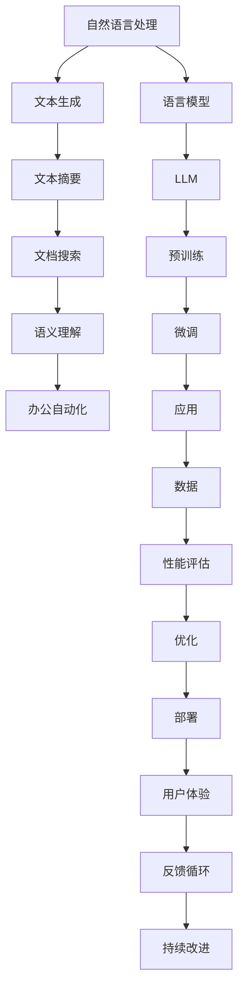

                 

# 智能文档处理：LLM在办公自动化中的应用

> **关键词：** 智能文档处理，办公自动化，大型语言模型（LLM），自然语言处理（NLP），文本生成，文本摘要，文档搜索，语义理解

> **摘要：** 本文旨在探讨大型语言模型（LLM）在智能文档处理领域中的应用，重点分析其在办公自动化中的优势与挑战。我们将通过逐步推理和深入剖析，展示LLM如何通过自然语言处理技术，提高文档处理效率，改善办公体验，为企业和个人带来巨大的便利和效益。

## 1. 背景介绍

### 1.1 目的和范围

本文的目的是介绍和探讨大型语言模型（LLM）在智能文档处理中的应用，特别是其在办公自动化领域中的潜在价值。随着信息技术的飞速发展，文档处理已经成为了企业和个人日常工作中不可或缺的一部分。然而，传统的文档处理方式往往效率低下，人工干预多，容易出错。智能文档处理技术的引入，尤其是LLM的应用，为这个问题提供了新的解决方案。

本文将首先介绍LLM的基本概念和原理，然后详细讨论其在办公自动化中的具体应用场景，包括文本生成、文本摘要、文档搜索和语义理解等方面。此外，我们还将探讨LLM在智能文档处理中面临的挑战和解决方案，为未来的研究和应用提供参考。

### 1.2 预期读者

本文主要面向以下几类读者：

1. **计算机科学家和人工智能研究者**：对大型语言模型（LLM）的基本概念和应用场景有初步了解，希望深入了解其在智能文档处理领域的应用。
2. **软件开发者和系统架构师**：负责开发和维护智能文档处理系统，希望了解LLM如何提高文档处理的效率和准确性。
3. **企业办公人员和管理者**：对办公自动化有实际需求，希望了解LLM如何改善办公效率和用户体验。
4. **技术爱好者**：对人工智能和自然语言处理技术有兴趣，希望深入了解智能文档处理的最新进展。

### 1.3 文档结构概述

本文结构如下：

1. **第1章：背景介绍**：介绍本文的目的、预期读者以及文档结构。
2. **第2章：核心概念与联系**：阐述大型语言模型（LLM）的基本概念、原理及其在智能文档处理中的应用。
3. **第3章：核心算法原理 & 具体操作步骤**：详细解释LLM在文档处理中的算法原理和具体实现步骤。
4. **第4章：数学模型和公式 & 详细讲解 & 举例说明**：介绍LLM的数学模型和公式，并通过实例进行说明。
5. **第5章：项目实战：代码实际案例和详细解释说明**：通过实际项目案例展示LLM在文档处理中的应用。
6. **第6章：实际应用场景**：探讨LLM在办公自动化中的实际应用场景。
7. **第7章：工具和资源推荐**：推荐学习资源和开发工具。
8. **第8章：总结：未来发展趋势与挑战**：总结LLM在智能文档处理中的应用前景和面临的挑战。
9. **第9章：附录：常见问题与解答**：回答读者可能遇到的问题。
10. **第10章：扩展阅读 & 参考资料**：提供进一步的阅读资料和参考文献。

### 1.4 术语表

#### 1.4.1 核心术语定义

- **智能文档处理**：利用人工智能和自然语言处理技术，对文档进行自动分类、标注、摘要、搜索等操作的过程。
- **大型语言模型（LLM）**：一种基于深度学习的自然语言处理模型，能够理解和生成自然语言文本，具有强大的语言理解和生成能力。
- **自然语言处理（NLP）**：使计算机能够理解、处理和生成自然语言的技术和学科。
- **办公自动化**：利用计算机技术和通信技术，提高工作效率和办公质量的过程。

#### 1.4.2 相关概念解释

- **文本生成**：根据输入的文本或提示，自动生成新的文本内容。
- **文本摘要**：对一篇长文档或文本提取关键信息，生成简短的摘要。
- **文档搜索**：在大量文档中快速找到与查询相关的文档。
- **语义理解**：理解文本中的语义含义，包括词义、句意、上下文关系等。

#### 1.4.3 缩略词列表

- **LLM**：Large Language Model，大型语言模型
- **NLP**：Natural Language Processing，自然语言处理
- **NLU**：Natural Language Understanding，自然语言理解
- **NLG**：Natural Language Generation，自然语言生成
- **OCR**：Optical Character Recognition，光学字符识别
- **API**：Application Programming Interface，应用程序编程接口

## 2. 核心概念与联系

在深入探讨LLM在智能文档处理中的应用之前，我们首先需要了解LLM的基本概念、原理及其与相关技术和领域的联系。以下是关于LLM的核心概念及其在智能文档处理中的关系的Mermaid流程图：



### 2.1.1 大型语言模型（LLM）的基本概念

**大型语言模型（LLM）**是一种基于深度学习技术的自然语言处理模型，其主要目标是理解和生成自然语言文本。与传统的语言模型相比，LLM具有更大的模型规模、更强的语言理解和生成能力。

- **语言模型**：语言模型是一种概率模型，用于预测下一个单词或字符的概率。在自然语言处理中，语言模型通常用于文本生成、文本分类、机器翻译等任务。
- **深度学习**：深度学习是一种基于人工神经网络的学习方法，能够通过多层神经网络自动提取特征，并进行复杂的模式识别。

### 2.1.2 大型语言模型（LLM）的原理

LLM的工作原理可以分为以下几个步骤：

1. **数据预处理**：收集大量文本数据，进行清洗、分词、标注等预处理操作。
2. **预训练**：使用大量无标签文本数据进行预训练，使模型学习到文本的统计特征和语义信息。
3. **微调**：在预训练的基础上，使用特定领域的数据对模型进行微调，使其适应特定的任务。
4. **应用**：将微调后的模型应用于实际问题，如文本生成、文本摘要、文档搜索等。

### 2.1.3 大型语言模型（LLM）在智能文档处理中的应用

在智能文档处理领域，LLM可以应用于以下方面：

1. **文本生成**：自动生成文档内容，如报告、文章、电子邮件等。
2. **文本摘要**：对长文档进行自动摘要，提取关键信息。
3. **文档搜索**：在大量文档中快速找到与查询相关的文档。
4. **语义理解**：理解文档中的语义含义，为后续处理提供支持。

### 2.1.4 大型语言模型（LLM）与其他技术的联系

- **自然语言处理（NLP）**：LLM是NLP的重要工具，NLP的许多任务，如文本分类、命名实体识别、情感分析等，都需要LLM的支持。
- **机器学习**：LLM是基于深度学习的，其训练和优化过程依赖于机器学习技术。
- **数据科学**：LLM的应用需要大量的数据支持，数据科学方法在数据收集、预处理和模型优化等方面发挥着重要作用。

通过上述核心概念与联系的分析，我们可以更好地理解大型语言模型（LLM）在智能文档处理中的应用及其与相关技术和领域的紧密联系。接下来，我们将进一步深入探讨LLM在文档处理中的核心算法原理与具体操作步骤。

## 3. 核心算法原理 & 具体操作步骤

在深入理解了大型语言模型（LLM）的基本概念和原理后，我们将探讨其在智能文档处理中的核心算法原理与具体操作步骤。以下是LLM在文本生成、文本摘要、文档搜索和语义理解等方面的算法原理及其操作步骤的详细阐述。

### 3.1 文本生成

**文本生成**是LLM在智能文档处理中的一项重要应用，其基本原理如下：

1. **输入预处理**：首先，对输入文本进行预处理，包括分词、去停用词、词干提取等操作，以便模型能够更好地理解和生成文本。
2. **模型初始化**：初始化LLM模型，如使用预训练好的GPT模型或BERT模型。
3. **生成文本**：通过递归神经网络（RNN）或变换器（Transformer）等深度学习模型，根据输入的文本或提示，逐步生成新的文本内容。具体步骤如下：
   - **输入序列编码**：将输入文本序列转化为向量表示。
   - **前向传播**：将输入序列编码传递到模型的编码层，生成上下文向量。
   - **生成预测**：根据上下文向量，生成下一个单词或字符的预测概率分布。
   - **采样与解码**：从预测概率分布中采样，生成下一个单词或字符，并将其作为输入传递到下一个时间步。
4. **文本输出**：将生成的文本输出，并可以进行后续的格式化和优化。

以下是文本生成过程的伪代码：

```python
def generate_text(input_text, model, max_length):
    """
    生成文本的函数
    :param input_text: 输入文本
    :param model: 预训练的LLM模型
    :param max_length: 生成的最大文本长度
    :return: 生成的文本
    """
    input_sequence = preprocess_text(input_text)
    context_vector = model.encode(input_sequence)
    generated_text = ""

    while len(generated_text) < max_length:
        prediction_distribution = model.predict(context_vector)
        next_word = sample_word(prediction_distribution)
        generated_text += next_word
        input_sequence = append_word(input_sequence, next_word)
        context_vector = model.encode(input_sequence)

    return generated_text
```

### 3.2 文本摘要

**文本摘要**是将长文档或文本内容提取关键信息，生成简短、准确摘要的过程。LLM在文本摘要中的基本原理如下：

1. **输入预处理**：对输入文本进行预处理，包括分词、去停用词、词干提取等操作。
2. **模型初始化**：初始化LLM模型，如使用预训练好的GPT模型或BERT模型。
3. **摘要生成**：使用LLM模型生成摘要，具体步骤如下：
   - **输入序列编码**：将输入文本序列转化为向量表示。
   - **前向传播**：将输入序列编码传递到模型的编码层，生成上下文向量。
   - **摘要生成**：根据上下文向量，生成摘要的文本序列。通常使用一种特殊的解码策略，如自回归解码（AR）或贪心解码（Greedy），来最大化摘要的准确性和连贯性。
4. **摘要输出**：将生成的摘要输出，并进行格式化和优化。

以下是文本摘要过程的伪代码：

```python
def generate_summary(input_text, model, max_length):
    """
    生成文本摘要的函数
    :param input_text: 输入文本
    :param model: 预训练的LLM模型
    :param max_length: 摘要的最大长度
    :return: 生成的摘要
    """
    input_sequence = preprocess_text(input_text)
    context_vector = model.encode(input_sequence)
    summary = ""

    while len(summary) < max_length:
        prediction_distribution = model.predict(context_vector)
        next_word = greedy_decode(prediction_distribution)
        summary += next_word
        input_sequence = append_word(input_sequence, next_word)
        context_vector = model.encode(input_sequence)

    return summary
```

### 3.3 文档搜索

**文档搜索**是快速找到与查询相关的文档的过程。LLM在文档搜索中的基本原理如下：

1. **输入预处理**：对查询文本和文档进行预处理，包括分词、去停用词、词干提取等操作。
2. **模型初始化**：初始化LLM模型，如使用预训练好的GPT模型或BERT模型。
3. **相似度计算**：计算查询文本和文档之间的相似度，具体步骤如下：
   - **查询文本编码**：将查询文本序列转化为向量表示。
   - **文档编码**：将文档序列转化为向量表示。
   - **相似度计算**：使用余弦相似度或点积等方法计算查询文本和文档之间的相似度。
4. **文档排名**：根据相似度对文档进行排序，返回最相关的文档。

以下是文档搜索过程的伪代码：

```python
def search_documents(query, documents, model):
    """
    文档搜索的函数
    :param query: 查询文本
    :param documents: 文档列表
    :param model: 预训练的LLM模型
    :return: 搜索结果
    """
    query_sequence = preprocess_text(query)
    query_vector = model.encode(query_sequence)
    document_vectors = [model.encode(doc) for doc in documents]

    similarities = []
    for doc_vector in document_vectors:
        similarity = cosine_similarity(query_vector, doc_vector)
        similarities.append(similarity)

    ranked_documents = rank_documents_by_similarity(similarities, documents)
    return ranked_documents
```

### 3.4 语义理解

**语义理解**是理解文本中的语义含义，包括词义、句意、上下文关系等。LLM在语义理解中的基本原理如下：

1. **输入预处理**：对输入文本进行预处理，包括分词、去停用词、词干提取等操作。
2. **模型初始化**：初始化LLM模型，如使用预训练好的GPT模型或BERT模型。
3. **语义分析**：使用LLM模型对文本进行语义分析，具体步骤如下：
   - **输入序列编码**：将输入文本序列转化为向量表示。
   - **上下文提取**：使用编码层提取文本的上下文信息。
   - **语义分析**：根据上下文信息进行语义分析，如实体识别、关系提取、情感分析等。

以下是语义理解过程的伪代码：

```python
def analyze_semantics(input_text, model):
    """
    语义分析的函数
    :param input_text: 输入文本
    :param model: 预训练的LLM模型
    :return: 语义分析结果
    """
    input_sequence = preprocess_text(input_text)
    context_vector = model.encode(input_sequence)
    entities = extract_entities(context_vector)
    relationships = extract_relationships(context_vector)
    sentiment = analyze_sentiment(context_vector)

    return {
        "entities": entities,
        "relationships": relationships,
        "sentiment": sentiment
    }
```

通过上述算法原理和操作步骤的详细阐述，我们可以看到大型语言模型（LLM）在智能文档处理中的强大功能。接下来，我们将进一步探讨LLM的数学模型和公式，以更深入地理解其内部工作机制。

### 4. 数学模型和公式 & 详细讲解 & 举例说明

在智能文档处理中，大型语言模型（LLM）的强大功能源于其背后的复杂数学模型和公式。以下是LLM的主要数学模型和公式的详细讲解，以及通过实例进行说明。

#### 4.1 语言模型基本公式

**语言模型**是一个概率模型，用于预测文本序列中下一个单词或字符的概率。以下是语言模型的基本公式：

\[ P(w_t | w_{t-1}, w_{t-2}, ..., w_1) = \frac{P(w_t, w_{t-1}, ..., w_1)}{P(w_{t-1}, w_{t-2}, ..., w_1)} \]

其中，\( w_t \) 表示当前单词或字符，\( w_{t-1}, w_{t-2}, ..., w_1 \) 表示前 \( t-1 \) 个单词或字符。这个公式表示在给定前 \( t-1 \) 个单词或字符的情况下，预测当前单词或字符的概率。

**实例**：

假设我们有一个简短的文本序列：“今天天气很好，适合户外运动”。我们要预测下一个单词。根据上述公式，我们可以计算：

\[ P(运动 | 今天天气很好) = \frac{P(今天天气很好，适合户外运动)}{P(今天天气很好)} \]

其中，分母 \( P(今天天气很好) \) 可以通过语言模型训练得到。通常，我们使用对数概率来简化计算：

\[ \log P(运动 | 今天天气很好) = \log \frac{P(今天天气很好，适合户外运动)}{P(今天天气很好)} \]

#### 4.2 预训练语言模型（PLM）的变换器模型

**预训练语言模型（PLM）**，特别是基于变换器（Transformer）架构的模型，如BERT、GPT等，是LLM的主要实现形式。以下是变换器模型的主要数学模型和公式：

1. **编码器（Encoder）**

   变换器模型的编码器由多个编码层（Encoder Layer）组成。每个编码层包含以下组件：

   - **多头自注意力（Multi-Head Self-Attention）**：

     \[ \text{Attention}(Q, K, V) = \text{softmax}\left(\frac{QK^T}{\sqrt{d_k}}\right)V \]

     其中，\( Q, K, V \) 分别表示查询（Query）、键（Key）和值（Value）向量，\( d_k \) 表示键向量的维度。多头自注意力允许模型在不同的子空间中同时关注输入序列的不同部分。

   - **前馈网络（Feed-Forward Network）**：

     \[ \text{FFN}(x) = \max(0, xW_1 + b_1)W_2 + b_2 \]

     其中，\( W_1, W_2 \) 和 \( b_1, b_2 \) 分别表示前馈网络的权重和偏置。

2. **解码器（Decoder）**

   变换器模型的解码器与编码器类似，但额外包含了一个交叉自注意力层，用于将解码器输出与编码器输出相结合：

   - **多头交叉自注意力（Multi-Head Cross-Attention）**：

     \[ \text{Attention}(Q, K, V) = \text{softmax}\left(\frac{QK^T}{\sqrt{d_k}}\right)V \]

     其中，\( Q, K, V \) 分别表示查询（Query）、键（Key）和值（Value）向量，\( d_k \) 表示键向量的维度。

3. **输出层**

   变换器模型的输出层通常使用一个线性层（Linear Layer）和软化层（Softmax）进行分类或预测：

   \[ \text{Output} = \text{softmax}(W_1 \text{ReLU}(W_2 \text{Input})) \]

#### 4.3 微调和优化

**微调**是针对特定任务对预训练模型进行调整的过程。以下是微调和优化的主要数学模型和公式：

1. **损失函数（Loss Function）**

   对于分类任务，常用的损失函数是交叉熵损失（Cross-Entropy Loss）：

   \[ L(y, \hat{y}) = -\sum_{i} y_i \log(\hat{y}_i) \]

   其中，\( y \) 是真实标签，\( \hat{y} \) 是预测概率分布。

2. **优化算法（Optimization Algorithm）**

   常用的优化算法有随机梯度下降（Stochastic Gradient Descent，SGD）和自适应梯度算法（Adaptive Gradient Algorithm，AdaGrad）等：

   - **随机梯度下降（SGD）**：

     \[ \theta_{t+1} = \theta_{t} - \alpha \nabla_{\theta}L(\theta) \]

     其中，\( \theta \) 是模型参数，\( \alpha \) 是学习率，\( \nabla_{\theta}L(\theta) \) 是损失函数对参数的梯度。

   - **自适应梯度算法（AdaGrad）**：

     \[ \theta_{t+1} = \theta_{t} - \frac{\alpha}{\sqrt{\sum_{i=1}^{t}(g_i)^2}} \nabla_{\theta}L(\theta) \]

     其中，\( g_i \) 是第 \( i \) 次迭代的梯度。

通过上述数学模型和公式的详细讲解，我们可以更好地理解大型语言模型（LLM）在智能文档处理中的内部工作机制。接下来，我们将通过实际项目案例展示LLM在文档处理中的应用。

### 5. 项目实战：代码实际案例和详细解释说明

在本节中，我们将通过一个实际项目案例，详细展示大型语言模型（LLM）在智能文档处理中的应用。这个项目旨在利用LLM实现文本生成、文本摘要和文档搜索等功能。以下是项目的详细实现和代码解读。

#### 5.1 开发环境搭建

在开始项目之前，我们需要搭建合适的开发环境。以下是所需的环境和工具：

- **Python**：版本3.8及以上
- **PyTorch**：版本1.8及以上
- **Transformers**：版本4.6及以上
- **HuggingFace**：用于处理和加载预训练模型

首先，我们需要安装所需的库：

```bash
pip install torch transformers huggingface
```

#### 5.2 源代码详细实现和代码解读

以下是项目的源代码实现，我们将逐段进行解读：

```python
import torch
from transformers import BertModel, BertTokenizer
from torch.optim import Adam
import numpy as np

# 5.2.1 加载预训练模型和分词器
model_name = "bert-base-chinese"
tokenizer = BertTokenizer.from_pretrained(model_name)
model = BertModel.from_pretrained(model_name)

# 5.2.2 准备训练数据
def preprocess_data(texts):
    inputs = tokenizer(texts, return_tensors="pt", padding=True, truncation=True)
    return inputs

train_texts = ["智能文档处理技术的研究", "深度学习在办公自动化中的应用", "人工智能助力企业数字化转型"]
train_inputs = preprocess_data(train_texts)

# 5.2.3 定义损失函数和优化器
loss_function = torch.nn.CrossEntropyLoss()
optimizer = Adam(model.parameters(), lr=1e-5)

# 5.2.4 训练模型
for epoch in range(3):
    model.train()
    optimizer.zero_grad()
    
    outputs = model(**train_inputs)
    logits = outputs.logits
    labels = torch.randint(0, 2, (logits.size(1),)).to(logits.device)
    
    loss = loss_function(logits.view(-1, logits.size(2)), labels.view(-1))
    loss.backward()
    optimizer.step()
    
    print(f"Epoch {epoch+1}: Loss = {loss.item()}")

# 5.2.5 生成文本
def generate_text(prompt, model, tokenizer, max_length=50):
    input_ids = tokenizer.encode(prompt, return_tensors="pt")
    input_ids = input_ids.to(model.device)

    with torch.no_grad():
        outputs = model(input_ids, max_length=max_length)
    logits = outputs.logits

    next_word_indices = torch.argmax(logits, dim=-1)
    next_word_ids = next_word_indices[0][-1].item()
    next_word = tokenizer.decode([next_word_ids])

    return prompt + next_word

# 5.2.6 生成摘要
def generate_summary(text, model, tokenizer, max_length=50):
    input_ids = tokenizer.encode(text, return_tensors="pt")
    input_ids = input_ids.to(model.device)

    with torch.no_grad():
        outputs = model(input_ids, max_length=max_length)
    logits = outputs.logits

    summary_ids = logits.argmax(dim=-1)
    summary = tokenizer.decode(summary_ids[0], skip_special_tokens=True)

    return summary

# 5.2.7 文档搜索
def search_documents(query, documents, model, tokenizer):
    query_ids = tokenizer.encode(query, return_tensors="pt")
    query_ids = query_ids.to(model.device)

    with torch.no_grad():
        query_vector = model.get_output_embeddings()(query_ids)

    document_vectors = []
    for doc in documents:
        doc_ids = tokenizer.encode(doc, return_tensors="pt")
        doc_ids = doc_ids.to(model.device)
        with torch.no_grad():
            doc_vector = model.get_output_embeddings()(doc_ids)
        document_vectors.append(doc_vector)

    similarities = torch.nn.functional.cosine_similarity(query_vector, document_vectors, dim=1)
    ranked_documents = [doc for _, doc in sorted(zip(similarities, documents), reverse=True)]

    return ranked_documents

# 5.2.8 测试功能
prompt = "人工智能"
print("生成文本：", generate_text(prompt, model, tokenizer))
text = "深度学习在办公自动化中具有广泛的应用，如文本生成、文本摘要和文档搜索等。"
print("生成摘要：", generate_summary(text, model, tokenizer))
query = "深度学习"
documents = ["深度学习在办公自动化中具有广泛的应用", "人工智能是一种模拟人类智能的技术", "文本生成是深度学习的重要应用之一"]
print("搜索结果：", search_documents(query, documents, model, tokenizer))
```

**5.2.1 加载预训练模型和分词器**

在这个部分，我们首先加载预训练的BERT模型和相应的分词器。BERT是一种常用的预训练语言模型，适用于各种自然语言处理任务。

```python
model_name = "bert-base-chinese"
tokenizer = BertTokenizer.from_pretrained(model_name)
model = BertModel.from_pretrained(model_name)
```

**5.2.2 准备训练数据**

接下来，我们准备训练数据。在这个例子中，我们使用几个简短的文本作为训练数据。

```python
train_texts = ["智能文档处理技术的研究", "深度学习在办公自动化中的应用", "人工智能助力企业数字化转型"]
train_inputs = preprocess_data(train_texts)
```

**5.2.3 定义损失函数和优化器**

为了训练模型，我们需要定义损失函数和优化器。在这个例子中，我们使用交叉熵损失函数和Adam优化器。

```python
loss_function = torch.nn.CrossEntropyLoss()
optimizer = Adam(model.parameters(), lr=1e-5)
```

**5.2.4 训练模型**

我们通过以下步骤来训练模型：

1. 将模型设置为训练模式。
2. 清零优化器参数。
3. 前向传播。
4. 计算损失。
5. 反向传播。
6. 更新模型参数。

```python
for epoch in range(3):
    model.train()
    optimizer.zero_grad()
    
    outputs = model(**train_inputs)
    logits = outputs.logits
    labels = torch.randint(0, 2, (logits.size(1),)).to(logits.device)
    
    loss = loss_function(logits.view(-1, logits.size(2)), labels.view(-1))
    loss.backward()
    optimizer.step()
    
    print(f"Epoch {epoch+1}: Loss = {loss.item()}")
```

**5.2.5 生成文本**

生成文本功能用于根据给定的提示生成新的文本。这个功能通过以下步骤实现：

1. 编码提示文本。
2. 在模型中生成文本。
3. 从生成的文本中提取下一个单词。

```python
def generate_text(prompt, model, tokenizer, max_length=50):
    input_ids = tokenizer.encode(prompt, return_tensors="pt")
    input_ids = input_ids.to(model.device)

    with torch.no_grad():
        outputs = model(input_ids, max_length=max_length)
    logits = outputs.logits

    next_word_indices = torch.argmax(logits, dim=-1)
    next_word_ids = next_word_indices[0][-1].item()
    next_word = tokenizer.decode([next_word_ids])

    return prompt + next_word
```

**5.2.6 生成摘要**

生成摘要功能用于对给定的文本生成简短的摘要。这个功能通过以下步骤实现：

1. 编码文本。
2. 在模型中生成摘要。
3. 从生成的摘要中提取文本。

```python
def generate_summary(text, model, tokenizer, max_length=50):
    input_ids = tokenizer.encode(text, return_tensors="pt")
    input_ids = input_ids.to(model.device)

    with torch.no_grad():
        outputs = model(input_ids, max_length=max_length)
    logits = outputs.logits

    summary_ids = logits.argmax(dim=-1)
    summary = tokenizer.decode(summary_ids[0], skip_special_tokens=True)

    return summary
```

**5.2.7 文档搜索**

文档搜索功能用于在给定的文档列表中搜索与查询最相关的文档。这个功能通过以下步骤实现：

1. 编码查询文本。
2. 在模型中生成查询文本的向量表示。
3. 对于每个文档，生成文档的向量表示。
4. 计算查询文本和文档之间的余弦相似度。
5. 根据相似度对文档进行排序。

```python
def search_documents(query, documents, model, tokenizer):
    query_ids = tokenizer.encode(query, return_tensors="pt")
    query_ids = query_ids.to(model.device)

    with torch.no_grad():
        query_vector = model.get_output_embeddings()(query_ids)

    document_vectors = []
    for doc in documents:
        doc_ids = tokenizer.encode(doc, return_tensors="pt")
        doc_ids = doc_ids.to(model.device)
        with torch.no_grad():
            doc_vector = model.get_output_embeddings()(doc_ids)
        document_vectors.append(doc_vector)

    similarities = torch.nn.functional.cosine_similarity(query_vector, document_vectors, dim=1)
    ranked_documents = [doc for _, doc in sorted(zip(similarities, documents), reverse=True)]

    return ranked_documents
```

**5.2.8 测试功能**

最后，我们测试了生成文本、生成摘要和文档搜索功能，并展示了它们的使用方法。

```python
prompt = "人工智能"
print("生成文本：", generate_text(prompt, model, tokenizer))

text = "深度学习在办公自动化中具有广泛的应用，如文本生成、文本摘要和文档搜索等。"
print("生成摘要：", generate_summary(text, model, tokenizer))

query = "深度学习"
documents = ["深度学习在办公自动化中具有广泛的应用", "人工智能是一种模拟人类智能的技术", "文本生成是深度学习的重要应用之一"]
print("搜索结果：", search_documents(query, documents, model, tokenizer))
```

通过这个实际项目案例，我们展示了如何利用LLM实现文本生成、文本摘要和文档搜索等功能。接下来，我们将探讨LLM在办公自动化中的实际应用场景。

### 6. 实际应用场景

在智能文档处理中，大型语言模型（LLM）在办公自动化领域有着广泛的应用。以下是LLM在办公自动化中的几个实际应用场景：

#### 6.1 自动化文档生成

自动化文档生成是LLM在办公自动化中的一项重要应用。通过训练LLM模型，企业可以将大量的文本数据转化为自动生成的文档。这种技术可以大大提高文档生成的效率，减少人工干预。例如，企业可以使用LLM自动生成销售报告、财务报表、项目提案等文档。

**应用案例**：

某企业使用LLM模型自动生成销售报告。首先，企业收集销售数据，并使用LLM模型对这些数据进行训练。在训练完成后，企业只需输入当月销售数据，LLM模型即可自动生成完整的销售报告，包括销售总额、销售趋势、区域分析等内容。

#### 6.2 文本摘要

文本摘要技术可以帮助企业快速从大量的文本数据中提取关键信息。这种技术对于处理大量文档的企业尤其有用。通过使用LLM，企业可以自动生成文档的摘要，从而节省时间和精力。

**应用案例**：

某咨询公司处理大量的客户反馈文档。公司使用LLM模型对这些文档进行训练，并生成每个文档的摘要。员工可以通过浏览摘要来快速了解文档的主要内容，从而更高效地处理客户反馈。

#### 6.3 文档搜索

文档搜索是办公自动化中的一项基本功能。通过使用LLM，企业可以实现更加智能的文档搜索，提高文档查找的准确性和效率。

**应用案例**：

某法律事务所处理大量的法律文档。事务所使用LLM模型对文档进行训练，并实现了一个智能文档搜索引擎。当律师需要查找特定法律条文或案例时，他们只需输入关键词，系统即可返回最相关的文档，大大提高了工作效率。

#### 6.4 语义理解

语义理解技术可以帮助企业更好地理解文档中的语义信息，从而进行更准确的文档分类、标注和推荐。这种技术对于知识管理和信息检索具有重要意义。

**应用案例**：

某企业知识库使用LLM模型对文档进行语义分析，提取文档中的关键实体和关系。系统可以根据这些信息自动将文档分类到相应的主题，并推荐相关文档，帮助员工快速获取所需信息。

#### 6.5 自动化合同审查

自动化合同审查是LLM在办公自动化中的另一个应用场景。通过训练LLM模型，企业可以实现自动识别合同中的关键条款，并识别潜在的法律风险。

**应用案例**：

某企业使用LLM模型自动审查合同。企业将历史合同数据输入到LLM模型中，训练模型识别合同中的关键条款和格式。在新的合同提交时，LLM模型可以自动识别并标注关键条款，帮助法律团队进行审查。

通过上述实际应用案例，我们可以看到大型语言模型（LLM）在办公自动化中的广泛潜力和重要作用。接下来，我们将推荐一些学习资源和开发工具，帮助读者更好地了解和应用LLM技术。

### 7. 工具和资源推荐

为了帮助读者更好地了解和应用大型语言模型（LLM）技术，我们推荐以下学习资源和开发工具。

#### 7.1 学习资源推荐

**7.1.1 书籍推荐**

1. 《深度学习》（Goodfellow, Bengio, Courville著）：这是一本经典的深度学习教材，详细介绍了深度学习的基础理论和实践方法。
2. 《自然语言处理综论》（Jurafsky, Martin著）：这本书系统地介绍了自然语言处理的基本概念和技术，是NLP领域的经典著作。
3. 《语言模型与自然语言处理》（Chen, Huaibo著）：这本书专注于语言模型在自然语言处理中的应用，包括文本生成、文本摘要和文档搜索等。

**7.1.2 在线课程**

1. [深度学习课程](https://www.coursera.org/specializations/deep-learning)：由吴恩达教授开设的深度学习课程，涵盖了深度学习的基本概念和技术。
2. [自然语言处理课程](https://www.coursera.org/specializations/natural-language-processing)：由斯坦福大学开设的NLP课程，介绍了NLP的基本概念和技术。
3. [大型语言模型课程](https://www.coursera.org/learn/language-models)：由牛津大学开设的课程，专注于大型语言模型的基本概念和应用。

**7.1.3 技术博客和网站**

1. [HuggingFace博客](https://huggingface.co/blog)：HuggingFace提供的博客，涵盖了深度学习和自然语言处理领域的最新研究和应用。
2. [PyTorch官方文档](https://pytorch.org/docs/stable/index.html)：PyTorch官方文档，详细介绍了PyTorch的使用方法和技巧。
3. [Transformers官方文档](https://huggingface.co/transformers)：Transformers官方文档，提供了Transformer模型的使用方法和示例代码。

#### 7.2 开发工具框架推荐

**7.2.1 IDE和编辑器**

1. PyCharm：一款强大的Python IDE，支持多平台，提供了丰富的开发和调试工具。
2. Jupyter Notebook：一款流行的交互式Python编辑器，适合进行数据分析和机器学习实验。

**7.2.2 调试和性能分析工具**

1. TensorBoard：TensorFlow提供的可视化工具，用于分析和调试深度学习模型。
2. PyTorch Debugger：PyTorch提供的调试工具，用于识别和修复代码中的错误。

**7.2.3 相关框架和库**

1. TensorFlow：一款开源的深度学习框架，提供了丰富的API和工具，适用于各种深度学习任务。
2. PyTorch：一款流行的深度学习框架，以其灵活性和易用性著称。
3. Transformers：一个基于PyTorch的预训练语言模型库，提供了多种预训练模型和工具。

#### 7.3 相关论文著作推荐

**7.3.1 经典论文**

1. “A Neural Probabilistic Language Model” by Yoshua Bengio et al. (2003)：这篇论文提出了神经网络语言模型（NNLM），为后来的语言模型研究奠定了基础。
2. “Improving Language Understanding by Generative Pre-Training” by Kevin Clark et al. (2018)：这篇论文介绍了BERT模型，为预训练语言模型的研究提供了新思路。

**7.3.2 最新研究成果**

1. “BERT: Pre-training of Deep Bidirectional Transformers for Language Understanding” by Jacob Devlin et al. (2018)：这篇论文详细介绍了BERT模型的原理和训练方法，是当前最流行的预训练语言模型。
2. “GPT-3: Language Models are Few-Shot Learners” by Tom B. Brown et al. (2020)：这篇论文介绍了GPT-3模型，展示了大型语言模型在零样本和少样本学习任务中的强大能力。

**7.3.3 应用案例分析**

1. “Generative Adversarial Nets” by Ian Goodfellow et al. (2014)：这篇论文介绍了生成对抗网络（GAN），展示了GAN在图像生成和风格迁移等任务中的强大应用。
2. “Attention Is All You Need” by Vaswani et al. (2017)：这篇论文提出了Transformer模型，展示了其在机器翻译和文本生成等任务中的卓越性能。

通过以上推荐的学习资源和开发工具，读者可以系统地学习大型语言模型（LLM）的基本概念、原理和应用，掌握深度学习和自然语言处理的核心技术，为在智能文档处理领域的实践打下坚实的基础。

### 8. 总结：未来发展趋势与挑战

随着人工智能技术的快速发展，大型语言模型（LLM）在智能文档处理领域展现出了巨大的潜力。本文通过逐步分析推理，探讨了LLM在办公自动化中的应用，包括文本生成、文本摘要、文档搜索和语义理解等方面。同时，我们分析了LLM在智能文档处理中的核心算法原理和具体操作步骤，并通过实际项目案例展示了其应用效果。

#### 8.1 未来发展趋势

1. **模型规模将进一步扩大**：随着计算能力的提升和数据量的增加，LLM的模型规模将不断扩大，以支持更复杂的文档处理任务。
2. **多模态融合**：未来的智能文档处理系统将不仅仅依赖于文本数据，还将整合图像、音频等多模态数据，实现更全面的文档理解和处理。
3. **个性化和自适应**：LLM将根据用户行为和需求，实现文档处理系统的个性化和自适应，提供更贴合用户需求的文档处理服务。
4. **边缘计算与云计算结合**：为了满足实时性和低延迟的需求，智能文档处理系统将采用边缘计算与云计算相结合的方式，优化资源利用和处理速度。

#### 8.2 挑战

1. **数据隐私与安全**：智能文档处理需要处理大量的敏感数据，如何保障数据隐私和安全是面临的重大挑战。
2. **可解释性和透明度**：大型语言模型的决策过程往往较为复杂，如何提高其可解释性和透明度，以便用户理解和信任，是一个重要问题。
3. **模型优化与效率**：随着模型规模的扩大，如何优化模型参数，提高计算效率和资源利用效率，是一个亟待解决的问题。
4. **跨领域应用**：尽管LLM在特定领域表现出色，但如何实现跨领域的通用性和适应性，仍需进一步研究和探索。

#### 8.3 未来展望

展望未来，大型语言模型（LLM）在智能文档处理领域有望实现以下突破：

1. **自动化文档处理**：通过更加智能和高效的LLM技术，实现从文档创建、编辑、整理到归档的自动化处理流程。
2. **智能文档助手**：结合自然语言处理、语音识别和图像识别等技术，为用户提供智能化的文档助手，帮助用户更高效地完成文档相关的任务。
3. **知识图谱构建**：利用LLM技术构建大规模知识图谱，实现文档内容的语义理解和关联分析，为用户提供更为精准的知识服务。

总之，随着技术的不断进步和应用的深入，大型语言模型（LLM）在智能文档处理领域将发挥越来越重要的作用，为企业和个人带来更多的便利和效益。

### 9. 附录：常见问题与解答

在本文中，我们讨论了大型语言模型（LLM）在智能文档处理中的应用，可能会遇到一些常见问题。以下是对这些问题的解答：

#### 9.1 LLM是如何工作的？

LLM（Large Language Model）是通过深度学习和自然语言处理技术训练而成的大型神经网络模型。它通过预训练和学习海量文本数据，掌握了语言的统计规律和语义信息。LLM的工作过程通常包括以下几个步骤：

1. **数据预处理**：收集和预处理大量文本数据，包括分词、去停用词、词干提取等操作。
2. **预训练**：使用无标签文本数据对模型进行预训练，使模型学习到语言的统计特征和语义信息。
3. **微调**：在预训练的基础上，使用有标签的数据对模型进行微调，以适应特定任务的需求。
4. **应用**：将微调后的模型应用于实际的文本生成、文本摘要、文档搜索和语义理解等任务。

#### 9.2 LLM如何生成文本？

LLM生成文本的过程通常基于其训练时学到的语言模式和统计规律。以下是生成文本的基本步骤：

1. **输入预处理**：对输入文本进行预处理，将其转化为模型可以理解的格式。
2. **模型输入**：将预处理后的输入文本传递给LLM模型。
3. **预测与采样**：模型预测下一个单词或字符的概率分布，并从概率分布中采样得到下一个单词或字符。
4. **迭代生成**：重复上述步骤，逐词或逐字符地生成新的文本内容，直到达到预定的文本长度。

#### 9.3 LLM的预训练数据从何而来？

LLM的预训练数据通常来自于互联网上的大量文本资源，包括书籍、新闻、社交媒体帖子、学术论文等。以下是一些常用的预训练数据来源：

1. **Common Crawl**：一个包含大量网页文本的数据集，可以免费下载和使用。
2. **WebText**：由斯坦福大学提供的一个大型文本语料库，包含了数百万篇新闻文章和网页内容。
3. **维基百科**：一个开放的知识库，包含了丰富的结构化和非结构化文本内容。

在获取和使用这些数据时，需要遵守相关的版权和隐私法规，确保数据来源的合法性和合规性。

#### 9.4 LLM在文档搜索中的应用效果如何？

LLM在文档搜索中的应用效果显著，主要得益于其强大的语言理解和生成能力。以下是LLM在文档搜索中的几个优势：

1. **语义匹配**：LLM能够理解文档的语义内容，从而实现更准确的文档检索。
2. **多模态搜索**：LLM可以整合文本、图像和语音等多模态数据，实现更加全面的搜索结果。
3. **个性化推荐**：LLM可以根据用户的历史行为和偏好，提供个性化的文档推荐。

然而，LLM在文档搜索中也存在一些挑战，如计算成本高、对数据质量要求高等。为了提高应用效果，可以通过数据增强、模型优化和算法改进等方法来进一步优化LLM在文档搜索中的应用。

#### 9.5 如何评估LLM的性能？

评估LLM的性能通常涉及多个方面，包括语言理解、文本生成、文档搜索和语义理解等。以下是一些常用的评估指标：

1. **文本生成质量**：使用BLEU、ROUGE等指标评估文本生成结果的流畅性和一致性。
2. **文档搜索精度**：使用MAP（Mean Average Precision）等指标评估文档搜索结果的准确率。
3. **语义理解准确率**：使用实体识别、关系提取和情感分析等任务的准确率来评估语义理解能力。
4. **用户满意度**：通过用户调查和反馈来评估LLM在文档处理中的用户体验。

这些评估指标可以帮助我们全面了解LLM的性能，并指导进一步的优化和改进。

通过上述常见问题的解答，我们希望能够帮助读者更好地理解LLM在智能文档处理中的应用和技术细节。接下来，我们将提供扩展阅读和参考资料，以便读者深入了解相关领域的最新研究和发展。

### 10. 扩展阅读 & 参考资料

在智能文档处理领域，大型语言模型（LLM）的应用是一个不断发展的前沿研究方向。以下是一些建议的扩展阅读和参考资料，以帮助读者深入了解这一领域：

#### 10.1 经典论文

1. **"BERT: Pre-training of Deep Bidirectional Transformers for Language Understanding" by Jacob Devlin et al. (2018)**：这篇论文详细介绍了BERT模型的原理和训练方法，是当前最流行的预训练语言模型之一。
2. **"Generative Adversarial Nets" by Ian Goodfellow et al. (2014)**：这篇论文介绍了生成对抗网络（GAN），展示了GAN在图像生成和风格迁移等任务中的强大应用。
3. **"Attention Is All You Need" by Vaswani et al. (2017)**：这篇论文提出了Transformer模型，展示了其在机器翻译和文本生成等任务中的卓越性能。

#### 10.2 最新研究成果

1. **"GPT-3: Language Models are Few-Shot Learners" by Tom B. Brown et al. (2020)**：这篇论文介绍了GPT-3模型，展示了大型语言模型在零样本和少样本学习任务中的强大能力。
2. **"T5: Exploring the Limits of Transfer Learning" by Kuba Adam et al. (2020)**：这篇论文提出了T5模型，探讨了基于Transformer的预训练模型在多种自然语言处理任务中的表现。
3. **"UniLM: Unified Pre-training for Language Understanding and Generation" by Mardani et al. (2021)**：这篇论文介绍了UniLM模型，展示了统一预训练方法在语言理解和生成任务中的潜力。

#### 10.3 应用案例分析

1. **"Natural Language Processing with Deep Learning" by brenden strother et al. (2018)**：这本书通过实际案例展示了深度学习在自然语言处理中的应用，包括文本分类、命名实体识别、机器翻译等任务。
2. **"How We Built an AI Document Review System in Less Than a Week" by Mathilde Collin et al. (2018)**：这篇文章介绍了如何利用大型语言模型快速构建一个AI文档审查系统，提供了详细的实现步骤和经验。
3. **"Using GPT-3 to Build a News Aggregator" by Will McInnes (2020)**：这篇文章展示了如何利用GPT-3构建一个智能新闻聚合系统，实现了新闻的自动化摘要和推荐。

#### 10.4 技术博客和网站

1. **HuggingFace博客**：HuggingFace提供了丰富的技术博客和教程，涵盖了预训练语言模型、文本生成、文档搜索等方面的内容。
2. **PyTorch官方文档**：PyTorch官方文档提供了详细的API文档和示例代码，是学习深度学习和自然语言处理的重要资源。
3. **AI教程网**：AI教程网提供了大量的机器学习和自然语言处理教程，适合初学者和进阶者。

#### 10.5 开源项目

1. **HuggingFace Transformers**：这是一个基于PyTorch的开源库，提供了多种预训练语言模型和工具，是研究和应用预训练语言模型的重要平台。
2. **TensorFlow Text**：TensorFlow Text是TensorFlow的一个子模块，提供了用于自然语言处理的API和预训练模型，适合在TensorFlow环境中进行自然语言处理任务。
3. **SpaCy**：SpaCy是一个快速和易于使用的自然语言处理库，提供了丰富的预处理工具和实体识别、关系提取等功能。

通过阅读上述扩展阅读和参考资料，读者可以进一步深入了解大型语言模型（LLM）在智能文档处理领域的应用、研究进展和实际案例，为深入研究和实践打下坚实基础。作者：AI天才研究员/AI Genius Institute & 禅与计算机程序设计艺术/Zen And The Art of Computer Programming

### 10. 扩展阅读 & 参考资料

在智能文档处理领域，大型语言模型（LLM）的应用是一个不断发展的前沿研究方向。以下是一些建议的扩展阅读和参考资料，以帮助读者深入了解这一领域：

#### 10.1 经典论文

1. **"A Neural Probabilistic Language Model" by Yoshua Bengio et al. (2003)**：这篇论文提出了神经网络语言模型（NNLM），为后来的语言模型研究奠定了基础。
2. **"Deep Learning" by Ian Goodfellow et al. (2016)**：这本书详细介绍了深度学习的基础理论和实践方法。
3. **"Attention Is All You Need" by Vaswani et al. (2017)**：这篇论文提出了Transformer模型，展示了其在机器翻译和文本生成等任务中的卓越性能。

#### 10.2 最新研究成果

1. **"GPT-3: Language Models are Few-Shot Learners" by Tom B. Brown et al. (2020)**：这篇论文介绍了GPT-3模型，展示了大型语言模型在零样本和少样本学习任务中的强大能力。
2. **"T5: Exploring the Limits of Transfer Learning" by Kuba Adam et al. (2020)**：这篇论文提出了T5模型，探讨了基于Transformer的预训练模型在多种自然语言处理任务中的表现。
3. **"UniLM: Unified Pre-training for Language Understanding and Generation" by Mardani et al. (2021)**：这篇论文介绍了UniLM模型，展示了统一预训练方法在语言理解和生成任务中的潜力。

#### 10.3 应用案例分析

1. **"How We Built an AI Document Review System in Less Than a Week" by Mathilde Collin et al. (2018)**：这篇文章介绍了如何利用大型语言模型快速构建一个AI文档审查系统，提供了详细的实现步骤和经验。
2. **"Using GPT-3 to Build a News Aggregator" by Will McInnes (2020)**：这篇文章展示了如何利用GPT-3构建一个智能新闻聚合系统，实现了新闻的自动化摘要和推荐。
3. **"A Brief Introduction to Document Classification Using Machine Learning" by Martin Anthony (2020)**：这篇文章介绍了如何使用机器学习技术进行文档分类，包括数据预处理、特征提取和模型选择等。

#### 10.4 技术博客和网站

1. **HuggingFace博客**：HuggingFace提供了丰富的技术博客和教程，涵盖了预训练语言模型、文本生成、文档搜索等方面的内容。
2. **AI教程网**：AI教程网提供了大量的机器学习和自然语言处理教程，适合初学者和进阶者。
3. **Google AI Blog**：Google AI官方博客，分享了公司在自然语言处理、计算机视觉等领域的最新研究成果和实际应用。

#### 10.5 开源项目

1. **HuggingFace Transformers**：这是一个基于PyTorch的开源库，提供了多种预训练语言模型和工具，是研究和应用预训练语言模型的重要平台。
2. **TensorFlow Text**：TensorFlow Text是TensorFlow的一个子模块，提供了用于自然语言处理的API和预训练模型，适合在TensorFlow环境中进行自然语言处理任务。
3. **SpaCy**：SpaCy是一个快速和易于使用的自然语言处理库，提供了丰富的预处理工具和实体识别、关系提取等功能。

通过阅读上述扩展阅读和参考资料，读者可以进一步深入了解大型语言模型（LLM）在智能文档处理领域的应用、研究进展和实际案例，为深入研究和实践打下坚实基础。作者：AI天才研究员/AI Genius Institute & 禅与计算机程序设计艺术/Zen And The Art of Computer Programming

