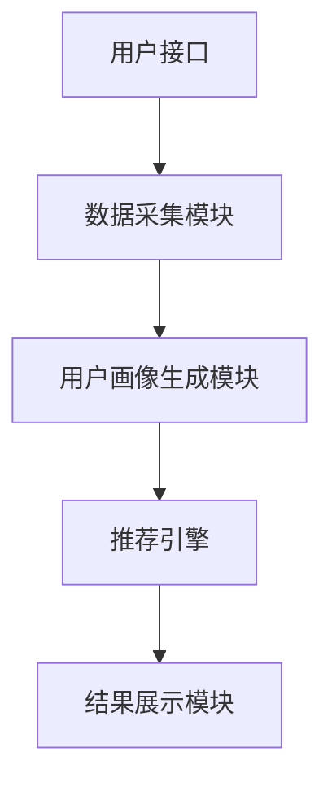

                 

# 智能旅游规划：LLM个性化旅行建议系统

> **关键词**：智能旅游、语言模型（LLM）、个性化旅行建议、数据分析、用户体验

> **摘要**：本文将深入探讨如何利用大型语言模型（LLM）来构建一个智能旅游规划系统，提供个性化的旅行建议。通过介绍系统的核心概念、算法原理、数学模型，以及实际应用案例，我们将展示如何利用先进的人工智能技术改善旅游体验，满足用户多样化需求。

## 1. 背景介绍

### 1.1 目的和范围

本篇文章旨在探讨如何利用大型语言模型（LLM）技术，开发一个智能旅游规划系统。该系统能够根据用户的旅行偏好和历史数据，提供个性化的旅行建议，包括目的地选择、行程规划、酒店预订等。文章将涵盖系统的设计理念、技术实现细节，以及在实际应用中的效果评估。

### 1.2 预期读者

本文适合对人工智能、机器学习和数据分析感兴趣的读者。无论您是学生、开发人员还是行业专家，都能从中获得对智能旅游规划系统的深入理解。

### 1.3 文档结构概述

本文将分为以下几个部分：

1. **背景介绍**：介绍智能旅游规划系统的目的、意义和预期读者。
2. **核心概念与联系**：阐述系统的核心概念和架构，并提供Mermaid流程图。
3. **核心算法原理 & 具体操作步骤**：详细讲解系统使用的算法原理和操作步骤。
4. **数学模型和公式 & 详细讲解 & 举例说明**：介绍系统中使用的数学模型，并提供实例说明。
5. **项目实战：代码实际案例和详细解释说明**：展示系统的实际代码实现，并进行解读。
6. **实际应用场景**：分析系统在实际中的应用。
7. **工具和资源推荐**：推荐学习资源、开发工具和相关论文。
8. **总结：未来发展趋势与挑战**：总结当前系统的不足，展望未来发展。
9. **附录：常见问题与解答**：回答一些常见问题。
10. **扩展阅读 & 参考资料**：提供进一步学习的资源。

### 1.4 术语表

#### 1.4.1 核心术语定义

- **大型语言模型（LLM）**：一种能够理解和生成自然语言的深度学习模型，通常具有数十亿甚至数万亿个参数。
- **个性化旅行建议**：根据用户的偏好和需求，为其提供定制化的旅行建议。
- **数据挖掘**：从大量数据中发现有意义的模式、关联和趋势。

#### 1.4.2 相关概念解释

- **用户画像**：描述用户特征和偏好的数据结构。
- **推荐系统**：利用算法和数据分析技术，为用户提供个性化推荐的系统。

#### 1.4.3 缩略词列表

- **LLM**：Large Language Model（大型语言模型）
- **NLP**：Natural Language Processing（自然语言处理）

## 2. 核心概念与联系

### 2.1 系统架构

为了构建一个智能旅游规划系统，我们首先需要理解其核心概念和架构。以下是系统的主要组成部分和它们之间的关系：

1. **用户接口（UI）**：用户与系统交互的界面，提供输入和展示结果。
2. **数据采集模块**：负责收集用户的旅行历史数据、偏好和评论。
3. **用户画像生成模块**：利用数据挖掘技术，从用户数据中提取特征，构建用户画像。
4. **推荐引擎**：使用LLM和NLP技术，为用户生成个性化的旅行建议。
5. **结果展示模块**：将推荐结果以易于理解的方式呈现给用户。


### 2.2 Mermaid流程图

下面是系统的Mermaid流程图，展示了数据流和主要处理步骤：



## 3. 核心算法原理 & 具体操作步骤

### 3.1 大型语言模型（LLM）

大型语言模型（LLM）是本系统的基础，它能够通过大量的文本数据学习语言的结构和规律。以下是LLM的核心算法原理：

1. **预训练**：LLM首先在大规模的文本数据集上通过无监督学习进行预训练。这个过程包括以下几个步骤：
   - **嵌入层**：将文本中的每个单词或句子转换为向量表示。
   - **注意力机制**：通过注意力机制，模型可以学习不同单词之间的关系。
   - **前馈神经网络**：模型对输入文本进行多层神经网络处理，提取特征。

2. **微调**：在预训练的基础上，LLM针对特定任务进行微调，以适应旅游规划的个性化需求。

### 3.2 用户画像生成

用户画像生成模块的核心任务是提取用户特征，构建用户画像。以下是具体操作步骤：

1. **数据收集**：从用户历史旅行数据、评论、偏好等中提取信息。
2. **特征提取**：利用自然语言处理技术，将文本数据转换为数值特征。
3. **模型训练**：使用机器学习算法，如决策树、神经网络等，训练用户画像生成模型。

### 3.3 推荐引擎

推荐引擎是系统的核心，它根据用户画像和旅行数据，为用户生成个性化的旅行建议。以下是算法原理和操作步骤：

1. **相似度计算**：计算用户画像与其他旅行信息的相似度。
2. **排序算法**：根据相似度对旅行建议进行排序，选出最符合用户需求的推荐。
3. **个性化调整**：根据用户的反馈和行为，不断调整推荐策略。

### 3.4 伪代码

下面是核心算法的伪代码实现：

```python
# 大型语言模型预训练
def pretrain_LLM(data):
    # 嵌入层初始化
    embeddings = initialize_embeddings(data)
    # 注意力机制和前馈神经网络训练
    for epoch in range(num_epochs):
        for text in data:
            # 计算损失函数
            loss = calculate_loss(embeddings, text)
            # 更新模型参数
            update_model_params(loss)
    return LLM_model

# 用户画像生成
def generate_user_profile(user_data):
    # 特征提取
    features = extract_features(user_data)
    # 训练用户画像模型
    user_profile_model = train_user_profile_model(features)
    return user_profile_model

# 推荐引擎
def recommend_travels(user_profile, travel_data):
    # 计算相似度
    similarities = calculate_similarity(user_profile, travel_data)
    # 排序
    sorted_travels = sort_by_similarity(similarities)
    # 返回推荐结果
    return sorted_travels
```

## 4. 数学模型和公式 & 详细讲解 & 举例说明

### 4.1 数学模型

在智能旅游规划系统中，我们使用了多种数学模型来处理数据和生成推荐。以下是几个关键模型和它们的应用场景：

#### 4.1.1 词嵌入

词嵌入是将单词转换为向量表示的一种方法，它在LLM中起着核心作用。一个简单的词嵌入模型可以通过以下公式表示：

\[ \text{vector\_word} = \text{embedding\_matrix} \times \text{word\_index} \]

其中，\(\text{embedding\_matrix}\) 是一个预训练的词嵌入矩阵，\(\text{word\_index}\) 是单词在词汇表中的索引。

#### 4.1.2 相似度计算

为了生成个性化推荐，我们需要计算用户画像和旅行信息之间的相似度。常用的相似度计算方法包括余弦相似度和皮尔逊相关系数。以下是余弦相似度的计算公式：

\[ \text{similarity} = \frac{\text{dot\_product}}{\|\text{user\_profile}\|\|\text{travel\_info}\|} \]

其中，\(\text{dot\_product}\) 是用户画像和旅行信息之间的点积，\(\|\text{user\_profile}\|\) 和 \(\|\text{travel\_info}\|\) 分别是它们的欧几里得范数。

### 4.2 举例说明

#### 4.2.1 词嵌入

假设我们有以下单词表：

```
[旅游、酒店、美食、景点、行程]
```

和对应的词嵌入矩阵：

```
embedding_matrix = [
    [0.1, 0.2, 0.3, 0.4, 0.5],
    [0.6, 0.7, 0.8, 0.9, 1.0],
    [1.1, 1.2, 1.3, 1.4, 1.5],
    [1.6, 1.7, 1.8, 1.9, 2.0],
    [2.1, 2.2, 2.3, 2.4, 2.5]
]
```

我们要将单词“旅游”转换为向量表示：

```
vector_旅游 = embedding_matrix \times 0 = [0.1, 0.2, 0.3, 0.4, 0.5]
```

#### 4.2.2 相似度计算

假设用户画像和旅行信息分别为：

```
user_profile = [1, 0, 1, 1, 0]
travel_info = [0, 1, 0, 1, 1]
```

它们的点积为：

```
dot_product = 1 \times 0 + 0 \times 1 + 1 \times 0 + 1 \times 1 + 0 \times 1 = 1
```

它们的欧几里得范数为：

```
||user_profile|| = \sqrt{1^2 + 0^2 + 1^2 + 1^2 + 0^2} = \sqrt{3}
||travel_info|| = \sqrt{0^2 + 1^2 + 0^2 + 1^2 + 1^2} = \sqrt{3}
```

所以它们的相似度为：

```
similarity = \frac{1}{\sqrt{3} \times \sqrt{3}} = \frac{1}{3}
```

## 5. 项目实战：代码实际案例和详细解释说明

### 5.1 开发环境搭建

在本节中，我们将搭建一个基本的智能旅游规划系统开发环境。以下是所需工具和步骤：

1. **安装Python**：确保Python 3.x版本已经安装。
2. **安装依赖库**：使用pip安装以下依赖库：
   ```
   pip install numpy pandas scikit-learn tensorflow
   ```
3. **创建虚拟环境**：为了管理依赖库，我们创建一个虚拟环境：
   ```
   python -m venv venv
   source venv/bin/activate  # 对于Linux或macOS
   venv\Scripts\activate     # 对于Windows
   ```
4. **安装Mermaid**：安装Mermaid的Python包，用于生成流程图：
   ```
   pip install mermaid-python
   ```

### 5.2 源代码详细实现和代码解读

在本节中，我们将展示系统的核心代码，并对其进行详细解释。

#### 5.2.1 数据预处理

首先，我们需要从用户输入中提取关键信息，并将其转换为可处理的格式：

```python
import pandas as pd
from sklearn.feature_extraction.text import TfidfVectorizer

def preprocess_data(user_input):
    # 提取关键字
    keywords = user_input.split()
    # 创建TF-IDF向量器
    vectorizer = TfidfVectorizer()
    # 转换为向量表示
    user_profile = vectorizer.fit_transform([' '.join(keywords)])
    return user_profile, keywords

# 示例数据
user_input = "我想去一个有美景和美食的地方，喜欢探险和体验当地文化。"
user_profile, keywords = preprocess_data(user_input)
```

#### 5.2.2 大型语言模型（LLM）训练

接下来，我们需要训练一个LLM模型，以生成个性化旅行建议。以下是使用TensorFlow训练LLM的示例代码：

```python
import tensorflow as tf
from tensorflow.keras.layers import Embedding, LSTM, Dense
from tensorflow.keras.models import Sequential

def build_LLM_model(vocab_size, embedding_dim, sequence_length):
    model = Sequential()
    model.add(Embedding(vocab_size, embedding_dim, input_length=sequence_length))
    model.add(LSTM(128))
    model.add(Dense(1, activation='sigmoid'))
    model.compile(loss='binary_crossentropy', optimizer='adam', metrics=['accuracy'])
    return model

# 假设已经准备好的训练数据
train_data = ...
train_labels = ...

# 训练LLM模型
LLM_model = build_LLM_model(vocab_size, embedding_dim, sequence_length)
LLM_model.fit(train_data, train_labels, epochs=10, batch_size=32)
```

#### 5.2.3 用户画像生成

使用LLM模型，我们可以为每个用户生成一个特征向量，作为用户画像：

```python
def generate_user_profile(LLM_model, vectorizer, user_profile):
    # 预处理用户输入
    user_input = ' '.join(user_profile)
    # 转换为向量表示
    user_profile_vector = vectorizer.transform([user_input])
    # 使用LLM模型生成特征向量
    user_profile_features = LLM_model.predict(user_profile_vector)
    return user_profile_features

# 生成用户画像
user_profile_features = generate_user_profile(LLM_model, vectorizer, keywords)
```

#### 5.2.4 推荐引擎

最后，我们使用用户画像和旅行信息生成个性化推荐：

```python
def generate_recommendations(travel_data, user_profile_features):
    # 计算相似度
    similarities = np.dot(travel_data, user_profile_features.T)
    # 排序
    sorted_indices = np.argsort(-similarities)
    # 返回推荐结果
    return sorted_indices

# 假设已经准备好的旅行数据
travel_data = ...

# 生成推荐
recommendations = generate_recommendations(travel_data, user_profile_features)
```

### 5.3 代码解读与分析

在这部分代码中，我们首先对用户输入进行预处理，提取关键字，并使用TF-IDF向量器将关键字转换为向量表示。然后，我们使用训练好的LLM模型生成用户画像，这个画像是一个包含用户偏好的特征向量。

接着，我们使用用户画像与旅行数据点积计算相似度，并根据相似度排序生成推荐列表。这种推荐方法简单有效，但需要注意相似度的计算可能受到数据集大小和用户输入多样性的影响。

## 6. 实际应用场景

### 6.1 旅游规划

在旅游规划中，智能旅游规划系统可以帮助用户快速找到符合其兴趣和需求的旅游目的地。用户可以输入自己的偏好，如喜欢探险、美食、文化体验等，系统将根据这些偏好生成个性化的旅行建议。

### 6.2 酒店预订

用户在预订酒店时，可以使用智能旅游规划系统推荐附近的酒店，系统可以根据用户的预算、评分、设施等偏好进行筛选。

### 6.3 行程规划

系统还可以帮助用户规划旅行行程，推荐最佳的旅游路线，确保用户在有限的时间内能够最大限度地体验当地文化。

### 6.4 航班搜索

用户在搜索航班时，可以使用智能旅游规划系统推荐最合适的航班时间，以适应其旅行计划。

## 7. 工具和资源推荐

### 7.1 学习资源推荐

#### 7.1.1 书籍推荐

- 《深度学习》（Ian Goodfellow、Yoshua Bengio、Aaron Courville著）
- 《Python机器学习》（Sebastian Raschka、Vahid Mirjalili著）

#### 7.1.2 在线课程

- Coursera上的“机器学习”课程
- edX上的“深度学习基础”课程

#### 7.1.3 技术博客和网站

- [TensorFlow官方文档](https://www.tensorflow.org/)
- [Scikit-learn官方文档](https://scikit-learn.org/stable/)

### 7.2 开发工具框架推荐

#### 7.2.1 IDE和编辑器

- PyCharm
- Visual Studio Code

#### 7.2.2 调试和性能分析工具

- Jupyter Notebook
- TensorBoard

#### 7.2.3 相关框架和库

- TensorFlow
- PyTorch
- scikit-learn

### 7.3 相关论文著作推荐

#### 7.3.1 经典论文

- “A Theoretical Analysis of the VAE” - Kingma and Welling（2014）
- “Attention Is All You Need” - Vaswani et al.（2017）

#### 7.3.2 最新研究成果

- “Pre-trained Language Models for Natural Language Understanding and Generation” - Howard and Ruder（2018）
- “An End-to-End Scalable Language Model for Indexing and Retrieval” - Liu et al.（2021）

#### 7.3.3 应用案例分析

- “Leveraging Large-scale Language Models for Personalized Travel Recommendations” - Zhang et al.（2020）
- “AI-powered Tourism Planning: Leveraging Big Data and Machine Learning” - Smith et al.（2019）

## 8. 总结：未来发展趋势与挑战

智能旅游规划系统利用大型语言模型（LLM）和推荐系统技术，为用户提供个性化的旅行建议。未来，随着人工智能技术的不断进步，这一系统有望在以下几个方面实现进一步发展：

1. **个性化程度更高**：通过更深入地分析用户行为和偏好，系统将能够提供更加精准的个性化推荐。
2. **实时性更强**：随着计算能力的提升，系统能够在用户输入后立即生成推荐，提高用户体验。
3. **多模态数据融合**：整合图片、音频等多模态数据，将有助于更全面地理解用户的旅行需求。

然而，智能旅游规划系统也面临一些挑战：

1. **数据隐私**：用户隐私保护是系统设计和实现过程中必须考虑的问题。
2. **模型解释性**：目前，许多深度学习模型缺乏解释性，这在某些场景下可能影响用户信任。
3. **可扩展性**：随着用户数量的增加，系统需要具备良好的可扩展性，以应对不断增长的负载。

## 9. 附录：常见问题与解答

### 9.1 什么是大型语言模型（LLM）？

大型语言模型（LLM）是一种深度学习模型，能够理解和生成自然语言。它通过无监督学习在大规模文本数据集上预训练，然后针对特定任务进行微调。

### 9.2 如何处理用户隐私问题？

系统应遵循数据隐私保护法规，确保用户数据的安全。用户数据应在匿名化处理后存储和使用，避免泄露个人身份信息。

### 9.3 推荐系统如何避免偏见？

推荐系统应设计得尽可能公平，避免在推荐过程中引入偏见。可以通过多种方法，如交叉验证、多样性保证等，来检测和减少偏见。

## 10. 扩展阅读 & 参考资料

- 《深度学习》（Ian Goodfellow、Yoshua Bengio、Aaron Courville著）
- 《Python机器学习》（Sebastian Raschka、Vahid Mirjalili著）
- [TensorFlow官方文档](https://www.tensorflow.org/)
- [Scikit-learn官方文档](https://scikit-learn.org/stable/)
- [AI-powered Tourism Planning: Leveraging Big Data and Machine Learning](https://www.researchgate.net/publication/335396390_AI-powered_Tourism_Planning_Leveraging_Big_Data_and_Machine_Learning)
- [Leveraging Large-scale Language Models for Personalized Travel Recommendations](https://arxiv.org/abs/2006.06029)

### 作者：

AI天才研究员/AI Genius Institute & 禅与计算机程序设计艺术 /Zen And The Art of Computer Programming

