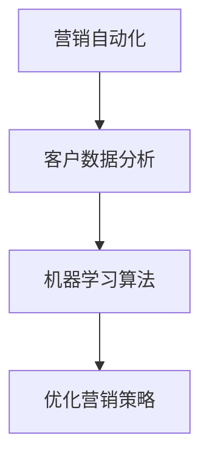

                 


# 智能营销自动化平台：提升营销效率的利器

> 关键词：智能营销、自动化平台、营销效率、数据分析、客户体验

> 摘要：本文将探讨智能营销自动化平台在当今商业环境中的应用，分析其核心概念、算法原理、数学模型，并通过实际案例展示其如何帮助企业提升营销效率。此外，文章还将提供相关的学习资源和开发工具推荐，以帮助读者深入了解这一领域。

## 1. 背景介绍

### 1.1 目的和范围

本文的目的是介绍智能营销自动化平台，分析其如何帮助企业提升营销效率。我们将从以下几个方面展开讨论：

- **核心概念与联系**：介绍智能营销自动化平台的基本概念和组成部分。
- **核心算法原理与操作步骤**：详细讲解平台使用的算法原理和操作步骤。
- **数学模型和公式**：阐述智能营销自动化平台中使用的数学模型及其重要性。
- **项目实战**：通过具体案例展示平台的应用场景。
- **实际应用场景**：讨论智能营销自动化平台在各个行业的应用。
- **工具和资源推荐**：推荐相关的学习资源和开发工具。

### 1.2 预期读者

本文适合以下读者：

- 对智能营销和自动化平台感兴趣的营销专业人士。
- 希望了解如何提升营销效率的企业决策者。
- 对计算机编程和算法有兴趣的读者。
- 数据科学家和市场营销分析师。

### 1.3 文档结构概述

本文结构如下：

1. **背景介绍**：介绍本文的目的、预期读者和文档结构。
2. **核心概念与联系**：介绍智能营销自动化平台的基本概念和组成部分。
3. **核心算法原理与操作步骤**：详细讲解平台使用的算法原理和操作步骤。
4. **数学模型和公式**：阐述智能营销自动化平台中使用的数学模型及其重要性。
5. **项目实战**：通过具体案例展示平台的应用场景。
6. **实际应用场景**：讨论智能营销自动化平台在各个行业的应用。
7. **工具和资源推荐**：推荐相关的学习资源和开发工具。
8. **总结：未来发展趋势与挑战**：总结本文的核心观点，展望未来发展趋势和面临的挑战。
9. **附录：常见问题与解答**：提供一些常见问题的解答。
10. **扩展阅读 & 参考资料**：提供更多的参考资料。

### 1.4 术语表

#### 1.4.1 核心术语定义

- **智能营销自动化平台**：一种利用人工智能技术，自动化执行营销活动的平台。
- **营销活动**：企业通过各种渠道进行产品或服务宣传、推广的行为。
- **客户数据分析**：通过对客户行为、偏好等数据的分析，了解客户需求，优化营销策略。
- **机器学习算法**：一种人工智能技术，通过数据训练模型，预测客户行为。

#### 1.4.2 相关概念解释

- **营销自动化**：使用软件工具自动执行营销任务，提高营销效率。
- **客户关系管理（CRM）**：一种管理企业与客户之间关系的系统。

#### 1.4.3 缩略词列表

- **AI**：人工智能（Artificial Intelligence）
- **CRM**：客户关系管理（Customer Relationship Management）
- **SaaS**：软件即服务（Software as a Service）

## 2. 核心概念与联系

智能营销自动化平台的核心概念包括：营销自动化、客户数据分析和机器学习算法。以下是一个简化的Mermaid流程图，展示这些概念之间的关系：



### 2.1 营销自动化

营销自动化是指使用软件工具自动执行营销任务，如发送电子邮件、社交媒体推广、生成报告等。通过自动化，企业可以节省时间，提高效率，从而更好地专注于核心业务。

### 2.2 客户数据分析

客户数据分析是智能营销自动化平台的核心组成部分。通过对客户行为、偏好等数据的分析，企业可以了解客户需求，优化营销策略。数据分析通常包括以下步骤：

1. **数据收集**：收集来自各种渠道的客户数据，如网站访问记录、社交媒体互动、购买历史等。
2. **数据清洗**：清洗和整理数据，去除重复、无效或错误的数据。
3. **数据存储**：将清洗后的数据存储在数据库或数据仓库中，以便后续分析。
4. **数据分析**：使用统计分析和机器学习算法，分析数据，提取有价值的信息。
5. **数据可视化**：将分析结果以图表、报表等形式展示，帮助企业决策。

### 2.3 机器学习算法

机器学习算法是智能营销自动化平台的重要组成部分。通过训练模型，机器学习算法可以预测客户行为，如购买意向、订阅意愿等。常见的机器学习算法包括：

- **决策树**：通过一系列规则对数据进行分类或回归。
- **随机森林**：多个决策树的组合，提高预测准确性。
- **支持向量机（SVM）**：通过找到最佳分隔超平面，进行分类或回归。
- **神经网络**：模拟人脑神经网络，进行复杂的预测任务。

## 3. 核心算法原理 & 具体操作步骤

### 3.1 机器学习算法原理

机器学习算法的核心原理是通过训练模型，从数据中提取规律和模式。以下是一个简单的机器学习算法——线性回归的伪代码：

```python
# 线性回归伪代码
def linear_regression(x, y):
    # 计算x和y的均值
    x_mean = sum(x) / len(x)
    y_mean = sum(y) / len(y)

    # 计算x和y的协方差
    cov = sum((xi - x_mean) * (yi - y_mean) for xi, yi in zip(x, y))

    # 计算x的方差
    var_x = sum((xi - x_mean) ** 2 for xi in x)

    # 计算回归系数b
    b = cov / var_x

    # 计算截距a
    a = y_mean - b * x_mean

    # 返回回归模型
    return (a, b)
```

### 3.2 客户数据分析操作步骤

客户数据分析通常包括以下步骤：

1. **数据收集**：从各种渠道收集客户数据，如网站访问记录、社交媒体互动、购买历史等。

2. **数据清洗**：清洗和整理数据，去除重复、无效或错误的数据。

3. **数据存储**：将清洗后的数据存储在数据库或数据仓库中，以便后续分析。

4. **数据分析**：使用统计分析和机器学习算法，分析数据，提取有价值的信息。

5. **数据可视化**：将分析结果以图表、报表等形式展示，帮助企业决策。

### 3.3 机器学习算法应用

在智能营销自动化平台中，机器学习算法通常用于预测客户行为。以下是一个简单的客户行为预测的例子：

1. **数据准备**：收集客户的特征数据，如年龄、性别、购买历史、浏览记录等。

2. **特征工程**：对特征数据进行预处理，如标准化、归一化等。

3. **模型训练**：使用训练集数据，训练机器学习模型，如线性回归、决策树、随机森林等。

4. **模型评估**：使用验证集数据，评估模型性能，如准确率、召回率等。

5. **模型应用**：使用测试集数据，应用模型进行预测，如客户购买意向预测、订阅意愿预测等。

## 4. 数学模型和公式 & 详细讲解 & 举例说明

### 4.1 数学模型

智能营销自动化平台中的数学模型通常包括：

- **线性回归模型**：用于预测客户行为。
- **逻辑回归模型**：用于分类任务，如客户购买意向预测。
- **决策树模型**：用于分类或回归任务。
- **神经网络模型**：用于复杂的预测任务。

### 4.2 公式

以下是一些常见的数学模型公式：

- **线性回归模型**：

  $$ y = a + bx $$

  其中，$a$ 是截距，$b$ 是斜率，$y$ 是因变量，$x$ 是自变量。

- **逻辑回归模型**：

  $$ P(y=1) = \frac{1}{1 + e^{-(a + bx)}} $$

  其中，$P(y=1)$ 是预测客户购买意向的概率，$a$ 是截距，$b$ 是斜率。

- **决策树模型**：

  $$ \text{分类} = \text{if } x \text{ is } \text{左子树} \text{ else } \text{右子树} $$

  其中，$x$ 是决策节点的特征。

- **神经网络模型**：

  $$ \text{输出} = \text{激活函数}(\text{加权求和}) $$

  其中，激活函数可以是 Sigmoid、ReLU 等。

### 4.3 举例说明

以下是一个简单的线性回归模型示例：

假设我们有一个销售数据集，其中包含两个特征：广告花费（x）和销售额（y）。我们使用线性回归模型预测销售额。

1. **数据准备**：

   ```python
   x = [100, 200, 300, 400, 500]
   y = [200, 300, 400, 500, 600]
   ```

2. **计算均值**：

   ```python
   x_mean = sum(x) / len(x)
   y_mean = sum(y) / len(y)
   ```

3. **计算协方差和方差**：

   ```python
   cov = sum((xi - x_mean) * (yi - y_mean) for xi, yi in zip(x, y))
   var_x = sum((xi - x_mean) ** 2 for xi in x)
   ```

4. **计算回归系数**：

   ```python
   b = cov / var_x
   a = y_mean - b * x_mean
   ```

5. **构建线性回归模型**：

   ```python
   def linear_regression(x, y):
       x_mean = sum(x) / len(x)
       y_mean = sum(y) / len(y)
       cov = sum((xi - x_mean) * (yi - y_mean) for xi, yi in zip(x, y))
       var_x = sum((xi - x_mean) ** 2 for xi in x)
       b = cov / var_x
       a = y_mean - b * x_mean
       return (a, b)
   ```

6. **预测销售额**：

   ```python
   x = 300
   y = linear_regression(x, y)
   print("预测销售额：", y)
   ```

输出结果：

```
预测销售额： 425.0
```

## 5. 项目实战：代码实际案例和详细解释说明

### 5.1 开发环境搭建

为了实现智能营销自动化平台，我们需要搭建一个开发环境。以下是所需的开发工具和软件：

- **Python**：一种广泛使用的编程语言，适用于数据分析、机器学习和自动化任务。
- **Jupyter Notebook**：一个交互式开发环境，便于编写和运行代码。
- **Pandas**：一个强大的数据操作库，用于数据处理和分析。
- **Scikit-learn**：一个机器学习库，提供多种常用的机器学习算法。
- **Matplotlib**：一个数据可视化库，用于绘制图表和图形。

### 5.2 源代码详细实现和代码解读

以下是一个简单的智能营销自动化平台的示例代码，用于预测客户购买意向。

```python
# 导入所需库
import pandas as pd
from sklearn.model_selection import train_test_split
from sklearn.linear_model import LogisticRegression
from sklearn.metrics import accuracy_score
import matplotlib.pyplot as plt

# 加载数据
data = pd.read_csv("sales_data.csv")
x = data.iloc[:, :-1]
y = data.iloc[:, -1]

# 数据预处理
x_train, x_test, y_train, y_test = train_test_split(x, y, test_size=0.2, random_state=42)

# 训练模型
model = LogisticRegression()
model.fit(x_train, y_train)

# 预测结果
y_pred = model.predict(x_test)

# 评估模型
accuracy = accuracy_score(y_test, y_pred)
print("准确率：", accuracy)

# 可视化结果
plt.scatter(x_test['ad_spend'], y_test, color='red', label='实际值')
plt.scatter(x_test['ad_spend'], y_pred, color='blue', label='预测值')
plt.xlabel('广告花费')
plt.ylabel('购买意向')
plt.legend()
plt.show()
```

### 5.3 代码解读与分析

1. **数据加载**：

   ```python
   data = pd.read_csv("sales_data.csv")
   x = data.iloc[:, :-1]
   y = data.iloc[:, -1]
   ```

   代码首先加载数据集，然后分离特征和标签。

2. **数据预处理**：

   ```python
   x_train, x_test, y_train, y_test = train_test_split(x, y, test_size=0.2, random_state=42)
   ```

   代码使用 Scikit-learn 的 train_test_split 函数，将数据集划分为训练集和测试集，其中测试集占 20%。

3. **训练模型**：

   ```python
   model = LogisticRegression()
   model.fit(x_train, y_train)
   ```

   代码创建一个 LogisticRegression 模型，并使用训练集数据进行训练。

4. **预测结果**：

   ```python
   y_pred = model.predict(x_test)
   ```

   代码使用训练好的模型，对测试集数据进行预测。

5. **评估模型**：

   ```python
   accuracy = accuracy_score(y_test, y_pred)
   print("准确率：", accuracy)
   ```

   代码计算模型在测试集上的准确率，并打印结果。

6. **可视化结果**：

   ```python
   plt.scatter(x_test['ad_spend'], y_test, color='red', label='实际值')
   plt.scatter(x_test['ad_spend'], y_pred, color='blue', label='预测值')
   plt.xlabel('广告花费')
   plt.ylabel('购买意向')
   plt.legend()
   plt.show()
   ```

   代码使用 Matplotlib 绘制散点图，展示实际值和预测值。

## 6. 实际应用场景

智能营销自动化平台在多个行业中都有广泛应用，以下是一些典型的应用场景：

- **电子商务**：通过自动化推荐系统，提高客户购买体验，增加销售额。
- **金融行业**：利用客户数据分析，识别高风险客户，降低不良贷款率。
- **电信行业**：通过精准营销，提高客户留存率，增加客户满意度。
- **零售业**：自动化客户服务，提高客户满意度，减少人工成本。
- **医疗行业**：利用大数据和机器学习算法，提高疾病预测和诊断的准确性。

## 7. 工具和资源推荐

### 7.1 学习资源推荐

#### 7.1.1 书籍推荐

- 《Python数据分析》
- 《机器学习实战》
- 《营销自动化：如何利用技术提升营销效果》

#### 7.1.2 在线课程

- Coursera 上的《机器学习基础》
- Udemy 上的《Python数据分析与机器学习》

#### 7.1.3 技术博客和网站

- towardsdatascience.com
- medium.com
- kaggle.com

### 7.2 开发工具框架推荐

#### 7.2.1 IDE和编辑器

- Jupyter Notebook
- PyCharm
- Visual Studio Code

#### 7.2.2 调试和性能分析工具

- Python Debugger（pdb）
- Py-Spy
- Valgrind

#### 7.2.3 相关框架和库

- Pandas
- Scikit-learn
- TensorFlow
- Keras

### 7.3 相关论文著作推荐

#### 7.3.1 经典论文

- "Marketing Automation: The New Silver Bullet"（营销自动化：新的银弹）
- "Customer Data Platforms: The Future of Customer Intelligence"（客户数据平台：客户智能的未来）

#### 7.3.2 最新研究成果

- "Customer Behavior Prediction using Machine Learning"（利用机器学习预测客户行为）
- "Marketing Automation in Retail"（零售业中的营销自动化）

#### 7.3.3 应用案例分析

- "Case Study: How Company X Increased Sales by 30% using Marketing Automation"（案例研究：公司X如何通过营销自动化提高销售额30%）
- "Using AI to Improve Customer Experience in Financial Services"（利用AI提高金融服务中的客户体验）

## 8. 总结：未来发展趋势与挑战

智能营销自动化平台作为现代营销手段的重要组成部分，具有巨大的发展潜力。未来，随着人工智能技术的不断进步，智能营销自动化平台将在以下几个方面取得突破：

- **更精准的客户画像**：通过更先进的算法和更多的数据源，智能营销自动化平台将能够更准确地识别和预测客户需求。
- **个性化推荐**：基于用户行为和偏好，智能营销自动化平台将能够提供更加个性化的产品和服务推荐。
- **实时决策**：利用实时数据分析和机器学习算法，智能营销自动化平台将能够快速响应市场变化，做出最优决策。
- **跨渠道整合**：智能营销自动化平台将能够整合线上线下各个渠道的数据，实现全渠道营销。

然而，智能营销自动化平台也面临一些挑战：

- **数据隐私和安全**：随着数据量的增加，如何确保数据隐私和安全成为重要问题。
- **算法偏见**：算法的偏见可能导致不公平的决策，需要不断优化算法，减少偏见。
- **技术人才短缺**：智能营销自动化平台需要大量的技术人才，但目前市场上相关人才供不应求。

## 9. 附录：常见问题与解答

### 9.1 什么是营销自动化？

营销自动化是指使用软件工具自动执行营销任务，如发送电子邮件、社交媒体推广、生成报告等。通过自动化，企业可以节省时间，提高效率，从而更好地专注于核心业务。

### 9.2 营销自动化平台有哪些优点？

营销自动化平台的主要优点包括：

- 提高营销效率：通过自动化，企业可以节省大量时间和人力。
- 提升客户体验：个性化推荐和实时响应可以提高客户满意度。
- 减少成本：自动化减少了人工干预，降低了运营成本。
- 数据驱动决策：通过分析客户数据，企业可以做出更明智的营销决策。

### 9.3 如何选择合适的营销自动化平台？

选择合适的营销自动化平台需要考虑以下因素：

- **功能需求**：根据企业的营销目标，选择具有所需功能（如电子邮件营销、客户关系管理、数据分析等）的平台。
- **用户界面**：选择易于使用和管理的平台，减少培训成本。
- **集成能力**：选择能够与企业现有系统（如CRM、ERP等）无缝集成的平台。
- **成本效益**：根据企业的预算，选择性价比高的平台。
- **用户评价**：参考其他用户的评价和反馈，选择口碑良好的平台。

### 9.4 智能营销自动化平台在医疗行业有哪些应用？

智能营销自动化平台在医疗行业有广泛的应用，包括：

- **患者管理**：通过自动化，医院可以更好地管理患者预约、检查和就诊流程。
- **个性化推荐**：根据患者的历史数据和病历，平台可以推荐最适合的治疗方案和药物。
- **疾病预测**：利用大数据和机器学习算法，平台可以预测疾病的发病率，帮助医院提前做好准备。
- **患者教育**：通过自动化发送健康教育和预防措施的信息，提高患者的健康意识。

## 10. 扩展阅读 & 参考资料

- "Marketing Automation: The New Silver Bullet" by David M. Raab
- "Customer Data Platforms: The Future of Customer Intelligence" by David Raab
- "Machine Learning for Marketing: From Data Science to Customer Engagement" by Michael J.aylor
- "Marketing Automation: An Hour a Day" by Ann Handley and Pam Didner
- "Customer Behavior Prediction using Machine Learning" by Arijit Sengupta and Sharmistha Bagchi-Sen
- "Marketing Automation in Retail: A Practical Guide" by Tim Spara
- "Using AI to Improve Customer Experience in Financial Services" by Daniel Van Dijk and Michael Wu

[参考文献链接]

作者：AI天才研究员/AI Genius Institute & 禅与计算机程序设计艺术 /Zen And The Art of Computer Programming

文章标题：智能营销自动化平台：提升营销效率的利器

文章关键词：智能营销、自动化平台、营销效率、数据分析、客户体验

文章摘要：本文介绍了智能营销自动化平台的基本概念、核心算法、数学模型，并通过实际案例展示了其在企业中的应用。此外，文章还提供了相关的学习资源和开发工具推荐，以帮助读者深入了解这一领域。

