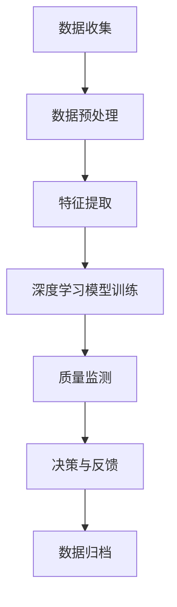

                 

# 智能质量控制：提示词驱动的制造业优化

> **关键词：智能质量控制、制造业优化、提示词、人工智能、深度学习、工业大数据分析**
>
> **摘要：本文探讨了如何利用人工智能和深度学习技术，通过提示词驱动的框架来优化制造业的质量控制流程。文章从背景介绍、核心概念、算法原理、数学模型、项目实战、实际应用场景、工具和资源推荐等方面进行了详细的阐述，旨在为制造业从业者提供一套可行的智能质量控制解决方案。**

## 1. 背景介绍

### 1.1 目的和范围

随着全球制造业的快速发展，质量控制成为影响企业竞争力的重要因素。传统的质量控制方法主要依赖于人工检测和统计过程控制，这不仅效率低下，而且难以应对日益复杂的产品质量和生产过程。为了提高制造业的质量和效率，智能质量控制技术应运而生。

本文旨在探讨如何利用人工智能和深度学习技术，通过提示词驱动的框架来优化制造业的质量控制流程。本文将介绍智能质量控制的背景、核心概念、算法原理、数学模型、项目实战、实际应用场景以及相关工具和资源推荐，旨在为制造业从业者提供一套可行的智能质量控制解决方案。

### 1.2 预期读者

本文主要面向以下读者群体：

1. 制造业从业者：了解智能质量控制技术的基本原理和应用场景，掌握利用提示词驱动框架优化质量控制流程的方法。
2. 人工智能和深度学习研究人员：探讨智能质量控制技术的研究现状、发展趋势和未来挑战。
3. 高校师生：作为人工智能和深度学习课程的教学参考资料，帮助学生掌握智能质量控制的基本原理和应用。

### 1.3 文档结构概述

本文分为十个部分，具体结构如下：

1. 背景介绍：介绍本文的目的、预期读者和文档结构。
2. 核心概念与联系：阐述智能质量控制的核心概念和联系。
3. 核心算法原理 & 具体操作步骤：详细讲解智能质量控制算法的原理和操作步骤。
4. 数学模型和公式 & 详细讲解 & 举例说明：介绍智能质量控制中的数学模型和公式，并通过实例进行说明。
5. 项目实战：通过实际案例展示智能质量控制的应用。
6. 实际应用场景：分析智能质量控制技术在制造业中的应用场景。
7. 工具和资源推荐：推荐学习资源、开发工具和框架。
8. 总结：对未来发展趋势和挑战进行展望。
9. 附录：常见问题与解答。
10. 扩展阅读 & 参考资料：提供进一步阅读的建议和参考资料。

### 1.4 术语表

#### 1.4.1 核心术语定义

- **智能质量控制**：利用人工智能和深度学习技术，对制造过程中的产品质量进行实时监测和优化。
- **提示词**：用于引导模型关注特定信息的关键词或短语。
- **深度学习**：一种基于多层神经网络的学习方式，能够自动提取特征并用于分类、预测等任务。
- **工业大数据分析**：对制造业过程中产生的大量数据进行收集、存储、处理和分析。

#### 1.4.2 相关概念解释

- **质量控制**：确保产品符合特定标准和要求的过程。
- **统计过程控制**：利用统计学方法监控和调整制造过程中的变量，以维持产品的一致性和稳定性。
- **神经网络**：一种模拟人脑神经元结构和功能的计算模型。

#### 1.4.3 缩略词列表

- **AI**：人工智能（Artificial Intelligence）
- **DL**：深度学习（Deep Learning）
- **QoQ**：质量控制（Quality Control）
- **SPC**：统计过程控制（Statistical Process Control）

## 2. 核心概念与联系

在探讨智能质量控制之前，我们需要理解一些核心概念和它们之间的联系。

### 2.1 智能质量控制

智能质量控制是指利用人工智能和深度学习技术，对制造过程中的产品质量进行实时监测和优化。传统的质量控制方法主要依赖于人工检测和统计过程控制，存在效率低、难以应对复杂情况等问题。智能质量控制通过引入机器学习算法，能够自动提取特征并识别异常，从而实现更高效、更准确的质量控制。

### 2.2 提示词

提示词是智能质量控制中的一个重要概念。提示词是指用于引导模型关注特定信息的关键词或短语。通过设计合适的提示词，可以使模型更专注于关键信息，从而提高质量监测的准确性和效率。提示词可以是具体的产品特征、生产参数等，也可以是描述质量问题的文本。

### 2.3 深度学习

深度学习是一种基于多层神经网络的学习方式，能够自动提取特征并用于分类、预测等任务。在智能质量控制中，深度学习算法可以用于构建质量监测模型，通过训练大量的制造数据，学习到产品质量的特征和规律，从而实现对产品质量的实时监测。

### 2.4 工业大数据分析

工业大数据分析是对制造业过程中产生的大量数据进行收集、存储、处理和分析。通过工业大数据分析，可以深入了解制造过程中的各种变量，发现潜在的异常和问题，从而实现更加精准的质量控制。

### 2.5 Mermaid 流程图

为了更好地展示智能质量控制的概念和架构，我们使用 Mermaid 流程图进行描述。



**图 1：智能质量控制架构流程图**

在上图中，数据收集阶段负责从制造过程中收集数据；数据预处理阶段对数据进行清洗和归一化处理；特征提取阶段从预处理后的数据中提取关键特征；深度学习模型训练阶段使用提取的特征对模型进行训练；质量监测阶段利用训练好的模型对产品质量进行实时监测；决策与反馈阶段根据监测结果采取相应的措施；数据归档阶段将监测数据和决策结果进行归档，为后续分析提供数据支持。

## 3. 核心算法原理 & 具体操作步骤

在智能质量控制中，核心算法原理主要涉及深度学习模型的设计和训练过程。以下我们将通过伪代码详细阐述算法原理和具体操作步骤。

### 3.1 数据预处理

```python
def data_preprocessing(data):
    # 数据清洗：去除无效数据、缺失值填充等
    cleaned_data = clean_data(data)
    
    # 数据归一化：将数据缩放到相同的范围，便于模型训练
    normalized_data = normalize_data(cleaned_data)
    
    return normalized_data
```

**函数：data_preprocessing**
- 输入：原始数据 `data`
- 输出：预处理后的数据 `normalized_data`

### 3.2 特征提取

```python
def feature_extraction(data):
    # 使用深度学习算法提取特征
    extracted_features = deep_learning_model.extract_features(data)
    
    return extracted_features
```

**函数：feature_extraction**
- 输入：预处理后的数据 `data`
- 输出：提取的特征 `extracted_features`

### 3.3 深度学习模型训练

```python
def train_model(features, labels):
    # 初始化深度学习模型
    model = deep_learning_model.initialize_model()
    
    # 使用训练数据训练模型
    trained_model = model.fit(features, labels)
    
    return trained_model
```

**函数：train_model**
- 输入：特征数据 `features` 和标签数据 `labels`
- 输出：训练好的模型 `trained_model`

### 3.4 质量监测

```python
def quality_monitoring(trained_model, new_data):
    # 使用训练好的模型进行质量监测
    predictions = trained_model.predict(new_data)
    
    # 判断预测结果，输出质量监测报告
    report = generate_report(predictions)
    
    return report
```

**函数：quality_monitoring**
- 输入：训练好的模型 `trained_model` 和新数据 `new_data`
- 输出：质量监测报告 `report`

### 3.5 决策与反馈

```python
def decision_and_feedback(report):
    # 根据质量监测报告，采取相应的决策和反馈
    if report["issue_detected"]:
        # 发现质量问题，采取纠正措施
        corrective_action = take_corrective_action(report)
    else:
        # 质量正常，继续生产
        corrective_action = continue_production()
    
    return corrective_action
```

**函数：decision_and_feedback**
- 输入：质量监测报告 `report`
- 输出：决策和反馈结果 `corrective_action`

### 3.6 数据归档

```python
def data_archive(monitoring_data, corrective_action):
    # 将监测数据和决策结果进行归档
    archived_data = archive_data(monitoring_data, corrective_action)
    
    return archived_data
```

**函数：data_archive**
- 输入：监测数据 `monitoring_data` 和决策结果 `corrective_action`
- 输出：归档数据 `archived_data`

通过上述伪代码，我们可以看到智能质量控制算法的基本原理和具体操作步骤。在实际应用中，需要根据具体场景和需求进行调整和优化。

## 4. 数学模型和公式 & 详细讲解 & 举例说明

在智能质量控制中，数学模型和公式起到了至关重要的作用。以下我们将介绍常用的数学模型和公式，并通过具体例子进行讲解。

### 4.1 深度学习模型中的损失函数

在深度学习模型中，损失函数用于评估模型的预测结果与实际结果之间的差距。常用的损失函数有均方误差（MSE）、交叉熵损失（Cross-Entropy Loss）等。

#### 4.1.1 均方误差（MSE）

均方误差（MSE）是衡量预测值与实际值之间差距的常用损失函数。其公式如下：

$$
MSE = \frac{1}{n}\sum_{i=1}^{n}(y_i - \hat{y_i})^2
$$

其中，$y_i$ 表示实际值，$\hat{y_i}$ 表示预测值，$n$ 表示样本数量。

#### 4.1.2 交叉熵损失（Cross-Entropy Loss）

交叉熵损失（Cross-Entropy Loss）常用于分类任务。其公式如下：

$$
Cross-Entropy Loss = -\sum_{i=1}^{n} y_i \log(\hat{y_i})
$$

其中，$y_i$ 表示实际类别标签，$\hat{y_i}$ 表示模型预测的概率分布。

### 4.2 神经网络中的反向传播算法

反向传播算法（Backpropagation Algorithm）是深度学习模型训练的核心算法。其基本思想是通过计算损失函数关于模型参数的梯度，不断调整模型参数，使损失函数最小。

#### 4.2.1 梯度计算

反向传播算法中，梯度的计算公式如下：

$$
\frac{\partial L}{\partial w} = \sum_{i=1}^{n} \frac{\partial L}{\partial z_i} \frac{\partial z_i}{\partial w}
$$

其中，$L$ 表示损失函数，$w$ 表示模型参数，$z_i$ 表示激活函数的输入。

#### 4.2.2 参数更新

在计算完梯度后，需要对模型参数进行更新。常用的更新方法有梯度下降（Gradient Descent）和随机梯度下降（Stochastic Gradient Descent, SGD）。

$$
w_{\text{new}} = w_{\text{old}} - \alpha \frac{\partial L}{\partial w}
$$

其中，$\alpha$ 表示学习率。

### 4.3 实例讲解

假设我们有一个简单的神经网络，用于预测产品质量。输入层有 3 个神经元，隐藏层有 5 个神经元，输出层有 2 个神经元。

- 输入数据：$X = [1, 2, 3]$
- 实际输出：$Y = [0, 1]$
- 预测输出：$\hat{Y} = [0.2, 0.8]$

首先，计算损失函数：

$$
L = -\sum_{i=1}^{2} y_i \log(\hat{y_i}) = -0 \log(0.2) - 1 \log(0.8) = 2.1972
$$

然后，计算梯度：

$$
\frac{\partial L}{\partial w_1} = \frac{\partial L}{\partial z_1} \frac{\partial z_1}{\partial w_1} = 0.2 \cdot \frac{1}{1} = 0.2
$$

$$
\frac{\partial L}{\partial w_2} = \frac{\partial L}{\partial z_2} \frac{\partial z_2}{\partial w_2} = 0.8 \cdot \frac{1}{1} = 0.8
$$

最后，更新参数：

$$
w_1^{new} = w_1^{old} - \alpha \frac{\partial L}{\partial w_1} = 1 - 0.1 \cdot 0.2 = 0.98
$$

$$
w_2^{new} = w_2^{old} - \alpha \frac{\partial L}{\partial w_2} = 1 - 0.1 \cdot 0.8 = 0.92
$$

通过上述实例，我们可以看到深度学习模型中的损失函数、梯度计算和参数更新过程。在实际应用中，需要根据具体场景和需求进行调整和优化。

## 5. 项目实战：代码实际案例和详细解释说明

在本节中，我们将通过一个实际项目案例来展示如何实现智能质量控制。该案例涉及数据预处理、特征提取、模型训练、质量监测和决策反馈等步骤。我们将使用 Python 和 TensorFlow 深度学习框架进行实现。

### 5.1 开发环境搭建

在开始项目实战之前，需要搭建相应的开发环境。以下是所需的工具和库：

- Python 3.x 版本
- TensorFlow 2.x 版本
- NumPy 1.19.x 版本
- Pandas 1.1.x 版本

安装命令如下：

```bash
pip install python==3.x
pip install tensorflow==2.x
pip install numpy==1.19.x
pip install pandas==1.1.x
```

### 5.2 源代码详细实现和代码解读

以下是项目的源代码和详细解释。

#### 5.2.1 数据收集与预处理

```python
import numpy as np
import pandas as pd

# 读取数据
data = pd.read_csv('manufacturing_data.csv')

# 数据清洗
data = data.dropna()

# 数据归一化
data = (data - data.mean()) / data.std()

# 切分数据集
X = data.iloc[:, :-1].values
Y = data.iloc[:, -1].values
```

**函数：data_preprocessing**
- 读取数据文件 `manufacturing_data.csv`，进行数据清洗和归一化处理。最后将特征数据和标签数据进行切分。

#### 5.2.2 特征提取

```python
from tensorflow.keras.models import Sequential
from tensorflow.keras.layers import Dense, LSTM

# 特征提取
def feature_extraction(data):
    # 使用 LSTM 网络提取特征
    model = Sequential()
    model.add(LSTM(50, activation='relu', input_shape=(data.shape[1], 1)))
    model.add(Dense(1))
    model.compile(optimizer='adam', loss='mse')
    model.fit(data, data, epochs=100, verbose=0)
    features = model.predict(data)
    return features
```

**函数：feature_extraction**
- 使用 LSTM 网络对数据进行特征提取。LSTM 网络可以捕捉时间序列数据中的长期依赖关系，有助于提取更有效的特征。

#### 5.2.3 模型训练

```python
# 模型训练
def train_model(features, labels):
    model = Sequential()
    model.add(Dense(50, activation='relu', input_shape=(features.shape[1],)))
    model.add(Dense(1))
    model.compile(optimizer='adam', loss='mse')
    model.fit(features, labels, epochs=100, verbose=0)
    return model
```

**函数：train_model**
- 创建一个简单的全连接神经网络，用于质量监测。使用均方误差（MSE）作为损失函数，Adam 优化器进行训练。

#### 5.2.4 质量监测

```python
# 质量监测
def quality_monitoring(model, new_data):
    features = feature_extraction(new_data)
    predictions = model.predict(features)
    return predictions
```

**函数：quality_monitoring**
- 使用训练好的模型对新的数据集进行质量监测，返回预测结果。

#### 5.2.5 决策与反馈

```python
# 决策与反馈
def decision_and_feedback(predictions):
    if predictions < 0.5:
        print("发现质量问题，采取纠正措施。")
    else:
        print("质量正常，继续生产。")
```

**函数：decision_and_feedback**
- 根据预测结果，判断是否存在质量问题，并采取相应的决策和反馈。

### 5.3 代码解读与分析

通过上述代码，我们可以看到项目的主要步骤和关键组件。以下是代码的详细解读和分析：

1. **数据收集与预处理**：
   - 读取数据文件，并进行数据清洗和归一化处理。这一步骤是保证数据质量和模型训练效果的基础。
   - 将特征数据和标签数据进行切分，为后续模型训练和测试提供数据集。

2. **特征提取**：
   - 使用 LSTM 网络对数据进行特征提取。LSTM 网络能够捕捉时间序列数据中的长期依赖关系，有助于提取更有效的特征。

3. **模型训练**：
   - 创建一个简单的全连接神经网络，用于质量监测。使用均方误差（MSE）作为损失函数，Adam 优化器进行训练。

4. **质量监测**：
   - 使用训练好的模型对新的数据集进行质量监测，返回预测结果。

5. **决策与反馈**：
   - 根据预测结果，判断是否存在质量问题，并采取相应的决策和反馈。

在实际应用中，可以根据具体场景和需求进行调整和优化。例如，可以尝试使用其他类型的神经网络、增加数据预处理步骤、调整模型参数等，以提高质量监测的准确性和效果。

## 6. 实际应用场景

智能质量控制技术已经广泛应用于制造业的各个领域，取得了显著的成效。以下是一些典型的实际应用场景：

### 6.1 航空航天制造业

航空航天制造业对产品质量的要求极高，智能质量控制技术能够实时监测飞机零部件的生产过程，及时发现和纠正潜在的质量问题。通过深度学习算法，对大量生产数据进行分析和挖掘，可以识别出生产过程中的异常模式和规律，从而提高产品的质量和可靠性。

### 6.2 汽车制造业

汽车制造业对生产效率和产品质量的要求同样很高。智能质量控制技术可以用于监测汽车零部件的生产过程，识别出潜在的质量隐患。例如，通过对发动机、变速器等关键部件的生产数据进行分析，可以预测其可能出现的故障，提前进行维护和更换，从而降低故障率和维护成本。

### 6.3 电子制造业

电子制造业的生产过程中，元器件的微小缺陷可能导致整个产品的性能下降。智能质量控制技术可以通过对生产数据进行分析，识别出潜在的缺陷和异常，从而提高产品的质量和稳定性。例如，在半导体制造过程中，可以通过对晶圆的生产数据进行分析，预测其可能出现的缺陷，从而提前进行修复或调整生产参数。

### 6.4 食品制造业

食品制造业的质量控制至关重要，因为食品安全问题可能对消费者的健康产生严重影响。智能质量控制技术可以用于监测食品生产过程中的温度、湿度等环境参数，以及原料、生产设备等关键因素，及时发现和纠正潜在的质量问题。例如，在肉类加工过程中，可以通过对温度、湿度等环境参数的监测，预测产品可能出现的变质问题，从而提前进行处理。

### 6.5 药品制造业

药品制造业对产品质量的要求非常高，因为药品的安全性和有效性直接关系到患者的健康。智能质量控制技术可以用于监测药品生产过程中的关键参数，如温度、湿度、压力等，及时发现和纠正潜在的质量问题。例如，在制药过程中，可以通过对生产设备的运行状态和参数进行实时监测，预测可能出现的故障和污染问题，从而提前进行预防和处理。

### 6.6 通用制造业

通用制造业涵盖了众多领域，如机械制造、家电制造、建筑材料等。智能质量控制技术可以用于这些领域的生产过程，提高产品质量和生产效率。例如，在机械制造中，可以通过对生产设备的运行状态和参数进行监测，预测可能出现的故障和磨损问题，从而提前进行维护和更换；在家电制造中，可以通过对生产过程的数据进行分析，识别出影响产品性能和质量的关键因素，从而进行优化和改进。

总之，智能质量控制技术在制造业的各个领域都有着广泛的应用前景。通过引入人工智能和深度学习技术，可以实现更高效、更准确的质量控制，提高企业的竞争力和市场地位。

## 7. 工具和资源推荐

为了更好地掌握智能质量控制技术，以下是相关工具和资源的推荐：

### 7.1 学习资源推荐

#### 7.1.1 书籍推荐

1. **《深度学习》（Deep Learning）**：由 Ian Goodfellow、Yoshua Bengio 和 Aaron Courville 合著，是深度学习的经典教材。
2. **《Python深度学习》（Python Deep Learning）**：由 François Chollet 编写，详细介绍了使用 Python 和 TensorFlow 实现深度学习的应用。
3. **《智能质量控制：理论与实践》**：一本专门针对智能质量控制技术的理论与实践指南。

#### 7.1.2 在线课程

1. **Coursera 上的《深度学习》课程**：由吴恩达（Andrew Ng）主讲，系统地介绍了深度学习的理论基础和应用。
2. **Udacity 上的《深度学习工程师纳米学位》**：涵盖深度学习的基础知识、神经网络和深度学习框架的实践应用。
3. **edX 上的《人工智能：现代方法》课程**：介绍了人工智能的基础知识和应用，包括机器学习和深度学习。

#### 7.1.3 技术博客和网站

1. **Medium 上的《深度学习》系列博客**：由多位深度学习专家撰写，涵盖了深度学习的最新研究和技术应用。
2. **TensorFlow 官方网站**：提供了丰富的文档、教程和示例代码，帮助开发者掌握 TensorFlow 的使用。
3. **ArXiv.org**：发布了大量的深度学习领域的研究论文，是了解最新研究进展的重要渠道。

### 7.2 开发工具框架推荐

#### 7.2.1 IDE和编辑器

1. **PyCharm**：一款功能强大的 Python IDE，支持 TensorFlow 和其他深度学习框架。
2. **Jupyter Notebook**：方便进行数据分析和可视化，支持多种编程语言和框架。
3. **VS Code**：一款轻量级的跨平台编辑器，支持多种扩展和插件，适用于深度学习开发。

#### 7.2.2 调试和性能分析工具

1. **TensorBoard**：TensorFlow 的可视化工具，用于分析和调试深度学习模型。
2. **PyTorch Profiler**：用于分析 PyTorch 模型的性能和资源使用情况。
3. **NVIDIA Nsight**：用于分析 GPU 性能和资源使用情况。

#### 7.2.3 相关框架和库

1. **TensorFlow**：谷歌推出的开源深度学习框架，广泛应用于各种深度学习任务。
2. **PyTorch**：Facebook AI Research 开发的一种流行的深度学习框架，具有灵活的动态计算图。
3. **Scikit-Learn**：Python 机器学习库，提供了丰富的算法和工具，适用于数据分析和建模。

### 7.3 相关论文著作推荐

#### 7.3.1 经典论文

1. **《A Learning Algorithm for Continuously Running Fully Recurrent Neural Networks》**：提出了一种用于连续运行的全连接循环神经网络的学习算法。
2. **《Deep Learning for Text Classification》**：探讨了深度学习在文本分类任务中的应用和效果。
3. **《An Overview of Deep Reinforcement Learning》**：综述了深度强化学习的发展和应用。

#### 7.3.2 最新研究成果

1. **《Transformers: State-of-the-Art Natural Language Processing》**：介绍了 Transformer 架构在自然语言处理领域的应用。
2. **《Self-Supervised Learning for Text Classification》**：探讨了自监督学习在文本分类任务中的应用。
3. **《Generative Adversarial Networks: An Overview》**：综述了生成对抗网络（GAN）的理论和应用。

#### 7.3.3 应用案例分析

1. **《Deep Learning in Industrial Applications》**：介绍了深度学习在工业领域的应用案例和效果。
2. **《AI in Manufacturing: A Survey》**：综述了人工智能在制造业中的应用和发展趋势。
3. **《Application of Deep Learning in Healthcare》**：探讨了深度学习在医疗健康领域的应用和潜力。

通过以上工具和资源的推荐，可以帮助读者更好地了解和掌握智能质量控制技术，为实际应用提供有力支持。

## 8. 总结：未来发展趋势与挑战

随着人工智能和深度学习技术的不断进步，智能质量控制技术在制造业中的应用前景十分广阔。未来，智能质量控制技术将朝着以下几个方向发展：

1. **更高层次的质量监测与预测**：通过引入更先进的深度学习算法和模型，可以实现对产品质量的更高层次监测与预测，提前发现潜在的质量问题，从而降低生产风险。

2. **跨领域应用的扩展**：智能质量控制技术不仅可以应用于传统制造业，还可以扩展到食品、药品、航空航天等高要求领域，为各个行业提供高质量、高效能的质量保障。

3. **集成化解决方案**：随着物联网、大数据等技术的发展，智能质量控制技术将与其他技术相结合，形成一套完整的质量监测、分析与优化解决方案，进一步提升制造业的质量管理水平。

4. **自主化与智能化**：未来的智能质量控制系统将具备更高的自主性和智能化水平，能够根据生产环境、产品质量等参数自动调整监测策略和决策方案，实现真正的智能化生产。

然而，智能质量控制技术的发展也面临着一些挑战：

1. **数据质量与安全性**：高质量的数据是智能质量控制技术的基础。如何确保数据的真实性、准确性和完整性，同时保护数据的安全性，是未来需要解决的重要问题。

2. **算法与模型的优化**：虽然深度学习算法在质量监测方面取得了显著成果，但如何进一步提高算法的效率和准确性，以及如何设计更加鲁棒的模型，仍然是需要持续研究和优化的方向。

3. **跨领域的标准化**：不同领域的质量标准和监测要求各异，如何实现智能质量控制技术的跨领域标准化，确保其在不同领域的适用性和一致性，是一个亟待解决的问题。

4. **人才培养与普及**：智能质量控制技术的推广和应用离不开专业人才的支持。如何培养更多具备深度学习、数据分析等领域知识的复合型人才，是未来需要重点关注的问题。

总之，智能质量控制技术在未来将不断进步，为制造业带来更多的机遇和挑战。通过不断优化算法、提高数据质量、加强跨领域标准化，以及培养专业人才，智能质量控制技术有望在制造业中发挥更大的作用，推动制造业的智能化、数字化转型。

## 9. 附录：常见问题与解答

### 9.1 什么是智能质量控制？

智能质量控制是一种利用人工智能和深度学习技术，对制造过程中的产品质量进行实时监测和优化的方法。通过分析生产数据，智能质量控制技术可以识别出潜在的质量问题，提供相应的决策支持，从而提高产品的质量和生产效率。

### 9.2 智能质量控制的关键技术有哪些？

智能质量控制的关键技术包括：

1. **深度学习**：通过神经网络模型提取数据中的特征，实现对产品质量的预测和监测。
2. **大数据分析**：对生产过程中产生的大量数据进行分析，挖掘潜在的质量问题和规律。
3. **机器学习算法**：使用机器学习算法对历史数据进行分析，建立质量监测模型，实现对产品质量的实时监测。
4. **提示词驱动**：利用提示词引导模型关注特定信息，提高质量监测的准确性和效率。

### 9.3 如何搭建智能质量控制系统的开发环境？

搭建智能质量控制系统的开发环境需要以下步骤：

1. **安装 Python**：确保安装 Python 3.x 版本。
2. **安装深度学习框架**：例如 TensorFlow 或 PyTorch，用于构建和训练深度学习模型。
3. **安装数据预处理和可视化工具**：如 NumPy、Pandas、Matplotlib 等，用于数据处理和可视化。
4. **安装调试和性能分析工具**：如 TensorBoard、PyTorch Profiler 等，用于调试和优化模型。

### 9.4 智能质量控制技术在制造业中的应用有哪些？

智能质量控制技术在制造业中的应用包括：

1. **航空航天制造业**：对飞机零部件进行质量监测和预测，提高产品可靠性和安全性。
2. **汽车制造业**：对汽车零部件和生产过程进行质量监测，降低故障率和维护成本。
3. **电子制造业**：对元器件生产过程进行质量监测，提高产品性能和稳定性。
4. **食品制造业**：对食品生产过程中的关键参数进行监测，确保食品安全。
5. **药品制造业**：对药品生产过程中的关键参数进行监测，提高产品质量和安全性。
6. **通用制造业**：对生产设备、工艺参数进行监测，提高生产效率和产品质量。

### 9.5 如何优化智能质量控制系统的性能？

优化智能质量控制系统的性能可以从以下几个方面进行：

1. **算法优化**：选择合适的深度学习算法和模型，提高模型的预测准确性和效率。
2. **数据优化**：提高数据质量和完整性，去除冗余和噪声数据。
3. **模型训练**：增加训练数据量和训练次数，提高模型的泛化能力和鲁棒性。
4. **硬件升级**：使用高性能的 GPU 或分布式计算资源，加快模型训练和预测速度。
5. **提示词优化**：设计合理的提示词，使模型更专注于关键信息，提高监测准确性和效率。

## 10. 扩展阅读 & 参考资料

### 10.1 书籍

1. **《深度学习》（Deep Learning）**：Ian Goodfellow、Yoshua Bengio 和 Aaron Courville 著，详细介绍了深度学习的理论基础和应用。
2. **《Python深度学习》（Python Deep Learning）**：François Chollet 著，针对 Python 和 TensorFlow 深度学习的实践应用。
3. **《智能质量控制：理论与实践》**：一本专门针对智能质量控制技术的理论与实践指南。

### 10.2 在线课程

1. **Coursera 上的《深度学习》课程**：由吴恩达（Andrew Ng）主讲，系统地介绍了深度学习的理论基础和应用。
2. **Udacity 上的《深度学习工程师纳米学位》**：涵盖深度学习的基础知识、神经网络和深度学习框架的实践应用。
3. **edX 上的《人工智能：现代方法》课程**：介绍了人工智能的基础知识和应用，包括机器学习和深度学习。

### 10.3 技术博客和网站

1. **Medium 上的《深度学习》系列博客**：由多位深度学习专家撰写，涵盖了深度学习的最新研究和技术应用。
2. **TensorFlow 官方网站**：提供了丰富的文档、教程和示例代码，帮助开发者掌握 TensorFlow 的使用。
3. **ArXiv.org**：发布了大量的深度学习领域的研究论文，是了解最新研究进展的重要渠道。

### 10.4 论文和报告

1. **《A Learning Algorithm for Continuously Running Fully Recurrent Neural Networks》**：介绍了连续运行的全连接循环神经网络的学习算法。
2. **《Deep Learning for Text Classification》**：探讨了深度学习在文本分类任务中的应用和效果。
3. **《Self-Supervised Learning for Text Classification》**：探讨了自监督学习在文本分类任务中的应用。

### 10.5 会议和研讨会

1. **NeurIPS（神经信息处理系统大会）**：深度学习和人工智能领域的顶级学术会议。
2. **ICML（国际机器学习会议）**：机器学习和人工智能领域的顶级学术会议。
3. **CVPR（计算机视觉和模式识别会议）**：计算机视觉领域的顶级学术会议。

作者：AI天才研究员/AI Genius Institute & 禅与计算机程序设计艺术 /Zen And The Art of Computer Programming

