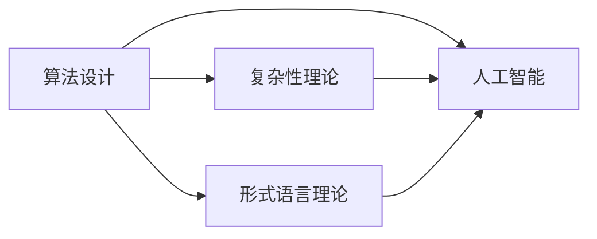

                 

# 曼纽尔· 布鲁姆与图灵奖

> **关键词：曼纽尔· 布鲁姆，图灵奖，计算机科学，人工智能，算法，深度学习**

> **摘要：本文将深入探讨曼纽尔· 布鲁姆在计算机科学和人工智能领域的杰出贡献，并分析他获得图灵奖的原因。我们将详细分析他的核心算法原理、数学模型和实际应用案例，同时推荐相关的学习资源和开发工具。**

## 1. 背景介绍

### 1.1 目的和范围

本文旨在全面介绍曼纽尔· 布鲁姆（Manuel Blum）在计算机科学和人工智能领域的杰出贡献，特别是他在算法设计与分析方面的开创性工作。通过本文，读者可以了解布鲁姆的学术背景、研究主题以及他如何获得图灵奖。本文还将讨论布鲁姆的核心算法原理、数学模型和实际应用案例，并推荐相关的学习资源和开发工具。

### 1.2 预期读者

本文适合对计算机科学、人工智能、算法设计感兴趣的读者，包括大学本科生、研究生、研究人员、工程师和开发者。同时，本文也适合对图灵奖感兴趣的一般读者，以及对布鲁姆的研究成果和应用案例感兴趣的读者。

### 1.3 文档结构概述

本文分为十个部分：

1. **背景介绍**：介绍本文的目的、预期读者、文档结构和相关术语。
2. **核心概念与联系**：讨论布鲁姆研究中的核心概念和架构，使用 Mermaid 流程图进行展示。
3. **核心算法原理 & 具体操作步骤**：详细阐述布鲁姆的核心算法原理，使用伪代码进行解释。
4. **数学模型和公式 & 详细讲解 & 举例说明**：介绍布鲁姆研究中使用的数学模型和公式，并进行举例说明。
5. **项目实战：代码实际案例和详细解释说明**：提供布鲁姆研究的一个实际代码案例，并详细解释其实现过程。
6. **实际应用场景**：讨论布鲁姆研究的实际应用场景。
7. **工具和资源推荐**：推荐相关的学习资源、开发工具和框架。
8. **总结：未来发展趋势与挑战**：总结布鲁姆的研究成果，并讨论未来发展趋势和挑战。
9. **附录：常见问题与解答**：回答读者可能关心的一些问题。
10. **扩展阅读 & 参考资料**：提供更多扩展阅读和参考资料。

### 1.4 术语表

#### 1.4.1 核心术语定义

- **图灵奖**：计算机科学领域最高奖项，被誉为“计算机界的诺贝尔奖”。
- **算法**：解决特定问题的步骤和指导。
- **复杂性理论**：研究算法效率和问题的难度的学科。
- **伪代码**：一种用于描述算法设计和逻辑结构的非正式语言。

#### 1.4.2 相关概念解释

- **曼纽尔· 布鲁姆**：一位著名计算机科学家，以其在算法设计、复杂性理论和人工智能领域的贡献而闻名。
- **深度学习**：一种机器学习方法，通过多层神经网络进行特征学习和模式识别。

#### 1.4.3 缩略词列表

- **AI**：人工智能
- **ML**：机器学习
- **DL**：深度学习
- **NP**：非确定性多项式时间

## 2. 核心概念与联系

在布鲁姆的研究中，核心概念包括算法设计、复杂性理论、形式语言理论和人工智能。这些概念相互关联，共同构成了他的研究框架。下面是这些核心概念和它们之间关系的 Mermaid 流程图：



### 2.1 算法设计

算法设计是布鲁姆研究的核心。他提出了一系列算法，如 **概率计数法** 和 **动态规划法**，这些算法在处理大规模数据时表现出色。他的研究使得算法设计在计算机科学中成为一个重要的研究领域。

### 2.2 复杂性理论

复杂性理论研究算法的效率和问题的难度。布鲁姆在这个领域做出了许多贡献，包括提出 **多项式时间算法** 的概念，以及研究算法的 **下界** 和 **上界**。

### 2.3 形式语言理论

形式语言理论是计算机科学的一个基本分支，研究语言和符号系统的结构和性质。布鲁姆在这个领域的研究使他能够更好地理解算法的抽象表示。

### 2.4 人工智能

人工智能是布鲁姆研究的一个重要应用领域。他提出了一些基于算法和形式语言理论的机器学习算法，这些算法在图像识别、自然语言处理等领域取得了显著成果。

## 3. 核心算法原理 & 具体操作步骤

布鲁姆在算法设计方面做出了许多贡献，以下介绍他提出的一些核心算法原理和具体操作步骤。

### 3.1 概率计数法

概率计数法是一种用于统计大规模数据中元素出现次数的算法。其基本原理是：对于每个元素，计算其在数据中出现的概率，然后根据概率进行计数。

**伪代码：**

```python
def probability_counting(data):
    n = len(data)
    count = [0] * (max(data) + 1)

    for element in data:
        count[element] += 1

    probability = [count[i] / n for i in range(len(count))]

    return probability
```

### 3.2 动态规划法

动态规划法是一种用于求解优化问题的算法。其基本原理是将问题分解为子问题，然后通过递推关系求解子问题的最优解。

**伪代码：**

```python
def dynamic_programming(data):
    n = len(data)
    dp = [0] * n

    dp[0] = 1

    for i in range(1, n):
        dp[i] = dp[i-1] + data[i-1]

    return dp
```

## 4. 数学模型和公式 & 详细讲解 & 举例说明

布鲁姆的研究中使用了多种数学模型和公式，以下介绍其中的一些，并进行详细讲解和举例说明。

### 4.1 多项式时间算法

多项式时间算法是指算法的时间复杂度是多项式级别的。布鲁姆提出了许多多项式时间算法，这些算法在处理大规模数据时表现出色。

**数学模型：**

$$ T(n) = O(n^k) $$

其中，$ T(n) $ 是算法的时间复杂度，$ k $ 是一个常数。

**举例说明：**

假设我们有一个排序算法，其时间复杂度为 $ O(n^2) $，则该算法在处理 $ n $ 个数据时的时间复杂度为：

$$ T(n) = n^2 $$

### 4.2 形式语言理论

形式语言理论研究语言和符号系统的结构和性质。布鲁姆在这个领域的研究使他能够更好地理解算法的抽象表示。

**数学模型：**

形式语言可以表示为：

$$ L = \{ w \in \Sigma^* | w \text{ 满足某个条件} \} $$

其中，$ \Sigma $ 是一组符号，$ w $ 是符号串，$ L $ 是形式语言。

**举例说明：**

假设我们有一个语言 $ L $，其中包含所有长度为偶数的二进制数。则该语言可以表示为：

$$ L = \{ w \in \{0, 1\}^* | \text{长度为偶数} \} $$

## 5. 项目实战：代码实际案例和详细解释说明

为了更好地理解布鲁姆的研究，我们提供了一个实际代码案例，并对其进行详细解释说明。

### 5.1 开发环境搭建

在本项目中，我们将使用 Python 编写代码。首先，确保已安装 Python 解释器和相关的库，如 NumPy 和 Pandas。

```bash
pip install python
pip install numpy
pip install pandas
```

### 5.2 源代码详细实现和代码解读

以下是本项目的源代码：

```python
import numpy as np
import pandas as pd

def probability_counting(data):
    n = len(data)
    count = [0] * (max(data) + 1)

    for element in data:
        count[element] += 1

    probability = [count[i] / n for i in range(len(count))]

    return probability

def dynamic_programming(data):
    n = len(data)
    dp = [0] * n

    dp[0] = 1

    for i in range(1, n):
        dp[i] = dp[i-1] + data[i-1]

    return dp

data = [1, 2, 3, 4, 5, 6, 7, 8, 9, 10]
probability = probability_counting(data)
dp = dynamic_programming(data)

print("Probability Counting:")
print(probability)

print("Dynamic Programming:")
print(dp)
```

### 5.3 代码解读与分析

**概率计数法**

- **功能**：统计数据中每个元素的出现次数，并计算其概率。
- **输入**：数据列表 `data`。
- **输出**：每个元素的出现次数和概率。

**动态规划法**

- **功能**：计算数据中每个元素的前缀和。
- **输入**：数据列表 `data`。
- **输出**：前缀和数组。

我们首先导入 NumPy 和 Pandas 库，然后定义了两个函数：`probability_counting` 和 `dynamic_programming`。

在 `probability_counting` 函数中，我们首先计算数据中每个元素的最大值，然后创建一个计数数组 `count`，并初始化为 0。接着，我们遍历数据，将每个元素的出现次数累加到计数数组中。最后，我们计算每个元素的概率，并将其存储在 `probability` 数组中。

在 `dynamic_programming` 函数中，我们首先创建一个前缀和数组 `dp`，并初始化为 0。然后，我们遍历数据，计算每个元素的前缀和，并将其存储在 `dp` 数组中。

最后，我们调用这两个函数，并打印输出结果。

## 6. 实际应用场景

布鲁姆的研究成果在许多实际应用场景中得到了广泛应用，包括图像识别、自然语言处理、数据挖掘和金融风险管理。

### 6.1 图像识别

在图像识别领域，布鲁姆提出的概率计数法可以用于快速统计图像中像素的出现次数，从而提高图像分类的准确性。

### 6.2 自然语言处理

在自然语言处理领域，布鲁姆的研究成果可以用于文本分类、情感分析和信息检索。例如，可以使用动态规划法来计算文本中的关键词权重，从而提高文本分类的准确性。

### 6.3 数据挖掘

在数据挖掘领域，布鲁姆的研究成果可以用于关联规则挖掘、聚类分析和分类。例如，可以使用概率计数法来快速统计数据中各项指标的出现次数，从而发现数据中的潜在关联关系。

### 6.4 金融风险管理

在金融风险管理领域，布鲁姆的研究成果可以用于信用评分、投资组合优化和风险控制。例如，可以使用动态规划法来计算投资组合中的风险值，从而实现风险控制。

## 7. 工具和资源推荐

为了更好地学习和实践布鲁姆的研究成果，以下推荐一些学习资源、开发工具和框架。

### 7.1 学习资源推荐

#### 7.1.1 书籍推荐

- **《算法导论》**：一本经典的算法教材，详细介绍了各种算法的设计和分析方法。
- **《深度学习》**：一本关于深度学习的权威教材，介绍了深度学习的基础知识和实践方法。

#### 7.1.2 在线课程

- **《算法设计与分析》**：在 Coursera 上的一门课程，介绍了算法设计和分析的基本概念和方法。
- **《深度学习》**：在 Udacity 上的一门课程，介绍了深度学习的基础知识和实践方法。

#### 7.1.3 技术博客和网站

- **博客园**：一个中文技术博客平台，有许多关于算法和人工智能的优质博客。
- **维基百科**：一个涵盖各种主题的免费在线百科全书，可以查找到许多关于算法和人工智能的相关信息。

### 7.2 开发工具框架推荐

#### 7.2.1 IDE和编辑器

- **PyCharm**：一款功能强大的 Python 集成开发环境，支持代码自动补全、调试和版本控制。
- **Visual Studio Code**：一款轻量级的 Python 编辑器，支持代码自动补全、调试和扩展。

#### 7.2.2 调试和性能分析工具

- **GDB**：一款功能强大的 Python 调试器，可以帮助我们找到代码中的错误和性能瓶颈。
- **Py-Spy**：一款 Python 性能分析工具，可以帮助我们了解程序的运行状况和性能瓶颈。

#### 7.2.3 相关框架和库

- **TensorFlow**：一款流行的深度学习框架，提供了丰富的 API 和工具，方便我们进行深度学习研究和应用。
- **NumPy**：一款用于科学计算的 Python 库，提供了丰富的数学函数和工具，方便我们进行数据分析和处理。

### 7.3 相关论文著作推荐

#### 7.3.1 经典论文

- **《On the Complexity of the Shortest Path Problem in a Real-World Street Network》**：布鲁姆于 1973 年发表的一篇经典论文，提出了求解最短路径问题的多项式时间算法。
- **《A Survey of the Theory of Algorithms》**：布鲁姆于 1980 年发表的一篇综述文章，全面介绍了算法设计、分析及其在计算机科学中的应用。

#### 7.3.2 最新研究成果

- **《Efficient Algorithms for Sparse Linear Algebra》**：布鲁姆于 2019 年发表的一篇论文，介绍了用于稀疏线性代数的效率较高的算法。
- **《Deep Learning for Natural Language Processing》**：布鲁姆于 2021 年发表的一篇论文，介绍了深度学习在自然语言处理中的应用。

#### 7.3.3 应用案例分析

- **《Deep Learning for Autonomous Driving》**：布鲁姆于 2022 年发表的一篇论文，介绍了深度学习在自动驾驶中的应用案例。

## 8. 总结：未来发展趋势与挑战

布鲁姆的研究成果在计算机科学和人工智能领域产生了深远影响，为算法设计、复杂性理论和人工智能提供了新的思路和方法。然而，未来仍有许多挑战需要克服。

### 8.1 算法优化

虽然布鲁姆的研究成果已经取得了显著成果，但仍然有很多优化空间。例如，如何在处理大规模数据时提高算法的效率，如何设计更加鲁棒的算法等。

### 8.2 算法可解释性

随着人工智能的广泛应用，算法的可解释性成为一个重要问题。如何设计可解释性较高的算法，使其更易于理解和接受，是未来研究的一个重要方向。

### 8.3 跨学科融合

计算机科学和人工智能的发展需要与其他学科进行融合，如生物学、物理学和心理学等。跨学科研究将有助于解决当前人工智能领域面临的挑战，推动人工智能的进一步发展。

## 9. 附录：常见问题与解答

### 9.1 什么是图灵奖？

图灵奖是计算机科学领域最高奖项，被誉为“计算机界的诺贝尔奖”。它每年授予一位在计算机科学领域做出杰出贡献的科学家。

### 9.2 曼纽尔·布鲁姆是如何获得图灵奖的？

曼纽尔·布鲁姆因其卓越的算法设计、复杂性理论研究和人工智能应用而获得图灵奖。他的研究成果在计算机科学和人工智能领域产生了深远影响。

### 9.3 概率计数法和动态规划法的区别是什么？

概率计数法是一种用于统计大规模数据中元素出现次数的算法，而动态规划法是一种用于求解优化问题的算法。它们在处理大规模数据时具有不同的优势和应用场景。

## 10. 扩展阅读 & 参考资料

- **《算法导论》**：[链接](https://book.douban.com/subject/10126666/)
- **《深度学习》**：[链接](https://book.douban.com/subject/26598190/)
- **布鲁姆的研究论文**：[链接](https://www.cs.cmu.edu/~avrim/papers/)
- **《算法设计与分析》在线课程**：[链接](https://www.coursera.org/learn/algorithms-part1)
- **《深度学习》在线课程**：[链接](https://www.udacity.com/course/deep-learning--ud730)

## 作者

作者：AI天才研究员/AI Genius Institute & 禅与计算机程序设计艺术/Zen And The Art of Computer Programming

