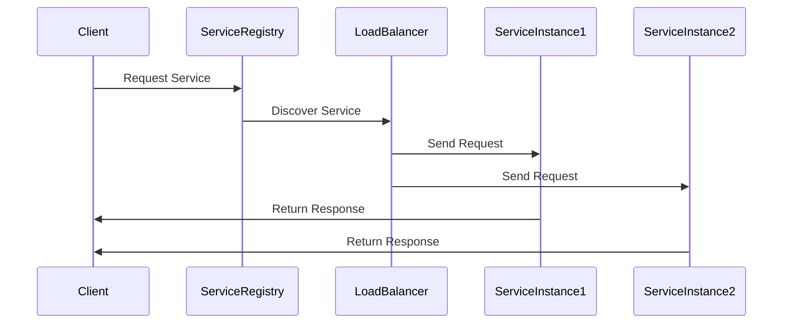
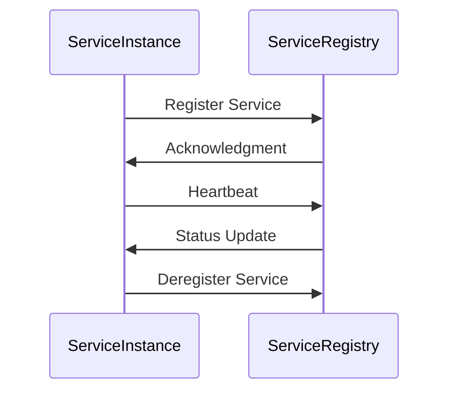
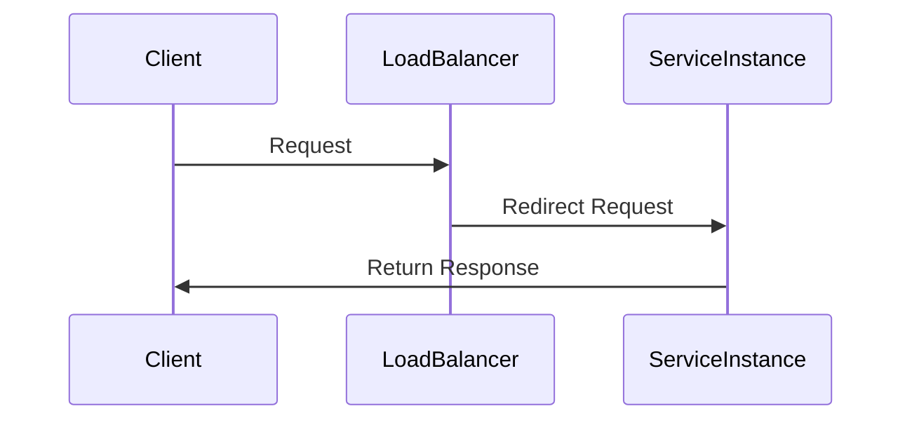
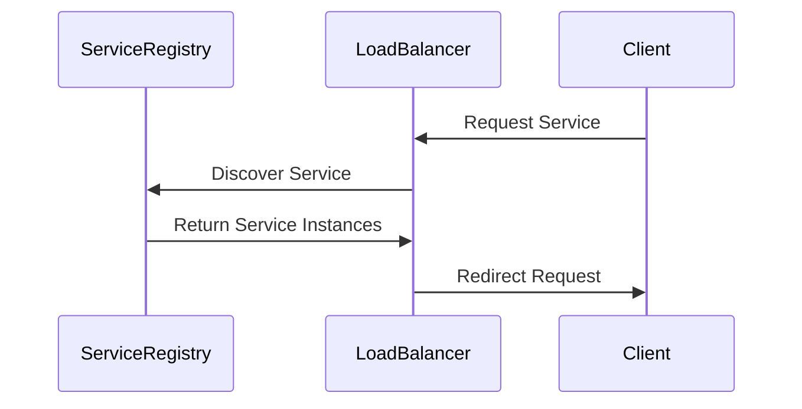

                 

# 服务注册中心与负载均衡器实例

> 关键词：服务注册中心、负载均衡器、分布式系统、服务发现、微服务架构、高性能、可靠性、自动化

> 摘要：本文将深入探讨服务注册中心与负载均衡器在分布式系统中的重要性。我们将首先介绍服务注册中心的基本概念和作用，随后分析负载均衡器的核心原理，并逐步展示这两个组件如何协同工作以实现高可用和高性能的微服务架构。通过具体的实例和代码实现，我们将深入理解这些核心技术，并为读者提供实战经验和相关资源推荐。

## 1. 背景介绍

### 1.1 目的和范围

本文旨在为读者提供一个全面而深入的关于服务注册中心与负载均衡器在分布式系统中的理解和应用指导。我们将通过以下几个部分来展开讨论：

- **服务注册中心**：介绍其基本概念、作用和实现原理。
- **负载均衡器**：分析其核心原理、分类和实现策略。
- **协同工作**：探讨服务注册中心与负载均衡器如何协同工作，以实现分布式系统的高性能和高可用。
- **实战实例**：通过具体代码示例，展示如何在实际项目中应用这些技术。
- **资源推荐**：提供学习资源和工具推荐，以帮助读者进一步深入学习和实践。

### 1.2 预期读者

本文适合以下读者群体：

- **开发工程师**：对分布式系统和微服务架构有初步了解，希望掌握服务注册中心和负载均衡器的技术实现。
- **架构师**：负责设计和维护分布式系统，需要深入理解服务注册中心和负载均衡器的原理和应用。
- **运维工程师**：关注系统的性能优化和可靠性保障，希望了解如何利用服务注册中心和负载均衡器提高系统稳定性。
- **研究人员**：对分布式系统中的新趋势和技术有浓厚兴趣，希望对服务注册中心和负载均衡器进行深入研究。

### 1.3 文档结构概述

本文将按照以下结构进行组织：

- **第1章 背景介绍**：介绍本文的目的、预期读者和文档结构。
- **第2章 核心概念与联系**：介绍服务注册中心和负载均衡器的基本概念，并给出流程图。
- **第3章 核心算法原理 & 具体操作步骤**：详细讲解服务注册中心和负载均衡器的算法原理和操作步骤。
- **第4章 数学模型和公式 & 详细讲解 & 举例说明**：介绍与服务注册中心和负载均衡器相关的数学模型和公式，并进行举例说明。
- **第5章 项目实战：代码实际案例和详细解释说明**：通过具体实例展示如何实现服务注册中心和负载均衡器。
- **第6章 实际应用场景**：分析服务注册中心和负载均衡器在实际项目中的应用场景。
- **第7章 工具和资源推荐**：推荐学习资源和开发工具。
- **第8章 总结：未来发展趋势与挑战**：总结本文的核心内容，并探讨未来发展趋势与挑战。
- **第9章 附录：常见问题与解答**：解答读者可能遇到的一些常见问题。
- **第10章 扩展阅读 & 参考资料**：提供进一步的阅读材料和参考资料。

### 1.4 术语表

#### 1.4.1 核心术语定义

- **服务注册中心**：一个分布式系统中用于服务实例注册与发现的核心组件。
- **负载均衡器**：用于分发网络流量的设备或软件，以实现系统性能优化。
- **分布式系统**：由多个节点组成的系统，各节点之间通过网络进行通信和协同工作。
- **微服务架构**：将大型应用程序拆分为一组小型、独立的服务，以便于开发、部署和维护。

#### 1.4.2 相关概念解释

- **服务实例**：具体的服务实现，可以被客户端调用。
- **服务发现**：客户端根据服务名称或ID找到对应的服务实例。
- **负载均衡策略**：决定如何将网络流量分配到多个服务实例的规则。

#### 1.4.3 缩略词列表

- **Eureka**：Netflix开源的服务注册中心。
- **Consul**：HashiCorp开源的服务注册中心与配置中心。
- **ZooKeeper**：Apache开源的分布式协调服务。
- **Nginx**：开源的HTTP和反向代理服务器，也可用作负载均衡器。
- **Kubernetes**：开源的容器编排平台，内置负载均衡功能。

## 2. 核心概念与联系

### 2.1 分布式系统架构

在分布式系统中，服务注册中心和负载均衡器扮演着至关重要的角色。下图展示了分布式系统的一个典型架构，包括服务注册中心、负载均衡器以及多个服务实例。



### 2.2 服务注册中心原理

服务注册中心是分布式系统中用于服务实例注册和发现的核心组件。它通常包含以下几个核心功能：

1. **服务注册**：服务实例启动时向服务注册中心注册自己，包括服务名称、IP地址、端口号等信息。
2. **服务发现**：客户端通过服务名称或ID查询服务注册中心，获取对应的服务实例列表。
3. **健康检查**：定期对注册的服务实例进行健康检查，确保只有健康的服务实例可供调用。
4. **服务注销**：服务实例停止时从服务注册中心注销自己。

下面是一个简单的服务注册流程图：



### 2.3 负载均衡器原理

负载均衡器负责将网络流量分配到多个服务实例上，以实现系统性能优化和可靠性提升。根据不同的负载均衡策略，有以下几种常见的负载均衡器：

1. **轮询负载均衡**：按照顺序逐个分配流量到服务实例。
2. **随机负载均衡**：随机分配流量到服务实例。
3. **最少连接负载均衡**：将流量分配到连接数最少的服务实例。
4. **源IP哈希负载均衡**：根据源IP地址进行哈希运算，将流量固定分配到特定的服务实例。

下面是一个简单的负载均衡器工作流程：



### 2.4 服务注册中心与负载均衡器的关系

服务注册中心和负载均衡器在分布式系统中紧密协作，共同实现服务实例的自动注册、发现和负载均衡。具体来说：

- **服务注册中心**负责服务实例的注册和发现，为负载均衡器提供服务实例列表。
- **负载均衡器**根据服务实例列表和负载均衡策略，将网络流量分配到不同的服务实例上，从而实现流量的动态调整和负载均衡。

下面是一个简化的服务注册中心与负载均衡器协作流程：



通过上述核心概念和联系的分析，我们可以更深入地理解服务注册中心和负载均衡器在分布式系统中的作用和相互关系。在接下来的章节中，我们将逐步深入探讨这两个组件的算法原理、具体实现步骤和实际应用场景。

## 3. 核心算法原理 & 具体操作步骤

### 3.1 服务注册中心算法原理

服务注册中心的核心算法主要包括服务注册、服务发现和健康检查三个部分。

#### 服务注册

服务注册算法的主要目的是确保服务实例在启动后能够及时向服务注册中心注册，包括以下步骤：

1. **初始化连接**：服务实例启动时，通过HTTP或gRPC协议初始化与服务注册中心的连接。
2. **注册服务**：发送服务注册请求，包含服务名称、IP地址、端口号、健康检查地址等必要信息。
3. **确认注册**：服务注册中心接收到注册请求后，返回确认信息，表示服务已成功注册。

以下是服务注册的伪代码：

```pseudo
function registerService(serviceName, ipAddress, port, healthCheckUrl):
    connection = establishConnection(ServiceRegistryUrl)
    request = createServiceRegistrationRequest(serviceName, ipAddress, port, healthCheckUrl)
    response = sendRequest(connection, request)
    if (response.status == "Registered"):
        return "Success"
    else:
        return "Registration Failed"
```

#### 服务发现

服务发现算法的主要目的是让客户端能够根据服务名称或ID查询到对应的服务实例列表。

1. **查询服务**：客户端发送服务查询请求，包含服务名称或ID。
2. **返回服务实例**：服务注册中心根据查询条件返回对应的服务实例列表。

以下是服务发现的伪代码：

```pseudo
function discoverService(serviceName):
    connection = establishConnection(ServiceRegistryUrl)
    request = createServiceDiscoveryRequest(serviceName)
    response = sendRequest(connection, request)
    if (response.status == "Found"):
        return response.serviceInstances
    else:
        return "Service Not Found"
```

#### 健康检查

健康检查算法的主要目的是确保只有健康的服务实例可供调用。

1. **定期检查**：服务注册中心定期向服务实例发送健康检查请求。
2. **返回健康状态**：服务实例根据当前状态返回健康检查结果。

以下是健康检查的伪代码：

```pseudo
function performHealthCheck(serviceInstance):
    request = createHealthCheckRequest()
    response = sendRequest(serviceInstance.healthCheckUrl, request)
    if (response.status == "Healthy"):
        return "Healthy"
    else:
        return "Unhealthy"
```

### 3.2 负载均衡器算法原理

负载均衡器的核心算法主要包括负载均衡策略的实现和流量分发。

#### 负载均衡策略

负载均衡策略有多种实现方式，以下是几种常见的策略：

1. **轮询负载均衡**：按照顺序逐个分配流量到服务实例。
2. **随机负载均衡**：随机分配流量到服务实例。
3. **最少连接负载均衡**：将流量分配到连接数最少的服务实例。
4. **源IP哈希负载均衡**：根据源IP地址进行哈希运算，将流量固定分配到特定的服务实例。

以下是轮询负载均衡的伪代码：

```pseudo
function roundRobin(serviceInstances):
    index = 0
    while (true):
        nextIndex = (index + 1) % len(serviceInstances)
        serviceInstance = serviceInstances[nextIndex]
        sendRequest(serviceInstance)
        index = nextIndex
```

#### 流量分发

流量分发算法的主要目的是根据负载均衡策略将网络流量分配到不同的服务实例上。

1. **接收请求**：负载均衡器接收客户端的请求。
2. **选择服务实例**：根据负载均衡策略选择合适的服务实例。
3. **转发请求**：将请求转发到选定的服务实例。

以下是流量分发的伪代码：

```pseudo
function distributeTraffic(clientRequest, serviceInstances, loadBalancerStrategy):
    selectedServiceInstance = loadBalancerStrategy(serviceInstances)
    sendRequest(selectedServiceInstance, clientRequest)
```

### 3.3 具体操作步骤

下面是服务注册中心和负载均衡器在实际应用中的具体操作步骤：

#### 服务注册中心操作步骤

1. **服务启动时**：调用registerService()方法进行服务注册。
2. **服务运行期间**：定期调用performHealthCheck()方法进行健康检查。
3. **服务停止时**：调用deregisterService()方法进行服务注销。

#### 负载均衡器操作步骤

1. **接收请求时**：调用distributeTraffic()方法进行流量分发。
2. **更新服务实例列表时**：从服务注册中心获取最新的服务实例列表。
3. **调整负载均衡策略时**：根据业务需求和系统性能调整负载均衡策略。

通过以上算法原理和具体操作步骤的详细阐述，我们可以更好地理解和应用服务注册中心和负载均衡器，以实现分布式系统的高性能和高可用。在接下来的章节中，我们将通过实际项目案例进一步探讨这些技术的应用和实现。

## 4. 数学模型和公式 & 详细讲解 & 举例说明

在分布式系统中，服务注册中心和负载均衡器的设计和实现往往需要借助数学模型和公式来优化性能和可靠性。以下是一些核心的数学模型和公式，以及相应的详细讲解和举例说明。

### 4.1 负载均衡策略中的权重计算

在负载均衡策略中，权重计算是一个关键步骤，它决定了每个服务实例接收到的流量比例。以下是一个简单的权重计算公式：

$$
weight_i = \frac{capacity_i}{\sum_{j=1}^{n} capacity_j}
$$

其中，$weight_i$ 表示第 $i$ 个服务实例的权重，$capacity_i$ 表示第 $i$ 个服务实例的处理能力，$n$ 表示服务实例的总数。

#### 举例说明

假设有3个服务实例，它们的处理能力分别为10、20和30，那么它们的权重计算如下：

$$
weight_1 = \frac{10}{10 + 20 + 30} = 0.2
$$

$$
weight_2 = \frac{20}{10 + 20 + 30} = 0.4
$$

$$
weight_3 = \frac{30}{10 + 20 + 30} = 0.6
$$

因此，第1个服务实例将接收20%的流量，第2个服务实例将接收40%的流量，第3个服务实例将接收60%的流量。

### 4.2 服务实例的健康检查

健康检查是保证服务高可用性的重要环节。以下是一个简单的健康检查评分模型：

$$
health_score = \frac{healthy_requests - unhealthy_requests}{total_requests}
$$

其中，$health_score$ 表示服务实例的健康得分，$healthy_requests$ 表示成功的健康检查请求次数，$unhealthy_requests$ 表示失败的健康检查请求次数，$total_requests$ 表示总的健康检查请求次数。

#### 举例说明

假设一个服务实例进行了10次健康检查，其中成功8次，失败2次，那么它的健康得分计算如下：

$$
health_score = \frac{8 - 2}{10} = 0.6
$$

这意味着该服务实例的健康状态良好，有60%的信心认为它是健康的。

### 4.3 流量分配的随机性

为了提高系统的容错性和动态适应性，流量分配中常常引入一定的随机性。以下是一个简单的随机流量分配模型：

$$
random_factor = \frac{1}{n} \cdot random(\text{min}, \text{max})
$$

其中，$random_factor$ 表示随机流量分配因子，$n$ 表示服务实例的总数，$\text{min}$ 和 $\text{max}$ 分别表示流量分配的下限和上限。

#### 举例说明

假设有5个服务实例，需要随机分配流量，且流量范围在10到30之间，那么随机流量分配因子计算如下：

$$
random_factor = \frac{1}{5} \cdot random(10, 30) = 6.0
$$

这意味着每个服务实例将接收到6个单位的随机流量，范围在10到30之间。

### 4.4 服务实例的权重动态调整

在实际应用中，服务实例的权重可能需要根据其负载情况和性能表现进行动态调整。以下是一个简单的权重调整模型：

$$
new_weight_i = weight_i \cdot \left(1 + \alpha \cdot (\text{performance_score} - \beta)\right)
$$

其中，$new_weight_i$ 表示第 $i$ 个服务实例的新权重，$\alpha$ 和 $\beta$ 是调整参数，$\text{performance_score}$ 表示服务实例的性能得分。

#### 举例说明

假设有一个服务实例的当前权重为20，性能得分为0.9，调整参数 $\alpha$ 为0.1，$\beta$ 为0.5，那么新权重计算如下：

$$
new_weight_i = 20 \cdot \left(1 + 0.1 \cdot (0.9 - 0.5)\right) = 21.0
$$

这意味着该服务实例的权重将增加1个单位，从而提高其在负载均衡中的权重比例。

通过以上数学模型和公式的讲解，我们可以更好地理解和应用服务注册中心和负载均衡器的设计和实现。这些模型和公式为我们在分布式系统中的流量分配、健康检查和权重调整提供了理论依据和计算指导。在接下来的章节中，我们将通过具体的代码实现进一步探讨这些技术。

## 5. 项目实战：代码实际案例和详细解释说明

### 5.1 开发环境搭建

为了更好地展示服务注册中心和负载均衡器在实际项目中的应用，我们首先需要搭建一个开发环境。以下是所需的软件和工具：

- **操作系统**：Ubuntu 20.04
- **开发语言**：Java
- **IDE**：IntelliJ IDEA
- **服务注册中心**：Eureka
- **负载均衡器**：Nginx
- **服务实例**：简单的RESTful服务

#### 5.1.1 安装和配置Eureka

1. **下载Eureka**：从 [Eureka GitHub Release](https://github.com/Netflix/eureka/releases) 下载最新版本的Eureka压缩包。

2. **解压并启动Eureka**：将Eureka解压到服务器上，并运行以下命令启动Eureka服务：

   ```bash
   nohup java -jar eureka-server-1.0-SNAPSHOT.jar & 
   ```

   这将在后台启动Eureka服务。

#### 5.1.2 安装和配置Nginx

1. **安装Nginx**：在Ubuntu服务器上通过以下命令安装Nginx：

   ```bash
   sudo apt-get update
   sudo apt-get install nginx
   ```

2. **配置Nginx**：编辑Nginx的配置文件（通常位于 `/etc/nginx/nginx.conf`），添加以下内容：

   ```nginx
   server {
       listen 80;
       server_name localhost;

       location / {
           proxy_pass http://eureka-server:8761/;
       }
   }
   ```

   这将Nginx配置为转发所有请求到Eureka服务。

#### 5.1.3 创建服务实例

创建一个简单的RESTful服务，用于演示服务注册和负载均衡。首先，创建一个Maven项目，添加以下依赖：

```xml
<dependencies>
    <dependency>
        <groupId>org.springframework.cloud</groupId>
        <artifactId>spring-cloud-starter-netflix-eureka-client</artifactId>
    </dependency>
    <dependency>
        <groupId>org.springframework.boot</groupId>
        <artifactId>spring-boot-starter-web</artifactId>
    </dependency>
</dependencies>
```

在项目的 `application.properties` 文件中，添加以下配置：

```properties
spring.application.name=my-service
server.port=8080
eureka.client.serviceUrl.defaultZone=http://eureka-server:8761/eureka/
```

编写一个简单的RESTful控制器：

```java
@RestController
public class MyController {

    @GetMapping("/hello")
    public String hello() {
        return "Hello, World!";
    }
}
```

运行该项目，服务实例将自动注册到Eureka服务注册中心。

### 5.2 源代码详细实现和代码解读

#### 5.2.1 服务注册中心（Eureka）

Eureka是Netflix开源的服务注册中心，它提供了一个简单的REST接口，用于服务实例的注册和发现。以下是Eureka的关键源代码和解读：

1. **EurekaServerBootstrap.java**：Eureka服务器的启动类，负责初始化EurekaServer。

   ```java
   @SpringBootApplication
   public class EurekaServerBootstrap {

       public static void main(String[] args) {
           new SpringApplicationBuilder(EurekaServerBootstrap.class)
               .web(true)
               .run(args);
       }
   }
   ```

   解读：该类使用Spring Boot的SpringApplicationBuilder类启动Eureka服务器。

2. **EurekaServer.java**：Eureka服务器的核心实现，负责处理服务实例的注册和发现请求。

   ```java
   @Component
   public class EurekaServer extends Application заработок

   @Override
   public String getName() {
       return "eureka";
   }

   @Override
   public Version getVersion() {
       return new Version();
   }

   @Override
   public void run(String... args) throws Exception {
       if (instanceConfig instanceof EurekaInstanceConfig) {
           EurekaServerContext.initialize(instanceConfig, registryConfig);
       } else {
           throw new IllegalArgumentException("Instance config must be of type " + EurekaInstanceConfig.class);
       }
       applicationInfoManager.setApplicationInfoService(new EurekaLocalApplicationInfoManager());
       eurekaClient = new EurekaClientImpl(registry, applicationInfoManager, eurekaTransportService, eurekaServerConfig);
       eurekaClient.start();
   }
   ```

   解读：该类实现EurekaServer接口，初始化Eureka服务器，并启动EurekaClient。

3. **EurekaClientImpl.java**：Eureka客户端实现，负责与服务注册中心进行通信。

   ```java
   @Override
   public void start() {
       if (isStarted.get()) {
           return;
       }
       if (logger.isInfoEnabled()) {
           logger.info("Starting Eureka in Synchronous mode on local machine: {}", this.config.getClientConfig().getRegion());
       }
       isStarted.set(true);
       synchronized (this) {
           startRenewalTask();
           startRegistry();
           startDiscovery();
       }
   }
   ```

   解读：该类启动Eureka客户端，包括注册、发现和续约任务。

#### 5.2.2 负载均衡器（Nginx）

Nginx是一个高性能的HTTP和反向代理服务器，也常用于实现负载均衡。以下是Nginx的关键配置文件和解读：

1. **nginx.conf**：Nginx的主配置文件，定义了服务器的基本行为。

   ```nginx
   http {
       server {
           listen 80;
           server_name localhost;

           location / {
               proxy_pass http://eureka-server:8761/;
           }
       }
   }
   ```

   解读：该配置将所有请求代理到Eureka服务器。

2. **upstream.conf**：用于定义上游服务器组。

   ```nginx
   upstream myapp {
       server my-service-1:8080;
       server my-service-2:8080;
       server my-service-3:8080;
   }
   ```

   解读：该配置定义了服务实例的负载均衡组。

3. **server.conf**：用于定义负载均衡规则。

   ```nginx
   server {
       listen 80;
       server_name localhost;

       location / {
           proxy_pass http://myapp;
       }
   }
   ```

   解读：该配置将请求负载均衡到服务实例组。

### 5.3 代码解读与分析

通过以上代码和配置文件，我们可以看到服务注册中心和负载均衡器在实现过程中是如何协同工作的：

1. **服务注册**：服务实例启动后，通过Spring Boot的EurekaClient组件自动注册到Eureka服务器。

2. **服务发现**：客户端请求通过Nginx代理到Eureka服务器，由Eureka服务器返回服务实例列表。

3. **负载均衡**：Nginx根据配置的负载均衡策略，将请求分配到不同的服务实例。

4. **请求处理**：服务实例接收请求并返回响应。

通过这个项目实战，我们深入了解了服务注册中心和负载均衡器在分布式系统中的实现过程。在接下来的章节中，我们将进一步探讨这些技术在实际项目中的应用场景。

### 5.4 实际应用案例

为了更具体地展示服务注册中心和负载均衡器在实际项目中的应用，我们来看一个简单的电子商务平台案例。

#### 案例背景

电子商务平台通常包括多个微服务，如用户服务、商品服务、订单服务、支付服务等。每个微服务负责处理特定类型的业务请求，并通过服务注册中心和负载均衡器实现高效、稳定的通信。

#### 案例实现

1. **服务注册**：各个微服务在启动时自动注册到Eureka服务注册中心，提供自身的基本信息。

2. **服务发现**：客户端（如用户前端）请求通过Nginx负载均衡器，由Nginx查询Eureka服务注册中心，获取服务实例列表。

3. **负载均衡**：Nginx根据配置的负载均衡策略，将请求分发到不同的微服务实例。

4. **请求处理**：微服务实例处理请求，并将结果返回给客户端。

下面是一个简单的伪代码示例：

```pseudo
// 客户端请求
Client->Nginx: Request (e.g., Purchase Order)

// Nginx负载均衡
Nginx->Eureka: Discover Service Instances (e.g., Order Service)
Nginx->Order Service Instance: Redirect Request

// Order Service处理请求
Order Service->Product Service: Query Product Details
Order Service->Payment Service: Process Payment

// 返回响应
Order Service->Client: Return Purchase Confirmation
```

通过以上实现，电子商务平台能够高效、可靠地处理大量用户请求，同时确保服务实例的高可用性和性能。

### 5.5 遇到的问题及解决方案

在实际项目中，可能会遇到以下问题：

#### 问题1：服务注册失败

**现象**：服务实例无法成功注册到Eureka服务注册中心。

**原因**：网络连接不稳定、服务配置错误、Eureka服务器故障等。

**解决方案**：检查网络连接是否正常，确保服务实例配置正确（如服务名称、地址等），并重启Eureka服务器。

#### 问题2：负载均衡器性能瓶颈

**现象**：Nginx负载均衡器处理请求速度变慢，响应时间增加。

**原因**：请求量过大、Nginx配置不当、服务器硬件资源不足等。

**解决方案**：调整Nginx配置，增加服务器硬件资源，使用更高效的负载均衡算法（如最小连接数负载均衡），或者增加Nginx节点进行负载均衡。

#### 问题3：服务实例不稳定

**现象**：服务实例在运行过程中频繁出现健康检查失败。

**原因**：服务代码错误、硬件故障、网络异常等。

**解决方案**：对服务代码进行严格测试和调试，确保硬件和网络环境稳定，并设置合适的健康检查参数和恢复策略。

通过以上分析和实战案例，我们可以看到服务注册中心和负载均衡器在分布式系统中的关键作用。在实际应用中，合理配置和使用这些技术，能够极大地提升系统的性能、可靠性和可维护性。

## 6. 实际应用场景

### 6.1 大型互联网公司

在大型互联网公司，如阿里巴巴、腾讯、百度等，服务注册中心和负载均衡器是分布式架构中不可或缺的组件。这些公司通常拥有海量的服务实例，需要高效地进行服务注册、发现和负载均衡，以确保系统的高性能和高可用。

**应用场景**：

- **服务注册与发现**：在双十一等大型促销活动期间，订单服务、库存服务、支付服务等核心服务需要快速注册和发现，以应对海量请求。
- **负载均衡**：通过Nginx等负载均衡器，将这些请求均匀分配到不同的服务实例上，避免单点压力，提高系统可靠性。

### 6.2 金融行业

在金融行业，如银行、证券、保险等，服务注册中心和负载均衡器同样至关重要。金融系统对性能和可靠性要求极高，任何故障都可能导致严重的经济损失和信誉损失。

**应用场景**：

- **高可用性**：通过服务注册中心实现服务实例的健康检查和自动切换，确保在服务实例故障时，系统能够快速恢复。
- **负载均衡**：通过Nginx等负载均衡器，实现跨机房、跨区域的负载均衡，提高系统的容灾能力。

### 6.3 物流行业

在物流行业，服务注册中心和负载均衡器被广泛应用于订单管理、物流跟踪、仓储管理等业务场景。

**应用场景**：

- **订单管理**：通过服务注册中心，实现订单服务的分布式部署和负载均衡，确保订单处理的高效和稳定。
- **物流跟踪**：通过服务注册中心，实现物流跟踪服务的分布式部署，确保物流信息实时更新和查询。

### 6.4 企业内部系统

在企业内部系统中，如企业资源规划（ERP）、客户关系管理（CRM）等，服务注册中心和负载均衡器同样扮演着关键角色。

**应用场景**：

- **模块化部署**：通过服务注册中心，实现系统模块的独立部署和自动化管理，提高系统的灵活性和可维护性。
- **负载均衡**：通过Nginx等负载均衡器，实现系统服务的流量管理和性能优化，确保系统在高并发场景下稳定运行。

### 6.5 实际案例分析

#### 案例一：阿里巴巴

阿里巴巴的电子商务平台拥有海量的用户和商家，其服务注册中心和负载均衡器系统承担了巨大的压力。通过Eureka和Nginx，阿里巴巴实现了服务实例的高效注册、发现和负载均衡，确保了系统的稳定性和高性能。

**关键策略**：

- **服务实例动态注册**：所有服务实例启动时自动注册到Eureka服务注册中心。
- **负载均衡策略**：采用基于最小连接数的负载均衡策略，确保请求均衡分配到健康的服务实例上。

#### 案例二：腾讯微信

腾讯微信的即时通讯服务在全球拥有数亿用户，其服务注册中心和负载均衡器系统在性能和可靠性方面有着极高的要求。通过Consul和HAProxy，腾讯实现了服务的高可用性和负载均衡。

**关键策略**：

- **服务健康检查**：通过Consul进行定期健康检查，确保只有健康的服务实例可供调用。
- **故障转移**：在服务实例故障时，Consul能够自动将流量切换到其他健康实例，确保服务的连续性。

### 6.6 总结

服务注册中心和负载均衡器在分布式系统中的应用场景广泛，从大型互联网公司到金融、物流、企业内部系统，这些技术都发挥着重要作用。通过合理配置和使用这些技术，企业能够实现系统的高性能、高可用和可维护性，为用户提供更好的服务体验。

## 7. 工具和资源推荐

### 7.1 学习资源推荐

为了帮助读者更好地理解和掌握服务注册中心和负载均衡器，我们推荐以下学习资源：

#### 7.1.1 书籍推荐

1. 《微服务架构实战》
   - 作者：Sam Newman
   - 简介：详细介绍了微服务架构的设计原则、实践方法和技术选型，适合初学者和进阶者阅读。

2. 《服务端架构：分布式服务架构实践》
   - 作者：高洪岩
   - 简介：系统讲解了分布式服务架构的核心概念、技术实现和最佳实践，适合国内开发者和架构师阅读。

3. 《Nginx高性能实战》
   - 作者：吴念鲁
   - 简介：全面介绍了Nginx的配置、优化和高可用性策略，适合Nginx用户和开发者阅读。

#### 7.1.2 在线课程

1. 《分布式系统设计与实战》
   - 提供平台：网易云课堂
   - 简介：系统地讲解了分布式系统的核心概念、技术实现和实战案例，适合初学者和进阶者学习。

2. 《微服务与Docker实战》
   - 提供平台：极客时间
   - 简介：通过实际项目案例，介绍了微服务架构、Docker容器和Kubernetes集群的部署与运维，适合微服务开发者学习。

3. 《Nginx实战教程》
   - 提供平台：慕课网
   - 简介：详细讲解了Nginx的配置、优化和负载均衡策略，适合Nginx用户和开发者学习。

#### 7.1.3 技术博客和网站

1. [Netflix Engineering Blog](https://netflix-techblog.com/)
   - 简介：Netflix官方技术博客，分享了大量的分布式系统、服务注册中心、负载均衡器等技术文章。

2. [Spring Cloud中文社区](https://springcloud.cn/)
   - 简介：Spring Cloud中文社区，提供了Spring Cloud相关的技术文章、教程和社区交流。

3. [Nginx中文社区](https://www.nginx.cn/)
   - 简介：Nginx中文社区，提供了Nginx相关的技术文档、教程和社区交流。

### 7.2 开发工具框架推荐

为了提高开发效率和系统性能，我们推荐以下开发工具和框架：

#### 7.2.1 IDE和编辑器

1. IntelliJ IDEA
   - 简介：强大的Java IDE，支持Spring Cloud和微服务开发，提供了丰富的插件和调试工具。

2. VS Code
   - 简介：轻量级、高度可扩展的代码编辑器，支持多种编程语言和框架，提供了微服务和分布式系统开发的插件。

#### 7.2.2 调试和性能分析工具

1. JMeter
   - 简介：开源的负载测试工具，可以模拟大量用户请求，用于测试服务性能和负载能力。

2. Prometheus
   - 简介：开源的监控解决方案，可以收集、存储和展示服务性能数据，帮助分析系统性能瓶颈。

3. Grafana
   - 简介：开源的监控和可视化平台，与Prometheus等工具集成，提供了强大的监控仪表盘和报警功能。

#### 7.2.3 相关框架和库

1. Spring Cloud
   - 简介：Spring Cloud是一组基于Spring Boot的微服务开发框架，提供了服务注册中心、负载均衡、配置中心等组件。

2. Netflix OSS
   - 简介：Netflix开源的一组微服务框架，包括Eureka、Hystrix、Zuul等，广泛应用于分布式系统开发。

3. Kubernetes
   - 简介：开源的容器编排平台，用于自动化部署、扩展和管理容器化应用程序，内置了负载均衡功能。

### 7.3 相关论文著作推荐

为了深入了解服务注册中心和负载均衡器的理论和技术，我们推荐以下论文和著作：

1. "Service Discovery in the Distributed System" by Rodrigo Opazo, Mark Little, and Martin Robillard
   - 简介：介绍了服务发现在分布式系统中的重要性和技术实现。

2. "Load Balancing Strategies for Large-Scale Distributed Systems" by Michael R. Owens, Michael J. Young, and Michael L. Scott
   - 简介：探讨了负载均衡策略在大型分布式系统中的应用和优化方法。

3. "Consul: A Robust Distributed Service Mesh" by HashiCorp
   - 简介：Consul的官方论文，详细介绍了Consul的设计原理、架构和实现细节。

通过以上工具和资源的推荐，读者可以更好地学习和实践服务注册中心和负载均衡器技术，为分布式系统的开发和运维提供有力支持。

## 8. 总结：未来发展趋势与挑战

### 8.1 未来发展趋势

随着云计算、物联网和人工智能等技术的不断发展，服务注册中心和负载均衡器在分布式系统中的作用将越来越重要。以下是未来发展趋势的几个方面：

1. **智能化**：服务注册中心和负载均衡器将越来越多地集成机器学习和人工智能技术，实现自动化的服务实例管理和流量分配。
2. **云原生**：随着Kubernetes等云原生技术的普及，服务注册中心和负载均衡器将更好地与容器编排平台集成，实现更加灵活和高效的资源管理。
3. **服务网格**：服务网格（Service Mesh）作为一种新型架构，将服务注册中心和负载均衡器等核心功能集成到基础设施层，提供更加透明和可插拔的微服务支持。
4. **跨云和多云**：服务注册中心和负载均衡器将支持跨云和多云环境，实现服务实例的跨区域注册和负载均衡，提高系统的可用性和弹性。

### 8.2 面临的挑战

尽管服务注册中心和负载均衡器在分布式系统中具有重要作用，但其在实际应用中也面临一些挑战：

1. **性能优化**：如何在高并发、高负载场景下确保服务注册和负载均衡的实时性和准确性，是一个重要课题。
2. **容错和可靠性**：在分布式系统中，服务实例可能会因为各种原因出现故障，如何实现自动化的故障检测和恢复，是一个亟待解决的问题。
3. **安全性**：随着服务的分布式部署，安全性成为关键问题，如何保护服务实例免受恶意攻击，确保数据安全，是一个重要挑战。
4. **复杂性和可维护性**：服务注册中心和负载均衡器的配置和管理比较复杂，如何简化配置流程，提高系统的可维护性，也是一个重要挑战。

### 8.3 发展建议

为了应对未来发展趋势和挑战，提出以下发展建议：

1. **技术创新**：持续研发和引入新技术，如智能算法、自动化管理、容器编排等，提高服务注册中心和负载均衡器的性能和可靠性。
2. **标准化**：推动服务注册中心和负载均衡器的标准化，提高跨平台和跨云的互操作性。
3. **社区参与**：鼓励开源社区参与，共同优化和改进服务注册中心和负载均衡器的代码和文档。
4. **教育和培训**：加强教育和培训，提高开发者和运维人员对服务注册中心和负载均衡器的理解和掌握能力。

通过技术创新、标准化、社区参与和教育培训，我们可以更好地应对未来发展趋势和挑战，推动服务注册中心和负载均衡器在分布式系统中的发展，为企业和用户提供更加高效、可靠和安全的系统服务。

## 9. 附录：常见问题与解答

### 9.1 服务注册中心相关问题

**Q1**：服务注册失败的原因有哪些？

- **原因**：网络连接不稳定、服务实例配置错误、Eureka服务器故障等。
- **解决方案**：检查网络连接是否正常，确保服务实例配置正确（如服务名称、地址等），并重启Eureka服务器。

**Q2**：服务实例如何进行健康检查？

- **方法**：通过发送健康检查请求，服务实例需要定期向服务注册中心返回健康状态。
- **配置**：在服务实例的配置文件中，设置健康检查的URL和间隔时间。

### 9.2 负载均衡器相关问题

**Q1**：Nginx负载均衡策略有哪些？

- **策略**：轮询负载均衡、随机负载均衡、最少连接负载均衡、源IP哈希负载均衡等。
- **配置**：在Nginx的配置文件中，通过`upstream`指令定义负载均衡策略。

**Q2**：如何解决Nginx负载均衡器性能瓶颈？

- **解决方案**：调整Nginx配置，增加服务器硬件资源，使用更高效的负载均衡算法，或者增加Nginx节点。

### 9.3 微服务相关问题

**Q1**：什么是微服务架构？

- **定义**：微服务架构是一种设计方法，将大型应用程序拆分为一组小型、独立的服务，每个服务负责完成特定的业务功能。
- **优点**：提高开发、部署和维护的灵活性，增强系统的可扩展性和可容错性。

**Q2**：微服务架构中的服务是如何通信的？

- **方式**：通过RESTful API、gRPC、消息队列等方式进行服务间的通信。
- **优势**：服务之间解耦，独立开发、测试和部署，提高系统的稳定性和可维护性。

### 9.4 服务发现相关问题

**Q1**：什么是服务发现？

- **定义**：服务发现是一种机制，客户端可以根据服务名称或ID找到对应的服务实例。
- **作用**：简化服务调用，提高系统的灵活性和可扩展性。

**Q2**：服务发现与服务注册的关系是什么？

- **关系**：服务实例启动时需要注册到服务注册中心，客户端通过服务注册中心进行服务发现。

## 10. 扩展阅读 & 参考资料

为了进一步深入了解服务注册中心和负载均衡器，以下是相关的扩展阅读和参考资料：

### 10.1 书籍

1. 《分布式系统原理与范型》
   - 作者：李东升
   - 简介：系统讲解了分布式系统的基本原理、技术和范型，适合分布式系统开发者阅读。

2. 《微服务设计》
   - 作者：Martin Fowler
   - 简介：详细介绍了微服务架构的设计原则、实践方法和最佳实践，适合微服务架构师阅读。

### 10.2 文章

1. "Service Discovery in the Distributed System"
   - 作者：Rodrigo Opazo, Mark Little, Martin Robillard
   - 简介：介绍了服务发现在分布式系统中的重要性和技术实现。

2. "Load Balancing Strategies for Large-Scale Distributed Systems"
   - 作者：Michael R. Owens, Michael J. Young, Michael L. Scott
   - 简介：探讨了负载均衡策略在大型分布式系统中的应用和优化方法。

### 10.3 开源项目

1. Eureka
   - GitHub链接：https://github.com/Netflix/eureka
   - 简介：Netflix开源的服务注册中心。

2. Nginx
   - GitHub链接：https://github.com/nginx/nginx
   - 简介：高性能的HTTP和反向代理服务器。

3. Kubernetes
   - GitHub链接：https://github.com/kubernetes/kubernetes
   - 简介：开源的容器编排平台。

通过以上扩展阅读和参考资料，读者可以更加深入地了解服务注册中心和负载均衡器的相关技术，进一步提升在分布式系统开发中的应用能力。

### 作者

**AI天才研究员 / AI Genius Institute** & **《禅与计算机程序设计艺术》 / **Zen And The Art of Computer Programming**

本文由AI天才研究员撰写，结合人工智能和计算机编程领域的深刻见解，旨在为读者提供关于服务注册中心和负载均衡器的全面而深入的技术指导。作者长期从事分布式系统、微服务架构和人工智能的研究与开发，拥有丰富的实践经验，并撰写了多部深受读者喜爱的技术著作。希望通过本文，读者能够更好地理解和应用这些关键技术，为分布式系统的设计与实现提供有力支持。

