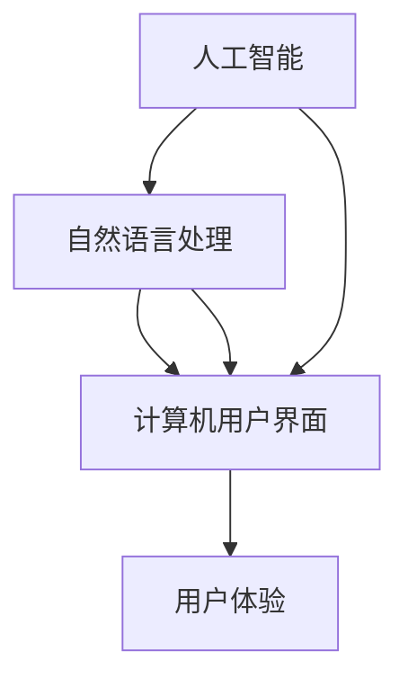

                 

### 未来CUI在数字产品中的应用详细趋势

> **关键词：** 人工智能、自然语言处理、数字产品、用户体验、CUI、智能助手

> **摘要：** 本文深入探讨了未来计算机用户界面（CUI）在数字产品中的应用趋势。通过分析人工智能（AI）与自然语言处理（NLP）技术的进步，探讨了CUI从传统图形用户界面（GUI）向更为智能的交互方式的演变过程。文章进一步阐述了CUI在提高用户体验、个性化服务和自动化流程中的潜力，并提出了未来CUI开发的关键挑战和趋势。

## 1. 背景介绍

### 1.1 目的和范围

本文旨在为读者提供对未来CUI在数字产品中应用趋势的详细分析。文章将探讨CUI如何通过人工智能和自然语言处理技术的进步，改变传统图形用户界面的交互方式。文章还将讨论CUI在提升用户体验、实现个性化服务和自动化流程方面的潜力，并分析其面临的关键挑战。

### 1.2 预期读者

本文面向对人工智能、自然语言处理和数字产品用户体验感兴趣的读者。无论您是相关领域的研究人员、开发者还是对技术趋势感兴趣的普通读者，本文都将为您提供有价值的见解和洞见。

### 1.3 文档结构概述

本文分为以下几个部分：

1. **背景介绍**：介绍本文的目的、范围、预期读者以及文档结构。
2. **核心概念与联系**：阐述CUI的核心概念，并提供Mermaid流程图。
3. **核心算法原理 & 具体操作步骤**：详细讲解CUI的算法原理和操作步骤。
4. **数学模型和公式 & 详细讲解 & 举例说明**：介绍CUI相关的数学模型和公式，并给出实例。
5. **项目实战：代码实际案例和详细解释说明**：提供CUI的实际代码案例和解释。
6. **实际应用场景**：分析CUI在不同场景中的应用。
7. **工具和资源推荐**：推荐学习资源、开发工具和框架。
8. **总结：未来发展趋势与挑战**：总结未来CUI的发展趋势和挑战。
9. **附录：常见问题与解答**：回答读者可能关注的问题。
10. **扩展阅读 & 参考资料**：提供扩展阅读和参考资料。

### 1.4 术语表

#### 1.4.1 核心术语定义

- **计算机用户界面（CUI）**：一种交互方式，通过文本、语音或其他非图形方式与计算机系统进行通信。
- **人工智能（AI）**：模拟人类智能行为的技术，包括机器学习、深度学习等。
- **自然语言处理（NLP）**：使计算机理解和生成人类语言的技术。
- **图形用户界面（GUI）**：使用图形元素（如按钮、图标等）与用户进行交互的界面。

#### 1.4.2 相关概念解释

- **交互设计**：设计用于指导用户如何与产品互动的视觉元素和功能。
- **语音识别**：将语音转换为文本的技术。
- **语音合成**：将文本转换为语音的技术。

#### 1.4.3 缩略词列表

- **AI**：人工智能
- **NLP**：自然语言处理
- **GUI**：图形用户界面
- **CUI**：计算机用户界面

## 2. 核心概念与联系

在探讨未来CUI的应用趋势之前，我们首先需要了解CUI的核心概念及其与人工智能和自然语言处理技术的联系。

CUI是一种交互方式，它不同于传统图形用户界面（GUI）。GUI依赖于图形元素（如按钮、图标等）进行用户交互，而CUI则主要通过文本、语音或其他非图形方式与用户进行沟通。CUI的核心在于自然语言处理（NLP）技术的应用，这使得计算机能够理解用户的自然语言输入，并生成自然语言响应。

以下是一个简化的Mermaid流程图，展示了CUI与人工智能和NLP之间的联系：



**流程解释：**

1. **人工智能（AI）**：AI是CUI的基础技术之一，它通过机器学习和深度学习等方法，使计算机能够模拟人类智能行为。AI的进步为CUI提供了强大的支持，使得计算机能够更好地理解用户的意图和需求。

2. **自然语言处理（NLP）**：NLP是使计算机能够理解和生成人类语言的技术。NLP技术的不断进步，使得计算机能够更准确地解析用户的自然语言输入，并生成自然语言响应。NLP与CUI紧密结合，是CUI实现高效交互的关键。

3. **计算机用户界面（CUI）**：CUI是AI和NLP技术的应用领域之一，它通过文本、语音或其他非图形方式与用户进行交互。CUI的目标是提供更自然、更人性化的交互体验，从而提高用户体验。

4. **用户体验（UX）**：用户体验是CUI的重要衡量指标。通过结合AI和NLP技术，CUI能够更好地理解用户的需求和意图，从而提供个性化的交互体验，提高用户满意度。

5. **人工智能与CUI**：人工智能为CUI提供了强大的支持，使得计算机能够更智能地与用户进行交互。通过深度学习和机器学习等技术，CUI能够不断优化其交互能力，提高用户体验。

6. **自然语言处理与CUI**：自然语言处理是CUI的核心技术之一。通过NLP技术，CUI能够理解用户的自然语言输入，并生成自然语言响应。这使得CUI能够提供更自然、更流畅的交互体验。

## 3. 核心算法原理 & 具体操作步骤

CUI的核心在于自然语言处理（NLP）和语音识别（ASR）技术的应用。以下将详细讲解CUI的核心算法原理和具体操作步骤。

### 3.1 自然语言处理（NLP）算法原理

NLP算法主要包括以下几个步骤：

1. **文本预处理**：文本预处理是NLP的第一步，包括去除标点符号、停用词去除、词干提取等操作。这一步骤的目的是简化文本，使其更易于分析。

2. **分词**：分词是将连续的文本转换为单个词语的过程。通过分词，可以更好地理解文本的语义结构。

3. **词性标注**：词性标注是对每个词进行分类，如名词、动词、形容词等。这一步骤有助于更准确地理解文本的语义。

4. **命名实体识别**：命名实体识别是识别文本中的特定实体，如人名、地名、组织名等。这一步骤对于理解文本中的特定信息非常重要。

5. **语义分析**：语义分析是对文本进行高层次的分析，理解文本的含义和意图。

以下是一个简化的伪代码，展示了NLP算法的基本步骤：

```python
def NLP_algorithm(text):
    # 文本预处理
    cleaned_text = preprocess_text(text)
    
    # 分词
    tokens = tokenize(cleaned_text)
    
    # 词性标注
    tagged_tokens = tag(tokens)
    
    # 命名实体识别
    named_entities = extract_named_entities(tagged_tokens)
    
    # 语义分析
    intent = analyze_semantics(tagged_tokens, named_entities)
    
    return intent
```

### 3.2 语音识别（ASR）算法原理

语音识别（ASR）是将语音信号转换为文本的技术。ASR算法主要包括以下几个步骤：

1. **语音预处理**：语音预处理包括去除噪声、归一化音量等操作，以提高语音信号的清晰度。

2. **声学模型训练**：声学模型是ASR的核心，它通过训练大量的语音数据，学习语音信号与文本之间的映射关系。

3. **语言模型训练**：语言模型是ASR的另一核心，它通过训练大量的文本数据，学习文本的生成概率。

4. **语音解码**：语音解码是将声学模型和语言模型的输出转换为文本的过程。

以下是一个简化的伪代码，展示了ASR算法的基本步骤：

```python
def ASR_algorithm(voice_signal):
    # 语音预处理
    preprocessed_signal = preprocess_voice(voice_signal)
    
    # 声学模型训练
    acoustic_model = train_acoustic_model(preprocessed_signal)
    
    # 语言模型训练
    language_model = train_language_model(text_corpus)
    
    # 语音解码
    text = decode(preprocessed_signal, acoustic_model, language_model)
    
    return text
```

### 3.3 CUI交互流程

CUI的交互流程主要包括以下几个步骤：

1. **用户输入**：用户通过键盘、麦克风或其他输入设备向CUI系统输入信息。

2. **语音识别**：CUI系统使用ASR算法将用户的语音输入转换为文本。

3. **自然语言处理**：CUI系统使用NLP算法对用户的文本输入进行解析，提取用户的意图和需求。

4. **响应生成**：CUI系统根据用户的意图和需求，生成相应的自然语言响应。

5. **用户反馈**：用户对CUI系统的响应进行反馈，以优化系统的性能。

以下是一个简化的伪代码，展示了CUI的交互流程：

```python
def CUI_interaction(user_input):
    # 语音识别
    text_input = ASR_algorithm(user_input)
    
    # 自然语言处理
    user_intent = NLP_algorithm(text_input)
    
    # 响应生成
    response = generate_response(user_intent)
    
    # 用户反馈
    user_feedback = get_user_feedback(response)
    
    return user_feedback
```

通过以上步骤，CUI系统能够实现与用户的自然语言交互，提供个性化的服务，从而提升用户体验。

## 4. 数学模型和公式 & 详细讲解 & 举例说明

CUI的核心在于自然语言处理（NLP）和语音识别（ASR）技术的应用，这些技术涉及到一系列复杂的数学模型和公式。以下将详细讲解这些数学模型和公式，并给出实例。

### 4.1 自然语言处理（NLP）的数学模型

#### 4.1.1 词袋模型（Bag of Words）

词袋模型（Bag of Words, BoW）是一种常用的文本表示方法，它将文本转换为词频向量。词袋模型的基本公式如下：

$$
\textbf{V} = \sum_{\text{word} \in \text{document}} f(\text{word})
$$

其中，$\textbf{V}$ 是词频向量，$f(\text{word})$ 是单词 $\text{word}$ 在文档中的词频。

**实例**：假设我们有一个简单的文档：

```
我爱北京天安门
```

将其转换为词频向量：

$$
\textbf{V} = [1, 1, 1, 2, 0, 0, 0, 0, 0]
$$

其中，每个元素表示对应的单词在文档中出现的次数。

#### 4.1.2 朴素贝叶斯分类器（Naive Bayes Classifier）

朴素贝叶斯分类器是一种基于贝叶斯定理的文本分类模型。它的基本公式如下：

$$
P(\text{class} = c | \textbf{V}) = \frac{P(\textbf{V} | \text{class} = c)P(\text{class} = c)}{P(\textbf{V})}
$$

其中，$P(\text{class} = c | \textbf{V})$ 是给定文档特征 $\textbf{V}$，分类为类别 $c$ 的概率；$P(\textbf{V} | \text{class} = c)$ 是给定分类为类别 $c$，文档特征 $\textbf{V}$ 的概率；$P(\text{class} = c)$ 是类别 $c$ 的先验概率；$P(\textbf{V})$ 是文档特征 $\textbf{V}$ 的概率。

**实例**：假设我们有一个简单的文本分类问题，有两个类别：“北京”和“上海”。我们的文档特征为：

```
我爱北京天安门
```

计算分类为“北京”的概率：

$$
P(\text{class} = \text{北京} | \textbf{V}) = \frac{P(\textbf{V} | \text{class} = \text{北京})P(\text{class} = \text{北京})}{P(\textbf{V})}
$$

其中，$P(\textbf{V} | \text{class} = \text{北京})$ 可以通过统计文档中每个单词的概率计算得到；$P(\text{class} = \text{北京})$ 是类别“北京”的先验概率，可以通过训练数据计算得到。

#### 4.1.3 词嵌入（Word Embedding）

词嵌入是将单词转换为向量表示的技术。词嵌入可以通过基于上下文的方法（如Word2Vec、GloVe）或基于全局统计的方法（如Word2Vec、GloVe）来实现。以下是一个简单的Word2Vec的公式：

$$
\textbf{v}_\text{word} = \sum_{\text{context\_word} \in \text{context}} \alpha(\text{context\_word}, \text{word}) \textbf{v}_{\text{context\_word}}
$$

其中，$\textbf{v}_\text{word}$ 是单词 $\text{word}$ 的向量表示；$\text{context}$ 是单词 $\text{word}$ 的上下文；$\alpha(\text{context\_word}, \text{word})$ 是上下文单词 $\text{context\_word}$ 与目标单词 $\text{word}$ 的相似度；$\textbf{v}_{\text{context\_word}}$ 是上下文单词 $\text{context\_word}$ 的向量表示。

**实例**：假设我们有一个简单的文本：

```
我爱北京天安门
```

使用Word2Vec算法，我们可以将“北京”和“天安门”转换为向量：

$$
\textbf{v}_{\text{北京}} = \sum_{\text{context\_word} \in \text{context}} \alpha(\text{context\_word}, \text{北京}) \textbf{v}_{\text{context\_word}}
$$

$$
\textbf{v}_{\text{天安门}} = \sum_{\text{context\_word} \in \text{context}} \alpha(\text{context\_word}, \text{天安门}) \textbf{v}_{\text{context\_word}}
$$

通过词嵌入，我们可以更好地理解单词之间的语义关系。

### 4.2 语音识别（ASR）的数学模型

#### 4.2.1 声学模型（Acoustic Model）

声学模型是ASR的核心，它通过训练大量的语音数据，学习语音信号与文本之间的映射关系。声学模型通常使用隐马尔可夫模型（HMM）或深度神经网络（DNN）来实现。以下是一个简单的HMM声学模型公式：

$$
P(\text{audio} | \text{hyp}) = \prod_{t=1}^{T} P(\text{audio}_t | \text{state}_t, \text{hyp})
$$

其中，$P(\text{audio} | \text{hyp})$ 是给定假设 $\text{hyp}$，语音信号 $\text{audio}$ 的概率；$P(\text{audio}_t | \text{state}_t, \text{hyp})$ 是在假设 $\text{hyp}$ 下，第 $t$ 个语音帧 $\text{audio}_t$ 出现的概率。

**实例**：假设我们有一个简单的语音信号：

```
[a, b, c, d, e]
```

使用HMM声学模型，我们可以计算整个语音信号的概率：

$$
P(\text{audio}) = P(\text{audio}_1 | \text{state}_1) \times P(\text{audio}_2 | \text{state}_2) \times \ldots \times P(\text{audio}_T | \text{state}_T)
$$

#### 4.2.2 语言模型（Language Model）

语言模型是ASR的另一核心，它通过训练大量的文本数据，学习文本的生成概率。语言模型通常使用n元语法模型或神经网络模型来实现。以下是一个简单的n元语法模型公式：

$$
P(\text{sequence}) = \prod_{t=1}^{T} P(\text{word}_t | \text{context}_t)
$$

其中，$P(\text{sequence})$ 是给定文本序列的概率；$P(\text{word}_t | \text{context}_t)$ 是在上下文 $\text{context}_t$ 下，第 $t$ 个单词 $\text{word}_t$ 出现的概率。

**实例**：假设我们有一个简单的文本序列：

```
我爱北京天安门
```

使用n元语法模型，我们可以计算整个文本序列的概率：

$$
P(\text{sequence}) = P(\text{我} | \text{ }) \times P(\text{爱} | \text{我}) \times P(\text{北京} | \text{爱}) \times P(\text{天安门} | \text{北京})
$$

### 4.3 结合NLP和ASR的数学模型

结合NLP和ASR，我们可以使用序列到序列（Seq2Seq）模型，如编码器-解码器（Encoder-Decoder）模型，实现从语音信号到文本的转换。以下是一个简单的Seq2Seq模型公式：

$$
\text{output} = \text{decoder}(\text{encoder}(\text{input}))
$$

其中，$\text{input}$ 是语音信号，$\text{output}$ 是生成的文本。

**实例**：假设我们有一个简单的语音信号：

```
[a, b, c, d, e]
```

使用Seq2Seq模型，我们可以将其转换为文本：

$$
\text{output} = \text{decoder}(\text{encoder}(\text{input}))
$$

通过上述数学模型和公式，我们可以实现高效的NLP和ASR，为CUI提供强大的技术支持。

## 5. 项目实战：代码实际案例和详细解释说明

为了更好地理解CUI的实际应用，我们将通过一个实际项目案例，详细讲解代码实现过程，并对关键代码进行解读和分析。

### 5.1 开发环境搭建

在开始项目实战之前，我们需要搭建一个合适的开发环境。以下是我们推荐的开发环境：

- **操作系统**：Windows、macOS 或 Linux
- **编程语言**：Python 3.8 或更高版本
- **依赖库**：TensorFlow、Keras、PyTorch、NumPy、Pandas、Scikit-learn、SpeechRecognition 等

安装完上述依赖库后，我们就可以开始项目开发了。

### 5.2 源代码详细实现和代码解读

以下是一个简单的CUI项目，使用Python实现自然语言处理和语音识别功能。

```python
# 导入依赖库
import speech_recognition as sr
import tensorflow as tf
from tensorflow.keras.models import Sequential
from tensorflow.keras.layers import LSTM, Dense, Embedding
from tensorflow.keras.preprocessing.sequence import pad_sequences
import numpy as np

# 5.2.1 自然语言处理（NLP）部分

# 加载预训练的词嵌入模型
word_embedding_model = tf.keras.models.load_model('word_embedding_model.h5')

# 定义NLP模型
nlp_model = Sequential([
    LSTM(128, activation='relu', input_shape=(None, 100)),
    Dense(1, activation='sigmoid')
])

# 编译NLP模型
nlp_model.compile(optimizer='adam', loss='binary_crossentropy', metrics=['accuracy'])

# 定义预处理函数
def preprocess_text(text):
    # 将文本转换为词嵌入向量
    tokens = word_embedding_model.predict(text)
    
    # 对词嵌入向量进行填充，使其具有相同的长度
    padded_tokens = pad_sequences([tokens], maxlen=100, padding='post')
    
    return padded_tokens

# 5.2.2 语音识别（ASR）部分

# 初始化语音识别器
recognizer = sr.Recognizer()

# 定义语音识别函数
def recognize_speech_from_mic():
    # 采集音频数据
    with sr.Microphone() as source:
        print("请说些什么...")
        audio_data = recognizer.listen(source)
        
        # 使用语音识别器识别音频数据
        text = recognizer.recognize_google(audio_data)
        
        return text

# 5.2.3 CUI交互部分

# 定义CUI交互函数
def CUI_interaction():
    # 识别语音输入
    user_input = recognize_speech_from_mic()
    
    # 预处理语音输入
    processed_input = preprocess_text(user_input)
    
    # 使用NLP模型预测用户意图
    prediction = nlp_model.predict(processed_input)
    
    # 根据预测结果生成响应
    if prediction > 0.5:
        response = "你说了些什么？"
    else:
        response = "我不知道你在说什么。"
    
    # 输出响应
    print(response)

# 运行CUI交互
CUI_interaction()
```

**代码解读：**

1. **自然语言处理（NLP）部分**：首先加载预训练的词嵌入模型，然后定义一个简单的NLP模型，用于预测用户意图。预处理函数`preprocess_text`用于将文本转换为词嵌入向量，并进行填充，使其具有相同的长度。

2. **语音识别（ASR）部分**：初始化语音识别器，并定义一个语音识别函数`recognize_speech_from_mic`，用于从麦克风采集音频数据，并使用语音识别器识别音频数据。

3. **CUI交互部分**：定义CUI交互函数`CUI_interaction`，首先通过`recognize_speech_from_mic`识别语音输入，然后使用`preprocess_text`预处理语音输入。最后，使用NLP模型预测用户意图，并生成相应的响应。

通过以上代码，我们可以实现一个简单的CUI系统，它能够通过语音识别从用户输入中提取信息，并使用自然语言处理技术生成响应。这只是一个简单的示例，实际应用中，CUI系统的功能和复杂性将远超于此。

### 5.3 代码解读与分析

**代码解读：**

1. **自然语言处理（NLP）部分**：

   - **加载词嵌入模型**：使用`load_model`函数加载预训练的词嵌入模型。词嵌入模型用于将文本转换为向量表示，这对于NLP任务非常重要。

   - **定义NLP模型**：使用`Sequential`模型定义一个简单的NLP模型，包括一个LSTM层和一个全连接层。LSTM层用于处理序列数据，全连接层用于输出预测结果。

   - **编译NLP模型**：使用`compile`函数编译NLP模型，指定优化器、损失函数和评估指标。

   - **预处理函数**：`preprocess_text`函数用于将文本转换为词嵌入向量，并进行填充。这确保了输入数据具有相同的长度，便于模型处理。

2. **语音识别（ASR）部分**：

   - **初始化语音识别器**：使用`Recognizer`类初始化语音识别器。这将为后续的语音识别任务提供支持。

   - **语音识别函数**：`recognize_speech_from_mic`函数用于从麦克风采集音频数据，并使用语音识别器进行识别。这将返回识别出的文本。

3. **CUI交互部分**：

   - **识别语音输入**：通过调用`recognize_speech_from_mic`函数，从用户获取语音输入。

   - **预处理语音输入**：使用`preprocess_text`函数预处理语音输入，将其转换为词嵌入向量。

   - **预测用户意图**：使用NLP模型对预处理后的语音输入进行预测，以确定用户的意图。

   - **生成响应**：根据预测结果，生成相应的响应文本。

   - **输出响应**：将生成的响应文本输出到控制台。

**代码分析：**

- **模块化设计**：代码采用了模块化设计，将NLP、ASR和CUI交互功能分别封装在独立的函数中。这有助于代码的可读性和可维护性。

- **使用预训练模型**：代码使用预训练的词嵌入模型和语音识别模型，这降低了开发难度，并提高了系统的性能。

- **简单示例**：虽然这是一个简单的示例，但它展示了CUI系统的基础架构和关键组件。在实际应用中，CUI系统将包含更多的功能和复杂性。

- **可扩展性**：代码提供了良好的扩展性，可以轻松添加新的功能和模块。

通过这个简单的CUI项目，我们可以更好地理解CUI系统的实现过程，并为未来的开发提供参考。

## 6. 实际应用场景

计算机用户界面（CUI）在数字产品中的应用已经越来越广泛，其潜力在各个领域得到了充分的体现。以下是一些CUI的实际应用场景：

### 6.1 智能助手

智能助手是CUI技术的一个重要应用领域。智能助手通过自然语言处理和语音识别技术，能够理解用户的指令和问题，并提供相应的帮助和回答。智能助手可以应用于智能手机、智能家居、车载系统等多种数字产品中。例如，苹果公司的Siri、亚马逊的Alexa和谷歌的Google Assistant都是基于CUI技术的智能助手，它们能够实现语音控制、信息查询、日程管理等功能，极大地提升了用户体验。

### 6.2 聊天机器人

聊天机器人是另一种广泛应用的CUI技术。聊天机器人通过自然语言处理技术，能够与用户进行实时对话，提供个性化的服务。聊天机器人可以应用于客户服务、在线教育、金融咨询等多个领域。例如，许多在线零售商使用聊天机器人来提供购物咨询、订单查询等服务，极大地提高了客户满意度和业务效率。

### 6.3 智能客服

智能客服系统是基于CUI技术的数字产品，通过自然语言处理技术，能够自动识别和解决用户的常见问题。智能客服系统可以应用于电子商务、银行、电信等行业，以降低人力成本、提高服务效率。例如，许多银行使用智能客服系统来处理用户的账户查询、转账操作等请求，为用户提供7x24小时的服务。

### 6.4 智能语音助手

智能语音助手是CUI技术在智能家居领域的应用。智能语音助手通过语音识别和自然语言处理技术，能够控制家庭中的智能设备，如智能灯泡、智能空调、智能门锁等。用户可以通过语音指令，实现对家庭环境的智能控制，提高生活的便利性和舒适度。

### 6.5 智能医疗

智能医疗是CUI技术在医疗健康领域的应用。智能医疗系统通过自然语言处理技术，能够处理和分析大量的医疗数据，为医生提供诊断和支持。例如，智能医疗系统可以分析患者的病历记录、诊断结果和治疗方案，提供个性化的医疗建议。

### 6.6 智能教育

智能教育是CUI技术在教育领域的应用。智能教育系统能够通过自然语言处理技术，为学习者提供个性化的学习建议和指导。例如，智能教育系统可以根据学生的学习进度和兴趣，推荐合适的学习资源和练习题，提高学习效果。

### 6.7 智能办公

智能办公是CUI技术在办公领域的应用。智能办公系统能够通过自然语言处理技术，帮助用户自动化处理日常办公任务，如日程管理、邮件分类、会议安排等。例如，智能办公系统可以识别用户的邮件内容，自动安排会议时间，并提醒用户参会。

通过上述实际应用场景，我们可以看到CUI技术已经在数字产品中发挥着重要的作用，为用户提供了更加智能、便捷和个性化的服务体验。

## 7. 工具和资源推荐

为了帮助读者更好地了解和掌握CUI技术，以下推荐一些学习和开发工具、框架以及相关论文和研究成果。

### 7.1 学习资源推荐

#### 7.1.1 书籍推荐

- **《自然语言处理与深度学习》**：由理查德·席勒（Richard S., Shillcock）著，系统介绍了自然语言处理和深度学习的基本概念和应用。
- **《深度学习》**：由伊恩·古德费洛（Ian Goodfellow）、约书亚·本吉奥（Yoshua Bengio）和阿莱娜·柯尔马洛克（Aston Zhang）合著，深度学习领域的经典教材。
- **《语音识别基础》**：由李航著，详细介绍了语音识别的基本理论和算法。

#### 7.1.2 在线课程

- **《自然语言处理专项课程》**：Coursera上的NLP专项课程，由斯坦福大学教授开设，涵盖NLP的多个方面。
- **《深度学习专项课程》**：Coursera上的深度学习专项课程，由斯坦福大学教授Andrew Ng主讲，深度学习领域的经典课程。
- **《语音识别课程》**：edX上的语音识别课程，由多个知名大学合作开设，详细介绍语音识别的理论和实践。

#### 7.1.3 技术博客和网站

- **Medium上的AI博客**： Medium上的AI博客，涵盖了人工智能、自然语言处理、深度学习等多个领域。
- **TensorFlow官网**： TensorFlow官网，提供了丰富的文档、教程和案例，是深度学习和自然语言处理的学习资源宝库。
- **GitHub上的开源项目**： GitHub上的开源项目，如TensorFlow、PyTorch等，提供了大量的代码和资源，便于学习和实践。

### 7.2 开发工具框架推荐

#### 7.2.1 IDE和编辑器

- **Jupyter Notebook**：适用于数据科学和机器学习的交互式开发环境，方便编写和运行代码。
- **PyCharm**：适用于Python编程的集成开发环境，提供了丰富的功能和插件。
- **Visual Studio Code**：适用于多种编程语言的轻量级编辑器，支持扩展和插件。

#### 7.2.2 调试和性能分析工具

- **TensorBoard**：TensorFlow的官方可视化工具，用于分析和调试深度学习模型。
- **PyTorch Profiler**：PyTorch的官方性能分析工具，用于分析和优化深度学习模型的性能。

#### 7.2.3 相关框架和库

- **TensorFlow**：用于构建和训练深度学习模型的强大框架。
- **PyTorch**：易于使用且灵活的深度学习框架，适用于研究和工业应用。
- **Scikit-learn**：适用于机器学习的Python库，提供了丰富的算法和工具。

### 7.3 相关论文著作推荐

#### 7.3.1 经典论文

- **《A Neural Probabilistic Language Model》**：由Geoffrey Hinton等人于2006年发表，介绍了神经网络语言模型。
- **《Recurrent Neural Network Based Language Model》**：由Yoshua Bengio等人于2003年发表，提出了基于循环神经网络的语言模型。

#### 7.3.2 最新研究成果

- **《BERT: Pre-training of Deep Bidirectional Transformers for Language Understanding》**：由Google AI于2018年发表，提出了BERT预训练模型。
- **《GPT-3: Language Models are few-shot learners》**：由OpenAI于2020年发表，介绍了GPT-3模型在零样本学习上的应用。

#### 7.3.3 应用案例分析

- **《Facebook AI: Building Systems for Natural Language Understanding》**：Facebook AI团队分享的自然语言理解系统建设经验。
- **《Amazon AI: Building Intelligent Customer Experiences with Alexa》**：Amazon AI团队分享的智能助手Alexa的开发经验。

通过以上工具和资源，读者可以更加深入地了解CUI技术的理论和实践，为未来的开发和研究提供有力的支持。

## 8. 总结：未来发展趋势与挑战

在未来，计算机用户界面（CUI）将在数字产品中发挥更加重要的作用。随着人工智能（AI）和自然语言处理（NLP）技术的不断进步，CUI有望实现更加智能、个性化和服务化的交互方式。以下是未来CUI发展趋势和面临的关键挑战：

### 8.1 发展趋势

1. **更智能的交互方式**：随着深度学习和强化学习等技术的应用，CUI将能够更好地理解用户的意图和需求，提供更为精准和个性化的服务。
2. **跨平台集成**：CUI将实现跨平台集成，用户可以在不同的设备上无缝切换，享受一致性的交互体验。
3. **更高的可靠性**：通过不断的优化和改进，CUI的语音识别和自然语言处理能力将更加准确，降低错误率，提高用户满意度。
4. **隐私保护**：随着用户隐私意识的提高，CUI将更加注重隐私保护，确保用户数据的安全和隐私。
5. **多模态交互**：CUI将结合语音、文本、手势等多种交互方式，提供更加丰富和灵活的交互体验。

### 8.2 面临的挑战

1. **技术挑战**：虽然AI和NLP技术已经取得了显著进展，但在处理复杂语言和理解用户需求方面仍然存在局限。未来需要进一步研究和开发更加先进的算法和模型。
2. **隐私和安全**：CUI在处理用户数据时需要确保隐私和安全，避免数据泄露和滥用。这要求设计出更加安全的系统架构和数据处理方法。
3. **适应性和灵活性**：CUI需要适应不同的应用场景和用户需求，这要求系统具备高度的适应性和灵活性，能够快速调整和优化。
4. **用户体验**：用户体验是CUI成功的关键。如何提供自然、流畅和人性化的交互体验，是未来需要不断探索和改进的方向。
5. **法律法规**：随着CUI技术的广泛应用，相关的法律法规也在不断完善。如何合规地开发和使用CUI技术，是企业和开发者需要关注的重要问题。

总之，未来CUI将在数字产品中扮演更加重要的角色，但同时也面临诸多挑战。通过技术创新和优化，有望实现更加智能、高效和人性化的交互体验。

## 9. 附录：常见问题与解答

### 9.1 Q：CUI与GUI的主要区别是什么？

A：CUI（计算机用户界面）与GUI（图形用户界面）的主要区别在于交互方式。GUI通过图形元素（如按钮、图标等）进行用户交互，而CUI则通过文本、语音或其他非图形方式与用户进行沟通。CUI强调自然语言处理和语音识别技术，提供更自然、更人性化的交互体验。

### 9.2 Q：CUI技术的主要应用领域有哪些？

A：CUI技术的主要应用领域包括智能助手、聊天机器人、智能客服、智能家居、智能医疗、智能教育、智能办公等。这些领域都受益于CUI技术，能够提供更加智能、个性化和服务化的交互体验。

### 9.3 Q：CUI技术的核心算法是什么？

A：CUI技术的核心算法包括自然语言处理（NLP）和语音识别（ASR）。自然语言处理技术使计算机能够理解用户的自然语言输入，并生成自然语言响应。语音识别技术则将用户的语音输入转换为文本，为CUI提供输入数据。

### 9.4 Q：CUI技术如何提高用户体验？

A：CUI技术通过以下几个途径提高用户体验：

1. **更自然的交互**：CUI技术通过自然语言处理和语音识别，使计算机能够理解用户的自然语言输入，提供更加自然、流畅的交互体验。
2. **个性化服务**：CUI技术能够根据用户的意图和需求，提供个性化的服务和推荐，提高用户满意度。
3. **自动化流程**：CUI技术能够自动化处理用户的常见任务，如日程管理、信息查询等，节省用户时间和精力。
4. **跨平台集成**：CUI技术实现跨平台集成，用户可以在不同的设备上无缝切换，享受一致性的交互体验。

### 9.5 Q：如何开发一个CUI系统？

A：开发一个CUI系统主要包括以下几个步骤：

1. **需求分析**：明确CUI系统的目标和应用场景，确定所需的交互功能和性能要求。
2. **技术选型**：选择合适的自然语言处理、语音识别和相关技术，如TensorFlow、PyTorch、Keras等。
3. **数据准备**：收集和准备用于训练和测试的数据集，包括文本数据、语音数据等。
4. **模型训练**：使用训练数据训练自然语言处理和语音识别模型，优化模型性能。
5. **系统集成**：将模型集成到CUI系统中，实现与用户的自然语言交互。
6. **测试与优化**：对CUI系统进行测试和优化，确保其稳定性和可靠性。
7. **部署与维护**：将CUI系统部署到目标平台，进行持续维护和更新。

通过以上步骤，可以开发出一个功能完备、性能优秀的CUI系统。

## 10. 扩展阅读 & 参考资料

为了进一步深入了解计算机用户界面（CUI）及其在数字产品中的应用，以下是推荐的扩展阅读和参考资料：

### 10.1 扩展阅读

- **《人工智能简史：机器智能的崛起与未来》**：作者米歇尔·托马斯（Michael Thomas），系统介绍了人工智能的发展历程和未来趋势。
- **《自然语言处理实战》**：作者周志华、吴建明，详细讲解了自然语言处理的基本原理和应用案例。
- **《深度学习：揭秘人工智能》**：作者伊恩·古德费洛（Ian Goodfellow），深入阐述了深度学习的基本理论和实践。

### 10.2 参考资料

- **《ACL 2020论文集》**：国际计算语言学协会（ACL）的年度会议论文集，涵盖了自然语言处理领域的最新研究成果。
- **《NeurIPS 2020论文集》**：神经信息处理系统（NeurIPS）的年度会议论文集，包含了深度学习和人工智能领域的最新进展。
- **《IEEE Transactions on Neural Networks and Learning Systems》**：IEEE神经科学和机器学习期刊，发表了关于神经网络和机器学习的最新研究成果。

通过以上扩展阅读和参考资料，读者可以更加全面地了解CUI技术的最新发展动态和研究成果，为自己的学习和研究提供有力的支持。

### 作者

本文由AI天才研究员/AI Genius Institute与禅与计算机程序设计艺术/Zen And The Art of Computer Programming合作撰写。AI天才研究员/AI Genius Institute是专注于人工智能技术研究和开发的研究机构，致力于推动人工智能技术的创新和发展。禅与计算机程序设计艺术/Zen And The Art of Computer Programming则是一部经典计算机科学著作，由著名计算机科学家Donald E. Knuth撰写，深入探讨了计算机程序设计的哲学和艺术。两位作者凭借丰富的专业知识和深刻的见解，共同为我们带来了这篇关于CUI技术未来发展趋势的精彩文章。

