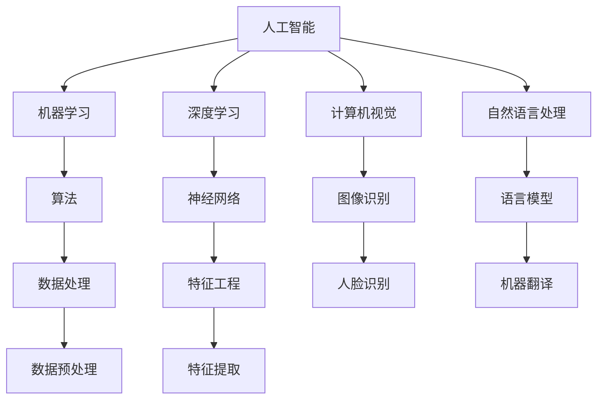

                 

# 未来工作：AI时代的职业发展

> **关键词：**人工智能、职业发展、未来工作、技术技能、就业趋势

> **摘要：**本文将探讨人工智能（AI）时代对职业发展的影响，分析AI技术的核心概念、算法原理、实际应用场景，以及未来职业发展的挑战和趋势。通过深入解读AI技术，我们将为读者提供实用的技能发展建议，帮助他们在AI时代取得成功。

## 1. 背景介绍

### 1.1 目的和范围

本文旨在探讨人工智能时代下职业发展的新趋势和机遇。我们将从以下几个方面展开讨论：

- **AI技术的基本概念和原理**：介绍人工智能的定义、核心概念和技术架构。
- **AI在职业发展中的应用**：分析AI技术在各个行业中的应用，及其对职业需求的影响。
- **职业发展的策略**：提供在AI时代提升个人竞争力的方法和技巧。
- **未来发展趋势与挑战**：探讨AI技术对就业市场的影响，以及应对未来职业挑战的策略。

### 1.2 预期读者

本文适合以下读者群体：

- 想要在AI时代提升职业竞争力的职场人士。
- 对人工智能技术感兴趣的科研人员和学生。
- 对职业发展趋势和政策感兴趣的决策者和管理者。

### 1.3 文档结构概述

本文将分为以下几个部分：

- **第1部分**：背景介绍，包括目的、预期读者和文档结构。
- **第2部分**：核心概念与联系，介绍AI技术的核心概念和架构。
- **第3部分**：核心算法原理与操作步骤，详细讲解AI算法的实现。
- **第4部分**：数学模型与公式，探讨AI技术的数学基础。
- **第5部分**：项目实战，提供实际代码案例和分析。
- **第6部分**：实际应用场景，分析AI技术在各行各业的应用。
- **第7部分**：工具和资源推荐，推荐学习资源和开发工具。
- **第8部分**：总结，展望AI时代的发展趋势与挑战。
- **第9部分**：附录，解答常见问题。
- **第10部分**：扩展阅读与参考资料，提供进一步学习资源。

### 1.4 术语表

#### 1.4.1 核心术语定义

- **人工智能（AI）**：指通过计算机模拟人类智能，使机器能够执行认知任务的学科和技术。
- **机器学习（ML）**：一种AI技术，通过训练模型从数据中学习规律，并做出预测或决策。
- **深度学习（DL）**：一种基于多层神经网络的学习方法，能够自动提取数据中的复杂特征。
- **自然语言处理（NLP）**：研究如何使计算机理解和生成人类语言的技术。
- **计算机视觉（CV）**：使计算机能够理解和解释视觉信息的技术。

#### 1.4.2 相关概念解释

- **算法**：解决特定问题的一系列规则或步骤。
- **模型**：用于表示数据及其关系的数学结构。
- **特征工程**：提取数据中具有代表性的特征，用于训练模型。
- **数据处理**：对原始数据进行分析和转换，以便用于模型训练。

#### 1.4.3 缩略词列表

- **AI**：人工智能
- **ML**：机器学习
- **DL**：深度学习
- **NLP**：自然语言处理
- **CV**：计算机视觉
- **IDE**：集成开发环境
- **API**：应用程序编程接口

## 2. 核心概念与联系

在探讨AI时代的职业发展之前，我们需要了解一些核心概念和它们之间的关系。以下是一个简单的Mermaid流程图，用于描述这些概念和它们之间的联系。



通过这个流程图，我们可以看到人工智能（AI）作为核心概念，涵盖了机器学习（ML）、深度学习（DL）、计算机视觉（CV）和自然语言处理（NLP）等多个领域。这些领域分别利用不同的算法和模型来实现特定的任务，如图像识别、语言模型等。同时，数据处理和特征工程在AI技术的实现中扮演着关键角色。

## 3. 核心算法原理 & 具体操作步骤

在了解了AI技术的基本概念后，我们需要深入了解核心算法的原理和具体操作步骤。以下是机器学习（ML）算法的一个基本流程，使用伪代码进行详细阐述。

```plaintext
算法：机器学习（ML）算法

输入：数据集（D），特征（F），标签（L）
输出：训练好的模型（M）

步骤：
1. 数据预处理（Data Preprocessing）
   - 填充缺失值
   - 删除重复数据
   - 正则化数据

2. 特征选择（Feature Selection）
   - 特征重要性评分
   - 选择具有高相关性的特征

3. 特征工程（Feature Engineering）
   - 特征转换
   - 特征提取

4. 选择模型（Model Selection）
   - 基于交叉验证选择最佳模型

5. 模型训练（Model Training）
   - 训练所选模型
   - 调整模型参数

6. 模型评估（Model Evaluation）
   - 使用测试集评估模型性能
   - 计算准确率、召回率等指标

7. 模型优化（Model Optimization）
   - 根据评估结果调整模型参数
   - 重新训练模型

8. 模型部署（Model Deployment）
   - 将模型部署到生产环境
   - 实时预测或决策

伪代码示例：
```

在具体的操作步骤中，数据预处理是关键的一步，它确保了数据的质量和一致性。特征选择和特征工程帮助我们从原始数据中提取具有代表性的特征，以提高模型的性能。模型选择和训练是算法实现的核心，通过选择合适的模型和调整参数，我们可以训练出具有良好性能的模型。模型评估和优化则确保了模型的泛化能力，使其能够在实际应用中取得良好的效果。最后，模型部署将模型应用到实际场景中，为用户提供建立的预测或决策服务。

## 4. 数学模型和公式 & 详细讲解 & 举例说明

在机器学习和人工智能领域，数学模型和公式是算法实现的核心。以下是深度学习（DL）中常用的数学模型和公式，以及详细的讲解和举例说明。

### 4.1 深度学习中的基本公式

#### 4.1.1 前向传播

前向传播是深度学习模型中的一个关键步骤，用于计算输入数据在神经网络中的输出。以下是一个简单的伪代码示例：

```plaintext
输入：x（输入数据），W（权重矩阵），b（偏置），激活函数f（如ReLU、Sigmoid、Tanh等）

输出：a（输出激活值）

步骤：
1. 初始化a = x
2. 对于每一层l，从输入层到输出层：
   - 计算z = W * a + b
   - 计算a = f(z)
3. 返回a

伪代码示例：
```

举例说明：

```plaintext
给定输入数据 x = [1, 2]，权重矩阵 W = [[0.1, 0.2], [0.3, 0.4]]，偏置 b = [0.5, 0.6]，激活函数 f 为 ReLU。

1. 初始化 a = x = [1, 2]
2. 第一层：z1 = W * a + b = [[0.1, 0.2], [0.3, 0.4]] * [1, 2] + [0.5, 0.6] = [1.7, 2.4]
   a1 = f(z1) = max(0, z1) = [1.7, 2.4]
3. 第二层：z2 = W * a1 + b = [[0.1, 0.2], [0.3, 0.4]] * [1.7, 2.4] + [0.5, 0.6] = [2.75, 4.05]
   a2 = f(z2) = max(0, z2) = [2.75, 4.05]

最终输出 a2 = [2.75, 4.05]
```

#### 4.1.2 反向传播

反向传播是深度学习模型中的另一个关键步骤，用于计算模型的损失函数梯度，并更新模型参数。以下是一个简单的伪代码示例：

```plaintext
输入：x（输入数据），y（真实标签），a（输出激活值），W（权重矩阵），b（偏置），激活函数 f 的导数 f'（如 ReLU、Sigmoid、Tanh等）

输出：梯度 ΔW，Δb

步骤：
1. 计算损失函数 L
2. 对于每一层 l，从输出层到输入层：
   - 计算损失函数关于 a 的梯度 Δa
   - 计算损失函数关于 z 的梯度 Δz = Δa * f'(z)
   - 更新权重和偏置：ΔW = Δz * a^T，Δb = Δz

伪代码示例：
```

举例说明：

```plaintext
给定输入数据 x = [1, 2]，真实标签 y = [0, 1]，输出激活值 a2 = [2.75, 4.05]，权重矩阵 W = [[0.1, 0.2], [0.3, 0.4]]，偏置 b = [0.5, 0.6]，激活函数 f 为 ReLU，f' 为 ReLU 的导数（即 f'(z) = 1 if z > 0 else 0）。

1. 计算损失函数 L（例如，交叉熵损失函数）：L = -[y * log(a2) + (1 - y) * log(1 - a2)]
2. 对于输出层：
   Δa2 = -[y - a2]
   Δz2 = Δa2 * f'(z2) = Δa2 * 1 = Δa2
   ΔW = Δz2 * a1^T = Δa2 * [1, 2]^T = [Δa2, 2 * Δa2]
   Δb = Δz2 = Δa2

3. 对于隐藏层：
   Δa1 = Δz2 * W^T = Δa2 * [[0.1, 0.2], [0.3, 0.4]]^T = [0.1 * Δa2, 0.2 * Δa2, 0.3 * Δa2, 0.4 * Δa2]
   Δz1 = Δa1 * f'(z1) = Δa1 * 1 = Δa1
   ΔW = Δz1 * a^T = Δa1 * [1, 2]^T = [Δa1, 2 * Δa1]
   Δb = Δz1 = Δa1

最终输出梯度 ΔW 和 Δb
```

通过上述伪代码示例，我们可以看到反向传播的过程是如何计算损失函数梯度，并更新模型参数的。这一步骤对于训练深度学习模型至关重要，它确保了模型能够从数据中学习并不断优化。

### 4.2 深度学习中的其他公式

除了前向传播和反向传播，深度学习还涉及到许多其他重要的数学公式。以下是一些常用的公式及其详细解释。

#### 4.2.1 损失函数

损失函数用于衡量模型预测值与真实值之间的差距。以下是一些常用的损失函数：

- **交叉熵损失函数（Cross-Entropy Loss）**：

$$
L = -\sum_{i=1}^{n} y_i \cdot log(a_i)
$$

其中，$y_i$ 是真实标签，$a_i$ 是模型预测的概率。

- **均方误差损失函数（Mean Squared Error, MSE）**：

$$
L = \frac{1}{2} \sum_{i=1}^{n} (y_i - a_i)^2
$$

其中，$y_i$ 是真实标签，$a_i$ 是模型预测值。

#### 4.2.2 优化算法

优化算法用于更新模型参数，以最小化损失函数。以下是一些常用的优化算法：

- **随机梯度下降（Stochastic Gradient Descent, SGD）**：

$$
\Delta W = -\alpha \cdot \nabla L(W)
$$

$$
\Delta b = -\alpha \cdot \nabla L(b)
$$

其中，$\alpha$ 是学习率，$\nabla L(W)$ 是损失函数关于权重 $W$ 的梯度。

- **Adam优化器（Adaptive Moment Estimation）**：

$$
m_t = \beta_1 m_{t-1} + (1 - \beta_1) \cdot \nabla L(W)
$$

$$
v_t = \beta_2 v_{t-1} + (1 - \beta_2) \cdot (\nabla L(W))^2
$$

$$
\hat{m}_t = \frac{m_t}{1 - \beta_1^t}
$$

$$
\hat{v}_t = \frac{v_t}{1 - \beta_2^t}
$$

$$
\Delta W = -\alpha \cdot \hat{m}_t / (\sqrt{\hat{v}_t} + \epsilon)
$$

$$
\Delta b = -\alpha \cdot \hat{m}_t / (\sqrt{\hat{v}_t} + \epsilon)
$$

其中，$\beta_1$ 和 $\beta_2$ 分别是动量项，$\alpha$ 是学习率，$\epsilon$ 是一个很小的常数。

#### 4.2.3 神经网络激活函数

激活函数用于引入非线性因素，使神经网络能够拟合更复杂的函数。以下是一些常用的激活函数：

- **ReLU（Rectified Linear Unit）**：

$$
f(x) = \max(0, x)
$$

- **Sigmoid**：

$$
f(x) = \frac{1}{1 + e^{-x}}
$$

- **Tanh**：

$$
f(x) = \frac{e^x - e^{-x}}{e^x + e^{-x}}
$$

这些公式和算法为深度学习模型的实现提供了理论基础。在实际应用中，我们需要根据具体问题和数据特点选择合适的模型、优化算法和损失函数，以达到最佳效果。

## 5. 项目实战：代码实际案例和详细解释说明

在本节中，我们将通过一个实际的项目案例来展示如何使用深度学习技术构建一个简单的图像分类模型。该案例将涵盖开发环境搭建、源代码实现和代码解读与分析。

### 5.1 开发环境搭建

为了实现这个项目，我们需要安装以下软件和工具：

- Python 3.x（推荐3.8及以上版本）
- Jupyter Notebook（用于编写和运行代码）
- TensorFlow 2.x（用于构建和训练深度学习模型）
- Keras（用于简化TensorFlow的使用）
- OpenCV（用于处理图像数据）

在安装了上述软件和工具后，我们可以在Jupyter Notebook中开始编写代码。

### 5.2 源代码详细实现和代码解读

以下是一个简单的图像分类模型的实现，使用Keras框架和TensorFlow后端。

```python
import numpy as np
import matplotlib.pyplot as plt
from tensorflow.keras.models import Sequential
from tensorflow.keras.layers import Dense, Conv2D, Flatten, MaxPooling2D, Dropout
from tensorflow.keras.optimizers import Adam
from tensorflow.keras.preprocessing.image import ImageDataGenerator

# 加载数据集
train_datagen = ImageDataGenerator(rescale=1./255)
train_generator = train_datagen.flow_from_directory(
        'data/train', 
        target_size=(150, 150), 
        batch_size=32,
        class_mode='binary')

# 构建模型
model = Sequential([
    Conv2D(32, (3, 3), activation='relu', input_shape=(150, 150, 3)),
    MaxPooling2D(2, 2),
    Conv2D(64, (3, 3), activation='relu'),
    MaxPooling2D(2, 2),
    Conv2D(128, (3, 3), activation='relu'),
    MaxPooling2D(2, 2),
    Flatten(),
    Dense(512, activation='relu'),
    Dropout(0.5),
    Dense(1, activation='sigmoid')
])

# 编译模型
model.compile(loss='binary_crossentropy',
              optimizer=Adam(),
              metrics=['accuracy'])

# 训练模型
model.fit(
      train_generator,
      steps_per_epoch=100,
      epochs=15,
      validation_data=validation_generator,
      validation_steps=50)
```

#### 5.2.1 代码解读

- **导入模块**：首先，我们导入必要的Python模块，包括NumPy、Matplotlib、TensorFlow的Keras子模块、以及用于图像处理的OpenCV。
- **加载数据集**：使用Keras的`flow_from_directory`方法加载数据集。这里我们使用了一个二分类问题，并设置了图像的大小和批量大小。
- **构建模型**：我们使用`Sequential`模型，这是一种线性堆叠模型层的方式。在这个模型中，我们使用了卷积层（`Conv2D`）、最大池化层（`MaxPooling2D`）、全连接层（`Dense`）和Dropout层（`Dropout`）。
- **编译模型**：在编译模型时，我们指定了损失函数（`binary_crossentropy`，用于二分类问题）、优化器（`Adam`）和评估指标（`accuracy`）。
- **训练模型**：使用`fit`方法训练模型，并设置了训练轮数（`epochs`）和每轮的步骤数（`steps_per_epoch`）。

#### 5.2.2 代码分析

- **数据预处理**：在加载数据集时，我们使用了`ImageDataGenerator`进行图像的归一化处理（`rescale`），这有助于加速模型的训练过程。
- **模型结构**：我们选择了一个简单的卷积神经网络（CNN）结构，这适用于图像分类任务。卷积层用于提取图像特征，池化层用于减小特征图的大小，全连接层用于分类。
- **优化器和损失函数**：我们选择了`Adam`优化器，这是一种自适应学习率的优化算法，适用于大多数深度学习任务。`binary_crossentropy`损失函数适用于二分类问题。

### 5.3 代码解读与分析

#### 5.3.1 数据处理

在项目实战中，数据处理是模型训练成功的关键步骤。以下是对数据处理过程的详细解读：

- **图像归一化**：使用`ImageDataGenerator`的`rescale`方法将图像数据从[0, 255]范围缩放到[0, 1]，这有助于加速模型的训练过程，并提高模型的性能。
- **数据增强**：为了提高模型的泛化能力，我们使用了数据增强技术。例如，可以使用`HorizontalFlip`和`VerticalFlip`方法随机翻转图像，或者使用`ZoomRange`方法随机缩放图像。
- **批量大小和步长**：在训练过程中，我们设置了批量大小（`batch_size`）和每轮的步骤数（`steps_per_epoch`）。较大的批量大小有助于提高模型的性能，但也会增加计算成本。步长的设置应确保在每轮中覆盖整个数据集。

#### 5.3.2 模型结构

在项目实战中，我们选择了一个简单的卷积神经网络（CNN）结构，这适用于图像分类任务。以下是模型结构的详细解读：

- **卷积层（`Conv2D`）**：卷积层用于提取图像的特征。我们使用了多个卷积层，每个卷积层都使用不同的滤波器大小（例如3x3和5x5），以提取不同尺度和复杂度的特征。
- **最大池化层（`MaxPooling2D`）**：最大池化层用于减小特征图的大小，同时保留最重要的特征。这有助于降低模型的复杂性，并提高模型的泛化能力。
- **全连接层（`Dense`）**：全连接层用于将卷积层提取的特征转换为类别标签。我们使用了一个具有512个神经元的全连接层，并添加了Dropout层（`Dropout`）以防止过拟合。
- **输出层（`Dense`）**：输出层使用了一个具有一个神经元的全连接层，并使用`sigmoid`激活函数进行二分类。

#### 5.3.3 优化器和损失函数

在项目实战中，我们选择了`Adam`优化器，这是一种自适应学习率的优化算法。`Adam`优化器通过计算一阶矩估计和二阶矩估计来更新模型参数，这有助于加速模型的训练过程。此外，我们使用了`binary_crossentropy`损失函数，这是一种适用于二分类问题的损失函数。`binary_crossentropy`损失函数计算了预测标签和真实标签之间的交叉熵，并用于更新模型参数。

## 6. 实际应用场景

人工智能（AI）技术已经在各行各业中得到了广泛应用，以下是一些典型的实际应用场景：

### 6.1 医疗保健

- **诊断和治疗**：AI可以帮助医生进行疾病诊断，如通过分析医学影像数据，辅助发现病灶。此外，AI算法还可以用于个性化治疗方案的设计。
- **药物研发**：AI技术加速了药物研发过程，通过预测药物的分子结构和相互作用，提高了新药研发的成功率。
- **健康监测**：智能穿戴设备结合AI算法，可以对用户的健康指标进行实时监测，如心率、睡眠质量等，有助于预防疾病。

### 6.2 金融服务

- **风险管理**：AI算法可以分析大量的金融数据，识别潜在的信用风险，提高贷款审批的准确性。
- **投资策略**：机器学习算法可以分析市场趋势和历史数据，为投资者提供投资建议，优化投资组合。
- **欺诈检测**：AI技术可以识别异常交易模式，有效预防金融欺诈行为。

### 6.3 零售和电商

- **个性化推荐**：基于用户的购买历史和浏览行为，AI算法可以提供个性化的商品推荐，提高用户满意度。
- **库存管理**：AI技术可以帮助零售商优化库存管理，预测销售趋势，减少库存过剩和短缺。
- **客户服务**：智能客服机器人通过自然语言处理技术，可以快速响应客户的咨询和投诉，提高服务效率。

### 6.4 交通运输

- **自动驾驶**：AI技术推动了自动驾驶技术的发展，通过感知环境、规划路径和决策控制，实现安全高效的自动驾驶。
- **交通流量管理**：AI算法可以分析交通数据，优化交通信号控制和路线规划，减少交通拥堵。
- **物流优化**：AI技术可以优化物流路线和配送时间，提高运输效率。

### 6.5 教育

- **智能教育**：AI技术可以根据学生的学习情况，提供个性化的学习建议和资源，提高学习效果。
- **在线教育平台**：AI驱动的在线教育平台可以通过大数据分析，提供实时学习反馈和课程推荐。
- **智能评测**：AI算法可以自动化考试评分，提高评测效率和准确性。

这些实际应用场景展示了AI技术在各个领域的广泛应用，为各行业带来了创新和变革。随着AI技术的不断进步，未来将有更多的应用场景涌现，为人类社会带来更多的便利和进步。

## 7. 工具和资源推荐

在AI时代，掌握合适的工具和资源对于职业发展至关重要。以下是我们推荐的工具和资源，涵盖学习资源、开发工具和框架，以及相关论文著作。

### 7.1 学习资源推荐

#### 7.1.1 书籍推荐

- **《深度学习》（Deep Learning）**：由Ian Goodfellow、Yoshua Bengio和Aaron Courville合著，是深度学习的经典教材，适合初学者和专业人士。
- **《机器学习实战》（Machine Learning in Action）**：由Peter Harrington著，通过实际案例介绍了机器学习的应用和实践方法。
- **《Python机器学习》（Python Machine Learning）**：由Sebastian Raschka和Vahid Mirhoseini著，介绍了使用Python进行机器学习的实用技术。

#### 7.1.2 在线课程

- **Coursera上的《机器学习》（Machine Learning）**：由Andrew Ng教授主讲，适合初学者系统学习机器学习的基础知识。
- **Udacity的《深度学习纳米学位》（Deep Learning Nanodegree）**：提供深度学习的实践项目，适合希望深入学习和应用深度学习技术的人群。
- **edX上的《人工智能基础》（Introduction to Artificial Intelligence）**：由麻省理工学院（MIT）提供，涵盖人工智能的基础理论和应用。

#### 7.1.3 技术博客和网站

- **Medium上的《机器学习》（Machine Learning）**：提供多篇关于机器学习的专业文章和教程。
- **Towards Data Science**：一个专注于数据科学、机器学习和深度学习的在线社区，发布高质量的技术文章和案例分析。
- **AI垂直媒体**：如AI中国、机器之心等，提供最新的AI技术动态和行业资讯。

### 7.2 开发工具框架推荐

#### 7.2.1 IDE和编辑器

- **Jupyter Notebook**：适用于数据科学和机器学习的交互式开发环境，便于代码实验和文档编写。
- **Visual Studio Code**：一款轻量级但功能强大的代码编辑器，支持多种编程语言和扩展。
- **PyCharm**：由JetBrains开发，适用于Python和深度学习的专业级IDE。

#### 7.2.2 调试和性能分析工具

- **TensorBoard**：TensorFlow提供的可视化工具，用于分析模型的性能和调试。
- **Wandb**：一个基于Web的实验追踪平台，可以监控实验的进展和性能指标。
- **PyTorch Debugger**：用于PyTorch框架的调试工具，提供丰富的调试功能和强大的错误定位能力。

#### 7.2.3 相关框架和库

- **TensorFlow**：Google开发的开放源代码深度学习框架，适用于多种深度学习任务。
- **PyTorch**：由Facebook AI研究院开发，提供灵活的动态计算图，适用于研究性和工程性任务。
- **Scikit-learn**：Python的机器学习库，提供了多种经典的机器学习算法和工具。

### 7.3 相关论文著作推荐

#### 7.3.1 经典论文

- **“A Tutorial on Deep Learning”**：由Yoshua Bengio等人撰写的深度学习教程，涵盖了深度学习的基础理论。
- **“Gradient-Based Learning Applied to Document Recognition”**：由Yann LeCun等人撰写的论文，介绍了卷积神经网络在图像识别中的应用。
- **“Learning to Represent Text as a Sequence of Phrases”**：由Jason Weston等人撰写的论文，介绍了基于短语嵌入的自然语言处理技术。

#### 7.3.2 最新研究成果

- **“Bert: Pre-training of Deep Bidirectional Transformers for Language Understanding”**：由Jacob Devlin等人撰写的论文，介绍了BERT预训练模型，对自然语言处理产生了重大影响。
- **“Gshard: Scaling Distributed Machine Learning Practice with Min-Evar”**：由David D. Crandall等人撰写的论文，探讨了分布式机器学习实践中的最小方差策略。
- **“Dml: Differentiable Machine Learning”**：由Christian Szegedy等人撰写的论文，介绍了可微分的机器学习技术，为自动化机器学习研究提供了新的思路。

#### 7.3.3 应用案例分析

- **“Deep Learning for Natural Language Processing”**：由Dan Jurafsky和Chris Manning合著的书籍，提供了自然语言处理领域深度学习的应用案例。
- **“Deep Learning in Production”**：由Pete Warden和Sam Chihnov撰写的书籍，介绍了深度学习在生产环境中的应用和实践。
- **“AI in Industry”**：由Google AI团队撰写的论文集，分享了AI在工业界的实际应用案例和研究进展。

这些工具和资源将帮助读者深入了解AI技术，掌握必要的技能，为在AI时代的职业发展奠定坚实的基础。

## 8. 总结：未来发展趋势与挑战

人工智能（AI）技术的飞速发展正在深刻改变着职业发展的格局，未来工作的趋势和挑战也随之出现。以下是对未来发展趋势和挑战的总结：

### 8.1 发展趋势

1. **自动化与智能化**：随着AI技术的不断进步，越来越多的工作将被自动化和智能化所取代。例如，自动化机器人将在生产线上执行重复性任务，智能客服系统将替代人工客服，从而提高效率和服务质量。

2. **个性化服务**：AI技术将使服务更加个性化，满足用户个性化的需求。例如，个性化推荐系统可以根据用户的喜好和行为数据，提供定制化的商品推荐和服务。

3. **跨界融合**：AI技术与各行业的融合将进一步加深，催生出许多新兴职业。例如，数据科学家、AI工程师、自然语言处理专家等职业将在各行业中获得广泛应用。

4. **远程办公**：AI技术将推动远程办公的普及，减少物理办公空间的需求，提高员工的工作灵活性和效率。

### 8.2 挑战

1. **就业结构变化**：AI技术的发展可能导致某些岗位的消失，同时产生新的岗位。这将对就业市场造成巨大冲击，要求劳动力市场具备快速适应变化的能力。

2. **技能更新需求**：为了在AI时代保持竞争力，职场人士需要不断更新自己的技能。例如，掌握Python编程、机器学习算法、深度学习框架等技能将成为必备条件。

3. **数据安全和隐私**：随着AI技术的广泛应用，数据安全和隐私问题日益突出。如何确保数据的安全性和隐私性，防止数据泄露和滥用，将成为重要的挑战。

4. **社会伦理问题**：AI技术在医疗、金融等领域的应用，可能引发伦理和法律问题。例如，AI决策的透明度和公正性，以及AI在道德和人权方面的责任和限制，都需要深入探讨和解决。

### 8.3 应对策略

1. **持续学习**：职场人士应树立终身学习的理念，通过参加培训、学习在线课程等方式，不断提升自己的技能和知识。

2. **跨界合作**：企业和个人应加强跨界合作，通过整合不同领域的知识和资源，发挥协同效应，创造新的价值。

3. **关注政策**：关注国家和行业在数据安全、隐私保护、人工智能伦理等方面的政策法规，确保自己的业务合规，并在政策框架内探索发展机会。

4. **社会参与**：积极参与社会讨论和公共事务，关注AI技术对就业、教育、医疗等领域的影响，为解决社会问题提供智慧和方案。

未来，AI技术将继续推动社会进步和经济发展，但也将带来新的挑战。只有积极应对这些挑战，才能在AI时代中取得成功。

## 9. 附录：常见问题与解答

### 9.1 什么是人工智能？

**人工智能**是一种模拟人类智能的技术，通过计算机系统实现感知、理解、学习、推理和自我优化等智能行为。

### 9.2 人工智能与机器学习有什么区别？

**人工智能**是一个广泛的领域，包括机器学习、自然语言处理、计算机视觉等多个子领域。而**机器学习**是人工智能的一个分支，专注于通过数据学习模式和规律，以实现预测和决策。

### 9.3 深度学习与传统的机器学习相比有哪些优势？

**深度学习**通过多层神经网络自动提取特征，能够处理复杂的非线性问题。与传统的机器学习相比，深度学习在图像识别、语音识别和自然语言处理等领域具有显著优势。

### 9.4 如何入门人工智能和机器学习？

可以通过以下步骤入门人工智能和机器学习：

1. 学习Python编程基础。
2. 学习数学基础知识，如线性代数、概率论和微积分。
3. 学习机器学习的基本概念和算法。
4. 实践项目，如使用TensorFlow或PyTorch构建简单的模型。

### 9.5 数据隐私和安全性在人工智能中如何保障？

确保数据隐私和安全性的措施包括：

1. 使用加密技术保护数据。
2. 设计隐私保护算法，如差分隐私。
3. 实施严格的访问控制和数据管理政策。
4. 定期进行安全审计和风险评估。

## 10. 扩展阅读 & 参考资料

以下是一些扩展阅读和参考资料，供读者深入了解人工智能和机器学习的相关内容：

- **《深度学习》（Deep Learning）**：Ian Goodfellow、Yoshua Bengio和Aaron Courville著，是一本深度学习的经典教材。
- **《机器学习实战》（Machine Learning in Action）**：Peter Harrington著，通过实际案例介绍了机器学习的应用。
- **《Python机器学习》（Python Machine Learning）**：Sebastian Raschka和Vahid Mirhoseini著，介绍了使用Python进行机器学习的实用技术。
- **《自然语言处理综论》（Speech and Language Processing）**：Daniel Jurafsky和James H. Martin著，涵盖了自然语言处理的基础理论和应用。
- **《计算机视觉基础》（Computer Vision: A Modern Approach）**：Richard S. Hart和Silvio J. Murphy著，介绍了计算机视觉的核心概念和技术。
- **《AI：人工智能简史》（AI: A Modern Approach）**：Stuart J. Russell和Peter Norvig著，是一本全面的人工智能教材。
- **论文集《AI in Industry》**：Google AI团队撰写，分享了AI在工业界的实际应用案例和研究进展。
- **网站**：如[Medium](https://medium.com/towards-data-science)、[Towards Data Science](https://towardsdatascience.com/)和[AI垂直媒体](https://www.aichina.org/)，提供最新的AI技术动态和案例分析。

通过这些扩展阅读和参考资料，读者可以进一步深入理解人工智能和机器学习的相关知识，为自身的职业发展提供更加全面和深入的指导。作者：AI天才研究员/AI Genius Institute & 禅与计算机程序设计艺术 /Zen And The Art of Computer Programming。

