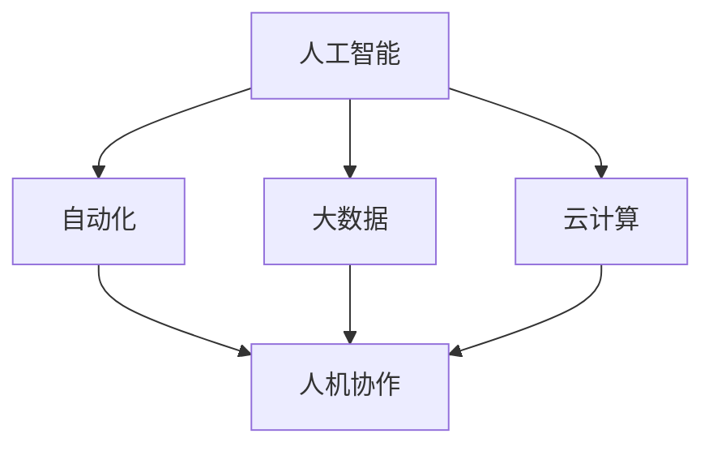
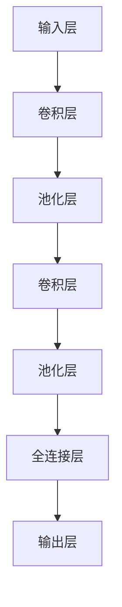
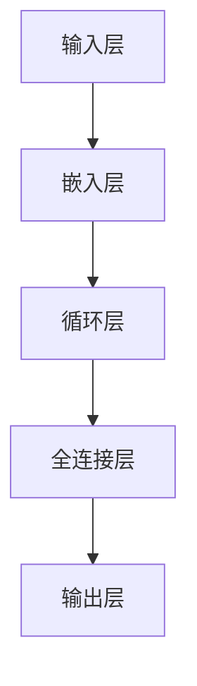

                 

# 未来工作：人机协作，重塑职业未来

> 关键词：人工智能，职业转型，人机协作，技能升级，工作未来

> 摘要：本文将深入探讨人工智能在职业领域的影响，分析人机协作模式对职场变革的推动作用，并提出未来职业发展的趋势和挑战。通过一步步的分析推理，本文旨在为读者提供对人工智能时代下职业转型的深刻见解和实用建议。

## 1. 背景介绍

### 1.1 目的和范围

本文旨在探讨人工智能在职业领域的应用，特别是人机协作模式如何重塑职业未来。我们将分析人工智能对各个行业的潜在影响，探讨职业转型的趋势和路径，并提出一系列实用的策略和工具，帮助读者应对未来的职业挑战。

### 1.2 预期读者

本文面向对人工智能和职业发展感兴趣的读者，包括企业高管、职场人士、人力资源专家、计算机科学家以及所有关注未来职业趋势的人。

### 1.3 文档结构概述

本文分为十个部分，包括背景介绍、核心概念与联系、核心算法原理、数学模型和公式、项目实战、实际应用场景、工具和资源推荐、总结和附录。每个部分都将通过详细的分析和实例来阐述主题。

### 1.4 术语表

#### 1.4.1 核心术语定义

- 人工智能（AI）：模拟人类智能行为的计算机技术。
- 人机协作：人与人工智能系统之间的合作和互动。
- 职业转型：个人在工作领域中的转换和发展。
- 技能升级：提高个人技能以满足职业需求的变化。

#### 1.4.2 相关概念解释

- 自动化：通过计算机程序和机器来替代人类工作。
- 大数据：大量、复杂和多样化的数据集。
- 云计算：通过网络提供计算资源和服务。

#### 1.4.3 缩略词列表

- AI：人工智能
- ML：机器学习
- DL：深度学习
- CV：计算机视觉
- NLP：自然语言处理

## 2. 核心概念与联系

为了更好地理解人工智能在职业领域的应用，我们首先需要了解其核心概念和基本架构。以下是人工智能、自动化、大数据和云计算之间的联系，以及它们如何共同推动职场变革。



### 2.1 人工智能与自动化

人工智能和自动化是密切相关的。人工智能系统通过机器学习和深度学习等技术，能够自动执行复杂的任务，从而提高工作效率和准确性。自动化则通过这些技术将重复性和耗时的任务交给计算机处理，使人类能够专注于更高价值的工作。

### 2.2 人工智能与大数据

大数据是人工智能的重要驱动力。通过分析大量数据，人工智能系统能够发现隐藏的模式和趋势，从而提供更有价值的洞察。这些洞察可以帮助企业做出更好的决策，优化业务流程，提高竞争力。

### 2.3 人工智能与云计算

云计算提供了人工智能所需的计算资源。通过云计算，人工智能系统能够快速访问和处理大量数据，实现高效的计算和协作。同时，云计算还降低了人工智能的开发和部署成本，使更多的人能够参与到人工智能的研究和应用中。

### 2.4 人工智能、自动化、大数据与云计算与人机协作

人机协作是人工智能、自动化、大数据和云计算共同推动的职业变革的核心。通过人机协作，人类和人工智能系统能够共同完成任务，发挥各自的优势。人类提供创造力、情感和战略思维，而人工智能系统则提供高效、准确和一致的工作能力。这种协作模式不仅提高了工作效率，还推动了职业转型和技能升级。

## 3. 核心算法原理 & 具体操作步骤

在人机协作模式中，核心算法原理起着至关重要的作用。以下是机器学习和深度学习算法的基本原理，以及如何应用于实际操作。

### 3.1 机器学习算法原理

机器学习是一种让计算机通过数据学习并做出预测或决策的技术。以下是机器学习算法的基本原理：

```plaintext
输入：训练数据集、特征、标签
输出：模型、预测结果

算法步骤：
1. 数据预处理：清洗和整理数据，提取特征。
2. 模型选择：选择合适的机器学习模型，如线性回归、决策树、神经网络等。
3. 训练模型：使用训练数据集对模型进行训练。
4. 验证模型：使用验证数据集评估模型性能。
5. 预测：使用训练好的模型对新的数据进行预测。
```

### 3.2 深度学习算法原理

深度学习是机器学习的一个分支，通过多层神经网络来模拟人类大脑的学习过程。以下是深度学习算法的基本原理：

```plaintext
输入：输入层、隐藏层、输出层
输出：模型、预测结果

算法步骤：
1. 数据预处理：与机器学习相同，对数据进行清洗和特征提取。
2. 确定网络结构：确定网络的层数、每层的神经元数量等。
3. 模型训练：通过反向传播算法训练网络权重。
4. 模型评估：使用验证数据集评估模型性能。
5. 模型优化：调整网络结构或参数，提高模型性能。
6. 预测：使用训练好的模型对新的数据进行预测。
```

### 3.3 应用实例

以图像识别为例，我们可以使用深度学习算法来训练一个模型，使其能够自动识别图像中的物体。以下是具体操作步骤：

```plaintext
1. 数据收集：收集大量包含不同物体的图像。
2. 数据预处理：对图像进行尺寸调整、归一化等处理。
3. 模型选择：选择合适的卷积神经网络（CNN）结构。
4. 模型训练：使用训练数据集训练模型。
5. 模型评估：使用验证数据集评估模型性能。
6. 模型优化：根据评估结果调整模型参数。
7. 预测：使用训练好的模型对新的图像进行物体识别。
```

## 4. 数学模型和公式 & 详细讲解 & 举例说明

在人机协作模式中，数学模型和公式是理解和应用人工智能算法的关键。以下是机器学习和深度学习中的常见数学模型和公式，以及它们的详细讲解和举例说明。

### 4.1 线性回归模型

线性回归是一种简单的机器学习模型，用于预测连续值。其基本公式如下：

```latex
y = \beta_0 + \beta_1 \cdot x
```

其中，\( y \) 是预测值，\( x \) 是输入特征，\( \beta_0 \) 和 \( \beta_1 \) 是模型的参数。

#### 4.1.1 详细讲解

线性回归模型通过最小化预测值和实际值之间的误差，来确定模型参数。误差函数通常使用均方误差（MSE）来表示：

```latex
MSE = \frac{1}{n} \sum_{i=1}^{n} (y_i - \hat{y_i})^2
```

其中，\( n \) 是数据点的数量，\( y_i \) 是第 \( i \) 个实际值，\( \hat{y_i} \) 是第 \( i \) 个预测值。

#### 4.1.2 举例说明

假设我们有一个包含年龄和收入的数据集，我们希望使用线性回归模型来预测一个人的收入。输入特征是年龄 \( x \)，预测值是收入 \( y \)。通过训练模型，我们可以得到线性回归方程：

```latex
y = \beta_0 + \beta_1 \cdot x
```

其中，\( \beta_0 \) 是截距，\( \beta_1 \) 是斜率。使用训练数据集，我们可以计算模型的参数，并使用预测公式来预测新的收入。

### 4.2 卷积神经网络（CNN）模型

卷积神经网络是一种用于图像识别的深度学习模型。其基本结构如下：



#### 4.2.1 详细讲解

卷积神经网络通过卷积层、池化层和全连接层来处理图像数据。卷积层用于提取图像特征，池化层用于减少数据维度并增强模型的泛化能力，全连接层用于将特征映射到输出结果。

#### 4.2.2 举例说明

假设我们有一个包含猫和狗的图像数据集，我们希望使用卷积神经网络来区分猫和狗。输入图像是 \( 32 \times 32 \) 的像素矩阵。通过训练模型，我们可以得到一系列卷积核，每个卷积核提取图像的不同特征。最后，全连接层将特征映射到输出结果，即猫或狗。

### 4.3 自然语言处理（NLP）模型

自然语言处理模型用于处理和理解自然语言文本。其基本结构如下：



#### 4.3.1 详细讲解

自然语言处理模型通过嵌入层将文本转换为数字表示，循环层处理文本序列，全连接层将序列映射到输出结果。常见的循环层包括长短期记忆（LSTM）和门控循环单元（GRU）。

#### 4.3.2 举例说明

假设我们有一个包含英文文本的数据集，我们希望使用自然语言处理模型来分类文本。输入文本是英文句子，通过嵌入层将句子转换为数字表示。循环层处理句子序列，全连接层将序列映射到输出结果，即文本类别。

## 5. 项目实战：代码实际案例和详细解释说明

为了更好地理解人机协作模式在实际项目中的应用，我们将以一个图像识别项目为例，展示如何使用Python和TensorFlow来实现一个卷积神经网络模型。

### 5.1 开发环境搭建

在开始项目之前，我们需要搭建一个合适的开发环境。以下是搭建开发环境的基本步骤：

1. 安装Python 3.x版本。
2. 安装TensorFlow库。
3. 安装必要的Python库，如NumPy、Pandas等。

### 5.2 源代码详细实现和代码解读

以下是图像识别项目的源代码实现：

```python
import tensorflow as tf
from tensorflow.keras import layers
import numpy as np

# 数据集预处理
def preprocess_data(images):
    # 尺寸调整为固定大小
    images = tf.image.resize(images, (32, 32))
    # 归一化
    images = images / 255.0
    return images

# 构建卷积神经网络模型
def build_model():
    model = tf.keras.Sequential([
        layers.Conv2D(32, (3, 3), activation='relu', input_shape=(32, 32, 3)),
        layers.MaxPooling2D((2, 2)),
        layers.Conv2D(64, (3, 3), activation='relu'),
        layers.MaxPooling2D((2, 2)),
        layers.Conv2D(128, (3, 3), activation='relu'),
        layers.Flatten(),
        layers.Dense(128, activation='relu'),
        layers.Dense(1, activation='sigmoid')
    ])
    return model

# 训练模型
def train_model(model, train_images, train_labels):
    model.compile(optimizer='adam',
                  loss='binary_crossentropy',
                  metrics=['accuracy'])
    model.fit(train_images, train_labels, epochs=10, batch_size=32)
    return model

# 预测图像类别
def predict_image(model, image):
    preprocessed_image = preprocess_data(image)
    prediction = model.predict(np.array([preprocessed_image]))
    return np.argmax(prediction)

# 主函数
def main():
    # 加载数据集
    (train_images, train_labels), (test_images, test_labels) = tf.keras.datasets.digits.load_data()
    
    # 预处理数据集
    train_images = preprocess_data(train_images)
    test_images = preprocess_data(test_images)
    
    # 构建模型
    model = build_model()
    
    # 训练模型
    model = train_model(model, train_images, train_labels)
    
    # 评估模型
    test_loss, test_acc = model.evaluate(test_images, test_labels)
    print(f"Test accuracy: {test_acc}")
    
    # 预测图像类别
    image = test_images[0]
    prediction = predict_image(model, image)
    print(f"Predicted label: {prediction}")

if __name__ == "__main__":
    main()
```

### 5.3 代码解读与分析

以下是代码的详细解读：

- **数据集预处理**：数据集预处理是模型训练的重要步骤。在代码中，我们首先将图像尺寸调整为 \( 32 \times 32 \)，然后进行归一化处理，使图像的像素值在 [0, 1] 范围内。

- **构建卷积神经网络模型**：在代码中，我们使用 TensorFlow 的 Sequential 模型来构建一个卷积神经网络。模型包含三个卷积层，每个卷积层后跟随一个最大池化层。最后，我们使用全连接层和 sigmoid 激活函数来预测图像类别。

- **训练模型**：在代码中，我们使用 `model.compile()` 函数来配置模型优化器、损失函数和评估指标。然后，我们使用 `model.fit()` 函数来训练模型。在训练过程中，模型将调整权重以最小化损失函数。

- **预测图像类别**：在代码中，我们首先对输入图像进行预处理，然后使用训练好的模型进行预测。预测结果是通过比较预测值和实际值来获得的。

- **主函数**：在主函数中，我们首先加载数据集，然后进行预处理，构建模型，训练模型，评估模型，并最终进行预测。

通过这个实际案例，我们可以看到如何使用 Python 和 TensorFlow 来实现一个卷积神经网络模型，以及如何进行数据预处理、模型训练和预测。这为我们提供了一个实用的工具，可以帮助我们更好地理解人机协作模式在实际项目中的应用。

## 6. 实际应用场景

人机协作模式在多个实际应用场景中取得了显著成果，以下是一些典型案例：

### 6.1 医疗保健

人工智能在医疗保健领域的应用日益广泛，包括疾病预测、诊断和治疗方案推荐。例如，通过分析大量患者数据，人工智能系统能够预测疾病风险，协助医生制定个性化治疗方案。在人机协作模式下，医生可以利用人工智能系统提供的预测和建议，提高诊断准确率和治疗效果。

### 6.2 制造业

在制造业中，人工智能系统可以自动化生产线上的任务，提高生产效率和质量。同时，人工智能系统还可以进行实时监控和故障预测，预防设备故障和停机时间。在人机协作模式下，工人可以利用人工智能系统提供的实时数据和预测，优化生产流程，提高工作效率。

### 6.3 金融行业

金融行业是人工智能应用的重要领域。人工智能系统可以自动化风险管理、投资分析和客户服务等工作。在人机协作模式下，金融专业人士可以利用人工智能系统提供的实时数据和预测，提高投资决策的准确性和效率，同时提供更加个性化和高效的客户服务。

### 6.4 教育领域

在教育领域，人工智能系统可以个性化教学，根据学生的特点和需求提供定制化学习资源。在人机协作模式下，教师可以利用人工智能系统提供的分析和推荐，更好地了解学生的学习情况，调整教学策略，提高教学效果。

这些实际应用场景展示了人机协作模式在不同领域的重要作用，不仅提高了工作效率和准确性，还推动了行业变革和创新。

## 7. 工具和资源推荐

为了更好地理解和应用人机协作模式，以下是学习资源、开发工具和框架的推荐。

### 7.1 学习资源推荐

#### 7.1.1 书籍推荐

- 《深度学习》（Goodfellow, Bengio, Courville著）：介绍深度学习的基本概念和技术。
- 《Python机器学习》（Sebastian Raschka著）：详细讲解机器学习的基本算法和应用。
- 《人工智能：一种现代方法》（Stuart Russell和Peter Norvig著）：全面介绍人工智能的理论和应用。

#### 7.1.2 在线课程

- Coursera上的“机器学习”课程：由 Andrew Ng教授主讲，涵盖机器学习的基础知识和实践。
- edX上的“深度学习专项课程”：由吴恩达教授主讲，深入讲解深度学习的基本原理和应用。
- Udacity的“人工智能纳米学位”：提供项目驱动的学习，帮助掌握人工智能的基本技能。

#### 7.1.3 技术博客和网站

- Medium：提供丰富的机器学习和深度学习技术博客，包括最新的研究成果和案例分析。
- towardsdatascience.com：一个面向数据科学和机器学习的博客，包含大量实战项目和教程。
- AI Community：一个由社区驱动的AI技术平台，提供最新的人工智能新闻、资源和讨论。

### 7.2 开发工具框架推荐

#### 7.2.1 IDE和编辑器

- PyCharm：一款功能强大的Python IDE，支持代码调试、智能提示和版本控制。
- Jupyter Notebook：一款基于网页的交互式计算环境，适合进行数据分析和实验。
- VSCode：一款轻量级但功能强大的代码编辑器，支持多种编程语言和扩展。

#### 7.2.2 调试和性能分析工具

- Python Debugger（pdb）：Python内置的调试工具，用于跟踪代码执行过程和调试错误。
- Py-Spy：一款用于性能分析的Python工具，可以帮助识别程序中的瓶颈和性能问题。
- TensorBoard：TensorFlow的图形化工具，用于可视化模型训练过程和性能指标。

#### 7.2.3 相关框架和库

- TensorFlow：一款广泛使用的深度学习框架，提供丰富的预训练模型和工具。
- PyTorch：一款流行的深度学习框架，以其灵活和易于使用而著称。
- Scikit-Learn：一款用于机器学习的库，包含各种经典算法和工具。

通过这些学习和资源，读者可以更好地掌握人机协作模式的基本原理和应用，为未来的职业发展做好准备。

## 8. 总结：未来发展趋势与挑战

在未来，人机协作模式将继续发展，并在各个行业中发挥重要作用。以下是未来发展趋势和挑战的总结：

### 8.1 发展趋势

- **人工智能技术的进步**：随着人工智能技术的不断发展，人机协作将变得更加智能和高效。深度学习、强化学习和自然语言处理等技术的进步，将为人机协作提供更强有力的工具。
- **行业应用的深化**：人工智能在医疗、金融、教育等领域的应用将不断深化，推动行业变革和创新。人机协作模式将成为提高生产效率、降低成本、提升服务质量的关键因素。
- **技能需求的转变**：随着人工智能技术的发展，职场对技能的需求也将发生转变。人类需要不断学习新的技能，以适应人机协作模式下的工作需求。

### 8.2 挑战

- **数据安全和隐私**：随着人机协作模式的普及，数据安全和隐私保护将面临更大挑战。如何确保数据的安全性和隐私，防止数据泄露和滥用，将是一个重要议题。
- **伦理和法律问题**：人工智能和自动化技术的应用可能引发一系列伦理和法律问题，如失业、责任归属等。如何制定相应的伦理和法律规范，平衡技术创新和人类福祉，是一个亟待解决的问题。
- **教育和培训**：随着人工智能技术的普及，教育和培训将面临新的挑战。如何培养具备人工智能技能的人才，提高全社会的技术水平，是一个长期而艰巨的任务。

面对这些挑战，我们需要采取一系列措施，包括加强数据安全和隐私保护、制定伦理和法律规范、加大教育和培训力度，以促进人机协作模式的健康发展。

## 9. 附录：常见问题与解答

### 9.1 什么是人机协作？

人机协作是指人类与人工智能系统之间的合作和互动。通过人机协作，人类可以利用人工智能系统的计算能力和自动化功能，提高工作效率和准确性，同时发挥自身的创造力、情感和战略思维。

### 9.2 人工智能如何影响职业发展？

人工智能可以通过自动化、数据分析、预测和优化等功能，改变职场的工作内容和流程。它可以帮助人类完成重复性、耗时的任务，提高工作效率和质量，同时也可能引发职业转型和技能升级的需求。

### 9.3 人机协作模式的优点是什么？

人机协作模式的优点包括：

- 提高工作效率和准确性。
- 减轻人类的工作负担，使人类能够专注于更高价值的工作。
- 增强团队协作能力，提高整体工作效果。
- 促进技术创新和行业变革。

### 9.4 人机协作模式面临的挑战有哪些？

人机协作模式面临的挑战包括数据安全和隐私保护、伦理和法律问题、教育和培训需求等。如何平衡技术创新和人类福祉，确保数据安全和隐私，制定合理的伦理和法律规范，培养具备人工智能技能的人才，是亟待解决的问题。

## 10. 扩展阅读 & 参考资料

- 《深度学习》（Goodfellow, Bengio, Courville著）
- 《Python机器学习》（Sebastian Raschka著）
- 《人工智能：一种现代方法》（Stuart Russell和Peter Norvig著）
- Coursera上的“机器学习”课程
- edX上的“深度学习专项课程”
- Udacity的“人工智能纳米学位”
- Medium：[机器学习技术博客](https://towardsdatascience.com/)
- towardsdatascience.com：[数据科学和机器学习实战项目](https://towardsdatascience.com/)
- AI Community：[人工智能新闻和资源](https://aicommunity.com/)

通过这些扩展阅读和参考资料，读者可以更深入地了解人机协作模式的基本原理和应用，为未来的职业发展做好准备。作者信息：

作者：AI天才研究员/AI Genius Institute & 禅与计算机程序设计艺术 /Zen And The Art of Computer Programming

