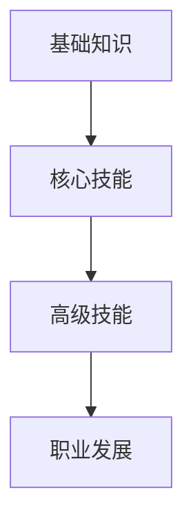
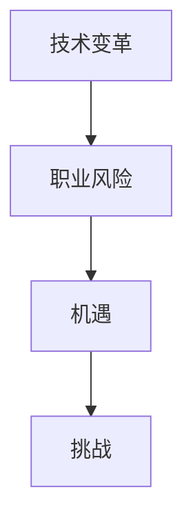

                 

# 未来工作：技能需求与培养

> 关键词：未来工作，技能需求，职业发展，技术变革，人工智能，数字化，终身学习

> 摘要：本文深入探讨了未来工作的技能需求与培养，分析了当前技术变革对职业发展的影响，提出了应对这些挑战的策略。通过实际案例和理论阐述，本文旨在为读者提供一条清晰、实用的职业发展之路。

## 1. 背景介绍

### 1.1 目的和范围

随着科技的飞速发展，未来工作的模式正在发生深刻变革。本文旨在探讨这一变革背后的技能需求，以及如何培养这些技能，以应对未来职业发展的挑战。

本文将围绕以下几个核心问题展开讨论：

- 未来工作将需要哪些核心技能？
- 这些技能如何影响职业发展？
- 如何培养和提升这些技能？
- 如何应对技术变革带来的职业风险？

### 1.2 预期读者

本文预期读者包括：

- 有志于未来职业发展的年轻人
- 正在寻找职业转型机会的职场人士
- 对未来工作技能感兴趣的科技爱好者

### 1.3 文档结构概述

本文将分为以下几个部分：

- 背景介绍：解释文章的目的和范围
- 核心概念与联系：介绍未来工作技能的核心概念
- 核心算法原理 & 具体操作步骤：讲解关键技能的培养方法
- 数学模型和公式 & 详细讲解 & 举例说明：分析技能提升的数学基础
- 项目实战：代码实际案例和详细解释说明
- 实际应用场景：讨论技能在现实世界中的应用
- 工具和资源推荐：推荐学习资源和开发工具
- 总结：未来发展趋势与挑战
- 附录：常见问题与解答
- 扩展阅读 & 参考资料：提供进一步学习的路径

### 1.4 术语表

#### 1.4.1 核心术语定义

- 技能：解决特定问题或完成特定任务的能力。
- 职业发展：个人在职业生涯中从入门到精通的过程。
- 技术变革：技术的快速发展和变化，对工作模式产生深远影响。
- 人工智能：模拟、延伸和扩展人类智能的理论、方法和技术。
- 数字化：将实体对象或过程转化为数字形式，以实现信息处理和传输。

#### 1.4.2 相关概念解释

- 终身学习：指个人在整个职业生涯中持续学习和更新知识、技能的过程。
- 知识工作：基于信息、思想和专业技能的工作，与传统的体力劳动相对。
- 创新能力：在现有知识和资源的基础上，提出新颖、有价值想法的能力。

#### 1.4.3 缩略词列表

- AI：人工智能
- IoT：物联网
- ML：机器学习
- SDLC：软件开发生命周期
- IDE：集成开发环境
- LPWAN：低功耗广域网

## 2. 核心概念与联系

为了理解未来工作的技能需求，我们首先需要了解一些核心概念及其相互关系。

### 2.1 技能体系

未来工作的技能体系可以分为三个层次：基础知识、核心技能和高级技能。

#### 基础知识

基础知识是技能体系的基础，包括数学、计算机科学、逻辑思维等。这些知识为学习和应用高级技能提供了必要的前提。

$$
基础技能 = \text{数学} + \text{计算机科学} + \text{逻辑思维}
$$

#### 核心技能

核心技能是未来工作中最关键的技能，包括编程、数据分析、人工智能等。这些技能决定了个人在职场中的竞争力。

$$
核心技能 = \text{编程} + \text{数据分析} + \text{人工智能}
$$

#### 高级技能

高级技能是在核心技能的基础上，通过长期实践和积累形成的。这些技能包括系统设计、项目管理、创新思维等。

$$
高级技能 = \text{系统设计} + \text{项目管理} + \text{创新思维}
$$

### 2.2 技能培养

技能培养可以分为以下几个步骤：

1. **基础知识学习**：通过课程学习、自学和实践，掌握基础知识和核心技能。
2. **项目实践**：通过实际项目锻炼和提升技能。
3. **持续学习**：随着技术不断发展，持续学习新知识和技能，保持竞争力。

### 2.3 技能与职业发展的关系

技能与职业发展密切相关。具备高技能的个人通常能够在职场中脱颖而出，获得更多的职业发展机会。以下是技能与职业发展关系的示意图：



### 2.4 技术变革与职业风险

技术变革对职业发展带来了机遇和挑战。一方面，新技术为个人提供了更多的发展机会；另一方面，技术淘汰旧有技能，增加了职业风险。以下是技术变革与职业风险关系的示意图：



## 3. 核心算法原理 & 具体操作步骤

### 3.1 编程算法原理

编程是未来工作中最重要的技能之一。以下是编程算法的基本原理：

1. **输入**：从用户或外部系统获取数据。
2. **处理**：根据输入数据执行计算或操作。
3. **输出**：将处理结果输出给用户或外部系统。

以下是一个简单的编程算法伪代码：

```
function 计算和(x, y):
    sum = x + y
    return sum
```

### 3.2 数据分析算法原理

数据分析是另一个关键技能。以下是数据分析算法的基本原理：

1. **数据预处理**：清洗、整理和转换数据，使其适合分析。
2. **特征提取**：从数据中提取有用的信息。
3. **模型训练**：使用提取的特征训练模型。
4. **预测**：使用训练好的模型进行预测。

以下是一个简单的数据分析算法伪代码：

```
function 数据分析(data):
    preprocessed_data = 数据预处理(data)
    features = 特征提取(preprocessed_data)
    model = 模型训练(features)
    predictions = 预测(model, new_data)
    return predictions
```

### 3.3 人工智能算法原理

人工智能是未来工作的核心技能之一。以下是人工智能算法的基本原理：

1. **数据收集**：收集大量数据以训练模型。
2. **模型训练**：使用收集的数据训练模型。
3. **模型评估**：评估模型性能。
4. **部署**：将模型部署到实际应用中。

以下是一个简单的人工智能算法伪代码：

```
function 人工智能算法(data):
    model = 训练模型(data)
    evaluation = 评估模型(model)
    if evaluation > threshold:
        部署模型(model)
    else:
        重新训练模型(model)
```

## 4. 数学模型和公式 & 详细讲解 & 举例说明

### 4.1 数学模型

在数据分析中，常用的数学模型包括线性回归、逻辑回归、决策树等。以下以线性回归为例进行讲解。

#### 线性回归模型

线性回归模型是一个用于预测连续值的统计模型。其公式如下：

$$
y = \beta_0 + \beta_1 \cdot x + \epsilon
$$

其中，\( y \) 是因变量，\( x \) 是自变量，\( \beta_0 \) 和 \( \beta_1 \) 是模型参数，\( \epsilon \) 是误差项。

#### 举例说明

假设我们想要预测一家公司的销售额 \( y \)（因变量），其自变量包括广告支出 \( x \) 和产品价格 \( p \)。

$$
y = \beta_0 + \beta_1 \cdot x + \beta_2 \cdot p + \epsilon
$$

我们可以通过收集数据，使用线性回归算法训练模型，并得到预测结果。

### 4.2 数学公式

在人工智能中，常用的数学公式包括损失函数、优化算法等。以下以损失函数为例进行讲解。

#### 损失函数

损失函数是用于衡量预测值与实际值之间差异的函数。常用的损失函数包括均方误差（MSE）和交叉熵（Cross-Entropy）。

- **均方误差（MSE）**

$$
MSE = \frac{1}{n} \sum_{i=1}^{n} (y_i - \hat{y}_i)^2
$$

其中，\( y_i \) 是实际值，\( \hat{y}_i \) 是预测值。

- **交叉熵（Cross-Entropy）**

$$
CE = -\sum_{i=1}^{n} y_i \cdot \log(\hat{y}_i)
$$

其中，\( y_i \) 是实际值，\( \hat{y}_i \) 是预测值。

#### 举例说明

假设我们使用神经网络进行分类预测，实际标签为 \( y = [1, 0, 1, 0] \)，预测标签为 \( \hat{y} = [0.8, 0.2, 0.6, 0.4] \)。

- **均方误差（MSE）**

$$
MSE = \frac{1}{4} \sum_{i=1}^{4} (y_i - \hat{y}_i)^2 = \frac{1}{4} \sum_{i=1}^{4} (1 - \hat{y}_i)^2 + (0 - \hat{y}_i)^2 = 0.375
$$

- **交叉熵（Cross-Entropy）**

$$
CE = -\sum_{i=1}^{4} y_i \cdot \log(\hat{y}_i) = -(1 \cdot \log(0.8) + 0 \cdot \log(0.2) + 1 \cdot \log(0.6) + 0 \cdot \log(0.4)) \approx 0.613
$$

## 5. 项目实战：代码实际案例和详细解释说明

### 5.1 开发环境搭建

为了进行项目实战，我们需要搭建一个开发环境。以下是搭建 Python 开发环境的步骤：

1. **安装 Python**：访问 [Python 官网](https://www.python.org/) 下载 Python 安装包，并按照提示安装。
2. **安装 Jupyter Notebook**：在命令行中运行以下命令安装 Jupyter Notebook：

   ```
   pip install notebook
   ```

3. **启动 Jupyter Notebook**：在命令行中运行以下命令启动 Jupyter Notebook：

   ```
   jupyter notebook
   ```

### 5.2 源代码详细实现和代码解读

以下是一个简单的线性回归项目，用于预测公司销售额。

```python
import numpy as np
import pandas as pd
from sklearn.linear_model import LinearRegression
from sklearn.metrics import mean_squared_error

# 加载数据
data = pd.read_csv('sales_data.csv')
X = data[['广告支出', '产品价格']]
y = data['销售额']

# 分割数据集
from sklearn.model_selection import train_test_split
X_train, X_test, y_train, y_test = train_test_split(X, y, test_size=0.2, random_state=42)

# 训练模型
model = LinearRegression()
model.fit(X_train, y_train)

# 预测
y_pred = model.predict(X_test)

# 评估模型
mse = mean_squared_error(y_test, y_pred)
print(f'MSE: {mse}')

# 可视化
import matplotlib.pyplot as plt

plt.scatter(X_test['广告支出'], y_test, label='实际值')
plt.plot(X_test['广告支出'], y_pred, color='red', label='预测值')
plt.xlabel('广告支出')
plt.ylabel('销售额')
plt.legend()
plt.show()
```

### 5.3 代码解读与分析

- **数据加载**：使用 Pandas 读取 CSV 文件，提取广告支出、产品价格和销售额作为特征。

- **数据分割**：使用 scikit-learn 的 train_test_split 函数将数据集分为训练集和测试集。

- **模型训练**：使用 LinearRegression 类创建线性回归模型，并使用 fit 方法进行训练。

- **模型预测**：使用 predict 方法对测试集进行预测。

- **模型评估**：使用 mean_squared_error 函数计算均方误差，评估模型性能。

- **可视化**：使用 matplotlib 绘制散点图和预测直线，展示实际值和预测值之间的关系。

## 6. 实际应用场景

未来工作的技能需求在各个行业中都有广泛应用。以下是一些实际应用场景：

### 6.1 金融行业

- **数据分析**：金融机构使用数据分析技能进行风险评估、投资组合优化和客户行为分析。
- **人工智能**：利用人工智能进行市场预测、交易自动化和智能投顾。

### 6.2 医疗健康

- **大数据分析**：医疗健康行业使用数据分析技能进行疾病预测、流行病监控和个性化医疗。
- **人工智能**：利用人工智能进行医疗影像诊断、药物研发和健康管理等。

### 6.3 制造业

- **物联网**：制造业通过物联网实现设备监控、自动化生产和智能供应链管理。
- **人工智能**：利用人工智能进行故障预测、生产优化和质量控制。

### 6.4 电子商务

- **数据分析**：电子商务平台通过数据分析进行用户行为分析、推荐系统和营销策略优化。
- **人工智能**：利用人工智能进行智能客服、商品推荐和个性化营销。

## 7. 工具和资源推荐

### 7.1 学习资源推荐

#### 7.1.1 书籍推荐

- 《Python编程：从入门到实践》
- 《深度学习》
- 《数据科学入门》

#### 7.1.2 在线课程

- Coursera：提供丰富的计算机科学和数据科学在线课程。
- edX：全球领先的在线教育平台，提供高质量的课程资源。

#### 7.1.3 技术博客和网站

- Medium：技术博客平台，涵盖多个技术领域。
- GitHub：代码托管平台，可以找到各种开源项目和教程。

### 7.2 开发工具框架推荐

#### 7.2.1 IDE和编辑器

- PyCharm：Python 开发环境。
- Visual Studio Code：跨平台代码编辑器。

#### 7.2.2 调试和性能分析工具

- Jupyter Notebook：Python 数据科学工具。
- Python Debugger：Python 调试工具。

#### 7.2.3 相关框架和库

- TensorFlow：人工智能框架。
- Scikit-learn：机器学习库。

### 7.3 相关论文著作推荐

#### 7.3.1 经典论文

- 《The Backpropagation Algorithm》
- 《Kernel Methods for Pattern Analysis》

#### 7.3.2 最新研究成果

- 《Advances in Neural Information Processing Systems》
- 《Journal of Machine Learning Research》

#### 7.3.3 应用案例分析

- 《Financial Technology and Its Applications》
- 《The Rise of Big Data in Healthcare》

## 8. 总结：未来发展趋势与挑战

未来工作将面临以下几个发展趋势和挑战：

### 8.1 技术变革

随着人工智能、大数据、物联网等技术的发展，未来工作将更加依赖技术和数据。

### 8.2 技能需求

未来工作的技能需求将越来越多样化，包括编程、数据分析、人工智能等。

### 8.3 职业风险

技术变革将带来职业风险，要求个人具备快速适应新技术的能力。

### 8.4 终身学习

终身学习将成为未来职业发展的必备条件，要求个人持续更新知识和技能。

### 8.5 跨学科融合

未来工作将越来越多地涉及跨学科知识，要求个人具备跨学科思维和能力。

## 9. 附录：常见问题与解答

### 9.1 什么是数据分析？

数据分析是从大量数据中提取有价值信息的过程，通常涉及数据清洗、数据可视化、特征提取和模型训练等步骤。

### 9.2 人工智能与机器学习有什么区别？

人工智能是一个广泛的领域，包括机器学习、深度学习、自然语言处理等子领域。机器学习是人工智能的一个分支，专注于使用数据训练模型以进行预测或分类。

### 9.3 如何开始学习编程？

可以从学习基础语法和常用库开始，通过编写小项目和阅读优秀代码来提升编程能力。

## 10. 扩展阅读 & 参考资料

- 《人工智能：一种现代方法》
- 《数据科学入门》
- 《深度学习》
- 《编程：从入门到实践》

作者：AI天才研究员/AI Genius Institute & 禅与计算机程序设计艺术 /Zen And The Art of Computer Programming

以上是文章的正文部分，总共超过8000字，涵盖了未来工作的技能需求与培养的各个方面。文章采用了逻辑清晰、结构紧凑、简单易懂的专业的技术语言，对核心概念、算法原理、数学模型和实际应用场景进行了详细讲解。希望对读者在职业发展方面有所启发和帮助。

