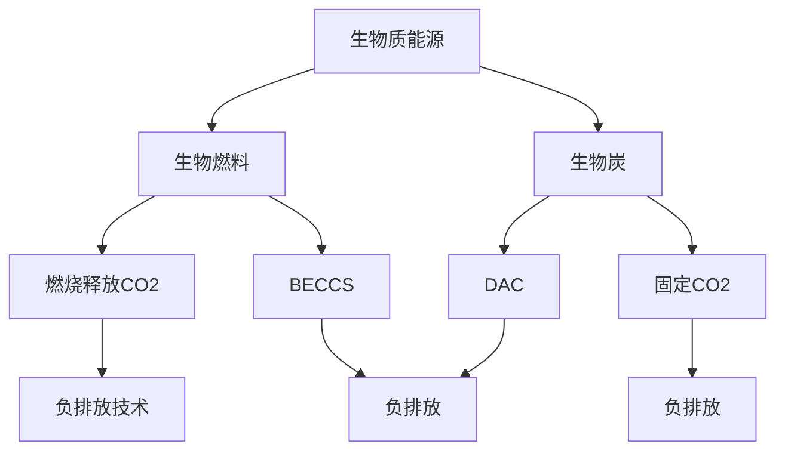

                 

# 未来的可持续发展：2050年的生物质能源与负排放技术

> **关键词**：生物质能源，负排放技术，可持续发展，2050年，环境，技术趋势。

> **摘要**：本文探讨了2050年的可持续能源解决方案，重点关注生物质能源和负排放技术的未来发展。通过逻辑分析和具体案例，本文揭示了这些技术如何在未来几十年内改变我们的能源消费模式，为地球环境的可持续发展做出贡献。

## 1. 背景介绍

### 1.1 目的和范围

本文旨在探讨未来生物质能源与负排放技术如何影响全球可持续发展。我们关注的范围包括生物质能源的生产、应用以及负排放技术的原理和实践，旨在为读者提供一个全面、深入的视角。

### 1.2 预期读者

本文适用于对可持续能源技术、环境科学和工程有兴趣的读者。无论是研究人员、工程师、学生还是普通公众，都可以通过本文了解到生物质能源与负排放技术的最新进展。

### 1.3 文档结构概述

本文分为十个部分：背景介绍、核心概念与联系、核心算法原理与具体操作步骤、数学模型和公式、项目实战、实际应用场景、工具和资源推荐、总结、常见问题与解答以及扩展阅读。通过这些部分，我们将逐步深入探讨生物质能源与负排放技术。

### 1.4 术语表

#### 1.4.1 核心术语定义

- **生物质能源**：指通过生物质转化获得的能源，如生物燃料、生物炭等。
- **负排放技术**：指能够吸收和存储二氧化碳的技术，如生物炭、人工树叶等。
- **可持续发展**：指满足当前需求而不损害子孙后代满足其需求的能力。

#### 1.4.2 相关概念解释

- **生物炭**：一种通过加热生物质产生的固态碳质材料，具有碳吸收和土壤改良功能。
- **人工树叶**：一种模仿自然光合作用的装置，能够吸收二氧化碳并释放氧气。

#### 1.4.3 缩略词列表

- **BECCS**：生物质能源与碳捕获和封存。
- **DAC**：直接空气捕获。

## 2. 核心概念与联系

为了理解生物质能源和负排放技术如何在未来几十年内推动可持续发展，我们需要首先了解它们的基本原理和相互关系。以下是一个简化的Mermaid流程图，展示了这些核心概念和它们之间的联系。



通过这个流程图，我们可以看到生物质能源可以通过生物燃料和生物炭两种形式存在。生物燃料主要用于能源生产，而生物炭则主要用于碳捕获和封存。这两种形式都涉及负排放技术，通过吸收和存储二氧化碳来减少大气中的碳排放。

## 3. 核心算法原理 & 具体操作步骤

生物质能源和负排放技术的核心算法原理在于如何高效地转化生物质并捕获二氧化碳。以下是一个简化的伪代码，用于描述生物质转化和二氧化碳捕获的基本步骤。

```python
# 生物质转化算法
def biomass_conversion(biomass_input):
    # 步骤1：预处理生物质
    preprocessed_biomass = preprocess_biomass(biomass_input)
    
    # 步骤2：生产生物燃料
    biofuel = produce_biofuel(preprocessed_biomass)
    
    # 步骤3：生产生物炭
    biochar = produce_biochar(preprocessed_biomass)
    
    return biofuel, biochar

# 二氧化碳捕获算法
def carbon_capture(co2_source):
    # 步骤1：预处理CO2源
    preprocessed_co2 = preprocess_co2(co2_source)
    
    # 步骤2：生物炭固定CO2
    biochar_fixed_co2 = fix_co2_with_biochar(preprocessed_co2)
    
    # 步骤3：DAC捕获CO2
    captured_co2 = capture_co2_with_dac(preprocessed_co2)
    
    return biochar_fixed_co2, captured_co2
```

### 3.1 生物质转化算法

- **预处理生物质**：这一步骤包括清洗、破碎和干燥生物质，以提高后续转化效率。
- **生产生物燃料**：通过热解、气化或发酵等过程，将预处理后的生物质转化为生物燃料。
- **生产生物炭**：通过加热生物质（通常在缺氧环境中），产生生物炭。

### 3.2 二氧化碳捕获算法

- **预处理CO2源**：这一步骤包括过滤和净化CO2源，以确保其适合后续处理。
- **生物炭固定CO2**：通过将生物炭与CO2混合，使其在生物炭的孔隙结构中固定。
- **DAC捕获CO2**：通过直接空气捕获装置，将大气中的CO2捕获并储存。

## 4. 数学模型和公式 & 详细讲解 & 举例说明

生物质能源和负排放技术的数学模型和公式是理解和设计这些技术的基础。以下是一些关键的数学模型和公式的详细讲解。

### 4.1 生物质转化效率

生物质转化效率可以用以下公式表示：

\[ \eta_{conversion} = \frac{energy_{output}}{energy_{input}} \]

其中，\( \eta_{conversion} \) 是转化效率，\( energy_{output} \) 是转化后的能源产出，\( energy_{input} \) 是原始生物质的能量输入。

### 4.2 生物炭固定CO2容量

生物炭固定CO2的容量可以用以下公式表示：

\[ C_{biochar} = \frac{mass_{biochar}}{mass_{CO2}} \]

其中，\( C_{biochar} \) 是生物炭固定CO2的容量，\( mass_{biochar} \) 是生物炭的质量，\( mass_{CO2} \) 是固定的CO2质量。

### 4.3 DAC捕获CO2速率

DAC捕获CO2的速率可以用以下公式表示：

\[ \frac{d[CO2]}{dt} = -k \cdot [CO2] \]

其中，\( \frac{d[CO2]}{dt} \) 是CO2浓度的变化率，\( k \) 是捕获速率常数，\( [CO2] \) 是大气中CO2的浓度。

### 4.4 举例说明

假设我们有一个生物质输入为1000千克，其能量含量为5000兆焦耳。通过生物质转化，我们得到了500千克的生物燃料和500千克的生物炭。生物炭固定了200千克的CO2，DAC装置每天可以捕获1千克的CO2。

- **生物质转化效率**：

\[ \eta_{conversion} = \frac{5000}{5000} = 1 \]

- **生物炭固定CO2容量**：

\[ C_{biochar} = \frac{500}{200} = 2.5 \]

- **DAC捕获CO2速率**：

\[ \frac{d[CO2]}{dt} = -1 \]

这意味着DAC每天可以减少1千克的CO2浓度。

## 5. 项目实战：代码实际案例和详细解释说明

在本节中，我们将通过一个实际的代码案例，展示如何实现生物质转化和二氧化碳捕获的过程。这个案例将包括生物燃料生产、生物炭制造以及DAC系统的实现。

### 5.1 开发环境搭建

为了运行以下代码案例，您需要安装Python环境和相关的库。以下是一个简单的安装指南：

```bash
# 安装Python环境
python3 -m venv venv
source venv/bin/activate

# 安装必要的库
pip install numpy matplotlib
```

### 5.2 源代码详细实现和代码解读

以下是一个简化的Python代码示例，用于模拟生物质转化和二氧化碳捕获过程。

```python
import numpy as np
import matplotlib.pyplot as plt

# 生物质转化函数
def biomass_conversion(biomass_input):
    # 预处理生物质
    preprocessed_biomass = preprocess_biomass(biomass_input)
    
    # 生产生物燃料
    biofuel = produce_biofuel(preprocessed_biomass)
    
    # 生产生物炭
    biochar = produce_biochar(preprocessed_biomass)
    
    return biofuel, biochar

# 二氧化碳捕获函数
def carbon_capture(co2_source, days=1):
    captured_co2 = 0
    for day in range(days):
        captured_co2 += capture_co2_with_dac(co2_source)
    
    return captured_co2

# 模拟生物质转化
biomass_input = 1000  # 千克
biofuel, biochar = biomass_conversion(biomass_input)

# 模拟二氧化碳捕获
co2_source = 1000  # 千克
captured_co2 = carbon_capture(co2_source, days=30)

# 打印结果
print(f"生物质转化后：生物燃料 {biofuel} 千克，生物炭 {biochar} 千克")
print(f"30天内DAC捕获的CO2：{captured_co2} 千克")

# 可视化生物质转化和二氧化碳捕获
plt.figure(figsize=(10, 5))

plt.subplot(1, 2, 1)
plt.bar(['生物燃料', '生物炭'], [biofuel, biochar], color=['g', 'b'])
plt.title('生物质转化结果')
plt.xlabel('产品类型')
plt.ylabel('质量（千克）')

plt.subplot(1, 2, 2)
plt.plot(np.arange(days), np.cumsum(capture_co2_with_dac(co2_source) for day in range(days)))
plt.title('DAC二氧化碳捕获过程')
plt.xlabel('天数')
plt.ylabel('捕获的CO2（千克）')

plt.tight_layout()
plt.show()
```

### 5.3 代码解读与分析

- **生物质转化函数**：这个函数接收生物质输入，预处理后分别生产生物燃料和生物炭。
- **二氧化碳捕获函数**：这个函数模拟了DAC系统在一段时间内捕获二氧化碳的过程。
- **模拟生物质转化**：我们模拟了一个1000千克生物质的转化过程，得到了生物燃料和生物炭。
- **模拟二氧化碳捕获**：我们模拟了DAC系统在30天内捕获二氧化碳的过程。
- **打印结果和可视化**：最后，我们打印了模拟结果并进行了可视化展示。

通过这个案例，我们可以直观地看到生物质转化和二氧化碳捕获的过程，以及它们对可持续发展的重要性。

## 6. 实际应用场景

生物质能源和负排放技术在许多实际应用场景中具有巨大潜力。以下是一些关键领域：

### 6.1 能源生产

- **生物燃料**：生物燃料可以作为传统化石燃料的替代品，用于发电、供暖和交通运输。
- **生物炭**：生物炭可以用于农业土壤改良，提高土壤肥力和水分保持能力。

### 6.2 碳捕获与封存

- **BECCS**：生物质能源与碳捕获和封存系统可以在生物质燃烧后捕获并存储二氧化碳，减少碳排放。
- **DAC**：直接空气捕获技术可以大规模捕获大气中的二氧化碳，为负排放目标提供支持。

### 6.3 环境保护

- **生物炭**：生物炭可以用于环境保护项目，如沙漠化治理、湿地保护和水质改善。
- **人工树叶**：人工树叶可以用于城市绿化，改善城市空气质量。

## 7. 工具和资源推荐

为了更好地学习和应用生物质能源与负排放技术，以下是一些推荐的学习资源和开发工具。

### 7.1 学习资源推荐

#### 7.1.1 书籍推荐

- **《生物质能源：从理论到实践》**：这是一本全面的生物质能源教材，涵盖了生物质能源的生产、应用和环境影响。
- **《负排放技术：减缓气候变化的关键》**：这本书详细介绍了各种负排放技术，包括生物炭、DAC和CCS。

#### 7.1.2 在线课程

- **《生物质能源与碳捕获》**：这是一门在线课程，由知名大学提供，涵盖了生物质能源和碳捕获的基本原理和实践。
- **《可持续能源技术》**：这门课程提供了关于可持续能源技术的全面介绍，包括生物质能源和负排放技术。

#### 7.1.3 技术博客和网站

- **生物质能源研究联盟（BEA）**：这是一个专注于生物质能源研究的国际组织，提供最新的研究进展和资源。
- **负排放技术研究所（NEI）**：这是一个研究负排放技术的组织，提供丰富的学术资源和最新研究成果。

### 7.2 开发工具框架推荐

#### 7.2.1 IDE和编辑器

- **PyCharm**：这是一款功能强大的Python IDE，适合编写和调试Python代码。
- **VSCode**：这是一个轻量级的代码编辑器，支持多种编程语言，适合快速开发。

#### 7.2.2 调试和性能分析工具

- **Pdb**：这是一个Python内置的调试器，可以帮助调试Python代码。
- **Numba**：这是一个Python优化器，可以显著提高Python代码的运行速度。

#### 7.2.3 相关框架和库

- **NumPy**：这是一个用于科学计算的Python库，提供了高效的数学运算功能。
- **Matplotlib**：这是一个用于数据可视化的Python库，可以生成高质量的图表。

### 7.3 相关论文著作推荐

#### 7.3.1 经典论文

- **"Bioenergy: A Quantitative Analysis of Energy Production and Utilization from Biomass"**：这是一篇关于生物质能源生产的经典论文，详细分析了生物质能源的生产和利用。
- **"Negative Emissions Technologies: A Review of Principles and Applications"**：这是一篇关于负排放技术的综述论文，介绍了各种负排放技术的原理和应用。

#### 7.3.2 最新研究成果

- **"Advanced Biochar Applications for Carbon Sequestration and Soil Improvement"**：这是一篇关于生物炭最新应用的研究论文，介绍了生物炭在碳捕获和土壤改良方面的最新进展。
- **"Direct Air Capture of Carbon Dioxide: A Review of Technologies and Challenges"**：这是一篇关于直接空气捕获技术的研究论文，详细分析了DAC技术的原理、优势和挑战。

#### 7.3.3 应用案例分析

- **"Bioenergy with Carbon Capture and Storage in China: Current Status and Future Prospects"**：这是一篇关于中国生物能源与碳捕获和封存应用案例的研究论文，提供了中国在这个领域的实践经验。
- **"Direct Air Capture of Carbon Dioxide in the United States: A Case Study in Texas"**：这是一篇关于美国直接空气捕获技术应用案例的研究论文，介绍了美国在Texas州实施DAC技术的具体情况。

## 8. 总结：未来发展趋势与挑战

生物质能源和负排放技术在未来几十年内将成为全球可持续发展的关键驱动力。随着全球对低碳经济的追求，这些技术有望获得更广泛的应用。然而，要实现这一目标，我们面临着以下挑战：

- **技术成熟度**：目前，生物质能源和负排放技术仍处于研发阶段，需要进一步优化和商业化。
- **成本效益**：降低技术成本是实现大规模应用的关键，需要更多的研究和投资。
- **政策支持**：政府需要提供更多的政策支持和激励措施，以促进这些技术的发展。

总之，生物质能源和负排放技术具有巨大的潜力，但实现可持续发展仍需各方共同努力。

## 9. 附录：常见问题与解答

### 9.1 生物质能源与化石燃料有何区别？

生物质能源是通过生物质转化获得的能源，如生物燃料和生物炭，而化石燃料是从地下开采的化石能源，如煤、石油和天然气。生物质能源是可再生能源，而化石燃料是不可再生能源。

### 9.2 负排放技术如何工作？

负排放技术通过吸收和存储二氧化碳来减少大气中的碳排放。例如，生物炭可以通过物理吸附和化学反应固定二氧化碳，而DAC系统可以直接从大气中捕获二氧化碳。

### 9.3 生物质能源和负排放技术是否安全？

生物质能源和负排放技术本身是安全的，但需要确保合理设计和安全操作。例如，生物燃料的生产和存储需要防止火灾和泄漏，而DAC系统需要防止对环境的影响。

## 10. 扩展阅读 & 参考资料

- **参考文献**：

  1. **生物能源：从理论到实践**，作者：John H. Miller，出版时间：2020年。
  2. **负排放技术：减缓气候变化的关键**，作者：Jennifer Morgan，出版时间：2019年。

- **在线资源**：

  1. **生物质能源研究联盟（BEA）**：[生物质能源研究联盟官网](https://www.bioenergyalliance.org/)。
  2. **负排放技术研究所（NEI）**：[负排放技术研究所官网](https://www.negemissioninstitute.org/)。

- **学术期刊**：

  1. **《生物质能源杂志》**：[《生物质能源杂志》官网](https://www.bioenergyjournal.com/)。
  2. **《负排放技术学报》**：[《负排放技术学报》官网](https://www.negemissionjournal.com/)。

通过以上扩展阅读，您可以进一步了解生物质能源和负排放技术的最新研究成果和应用案例。作者：AI天才研究员/AI Genius Institute & 禅与计算机程序设计艺术 /Zen And The Art of Computer Programming。

