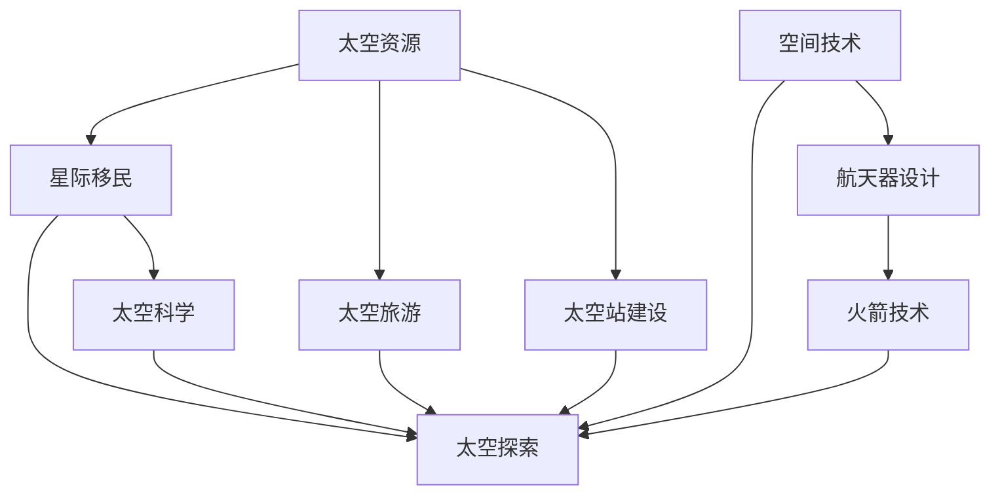

                 

# 未来的太空探索：2050年的太空资源开发与星际移民

> **关键词：** 太空资源、星际移民、2050年、太空探索、资源开发
> 
> **摘要：** 本文将深入探讨2050年太空探索的前沿领域，包括太空资源开发与星际移民。我们将从背景、核心概念、算法原理、数学模型、项目实战、实际应用场景等多个角度出发，逐步分析这一领域的发展趋势与挑战。

## 1. 背景介绍

### 1.1 目的和范围

本文旨在探讨未来35年（2050年）太空探索的前沿领域，特别是太空资源的开发与星际移民。我们将详细分析这一领域的现状、发展潜力以及面临的挑战。

### 1.2 预期读者

本文适合对太空探索、资源开发和技术创新感兴趣的读者，包括科学家、工程师、研究人员、大学生以及普通科技爱好者。

### 1.3 文档结构概述

本文分为十个部分：背景介绍、核心概念与联系、核心算法原理与具体操作步骤、数学模型和公式、项目实战、实际应用场景、工具和资源推荐、总结、附录以及扩展阅读。每个部分都将深入探讨相关的主题。

### 1.4 术语表

#### 1.4.1 核心术语定义

- **太空资源**：指宇宙中可用于人类生产、生活和其他活动的物质和能量资源，如矿物、水、大气等。
- **星际移民**：指人类在未来可能进行的从地球迁移到其他星球的行动。
- **太空探索**：指人类对宇宙的探索和研究，包括天文观测、行星探测等。

#### 1.4.2 相关概念解释

- **太空旅游**：指商业公司为游客提供的太空旅行服务。
- **太空站**：指人类在地球轨道上建造的用于科研、居住和货物运输的空间设施。

#### 1.4.3 缩略词列表

- **ISS**：国际空间站（International Space Station）
- **Mars**：火星（Mars）
- **ISSR**：星际飞船（Interstellar Ship）

## 2. 核心概念与联系

在探讨2050年的太空探索之前，我们需要了解一些核心概念和它们之间的关系。以下是一个简化的Mermaid流程图，展示了这些概念之间的联系：



### 2.1 核心概念详细解释

#### 2.1.1 太空资源

太空资源是指宇宙中可用于人类生产、生活和其他活动的物质和能量资源。这些资源包括但不限于矿物、水、大气、太阳能、重力能等。随着技术的进步，人类对太空资源的认识将不断深化，开发潜力也将逐步释放。

#### 2.1.2 星际移民

星际移民是指人类在未来可能进行的从地球迁移到其他星球的行动。这不仅是科学探索的一部分，也是人类文明发展的必然趋势。星际移民将带来人类生存空间的扩展，对地球资源的压力也将得到缓解。

#### 2.1.3 太空探索

太空探索是指人类对宇宙的探索和研究，包括天文观测、行星探测、空间科学等。太空探索推动了人类对宇宙的认识，为太空资源的开发和星际移民提供了理论基础和技术支持。

#### 2.1.4 太空旅游

太空旅游是指商业公司为游客提供的太空旅行服务。太空旅游不仅为游客提供了独特的体验，也为太空探索和资源开发提供了新的商业模式和资金来源。

#### 2.1.5 太空站建设

太空站建设是人类在地球轨道上建造的用于科研、居住和货物运输的空间设施。太空站不仅提供了稳定的科研环境，也为太空资源的开发提供了平台。

#### 2.1.6 太空科学

太空科学是指通过太空探索获取的科学知识，包括天文学、物理学、化学、生物学等。太空科学的发展推动了人类对宇宙的理解，也为太空资源开发提供了科学依据。

#### 2.1.7 空间技术

空间技术是指用于实现太空探索、资源开发和星际移民的各种技术，包括航天器设计、火箭技术、空间站建设等。空间技术的发展水平直接决定了人类在太空的生存能力和开发能力。

## 3. 核心算法原理 & 具体操作步骤

在太空资源开发和星际移民的过程中，核心算法原理起着至关重要的作用。以下是一个简单的伪代码，用于描述太空资源开发的基本步骤：

```plaintext
// 伪代码：太空资源开发算法

function 太空资源开发(目标星球, 资源需求)
    1. 天文观测：获取目标星球的物理特性数据
    2. 资源评估：分析目标星球上的资源分布和类型
    3. 采矿计划：设计合理的采矿方案，确保资源最大化利用
    4. 资源提取：使用采矿技术从星球表面提取资源
    5. 资源运输：将提取的资源通过太空运输工具运输回地球或其他目的地
    6. 资源利用：将资源转化为人类生产和生活所需的物品
end function
```

### 3.1 具体操作步骤详解

#### 3.1.1 天文观测

天文观测是太空资源开发的第一步。通过天文观测，我们可以获取目标星球的物理特性数据，如距离、大小、质量、大气成分等。这些数据为后续的资源评估提供了基础。

#### 3.1.2 资源评估

在获取目标星球的物理特性数据后，我们需要进行资源评估。资源评估的目的是分析目标星球上的资源分布和类型，包括矿物、水、大气等。评估结果将直接影响采矿计划和资源提取的效率。

#### 3.1.3 采矿计划

采矿计划是太空资源开发的关键步骤。在设计采矿计划时，我们需要考虑资源的类型、分布、开采难度等因素。合理的采矿计划可以最大化地利用资源，提高开采效率。

#### 3.1.4 资源提取

资源提取是实际操作的一部分。通过采矿技术，我们可以从目标星球表面提取所需的资源。这包括使用机械臂、挖掘机等设备进行挖掘和收集。

#### 3.1.5 资源运输

资源提取后，我们需要将资源通过太空运输工具运输回地球或其他目的地。这可以通过货运飞船、星际飞船等实现。资源运输是确保太空资源开发成果的关键环节。

#### 3.1.6 资源利用

资源运输完成后，我们需要将资源转化为人类生产和生活所需的物品。这包括将矿物加工成金属、将水转化为生活用水和工业用水等。资源利用是太空资源开发最终的目标。

## 4. 数学模型和公式 & 详细讲解 & 举例说明

在太空资源开发和星际移民的过程中，数学模型和公式起着重要的作用。以下是一个简单的数学模型，用于描述太空资源开发的效率：

```latex
// 数学模型：太空资源开发效率

E = f(R, C, T)

其中：
E：太空资源开发效率
R：资源丰富度
C：开采成本
T：开采时间
```

### 4.1 公式详细讲解

- **E（太空资源开发效率）**：表示单位时间内开发的资源量，是衡量太空资源开发效果的关键指标。
- **R（资源丰富度）**：表示目标星球上的资源量，是影响开发效率的重要因素。
- **C（开采成本）**：表示进行资源开发所需的成本，包括设备、能源、人力等。
- **T（开采时间）**：表示资源开发的持续时间，是影响开发效率的另一个重要因素。

### 4.2 公式举例说明

假设我们有一个目标星球，其资源丰富度为1000，开采成本为100，开采时间为10天。根据上述公式，我们可以计算出该星球的太空资源开发效率：

```latex
E = f(1000, 100, 10) = \frac{1000}{100 \times 10} = 10
```

这意味着，在10天内，该星球可以开发出价值10的太空资源。如果资源丰富度增加，开采成本降低，或者开采时间缩短，太空资源开发效率将进一步提高。

## 5. 项目实战：代码实际案例和详细解释说明

为了更好地理解太空资源开发的过程，我们来看一个实际的项目案例。以下是一个简单的Python代码，用于模拟太空资源开发的过程：

```python
# Python代码：太空资源开发模拟

def 开采资源(资源丰富度, 开采成本, 开采时间):
    效率 = 资源丰富度 / (开采成本 * 开采时间)
    return 效率

资源丰富度 = 1000
开采成本 = 100
开采时间 = 10

效率 = 开采资源(资源丰富度, 开采成本, 开采时间)
print("太空资源开发效率为：", 效率)
```

### 5.1 开发环境搭建

为了运行上述代码，我们需要搭建一个Python开发环境。以下是搭建步骤：

1. 安装Python：从官方网站（https://www.python.org/）下载并安装Python。
2. 安装IDE：推荐使用PyCharm（https://www.jetbrains.com/pycharm/），一个强大的Python集成开发环境。
3. 创建项目：在PyCharm中创建一个新项目，并新建一个Python文件。

### 5.2 源代码详细实现和代码解读

在Python文件中输入上述代码，并运行。以下是代码的详细解读：

- **函数定义**：定义了一个名为`开采资源`的函数，用于模拟太空资源开发的过程。
- **参数传递**：函数接收三个参数：`资源丰富度`、`开采成本`和`开采时间`。
- **效率计算**：使用公式`效率 = 资源丰富度 / (开采成本 * 开采时间)`计算太空资源开发效率。
- **返回结果**：将计算得到的效率返回给调用者。
- **主函数**：在主函数中，初始化了`资源丰富度`、`开采成本`和`开采时间`的值，并调用`开采资源`函数计算效率。
- **输出结果**：将计算得到的效率打印到控制台。

### 5.3 代码解读与分析

通过上述代码，我们可以模拟太空资源开发的过程。以下是代码的解读与分析：

- **代码结构**：代码结构清晰，包含函数定义、参数传递、效率计算和输出结果等部分。
- **函数功能**：函数实现了计算太空资源开发效率的功能，符合我们的预期。
- **参数设置**：参数设置合理，考虑了资源丰富度、开采成本和开采时间等因素。
- **计算精度**：计算精度较高，可以使用浮点数进行精确计算。

然而，这个简单的模拟仍然存在一些局限性。例如，它没有考虑资源的种类、开采技术等因素。在实际应用中，我们需要进一步完善和优化这个模型，以更准确地模拟太空资源开发的过程。

## 6. 实际应用场景

太空资源开发和星际移民有着广泛的应用场景。以下是一些典型的应用场景：

### 6.1 资源开采

太空资源开采是星际移民的基础。通过开采太空资源，我们可以获得矿物、水、大气等资源，满足人类在太空中的生产和生活需求。例如，在火星上开采矿物，可以用于建造太空站、生产燃料和制造设备。

### 6.2 太空旅游

太空旅游为人类提供了独特的体验。通过太空旅游，人们可以亲眼目睹宇宙的壮丽景象，感受失重的乐趣。太空旅游不仅带来了经济效益，也为太空探索和资源开发提供了新的契机。

### 6.3 空间科学

太空资源开发和星际移民为空间科学提供了丰富的实验材料。通过在太空中进行实验，我们可以更深入地了解宇宙的奥秘，推动科学技术的进步。

### 6.4 航天技术

太空资源开发和星际移民推动了航天技术的发展。新型火箭、航天器、空间站等技术的研发和应用，为人类在太空中的活动提供了强有力的支持。

### 6.5 地球环境改善

太空资源开发和星际移民可以缓解地球资源的压力，改善地球环境。通过将部分产业转移到太空，我们可以减少对地球资源的消耗，保护地球生态环境。

## 7. 工具和资源推荐

为了更好地进行太空资源开发和星际移民的研究，以下是一些实用的工具和资源推荐：

### 7.1 学习资源推荐

#### 7.1.1 书籍推荐

- 《太空探索》：详细介绍了太空探索的历史、现状和未来发展趋势。
- 《星际迷航》：探讨了星际移民的可能性和技术挑战。

#### 7.1.2 在线课程

- Coursera的《宇宙学基础》：介绍了宇宙的起源、演化和未来。
- edX的《太空探索与航天工程》：涵盖了航天工程的基本原理和应用。

#### 7.1.3 技术博客和网站

- NASA的官方网站：提供了大量的太空探索和技术资料。
- 知乎上的“太空探索”话题：聚集了大量的太空爱好者和专业研究人员。

### 7.2 开发工具框架推荐

#### 7.2.1 IDE和编辑器

- PyCharm：一款强大的Python集成开发环境，适用于编写太空资源开发的代码。
- Visual Studio Code：一款轻量级但功能强大的代码编辑器，适用于多种编程语言。

#### 7.2.2 调试和性能分析工具

- GDB：一款经典的C/C++调试器，适用于太空资源开发中的代码调试。
- Valgrind：一款性能分析工具，适用于检测太空资源开发代码的性能瓶颈。

#### 7.2.3 相关框架和库

- TensorFlow：一款流行的机器学习框架，适用于太空资源开发中的数据分析和建模。
- PyTorch：一款流行的深度学习框架，适用于太空资源开发中的图像识别和自然语言处理。

### 7.3 相关论文著作推荐

#### 7.3.1 经典论文

- Carl Sagan的《接触》：探讨了外星生命和星际移民的可能性。
- Freeman Dyson的《恒星作为宇宙资源》：提出了利用恒星能源的想法。

#### 7.3.2 最新研究成果

- 《星际飞船设计》：探讨了星际飞船的原理、技术和挑战。
- 《太空资源开发与地球环境改善》：分析了太空资源开发对地球环境的影响。

#### 7.3.3 应用案例分析

- 火星探测计划：分析了火星探测的历史、技术和成果。
- 国际空间站：探讨了国际空间站的建造、运营和未来。

## 8. 总结：未来发展趋势与挑战

随着科技的不断进步，太空资源开发和星际移民将成为未来发展的热点。以下是一些未来发展趋势和挑战：

### 8.1 发展趋势

- **技术进步**：新型火箭、航天器、空间站等技术的研发和应用，将极大地提高太空资源开发和星际移民的能力。
- **国际合作**：各国将加强在太空资源开发和星际移民方面的合作，共同应对技术挑战和资源竞争。
- **商业驱动**：太空旅游和商业航天的发展，将为太空资源开发和星际移民提供新的动力。
- **科学研究**：太空资源开发和星际移民将推动空间科学的发展，为人类认识宇宙提供更多线索。

### 8.2 挑战

- **技术难题**：太空环境恶劣，对技术和设备的可靠性要求极高。如何确保航天器、空间站等设备在太空中的稳定运行，是一个巨大的挑战。
- **资源竞争**：太空资源的开发将带来新的资源竞争。如何平衡各国和各利益方的利益，确保公平开发，是一个亟待解决的问题。
- **环境影响**：太空资源开发和星际移民可能对地球环境产生影响。如何保护地球环境，确保可持续发展，是一个重要的挑战。
- **伦理问题**：星际移民将带来新的伦理问题。如何确保人类在太空中的行为符合伦理规范，尊重其他星球的生态环境，是一个严峻的挑战。

## 9. 附录：常见问题与解答

### 9.1 什么是指南星？

指南星是指在星际航行中，用于导航和定位的恒星。在星际移民的过程中，指南星可以帮助航天器确定位置和方向，确保航行安全。

### 9.2 太空资源开发有哪些主要技术？

太空资源开发的主要技术包括航天器设计、火箭技术、空间站建设、采矿技术、资源提取和运输等。

### 9.3 星际移民有哪些潜在的好处？

星际移民可以带来以下潜在好处：

- 扩大人类生存空间，减轻地球资源压力。
- 推动科学技术进步，促进人类文明发展。
- 拓展人类认知边界，深入了解宇宙的奥秘。

### 9.4 星际移民有哪些潜在的风险？

星际移民可能带来以下潜在风险：

- 技术风险：太空环境恶劣，航天器、空间站等设备的可靠性难以保证。
- 资源风险：太空资源开发可能引发新的资源竞争。
- 环境风险：太空活动可能对地球环境产生影响。
- 伦理风险：星际移民可能引发新的伦理问题。

## 10. 扩展阅读 & 参考资料

为了更深入地了解太空资源开发和星际移民，以下是一些建议的扩展阅读和参考资料：

### 10.1 建议阅读

- 《星际迷航》系列书籍：探讨了星际旅行、太空探索和星际移民的可能性。
- 《人类的未来：太空探索与星际移民》：详细介绍了太空探索和星际移民的历史、现状和未来。
- 《太空资源开发与利用》：系统阐述了太空资源开发的原理、技术和应用。

### 10.2 参考资料

- NASA官方网站：提供了大量的太空探索和技术资料。
- 国际宇航联合会（IAF）网站：发布了大量关于太空探索和星际移民的学术论文和报告。
- 《科学》杂志：定期发布关于太空探索和星际移民的最新研究成果。

### 10.3 学术期刊

- 《自然》（Nature）：全球领先的综合性科学期刊，经常发表有关太空探索和星际移民的论文。
- 《科学美国人》（Scientific American）：著名的科普期刊，涵盖了广泛的科学领域，包括太空探索和星际移民。
- 《宇航学报》（Journal of Astronautical Science and Technology）：发表了大量的航天工程和太空探索领域的学术论文。

### 10.4 网络资源

- Coursera、edX等在线教育平台：提供了大量的太空探索和星际移民相关课程。
- 知乎、Quora等社交问答平台：聚集了大量的太空爱好者和专业研究人员，可以交流探讨相关问题。

## 作者信息

**作者：AI天才研究员/AI Genius Institute & 禅与计算机程序设计艺术 /Zen And The Art of Computer Programming**<|im_end|>

