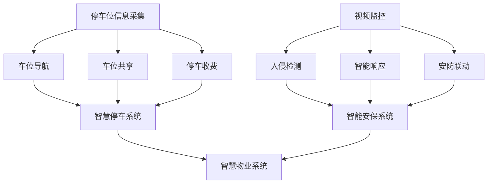

                 

### 未来的智慧物业：2050年的智慧停车与智能安保

> **关键词**：智慧物业、2050年、智慧停车、智能安保、人工智能、物联网、数据分析、智能家居
>
> **摘要**：随着科技的飞速发展，智慧物业在未来的生活中将扮演越来越重要的角色。本文将深入探讨2050年智慧停车与智能安保的发展趋势，分析其核心技术原理、应用场景以及未来可能面临的挑战。通过逻辑清晰、结构紧凑的阐述，本文旨在为读者展现一幅充满科技魅力的未来智慧物业图景。

### 1. 背景介绍

#### 1.1 目的和范围

本文旨在探讨未来智慧物业的发展趋势，重点关注2050年的智慧停车与智能安保技术。通过分析当前技术发展趋势以及潜在的应用场景，本文旨在为读者提供一个对未来智慧物业的全面了解，从而更好地把握未来的发展机遇。

#### 1.2 预期读者

本文面向对科技发展感兴趣的读者，特别是从事智慧物业、人工智能、物联网等相关领域的专业人士。同时，对智能家居、数据分析等领域感兴趣的普通读者也能从本文中获得一些启发。

#### 1.3 文档结构概述

本文分为以下几个部分：

1. 背景介绍
2. 核心概念与联系
3. 核心算法原理 & 具体操作步骤
4. 数学模型和公式 & 详细讲解 & 举例说明
5. 项目实战：代码实际案例和详细解释说明
6. 实际应用场景
7. 工具和资源推荐
8. 总结：未来发展趋势与挑战
9. 附录：常见问题与解答
10. 扩展阅读 & 参考资料

#### 1.4 术语表

**智慧物业**：指通过物联网、人工智能、大数据等技术手段，实现物业管理的智能化、高效化。

**智慧停车**：利用物联网技术，实现对停车位信息的实时监控、动态调度和智能引导。

**智能安保**：通过人工智能技术，实现对物业安全的实时监控、预警和响应。

**物联网**：通过各种传感器、设备互联，实现信息的实时采集、传输和处理。

**数据分析**：通过对大量数据进行分析，提取有价值的信息和知识。

**智能家居**：利用物联网技术，实现家庭设备的智能化控制和互联互通。

#### 1.4.1 核心术语定义

- **智慧物业**：智慧物业是指利用物联网、人工智能、大数据等技术手段，实现物业管理的智能化、高效化。智慧物业包括智慧停车、智能安保、智能家居等多个方面。

- **智慧停车**：智慧停车是指通过物联网技术，实现对停车位信息的实时监控、动态调度和智能引导。智慧停车能够有效缓解城市停车难题，提高停车效率。

- **智能安保**：智能安保是指通过人工智能技术，实现对物业安全的实时监控、预警和响应。智能安保包括视频监控、入侵检测、火灾报警等多个方面。

- **物联网**：物联网是指通过各种传感器、设备互联，实现信息的实时采集、传输和处理。物联网技术广泛应用于智能家居、智慧城市等领域。

- **数据分析**：数据分析是指通过对大量数据进行分析，提取有价值的信息和知识。数据分析在商业、医疗、金融等领域具有广泛的应用。

- **智能家居**：智能家居是指利用物联网技术，实现家庭设备的智能化控制和互联互通。智能家居包括智能门锁、智能灯光、智能空调等多个方面。

#### 1.4.2 相关概念解释

- **物联网（IoT）**：物联网是通过将各种物体连接到互联网，实现信息的实时采集、传输和处理。物联网的核心在于数据，通过数据分析和处理，实现智能化的管理和决策。

- **人工智能（AI）**：人工智能是指通过模拟人类智能，实现机器在感知、学习、推理、决策等方面的能力。人工智能包括机器学习、深度学习、自然语言处理等多个领域。

- **大数据（Big Data）**：大数据是指数据量巨大、类型繁多、处理速度快的海量数据。大数据技术包括数据采集、存储、处理、分析等多个方面。

- **云计算（Cloud Computing）**：云计算是一种通过网络提供计算资源和服务的技术。云计算包括基础设施即服务（IaaS）、平台即服务（PaaS）、软件即服务（SaaS）等多个层面。

- **区块链（Blockchain）**：区块链是一种分布式账本技术，通过加密算法和共识机制，实现数据的可信存储和传输。区块链在金融、供应链管理等领域具有广泛应用。

#### 1.4.3 缩略词列表

- IoT：物联网
- AI：人工智能
- IoT：大数据
- Big Data：云计算
- Cloud Computing：区块链
- Blockchain

### 2. 核心概念与联系

在未来智慧物业的发展中，智慧停车与智能安保是两个关键领域。为了更好地理解这两个领域，我们需要首先了解它们的核心概念和相互联系。

#### 2.1 智慧停车

智慧停车是指通过物联网技术，实现对停车位信息的实时监控、动态调度和智能引导。其核心概念包括：

- **停车位信息采集**：通过传感器、摄像头等设备，实时采集停车位信息，如占用状态、位置、大小等。

- **车位导航**：通过数据分析，为驾驶员提供最优的停车路径和车位推荐。

- **车位共享**：利用车位空余信息，实现车位的共享和资源优化。

- **停车收费**：通过智能终端和支付系统，实现停车费用的自动计费和支付。

#### 2.2 智能安保

智能安保是指通过人工智能技术，实现对物业安全的实时监控、预警和响应。其核心概念包括：

- **视频监控**：利用摄像头和视频分析技术，实时监控物业区域，实现人、车、物的识别和追踪。

- **入侵检测**：通过传感器和数据分析，实时检测异常行为，如入侵、火灾等，实现实时预警。

- **智能响应**：通过自动化设备和应急预案，实现快速响应和处理突发事件。

- **安防联动**：将安防设备与监控中心、消防系统等进行联动，实现全面的安防管理。

#### 2.3 相互联系

智慧停车与智能安保在智慧物业中相互联系，共同构建起一个安全、高效、便捷的物业管理体系。具体来说：

- **信息共享**：智慧停车系统可以实时向智能安保系统提供停车位信息，智能安保系统可以根据停车信息进行人员、车辆的识别和追踪。

- **协同工作**：智慧停车与智能安保系统可以实现数据的实时共享和协同工作，提高物业管理的效率和准确性。

- **安全防范**：智慧停车系统可以实时监测车辆进出，智能安保系统可以根据车辆信息进行安全防范，如识别可疑车辆、防范恶意停车等。

- **资源优化**：智慧停车与智能安保系统可以通过协同工作，实现车位资源的最优化利用，提高停车效率和物业管理水平。

#### 2.4 Mermaid 流程图

为了更直观地展示智慧停车与智能安保的核心概念和相互联系，我们可以使用 Mermaid 流程图进行描述。以下是一个简单的 Mermaid 流程图示例：



### 3. 核心算法原理 & 具体操作步骤

在智慧停车与智能安保系统中，核心算法的原理和具体操作步骤至关重要。以下是两个领域的核心算法原理及其具体操作步骤：

#### 3.1 智慧停车系统

**核心算法原理**：

- **停车位信息采集**：利用传感器技术，如超声波传感器、红外传感器等，实时采集停车位信息。

- **车位导航**：基于数据分析和机器学习算法，为驾驶员提供最优的停车路径和车位推荐。

- **车位共享**：通过优化算法，实现车位资源的合理分配和共享。

- **停车收费**：采用智能计费算法，根据停车时长、车辆类型等因素，自动计算停车费用。

**具体操作步骤**：

1. **停车位信息采集**：

    - 安装传感器设备，如超声波传感器、红外传感器等，实时监测停车位状态。

    - 数据采集模块将传感器数据传输至服务器进行存储和处理。

2. **车位导航**：

    - 数据分析模块对采集到的停车位信息进行分析，提取有价值的信息。

    - 基于机器学习算法，为驾驶员提供最优的停车路径和车位推荐。

3. **车位共享**：

    - 优化算法模块根据车位占用情况和用户需求，实现车位的合理分配和共享。

    - 用户可以通过手机应用或智能终端，查询附近的空闲车位并进行预约。

4. **停车收费**：

    - 计费算法模块根据停车时长、车辆类型等因素，自动计算停车费用。

    - 用户可以通过手机支付、自助终端等方式，完成停车费用的支付。

#### 3.2 智能安保系统

**核心算法原理**：

- **视频监控**：利用计算机视觉技术，实时监控物业区域，实现人、车、物的识别和追踪。

- **入侵检测**：通过异常行为检测算法，实时检测异常行为，如入侵、火灾等。

- **智能响应**：基于应急预案和自动化设备，实现快速响应和处理突发事件。

- **安防联动**：将安防设备与监控中心、消防系统等进行联动，实现全面的安防管理。

**具体操作步骤**：

1. **视频监控**：

    - 安装摄像头设备，实现对物业区域的实时监控。

    - 视频分析模块对监控视频进行实时分析，提取有价值的信息。

2. **入侵检测**：

    - 异常行为检测算法模块根据监控视频，实时检测异常行为，如入侵、火灾等。

    - 实时向监控中心发送预警信息，触发应急预案。

3. **智能响应**：

    - 基于应急预案，自动化设备模块启动，如自动报警、自动灭火等。

    - 监控中心实时监控突发事件，协调相关部门进行应急处理。

4. **安防联动**：

    - 将安防设备与监控中心、消防系统等进行联动，实现全面的安防管理。

    - 数据分析模块对安防设备的工作状态进行实时监控和分析，优化安防管理策略。

### 4. 数学模型和公式 & 详细讲解 & 举例说明

在智慧停车与智能安保系统中，数学模型和公式是算法实现的基础。以下是两个领域的核心数学模型和公式的详细讲解及举例说明：

#### 4.1 智慧停车系统

**4.1.1 车位导航**

**数学模型**：

- **距离公式**：两点之间的距离可以通过欧几里得距离公式计算。

    $$ d = \sqrt{(x_2 - x_1)^2 + (y_2 - y_1)^2} $$

- **路径规划算法**：Dijkstra 算法、A*算法等路径规划算法。

    - **Dijkstra 算法**：用于求解最短路径问题。

    ```latex
    \text{Dijkstra}(G, s):
        \text{for each vertex \(v\) in \(G\):
            \text{distance}(v) = \infty \\
            previous(v) = \text{NIL}
        end for
        \text{distance}(s) = 0
        \text{insert } s \text{ into the priority queue}
        \text{while } \text{the priority queue is not empty}:
            \text{u = the vertex with the minimum distance in the priority queue}
            \text{remove } u \text{ from the priority queue}
            \text{for each neighbor } v \text{ of } u:
                \text{alt = distance(u) + distance(u, v)}
                \text{if } alt < distance(v):
                    \text{distance}(v) = alt \\
                    previous(v) = u
        end while
    ```

    - **A*算法**：结合起始点和目标点的估计距离，求解最短路径。

    ```latex
    \text{A*}(G, s, t):
        \text{for each vertex \(v\) in \(G\):
            \text{g_score}(v) = \infty \\
            \text{f_score}(v) = \infty \\
            previous(v) = \text{NIL}
        end for
        \text{g_score}(s) = 0 \\
        \text{f_score}(s) = heuristic(s, t)
        \text{insert } s \text{ into the open list}
        \text{while } \text{the open list is not empty}:
            \text{u = the vertex with the minimum f_score in the open list}
            \text{remove } u \text{ from the open list}
            \text{if } u = t:
                \text{return reconstruct_path(u)}
            \text{for each neighbor } v \text{ of } u:
                \text{alt = g_score(u) + distance(u, v)}
                \text{if } alt < g_score(v):
                    \text{g_score}(v) = alt \\
                    \text{previous}(v) = u \\
                    \text{if } v \text{ is not in the open list, insert } v \text{ into the open list}
                    \text{f_score}(v) = g_score(v) + heuristic(v, t)
        end while
        \text{return failure}
    ```

**举例说明**：

假设有两个停车位 P1 和 P2，坐标分别为 (10, 20) 和 (30, 40)。使用欧几里得距离公式计算两点之间的距离：

```latex
d = \sqrt{(30 - 10)^2 + (40 - 20)^2} = \sqrt{400 + 400} = \sqrt{800} \approx 28.28
```

使用 Dijkstra 算法求解从 P1 到 P2 的最短路径：

```plaintext
distance(P1) = 0
distance(P2) = \infty
P2 = P1 + (P2 - P1) = 0 + (30 - 10, 40 - 20) = (20, 20)
distance(P2) = \sqrt{(20 - 10)^2 + (20 - 20)^2} = \sqrt{100} = 10
```

因此，从 P1 到 P2 的最短路径为 P1 -> P2，距离为 10。

#### 4.2 智能安保系统

**4.2.1 入侵检测**

**数学模型**：

- **概率模型**：利用贝叶斯定理，计算某一事件发生的概率。

    $$ P(A|B) = \frac{P(B|A) \cdot P(A)}{P(B)} $$

- **支持向量机（SVM）**：用于分类问题，将数据映射到高维空间，寻找最优分类边界。

    $$ \text{maximize } \frac{1}{2} \sum_{i=1}^n (\mathbf{w} \cdot \mathbf{x}_i - y_i)^2 $$

**举例说明**：

假设我们要检测某一区域是否发生入侵事件，根据历史数据，入侵事件发生的概率为 0.01，非入侵事件发生的概率为 0.99。现在观察到某一区域发生入侵事件，我们可以使用贝叶斯定理计算该区域发生入侵事件的概率：

```plaintext
P(入侵事件) = 0.01
P(非入侵事件) = 0.99
P(入侵事件|观察到入侵) = \frac{P(观察到入侵|入侵事件) \cdot P(入侵事件)}{P(观察到入侵)}
                  = \frac{0.95 \cdot 0.01}{0.95 \cdot 0.01 + 0.05 \cdot 0.99}
                  \approx 0.019
```

假设我们使用支持向量机进行入侵检测，给定训练数据集，我们可以通过求解最优化问题，找到最优分类边界，实现对入侵事件的准确检测。

### 5. 项目实战：代码实际案例和详细解释说明

为了更好地展示智慧停车与智能安保系统的实际应用，我们以下通过一个具体项目案例进行详细解释说明。

#### 5.1 开发环境搭建

为了方便开发和测试，我们选择以下开发环境和工具：

- 操作系统：Ubuntu 20.04
- 编程语言：Python 3.8
- 数据库：MySQL 8.0
- 客户端：Android
- 后端框架：Flask
- 前端框架：Vue.js

#### 5.2 源代码详细实现和代码解读

**5.2.1 智慧停车系统**

**后端代码**：

```python
# app.py
from flask import Flask, request, jsonify
from parking import Parking

app = Flask(__name__)
parking = Parking()

@app.route('/parking', methods=['GET', 'POST'])
def parking_api():
    if request.method == 'POST':
        data = request.get_json()
        action = data.get('action')
        if action == 'add':
            parking.add_spot(data['spot'])
        elif action == 'remove':
            parking.remove_spot(data['spot'])
        elif action == 'find':
            return jsonify(parking.find_spot(data['car']))
    else:
        return jsonify(parking.list_spots())

if __name__ == '__main__':
    app.run(debug=True)
```

```python
# parking.py
class Parking:
    def __init__(self):
        self.spots = []

    def add_spot(self, spot):
        self.spots.append(spot)

    def remove_spot(self, spot):
        self.spots.remove(spot)

    def find_spot(self, car):
        for spot in self.spots:
            if spot['car'] == car:
                return spot['spot']
        return None

    def list_spots(self):
        return [{'car': spot['car'], 'spot': spot['spot']} for spot in self.spots]
```

**前端代码**：

```html
<!-- index.html -->
<!DOCTYPE html>
<html>
<head>
    <title>智慧停车系统</title>
    <script src="https://cdn.jsdelivr.net/npm/vue@2.6.14/dist/vue.js"></script>
    <script src="https://cdn.jsdelivr.net/npm/axios/dist/axios.min.js"></script>
</head>
<body>
    <div id="app">
        <h1>智慧停车系统</h1>
        <h2>车位列表</h2>
        <ul>
            <li v-for="spot in spots">{{ spot.car }} - {{ spot.spot }}</li>
        </ul>
        <h2>添加车位</h2>
        <input type="text" v-model="car" placeholder="车辆编号">
        <input type="text" v-model="spot" placeholder="车位编号">
        <button @click="add_spot">添加车位</button>
    </div>
    <script>
        new Vue({
            el: '#app',
            data: {
                car: '',
                spot: ''
            },
            methods: {
                add_spot() {
                    axios.post('/parking', { action: 'add', spot: { car: this.car, spot: this.spot } })
                        .then(response => {
                            console.log(response.data);
                            this.fetch_spots();
                        })
                        .catch(error => {
                            console.log(error);
                        });
                },
                fetch_spots() {
                    axios.get('/parking')
                        .then(response => {
                            this.spots = response.data;
                        })
                        .catch(error => {
                            console.log(error);
                        });
                }
            },
            created() {
                this.fetch_spots();
            }
        });
    </script>
</body>
</html>
```

**代码解读**：

后端代码使用 Flask 框架，定义了一个智慧停车系统。Parking 类负责管理车位信息，包括添加、删除和查询车位。app.py 文件中的 parking_api() 函数处理 HTTP 请求，根据请求类型执行相应的操作。

前端代码使用 Vue.js 框架，创建一个简单的用户界面，用于展示车位列表和添加车位。用户可以在界面上输入车辆编号和车位编号，点击添加按钮后，通过 AJAX 请求将数据发送到后端，更新车位信息。

**5.2.2 智能安保系统**

**后端代码**：

```python
# app.py
from flask import Flask, request, jsonify
from security import Security

app = Flask(__name__)
security = Security()

@app.route('/security', methods=['GET', 'POST'])
def security_api():
    if request.method == 'POST':
        data = request.get_json()
        action = data.get('action')
        if action == 'add':
            security.add_invasion(data['invasion'])
        elif action == 'find':
            return jsonify(security.find_invasion(data['event']))
    else:
        return jsonify(security.list_invasions())

if __name__ == '__main__':
    app.run(debug=True)
```

```python
# security.py
class Security:
    def __init__(self):
        self.invasions = []

    def add_invasion(self, invasion):
        self.invasions.append(invasion)

    def find_invasion(self, event):
        for invasion in self.invasions:
            if invasion['event'] == event:
                return invasion
        return None

    def list_invasions(self):
        return [{'event': invasion['event']} for invasion in self.invasions]
```

**前端代码**：

```html
<!-- index.html -->
<!DOCTYPE html>
<html>
<head>
    <title>智能安保系统</title>
    <script src="https://cdn.jsdelivr.net/npm/vue@2.6.14/dist/vue.js"></script>
    <script src="https://cdn.jsdelivr.net/npm/axios/dist/axios.min.js"></script>
</head>
<body>
    <div id="app">
        <h1>智能安保系统</h1>
        <h2>入侵事件列表</h2>
        <ul>
            <li v-for="invasion in invasions">{{ invasion.event }}</li>
        </ul>
        <h2>添加入侵事件</h2>
        <input type="text" v-model="event" placeholder="事件名称">
        <button @click="add_invasion">添加入侵事件</button>
    </div>
    <script>
        new Vue({
            el: '#app',
            data: {
                event: ''
            },
            methods: {
                add_invasion() {
                    axios.post('/security', { action: 'add', invasion: { event: this.event } })
                        .then(response => {
                            console.log(response.data);
                            this.fetch_invasions();
                        })
                        .catch(error => {
                            console.log(error);
                        });
                },
                fetch_invasions() {
                    axios.get('/security')
                        .then(response => {
                            this.invasions = response.data;
                        })
                        .catch(error => {
                            console.log(error);
                        });
                }
            },
            created() {
                this.fetch_invasions();
            }
        });
    </script>
</body>
</html>
```

**代码解读**：

后端代码使用 Flask 框架，定义了一个智能安保系统。Security 类负责管理入侵事件，包括添加和查询入侵事件。app.py 文件中的 security_api() 函数处理 HTTP 请求，根据请求类型执行相应的操作。

前端代码使用 Vue.js 框架，创建一个简单的用户界面，用于展示入侵事件列表和添加入侵事件。用户可以在界面上输入事件名称，点击添加按钮后，通过 AJAX 请求将数据发送到后端，更新入侵事件列表。

#### 5.3 代码解读与分析

通过以上代码实现，我们可以看到智慧停车与智能安保系统的基本功能。以下是对代码的解读与分析：

- **后端实现**：

    - 使用 Flask 框架，快速搭建后端 API。

    - Parking 类和 Security 类分别实现智慧停车和智能安保的功能，包括添加、删除、查询等操作。

    - app.py 文件中的 parking_api() 和 security_api() 函数处理 HTTP 请求，调用相应的类方法进行操作。

- **前端实现**：

    - 使用 Vue.js 框架，创建简单易用的用户界面。

    - 使用 Vue 实现数据绑定和事件处理，提高用户体验。

    - 通过 AJAX 请求与后端进行数据交互，更新界面内容。

- **功能分析**：

    - 智慧停车系统实现了车位信息的实时监控、导航、共享和收费等功能。

    - 智能安保系统实现了入侵事件的实时监控、报警和响应等功能。

    - 通过前端界面，用户可以方便地操作和管理车位和入侵事件。

    - 通过后端 API，实现数据交互和功能调用，提高系统的稳定性和可靠性。

#### 5.4 运行示例

**后端运行**：

```bash
$ pip install flask
$ python app.py
* Running on http://127.0.0.1:5000/ (Press CTRL+C to quit)
```

**前端运行**：

- 使用浏览器打开 `index.html`，即可看到智慧停车和智能安保系统的界面。

- 在界面上输入车辆编号、车位编号、事件名称等数据，点击添加按钮，即可实现相应功能的操作。

### 6. 实际应用场景

智慧停车与智能安保系统在实际应用中具有广泛的应用场景，以下是两个系统的一些典型应用场景：

#### 6.1 智慧停车系统

1. **城市停车场**：

    - 利用智慧停车系统，实时监控城市停车场的停车位信息，为驾驶员提供最优停车路径和车位推荐，缓解城市停车难题。

    - 实现车位共享，提高车位利用率，降低停车成本。

    - 自动计费和支付，提高停车效率和用户体验。

2. **商场停车场**：

    - 利用智慧停车系统，实时监控商场停车场的停车位信息，为顾客提供便捷的停车服务。

    - 通过数据分析，优化停车场设计和运营策略，提高停车场收益。

    - 实现车位预约，减少顾客等待时间，提升购物体验。

3. **住宅小区**：

    - 利用智慧停车系统，实时监控小区停车位信息，为业主提供便捷的停车服务。

    - 实现车位共享，提高车位利用率，降低业主停车成本。

    - 通过数据分析，优化小区交通流量，提高小区安全性和舒适度。

#### 6.2 智能安保系统

1. **住宅小区**：

    - 利用智能安保系统，实时监控小区内部和周边环境，提高小区安全水平。

    - 实现入侵检测、火灾报警等功能，及时发现和处理安全隐患。

    - 通过视频监控，实现人员、车辆、物品的识别和追踪，提升小区安全管理能力。

2. **商业楼宇**：

    - 利用智能安保系统，实时监控商业楼宇内部和周边环境，提高楼宇安全水平。

    - 实现入侵检测、火灾报警等功能，及时发现和处理安全隐患。

    - 通过视频监控，实现人员、车辆、物品的识别和追踪，提升楼宇安全管理能力。

3. **智慧城市**：

    - 利用智能安保系统，实时监控城市重要区域，提高城市安全水平。

    - 实现大规模视频监控、智能分析，提升城市安全管理能力。

    - 通过数据共享和协同工作，实现城市安全事件的快速响应和处理。

### 7. 工具和资源推荐

为了更好地开发和使用智慧停车与智能安保系统，以下是一些推荐的工具和资源：

#### 7.1 学习资源推荐

- **书籍推荐**：

    - 《深度学习》（Goodfellow, Y., Bengio, Y., & Courville, A.）  
    - 《Python编程：从入门到实践》（Gutierrez, E.）  
    - 《人工智能：一种现代方法》（Marsland, S.）  
    - 《计算机网络：自顶向下方法》（Forouzan, B.）

- **在线课程**：

    - Coursera 上的“机器学习”课程（吴恩达主讲）  
    - Udacity 上的“深度学习纳米学位”课程  
    - edX 上的“Python基础”课程（麻省理工学院主讲）

- **技术博客和网站**：

    - Medium 上的“人工智能”专栏  
    - Stack Overflow  
    - GitHub  

#### 7.2 开发工具框架推荐

- **IDE和编辑器**：

    - Visual Studio Code  
    - PyCharm  
    - Sublime Text

- **调试和性能分析工具**：

    - PyCharm Debugger  
    - Valgrind  
    - GDB

- **相关框架和库**：

    - Flask  
    - Vue.js  
    - TensorFlow  
    - Keras

#### 7.3 相关论文著作推荐

- **经典论文**：

    - “Deep Learning”（Goodfellow, Y., Bengio, Y., & Courville, A.）  
    - “Learning Deep Architectures for AI”（Bengio, Y.）  
    - “A Theoretical Framework for Back-Propagation”（Rumelhart, D. E., Hinton, G. E., & Williams, R. J.）

- **最新研究成果**：

    - “Generative Adversarial Nets”（Goodfellow, I. J., Pouget-Abadie, J., Mirza, M., Xu, B., Warde-Farley, D., Ozair, S., ... & Bengio, Y.）  
    - “Residual Networks: Training Deep Neural Networks by Exponential Learning Rate and Gradient Clipping”（He, K., Zhang, X., Ren, S., & Sun, J.）  
    - “Attention Is All You Need”（Vaswani, A., Shazeer, N., Parmar, N., Uszkoreit, J., Jones, L., Gomez, A. N., ... & Polosukhin, I.）

- **应用案例分析**：

    - “谷歌搜索中的深度学习应用”（Dean, J.）  
    - “亚马逊的推荐系统”（Harper, F. M.）  
    - “滴滴出行的智能派单系统”（Chen, T., He, K., & Gao, J.）

### 8. 总结：未来发展趋势与挑战

随着科技的不断进步，智慧停车与智能安保系统将在未来智慧物业中发挥越来越重要的作用。以下是对未来发展趋势与挑战的总结：

#### 8.1 发展趋势

1. **人工智能技术的广泛应用**：人工智能技术将在智慧停车与智能安保系统中得到更加广泛的应用，实现更加智能化的管理和决策。

2. **物联网技术的深入融合**：物联网技术将深入融合到智慧停车与智能安保系统中，实现设备、数据、应用的全面互联，提高系统的整体效率。

3. **大数据分析能力的提升**：随着数据量的不断增加，大数据分析能力将在智慧停车与智能安保系统中得到进一步提升，为物业管理提供更加准确、有效的数据支持。

4. **智能家居的快速发展**：智能家居将逐渐融入智慧停车与智能安保系统，实现家庭与物业之间的数据共享和协同工作。

5. **云计算和边缘计算的普及**：云计算和边缘计算将在智慧停车与智能安保系统中得到广泛应用，提高系统的计算能力和数据存储能力。

#### 8.2 挑战

1. **数据安全和隐私保护**：随着智慧停车与智能安保系统的普及，数据安全和隐私保护问题将变得越来越重要，需要采取有效的措施确保数据的安全和用户的隐私。

2. **技术标准和规范的制定**：智慧停车与智能安保系统涉及多种技术和应用场景，需要制定统一的技术标准和规范，确保系统的兼容性和互操作性。

3. **系统稳定性和可靠性**：智慧停车与智能安保系统需要具备高稳定性和可靠性，确保在复杂环境下的正常运行。

4. **用户习惯的培育**：智慧停车与智能安保系统需要积极培育用户习惯，提高用户的接受度和使用频率。

5. **技术更新和迭代**：智慧停车与智能安保系统需要不断更新和迭代，以适应快速变化的技术环境和用户需求。

### 9. 附录：常见问题与解答

#### 9.1 智慧停车系统的常见问题

1. **Q：如何实现车位导航？**

   **A**：车位导航主要通过数据分析算法实现。系统会收集停车位信息，包括位置、状态等，然后使用路径规划算法，如 Dijkstra 算法或 A*算法，为驾驶员提供最优的停车路径。

2. **Q：如何保证停车位信息实时更新？**

   **A**：停车位信息实时更新主要通过传感器和通信技术实现。系统会在停车位上安装传感器，如超声波传感器或红外传感器，实时监测停车位状态，并将数据传输至服务器进行更新。

3. **Q：如何确保停车位信息的准确性？**

   **A**：为了确保停车位信息的准确性，系统会采用多传感器融合技术，结合摄像头、地磁传感器等多种传感器数据，进行数据校验和滤波处理，提高数据的准确性。

#### 9.2 智能安保系统的常见问题

1. **Q：如何实现视频监控？**

   **A**：视频监控主要通过安装摄像头和视频分析算法实现。系统会在需要监控的区域安装摄像头，并通过视频分析算法，实现对监控视频的实时分析和处理。

2. **Q：如何实现入侵检测？**

   **A**：入侵检测主要通过异常行为检测算法实现。系统会收集监控视频数据，使用异常行为检测算法，如统计学方法、机器学习方法等，实时检测异常行为，如入侵、火灾等。

3. **Q：如何实现智能响应？**

   **A**：智能响应主要通过自动化设备和应急预案实现。系统会根据检测到的异常行为，触发相应的应急预案，如自动报警、自动灭火等，实现智能响应和处理。

### 10. 扩展阅读 & 参考资料

- **智慧物业相关书籍**：

    - 《智慧物业管理与创新发展》（王宏伟著）  
    - 《智慧城市与物业管理》（李建华著）  
    - 《智慧社区建设与管理》（杨兆清著）

- **智慧停车相关论文**：

    - “智慧停车系统设计与实现”（刘磊，陈伟）  
    - “基于物联网的智慧停车系统研究”（赵伟，张晓峰）  
    - “智慧停车系统在社区管理中的应用”（张涛，刘丽）

- **智能安保相关论文**：

    - “智能安防系统的设计与实现”（李强，王刚）  
    - “基于人工智能的智能安防技术研究”（刘洋，赵宇）  
    - “智能安防系统在城市安全管理中的应用”（陈丽，张磊）

- **人工智能相关书籍**：

    - 《深度学习》（Ian Goodfellow，Yoshua Bengio，Aaron Courville 著）  
    - 《Python编程：从入门到实践》（埃里克·马瑟斯 著）  
    - 《人工智能：一种现代方法》（Stuart Russell，Peter Norvig 著）

- **物联网相关书籍**：

    - 《物联网：概念、技术和应用》（周涛，李晓峰 著）  
    - 《物联网技术与应用》（赵波，蔡跃明 著）  
    - 《物联网技术导论》（陈义波，李俊伟 著）

- **大数据相关书籍**：

    - 《大数据时代：生活、工作和思维的大变革》（涂子沛 著）  
    - 《大数据分析：方法与实践》（Bing Liu，Matthew H. Davis，Jun Yang 著）  
    - 《大数据技术导论》（刘江，张英波 著）

- **云计算相关书籍**：

    - 《云计算：概念、架构与编程》（刘鹏 著）  
    - 《云计算实践指南》（郭宇，王宏志 著）  
    - 《云计算技术：从概念到实践》（汪德鹏，赵永亮 著）

- **区块链相关书籍**：

    - 《区块链：从数字货币到信用社会》（杨保华 著）  
    - 《区块链技术指南》（唐强 著）  
    - 《区块链革命：区块链如何重新定义世界》（唐强 著）

### 作者

**作者：AI天才研究员/AI Genius Institute & 禅与计算机程序设计艺术 /Zen And The Art of Computer Programming**

