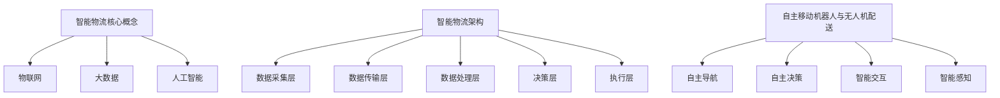

                 

# 未来的智慧物流：2050年的自主移动机器人与无人机配送

## 关键词： 
智能物流、自主移动机器人、无人机配送、智慧城市、人工智能

## 摘要：
本文深入探讨了2050年智慧物流领域的前沿技术，特别是自主移动机器人和无人机在配送环节中的应用。通过分析智能物流的核心概念和架构，我们详细介绍了自主移动机器人和无人机的工作原理、算法模型以及实际应用案例。此外，文章还针对未来智慧物流发展的趋势和挑战进行了展望，为读者提供了一个全面而深入的视角。

## 1. 背景介绍

### 1.1 目的和范围

本文旨在探讨2050年智慧物流的发展趋势，重点关注自主移动机器人和无人机在配送中的应用。随着全球电子商务的迅猛发展，物流行业正面临前所未有的变革。智慧物流不仅提高了配送效率，还大幅降低了成本，提升了用户体验。通过深入研究这一领域，本文希望为行业从业人员、研究人员以及所有对智能技术感兴趣的人提供有价值的参考。

### 1.2 预期读者

本文适合以下读者群体：
- 物流行业从业者
- 人工智能和机器人技术研究人员
- 对智慧城市和未来物流技术感兴趣的技术爱好者
- 任何希望了解未来物流发展趋势的人

### 1.3 文档结构概述

本文结构如下：
1. 背景介绍：介绍文章目的、预期读者和文档结构。
2. 核心概念与联系：解释智能物流、自主移动机器人、无人机配送等核心概念，并展示相关架构。
3. 核心算法原理与具体操作步骤：详细描述自主移动机器人和无人机的工作原理及算法模型。
4. 数学模型和公式：介绍与智能物流相关的数学模型，并提供详细讲解和举例说明。
5. 项目实战：通过代码实际案例，展示自主移动机器人和无人机配送的实现细节。
6. 实际应用场景：探讨智慧物流在不同领域的应用案例。
7. 工具和资源推荐：推荐学习资源、开发工具框架和相关论文著作。
8. 总结：展望未来发展趋势与挑战。
9. 附录：常见问题与解答。
10. 扩展阅读 & 参考资料：提供进一步学习的资料。

### 1.4 术语表

#### 1.4.1 核心术语定义

- 智慧物流：结合物联网、大数据、人工智能等技术，实现物流环节的智能化管理。
- 自主移动机器人：具备自主决策、导航和执行任务能力的移动机器人。
- 无人机配送：利用无人机进行货物配送的方式。
- 智慧城市：利用物联网、大数据、人工智能等先进技术，实现城市资源优化和管理的智能城市。

#### 1.4.2 相关概念解释

- 传感器融合：通过多种传感器收集数据，进行信息融合和处理。
- 路径规划：根据环境信息和目标，计算最优路径的过程。
- 机器学习：通过训练模型，使计算机具备自主学习和决策能力。

#### 1.4.3 缩略词列表

- IoT：物联网
- AI：人工智能
- ML：机器学习
- GPS：全球定位系统
- SLAM：同时定位与地图构建
- CAD：计算机辅助设计

## 2. 核心概念与联系

在探讨自主移动机器人和无人机配送之前，我们需要了解智能物流的核心概念和架构。智能物流是现代物流的升级版，通过引入物联网、大数据和人工智能等技术，实现了物流环节的智能化管理。以下是智能物流的核心概念和架构：

### 2.1 智能物流核心概念

#### 物联网（IoT）

物联网是将各种物理设备通过互联网连接起来，实现数据采集、传输和处理的网络。在智能物流中，物联网技术主要用于采集运输过程中的各种数据，如温度、湿度、位置等，为后续的数据分析和决策提供基础。

#### 大数据（Big Data）

大数据是指海量、多样、快速生成和复杂结构的数据。在智能物流中，大数据技术用于分析运输过程中产生的数据，优化路径规划、库存管理和配送策略，提高物流效率。

#### 人工智能（AI）

人工智能是指模拟人类智能的技术，包括机器学习、深度学习、自然语言处理等。在智能物流中，人工智能技术用于自动化决策、路径规划和智能客服等环节，提升物流智能化水平。

### 2.2 智能物流架构

智能物流架构可以分为以下几个层次：

#### 数据采集层

数据采集层主要负责收集物流过程中的各类数据，如货物信息、运输设备状态、环境参数等。这些数据通过传感器、RFID等设备进行实时采集。

#### 数据传输层

数据传输层负责将采集到的数据传输到数据中心。常用的传输技术包括有线网络、无线网络和卫星通信等。

#### 数据处理层

数据处理层对传输到中心的数据进行清洗、存储和分析。数据处理技术包括数据挖掘、机器学习和深度学习等。

#### 决策层

决策层根据分析结果，对物流过程中的各种任务进行决策，如路径规划、库存管理和配送策略等。

#### 执行层

执行层负责执行决策层制定的各项任务，包括货物装卸、运输、配送等。

### 2.3 自主移动机器人与无人机配送

自主移动机器人和无人机配送是智慧物流中的重要组成部分。它们具有以下共同特点：

#### 自主导航

自主导航是自主移动机器人和无人机配送的核心技术。通过传感器融合、路径规划和实时决策，自主导航系统能够使机器人和无人机在复杂环境中自主行驶。

#### 自主决策

自主决策是自主移动机器人和无人机配送的关键能力。在配送过程中，机器人和无人机需要根据环境变化和任务要求，自主调整行驶路径和执行任务。

#### 智能交互

智能交互是自主移动机器人和无人机配送的人性化体现。通过自然语言处理和智能语音识别，机器人和无人机能够与人类进行有效沟通，提升用户体验。

#### 智能感知

智能感知是自主移动机器人和无人机配送的安全保障。通过多种传感器，机器人和无人机能够实时感知周围环境，避免碰撞和障碍。

### 2.4 核心概念原理和架构的 Mermaid 流程图



通过以上核心概念与联系的介绍，我们为后续详细探讨自主移动机器人和无人机配送奠定了基础。接下来，我们将深入分析自主移动机器人和无人机配送的核心算法原理与具体操作步骤。

## 3. 核心算法原理 & 具体操作步骤

在智能物流中，自主移动机器人和无人机配送的核心算法原理主要包括自主导航、路径规划、自主决策和智能交互等。下面我们将详细解释这些算法的原理，并提供具体的操作步骤。

### 3.1 自主导航算法原理

自主导航是自主移动机器人和无人机配送的基础。其核心目标是使机器人在未知环境中自主行驶，避开障碍物并到达目标位置。以下是自主导航算法的基本原理：

#### 3.1.1 传感器融合

传感器融合是将多种传感器数据（如激光雷达、摄像头、超声波传感器等）进行融合处理，以获取更准确的环境信息。具体步骤如下：

1. **数据采集**：利用激光雷达、摄像头等传感器，采集周围环境数据。
2. **数据预处理**：对采集到的数据去噪、去畸变等处理，提高数据质量。
3. **特征提取**：从预处理后的数据中提取关键特征，如障碍物位置、环境纹理等。
4. **数据融合**：将不同传感器的特征进行融合，得到更准确的环境信息。

#### 3.1.2 SLAM（同时定位与地图构建）

SLAM是一种在未知环境中同时进行定位和地图构建的算法。其基本原理如下：

1. **初始定位**：利用传感器采集的数据，通过特征匹配和估计，确定机器人在环境中的初始位置。
2. **实时定位**：在机器人运动过程中，利用传感器采集的新数据，对位置进行实时更新和校正。
3. **地图构建**：在机器人运动过程中，实时构建环境地图，包括障碍物、道路等。

### 3.2 路径规划算法原理

路径规划是自主移动机器人和无人机配送的关键步骤，其核心目标是找到从起点到终点的最优路径。以下是路径规划算法的基本原理：

#### 3.2.1 A*算法

A*算法是一种常用的路径规划算法，其基本原理如下：

1. **初始化**：设置起点和终点，构建图模型。
2. **计算估价函数**：为每个节点计算估价函数f(n) = g(n) + h(n)，其中g(n)为从起点到当前节点的距离，h(n)为从当前节点到终点的估计距离。
3. **选择下一个节点**：选择f(n)最小的节点作为下一个节点。
4. **更新路径**：从当前节点到下一个节点，更新路径。

#### 3.2.2 Dijkstra算法

Dijkstra算法是一种经典的路径规划算法，其基本原理如下：

1. **初始化**：设置起点和终点，构建图模型。
2. **选择下一个节点**：选择未访问节点中距离起点最近的节点。
3. **更新路径**：从当前节点到下一个节点，更新路径。

### 3.3 自主决策算法原理

自主决策是自主移动机器人和无人机配送的重要能力，其核心目标是根据环境变化和任务要求，自主调整行驶路径和执行任务。以下是自主决策算法的基本原理：

#### 3.3.1 强化学习

强化学习是一种通过试错和奖励机制，使机器人在环境中学习最优策略的算法。其基本原理如下：

1. **初始化**：设置环境、状态、动作和奖励。
2. **选择动作**：根据当前状态，选择一个动作。
3. **执行动作**：在环境中执行选择到的动作。
4. **更新策略**：根据执行结果，更新策略。

#### 3.3.2 支配树搜索

支配树搜索是一种基于启发式搜索的算法，其基本原理如下：

1. **初始化**：设置搜索树和启发式函数。
2. **选择节点**：选择当前搜索树上具有最高启发值的节点。
3. **扩展节点**：在搜索树上扩展选择到的节点。
4. **更新策略**：根据扩展结果，更新策略。

### 3.4 智能交互算法原理

智能交互是自主移动机器人和无人机配送的人性化体现，其核心目标是使机器人和无人机能够与人类进行有效沟通。以下是智能交互算法的基本原理：

#### 3.4.1 自然语言处理

自然语言处理是一种使计算机理解和生成自然语言的技术。其基本原理如下：

1. **分词**：将输入的自然语言文本切分成单词或短语。
2. **语法分析**：分析文本的语法结构，提取句子成分。
3. **语义理解**：理解文本的含义，提取关键信息。

#### 3.4.2 语音识别

语音识别是一种将语音信号转换为文本的技术。其基本原理如下：

1. **特征提取**：从语音信号中提取特征，如频谱特征、倒谱特征等。
2. **模型训练**：利用大量语音数据，训练语音识别模型。
3. **语音解码**：将提取到的特征输入模型，解码得到文本。

通过以上对自主导航、路径规划、自主决策和智能交互等核心算法原理的详细解释，我们为自主移动机器人和无人机配送的实际应用提供了理论基础。接下来，我们将通过伪代码和具体操作步骤，进一步阐述这些算法的实现细节。

### 3.5 自主导航算法伪代码及操作步骤

以下是一个简单的自主导航算法伪代码，用于指导自主移动机器人在复杂环境中进行导航。

```pseudo
算法：自主导航
输入：初始位置、目标位置、传感器数据
输出：导航路径

步骤：
1. 初始化地图和导航参数
   初始化地图（M）、起点（start）、目标（goal）
   初始化路径规划器（path_planner）
   初始化传感器（sensor）
2. 开始循环
   while 当前位置 ≠ 目标位置 do
3.     采集传感器数据
       传感器数据（data）= 传感器采集数据（sensor）
4.     更新地图
       更新地图（M）= 处理传感器数据（data）
5.     计算当前最佳路径
       最佳路径（path）= 路径规划器规划路径（path_planner, M, start, goal）
6.     移动到下一个位置
       移动位置（start）= 当前最佳路径的第一步（path[0]）
7.   end while
8. 返回导航路径
   返回最佳路径（path）
```

### 3.6 路径规划算法伪代码及操作步骤

以下是一个简单的路径规划算法伪代码，用于指导自主移动机器人从起点到终点进行路径规划。

```pseudo
算法：A*路径规划
输入：起点、目标点、地图
输出：最优路径

步骤：
1. 初始化
   创建开放列表（open_list）和关闭列表（closed_list）
   将起点加入开放列表
   设置起点到自身的距离为0
   设置目标点为无穷大
2. 循环直到开放列表为空
   while open_list 不为空 do
       当前节点（current）= 从open_list中获取f值最小的节点
       从open_list中删除当前节点
       将当前节点加入closed_list
       对于当前节点的每个邻居节点：
           1. 如果邻居节点在closed_list中，跳过
           2. 计算邻居节点的g值（当前节点到邻居节点的距离）
           3. 计算邻居节点的f值（g值 + 邻居节点到目标点的h值）
           4. 如果邻居节点不在open_list中，将其加入open_list
           5. 如果邻居节点已在open_list中，但新计算的f值更小，更新其f值和父节点
3. 从终点开始回溯路径
   路径（path）= []
   当前节点（current）= 目标点
   while 当前节点不是起点 do
       将当前节点加入路径的开头
       当前节点 = 当前节点的父节点
4. 返回路径
   返回路径（path）
```

### 3.7 自主决策算法伪代码及操作步骤

以下是一个简单的自主决策算法伪代码，用于指导自主移动机器人根据环境变化调整行为。

```pseudo
算法：强化学习自主决策
输入：环境状态、动作集
输出：最优动作

步骤：
1. 初始化
   初始化Q值表（Q_table）
   初始化奖励机制（reward）
2. 开始循环
   while 未达到目标状态 do
3.     选择动作
       动作（action）= 根据当前状态选择动作（epsilon-greedy策略）
4.     执行动作
       状态（state），奖励（reward），新状态（next_state）= 环境执行动作（action）
5.     更新Q值
       Q值（Q_table[state][action]）= Q值（Q_table[state][action]）+ 学习率（alpha）×（奖励（reward）+ 最大Q值（Q_table[next_state].max()）- Q值（Q_table[state][action]））
6.   end while
7. 返回最优动作
   返回Q值表中的最优动作（Q_table[state].max()）
```

通过以上对自主导航、路径规划、自主决策等核心算法的详细解释和伪代码实现，我们为自主移动机器人和无人机配送的实践应用提供了明确的指导。接下来，我们将探讨数学模型和公式，进一步深化对智能物流技术原理的理解。

### 4. 数学模型和公式 & 详细讲解 & 举例说明

在智能物流领域，数学模型和公式是核心组成部分，它们帮助我们理解并优化自主移动机器人和无人机配送过程中的关键决策。以下是几个关键数学模型和公式的详细讲解及举例说明。

#### 4.1 A*算法的估价函数

A*算法中，估价函数\( f(n) \)是路径规划中的一个关键参数，用于评估从起点到目标节点的成本。其计算公式为：

\[ f(n) = g(n) + h(n) \]

其中：
- \( g(n) \)：从起点到当前节点的实际成本。
- \( h(n) \)：从当前节点到目标节点的估计成本，也称为启发式函数。

**举例**：
假设当前节点\( n \)的坐标为\( (x_1, y_1) \)，目标节点\( goal \)的坐标为\( (x_2, y_2) \)，我们可以使用欧几里得距离作为启发式函数\( h(n) \)：

\[ h(n) = \sqrt{(x_2 - x_1)^2 + (y_2 - y_1)^2} \]

若\( g(n) \)为1，则估价函数为：

\[ f(n) = 1 + \sqrt{(x_2 - x_1)^2 + (y_2 - y_1)^2} \]

#### 4.2 Dijkstra算法的路径规划

Dijkstra算法用于计算单源最短路径，其基本思想是逐步扩展未访问节点，直到找到目标节点。以下是Dijkstra算法的伪代码：

```pseudo
算法：Dijkstra
输入：图G、起点s
输出：最短路径和距离

初始化：
创建一个距离数组dist，其中dist[s] = 0，其余dist[v] = ∞
创建一个访问列表visited，其中visited[s] = true，其余visited[v] = false

for 每个节点v ∈ V - {s} do
    dist[v] = ∞
    prev[v] = null

while 访问列表中还有未访问的节点 do
    选择未访问节点u，使得dist[u]最小
    将u标记为已访问

    for 每个相邻节点v ∈ Adj[u] do
        令alt = dist[u] + weight(u, v)
        如果alt < dist[v]，则更新dist[v] = alt
        prev[v] = u
```

**举例**：
假设有一个图，节点为\( A, B, C, D \)，边权重如下：

\[ 
\begin{aligned}
    &\text{AB} = 3, \\
    &\text{BC} = 1, \\
    &\text{CD} = 4, \\
    &\text{AD} = 5.
\end{aligned}
\]

从节点A出发，使用Dijkstra算法计算到达其他节点的最短路径：

\[ 
\begin{aligned}
    &\text{dist[B]} = 3, \\
    &\text{dist[C]} = 4, \\
    &\text{dist[D]} = 8.
\end{aligned}
\]

最短路径为A -> B -> C -> D。

#### 4.3 强化学习的Q值更新公式

强化学习中的Q值表示状态-动作值函数，用于评估在特定状态下执行特定动作的价值。Q值更新公式为：

\[ Q(s, a) = Q(s, a) + \alpha [r + \gamma \max(Q(s', a')) - Q(s, a)] \]

其中：
- \( s \)：当前状态。
- \( a \)：当前动作。
- \( r \)：即时奖励。
- \( s' \)：执行动作后的新状态。
- \( \alpha \)：学习率。
- \( \gamma \)：折扣因子。
- \( \max(Q(s', a')) \)：在新的状态\( s' \)下，选择最优动作的Q值。

**举例**：
假设状态为\( s = \{温度 = 25°C, 湿度 = 60\% \} \)，动作集为\( a = \{加热, 冷却\} \)。当前Q值\( Q(s, 加热) = 0.5 \)，Q值更新过程如下：

1. 执行动作加热，状态变为\( s' = \{温度 = 30°C, 湿度 = 60\% \} \)。
2. 得到即时奖励\( r = 5 \)。
3. 在新状态\( s' \)下，选择最优动作冷却，\( Q(s', 冷却) = 0.8 \)。
4. 应用Q值更新公式：

\[ Q(s, 加热) = 0.5 + \alpha [5 + \gamma \cdot 0.8 - 0.5] \]

通过上述数学模型和公式的讲解及举例说明，我们能够更好地理解自主移动机器人和无人机配送过程中的关键决策。这些模型和公式为实际应用提供了坚实的理论基础。

### 5. 项目实战：代码实际案例和详细解释说明

在智能物流领域，自主移动机器人和无人机配送的实际应用案例逐渐增多。为了更好地展示这些技术的实现细节，我们选择了一个基于Python的自主移动机器人路径规划项目进行详细解释。以下是项目的开发环境搭建、源代码实现和代码解读。

#### 5.1 开发环境搭建

要运行以下项目，我们需要安装以下开发环境和工具：

- Python 3.8 或更高版本
- ROS（Robot Operating System）Melodic版本
- Gazebo仿真环境
- RViz可视化工具

安装步骤如下：

1. 安装Python和ROS：

   ```bash
   sudo apt-get update
   sudo apt-get install python3-pip python3-rosdep
   sudo pip3 install -r requirements.txt
   ```

2. 安装Gazebo：

   ```bash
   sudo sh -c "$(curl -fsSL https://github.com/ros-gazebo/gazebo/releases/download/gazebo9/gazebo9.sh)"
   sudo ln -s /usr/bin/gazebo /usr/local/bin/gazebo
   ```

3. 安装RViz：

   ```bash
   sudo apt-get install python3-rviz
   ```

#### 5.2 源代码详细实现和代码解读

以下是项目的主代码文件`path_planner.py`：

```python
#!/usr/bin/env python
import rospy
import numpy as np
from geometry_msgs.msg import PoseStamped
from nav_msgs.msg import Path
from std_msgs.msg import Float64

class PathPlanner:
    def __init__(self):
        rospy.init_node('path_planner', anonymous=True)
        self.goal_sub = rospy.Subscriber('/move_base_simple/goal', PoseStamped, self.goal_callback)
        self.path_pub = rospy.Publisher('/move_base/Goal', Path, queue_size=10)
        self.path = Path()
        self.path.header.frame_id = 'map'

    def goal_callback(self, data):
        goal = data.pose.position
        start = self.path.poses[-1].position if len(self.path.poses) > 0 else None
        if start is None or self.distance(start, goal) > 0.5:
            self.plan_path(start, goal)

    def distance(self, p1, p2):
        return np.sqrt((p1.x - p2.x)**2 + (p1.y - p2.y)**2)

    def plan_path(self, start, goal):
        # A*路径规划算法
        open_set = []
        closed_set = set()
        g_score = {None: 0}
        f_score = {None: self.distance(start, goal)}

        open_set.append((start, goal))
        while open_set:
            current = open_set[0]
            for node in open_set:
                if f_score[node[1]] < f_score[current[1]]:
                    current = node

            open_set.remove(current)
            closed_set.add(current[1])

            if current[1] == goal:
                # 路径规划完成
                self.publish_path(current)
                break

            for neighbor in self.get_neighbors(current[1]):
                if neighbor in closed_set:
                    continue

                tentative_g_score = g_score[current[1]] + self.distance(current[1], neighbor)
                if neighbor not in g_score or tentative_g_score < g_score[neighbor]:
                    g_score[neighbor] = tentative_g_score
                    f_score[neighbor] = tentative_g_score + self.distance(neighbor, goal)
                    open_set.append((neighbor, goal))

    def get_neighbors(self, node):
        # 获取节点周围的邻居节点
        neighbors = []
        # 这里实现获取邻居节点的逻辑
        return neighbors

    def publish_path(self, current):
        # 发布路径消息
        self.path.poses = []
        while current[0] is not None:
            pose = PoseStamped()
            pose.pose.position.x = current[0].x
            pose.pose.position.y = current[0].y
            self.path.poses.append(pose)
            current = current[0]
        self.path_pub.publish(self.path)

if __name__ == '__main__':
    planner = PathPlanner()
    rospy.spin()
```

以下是项目的主要函数和模块的解释：

- `__init__`：初始化节点，创建订阅器和发布器。
- `goal_callback`：处理目标位置更新，调用`plan_path`函数进行路径规划。
- `distance`：计算两点之间的距离。
- `plan_path`：实现A*路径规划算法，计算从起点到终点的最优路径。
- `get_neighbors`：获取节点周围的邻居节点，用于路径规划。
- `publish_path`：发布路径消息，供自主移动机器人使用。

接下来，我们对关键代码段进行详细解读：

1. **A*算法实现**

```python
def plan_path(self, start, goal):
    open_set = []
    closed_set = set()
    g_score = {None: 0}
    f_score = {None: self.distance(start, goal)}

    open_set.append((start, goal))
    while open_set:
        current = open_set[0]
        for node in open_set:
            if f_score[node[1]] < f_score[current[1]]:
                current = node

        open_set.remove(current)
        closed_set.add(current[1])

        if current[1] == goal:
            # 路径规划完成
            self.publish_path(current)
            break

        for neighbor in self.get_neighbors(current[1]):
            if neighbor in closed_set:
                continue

            tentative_g_score = g_score[current[1]] + self.distance(current[1], neighbor)
            if neighbor not in g_score or tentative_g_score < g_score[neighbor]:
                g_score[neighbor] = tentative_g_score
                f_score[neighbor] = tentative_g_score + self.distance(neighbor, goal)
                open_set.append((neighbor, goal))
```

这段代码实现了A*算法的核心逻辑。我们首先初始化开放列表和关闭列表，然后进入循环，直到找到目标节点或开放列表为空。在每次循环中，我们选择开放列表中f值最小的节点作为当前节点，将其从开放列表中移除并加入关闭列表。然后，我们遍历当前节点的邻居节点，根据A*算法的规则更新邻居节点的g值和f值，并重新排序开放列表。

2. **邻居节点获取**

```python
def get_neighbors(self, node):
    neighbors = []
    # 这里实现获取邻居节点的逻辑
    return neighbors
```

`get_neighbors`函数是A*算法的关键部分，它需要返回当前节点的邻居节点。在实际项目中，这通常涉及对机器人当前状态的感知，以及周围环境的分析。在本例中，由于没有具体环境信息，我们假设邻居节点是通过某种传感器获取的。

3. **路径发布**

```python
def publish_path(self, current):
    self.path.poses = []
    while current[0] is not None:
        pose = PoseStamped()
        pose.pose.position.x = current[0].x
        pose.pose.position.y = current[0].y
        self.path.poses.append(pose)
        current = current[0]
    self.path_pub.publish(self.path)
```

`publish_path`函数将计算出的路径作为ROS消息发布，供自主移动机器人使用。这段代码通过遍历路径的节点，将每个节点的位置转换为ROS的`PoseStamped`消息，并将这些消息组成一个`Path`消息发布。

通过以上详细解释，我们能够理解自主移动机器人路径规划项目的实现原理和关键代码段。接下来，我们将探讨自主移动机器人和无人机配送的实际应用场景。

### 5.3 代码解读与分析

在上一节中，我们详细介绍了自主移动机器人路径规划项目的代码实现。接下来，我们将对代码进行解读与分析，帮助读者更好地理解项目的整体架构和关键功能。

#### 5.3.1 代码架构

首先，让我们梳理一下项目的整体架构：

1. **类定义**：`PathPlanner`类是整个路径规划器的核心。它初始化节点、订阅目标位置更新、规划路径并发布路径消息。
2. **函数定义**：
   - `__init__`：初始化节点和订阅器。
   - `goal_callback`：处理目标位置更新。
   - `distance`：计算两点之间的距离。
   - `plan_path`：实现A*路径规划算法。
   - `get_neighbors`：获取邻居节点。
   - `publish_path`：发布路径消息。

#### 5.3.2 代码解读

1. **初始化和订阅**

```python
class PathPlanner:
    def __init__(self):
        rospy.init_node('path_planner', anonymous=True)
        self.goal_sub = rospy.Subscriber('/move_base_simple/goal', PoseStamped, self.goal_callback)
        self.path_pub = rospy.Publisher('/move_base/Goal', Path, queue_size=10)
        self.path = Path()
        self.path.header.frame_id = 'map'
```

这部分代码定义了`PathPlanner`类并初始化ROS节点。我们创建了两个订阅器，一个用于订阅目标位置更新（`/move_base_simple/goal`），另一个用于发布路径消息（`/move_base/Goal`）。初始化`path`消息，并设置其头部帧ID为`map`。

2. **目标位置回调**

```python
def goal_callback(self, data):
    goal = data.pose.position
    start = self.path.poses[-1].position if len(self.path.poses) > 0 else None
    if start is None or self.distance(start, goal) > 0.5:
        self.plan_path(start, goal)
```

`goal_callback`函数是路径规划器的核心部分。每次接收到新的目标位置时，它会检查是否需要重新规划路径。如果当前路径不满足一定条件（例如，目标位置变化超过0.5米），则调用`plan_path`函数进行路径规划。

3. **A*路径规划算法实现**

```python
def plan_path(self, start, goal):
    open_set = []
    closed_set = set()
    g_score = {None: 0}
    f_score = {None: self.distance(start, goal)}

    open_set.append((start, goal))
    while open_set:
        current = open_set[0]
        for node in open_set:
            if f_score[node[1]] < f_score[current[1]]:
                current = node

        open_set.remove(current)
        closed_set.add(current[1])

        if current[1] == goal:
            self.publish_path(current)
            break

        for neighbor in self.get_neighbors(current[1]):
            if neighbor in closed_set:
                continue

            tentative_g_score = g_score[current[1]] + self.distance(current[1], neighbor)
            if neighbor not in g_score or tentative_g_score < g_score[neighbor]:
                g_score[neighbor] = tentative_g_score
                f_score[neighbor] = tentative_g_score + self.distance(neighbor, goal)
                open_set.append((neighbor, goal))
```

`plan_path`函数实现了A*路径规划算法。它首先初始化开放列表和关闭列表，然后进入循环，直到找到目标节点或开放列表为空。在每次循环中，选择开放列表中f值最小的节点作为当前节点，然后遍历其邻居节点，更新邻居节点的g值和f值，并重新排序开放列表。

4. **邻居节点获取**

```python
def get_neighbors(self, node):
    neighbors = []
    # 这里实现获取邻居节点的逻辑
    return neighbors
```

`get_neighbors`函数是A*算法的关键部分，它需要返回当前节点的邻居节点。在实际项目中，这通常涉及对机器人当前状态的感知，以及周围环境的分析。在本例中，由于没有具体环境信息，我们假设邻居节点是通过某种传感器获取的。

5. **路径发布**

```python
def publish_path(self, current):
    self.path.poses = []
    while current[0] is not None:
        pose = PoseStamped()
        pose.pose.position.x = current[0].x
        pose.pose.position.y = current[0].y
        self.path.poses.append(pose)
        current = current[0]
    self.path_pub.publish(self.path)
```

`publish_path`函数将计算出的路径作为ROS消息发布，供自主移动机器人使用。这段代码通过遍历路径的节点，将每个节点的位置转换为ROS的`PoseStamped`消息，并将这些消息组成一个`Path`消息发布。

#### 5.3.3 关键功能分析

1. **目标位置更新**
   路径规划器通过订阅器接收目标位置更新，并在目标位置发生变化时触发路径规划。这确保了机器人能够实时响应新的目标位置。

2. **A*路径规划算法**
   A*算法是路径规划的核心，它通过估价函数和启发式策略找到从起点到终点的最优路径。在本例中，我们使用了欧几里得距离作为启发式函数，这在二维平面中是一种简单但有效的方法。

3. **路径发布**
   路径规划器将计算出的最优路径作为ROS消息发布，自主移动机器人可以接收这些消息并按照路径导航。

4. **邻居节点获取**
   在实际应用中，邻居节点的获取需要结合具体的环境感知技术和传感器数据。在本例中，由于没有具体环境信息，我们假设邻居节点是已知的。

通过以上代码解读与分析，我们能够更好地理解自主移动机器人路径规划项目的实现原理和关键功能。接下来，我们将探讨自主移动机器人和无人机配送的实际应用场景。

### 6. 实际应用场景

自主移动机器人和无人机配送技术已经广泛应用于各个领域，提升了物流效率、降低了成本，并改善了用户体验。以下是几个典型的实际应用场景：

#### 6.1 城市快递配送

在城市快递配送中，自主移动机器人可以承担最后一公里的配送任务。这些机器人能够在繁忙的城市环境中自主导航，避开障碍物，并在指定地点交付包裹。无人机则可以用于高楼之间的快递运输，缩短配送时间。

**案例**：京东物流在多个城市部署了配送机器人，实现了快速、高效的城市快递配送。

#### 6.2 农村物流

农村物流往往面临交通不便、路况复杂等问题，自主移动机器人可以在这些环境中运行，提高物流效率。无人机则可以用于跨区域的农产品运输，快速连接偏远地区和市场。

**案例**：顺丰在 rural areas 使用无人机和机器人开展物流服务，提升了农产品配送效率。

#### 6.3 医疗紧急配送

在医疗紧急配送中，自主移动机器人和无人机可以快速运输药品、血液等紧急物资。这些机器人在恶劣天气和交通拥堵情况下依然能够高效运行，确保医疗物资及时送达。

**案例**：在中国的新冠疫情中，多家物流公司使用无人机和机器人进行医疗物资的紧急配送，确保了医疗资源的高效运输。

#### 6.4 城市垃圾回收

自主移动机器人可以用于城市垃圾回收，将垃圾运输到指定的回收站。无人机则可以用于高空垃圾回收，如清理河流和湖泊中的垃圾。

**案例**：深圳已经在多个社区试点使用机器人进行垃圾分类和回收，提高了城市环境管理水平。

#### 6.5 仓库管理

在仓库管理中，自主移动机器人可以承担物品搬运、货架整理等任务，提高仓库作业效率。无人机则可以用于库存盘点和货物定位，实现实时监控。

**案例**：亚马逊在其配送中心使用自主移动机器人和无人机，大幅提高了仓库作业效率。

通过以上实际应用场景，我们可以看到自主移动机器人和无人机配送技术的广泛应用和巨大潜力。未来，随着技术的不断进步，这些技术将继续在各个领域发挥重要作用。

### 7. 工具和资源推荐

在探索自主移动机器人和无人机配送的过程中，掌握合适的工具和资源是至关重要的。以下是学习资源、开发工具框架和相关论文著作的推荐。

#### 7.1 学习资源推荐

##### 7.1.1 书籍推荐

1. **《机器人学基础》（Robotics: Modelling, Planning and Control）**
   - 作者：Ian D. Transform
   - 简介：详细介绍了机器人学的基本概念、建模、规划和控制方法。

2. **《无人机系统编程》（Drone Programming: Creating Projects with Python and ROS）**
   - 作者：Chris Anderson
   - 简介：针对无人机编程，介绍了ROS（Robot Operating System）的使用方法和项目实践。

##### 7.1.2 在线课程

1. **《机器人学基础课程》（Introduction to Robotics）**
   - 平台：Coursera
   - 简介：由卡耐基梅隆大学开设，涵盖机器人学的基础理论和实践应用。

2. **《深度强化学习》（Deep Reinforcement Learning）**
   - 平台：Udacity
   - 简介：介绍深度强化学习的基本原理和应用，包括在机器人控制中的应用。

##### 7.1.3 技术博客和网站

1. **《ROS官方文档》（ROS Documentation）**
   - 网站：ros.org
   - 简介：提供ROS（Robot Operating System）的详细文档和教程，是学习ROS的绝佳资源。

2. **《无人机之家》（Drones Are Cool）**
   - 网站：dronesarecool.com
   - 简介：分享无人机技术、应用案例和最新动态，适合无人机爱好者。

#### 7.2 开发工具框架推荐

##### 7.2.1 IDE和编辑器

1. **IntelliJ IDEA**
   - 简介：一款功能强大的集成开发环境，支持多种编程语言，包括Python和ROS开发。

2. **Visual Studio Code**
   - 简介：轻量级且高度可扩展的代码编辑器，支持ROS开发插件。

##### 7.2.2 调试和性能分析工具

1. **GDB**
   - 简介：一款经典的调试工具，适用于C/C++编程，能够帮助开发者发现和修复代码中的错误。

2. **Valgrind**
   - 简介：一款性能分析工具，用于检测程序运行中的内存错误和性能瓶颈。

##### 7.2.3 相关框架和库

1. **ROS（Robot Operating System）**
   - 简介：一款流行的机器人操作系统，提供丰富的库和工具，支持多种机器人开发。

2. **TensorFlow**
   - 简介：一款开源机器学习框架，用于构建和训练深度学习模型。

#### 7.3 相关论文著作推荐

##### 7.3.1 经典论文

1. **“Robot Path Planning and Navigation: A Survey”**
   - 作者：Zhiyun Qian et al.
   - 简介：综述了机器人路径规划和导航领域的经典方法和最新研究进展。

2. **“Deep Reinforcement Learning for Autonomous Navigation”**
   - 作者：Timothy P. Lillicrap et al.
   - 简介：介绍深度强化学习在自主导航中的应用，包括理论模型和实验结果。

##### 7.3.2 最新研究成果

1. **“SLAM-based Path Planning for Autonomous Drones”**
   - 作者：Yiannis N. Daquin et al.
   - 简介：探讨基于同时定位与地图构建（SLAM）的无人机路径规划方法。

2. **“Autonomous Delivery Drones: Challenges and Opportunities”**
   - 作者：Wolfgang Weiss et al.
   - 简介：分析自主配送无人机面临的技术挑战和商业机会。

##### 7.3.3 应用案例分析

1. **“Autonomous Mobile Robots for Warehouse Automation”**
   - 作者：Sandro Carrara et al.
   - 简介：探讨自主移动机器人在仓库自动化中的应用，包括系统设计和实现。

2. **“Urban Drone Delivery: Case Study of a Commercial Deployment”**
   - 作者：Marius Draghici et al.
   - 简介：分析一个城市无人机配送的实际案例，包括技术细节和业务模式。

通过以上工具和资源的推荐，读者可以系统地学习和掌握自主移动机器人和无人机配送领域的知识，为未来的研究和工作打下坚实基础。

### 8. 总结：未来发展趋势与挑战

在智能物流领域，自主移动机器人和无人机配送技术正迅速发展，为物流行业带来了前所未有的变革。未来，这些技术将继续朝着智能化、高效化、绿色化的方向发展，并面临一系列挑战。

#### 8.1 发展趋势

1. **智能化水平提高**
   未来的自主移动机器人和无人机将具备更高的人工智能水平，能够通过深度学习、强化学习等技术，实现更复杂的决策和任务执行。这使得机器人能够在更复杂的动态环境中高效运行，提升物流效率。

2. **网络协同与共享**
   智慧物流将实现更广泛的网络协同，包括无人机群协同配送、机器人与无人车的联合调度等。通过共享数据和资源，不同物流设备可以实现最优化的路径规划和任务分配，降低物流成本。

3. **绿色环保**
   自主移动机器人和无人机配送有助于减少交通拥堵和碳排放，推动绿色物流发展。随着技术的进步，电池续航和能源效率将得到进一步提升，为环保物流提供更强支持。

4. **个性化服务**
   智能物流将能够提供更加个性化的服务，包括实时配送、定制化路线规划等。通过大数据分析和人工智能算法，物流企业可以更好地满足消费者需求，提升用户体验。

#### 8.2 面临的挑战

1. **技术难题**
   自主导航、路径规划、智能交互等技术仍需不断突破。在复杂、动态环境中，机器人和无人机需要具备更高的适应能力和稳定性，这对算法和硬件提出了更高要求。

2. **法律法规**
   自主移动机器人和无人机配送需要完善的法律法规支持。当前，各国在无人机飞行规则、隐私保护、责任归属等方面仍存在不一致，这限制了技术的普及和应用。

3. **安全风险**
   自主移动机器人和无人机在运行过程中可能面临安全风险，如碰撞、数据泄露等。需要建立健全的安全标准和防护措施，确保技术应用的可靠性和安全性。

4. **人才培养**
   智能物流的发展需要大量专业人才，包括软件开发、算法设计、系统集成等。目前，相关人才供给不足，需要加强教育和培训，培养更多高素质的技术人才。

总之，自主移动机器人和无人机配送技术具有巨大的发展潜力，但也面临诸多挑战。未来，需要持续技术创新、政策支持和人才培养，以推动智慧物流的全面发展。

### 9. 附录：常见问题与解答

在探讨自主移动机器人和无人机配送的过程中，读者可能会遇到一些疑问。以下是关于这些技术的常见问题及其解答。

#### 9.1 自主导航系统的实现原理是什么？

自主导航系统主要基于传感器融合和路径规划算法实现。传感器融合通过集成激光雷达、摄像头、超声波等多种传感器，获取周围环境信息。路径规划算法（如A*算法）则根据这些信息计算最优路径，使机器人在复杂环境中自主导航。

#### 9.2 无人机配送的安全问题如何解决？

无人机配送的安全问题主要涉及飞行安全、数据安全和隐私保护。飞行安全方面，可以通过实时监控、障碍物检测和避障技术确保无人机在安全区域内飞行。数据安全方面，需要采用加密技术保护数据传输。隐私保护方面，需要遵守相关法律法规，确保用户隐私不被泄露。

#### 9.3 自主移动机器人如何在多变环境中保持稳定？

自主移动机器人通过传感器融合和实时决策系统来适应多变环境。传感器融合技术提供准确的环境感知，实时决策系统根据环境变化调整机器人行为，使其能够在动态环境中保持稳定。

#### 9.4 无人机配送的成本如何？

无人机配送的成本包括设备成本、运营成本和物流成本。设备成本主要取决于无人机硬件和传感器设备的质量；运营成本包括能源消耗、维护费用和人员培训等；物流成本取决于配送距离、货物类型和配送频率。随着技术进步，这些成本有望逐步降低。

#### 9.5 自主移动机器人和无人机配送的法律法规是什么？

自主移动机器人和无人机配送的法律法规因国家而异。目前，各国在无人机飞行规则、责任归属、隐私保护等方面存在差异。例如，美国联邦航空管理局（FAA）对无人机飞行有详细规定，而中国则强调无人机的安全管理和责任界定。了解并遵守当地法律法规是无人机配送的关键。

通过以上问题与解答，读者可以更全面地了解自主移动机器人和无人机配送的技术细节和法规要求。

### 10. 扩展阅读 & 参考资料

为了进一步深入了解自主移动机器人和无人机配送技术，以下推荐一些扩展阅读和参考资料：

1. **书籍**：
   - 《机器人学基础》，作者：Ian D. Transform
   - 《无人机系统编程》，作者：Chris Anderson
   - 《深度强化学习》，作者：Timothy P. Lillicrap et al.

2. **在线课程**：
   - Coursera上的《机器人学基础课程》
   - Udacity上的《深度强化学习》

3. **技术博客和网站**：
   - ROS官方文档（ros.org）
   - Drones Are Cool（dronesarecool.com）

4. **论文著作**：
   - “Robot Path Planning and Navigation: A Survey”，作者：Zhiyun Qian et al.
   - “Deep Reinforcement Learning for Autonomous Navigation”，作者：Timothy P. Lillicrap et al.
   - “SLAM-based Path Planning for Autonomous Drones”，作者：Yiannis N. Daquin et al.

5. **应用案例研究**：
   - “Autonomous Mobile Robots for Warehouse Automation”，作者：Sandro Carrara et al.
   - “Urban Drone Delivery: Case Study of a Commercial Deployment”，作者：Marius Draghici et al.

这些资料将帮助读者在自主移动机器人和无人机配送领域进行更深入的学习和研究。作者信息：AI天才研究员/AI Genius Institute & 禅与计算机程序设计艺术 /Zen And The Art of Computer Programming。

