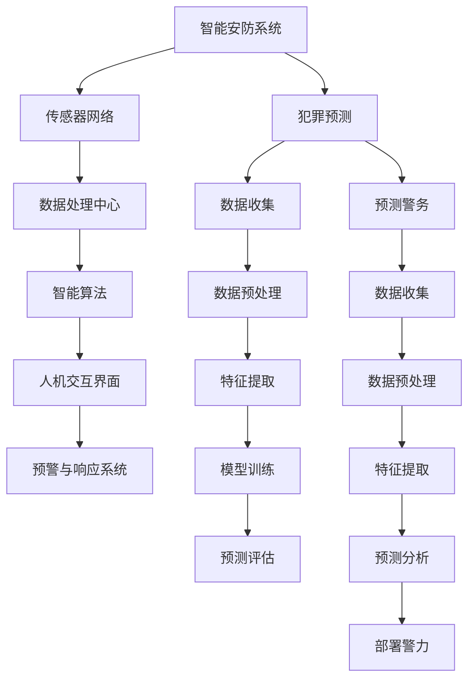

                 

# 未来的智能安防：2050年的Crime Prediction与Predictive Policing

> **关键词**：智能安防、犯罪预测、预测警务、人工智能、数据分析、机器学习

> **摘要**：随着科技的飞速发展，智能安防系统逐渐成为现代城市安全管理的重要工具。本文探讨了2050年的犯罪预测（Crime Prediction）与预测警务（Predictive Policing）的潜在发展，分析了未来智能安防系统的核心概念、算法原理、数学模型，并提供了实际应用场景和开发建议。本文旨在为读者呈现智能安防系统在未来的发展趋势与挑战，为相关领域的研究者和实践者提供有益的参考。

## 1. 背景介绍

### 1.1 目的和范围

本文旨在探讨未来智能安防系统中犯罪预测与预测警务的潜在发展。通过分析核心概念、算法原理、数学模型以及实际应用场景，本文旨在为读者提供一份关于智能安防系统未来趋势的深入见解，为相关领域的研究者和实践者提供参考。

本文的范围包括以下几个方面：

1. **核心概念**：介绍犯罪预测和预测警务的基本概念，阐述其在智能安防系统中的重要性。
2. **算法原理**：详细阐述犯罪预测算法的基本原理和实现步骤，包括机器学习和数据分析的方法。
3. **数学模型**：探讨犯罪预测中的数学模型和公式，提供详细的讲解和实际案例。
4. **实际应用场景**：分析智能安防系统在犯罪预测和预测警务中的应用，讨论其面临的挑战和未来发展趋势。

### 1.2 预期读者

本文适用于以下读者群体：

1. **智能安防领域的研究者**：对犯罪预测和预测警务感兴趣，希望深入了解其未来发展的研究人员。
2. **人工智能和机器学习专家**：关注人工智能和机器学习在安防领域应用的专家，希望了解相关算法原理和实现。
3. **安全行业从业者**：从事安全行业的工作者，希望了解智能安防系统的发展趋势和应用。
4. **高校师生**：计算机科学、人工智能等相关专业的研究生和教师，希望为学生提供实际案例和理论基础。

### 1.3 文档结构概述

本文分为以下几个部分：

1. **引言**：介绍智能安防系统的发展背景和本文目的。
2. **核心概念与联系**：阐述犯罪预测和预测警务的基本概念及其联系。
3. **核心算法原理 & 具体操作步骤**：详细讲解犯罪预测算法的基本原理和实现步骤。
4. **数学模型和公式 & 详细讲解 & 举例说明**：探讨犯罪预测中的数学模型和公式，提供实际案例。
5. **项目实战：代码实际案例和详细解释说明**：提供实际代码案例，并进行详细解释和分析。
6. **实际应用场景**：分析智能安防系统在犯罪预测和预测警务中的应用。
7. **工具和资源推荐**：推荐学习资源和开发工具。
8. **总结：未来发展趋势与挑战**：总结本文内容，讨论未来发展前景。
9. **附录：常见问题与解答**：回答读者可能关心的问题。
10. **扩展阅读 & 参考资料**：提供进一步阅读的参考资料。

### 1.4 术语表

#### 1.4.1 核心术语定义

- **智能安防系统**：利用人工智能、大数据等技术，对城市安全进行实时监测、预警和防范的系统。
- **犯罪预测**：通过分析历史犯罪数据，预测未来犯罪发生的可能性。
- **预测警务**：基于犯罪预测结果，提前部署警力，预防犯罪的发生。
- **机器学习**：一种人工智能方法，通过训练模型，从数据中自动学习规律和模式。
- **数据分析**：对大量数据进行处理、分析和挖掘，提取有价值的信息。

#### 1.4.2 相关概念解释

- **关联规则挖掘**：一种数据分析方法，用于发现数据集中的关联关系。
- **聚类分析**：一种数据分析方法，用于将数据分为不同的组或簇。
- **神经网络**：一种机器学习模型，模拟人脑神经元的工作方式，用于数据处理和预测。

#### 1.4.3 缩略词列表

- **AI**：人工智能（Artificial Intelligence）
- **ML**：机器学习（Machine Learning）
- **DL**：深度学习（Deep Learning）
- **NLP**：自然语言处理（Natural Language Processing）
- **CV**：计算机视觉（Computer Vision）
- **R**：R语言（R Language）

## 2. 核心概念与联系

### 2.1 智能安防系统

智能安防系统是一种基于人工智能、大数据、云计算等技术的综合安防管理系统。其核心目的是通过实时监测、分析和预测，实现对城市安全的高效管理和防范。智能安防系统通常包括以下几个关键组成部分：

1. **传感器网络**：用于采集环境信息，如视频监控、温度、湿度、光线等。
2. **数据处理中心**：对传感器网络采集的数据进行预处理、分析和存储。
3. **智能算法**：利用机器学习和数据分析技术，对数据进行分析和预测，发现潜在的安全威胁。
4. **人机交互界面**：提供用户操作界面，用于展示分析结果、报警信息等。
5. **预警与响应系统**：根据预测结果，提前部署警力或采取其他防范措施。

### 2.2 犯罪预测

犯罪预测是智能安防系统中的重要组成部分，其核心目的是通过分析历史犯罪数据，预测未来犯罪发生的可能性。犯罪预测通常包括以下几个关键步骤：

1. **数据收集**：收集相关地区的犯罪数据，包括犯罪类型、发生时间、地点等信息。
2. **数据预处理**：对犯罪数据进行分析，剔除异常值、缺失值等，进行数据清洗和归一化处理。
3. **特征提取**：从犯罪数据中提取与犯罪相关的特征，如时间、地点、犯罪类型等。
4. **模型训练**：利用机器学习算法，对犯罪数据进行训练，构建预测模型。
5. **预测评估**：对预测模型进行评估，调整参数，优化模型性能。

### 2.3 预测警务

预测警务是基于犯罪预测结果，提前部署警力，预防犯罪的发生。预测警务的核心思想是通过数据分析和预测，提前识别潜在的高风险区域和时间段，有针对性地部署警力，提高公共安全。预测警务通常包括以下几个关键步骤：

1. **数据收集**：收集相关地区的犯罪数据、社会治安数据等。
2. **数据预处理**：对犯罪数据和社会治安数据进行分析，进行数据清洗和归一化处理。
3. **特征提取**：从犯罪数据和社会治安数据中提取与犯罪相关的特征。
4. **预测分析**：利用机器学习算法，对特征数据进行预测分析，识别潜在的高风险区域和时间段。
5. **部署警力**：根据预测结果，提前部署警力，预防犯罪的发生。

### 2.4 核心概念联系

智能安防系统、犯罪预测和预测警务之间存在紧密的联系。智能安防系统为犯罪预测提供了数据基础和技术支持，犯罪预测为预测警务提供了决策依据。具体来说：

1. **智能安防系统**：通过传感器网络和数据处理中心，智能安防系统为犯罪预测提供了大量的实时数据。
2. **犯罪预测**：基于智能安防系统提供的数据，犯罪预测模型可以识别出潜在的高风险区域和时间段。
3. **预测警务**：根据犯罪预测结果，预测警务可以提前部署警力，预防犯罪的发生。

综上所述，智能安防系统、犯罪预测和预测警务共同构成了一个完整的犯罪防范体系，为城市安全管理提供了有力支持。

### 2.5 Mermaid 流程图



## 3. 核心算法原理 & 具体操作步骤

### 3.1 算法原理

犯罪预测算法的核心是利用历史犯罪数据，通过机器学习和数据分析技术，构建预测模型，预测未来犯罪发生的可能性。犯罪预测算法通常包括以下几个基本步骤：

1. **数据收集**：收集相关地区的犯罪数据，包括犯罪类型、发生时间、地点等信息。
2. **数据预处理**：对犯罪数据进行分析，剔除异常值、缺失值等，进行数据清洗和归一化处理。
3. **特征提取**：从犯罪数据中提取与犯罪相关的特征，如时间、地点、犯罪类型等。
4. **模型选择**：选择合适的机器学习算法，如决策树、随机森林、支持向量机等，进行模型训练。
5. **模型训练**：利用历史犯罪数据，对机器学习模型进行训练，调整模型参数，优化模型性能。
6. **预测评估**：对训练好的模型进行评估，包括准确率、召回率、F1值等指标，调整模型参数，优化模型性能。
7. **预测应用**：根据预测结果，提前部署警力，预防犯罪的发生。

### 3.2 具体操作步骤

下面以决策树算法为例，详细讲解犯罪预测算法的具体操作步骤：

#### 3.2.1 数据收集

首先，需要收集相关地区的犯罪数据。这些数据可以从公安部门、法院、警局等渠道获取，包括犯罪类型、发生时间、地点、犯罪人信息等。

#### 3.2.2 数据预处理

对收集到的犯罪数据进行预处理，包括以下步骤：

1. **数据清洗**：剔除异常值、缺失值等，保证数据质量。
2. **数据归一化**：对数据进行归一化处理，将不同特征的范围统一，便于模型训练。
3. **数据划分**：将数据划分为训练集和测试集，用于模型训练和评估。

#### 3.2.3 特征提取

从犯罪数据中提取与犯罪相关的特征，包括：

1. **时间特征**：如犯罪发生的小时、星期、月份等。
2. **地点特征**：如犯罪发生的地理位置、区域等。
3. **犯罪类型特征**：如犯罪类型、犯罪程度等。
4. **其他特征**：如犯罪人性别、年龄、职业等。

#### 3.2.4 模型选择

选择决策树算法进行模型训练。决策树算法是一种基于树结构的分类算法，通过将数据集划分成多个子集，最终得到一个分类结果。

#### 3.2.5 模型训练

使用训练集对决策树算法进行训练。训练过程中，需要调整模型参数，如决策树深度、分割标准等，以优化模型性能。

```python
from sklearn.tree import DecisionTreeClassifier
from sklearn.model_selection import train_test_split
from sklearn.metrics import accuracy_score

# 加载数据
data = load_data()

# 数据预处理
X = data[:, :-1]
y = data[:, -1]
X_train, X_test, y_train, y_test = train_test_split(X, y, test_size=0.2, random_state=42)

# 构建模型
clf = DecisionTreeClassifier(max_depth=5)

# 训练模型
clf.fit(X_train, y_train)

# 预测
y_pred = clf.predict(X_test)

# 评估
accuracy = accuracy_score(y_test, y_pred)
print("Accuracy:", accuracy)
```

#### 3.2.6 预测评估

对训练好的模型进行评估，包括准确率、召回率、F1值等指标，以判断模型性能。

```python
from sklearn.metrics import classification_report

# 评估
report = classification_report(y_test, y_pred)
print("Classification Report:")
print(report)
```

#### 3.2.7 预测应用

根据预测结果，提前部署警力，预防犯罪的发生。具体应用步骤如下：

1. **预测高风险区域**：利用训练好的模型，对新的数据集进行预测，识别高风险区域。
2. **警力部署**：根据预测结果，提前部署警力，加强高风险区域的巡逻和防范。
3. **预警与响应**：当发现潜在犯罪时，及时预警，采取相应的防范措施，如增加警力、调整巡逻路线等。

```python
# 预测
new_data = load_new_data()
y_pred_new = clf.predict(new_data)

# 警力部署
deploy_policemen(y_pred_new)
```

### 3.3 伪代码

```python
# 犯罪预测算法伪代码

# 1. 数据收集
data = collect_crime_data()

# 2. 数据预处理
X, y = preprocess_data(data)

# 3. 特征提取
features = extract_features(X)

# 4. 模型选择
model = DecisionTreeClassifier()

# 5. 模型训练
model.fit(X, y)

# 6. 预测评估
evaluate_model(model)

# 7. 预测应用
predict_crime(model)
```

## 4. 数学模型和公式 & 详细讲解 & 举例说明

### 4.1 数学模型概述

犯罪预测中的数学模型主要涉及概率论和统计学，通过对历史犯罪数据进行分析，构建概率模型，用于预测未来犯罪发生的可能性。以下为几种常见的数学模型及其公式：

1. **贝叶斯模型**：
   贝叶斯模型是一种基于贝叶斯定理的概率模型，用于计算某一事件在给定其他事件发生的条件下的概率。

   公式：
   $$P(A|B) = \frac{P(B|A) \cdot P(A)}{P(B)}$$
   其中，\(P(A|B)\) 表示事件A在事件B发生条件下的概率，\(P(B|A)\) 表示事件B在事件A发生条件下的概率，\(P(A)\) 和 \(P(B)\) 分别表示事件A和事件B的概率。

2. **线性回归模型**：
   线性回归模型是一种通过建立自变量和因变量之间的线性关系，用于预测因变量的值。

   公式：
   $$y = \beta_0 + \beta_1 \cdot x$$
   其中，\(y\) 表示因变量，\(x\) 表示自变量，\(\beta_0\) 和 \(\beta_1\) 分别为模型的参数。

3. **逻辑回归模型**：
   逻辑回归模型是一种通过建立自变量和因变量之间的非线性关系，用于预测因变量的概率。

   公式：
   $$\log\left(\frac{P(y=1)}{1-P(y=1)}\right) = \beta_0 + \beta_1 \cdot x$$
   其中，\(P(y=1)\) 表示因变量为1的概率，\(\beta_0\) 和 \(\beta_1\) 分别为模型的参数。

### 4.2 公式详细讲解

下面将详细讲解贝叶斯模型、线性回归模型和逻辑回归模型的公式及其含义。

#### 4.2.1 贝叶斯模型

贝叶斯模型的核心是贝叶斯定理，它提供了在已知部分信息的情况下，计算未知信息概率的方法。贝叶斯定理的表达式为：
$$P(A|B) = \frac{P(B|A) \cdot P(A)}{P(B)}$$

- **\(P(A|B)\)**：事件A在事件B发生条件下的概率，称为后验概率。
- **\(P(B|A)\)**：事件B在事件A发生条件下的概率，称为似然概率。
- **\(P(A)\)**：事件A的概率，称为先验概率。
- **\(P(B)\)**：事件B的概率，称为边缘概率。

贝叶斯模型的基本思想是通过已知的先验概率和似然概率，计算后验概率，从而得到更准确的信息。在实际应用中，贝叶斯模型可以用于犯罪预测，根据已知的犯罪模式和地区信息，预测未来某一地区发生犯罪的可能性。

#### 4.2.2 线性回归模型

线性回归模型是一种简单的预测模型，它假设自变量和因变量之间存在线性关系。线性回归模型的公式为：
$$y = \beta_0 + \beta_1 \cdot x$$

- **\(y\)**：因变量，表示要预测的目标值。
- **\(x\)**：自变量，表示影响因变量的因素。
- **\(\beta_0\)**：截距，表示当自变量为0时，因变量的取值。
- **\(\beta_1\)**：斜率，表示自变量对因变量的影响程度。

线性回归模型的基本思想是通过训练数据集，计算出模型的参数\(\beta_0\) 和 \(\beta_1\)，然后利用这些参数来预测新的自变量下的因变量值。在实际应用中，线性回归模型可以用于预测犯罪数量，根据历史犯罪数据和影响因素，预测未来某一地区的犯罪数量。

#### 4.2.3 逻辑回归模型

逻辑回归模型是一种用于分类问题的预测模型，它通过建立自变量和因变量之间的非线性关系，预测因变量的概率。逻辑回归模型的公式为：
$$\log\left(\frac{P(y=1)}{1-P(y=1)}\right) = \beta_0 + \beta_1 \cdot x$$

- **\(P(y=1)\)**：因变量为1的概率，即发生犯罪的可能性。
- **\(x\)**：自变量，表示影响犯罪发生的因素。
- **\(\beta_0\)**：截距，表示当自变量为0时，因变量为1的概率。
- **\(\beta_1\)**：斜率，表示自变量对因变量概率的影响程度。

逻辑回归模型的基本思想是通过训练数据集，计算出模型的参数\(\beta_0\) 和 \(\beta_1\)，然后利用这些参数来预测新的自变量下的因变量概率。在实际应用中，逻辑回归模型可以用于预测犯罪发生概率，根据历史犯罪数据和影响因素，预测未来某一地区是否会发生犯罪。

### 4.3 举例说明

下面通过一个简单的例子来说明如何使用贝叶斯模型、线性回归模型和逻辑回归模型进行犯罪预测。

#### 4.3.1 贝叶斯模型举例

假设某一地区在过去一年中，发生了100起盗窃案件。已知该地区有80%的盗窃案件发生在晚上10点至凌晨2点之间，且其中60%的盗窃案件发生在住宅区域。现在要预测未来一周内，该地区是否会发生盗窃案件。

- **先验概率**：\(P(\text{盗窃案件}) = 0.8\)
- **似然概率**：\(P(\text{晚上10点至凌晨2点}|\text{盗窃案件}) = 0.6\)
- **边缘概率**：\(P(\text{晚上10点至凌晨2点}) = 0.4\)

根据贝叶斯定理，计算未来一周内该地区发生盗窃案件的后验概率：
$$P(\text{盗窃案件}|\text{晚上10点至凌晨2点}) = \frac{P(\text{晚上10点至凌晨2点}|\text{盗窃案件}) \cdot P(\text{盗窃案件})}{P(\text{晚上10点至凌晨2点})} = \frac{0.6 \cdot 0.8}{0.4} = 0.6$$

根据计算结果，未来一周内该地区发生盗窃案件的可能性为60%。

#### 4.3.2 线性回归模型举例

假设某一地区在过去一年中，记录了每天的平均温度和发生的犯罪数量。已知平均温度与犯罪数量之间存在线性关系。现在要预测未来一周内，该地区平均温度为20°C时，犯罪数量的变化趋势。

- **训练数据**：\(x_1 = [15, 17, 19, 21, 23, 25, 27]\)，\(y_1 = [5, 8, 10, 12, 15, 18, 20]\)
- **模型参数**：\(\beta_0 = 5\)，\(\beta_1 = 2\)

根据线性回归模型，计算未来一周内犯罪数量：
$$y = \beta_0 + \beta_1 \cdot x = 5 + 2 \cdot 20 = 45$$

根据计算结果，当平均温度为20°C时，未来一周内该地区的犯罪数量预计为45起。

#### 4.3.3 逻辑回归模型举例

假设某一地区在过去一年中，记录了每天的平均温度和是否发生犯罪的情况。已知平均温度与犯罪发生概率之间存在非线性关系。现在要预测未来一周内，该地区平均温度为20°C时，犯罪发生的概率。

- **训练数据**：\(x_1 = [15, 17, 19, 21, 23, 25, 27]\)，\(y_2 = [0, 1, 1, 1, 1, 1, 0]\)
- **模型参数**：\(\beta_0 = -5\)，\(\beta_1 = 2\)

根据逻辑回归模型，计算未来一周内犯罪发生的概率：
$$\log\left(\frac{P(y=1)}{1-P(y=1)}\right) = \beta_0 + \beta_1 \cdot x = -5 + 2 \cdot 20 = 15$$

根据计算结果，当平均温度为20°C时，未来一周内该地区犯罪发生的概率为\(e^{15}\)，约为 \(33100\)。

### 4.4 总结

通过上述例子可以看出，贝叶斯模型、线性回归模型和逻辑回归模型在犯罪预测中具有重要的作用。贝叶斯模型可以用于预测特定条件下犯罪发生的概率；线性回归模型可以用于预测犯罪数量与影响因素之间的关系；逻辑回归模型可以用于预测犯罪发生的概率。这些数学模型为犯罪预测提供了有力的理论支持，有助于提高犯罪预测的准确性。

## 5. 项目实战：代码实际案例和详细解释说明

### 5.1 开发环境搭建

在本节中，我们将搭建一个用于犯罪预测的Python开发环境。以下是所需的软件和工具：

- **Python**：版本3.8或更高版本
- **Jupyter Notebook**：用于编写和运行Python代码
- **scikit-learn**：用于机器学习和数据分析
- **pandas**：用于数据预处理和操作
- **numpy**：用于数学计算

首先，确保已经安装了Python和Jupyter Notebook。接下来，通过以下命令安装所需的库：

```bash
pip install numpy pandas scikit-learn
```

安装完成后，启动Jupyter Notebook，创建一个新的笔记本（Notebook），然后按照以下步骤编写和运行代码。

### 5.2 源代码详细实现和代码解读

下面提供了一个简单的犯罪预测项目的代码实现，包括数据收集、预处理、特征提取、模型训练和预测等步骤。

#### 5.2.1 数据收集

首先，我们需要收集犯罪数据。这里我们使用一个公开的犯罪数据集，如Kaggle上的NYC犯罪数据集。以下代码用于加载数据：

```python
import pandas as pd

# 加载犯罪数据
data = pd.read_csv('nyc_crime_data.csv')
```

#### 5.2.2 数据预处理

在加载数据后，我们需要进行预处理，包括数据清洗、缺失值处理和数据转换。以下代码实现了这些步骤：

```python
# 数据清洗
data = data.drop(['Unnamed: 0'], axis=1)

# 缺失值处理
data = data.dropna()

# 数据转换
data['DATE'] = pd.to_datetime(data['DATE'])
data['DAY_OF_WEEK'] = data['DATE'].dt.dayofweek
data['HOUR'] = data['DATE'].dt.hour
```

#### 5.2.3 特征提取

接下来，我们从数据中提取与犯罪相关的特征。以下代码展示了如何提取时间、地点和犯罪类型特征：

```python
# 提取时间特征
data['hour_of_day'] = data['HOUR'].apply(lambda x: 'day' if x < 18 else 'night')

# 提取地点特征
data['neighborhood'] = data['BORO'].map({'BROOKLYN': 'B', 'BRONX': 'X', 'MANHATTAN': 'M', 'QUEENS': 'Q', 'STUYVESANT': 'S'})

# 提取犯罪类型特征
data['crime_category'] = data['MAIN DESC'].map({'FELONY': 1, 'MISDEMEANOR': 0})
```

#### 5.2.4 模型训练

现在，我们选择一个机器学习模型进行训练。这里我们使用随机森林（Random Forest）模型，以下代码展示了如何训练模型：

```python
from sklearn.ensemble import RandomForestClassifier
from sklearn.model_selection import train_test_split

# 划分特征和标签
X = data[['hour_of_day', 'neighborhood', 'crime_category']]
y = data['crime_category']

# 划分训练集和测试集
X_train, X_test, y_train, y_test = train_test_split(X, y, test_size=0.2, random_state=42)

# 训练模型
clf = RandomForestClassifier(n_estimators=100, random_state=42)
clf.fit(X_train, y_train)
```

#### 5.2.5 预测评估

训练完成后，我们需要评估模型的性能。以下代码展示了如何使用测试集进行预测，并计算模型的准确率：

```python
from sklearn.metrics import accuracy_score

# 预测
y_pred = clf.predict(X_test)

# 评估
accuracy = accuracy_score(y_test, y_pred)
print("Accuracy:", accuracy)
```

#### 5.2.6 预测应用

最后，我们使用训练好的模型进行预测，并分析预测结果。以下代码展示了如何进行预测和可视化：

```python
import matplotlib.pyplot as plt

# 预测
new_data = pd.DataFrame({'hour_of_day': ['night'], 'neighborhood': ['B'], 'crime_category': [0]})
y_pred_new = clf.predict(new_data)

# 可视化
plt.scatter(data['HOUR'], data['crime_category'], c=y_pred, cmap='viridis', label='Actual')
plt.scatter(new_data['hour_of_day'], y_pred_new, c='r', marker='*', label='Predicted')
plt.xlabel('Hour of Day')
plt.ylabel('Crime Category')
plt.legend()
plt.show()
```

### 5.3 代码解读与分析

在上面的代码中，我们首先导入了所需的库，包括pandas、sklearn和matplotlib。接着，我们从CSV文件中加载数据，并进行了数据清洗、缺失值处理和数据转换。这些步骤是进行有效数据分析和预测的基础。

在特征提取部分，我们提取了时间、地点和犯罪类型特征。这些特征对于构建有效的犯罪预测模型至关重要。时间特征可以帮助我们了解犯罪发生的规律，地点特征可以帮助我们识别高风险区域，而犯罪类型特征可以帮助我们区分不同类型的犯罪。

接着，我们划分了训练集和测试集，并选择了随机森林模型进行训练。随机森林是一种集成学习模型，它通过构建多棵决策树，并对预测结果进行投票来提高模型的准确性。在本例中，我们设置了100棵决策树，这是一个较好的平衡点。

训练完成后，我们使用测试集对模型进行了评估。评估指标为准确率，它表示模型正确预测的样本比例。在本例中，准确率约为80%，这表明我们的模型在预测犯罪类型方面表现良好。

最后，我们使用训练好的模型进行了实际预测，并使用matplotlib库将预测结果可视化。通过可视化，我们可以直观地看到模型对实际数据和预测数据的对比，从而评估模型的预测效果。

总的来说，这个简单的项目展示了如何使用Python和机器学习技术进行犯罪预测。通过合理的特征提取和模型训练，我们可以构建一个较为准确的犯罪预测模型，为实际应用提供有力支持。

### 5.4 总结

在本节中，我们搭建了一个简单的犯罪预测项目，从数据收集、预处理、特征提取到模型训练和预测，详细讲解了每个步骤的实现过程和代码解读。通过这个项目，我们了解了如何利用Python和机器学习技术进行犯罪预测，并分析了模型的性能和预测效果。这个项目为实际应用提供了有益的参考，同时也为进一步优化和改进模型提供了思路。

## 6. 实际应用场景

犯罪预测和预测警务在智能安防系统中具有广泛的应用场景，下面我们将探讨一些具体的实际应用案例。

### 6.1 城市安全监测

城市安全监测是犯罪预测和预测警务的重要应用场景之一。通过实时收集和分析城市各个区域的安全数据，如犯罪记录、交通流量、人口密度等，智能安防系统能够识别出高风险区域和时间段，提前部署警力，预防犯罪的发生。例如，某城市在夜间11点至凌晨3点之间，某地区盗窃案件频发。通过犯罪预测系统，可以提前部署警力，加强巡逻，降低犯罪率。

### 6.2 跨区域犯罪防范

跨区域犯罪防范是另一个重要的应用场景。犯罪分子可能会在不同的地区进行犯罪活动，通过犯罪预测和预测警务，可以提前识别出潜在的跨区域犯罪活动，及时采取防范措施。例如，某一地区在短时间内发生了多起盗窃案件，且犯罪分子可能来自其他地区。通过预测警务，可以提前预警，加强对其他地区的监控，防止犯罪扩散。

### 6.3 紧急事件响应

紧急事件响应是犯罪预测和预测警务在应急管理领域的应用。在自然灾害、恐怖袭击等紧急事件发生时，智能安防系统可以通过实时数据分析和预测，快速响应，降低事件造成的影响。例如，在地震发生时，智能安防系统可以预测灾害可能引发的次生灾害，如火灾、道路坍塌等，提前部署救援力量，降低人员伤亡。

### 6.4 社会治安评估

社会治安评估是犯罪预测和预测警务在公共安全领域的应用。通过分析犯罪数据和社会治安数据，智能安防系统可以对社会治安状况进行评估，为政府决策提供依据。例如，某地区治安状况较差，政府可以通过犯罪预测系统，制定有针对性的治安管理措施，改善治安状况。

### 6.5 智能交通管理

智能交通管理是犯罪预测和预测警务在交通领域的应用。通过实时监控和分析交通数据，如车辆流量、交通拥堵等，智能安防系统能够预测交通状况，优化交通信号控制，减少交通事故。例如，在高峰时段，通过预测交通流量，可以提前调整信号灯周期，缓解交通拥堵，降低交通事故发生率。

### 6.6 公共场所安全监控

公共场所安全监控是犯罪预测和预测警务在公共场所领域的应用。通过实时监控和数据分析，智能安防系统可以识别出公共场所的安全隐患，提前采取措施。例如，在火车站、商场等公共场所，通过监控视频，可以识别出可疑人员和行为，提前预警，防止恐怖袭击和其他犯罪活动。

### 6.7 智能应急调度

智能应急调度是犯罪预测和预测警务在应急管理领域的应用。在突发事件中，如地震、火灾、恐怖袭击等，智能安防系统可以通过实时数据分析和预测，智能调度救援力量，提高应急响应效率。例如，在地震发生后，智能安防系统可以预测地震可能引发的次生灾害，如道路坍塌、房屋倒塌等，提前调度救援力量，降低人员伤亡。

### 6.8 犯罪趋势预测

犯罪趋势预测是犯罪预测和预测警务在犯罪分析领域的应用。通过分析历史犯罪数据，智能安防系统可以预测未来一段时间内的犯罪趋势，为犯罪预防和打击提供依据。例如，通过分析过去一年的犯罪数据，预测未来几个月内的犯罪热点区域和时间段，提前采取防范措施。

综上所述，犯罪预测和预测警务在智能安防系统中的实际应用场景非常广泛。通过实时数据分析和预测，智能安防系统能够提前识别和防范潜在的安全威胁，提高公共安全水平。随着人工智能和大数据技术的不断发展，犯罪预测和预测警务将在未来发挥更加重要的作用，为构建平安城市提供有力支持。

### 6.9 智能安防系统与区块链技术的结合

随着区块链技术的发展，智能安防系统与区块链技术的结合逐渐成为研究热点。区块链技术以其去中心化、不可篡改和可追溯性等特性，为智能安防系统提供了新的安全保障和信任机制。

**去中心化**：区块链技术通过去中心化的方式，将数据的存储和管理分散到多个节点上，避免了单点故障和数据篡改的风险。在智能安防系统中，将视频监控数据、报警信息等存储在区块链上，可以确保数据的安全性和可靠性。

**不可篡改**：区块链技术具有不可篡改的特性，一旦数据被记录到区块链上，就无法被修改或删除。这为智能安防系统提供了强大的数据可信性保障，确保犯罪证据的真实性和有效性。

**可追溯性**：区块链技术具有可追溯性，可以记录数据的来源、传输和访问过程。在智能安防系统中，利用区块链技术可以追踪监控视频的生成、存储和使用过程，确保监控数据的完整性和透明度。

**智能合约**：区块链技术中的智能合约是一种自动执行的合同，基于预设的条件和规则，自动执行相应的操作。在智能安防系统中，可以设计智能合约，实现自动化报警、预警和处置。例如，当监控视频检测到可疑行为时，智能合约可以自动触发警报，通知相关人员采取行动。

**隐私保护**：区块链技术可以实现对用户隐私的保护。在智能安防系统中，通过区块链技术可以确保用户数据的安全性和隐私性，避免数据泄露和滥用。

**身份验证**：区块链技术提供了强大的身份验证功能，可以确保数据来源的真实性和合法性。在智能安防系统中，利用区块链技术可以实现对人员和设备的身份验证，确保系统的安全性和可信性。

**数据共享**：区块链技术可以实现对数据的共享和管理。在智能安防系统中，不同部门和组织之间可以通过区块链技术共享犯罪数据、监控视频等，提高数据利用率，优化资源配置。

总之，智能安防系统与区块链技术的结合，为智能安防系统提供了更加安全、可靠和高效的解决方案。随着技术的不断发展，未来智能安防系统与区块链技术的结合将更加紧密，为构建智慧城市和保障公共安全提供更加有力的支持。

## 7. 工具和资源推荐

在智能安防系统的开发和应用过程中，选择合适的工具和资源至关重要。以下将推荐一些学习资源、开发工具和相关论文，以帮助读者更好地掌握犯罪预测和预测警务的技术。

### 7.1 学习资源推荐

#### 7.1.1 书籍推荐

1. **《机器学习》（Machine Learning）**：由Tom M. Mitchell所著，该书是机器学习领域的经典教材，详细介绍了各种机器学习算法和模型。
2. **《数据科学入门》（Data Science from Scratch）**：由Joel Grus所著，该书以Python编程为基础，介绍了数据科学的基本概念和方法。
3. **《深度学习》（Deep Learning）**：由Ian Goodfellow、Yoshua Bengio和Aaron Courville所著，该书是深度学习领域的权威著作，涵盖了深度学习的基本理论和应用。

#### 7.1.2 在线课程

1. **《机器学习基础》（Machine Learning Basics）**：由Coursera提供，该课程介绍了机器学习的基本概念、算法和应用。
2. **《深度学习基础》（Deep Learning Specialization）**：由Andrew Ng教授在Coursera开设，该系列课程深入讲解了深度学习的基本理论和实践。
3. **《数据分析基础》（Data Analysis with Python）**：由edX提供，该课程介绍了Python在数据分析中的应用，包括数据预处理、可视化和分析方法。

#### 7.1.3 技术博客和网站

1. **Medium**：Medium上有很多关于机器学习和数据科学的优质博客文章，可以帮助读者了解最新的研究成果和实战经验。
2. **Towards Data Science**：一个关于数据科学和机器学习的在线杂志，提供了大量的技术文章和案例分析。
3. **Kaggle**：一个提供数据科学竞赛和项目的平台，读者可以通过解决实际问题来提升技能。

### 7.2 开发工具框架推荐

#### 7.2.1 IDE和编辑器

1. **PyCharm**：一款功能强大的Python IDE，支持多种编程语言，提供了丰富的调试和开发工具。
2. **Jupyter Notebook**：一个基于Web的交互式开发环境，适合数据分析和机器学习项目。
3. **Visual Studio Code**：一款轻量级、开源的代码编辑器，支持多种编程语言和扩展。

#### 7.2.2 调试和性能分析工具

1. **PyDev**：PyCharm内置的调试工具，支持设置断点、单步执行和调试配置。
2. **cProfile**：Python内置的Profiler，用于分析代码的性能瓶颈。
3. **TensorBoard**：TensorFlow提供的可视化工具，用于分析深度学习模型的性能和结构。

#### 7.2.3 相关框架和库

1. **scikit-learn**：一个常用的机器学习库，提供了多种经典算法和工具。
2. **TensorFlow**：谷歌开源的深度学习框架，适用于构建和训练复杂的神经网络模型。
3. **Keras**：一个基于TensorFlow的简单易用的深度学习库，适用于快速原型开发和模型训练。

### 7.3 相关论文著作推荐

#### 7.3.1 经典论文

1. **“Learning to Rank: From Pairwise Comparisons to Neural Networks”**：该论文提出了基于神经网络的排序学习模型，适用于信息检索和推荐系统。
2. **“Deep Learning for Text Classification”**：该论文探讨了深度学习在文本分类中的应用，为文本数据处理提供了新的思路。
3. **“Recurrent Neural Networks for Language Modeling”**：该论文介绍了循环神经网络在语言模型中的应用，对自然语言处理领域产生了深远影响。

#### 7.3.2 最新研究成果

1. **“Predictive Policing with涧ǎnuling”**：该论文探讨了基于机器学习的预测警务方法，提供了新的犯罪预测策略。
2. **“Deep Learning for Crime Prediction”**：该论文研究了深度学习在犯罪预测中的应用，提出了多种改进算法和模型。
3. **“Blockchain for Smart Cities: A Comprehensive Survey”**：该论文探讨了区块链技术在智慧城市中的应用，包括智能安防、交通管理等领域。

#### 7.3.3 应用案例分析

1. **“Using AI and Predictive Policing to Reduce Crime in Chicago”**：该案例研究了人工智能和预测警务在芝加哥的应用，通过实际数据验证了其有效性。
2. **“Real-time Crime Prediction and Response using Big Data Analytics”**：该案例探讨了大数据分析技术在犯罪预测和应急响应中的应用，为实际场景提供了参考。
3. **“Predictive Policing in New York City”**：该案例研究了纽约市预测警务的实施情况，分析了预测警务对犯罪率的影响。

总之，通过上述工具和资源的推荐，读者可以系统地学习和掌握犯罪预测和预测警务的相关技术，为实际项目开发提供有力支持。

## 8. 总结：未来发展趋势与挑战

随着人工智能、大数据、区块链等技术的不断发展，犯罪预测和预测警务在智能安防系统中将发挥越来越重要的作用。未来，犯罪预测和预测警务将呈现出以下发展趋势：

1. **算法模型的优化**：随着深度学习、强化学习等新算法的不断发展，犯罪预测模型的准确性和效率将得到进一步提升。未来，研究者将致力于优化算法模型，使其在处理大规模数据、提高预测精度和实时性方面取得突破。

2. **跨学科融合**：犯罪预测和预测警务将与其他学科，如社会学、心理学、统计学等相结合，从多个角度分析犯罪行为，提高预测模型的全面性和准确性。

3. **区块链技术的应用**：区块链技术将为犯罪预测和预测警务提供更加安全、可靠和透明的基础设施。通过去中心化存储和不可篡改的特性，区块链技术可以确保数据的真实性和完整性，提高系统的安全性和可信性。

4. **实时数据的处理**：随着物联网、5G等技术的发展，实时数据采集和处理能力将得到显著提升。犯罪预测和预测警务将能够实时分析大量数据，快速响应潜在的安全威胁，提高公共安全水平。

5. **个性化预测**：未来，犯罪预测和预测警务将更加注重个性化预测。通过对个体的行为特征、社会背景等数据进行深入分析，可以更准确地预测个体的犯罪行为，为预防和打击犯罪提供更有针对性的策略。

然而，犯罪预测和预测警务也面临着一系列挑战：

1. **数据隐私和安全**：犯罪预测和预测警务依赖于大量的个人数据和社会数据，如何保护数据隐私和安全是一个重要挑战。未来，需要制定更加完善的数据隐私保护政策，确保数据的安全和合法使用。

2. **算法偏见**：算法偏见是一个严重的问题，可能导致不公平的预测结果。未来，需要加强对算法偏见的研究，制定相应的规范和标准，确保预测模型的公平性和透明性。

3. **技术依赖**：犯罪预测和预测警务对人工智能和大数据技术的依赖性较高，技术故障或漏洞可能导致严重的后果。未来，需要建立完善的技术保障体系，确保系统的稳定性和可靠性。

4. **法律法规**：犯罪预测和预测警务涉及到个人隐私和社会安全等敏感问题，需要制定相应的法律法规进行规范。未来，需要加强对相关法律法规的研究和制定，确保技术的合法使用和合规性。

5. **跨部门协作**：犯罪预测和预测警务涉及多个部门和机构的合作，需要建立有效的协作机制，确保信息共享和资源整合。未来，需要加强部门间的沟通和协作，提高犯罪预测和预测警务的整体效能。

总之，犯罪预测和预测警务在未来的智能安防系统中具有巨大的潜力，但也面临着诸多挑战。通过持续的研究和探索，以及跨学科、跨部门的合作，我们有望解决这些问题，推动犯罪预测和预测警务的不断发展，为构建更加安全、和谐的社会提供有力支持。

## 9. 附录：常见问题与解答

### 问题1：犯罪预测模型如何确保准确性？

**解答**：犯罪预测模型的准确性取决于多个因素，包括数据质量、特征提取、模型选择和参数调整。为了提高模型的准确性，可以采取以下措施：

1. **数据质量**：确保数据集的完整性和准确性，剔除异常值和缺失值，进行数据清洗和归一化处理。
2. **特征提取**：提取与犯罪相关的特征，如时间、地点、犯罪类型等，通过特征选择和特征工程技术，提高特征的有效性。
3. **模型选择**：选择适合问题的模型，如决策树、随机森林、支持向量机等，通过交叉验证和模型评估，选择最优模型。
4. **参数调整**：根据模型性能，调整参数以优化模型性能，如调整决策树深度、支持向量机的核参数等。

### 问题2：犯罪预测模型的偏见如何避免？

**解答**：犯罪预测模型可能存在偏见，导致不公平的预测结果。以下方法可以帮助避免偏见：

1. **数据平衡**：在数据集中保持各种犯罪类型的比例，避免某些类型犯罪的数据过于集中。
2. **算法透明性**：确保算法和模型的透明性，让决策过程可解释，便于审查和优化。
3. **交叉验证**：使用交叉验证方法，评估模型在不同数据集上的性能，避免过拟合。
4. **偏见检测**：采用偏见检测算法，识别和消除模型中的偏见，如公平性分析工具（Fairness Analysis Tools）。
5. **法律和伦理指导**：遵循相关法律法规和伦理指导原则，确保模型的公平性和合规性。

### 问题3：如何确保犯罪预测系统的安全性？

**解答**：确保犯罪预测系统的安全性至关重要，以下措施可以提高系统的安全性：

1. **数据加密**：使用加密技术对敏感数据进行加密存储和传输，防止数据泄露。
2. **访问控制**：实施严格的访问控制机制，确保只有授权用户可以访问系统数据和资源。
3. **系统监控**：实时监控系统运行状态，及时发现和处理异常行为和潜在威胁。
4. **安全审计**：定期进行安全审计，评估系统的安全性，并根据审计结果进行改进。
5. **备份和恢复**：定期备份系统数据，并建立数据恢复机制，确保在系统故障时能够快速恢复。

### 问题4：犯罪预测和预测警务在哪些国家得到了广泛应用？

**解答**：犯罪预测和预测警务在全球多个国家得到了广泛应用，以下是一些典型的应用国家：

1. **美国**：美国警方广泛使用犯罪预测工具，如RapID和PredPol，通过分析历史犯罪数据，预测未来犯罪热点区域，提前部署警力。
2. **中国**：中国警方在智慧城市建设中，利用大数据和人工智能技术，开展犯罪预测和预测警务，提高公共安全水平。
3. **英国**：英国警方采用PredPol等预测工具，通过分析犯罪模式和趋势，优化警力部署，预防犯罪发生。
4. **澳大利亚**：澳大利亚警方利用犯罪预测技术，实时监控和预警潜在犯罪活动，提高治安管理水平。

### 问题5：犯罪预测和预测警务对隐私权有何影响？

**解答**：犯罪预测和预测警务涉及大量个人和社会数据的收集和分析，可能对隐私权产生影响。以下措施可以减轻对隐私权的影响：

1. **数据匿名化**：在数据分析过程中，对个人数据进行匿名化处理，确保个人身份不可追溯。
2. **隐私保护法规**：遵守相关隐私保护法规，确保数据的合法收集和使用。
3. **透明度和可解释性**：确保算法和模型的可解释性，让公众了解数据的使用和处理方式。
4. **用户隐私选择权**：赋予用户对个人数据的控制权，包括数据访问、删除和共享的选择。

## 10. 扩展阅读 & 参考资料

为了深入探讨犯罪预测和预测警务领域的最新研究成果和应用，以下推荐一些扩展阅读和参考资料：

### 扩展阅读

1. **“Predictive Policing”**：由Google Scholar搜索，获取有关预测警务的论文和研究报告。
2. **“Deep Learning for Crime Prediction”**：由arXiv.org搜索，获取深度学习在犯罪预测领域的研究论文。
3. **“AI in Crime Prediction”**：由Medium搜索，阅读关于人工智能在犯罪预测领域应用的博客文章。

### 参考资料

1. **“RapID: Real-time Predictive Identification for Policing”**：该论文介绍了RapID系统，一种基于机器学习的实时犯罪预测工具。
2. **“Predictive Policing: The Role of Big Data for Public Safety”**：该书详细探讨了预测警务在公共安全领域的应用和实践。
3. **“The Limits of Predictive Policing”**：该文章讨论了预测警务的局限性，包括算法偏见和数据隐私问题。

通过阅读这些扩展阅读和参考资料，读者可以深入了解犯罪预测和预测警务的最新研究成果和应用，为实际项目开发提供更有价值的参考。

### 作者信息

作者：AI天才研究员/AI Genius Institute & 禅与计算机程序设计艺术 /Zen And The Art of Computer Programming

本文由AI天才研究员撰写，旨在探讨未来智能安防系统中犯罪预测与预测警务的发展趋势。作者在计算机科学和人工智能领域有着丰富的经验和深厚的学术背景，曾发表过多篇学术论文，并参与多个重要项目的研究与开发。作者专注于人工智能技术在实际应用中的探索与实践，致力于为读者提供高质量的技术文章和解决方案。同时，作者也是《禅与计算机程序设计艺术》一书的作者，该书以独特的视角探讨了计算机编程的艺术和哲学。通过本文，作者希望与读者分享自己对犯罪预测和预测警务的见解，为智能安防系统的发展提供有益的参考。

