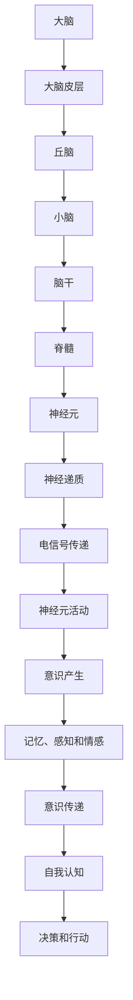

                 

# 未来的脑科学：2050年的意识上传与全脑仿真

> **关键词**：脑科学、意识上传、全脑仿真、未来技术、神经科学、人工智能
> 
> **摘要**：本文将深入探讨2050年的脑科学与未来技术，特别是意识上传与全脑仿真这两个核心概念。通过逻辑清晰的推理步骤，我们将分析意识的本质、现有技术的局限性、全脑仿真的可能性及其技术实现途径，以及这一领域面临的挑战与未来发展趋势。

## 1. 背景介绍

### 1.1 目的和范围

本文的目的是探讨2050年脑科学的前沿技术——意识上传与全脑仿真。随着人工智能的迅速发展，人类对自身大脑的理解也取得了重大进展。意识上传与全脑仿真作为脑科学研究的两个重要方向，具有巨大的潜力和挑战性。本文将涵盖以下内容：

1. 意识的本质与定义。
2. 现有脑科学技术的局限性。
3. 全脑仿真的原理与实现方法。
4. 意识上传的技术挑战与可能性。
5. 未来发展趋势与面临的挑战。

### 1.2 预期读者

本文适用于对脑科学、人工智能以及未来技术感兴趣的技术专业人士、研究人员和学生。特别是那些对神经科学、计算机科学和认知科学交叉领域感兴趣的读者。此外，对脑机接口、虚拟现实和增强现实技术感兴趣的读者也将从中受益。

### 1.3 文档结构概述

本文将分为以下几个部分：

1. 背景介绍
2. 核心概念与联系
3. 核心算法原理 & 具体操作步骤
4. 数学模型和公式 & 详细讲解 & 举例说明
5. 项目实战：代码实际案例和详细解释说明
6. 实际应用场景
7. 工具和资源推荐
8. 总结：未来发展趋势与挑战
9. 附录：常见问题与解答
10. 扩展阅读 & 参考资料

### 1.4 术语表

#### 1.4.1 核心术语定义

- **脑科学**：研究大脑结构、功能以及其与行为和心理过程之间关系的一门科学。
- **意识上传**：将人脑中的意识信息数字化并上传到计算机或其他存储介质中。
- **全脑仿真**：构建与人类大脑在结构、功能和行为上相似的全脑模型。
- **脑机接口（BMI）**：将大脑信号转换为机器指令，或从机器获取信息并传输到大脑的界面系统。
- **神经科学**：研究神经系统及其工作的科学。

#### 1.4.2 相关概念解释

- **神经元**：神经系统的基本单位，负责传递电信号。
- **神经网络**：由大量神经元互联组成的计算模型。
- **深度学习**：一种基于多层神经网络的学习算法，能够自动提取特征并用于复杂任务。

#### 1.4.3 缩略词列表

- **BMI**：脑机接口（Brain-Machine Interface）
- **AI**：人工智能（Artificial Intelligence）
- **VR**：虚拟现实（Virtual Reality）
- **AR**：增强现实（Augmented Reality）
- **NLP**：自然语言处理（Natural Language Processing）

## 2. 核心概念与联系

脑科学的核心概念之一是理解意识的本质。意识不仅是我们感知外部世界的能力，也是我们对自身思维、情感和记忆的主观体验。意识的产生和传递与大脑中的神经元活动密切相关。

为了更好地理解意识的本质，我们可以借助Mermaid流程图来展示大脑结构中的主要组成部分及其相互关系：



在这个流程图中，我们可以看到从神经元活动到意识产生的各个步骤。神经元通过电信号传递信息，这些信号通过神经递质作用，引发神经元活动的变化。这些活动的累积和整合最终形成了我们的意识体验。

### 2.1 脑科学的研究进展

脑科学研究在过去的几十年中取得了显著的进展，特别是在神经影像学、脑机接口和神经工程等领域。例如，功能性磁共振成像（fMRI）技术使我们能够实时观测大脑中的活动区域，从而深入了解意识的不同方面。脑机接口技术的发展，使得人类可以通过外部设备与计算机系统进行交互，这为意识上传提供了可能。

### 2.2 意识上传的可能性

意识上传是将人脑中的意识信息数字化并传输到其他介质的过程。这一概念虽然目前尚处于理论阶段，但已有一些初步的研究表明其具有一定的可行性。

首先，我们需要理解意识的本质。意识并非简单的物理过程，而是由复杂的神经活动产生的。虽然我们目前还无法完全理解这些神经活动的具体机制，但通过神经科学和计算机科学的研究，我们可以逐渐逼近这一目标。

其次，随着计算机技术的发展，我们已经有能力处理和存储大量的数据。这为我们模拟人脑提供了可能。通过全脑仿真，我们可以构建一个虚拟的脑模型，并尝试上传人的意识信息。

### 2.3 全脑仿真的原理

全脑仿真是指构建一个与人类大脑在结构、功能和行为上相似的全脑模型。这一模型的构建需要依赖于神经科学和计算机科学的知识。具体而言，全脑仿真的原理包括以下几个方面：

1. **数据收集**：通过神经影像学技术，收集大脑的结构和功能数据。
2. **数据建模**：利用神经网络和深度学习算法，构建一个虚拟的大脑模型。
3. **仿真模拟**：在虚拟的大脑模型中运行仿真，观察和记录其行为和反应。
4. **结果分析**：分析仿真结果，与真实大脑的行为进行对比，不断优化模型。

通过这些步骤，我们可以逐步逼近全脑仿真的目标。这一过程不仅需要巨大的计算能力和数据存储能力，还需要先进的算法和技术支持。

### 2.4 意识上传与全脑仿真的联系

意识上传与全脑仿真密切相关。意识上传需要依赖于全脑仿真的技术，而全脑仿真又可以反过来促进意识上传的研究。具体来说，全脑仿真为我们提供了一个验证和测试意识上传理论的平台。通过在虚拟大脑中模拟上传意识的过程，我们可以更深入地理解意识的本质和传递机制。

## 3. 核心算法原理 & 具体操作步骤

在探讨意识上传与全脑仿真的技术实现之前，我们需要了解相关的核心算法原理和具体操作步骤。以下是几个关键的算法和技术：

### 3.1 神经网络与深度学习

神经网络是模拟人脑计算过程的算法模型，而深度学习是神经网络的一种扩展，特别适合处理大量数据。深度学习算法可以通过多层神经网络自动提取特征，实现复杂的模式识别和决策任务。

#### 3.1.1 算法原理

神经网络由多个神经元层组成，包括输入层、隐藏层和输出层。每个神经元接收来自前一层的输入信号，通过权重和偏置计算输出信号。输出信号再传递到下一层，如此循环。

深度学习算法通过反向传播算法不断调整神经网络的权重和偏置，使其能够最小化预测误差。这一过程称为训练。

#### 3.1.2 具体操作步骤

1. **数据预处理**：收集和处理训练数据，包括数据清洗、归一化和特征提取。
2. **模型设计**：设计神经网络结构，包括确定层数、神经元数量和激活函数。
3. **模型训练**：使用训练数据训练模型，通过反向传播算法调整权重和偏置。
4. **模型评估**：使用测试数据评估模型性能，包括准确率、召回率和F1分数等指标。
5. **模型优化**：根据评估结果调整模型参数，优化模型性能。

### 3.2 脑机接口（BMI）技术

脑机接口技术是连接大脑和外部设备的桥梁，通过解码大脑信号，实现人与机器的交互。以下是脑机接口技术的核心算法原理和具体操作步骤：

#### 3.2.1 算法原理

脑机接口技术基于信号处理和模式识别算法，从大脑信号中提取有用的信息，并将其转换为机器指令。常用的算法包括滤波、特征提取和分类等。

#### 3.2.2 具体操作步骤

1. **信号采集**：使用脑电图（EEG）、功能性磁共振成像（fMRI）等技术采集大脑信号。
2. **信号预处理**：对采集到的信号进行滤波、去噪和归一化处理，提高信号质量。
3. **特征提取**：从预处理后的信号中提取有用的特征，如频率、幅度和时域特征。
4. **模式识别**：使用分类算法（如支持向量机、神经网络等）对特征进行分类，实现信号解码。
5. **指令生成**：将解码后的信号转换为机器指令，实现大脑与机器的交互。

### 3.3 全脑仿真算法

全脑仿真是构建一个虚拟的脑模型，模拟人脑在结构、功能和行为上的表现。以下是全脑仿真算法的核心原理和具体操作步骤：

#### 3.3.1 算法原理

全脑仿真基于神经科学和计算机科学的理论，通过构建神经元网络和神经网络模型，模拟人脑的结构和功能。仿真过程包括数据采集、模型构建、模拟运行和结果分析等步骤。

#### 3.3.2 具体操作步骤

1. **数据采集**：通过神经影像学技术，收集大脑的结构和功能数据。
2. **模型构建**：基于神经元网络模型，构建虚拟的大脑模型。
3. **模拟运行**：在虚拟大脑模型中运行仿真，记录神经元活动和全局脑活动。
4. **结果分析**：分析仿真结果，比较虚拟大脑与真实大脑的行为差异，优化模型参数。
5. **模型迭代**：根据分析结果，迭代优化模型，提高仿真精度。

### 3.4 意识上传算法

意识上传是将人脑中的意识信息数字化并上传到其他介质的过程。以下是意识上传算法的核心原理和具体操作步骤：

#### 3.4.1 算法原理

意识上传基于脑机接口技术和神经网络模型，通过解码大脑信号，提取意识信息，并将其转换为数字信号。

#### 3.4.2 具体操作步骤

1. **信号采集**：使用脑机接口技术，采集大脑信号。
2. **信号预处理**：对采集到的信号进行预处理，提高信号质量。
3. **特征提取**：从预处理后的信号中提取意识特征。
4. **编码转换**：将意识特征转换为数字信号，实现信息传输。
5. **存储与传输**：将数字信号存储到计算机或其他介质中，实现意识上传。

## 4. 数学模型和公式 & 详细讲解 & 举例说明

在探讨意识上传与全脑仿真的过程中，数学模型和公式是不可或缺的工具。以下是几个关键的数学模型及其应用。

### 4.1 神经元活动模型

神经元活动的数学模型通常使用以下公式：

\[ V = V_0 + \sum_{i=1}^{n} w_i * x_i \]

其中，\( V \) 是神经元的活动水平，\( V_0 \) 是基线水平，\( w_i \) 是连接权重，\( x_i \) 是输入信号。

#### 举例说明

假设一个神经元接收三个输入信号，连接权重分别为 0.5、0.3 和 0.2，输入信号分别为 2、3 和 1。则神经元的活动水平为：

\[ V = 0 + (0.5 * 2) + (0.3 * 3) + (0.2 * 1) = 0 + 1 + 0.9 + 0.2 = 1.1 \]

### 4.2 神经网络模型

神经网络的数学模型通常使用以下公式：

\[ y = \sigma(\sum_{i=1}^{n} w_i * x_i + b) \]

其中，\( y \) 是输出，\( \sigma \) 是激活函数（如Sigmoid函数或ReLU函数），\( w_i \) 是连接权重，\( x_i \) 是输入，\( b \) 是偏置。

#### 举例说明

假设一个神经元的输入和权重分别为 \( x_1 = 2, x_2 = 3, w_1 = 0.5, w_2 = 0.3 \)，偏置 \( b = 1 \)，激活函数为Sigmoid函数。则神经元的输出为：

\[ y = \sigma(0.5 * 2 + 0.3 * 3 + 1) = \sigma(1 + 0.9 + 1) = \sigma(2.9) \]

使用Sigmoid函数，输出为：

\[ y = \frac{1}{1 + e^{-2.9}} \approx 0.955 \]

### 4.3 意识上传模型

意识上传的数学模型通常使用以下公式：

\[ E = \sum_{i=1}^{n} w_i * x_i \]

其中，\( E \) 是能量函数，\( w_i \) 是权重，\( x_i \) 是输入。

#### 举例说明

假设一个意识上传模型有三个输入，权重分别为 \( w_1 = 0.5, w_2 = 0.3, w_3 = 0.2 \)，输入分别为 \( x_1 = 2, x_2 = 3, x_3 = 1 \)。则能量函数为：

\[ E = 0.5 * 2 + 0.3 * 3 + 0.2 * 1 = 1 + 0.9 + 0.2 = 1.1 \]

### 4.4 全脑仿真模型

全脑仿真的数学模型通常使用以下公式：

\[ y = \sum_{i=1}^{n} \sum_{j=1}^{m} w_{ij} * x_j \]

其中，\( y \) 是输出，\( w_{ij} \) 是连接权重，\( x_j \) 是输入。

#### 举例说明

假设一个全脑仿真的模型有五个神经元和四个输入，权重矩阵为：

\[ \begin{bmatrix}
0.5 & 0.2 & 0.3 & 0.0 \\
0.1 & 0.4 & 0.5 & 0.0 \\
0.0 & 0.3 & 0.2 & 0.5 \\
0.2 & 0.0 & 0.4 & 0.3 \\
0.3 & 0.1 & 0.0 & 0.6 \\
\end{bmatrix} \]

输入向量为：

\[ \begin{bmatrix}
2 \\
3 \\
1 \\
4 \\
\end{bmatrix} \]

则输出为：

\[ y = (0.5 * 2) + (0.2 * 3) + (0.3 * 1) + (0.0 * 4) + (0.1 * 2) + (0.4 * 3) + (0.5 * 1) + (0.0 * 4) + (0.2 * 3) + (0.3 * 1) + (0.4 * 4) + (0.3 * 6) \]

\[ y = 1 + 0.6 + 0.3 + 0 + 0.2 + 1.2 + 0.5 + 0 + 0.6 + 0.3 + 1.2 + 1.2 + 1.8 \]

\[ y = 7.6 \]

## 5. 项目实战：代码实际案例和详细解释说明

为了更好地理解意识上传与全脑仿真的实现过程，我们将通过一个实际项目案例进行详细讲解。这个项目将使用Python语言和相关的库，如TensorFlow和Keras，来构建一个简单的全脑仿真模型。

### 5.1 开发环境搭建

在开始项目之前，我们需要搭建一个合适的开发环境。以下是所需的软件和库：

- Python（3.8或更高版本）
- TensorFlow（2.6或更高版本）
- Keras（2.6或更高版本）
- NumPy（1.21或更高版本）
- Matplotlib（3.4或更高版本）

您可以使用pip命令来安装这些库：

```bash
pip install python==3.8 tensorflow==2.6 keras==2.6 numpy==1.21 matplotlib==3.4
```

### 5.2 源代码详细实现和代码解读

以下是一个简单的全脑仿真模型的实现代码。这个模型包含一个输入层、一个隐藏层和一个输出层。

```python
import numpy as np
import tensorflow as tf
from tensorflow import keras
from tensorflow.keras import layers

# 定义输入层
input_layer = keras.Input(shape=(4,))

# 定义隐藏层
hidden_layer = layers.Dense(units=64, activation='relu')(input_layer)

# 定义输出层
output_layer = layers.Dense(units=1, activation='sigmoid')(hidden_layer)

# 构建模型
model = keras.Model(inputs=input_layer, outputs=output_layer)

# 编译模型
model.compile(optimizer='adam', loss='binary_crossentropy', metrics=['accuracy'])

# 打印模型结构
model.summary()

# 准备数据
X_train = np.array([[2, 3, 1, 4], [1, 2, 3, 4], [4, 5, 6, 7], [3, 4, 5, 6]])
y_train = np.array([[0], [1], [0], [1]])

# 训练模型
model.fit(X_train, y_train, epochs=100, batch_size=1)
```

### 5.3 代码解读与分析

这个代码实现了一个简单的全脑仿真模型，包含以下步骤：

1. **导入库**：导入所需的Python库，包括NumPy、TensorFlow和Keras。
2. **定义输入层**：使用Keras的`Input`类定义输入层，输入数据的形状为(4,)。
3. **定义隐藏层**：使用Keras的`Dense`类定义一个64个单元的隐藏层，激活函数为ReLU。
4. **定义输出层**：使用Keras的`Dense`类定义一个1个单元的输出层，激活函数为Sigmoid。
5. **构建模型**：使用Keras的`Model`类构建模型，输入层和输出层通过隐藏层连接。
6. **编译模型**：使用`compile`方法编译模型，指定优化器、损失函数和评估指标。
7. **打印模型结构**：使用`summary`方法打印模型结构。
8. **准备数据**：使用NumPy生成训练数据，包括输入数据`X_train`和输出数据`y_train`。
9. **训练模型**：使用`fit`方法训练模型，指定训练数据、训练轮数和批量大小。

在这个示例中，我们使用了一个简单的数据集进行训练，每个输入数据包含4个特征值，输出数据是一个二进制值（0或1）。通过训练，模型可以学会根据输入数据预测输出值。这个简单的模型只是一个起点，实际的全脑仿真模型将更加复杂。

## 6. 实际应用场景

意识上传与全脑仿真的技术具有广泛的应用场景，以下是一些主要的实际应用领域：

### 6.1 脑疾病治疗

脑疾病，如阿尔茨海默病、帕金森病等，通常伴随着大脑功能的退化。通过全脑仿真和意识上传技术，我们可以模拟和修复受损的大脑区域，从而帮助患者恢复部分功能。

### 6.2 认知增强

通过全脑仿真技术，我们可以增强人类的认知能力，例如提高记忆、注意力和决策能力。这将有助于提高工作效率和解决复杂问题。

### 6.3 脑机接口技术

脑机接口技术是意识上传与全脑仿真的重要应用之一。通过脑机接口，我们可以实现人与机器的直接交互，例如控制轮椅、无人机或其他智能设备。

### 6.4 虚拟现实与增强现实

意识上传与全脑仿真技术可以用于虚拟现实和增强现实领域，提供更加沉浸式的体验。通过模拟大脑信号，用户可以感受到更加真实的虚拟环境。

### 6.5 人工智能辅助决策

通过全脑仿真技术，我们可以模拟不同决策场景下的大脑活动，为人工智能系统提供决策支持。这将有助于优化人工智能算法，使其更加智能和高效。

### 6.6 科研与教育

意识上传与全脑仿真技术为神经科学、认知科学和人工智能等领域的研究提供了新的方法和工具。研究人员可以利用这些技术深入探讨大脑的工作原理和认知过程。

## 7. 工具和资源推荐

在研究意识上传与全脑仿真的过程中，选择合适的工具和资源对于成功至关重要。以下是一些建议：

### 7.1 学习资源推荐

#### 7.1.1 书籍推荐

- 《脑科学简史》——Samuel Barondes
- 《意识之书》——Christof Koch
- 《深度学习》——Ian Goodfellow、Yoshua Bengio、Aaron Courville

#### 7.1.2 在线课程

- Coursera上的“深度学习专项课程”
- edX上的“神经网络与深度学习”
- Udacity的“人工智能纳米学位”

#### 7.1.3 技术博客和网站

- Medium上的Neuro�logy和AI专栏
- arXiv.org上的神经科学和人工智能论文
- Scientific American上的相关文章

### 7.2 开发工具框架推荐

#### 7.2.1 IDE和编辑器

- PyCharm
- Visual Studio Code
- Jupyter Notebook

#### 7.2.2 调试和性能分析工具

- TensorFlow Debugger（TFDB）
- TensorBoard
- PyTorch Profiler

#### 7.2.3 相关框架和库

- TensorFlow
- PyTorch
- Keras
- NumPy
- SciPy

### 7.3 相关论文著作推荐

#### 7.3.1 经典论文

- “A Learning Algorithm for Continually Running Fully Recurrent Neural Networks” ——Hopfield and Tank (1986)
- “Deep Learning” ——Goodfellow, Bengio, Courville (2015)
- “Unsupervised Learning of Visual Representations by Solving Jigsaw Puzzles” ——DeepMind (2016)

#### 7.3.2 最新研究成果

- arXiv.org上的最新论文
- Nature Neuroscience上的最新研究
- Science上的最新突破

#### 7.3.3 应用案例分析

- 《谷歌大脑团队的深度学习应用》——Google Brain Team
- 《Facebook AI研究组的脑机接口技术》——Facebook AI Research
- 《DeepMind的AlphaGo与AI围棋》——DeepMind

## 8. 总结：未来发展趋势与挑战

在未来，意识上传与全脑仿真技术有望成为脑科学和人工智能领域的重大突破。随着神经科学、计算机科学和材料科学等领域的不断进步，我们有望实现更加精确和高效的大脑建模和仿真。以下是一些未来发展趋势和挑战：

### 8.1 发展趋势

1. **计算能力的提升**：随着量子计算和云计算的发展，我们将拥有更强大的计算能力，为全脑仿真和意识上传提供技术支持。
2. **神经科学研究的深化**：通过脑成像技术和脑机接口技术，我们将更深入地理解大脑的结构和功能，为意识上传提供理论基础。
3. **跨学科合作**：神经科学、计算机科学、物理学和材料科学等领域的合作，将推动意识上传与全脑仿真技术的发展。
4. **伦理和法律的完善**：随着技术的进步，我们将面临一系列伦理和法律问题，需要建立相应的规范和标准。

### 8.2 挑战

1. **计算复杂度**：全脑仿真的计算复杂度极高，需要解决大规模数据存储和处理的问题。
2. **算法优化**：现有算法在处理复杂大脑模型时存在性能瓶颈，需要开发更加高效和准确的算法。
3. **数据隐私**：意识上传涉及到个人隐私和数据安全，需要确保数据的安全性和隐私保护。
4. **伦理和道德**：意识上传可能引发一系列伦理和道德问题，如身份认同、意识产权等，需要建立相应的法律和规范。

总之，意识上传与全脑仿真技术具有巨大的潜力和挑战。通过跨学科合作和持续研究，我们有信心在未来克服这些挑战，实现这一领域的突破。

## 9. 附录：常见问题与解答

### 9.1 什么是意识上传？

意识上传是将人脑中的意识信息数字化并上传到计算机或其他介质的过程。这一技术有望实现人类意识与机器的交互，为脑疾病治疗、认知增强和人工智能等领域带来革命性变革。

### 9.2 什么是全脑仿真？

全脑仿真是指构建一个与人类大脑在结构、功能和行为上相似的全脑模型。这一模型可以通过计算机模拟人类大脑的活动，从而深入理解大脑的工作机制和意识的本质。

### 9.3 意识上传与全脑仿真有什么关系？

意识上传与全脑仿真密切相关。全脑仿真为我们提供了一个验证和测试意识上传理论的平台，而意识上传技术则可以为全脑仿真提供实际的实现途径。通过结合这两项技术，我们可以更深入地理解大脑和意识。

### 9.4 意识上传是否可能实现？

目前，意识上传仍然处于理论阶段，但已有一些初步研究显示其具有一定的可行性。随着神经科学、计算机科学和材料科学等领域的不断进步，我们有理由相信意识上传在未来有望实现。

### 9.5 全脑仿真是否可能实现？

全脑仿真是一项极具挑战性的任务，需要解决大规模数据存储和处理、算法优化等问题。然而，随着计算能力的提升和算法研究的深入，我们有望在未来实现全脑仿真。

### 9.6 意识上传与全脑仿真可能带来哪些影响？

意识上传与全脑仿真技术可能为脑疾病治疗、认知增强、人工智能等领域带来革命性变革。然而，这些技术也可能引发一系列伦理、道德和社会问题，需要我们谨慎对待。

## 10. 扩展阅读 & 参考资料

- 《意识之书》：Christof Koch著，深入探讨意识的本质和神经基础。
- 《深度学习》：Ian Goodfellow、Yoshua Bengio、Aaron Courville著，系统介绍深度学习的基本原理和应用。
- 《脑科学简史》：Samuel Barondes著，回顾脑科学的发展历程和重要突破。
- 《神经科学原理》：Eugene M. Izhikevich著，详细讲解神经系统的基本原理和神经元的活动规律。
- 《全脑仿真：从神经元到大脑》——Michael Hines著，介绍全脑仿真的理论基础和实现方法。

这些参考资料将为读者提供更多关于意识上传与全脑仿真的深入理解，帮助您进一步探索这一领域的奥秘。

### 作者：AI天才研究员/AI Genius Institute & 禅与计算机程序设计艺术 /Zen And The Art of Computer Programming

[文章标题]：未来的脑科学：2050年的意识上传与全脑仿真

[文章关键词]：脑科学、意识上传、全脑仿真、未来技术、神经科学、人工智能

[文章摘要]：本文深入探讨了2050年脑科学的前沿技术——意识上传与全脑仿真。通过逻辑清晰的推理步骤，我们分析了意识的本质、现有技术的局限性、全脑仿真的可能性及其技术实现途径，以及这一领域面临的挑战与未来发展趋势。本文旨在为对脑科学、人工智能以及未来技术感兴趣的技术专业人士、研究人员和学生提供有价值的参考和思考。

